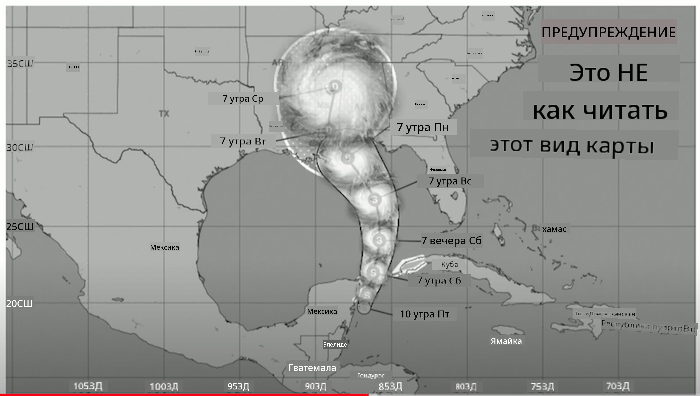
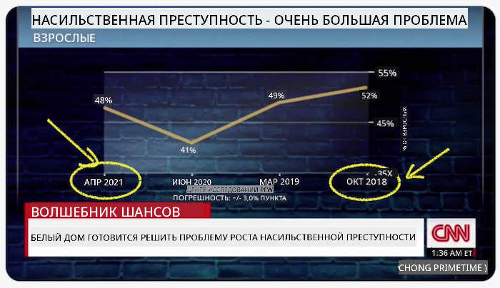
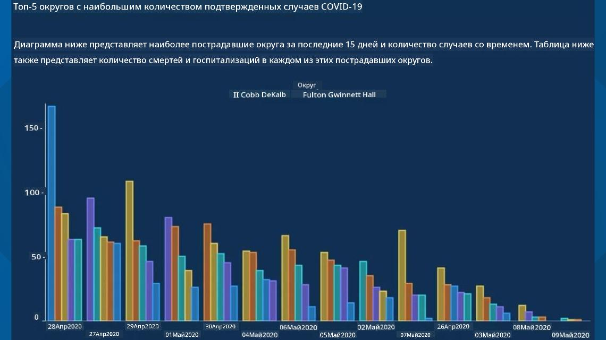
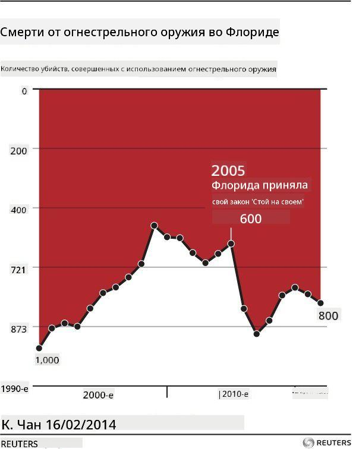
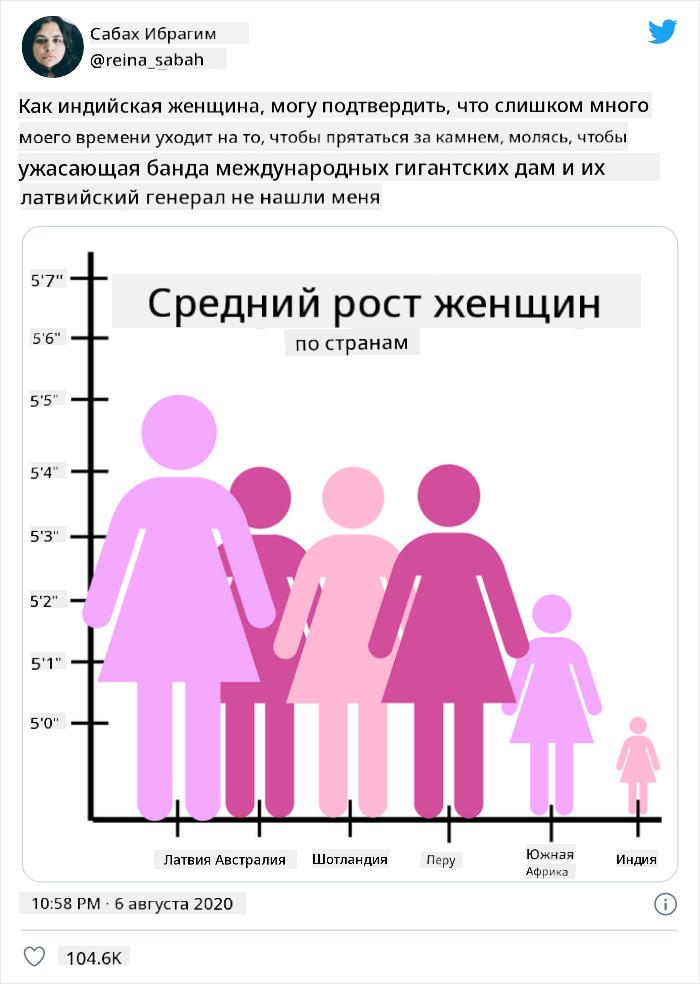
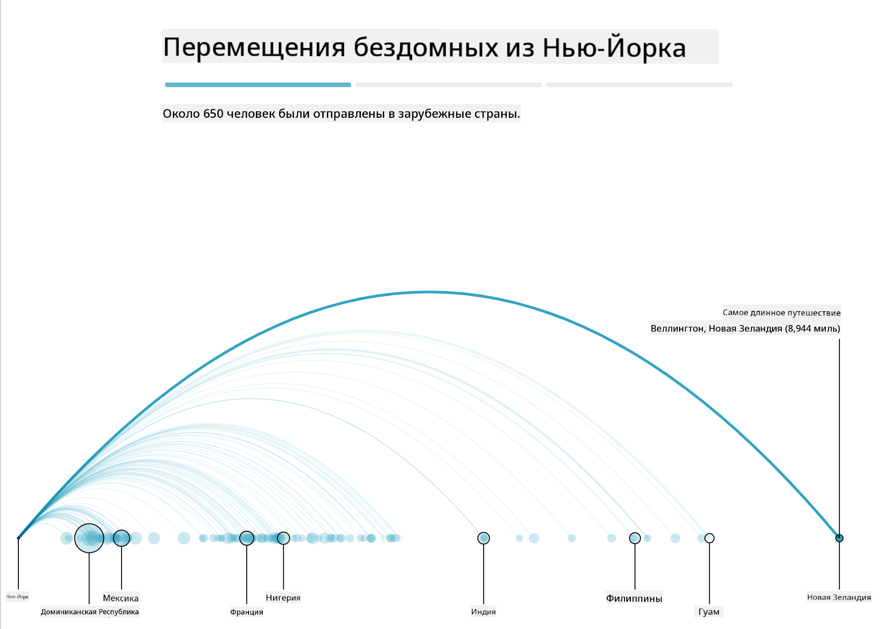
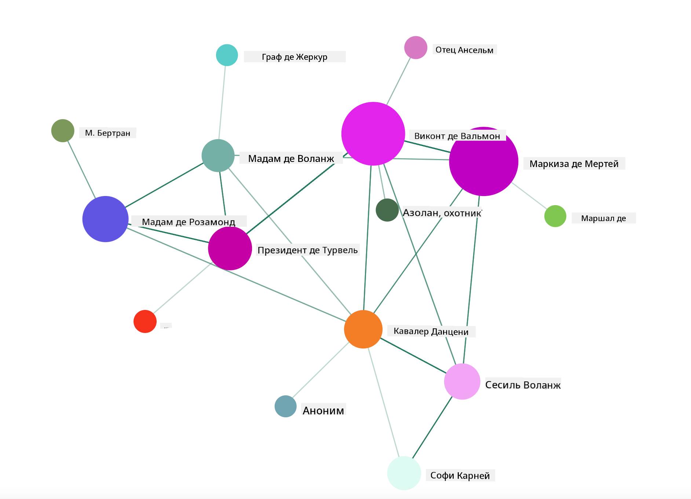

<!--
CO_OP_TRANSLATOR_METADATA:
{
  "original_hash": "4ec4747a9f4f7d194248ea29903ae165",
  "translation_date": "2025-08-27T10:07:09+00:00",
  "source_file": "3-Data-Visualization/13-meaningful-visualizations/README.md",
  "language_code": "ru"
}
-->
# Создание значимых визуализаций

|](../../sketchnotes/13-MeaningfulViz.png)|
|:---:|
| Значимые визуализации - _Скетчноут от [@nitya](https://twitter.com/nitya)_ |

> "Если достаточно долго мучить данные, они признаются в чем угодно" -- [Рональд Коуз](https://en.wikiquote.org/wiki/Ronald_Coase)

Одним из базовых навыков дата-сайентиста является способность создавать значимые визуализации данных, которые помогают отвечать на возникающие вопросы. Перед тем как визуализировать данные, необходимо убедиться, что они были очищены и подготовлены, как вы делали в предыдущих уроках. После этого можно начинать решать, как лучше всего представить данные.

В этом уроке вы изучите:

1. Как выбрать правильный тип графика
2. Как избежать обманчивых визуализаций
3. Как работать с цветом
4. Как стилизовать графики для удобства чтения
5. Как создавать анимированные или 3D-решения для графиков
6. Как создавать креативные визуализации

## [Тест перед лекцией](https://purple-hill-04aebfb03.1.azurestaticapps.net/quiz/24)

## Выбор правильного типа графика

В предыдущих уроках вы экспериментировали с созданием различных интересных визуализаций данных, используя Matplotlib и Seaborn для построения графиков. В общем случае, вы можете выбрать [правильный тип графика](https://chartio.com/learn/charts/how-to-select-a-data-vizualization/) для ответа на ваш вопрос, используя эту таблицу:

| Вам нужно:                 | Вам следует использовать:       |
| -------------------------- | ------------------------------- |
| Показать тренды данных во времени | Линейный график             |
| Сравнить категории         | Столбчатый, Круговой            |
| Сравнить общие значения     | Круговой, Сложенный столбчатый  |
| Показать взаимосвязи       | Точечный, Линейный, Фасетный, Двойной линейный |
| Показать распределения     | Точечный, Гистограмма, Ящик     |
| Показать пропорции         | Круговой, Донат, Вафельный      |

> ✅ В зависимости от структуры ваших данных, возможно, потребуется преобразовать их из текстового формата в числовой, чтобы поддерживать определенный тип графика.

## Избегайте обмана

Даже если дата-сайентист тщательно выбирает правильный график для данных, существует множество способов представить данные так, чтобы доказать определенную точку зрения, часто в ущерб самим данным. Существует множество примеров обманчивых графиков и инфографики!

[](https://www.youtube.com/watch?v=oX74Nge8Wkw "Как графики обманывают")

> 🎥 Нажмите на изображение выше, чтобы посмотреть конференцию о обманчивых графиках

Этот график переворачивает ось X, чтобы показать противоположное истине, основываясь на дате:



[Этот график](https://media.firstcoastnews.com/assets/WTLV/images/170ae16f-4643-438f-b689-50d66ca6a8d8/170ae16f-4643-438f-b689-50d66ca6a8d8_1140x641.jpg) еще более обманчив, так как взгляд притягивается к правой стороне, создавая впечатление, что со временем случаи COVID снизились в различных округах. Однако, если внимательно посмотреть на даты, можно заметить, что они были переставлены, чтобы создать этот обманчивый нисходящий тренд.



Этот известный пример использует цвет И перевернутую ось Y, чтобы ввести в заблуждение: вместо того чтобы сделать вывод, что количество смертей от оружия резко возросло после принятия законодательства, благоприятного для оружия, взгляд обманчиво заставляет думать, что произошло обратное:



Этот странный график показывает, как пропорции могут быть манипулированы, что выглядит комично:



Сравнение несравнимого — еще один сомнительный прием. Существует [замечательный веб-сайт](https://tylervigen.com/spurious-correlations), посвященный "ложным корреляциям", демонстрирующий "факты", связывающие, например, уровень разводов в штате Мэн и потребление маргарина. Группа на Reddit также собирает [некрасивые примеры](https://www.reddit.com/r/dataisugly/top/?t=all) использования данных.

Важно понимать, как легко взгляд может быть обманут обманчивыми графиками. Даже если намерения дата-сайентиста хороши, выбор неподходящего типа графика, например кругового графика с слишком большим количеством категорий, может быть обманчивым.

## Цвет

Вы видели на графике "Флоридское насилие с применением оружия", как цвет может добавить дополнительный слой смысла к графикам, особенно тем, которые не созданы с использованием библиотек, таких как Matplotlib и Seaborn, которые предлагают различные проверенные цветовые палитры. Если вы создаете график вручную, изучите немного [теорию цвета](https://colormatters.com/color-and-design/basic-color-theory).

> ✅ Помните, что при создании графиков доступность является важным аспектом визуализации. Некоторые ваши пользователи могут быть дальтониками — хорошо ли ваш график отображается для пользователей с нарушениями зрения?

Будьте осторожны при выборе цветов для вашего графика, так как цвет может передавать смысл, который вы не намеревались. "Розовые дамы" на графике "роста" выше передают явно "женственное" значение, что добавляет странности самому графику.

Хотя [значение цвета](https://colormatters.com/color-symbolism/the-meanings-of-colors) может различаться в разных частях мира и изменяться в зависимости от оттенка, в общем случае значения цветов включают:

| Цвет   | Значение            |
| ------ | ------------------- |
| красный | сила                |
| синий   | доверие, лояльность |
| желтый  | счастье, осторожность |
| зеленый | экология, удача, зависть |
| фиолетовый | счастье           |
| оранжевый | яркость            |

Если вам поручено создать график с пользовательскими цветами, убедитесь, что ваши графики доступны и выбранный цвет соответствует смыслу, который вы хотите передать.

## Стилизация графиков для удобства чтения

Графики не имеют смысла, если их невозможно прочитать! Уделите время тому, чтобы настроить ширину и высоту вашего графика так, чтобы он хорошо масштабировался с вашими данными. Если необходимо отобразить одну переменную (например, все 50 штатов), покажите их вертикально на оси Y, если это возможно, чтобы избежать горизонтальной прокрутки графика.

Подписывайте оси, предоставляйте легенду, если это необходимо, и предлагайте всплывающие подсказки для лучшего понимания данных.

Если ваши данные текстовые и содержат длинные подписи на оси X, вы можете наклонить текст для лучшей читаемости. [Matplotlib](https://matplotlib.org/stable/tutorials/toolkits/mplot3d.html) предлагает 3D-построение графиков, если ваши данные это поддерживают. Сложные визуализации данных можно создавать с использованием `mpl_toolkits.mplot3d`.


## Анимация и отображение 3D-графиков

Некоторые из лучших визуализаций данных сегодня являются анимированными. Ширли Ву создала потрясающие примеры с использованием D3, такие как '[цветы фильмов](http://bl.ocks.org/sxywu/raw/d612c6c653fb8b4d7ff3d422be164a5d/)', где каждый цветок представляет собой визуализацию фильма. Другой пример для Guardian — 'bussed out', интерактивный опыт, объединяющий визуализации с Greensock и D3, а также формат статьи с прокруткой, чтобы показать, как Нью-Йорк решает проблему бездомных, отправляя людей из города.



> "Bussed Out: Как Америка перемещает своих бездомных" от [Guardian](https://www.theguardian.com/us-news/ng-interactive/2017/dec/20/bussed-out-america-moves-homeless-people-country-study). Визуализации Надии Бремер и Ширли Ву

Хотя этот урок недостаточен для глубокого изучения этих мощных библиотек визуализации, попробуйте использовать D3 в приложении Vue.js, чтобы создать визуализацию книги "Опасные связи" как анимированную социальную сеть.

> "Опасные связи" — это эпистолярный роман, представленный в виде серии писем. Написанный в 1782 году Шодерло де Лакло, он рассказывает историю жестоких, морально банкротных социальных маневров двух соперничающих главных героев французской аристократии конца XVIII века, виконта де Вальмона и маркизы де Мертей. Оба в конце концов погибают, но не без нанесения значительного социального ущерба. Роман разворачивается как серия писем, написанных различным людям из их круга, с целью мести или просто для создания проблем. Создайте визуализацию этих писем, чтобы обнаружить главных "королей" повествования визуально.

Вы завершите веб-приложение, которое будет отображать анимированный вид этой социальной сети. Оно использует библиотеку, созданную для [визуализации сети](https://github.com/emiliorizzo/vue-d3-network) с использованием Vue.js и D3. Когда приложение запущено, вы можете перемещать узлы на экране, чтобы перетасовать данные.



## Проект: Создание графика для отображения сети с использованием D3.js

> В папке урока есть папка `solution`, где вы можете найти завершенный проект для справки.

1. Следуйте инструкциям в файле README.md в корневой папке стартового проекта. Убедитесь, что у вас установлены NPM и Node.js перед установкой зависимостей проекта.

2. Откройте папку `starter/src`. Вы найдете папку `assets`, где находится .json файл со всеми письмами из романа, пронумерованными, с аннотациями "кому" и "от кого".

3. Завершите код в `components/Nodes.vue`, чтобы включить визуализацию. Найдите метод `createLinks()` и добавьте следующий вложенный цикл.

Пройдите через объект .json, чтобы захватить данные "кому" и "от кого" для писем и создать объект `links`, чтобы библиотека визуализации могла его использовать:

```javascript
//loop through letters
      let f = 0;
      let t = 0;
      for (var i = 0; i < letters.length; i++) {
          for (var j = 0; j < characters.length; j++) {
              
            if (characters[j] == letters[i].from) {
              f = j;
            }
            if (characters[j] == letters[i].to) {
              t = j;
            }
        }
        this.links.push({ sid: f, tid: t });
      }
  ```

Запустите приложение из терминала (npm run serve) и наслаждайтесь визуализацией!

## 🚀 Задание

Исследуйте интернет, чтобы найти обманчивые визуализации. Как автор вводит пользователя в заблуждение, и было ли это намеренно? Попробуйте исправить визуализации, чтобы показать, как они должны выглядеть.

## [Тест после лекции](https://purple-hill-04aebfb03.1.azurestaticapps.net/quiz/25)

## Обзор и самостоятельное изучение

Вот несколько статей о обманчивых визуализациях данных:

https://gizmodo.com/how-to-lie-with-data-visualization-1563576606

http://ixd.prattsi.org/2017/12/visual-lies-usability-in-deceptive-data-visualizations/

Посмотрите эти интересные визуализации исторических объектов и артефактов:

https://handbook.pubpub.org/

Изучите эту статью о том, как анимация может улучшить ваши визуализации:

https://medium.com/@EvanSinar/use-animation-to-supercharge-data-visualization-cd905a882ad4

## Задание

[Создайте свою собственную визуализацию](assignment.md)

---

**Отказ от ответственности**:  
Этот документ был переведен с использованием сервиса автоматического перевода [Co-op Translator](https://github.com/Azure/co-op-translator). Хотя мы стремимся к точности, пожалуйста, имейте в виду, что автоматические переводы могут содержать ошибки или неточности. Оригинальный документ на его исходном языке следует считать авторитетным источником. Для получения критически важной информации рекомендуется профессиональный перевод человеком. Мы не несем ответственности за любые недоразумения или неправильные интерпретации, возникшие в результате использования данного перевода.