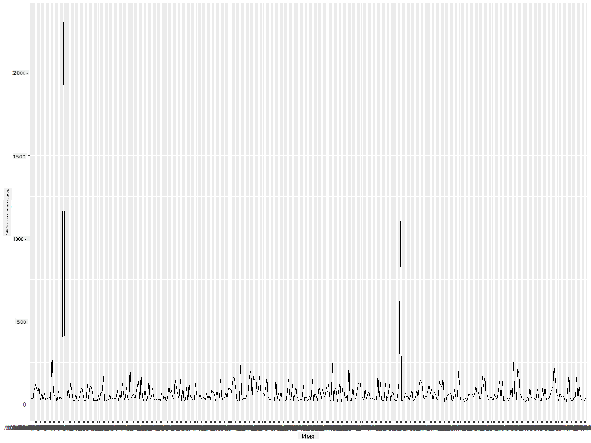
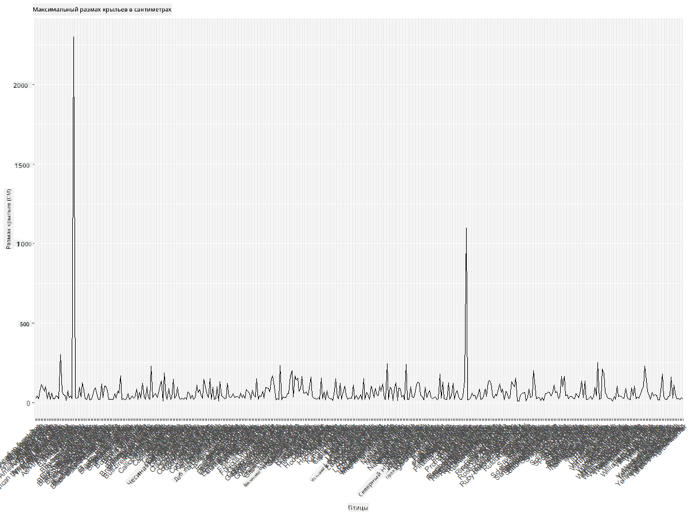
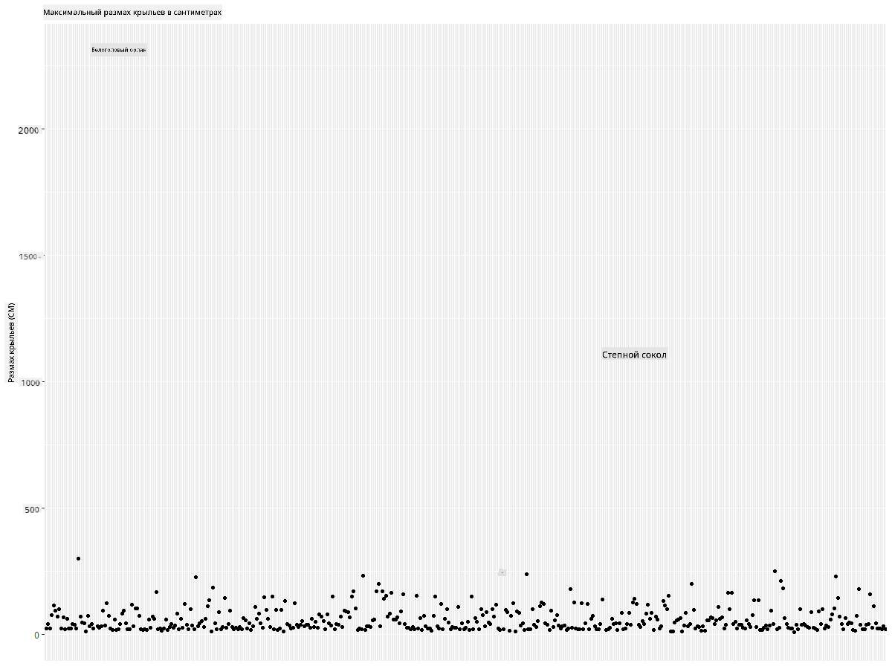
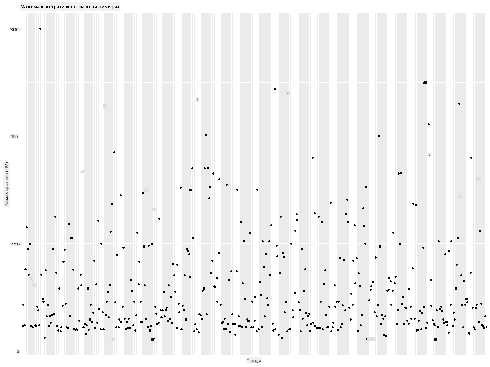
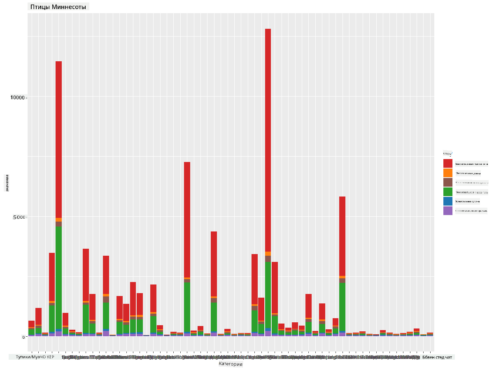
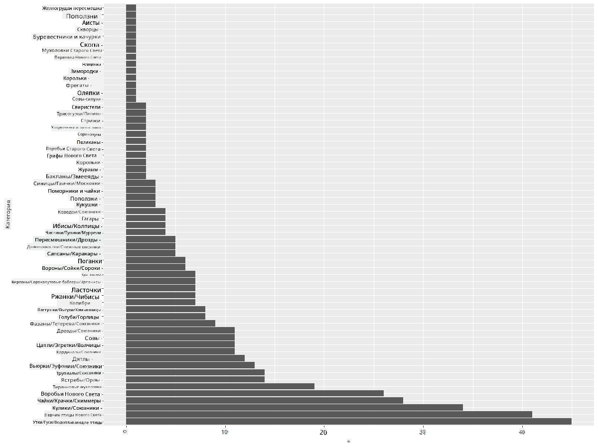
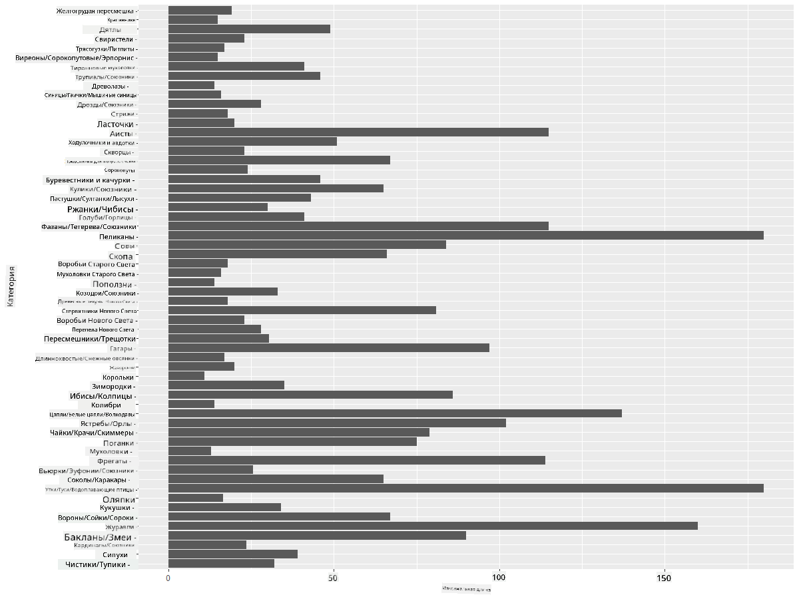
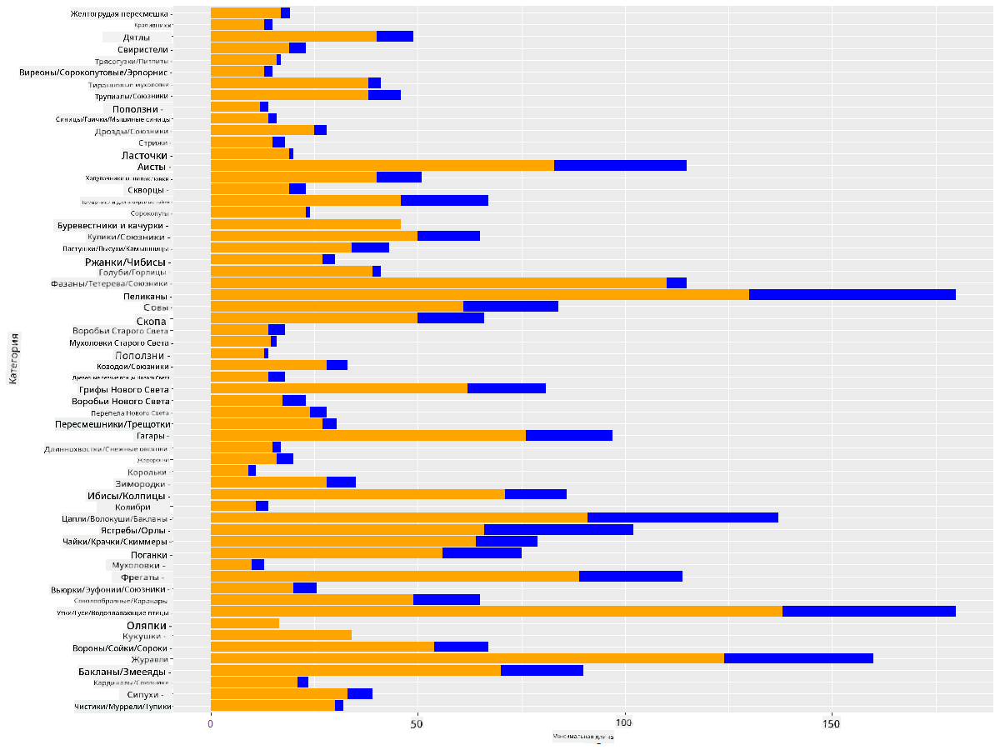

<!--
CO_OP_TRANSLATOR_METADATA:
{
  "original_hash": "22acf28f518a4769ea14fa42f4734b9f",
  "translation_date": "2025-08-27T10:29:24+00:00",
  "source_file": "3-Data-Visualization/R/09-visualization-quantities/README.md",
  "language_code": "ru"
}
-->
# Визуализация количеств
|](https://github.com/microsoft/Data-Science-For-Beginners/blob/main/sketchnotes/09-Visualizing-Quantities.png)|
|:---:|
| Визуализация количеств - _Скетчноут от [@nitya](https://twitter.com/nitya)_ |

В этом уроке вы изучите, как использовать некоторые из множества доступных библиотек пакетов R для создания интересных визуализаций, связанных с концепцией количества. Используя очищенный набор данных о птицах Миннесоты, вы сможете узнать много интересного о местной дикой природе.  
## [Тест перед лекцией](https://purple-hill-04aebfb03.1.azurestaticapps.net/quiz/16)

## Наблюдение за размахом крыльев с помощью ggplot2
Отличной библиотекой для создания как простых, так и сложных графиков и диаграмм различных типов является [ggplot2](https://cran.r-project.org/web/packages/ggplot2/index.html). В общем, процесс построения графиков с использованием этих библиотек включает в себя определение частей вашего датафрейма, которые вы хотите использовать, выполнение необходимых преобразований данных, назначение значений осей x и y, выбор типа графика и его отображение.

`ggplot2` — это система для декларативного создания графики, основанная на "Грамматике графики". [Грамматика графики](https://en.wikipedia.org/wiki/Ggplot2) — это общая схема визуализации данных, которая разбивает графики на семантические компоненты, такие как шкалы и слои. Другими словами, простота создания графиков для унивариантных или многовариантных данных с минимальным количеством кода делает `ggplot2` самым популярным пакетом для визуализации в R. Пользователь указывает `ggplot2`, как сопоставить переменные с эстетикой, какие графические примитивы использовать, а `ggplot2` берет на себя остальное.

> ✅ График = Данные + Эстетика + Геометрия  
> - Данные относятся к набору данных  
> - Эстетика указывает переменные для изучения (переменные x и y)  
> - Геометрия относится к типу графика (линейный график, столбчатая диаграмма и т. д.)

Выберите подходящую геометрию (тип графика) в зависимости от ваших данных и истории, которую вы хотите рассказать с помощью графика.

> - Для анализа трендов: линейный график, столбчатая диаграмма  
> - Для сравнения значений: столбчатая диаграмма, круговая диаграмма, точечный график  
> - Для отображения частей целого: круговая диаграмма  
> - Для отображения распределения данных: точечный график, столбчатая диаграмма  
> - Для отображения взаимосвязей между значениями: линейный график, точечный график, пузырьковая диаграмма  

✅ Вы также можете ознакомиться с этим описательным [шпаргалкой](https://nyu-cdsc.github.io/learningr/assets/data-visualization-2.1.pdf) для ggplot2.

## Построение линейного графика значений размаха крыльев птиц

Откройте консоль R и импортируйте набор данных.  
> Примечание: Набор данных находится в корне этого репозитория в папке `/data`.

Давайте импортируем набор данных и посмотрим на его начало (первые 5 строк).

```r
birds <- read.csv("../../data/birds.csv",fileEncoding="UTF-8-BOM")
head(birds)
```  
Начало данных содержит смесь текста и чисел:

|      | Название                     | Научное название       | Категория             | Отряд        | Семейство | Род         | Статус сохранности | Мин. длина | Макс. длина | Мин. масса тела | Макс. масса тела | Мин. размах крыльев | Макс. размах крыльев |
| ---: | :--------------------------- | :--------------------- | :-------------------- | :----------- | :------- | :---------- | :----------------- | --------: | --------: | ----------: | ----------: | ----------: | ----------: |
|    0 | Чернобрюхий свистун          | Dendrocygna autumnalis | Утки/Гуси/Водоплавающие | Anseriformes | Anatidae | Dendrocygna | LC                 |        47 |        56 |         652 |        1020 |          76 |          94 |
|    1 | Рыжий свистун                | Dendrocygna bicolor    | Утки/Гуси/Водоплавающие | Anseriformes | Anatidae | Dendrocygna | LC                 |        45 |        53 |         712 |        1050 |          85 |          93 |
|    2 | Белый гусь                   | Anser caerulescens     | Утки/Гуси/Водоплавающие | Anseriformes | Anatidae | Anser       | LC                 |        64 |        79 |        2050 |        4050 |         135 |         165 |
|    3 | Гусь Росса                   | Anser rossii           | Утки/Гуси/Водоплавающие | Anseriformes | Anatidae | Anser       | LC                 |      57.3 |        64 |        1066 |        1567 |         113 |         116 |
|    4 | Большой белолобый гусь       | Anser albifrons        | Утки/Гуси/Водоплавающие | Anseriformes | Anatidae | Anser       | LC                 |        64 |        81 |        1930 |        3310 |         130 |         165 |

Давайте начнем с построения некоторых числовых данных, используя базовый линейный график. Предположим, вы хотите увидеть максимальный размах крыльев этих интересных птиц.

```r
install.packages("ggplot2")
library("ggplot2")
ggplot(data=birds, aes(x=Name, y=MaxWingspan,group=1)) +
  geom_line() 
```  
Здесь вы устанавливаете пакет `ggplot2`, а затем импортируете его в рабочую область с помощью команды `library("ggplot2")`. Для построения любого графика в ggplot используется функция `ggplot()`, где вы указываете набор данных, переменные x и y в качестве атрибутов. В данном случае мы используем функцию `geom_line()`, так как хотим построить линейный график.



Что вы замечаете сразу? Кажется, есть как минимум один выброс — это впечатляющий размах крыльев! Размах крыльев более 2000 сантиметров равен более чем 20 метрам — неужели в Миннесоте летают птеродактили? Давайте разберемся.

Хотя вы могли бы быстро отсортировать данные в Excel, чтобы найти эти выбросы, которые, вероятно, являются опечатками, продолжим процесс визуализации, работая с графиком.

Добавьте подписи к оси x, чтобы показать, о каких птицах идет речь:

```r
ggplot(data=birds, aes(x=Name, y=MaxWingspan,group=1)) +
  geom_line() +
  theme(axis.text.x = element_text(angle = 45, hjust=1))+
  xlab("Birds") +
  ylab("Wingspan (CM)") +
  ggtitle("Max Wingspan in Centimeters")
```  
Мы задаем угол в `theme` и указываем подписи осей x и y в `xlab()` и `ylab()` соответственно. Функция `ggtitle()` задает название графика.



Даже с поворотом подписей на 45 градусов их слишком много, чтобы прочитать. Попробуем другой подход: подпишем только выбросы и разместим подписи внутри графика. Вы можете использовать точечный график, чтобы освободить место для подписей:

```r
ggplot(data=birds, aes(x=Name, y=MaxWingspan,group=1)) +
  geom_point() +
  geom_text(aes(label=ifelse(MaxWingspan>500,as.character(Name),'')),hjust=0,vjust=0) + 
  theme(axis.title.x=element_blank(), axis.text.x=element_blank(), axis.ticks.x=element_blank())
  ylab("Wingspan (CM)") +
  ggtitle("Max Wingspan in Centimeters") + 
```  
Что здесь происходит? Вы использовали функцию `geom_point()` для построения точек. С ее помощью вы добавили подписи для птиц с `MaxWingspan > 500` и также скрыли подписи на оси x, чтобы уменьшить загроможденность графика.

Что вы обнаруживаете?



## Фильтрация данных

И белоголовый орлан, и луговой сокол, хотя, вероятно, очень крупные птицы, кажутся ошибочно помеченными, с добавленным лишним нулем к их максимальному размаху крыльев. Вряд ли вы встретите белоголового орлана с размахом крыльев 25 метров, но если это произойдет, пожалуйста, дайте нам знать! Давайте создадим новый датафрейм без этих двух выбросов:

```r
birds_filtered <- subset(birds, MaxWingspan < 500)

ggplot(data=birds_filtered, aes(x=Name, y=MaxWingspan,group=1)) +
  geom_point() +
  ylab("Wingspan (CM)") +
  xlab("Birds") +
  ggtitle("Max Wingspan in Centimeters") + 
  geom_text(aes(label=ifelse(MaxWingspan>500,as.character(Name),'')),hjust=0,vjust=0) +
  theme(axis.text.x=element_blank(), axis.ticks.x=element_blank())
```  
Мы создали новый датафрейм `birds_filtered`, а затем построили точечный график. Исключив выбросы, ваши данные стали более согласованными и понятными.



Теперь, когда у нас есть более чистый набор данных, по крайней мере, в отношении размаха крыльев, давайте узнаем больше об этих птицах.

Хотя линейные и точечные графики могут отображать информацию о значениях данных и их распределении, мы хотим подумать о значениях, содержащихся в этом наборе данных. Вы могли бы создать визуализации, чтобы ответить на следующие вопросы о количестве:

> Сколько категорий птиц существует и каково их количество?  
> Сколько птиц вымерло, находится под угрозой исчезновения, редких или обычных?  
> Сколько существует различных родов и отрядов в терминологии Линнея?  

## Изучение столбчатых диаграмм

Столбчатые диаграммы удобны, когда нужно показать группировку данных. Давайте изучим категории птиц, которые существуют в этом наборе данных, чтобы увидеть, какая из них наиболее распространена по количеству.  
Создадим столбчатую диаграмму на основе отфильтрованных данных.

```r
install.packages("dplyr")
install.packages("tidyverse")

library(lubridate)
library(scales)
library(dplyr)
library(ggplot2)
library(tidyverse)

birds_filtered %>% group_by(Category) %>%
  summarise(n=n(),
  MinLength = mean(MinLength),
  MaxLength = mean(MaxLength),
  MinBodyMass = mean(MinBodyMass),
  MaxBodyMass = mean(MaxBodyMass),
  MinWingspan=mean(MinWingspan),
  MaxWingspan=mean(MaxWingspan)) %>% 
  gather("key", "value", - c(Category, n)) %>%
  ggplot(aes(x = Category, y = value, group = key, fill = key)) +
  geom_bar(stat = "identity") +
  scale_fill_manual(values = c("#D62728", "#FF7F0E", "#8C564B","#2CA02C", "#1F77B4", "#9467BD")) +                   
  xlab("Category")+ggtitle("Birds of Minnesota")

```  
В следующем фрагменте мы устанавливаем пакеты [dplyr](https://www.rdocumentation.org/packages/dplyr/versions/0.7.8) и [lubridate](https://www.rdocumentation.org/packages/lubridate/versions/1.8.0), чтобы помочь манипулировать и группировать данные для построения составной столбчатой диаграммы. Сначала вы группируете данные по `Category` птиц, а затем суммируете столбцы `MinLength`, `MaxLength`, `MinBodyMass`, `MaxBodyMass`, `MinWingspan`, `MaxWingspan`. Затем строите столбчатую диаграмму с помощью пакета `ggplot2`, указывая цвета для разных категорий и подписи.



Эта столбчатая диаграмма, однако, нечитаема из-за слишком большого количества негруппированных данных. Вам нужно выбрать только те данные, которые вы хотите отобразить, поэтому давайте посмотрим на длину птиц в зависимости от их категории.

Отфильтруйте данные, чтобы включить только категорию птиц.

Поскольку категорий много, вы можете отобразить эту диаграмму вертикально и настроить ее высоту, чтобы учесть все данные:

```r
birds_count<-dplyr::count(birds_filtered, Category, sort = TRUE)
birds_count$Category <- factor(birds_count$Category, levels = birds_count$Category)
ggplot(birds_count,aes(Category,n))+geom_bar(stat="identity")+coord_flip()
```  
Сначала вы подсчитываете уникальные значения в столбце `Category`, а затем сортируете их в новый датафрейм `birds_count`. Эти отсортированные данные затем учитываются на том же уровне, чтобы они были построены в отсортированном порядке. Используя `ggplot2`, вы затем строите данные в виде столбчатой диаграммы. Функция `coord_flip()` строит горизонтальные столбцы.



Эта столбчатая диаграмма дает хороший обзор количества птиц в каждой категории. С первого взгляда видно, что наибольшее количество птиц в этом регионе относится к категории Утки/Гуси/Водоплавающие. Миннесота — это "земля 10,000 озер", так что это неудивительно!

✅ Попробуйте подсчитать что-нибудь еще в этом наборе данных. Вас что-нибудь удивит?

## Сравнение данных

Вы можете попробовать разные сравнения сгруппированных данных, создавая новые оси. Попробуйте сравнить MaxLength птицы в зависимости от ее категории:

```r
birds_grouped <- birds_filtered %>%
  group_by(Category) %>%
  summarise(
  MaxLength = max(MaxLength, na.rm = T),
  MinLength = max(MinLength, na.rm = T)
           ) %>%
  arrange(Category)
  
ggplot(birds_grouped,aes(Category,MaxLength))+geom_bar(stat="identity")+coord_flip()
```  
Мы группируем данные `birds_filtered` по `Category`, а затем строим столбчатую диаграмму.



Здесь ничего удивительного: колибри имеют наименьший MaxLength по сравнению с пеликанами или гусями. Хорошо, когда данные логически понятны!

Вы можете создавать более интересные визуализации столбчатых диаграмм, накладывая данные друг на друга. Давайте наложим минимальную и максимальную длину на заданную категорию птиц:

```r
ggplot(data=birds_grouped, aes(x=Category)) +
  geom_bar(aes(y=MaxLength), stat="identity", position ="identity",  fill='blue') +
  geom_bar(aes(y=MinLength), stat="identity", position="identity", fill='orange')+
  coord_flip()
```  


## 🚀 Задание

Этот набор данных о птицах предлагает множество информации о различных типах птиц в определенной экосистеме. Поискать в интернете другие наборы данных, связанные с птицами. Попрактикуйтесь в создании диаграмм и графиков, чтобы открыть для себя факты, о которых вы не подозревали.  
## [Тест после лекции](https://purple-hill-04aebfb03.1.azurestaticapps.net/quiz/17)

## Обзор и самостоятельное изучение

Этот первый урок дал вам некоторую информацию о том, как использовать `ggplot2` для визуализации количеств. Проведите исследование других способов работы с наборами данных для визуализации. Найдите и изучите наборы данных, которые вы могли бы визуализировать с помощью других пакетов, таких как [Lattice](https://stat.ethz.ch/R-manual/R-devel/library/lattice/html/Lattice.html) и [Plotly](https://github.com/plotly/plotly.R#readme).

## Задание  
[Линии, точки и столбцы](assignment.md)  

---

**Отказ от ответственности**:  
Этот документ был переведен с использованием сервиса автоматического перевода [Co-op Translator](https://github.com/Azure/co-op-translator). Хотя мы стремимся к точности, пожалуйста, имейте в виду, что автоматические переводы могут содержать ошибки или неточности. Оригинальный документ на его исходном языке следует считать авторитетным источником. Для получения критически важной информации рекомендуется профессиональный перевод человеком. Мы не несем ответственности за любые недоразумения или неправильные интерпретации, возникшие в результате использования данного перевода.