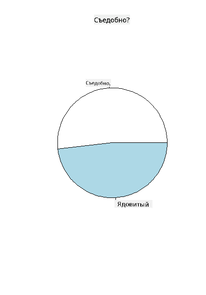
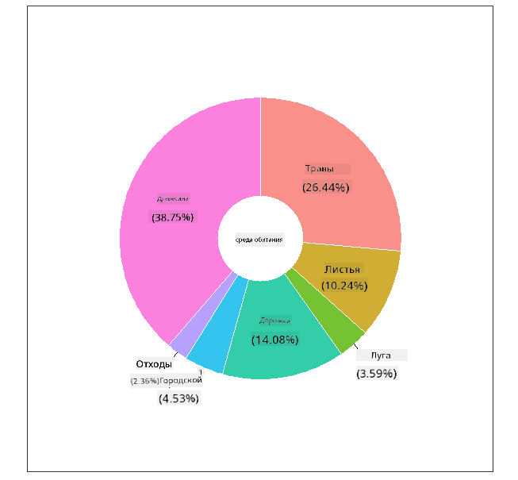
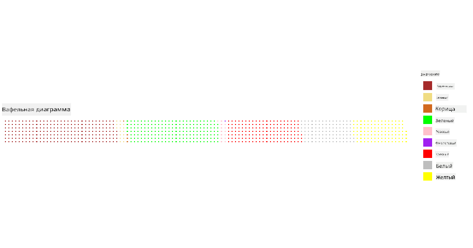

<!--
CO_OP_TRANSLATOR_METADATA:
{
  "original_hash": "47028abaaafa2bcb1079702d20569066",
  "translation_date": "2025-08-27T10:38:07+00:00",
  "source_file": "3-Data-Visualization/R/11-visualization-proportions/README.md",
  "language_code": "ru"
}
-->
# Визуализация пропорций

|](../../../sketchnotes/11-Visualizing-Proportions.png)|
|:---:|
|Визуализация пропорций - _Скетчноут от [@nitya](https://twitter.com/nitya)_ |

В этом уроке вы будете использовать другой набор данных, связанный с природой, чтобы визуализировать пропорции, например, сколько различных видов грибов содержится в заданном наборе данных о грибах. Давайте изучим эти удивительные грибы, используя набор данных, взятый из Audubon, который содержит информацию о 23 видах пластинчатых грибов из семейств Agaricus и Lepiota. Вы попробуете создать аппетитные визуализации, такие как:

- Круговые диаграммы 🥧
- Диаграммы в виде пончика 🍩
- Вафельные диаграммы 🧇

> 💡 Очень интересный проект [Charticulator](https://charticulator.com) от Microsoft Research предлагает бесплатный интерфейс для создания визуализаций данных методом перетаскивания. В одном из их учебных пособий также используется этот набор данных о грибах! Вы можете изучить данные и одновременно освоить библиотеку: [Учебное пособие Charticulator](https://charticulator.com/tutorials/tutorial4.html).

## [Тест перед лекцией](https://purple-hill-04aebfb03.1.azurestaticapps.net/quiz/20)

## Узнайте больше о грибах 🍄

Грибы — это очень интересный объект для изучения. Давайте импортируем набор данных, чтобы изучить их:

```r
mushrooms = read.csv('../../data/mushrooms.csv')
head(mushrooms)
```
На экране появляется таблица с отличными данными для анализа:


| class     | cap-shape | cap-surface | cap-color | bruises | odor    | gill-attachment | gill-spacing | gill-size | gill-color | stalk-shape | stalk-root | stalk-surface-above-ring | stalk-surface-below-ring | stalk-color-above-ring | stalk-color-below-ring | veil-type | veil-color | ring-number | ring-type | spore-print-color | population | habitat |
| --------- | --------- | ----------- | --------- | ------- | ------- | --------------- | ------------ | --------- | ---------- | ----------- | ---------- | ------------------------ | ------------------------ | ---------------------- | ---------------------- | --------- | ---------- | ----------- | --------- | ----------------- | ---------- | ------- |
| Ядовитый  | Выпуклый  | Гладкий     | Коричневый| Синяки  | Резкий  | Свободный       | Близкий      | Узкий     | Черный     | Утолщающийся| Равный     | Гладкий                   | Гладкий                   | Белый                  | Белый                  | Частичный | Белый      | Один        | Свисающий | Черный            | Разбросанный| Городской|
| Съедобный | Выпуклый  | Гладкий     | Желтый    | Синяки  | Миндальный| Свободный      | Близкий      | Широкий   | Черный     | Утолщающийся| Клубень    | Гладкий                   | Гладкий                   | Белый                  | Белый                  | Частичный | Белый      | Один        | Свисающий | Коричневый        | Многочисленный| Травы   |
| Съедобный | Колокольчик| Гладкий    | Белый     | Синяки  | Анисовый | Свободный      | Близкий      | Широкий   | Коричневый | Утолщающийся| Клубень    | Гладкий                   | Гладкий                   | Белый                  | Белый                  | Частичный | Белый      | Один        | Свисающий | Коричневый        | Многочисленный| Луга    |
| Ядовитый  | Выпуклый  | Чешуйчатый  | Белый     | Синяки  | Резкий  | Свободный       | Близкий      | Узкий     | Коричневый | Утолщающийся| Равный     | Гладкий                   | Гладкий                   | Белый                  | Белый                  | Частичный | Белый      | Один        | Свисающий | Черный            | Разбросанный| Городской|
| Съедобный | Выпуклый  | Гладкий     | Зеленый   | Без синяков| Нет   | Свободный      | Переполненный| Широкий   | Черный     | Сужающийся | Равный     | Гладкий                   | Гладкий                   | Белый                  | Белый                  | Частичный | Белый      | Один        | Исчезающий| Коричневый        | Обильный    | Травы   |
| Съедобный | Выпуклый  | Чешуйчатый  | Желтый    | Синяки  | Миндальный| Свободный      | Близкий      | Широкий   | Коричневый | Утолщающийся| Клубень    | Гладкий                   | Гладкий                   | Белый                  | Белый                  | Частичный | Белый      | Один        | Свисающий | Черный            | Многочисленный| Травы   |

Сразу видно, что все данные представлены в текстовом виде. Чтобы использовать их в диаграмме, необходимо преобразовать данные. Большая часть данных представлена в виде объекта:

```r
names(mushrooms)
```

Результат:

```output
[1] "class"                    "cap.shape"               
 [3] "cap.surface"              "cap.color"               
 [5] "bruises"                  "odor"                    
 [7] "gill.attachment"          "gill.spacing"            
 [9] "gill.size"                "gill.color"              
[11] "stalk.shape"              "stalk.root"              
[13] "stalk.surface.above.ring" "stalk.surface.below.ring"
[15] "stalk.color.above.ring"   "stalk.color.below.ring"  
[17] "veil.type"                "veil.color"              
[19] "ring.number"              "ring.type"               
[21] "spore.print.color"        "population"              
[23] "habitat"            
```
Возьмите эти данные и преобразуйте столбец 'class' в категорию:

```r
library(dplyr)
grouped=mushrooms %>%
  group_by(class) %>%
  summarise(count=n())
```

Теперь, если вы выведете данные о грибах, вы увидите, что они сгруппированы по категориям в зависимости от класса (ядовитый/съедобный):
```r
View(grouped)
```

| class | count |
| --------- | --------- |
| Съедобный | 4208 |
| Ядовитый  | 3916 |

Если вы следуете порядку, представленному в этой таблице, чтобы создать метки категорий класса, вы можете построить круговую диаграмму.

## Круг!

```r
pie(grouped$count,grouped$class, main="Edible?")
```
Вуаля, круговая диаграмма, показывающая пропорции данных в соответствии с двумя классами грибов. Очень важно правильно указать порядок меток, особенно здесь, поэтому обязательно проверьте порядок, в котором создается массив меток!



## Пончики!

Более визуально интересной версией круговой диаграммы является диаграмма в виде пончика, которая представляет собой круговую диаграмму с отверстием в центре. Давайте посмотрим на наши данные с помощью этого метода.

Посмотрите на различные места обитания грибов:

```r
library(dplyr)
habitat=mushrooms %>%
  group_by(habitat) %>%
  summarise(count=n())
View(habitat)
```
Результат:
| habitat| count |
| --------- | --------- |
| Травы     | 2148 |
| Листья    | 832  |
| Луга      | 292  |
| Тропы     | 1144 |
| Городской | 368  |
| Отходы    | 192  |
| Деревья   | 3148 |

Здесь вы группируете данные по месту обитания. Всего их 7, поэтому используйте их в качестве меток для диаграммы в виде пончика:

```r
library(ggplot2)
library(webr)
PieDonut(habitat, aes(habitat, count=count))
```



Этот код использует две библиотеки - ggplot2 и webr. С помощью функции PieDonut из библиотеки webr можно легко создать диаграмму в виде пончика!

Диаграммы в виде пончика в R можно создавать, используя только библиотеку ggplot2. Вы можете узнать больше об этом [здесь](https://www.r-graph-gallery.com/128-ring-or-donut-plot.html) и попробовать сами.

Теперь, когда вы знаете, как группировать данные и отображать их в виде круговой или пончиковой диаграммы, вы можете изучить другие типы диаграмм. Попробуйте вафельную диаграмму, которая представляет собой другой способ изучения количества.

## Вафли!

Диаграмма типа "вафля" — это другой способ визуализации количеств в виде двумерного массива квадратов. Попробуйте визуализировать различные количества цветов шляпок грибов в этом наборе данных. Для этого вам нужно установить вспомогательную библиотеку [waffle](https://cran.r-project.org/web/packages/waffle/waffle.pdf) и использовать ее для создания визуализации:

```r
install.packages("waffle", repos = "https://cinc.rud.is")
```

Выберите сегмент данных для группировки:

```r
library(dplyr)
cap_color=mushrooms %>%
  group_by(cap.color) %>%
  summarise(count=n())
View(cap_color)
```

Создайте вафельную диаграмму, создав метки и сгруппировав данные:

```r
library(waffle)
names(cap_color$count) = paste0(cap_color$cap.color)
waffle((cap_color$count/10), rows = 7, title = "Waffle Chart")+scale_fill_manual(values=c("brown", "#F0DC82", "#D2691E", "green", 
                                                                                     "pink", "purple", "red", "grey", 
                                                                                     "yellow","white"))
```

С помощью вафельной диаграммы вы можете четко увидеть пропорции цветов шляпок грибов в этом наборе данных. Интересно, что есть много грибов с зелеными шляпками!



В этом уроке вы узнали три способа визуализации пропорций. Сначала нужно сгруппировать данные в категории, а затем решить, какой способ отображения данных — круг, пончик или вафля — подходит лучше всего. Все они аппетитны и дают пользователю мгновенное представление о наборе данных.

## 🚀 Задание

Попробуйте воссоздать эти аппетитные диаграммы в [Charticulator](https://charticulator.com).
## [Тест после лекции](https://purple-hill-04aebfb03.1.azurestaticapps.net/quiz/21)

## Обзор и самостоятельное изучение

Иногда бывает неочевидно, когда использовать круговую, пончиковую или вафельную диаграмму. Вот несколько статей для чтения на эту тему:

https://www.beautiful.ai/blog/battle-of-the-charts-pie-chart-vs-donut-chart

https://medium.com/@hypsypops/pie-chart-vs-donut-chart-showdown-in-the-ring-5d24fd86a9ce

https://www.mit.edu/~mbarker/formula1/f1help/11-ch-c6.htm

https://medium.datadriveninvestor.com/data-visualization-done-the-right-way-with-tableau-waffle-chart-fdf2a19be402

Проведите исследование, чтобы найти больше информации о принятии этого сложного решения.

## Задание

[Попробуйте в Excel](assignment.md)

---

**Отказ от ответственности**:  
Этот документ был переведен с использованием сервиса автоматического перевода [Co-op Translator](https://github.com/Azure/co-op-translator). Несмотря на наши усилия обеспечить точность, имейте в виду, что автоматические переводы могут содержать ошибки или неточности. Оригинальный документ на его исходном языке следует считать авторитетным источником. Для получения критически важной информации рекомендуется профессиональный перевод человеком. Мы не несем ответственности за любые недоразумения или неправильные интерпретации, возникшие в результате использования данного перевода.