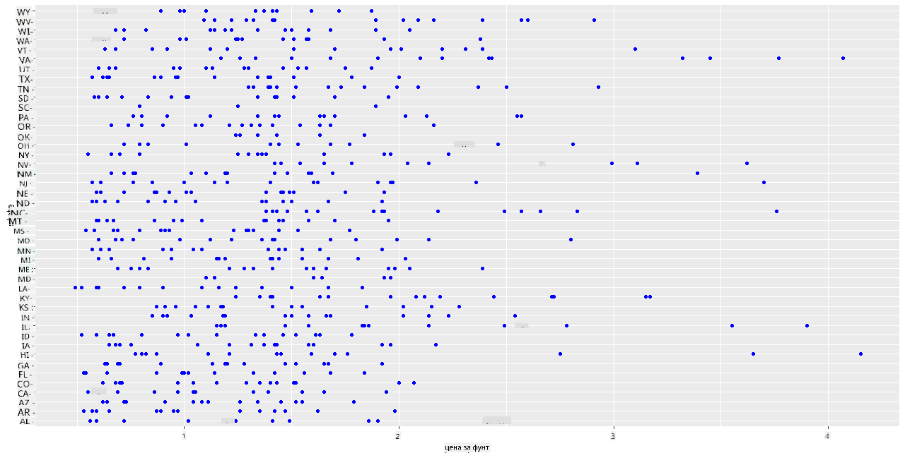
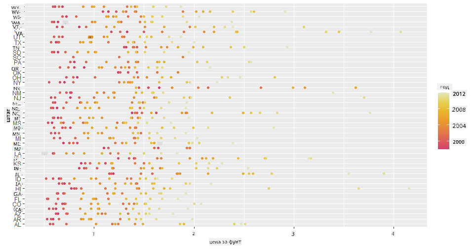
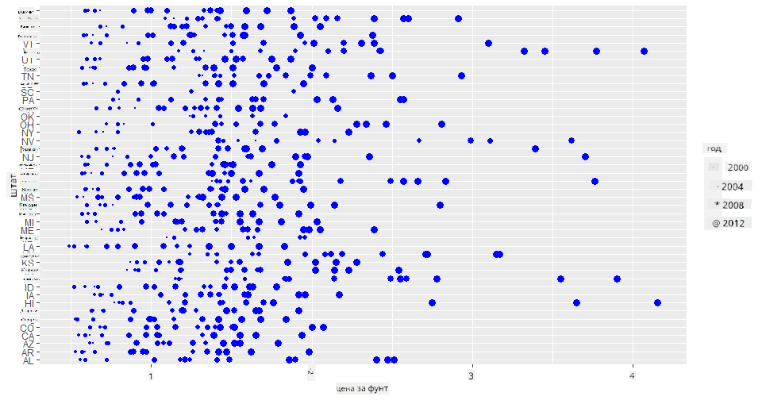
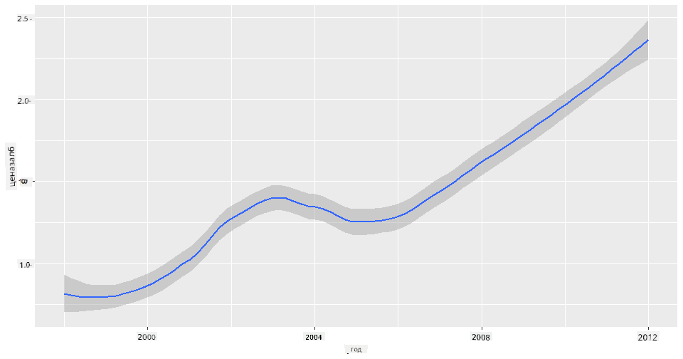
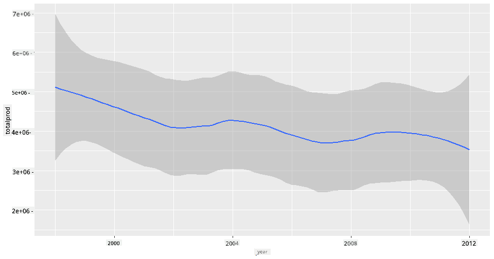
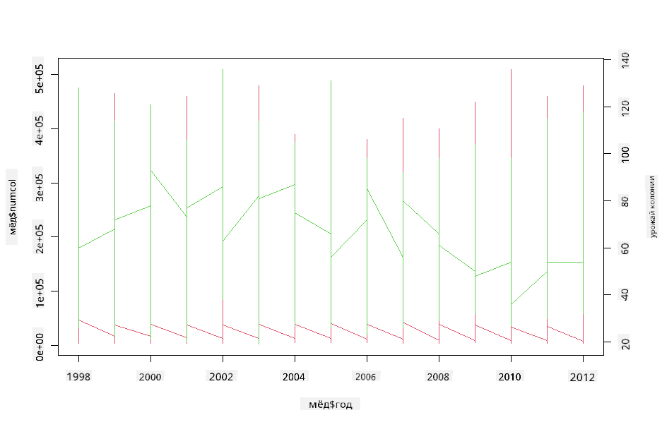

<!--
CO_OP_TRANSLATOR_METADATA:
{
  "original_hash": "a33c5d4b4156a2b41788d8720b6f724c",
  "translation_date": "2025-08-27T10:24:55+00:00",
  "source_file": "3-Data-Visualization/R/12-visualization-relationships/README.md",
  "language_code": "ru"
}
-->
# Визуализация связей: всё о мёде 🍯

| ](../../../sketchnotes/12-Visualizing-Relationships.png)|
|:---:|
|Визуализация связей - _Скетчноут от [@nitya](https://twitter.com/nitya)_ |

Продолжая исследование природы, давайте изучим интересные способы визуализации связей между различными типами мёда, основываясь на наборе данных, полученном от [Министерства сельского хозяйства США](https://www.nass.usda.gov/About_NASS/index.php).

Этот набор данных, содержащий около 600 записей, отображает производство мёда в различных штатах США. Например, можно изучить количество колоний, урожайность на одну колонию, общий объём производства, запасы, цену за фунт и стоимость произведённого мёда в каждом штате за период с 1998 по 2012 год, где каждая строка представляет данные за год для конкретного штата.

Будет интересно визуализировать связь между производством мёда в определённом штате за год и, например, ценой мёда в этом штате. Альтернативно, можно визуализировать связь между урожайностью мёда на одну колонию в разных штатах. Этот временной промежуток охватывает разрушительное явление «Синдром разрушения колоний» (CCD), впервые зафиксированное в 2006 году (http://npic.orst.edu/envir/ccd.html), что делает этот набор данных особенно значимым для изучения. 🐝

## [Тест перед лекцией](https://purple-hill-04aebfb03.1.azurestaticapps.net/quiz/22)

В этом уроке вы можете использовать библиотеку ggplot2, с которой вы уже знакомы, чтобы визуализировать связи между переменными. Особенно интересным является использование функций `geom_point` и `qplot` из ggplot2, которые позволяют быстро создавать точечные и линейные графики для визуализации '[статистических связей](https://ggplot2.tidyverse.org/)'. Это помогает специалисту по данным лучше понять, как переменные взаимодействуют друг с другом.

## Точечные графики

Используйте точечный график, чтобы показать, как цена мёда менялась год за годом в каждом штате. ggplot2, используя `ggplot` и `geom_point`, удобно группирует данные по штатам и отображает точки для категориальных и числовых данных.

Начнём с импорта данных и библиотеки Seaborn:

```r
honey=read.csv('../../data/honey.csv')
head(honey)
```
Вы заметите, что данные о мёде содержат несколько интересных столбцов, включая год и цену за фунт. Давайте изучим эти данные, сгруппированные по штатам США:

| state | numcol | yieldpercol | totalprod | stocks   | priceperlb | prodvalue | year |
| ----- | ------ | ----------- | --------- | -------- | ---------- | --------- | ---- |
| AL    | 16000  | 71          | 1136000   | 159000   | 0.72       | 818000    | 1998 |
| AZ    | 55000  | 60          | 3300000   | 1485000  | 0.64       | 2112000   | 1998 |
| AR    | 53000  | 65          | 3445000   | 1688000  | 0.59       | 2033000   | 1998 |
| CA    | 450000 | 83          | 37350000  | 12326000 | 0.62       | 23157000  | 1998 |
| CO    | 27000  | 72          | 1944000   | 1594000  | 0.7        | 1361000   | 1998 |
| FL    | 230000 | 98          |22540000   | 4508000  | 0.64       | 14426000  | 1998 |

Создайте базовый точечный график, чтобы показать связь между ценой за фунт мёда и штатом его происхождения. Сделайте ось `y` достаточно высокой, чтобы отобразить все штаты:

```r
library(ggplot2)
ggplot(honey, aes(x = priceperlb, y = state)) +
  geom_point(colour = "blue")
```


Теперь покажите те же данные с цветовой схемой, напоминающей цвет мёда, чтобы отобразить, как цена меняется год за годом. Вы можете сделать это, добавив параметр 'scale_color_gradientn', чтобы показать изменения:

> ✅ Узнайте больше о [scale_color_gradientn](https://www.rdocumentation.org/packages/ggplot2/versions/0.9.1/topics/scale_colour_gradientn) - попробуйте красивую радужную цветовую схему!

```r
ggplot(honey, aes(x = priceperlb, y = state, color=year)) +
  geom_point()+scale_color_gradientn(colours = colorspace::heat_hcl(7))
```


С изменением цветовой схемы становится очевидным, что цена за фунт мёда значительно увеличивается с течением времени. Если вы проверите выборку данных (например, для штата Аризона), вы увидите закономерность увеличения цен год за годом, с редкими исключениями:

| state | numcol | yieldpercol | totalprod | stocks  | priceperlb | prodvalue | year |
| ----- | ------ | ----------- | --------- | ------- | ---------- | --------- | ---- |
| AZ    | 55000  | 60          | 3300000   | 1485000 | 0.64       | 2112000   | 1998 |
| AZ    | 52000  | 62          | 3224000   | 1548000 | 0.62       | 1999000   | 1999 |
| AZ    | 40000  | 59          | 2360000   | 1322000 | 0.73       | 1723000   | 2000 |
| AZ    | 43000  | 59          | 2537000   | 1142000 | 0.72       | 1827000   | 2001 |
| AZ    | 38000  | 63          | 2394000   | 1197000 | 1.08       | 2586000   | 2002 |
| AZ    | 35000  | 72          | 2520000   | 983000  | 1.34       | 3377000   | 2003 |
| AZ    | 32000  | 55          | 1760000   | 774000  | 1.11       | 1954000   | 2004 |
| AZ    | 36000  | 50          | 1800000   | 720000  | 1.04       | 1872000   | 2005 |
| AZ    | 30000  | 65          | 1950000   | 839000  | 0.91       | 1775000   | 2006 |
| AZ    | 30000  | 64          | 1920000   | 902000  | 1.26       | 2419000   | 2007 |
| AZ    | 25000  | 64          | 1600000   | 336000  | 1.26       | 2016000   | 2008 |
| AZ    | 20000  | 52          | 1040000   | 562000  | 1.45       | 1508000   | 2009 |
| AZ    | 24000  | 77          | 1848000   | 665000  | 1.52       | 2809000   | 2010 |
| AZ    | 23000  | 53          | 1219000   | 427000  | 1.55       | 1889000   | 2011 |
| AZ    | 22000  | 46          | 1012000   | 253000  | 1.79       | 1811000   | 2012 |

Другой способ визуализировать этот процесс — использовать размер вместо цвета. Для пользователей с нарушением цветового восприятия это может быть более удобным вариантом. Измените визуализацию, чтобы показать увеличение цены через увеличение диаметра точек:

```r
ggplot(honey, aes(x = priceperlb, y = state)) +
  geom_point(aes(size = year),colour = "blue") +
  scale_size_continuous(range = c(0.25, 3))
```
Вы можете заметить, как размер точек постепенно увеличивается.



Это простой случай спроса и предложения? Из-за таких факторов, как изменение климата и разрушение колоний, становится ли мёда меньше с каждым годом, что приводит к увеличению цены?

Чтобы найти корреляцию между некоторыми переменными в этом наборе данных, давайте изучим линейные графики.

## Линейные графики

Вопрос: Наблюдается ли явное увеличение цены мёда за фунт год за годом? Это можно легко увидеть, создав один линейный график:

```r
qplot(honey$year,honey$priceperlb, geom='smooth', span =0.5, xlab = "year",ylab = "priceperlb")
```
Ответ: Да, с некоторыми исключениями около 2003 года:



Вопрос: А в 2003 году можно ли также увидеть всплеск предложения мёда? Что если посмотреть на общий объём производства год за годом?

```python
qplot(honey$year,honey$totalprod, geom='smooth', span =0.5, xlab = "year",ylab = "totalprod")
```



Ответ: Не совсем. Если посмотреть на общий объём производства, он, наоборот, кажется увеличившимся в этот год, хотя в целом объём производства мёда снижается в течение этих лет.

Вопрос: В таком случае, что могло вызвать скачок цены мёда около 2003 года?

Чтобы выяснить это, можно использовать сетку фасетов.

## Сетки фасетов

Сетки фасетов позволяют выделить одну грань вашего набора данных (в нашем случае можно выбрать 'год', чтобы избежать слишком большого количества фасетов). Seaborn может создать график для каждого из этих фасетов, используя выбранные координаты x и y для более удобного визуального сравнения. Выделяется ли 2003 год в таком сравнении?

Создайте сетку фасетов, используя `facet_wrap`, как рекомендовано в [документации ggplot2](https://ggplot2.tidyverse.org/reference/facet_wrap.html).

```r
ggplot(honey, aes(x=yieldpercol, y = numcol,group = 1)) + 
  geom_line() + facet_wrap(vars(year))
```
В этой визуализации вы можете сравнить урожайность на одну колонию и количество колоний год за годом, бок о бок, с настройкой wrap на 3 для столбцов:


Для этого набора данных ничего особенно не выделяется в отношении количества колоний и их урожайности год за годом и штат за штатом. Можно ли найти другой способ выявить корреляцию между этими двумя переменными?

## Двухлинейные графики

Попробуйте многолинейный график, наложив два линейных графика друг на друга, используя функции `par` и `plot` в R. Мы будем отображать год на оси x и показывать две оси y. Таким образом, отобразим урожайность на одну колонию и количество колоний, наложенные друг на друга:

```r
par(mar = c(5, 4, 4, 4) + 0.3)              
plot(honey$year, honey$numcol, pch = 16, col = 2,type="l")              
par(new = TRUE)                             
plot(honey$year, honey$yieldpercol, pch = 17, col = 3,              
     axes = FALSE, xlab = "", ylab = "",type="l")
axis(side = 4, at = pretty(range(y2)))      
mtext("colony yield", side = 4, line = 3)   
```


Хотя ничего явно не выделяется около 2003 года, это позволяет завершить урок на более позитивной ноте: несмотря на общее снижение количества колоний, их число стабилизируется, даже если урожайность на одну колонию уменьшается.

Вперёд, пчёлы, вперёд!

🐝❤️
## 🚀 Задание

В этом уроке вы узнали больше о других способах использования точечных графиков и линейных сеток, включая сетки фасетов. Попробуйте создать сетку фасетов, используя другой набор данных, возможно, тот, который вы использовали ранее. Обратите внимание, сколько времени требуется на создание и как важно учитывать количество сеток, которые нужно нарисовать, используя эти техники.
## [Тест после лекции](https://purple-hill-04aebfb03.1.azurestaticapps.net/quiz/23)

## Обзор и самостоятельное изучение

Линейные графики могут быть простыми или довольно сложными. Почитайте [документацию ggplot2](https://ggplot2.tidyverse.org/reference/geom_path.html#:~:text=geom_line()%20connects%20them%20in,which%20cases%20are%20connected%20together) о различных способах их построения. Попробуйте улучшить линейные графики, которые вы создали в этом уроке, используя другие методы, перечисленные в документации.
## Задание

[Погрузитесь в улей](assignment.md)

---

**Отказ от ответственности**:  
Этот документ был переведен с использованием сервиса автоматического перевода [Co-op Translator](https://github.com/Azure/co-op-translator). Несмотря на наши усилия обеспечить точность, автоматические переводы могут содержать ошибки или неточности. Оригинальный документ на его исходном языке следует считать авторитетным источником. Для получения критически важной информации рекомендуется профессиональный перевод человеком. Мы не несем ответственности за любые недоразумения или неправильные интерпретации, возникшие в результате использования данного перевода.