<!--
CO_OP_TRANSLATOR_METADATA:
{
  "original_hash": "14b2a7f1c63202920bd98eeb913f5614",
  "translation_date": "2025-08-27T09:26:24+00:00",
  "source_file": "5-Data-Science-In-Cloud/18-Low-Code/README.md",
  "language_code": "ru"
}
-->
# Data Science в облаке: подход "Low code/No code"

|](../../sketchnotes/18-DataScience-Cloud.png)|
|:---:|
| Data Science в облаке: Low Code - _Скетчноут от [@nitya](https://twitter.com/nitya)_ |

Содержание:

- [Data Science в облаке: подход "Low code/No code"](../../../../5-Data-Science-In-Cloud/18-Low-Code)
  - [Вопросы перед лекцией](../../../../5-Data-Science-In-Cloud/18-Low-Code)
  - [1. Введение](../../../../5-Data-Science-In-Cloud/18-Low-Code)
    - [1.1 Что такое Azure Machine Learning?](../../../../5-Data-Science-In-Cloud/18-Low-Code)
    - [1.2 Проект прогнозирования сердечной недостаточности:](../../../../5-Data-Science-In-Cloud/18-Low-Code)
    - [1.3 Набор данных о сердечной недостаточности:](../../../../5-Data-Science-In-Cloud/18-Low-Code)
  - [2. Обучение модели в Azure ML Studio с использованием Low code/No code](../../../../5-Data-Science-In-Cloud/18-Low-Code)
    - [2.1 Создание рабочей области Azure ML](../../../../5-Data-Science-In-Cloud/18-Low-Code)
    - [2.2 Вычислительные ресурсы](../../../../5-Data-Science-In-Cloud/18-Low-Code)
      - [2.2.1 Выбор подходящих параметров для вычислительных ресурсов](../../../../5-Data-Science-In-Cloud/18-Low-Code)
      - [2.2.2 Создание вычислительного кластера](../../../../5-Data-Science-In-Cloud/18-Low-Code)
    - [2.3 Загрузка набора данных](../../../../5-Data-Science-In-Cloud/18-Low-Code)
    - [2.4 Обучение с использованием AutoML (Low code/No code)](../../../../5-Data-Science-In-Cloud/18-Low-Code)
  - [3. Развертывание модели и использование конечных точек (Low code/No code)](../../../../5-Data-Science-In-Cloud/18-Low-Code)
    - [3.1 Развертывание модели](../../../../5-Data-Science-In-Cloud/18-Low-Code)
    - [3.2 Использование конечных точек](../../../../5-Data-Science-In-Cloud/18-Low-Code)
  - [🚀 Задание](../../../../5-Data-Science-In-Cloud/18-Low-Code)
  - [Вопросы после лекции](../../../../5-Data-Science-In-Cloud/18-Low-Code)
  - [Обзор и самостоятельное изучение](../../../../5-Data-Science-In-Cloud/18-Low-Code)
  - [Домашнее задание](../../../../5-Data-Science-In-Cloud/18-Low-Code)

## [Вопросы перед лекцией](https://purple-hill-04aebfb03.1.azurestaticapps.net/quiz/34)
## 1. Введение
### 1.1 Что такое Azure Machine Learning?

Облачная платформа Azure включает более 200 продуктов и облачных сервисов, которые помогают воплощать новые решения в жизнь. 
Данные ученые тратят много времени на исследование и предварительную обработку данных, а также на тестирование различных алгоритмов обучения моделей для получения точных результатов. Эти задачи занимают много времени и часто неэффективно используют дорогостоящие вычислительные ресурсы.

[Azure ML](https://docs.microsoft.com/azure/machine-learning/overview-what-is-azure-machine-learning?WT.mc_id=academic-77958-bethanycheum&ocid=AID3041109) — это облачная платформа для создания и управления решениями машинного обучения в Azure. Она включает широкий спектр функций и возможностей, которые помогают ученым обрабатывать данные, обучать модели, публиковать предсказательные сервисы и отслеживать их использование. Самое главное, она повышает эффективность работы, автоматизируя многие трудоемкие задачи, связанные с обучением моделей, и позволяет использовать облачные вычислительные ресурсы, которые масштабируются для обработки больших объемов данных, при этом затраты возникают только при фактическом использовании.

Azure ML предоставляет все необходимые инструменты для разработчиков и ученых данных для их рабочих процессов машинного обучения. Среди них:

- **Azure Machine Learning Studio**: веб-портал в Azure Machine Learning для вариантов обучения моделей, развертывания, автоматизации, отслеживания и управления активами с использованием low-code и no-code подходов. Studio интегрируется с Azure Machine Learning SDK для бесшовного опыта.
- **Jupyter Notebooks**: быстрое прототипирование и тестирование моделей машинного обучения.
- **Azure Machine Learning Designer**: позволяет перетаскивать модули для создания экспериментов и развертывания конвейеров в среде low-code.
- **Автоматизированный интерфейс машинного обучения (AutoML)**: автоматизирует итеративные задачи разработки моделей машинного обучения, позволяя создавать модели с высокой масштабируемостью, эффективностью и продуктивностью, сохраняя при этом качество модели.
- **Маркировка данных**: инструмент с поддержкой машинного обучения для автоматической маркировки данных.
- **Расширение машинного обучения для Visual Studio Code**: предоставляет полноценную среду разработки для создания и управления проектами машинного обучения.
- **CLI для машинного обучения**: предоставляет команды для управления ресурсами Azure ML из командной строки.
- **Интеграция с фреймворками с открытым исходным кодом**, такими как PyTorch, TensorFlow, Scikit-learn и многими другими, для обучения, развертывания и управления процессом машинного обучения от начала до конца.
- **MLflow**: библиотека с открытым исходным кодом для управления жизненным циклом экспериментов машинного обучения. **MLFlow Tracking** — это компонент MLflow, который регистрирует и отслеживает метрики обучения и артефакты модели, независимо от среды эксперимента.

### 1.2 Проект прогнозирования сердечной недостаточности:

Нет сомнений в том, что создание и разработка проектов — лучший способ проверить свои навыки и знания. В этом уроке мы изучим два разных способа создания проекта по прогнозированию сердечной недостаточности в Azure ML Studio: с использованием подхода Low code/No code и с использованием Azure ML SDK, как показано на схеме ниже:

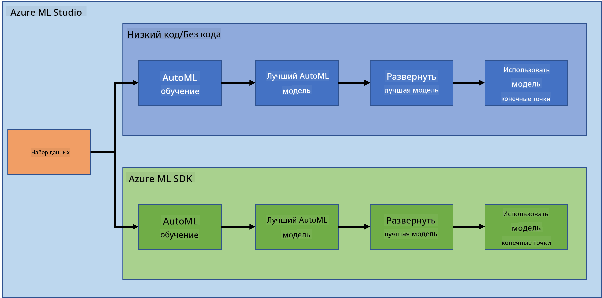

Каждый способ имеет свои плюсы и минусы. Подход Low code/No code проще для начала, так как он предполагает взаимодействие с графическим интерфейсом (GUI) и не требует предварительных знаний в программировании. Этот метод позволяет быстро протестировать жизнеспособность проекта и создать POC (Proof Of Concept). Однако, когда проект растет и требуется готовность к производству, создание ресурсов через GUI становится нецелесообразным. Необходимо программно автоматизировать все процессы — от создания ресурсов до развертывания модели. Именно здесь знание Azure ML SDK становится критически важным.

|                   | Low code/No code | Azure ML SDK              |
|-------------------|------------------|---------------------------|
| Знание кода       | Не требуется     | Требуется                 |
| Время разработки  | Быстро и легко   | Зависит от уровня знаний  |
| Готовность к производству | Нет       | Да                        |

### 1.3 Набор данных о сердечной недостаточности:

Сердечно-сосудистые заболевания (ССЗ) являются основной причиной смерти во всем мире, составляя 31% всех смертей. Экологические и поведенческие факторы риска, такие как употребление табака, нездоровое питание и ожирение, физическая неактивность и вредное употребление алкоголя, могут быть использованы в качестве признаков для моделей прогнозирования. Возможность оценить вероятность развития ССЗ может быть полезной для предотвращения приступов у людей с высоким риском.

На платформе Kaggle доступен [набор данных о сердечной недостаточности](https://www.kaggle.com/andrewmvd/heart-failure-clinical-data), который мы будем использовать для этого проекта. Вы можете скачать набор данных прямо сейчас. Это табличный набор данных с 13 столбцами (12 признаков и 1 целевая переменная) и 299 строками.

|    | Название переменной       | Тип данных      | Описание                                                | Пример            |
|----|---------------------------|-----------------|---------------------------------------------------------|-------------------|
| 1  | age                       | числовой        | возраст пациента                                        | 25                |
| 2  | anaemia                   | булевый         | снижение уровня эритроцитов или гемоглобина            | 0 или 1           |
| 3  | creatinine_phosphokinase  | числовой        | уровень фермента CPK в крови                           | 542               |
| 4  | diabetes                  | булевый         | наличие диабета у пациента                             | 0 или 1           |
| 5  | ejection_fraction         | числовой        | процент крови, покидающей сердце при каждом сокращении | 45                |
| 6  | high_blood_pressure       | булевый         | наличие гипертонии у пациента                          | 0 или 1           |
| 7  | platelets                 | числовой        | количество тромбоцитов в крови                         | 149000            |
| 8  | serum_creatinine          | числовой        | уровень сывороточного креатинина в крови               | 0.5               |
| 9  | serum_sodium              | числовой        | уровень сывороточного натрия в крови                   | jun               |
| 10 | sex                       | булевый         | пол пациента                                           | 0 или 1           |
| 11 | smoking                   | булевый         | курит ли пациент                                       | 0 или 1           |
| 12 | time                      | числовой        | период наблюдения (дни)                                | 4                 |
|----|---------------------------|-----------------|---------------------------------------------------------|-------------------|
| 21 | DEATH_EVENT [Цель]        | булевый         | умер ли пациент в течение периода наблюдения           | 0 или 1           |

После получения набора данных мы можем начать проект в Azure.

## 2. Обучение модели в Azure ML Studio с использованием Low code/No code
### 2.1 Создание рабочей области Azure ML
Для обучения модели в Azure ML сначала необходимо создать рабочую область Azure ML. Рабочая область — это основной ресурс для Azure Machine Learning, предоставляющий централизованное место для работы со всеми артефактами, которые вы создаете при использовании Azure Machine Learning. Рабочая область сохраняет историю всех запусков обучения, включая журналы, метрики, результаты и снимки ваших скриптов. Вы используете эту информацию, чтобы определить, какой запуск обучения дал лучшую модель. [Подробнее](https://docs.microsoft.com/azure/machine-learning/concept-workspace?WT.mc_id=academic-77958-bethanycheum&ocid=AID3041109)

Рекомендуется использовать самый актуальный браузер, совместимый с вашей операционной системой. Поддерживаются следующие браузеры:

- Microsoft Edge (новая версия Microsoft Edge, не устаревшая версия)
- Safari (последняя версия, только для Mac)
- Chrome (последняя версия)
- Firefox (последняя версия)

Чтобы использовать Azure Machine Learning, создайте рабочую область в вашей подписке Azure. Затем вы можете использовать эту рабочую область для управления данными, вычислительными ресурсами, кодом, моделями и другими артефактами, связанными с вашими задачами машинного обучения.

> **_Примечание:_** Ваша подписка Azure будет взимать небольшую плату за хранение данных, пока рабочая область Azure Machine Learning существует в вашей подписке, поэтому мы рекомендуем удалить рабочую область Azure Machine Learning, когда вы больше не будете ее использовать.

1. Войдите в [портал Azure](https://ms.portal.azure.com/) с учетными данными Microsoft, связанными с вашей подпиской Azure.
2. Выберите **＋Создать ресурс**
   
   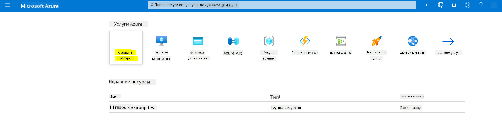

   Найдите Machine Learning и выберите плитку Machine Learning.

   

   Нажмите кнопку "Создать".

   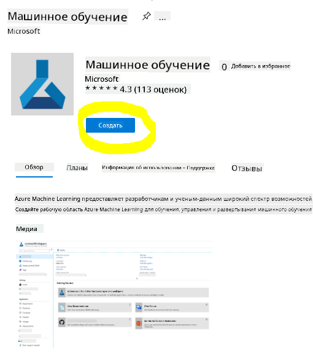

   Заполните настройки следующим образом:
   - Подписка: ваша подписка Azure
   - Группа ресурсов: создайте или выберите группу ресурсов
   - Имя рабочей области: введите уникальное имя для вашей рабочей области
   - Регион: выберите ближайший к вам географический регион
   - Учетная запись хранения: обратите внимание на новую учетную запись хранения, которая будет создана для вашей рабочей области
   - Key vault: обратите внимание на новый key vault, который будет создан для вашей рабочей области
   - Application insights: обратите внимание на новый ресурс Application Insights, который будет создан для вашей рабочей области
   - Container registry: отсутствует (он будет создан автоматически при первом развертывании модели в контейнер)

    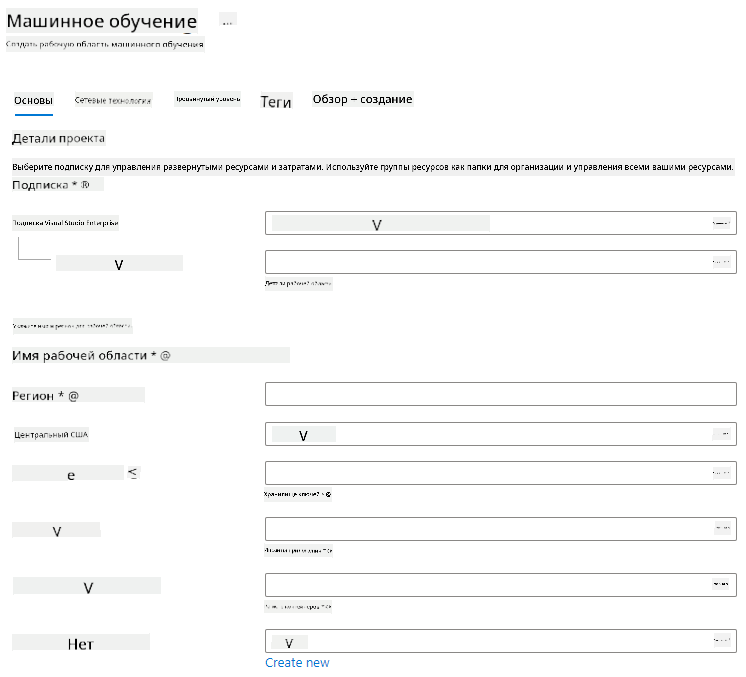

   - Нажмите "Создать + обзор", а затем кнопку "Создать".
3. Дождитесь создания вашей рабочей области (это может занять несколько минут). Затем перейдите к ней в портале. Вы можете найти ее через сервис Machine Learning в Azure.
4. На странице обзора вашей рабочей области запустите Azure Machine Learning Studio (или откройте новую вкладку браузера и перейдите на https://ml.azure.com), и войдите в Azure Machine Learning Studio, используя свою учетную запись Microsoft. Если будет предложено, выберите ваш каталог Azure, подписку и рабочую область Azure Machine Learning.
   
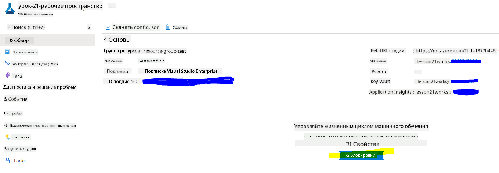

5. В Azure Machine Learning Studio переключите значок ☰ в верхнем левом углу, чтобы просмотреть различные страницы интерфейса. Вы можете использовать эти страницы для управления ресурсами в вашей рабочей области.

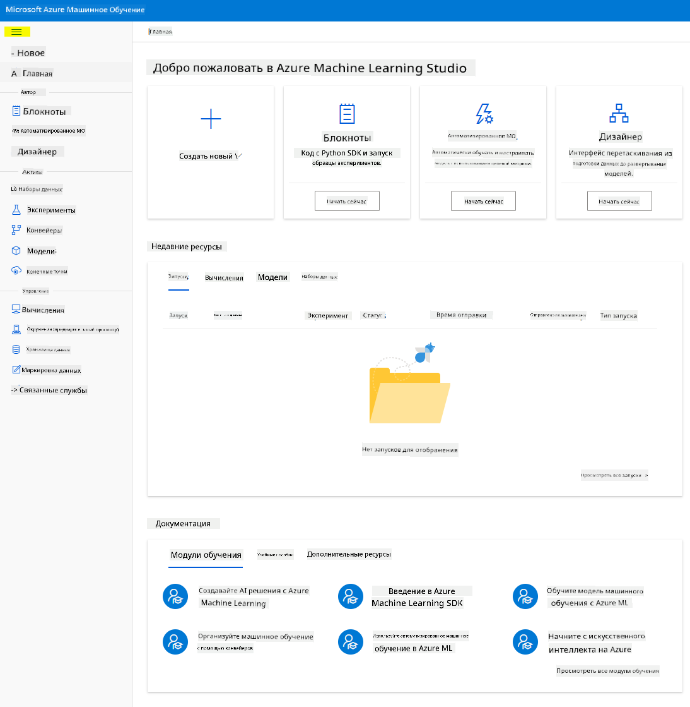

Вы можете управлять своей рабочей областью через портал Azure, но для ученых данных и инженеров по операциям машинного обучения Azure Machine Learning Studio предоставляет более удобный интерфейс для управления ресурсами рабочей области.

### 2.2 Вычислительные ресурсы

Вычислительные ресурсы — это облачные ресурсы, на которых вы можете запускать процессы обучения моделей и исследования данных. Существует четыре типа вычислительных ресурсов, которые вы можете создать:

- **Compute Instances**: рабочие станции для разработки, которые ученые данных могут использовать для работы с данными и моделями. Это включает создание виртуальной машины (VM) и запуск экземпляра ноутбука. Затем вы можете обучить модель, вызвав вычислительный кластер из ноутбука.
- **Compute Clusters**: масштабируемые кластеры виртуальных машин для обработки экспериментального кода по запросу. Они необходимы для обучения модели. Вычислительные кластеры также могут использовать специализированные ресурсы GPU или CPU.
- **Inference Clusters**: цели развертывания для предсказательных сервисов, использующих ваши обученные модели.
- **Подключенные вычисления**: Ссылки на существующие вычислительные ресурсы Azure, такие как виртуальные машины или кластеры Azure Databricks.

#### 2.2.1 Выбор подходящих параметров для ваших вычислительных ресурсов

Некоторые ключевые факторы следует учитывать при создании вычислительного ресурса, и эти выборы могут быть критически важными.

**Нужен ли вам CPU или GPU?**

CPU (центральный процессор) — это электронная схема, которая выполняет инструкции, составляющие компьютерную программу. GPU (графический процессор) — это специализированная электронная схема, способная выполнять графически ориентированный код с очень высокой скоростью.

Основное различие между архитектурой CPU и GPU заключается в том, что CPU предназначен для быстрого выполнения широкого спектра задач (измеряется тактовой частотой CPU), но ограничен в параллельности выполняемых задач. GPU разработаны для параллельных вычислений и поэтому гораздо лучше подходят для задач глубокого обучения.

| CPU                                     | GPU                         |
|-----------------------------------------|-----------------------------|
| Менее дорогой                           | Более дорогой               |
| Низкий уровень параллельности           | Высокий уровень параллельности |
| Медленнее при обучении моделей глубокого обучения | Оптимален для глубокого обучения |

**Размер кластера**

Большие кластеры дороже, но обеспечивают лучшую отзывчивость. Поэтому, если у вас есть время, но недостаточно средств, начните с небольшого кластера. Если же у вас есть средства, но мало времени, начните с большого кластера.

**Размер виртуальной машины**

В зависимости от ваших временных и бюджетных ограничений, вы можете варьировать размер оперативной памяти, диска, количество ядер и тактовую частоту. Увеличение всех этих параметров будет стоить дороже, но обеспечит лучшую производительность.

**Выделенные или низкоприоритетные экземпляры?**

Низкоприоритетный экземпляр означает, что он может быть прерван: Microsoft Azure может забрать эти ресурсы и назначить их другой задаче, прервав выполнение вашей работы. Выделенный экземпляр, или непрерываемый, означает, что работа никогда не будет завершена без вашего разрешения. Это еще один аспект выбора между временем и деньгами, так как прерываемые экземпляры дешевле выделенных.

#### 2.2.2 Создание вычислительного кластера

В [рабочей области Azure ML](https://ml.azure.com/), которую мы создали ранее, перейдите в раздел "Compute", и вы сможете увидеть различные вычислительные ресурсы, которые мы только что обсудили (например, вычислительные экземпляры, вычислительные кластеры, кластеры для вывода и подключенные вычисления). Для этого проекта нам понадобится вычислительный кластер для обучения модели. В Studio нажмите на меню "Compute", затем вкладку "Compute cluster" и нажмите кнопку "+ New", чтобы создать вычислительный кластер.

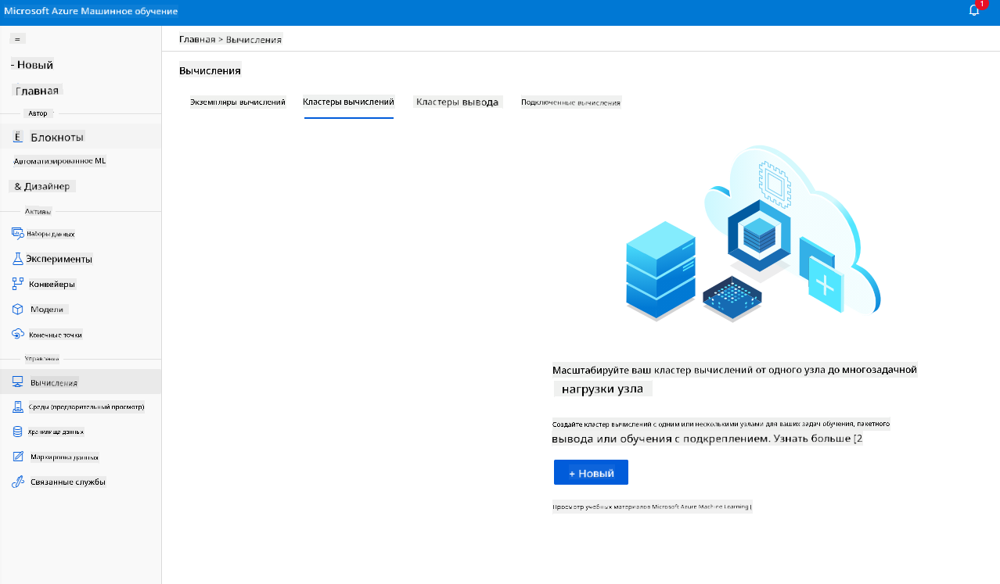

1. Выберите параметры: выделенный или низкоприоритетный, CPU или GPU, размер виртуальной машины и количество ядер (вы можете оставить настройки по умолчанию для этого проекта).
2. Нажмите кнопку "Next".

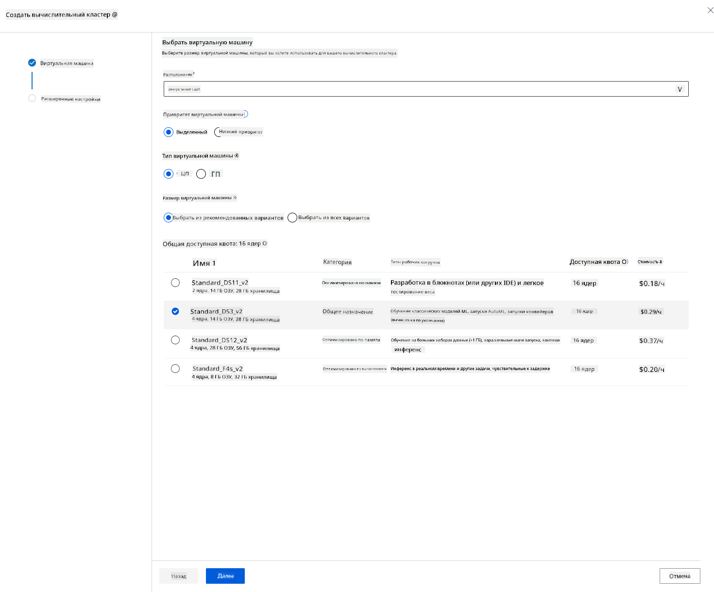

3. Дайте кластеру имя.
4. Выберите параметры: минимальное/максимальное количество узлов, время простоя перед уменьшением масштаба, доступ SSH. Обратите внимание, что если минимальное количество узлов равно 0, вы сэкономите деньги, когда кластер простаивает. Чем больше максимальное количество узлов, тем быстрее будет обучение. Рекомендуемое максимальное количество узлов — 3.  
5. Нажмите кнопку "Create". Этот шаг может занять несколько минут.

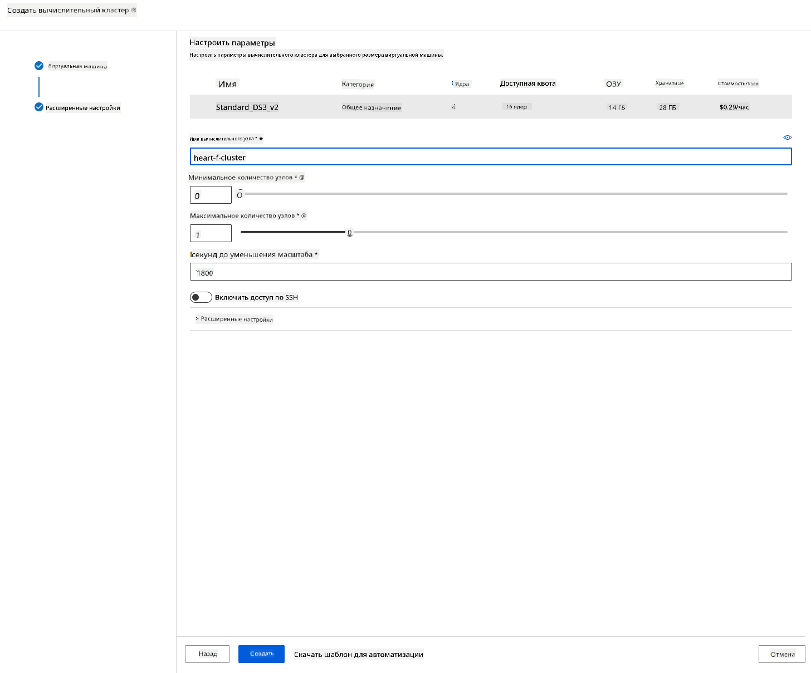

Отлично! Теперь, когда у нас есть вычислительный кластер, нам нужно загрузить данные в Azure ML Studio.

### 2.3 Загрузка набора данных

1. В [рабочей области Azure ML](https://ml.azure.com/), которую мы создали ранее, нажмите на "Datasets" в левом меню и нажмите кнопку "+ Create dataset", чтобы создать набор данных. Выберите опцию "From local files" и выберите набор данных Kaggle, который мы скачали ранее.
   
   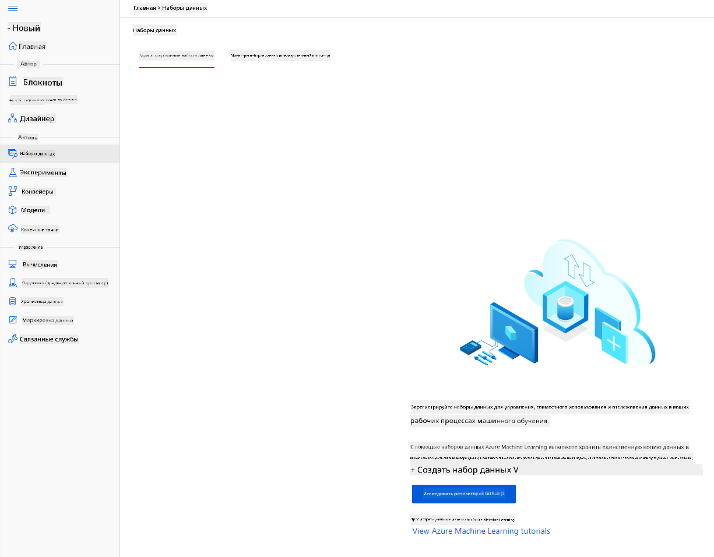

2. Дайте вашему набору данных имя, тип и описание. Нажмите "Next". Загрузите данные из файлов. Нажмите "Next".
   
   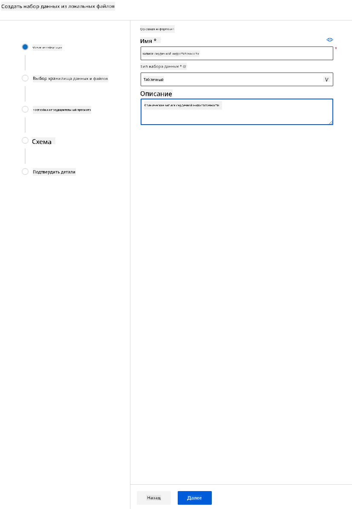

3. В схеме измените тип данных на Boolean для следующих характеристик: анемия, диабет, высокое кровяное давление, пол, курение и DEATH_EVENT. Нажмите "Next" и "Create".
   
   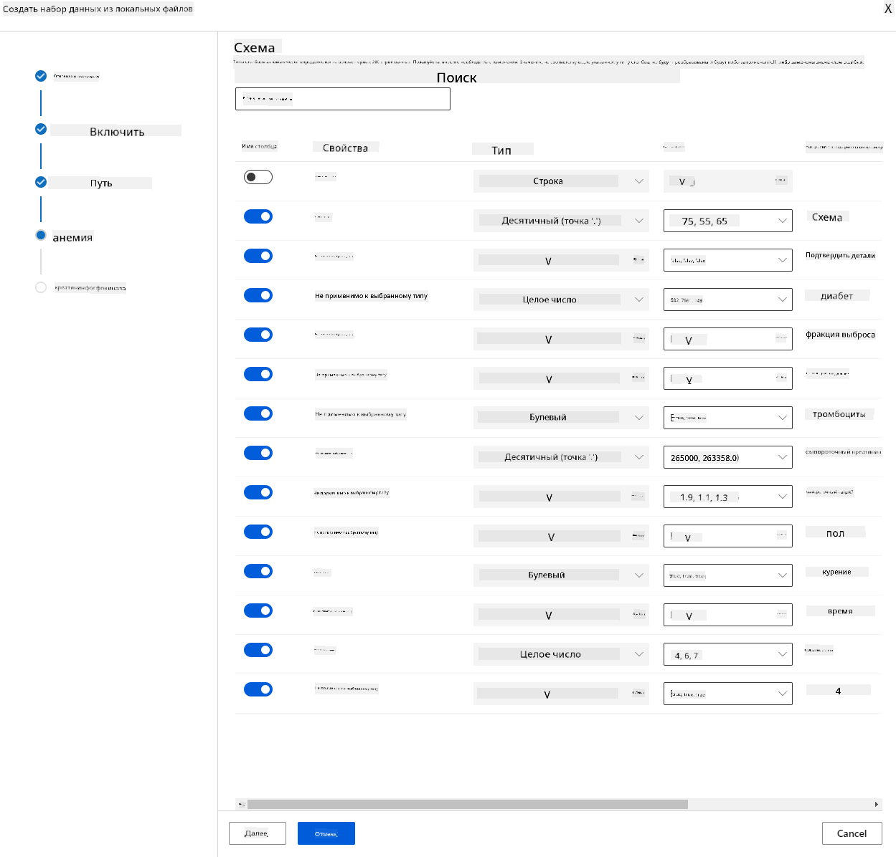

Отлично! Теперь, когда набор данных загружен и вычислительный кластер создан, мы можем начать обучение модели!

### 2.4 Обучение с минимальным кодом/без кода с AutoML

Традиционная разработка моделей машинного обучения требует значительных ресурсов, глубоких знаний предметной области и времени для создания и сравнения множества моделей. Автоматизированное машинное обучение (AutoML) — это процесс автоматизации трудоемких, итеративных задач разработки моделей машинного обучения. Оно позволяет ученым, аналитикам и разработчикам создавать модели ML с высокой масштабируемостью, эффективностью и производительностью, при этом поддерживая качество моделей. Это сокращает время, необходимое для получения готовых к производству моделей ML, с легкостью и эффективностью. [Узнать больше](https://docs.microsoft.com/azure/machine-learning/concept-automated-ml?WT.mc_id=academic-77958-bethanycheum&ocid=AID3041109)

1. В [рабочей области Azure ML](https://ml.azure.com/), которую мы создали ранее, нажмите на "Automated ML" в левом меню и выберите только что загруженный набор данных. Нажмите "Next".

   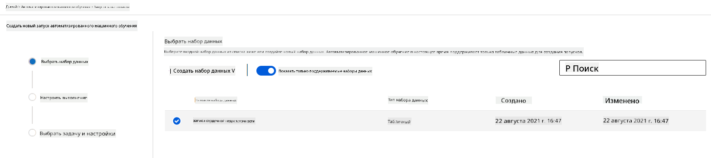

2. Введите имя нового эксперимента, целевой столбец (DEATH_EVENT) и вычислительный кластер, который мы создали. Нажмите "Next".
   
   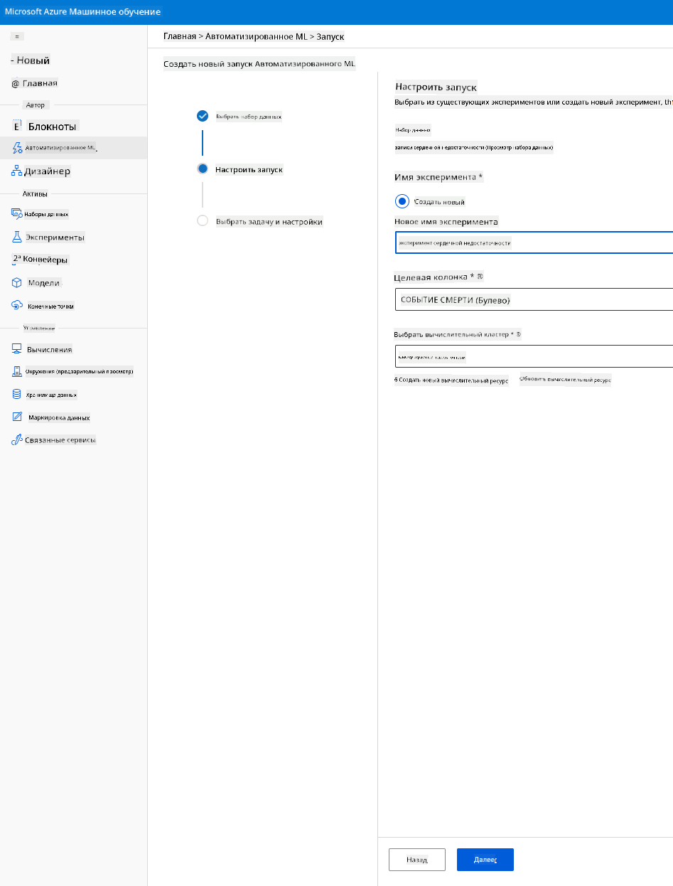

3. Выберите "Classification" и нажмите "Finish". Этот шаг может занять от 30 минут до 1 часа, в зависимости от размера вашего вычислительного кластера.
    
    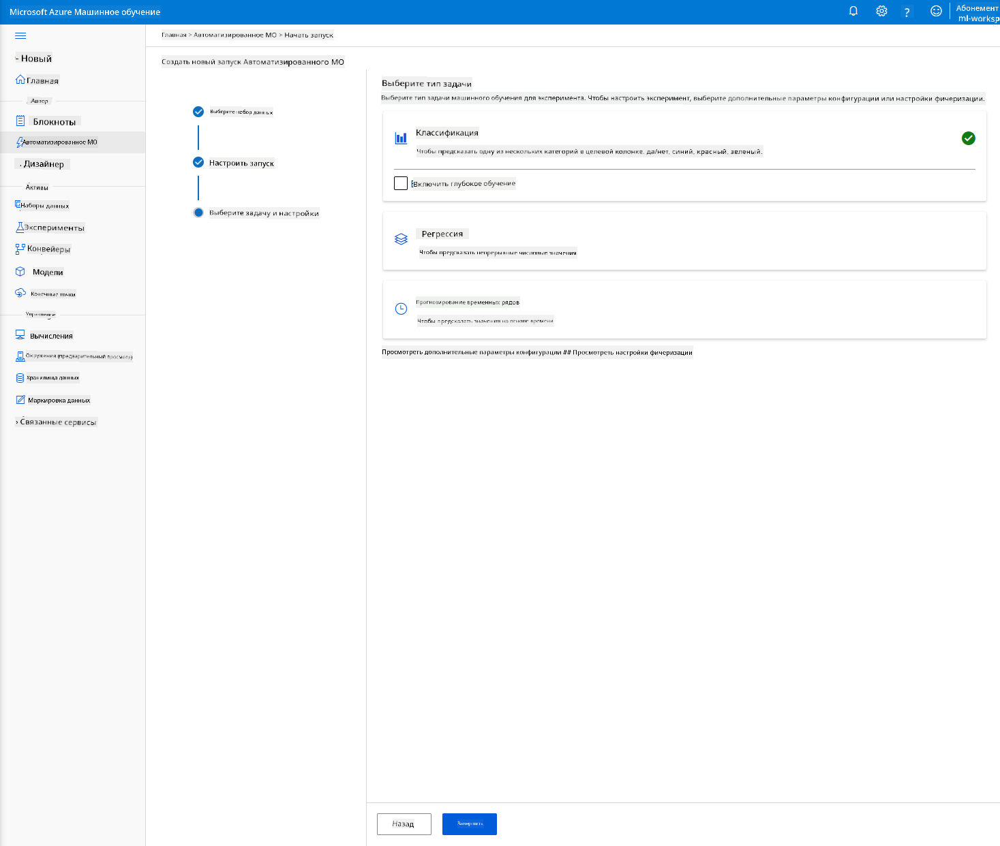

4. После завершения выполнения нажмите на вкладку "Automated ML", выберите ваш запуск и нажмите на алгоритм в карточке "Best model summary".
    
    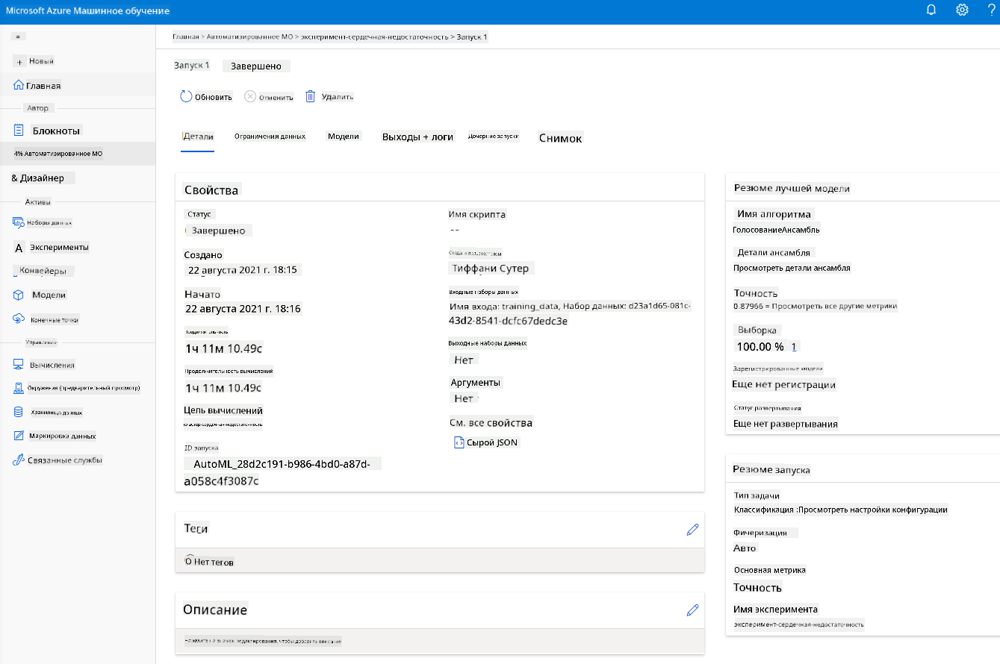

Здесь вы можете увидеть подробное описание лучшей модели, созданной AutoML. Вы также можете изучить другие модели на вкладке "Models". Потратьте несколько минут на изучение моделей в разделе "Explanations (preview)". После того как вы выбрали модель, которую хотите использовать (в данном случае мы выберем лучшую модель, выбранную AutoML), мы увидим, как ее можно развернуть.

## 3. Развертывание модели с минимальным кодом/без кода и использование конечной точки
### 3.1 Развертывание модели

Интерфейс автоматизированного машинного обучения позволяет развернуть лучшую модель как веб-службу в несколько шагов. Развертывание — это интеграция модели, чтобы она могла делать прогнозы на основе новых данных и выявлять потенциальные области возможностей. Для этого проекта развертывание веб-службы означает, что медицинские приложения смогут использовать модель для выполнения прогнозов риска сердечного приступа у пациентов в реальном времени.

В описании лучшей модели нажмите кнопку "Deploy".
    
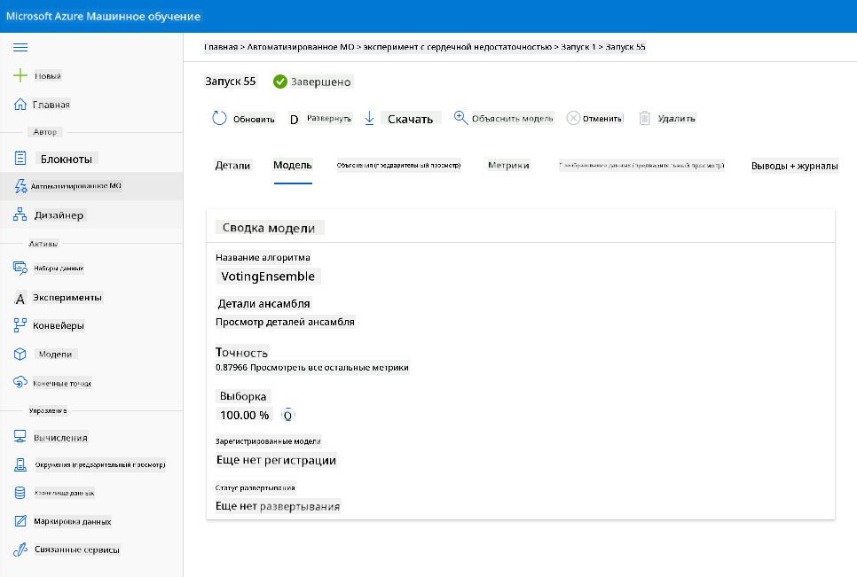

15. Дайте ей имя, описание, тип вычислений (Azure Container Instance), включите аутентификацию и нажмите "Deploy". Этот шаг может занять около 20 минут. Процесс развертывания включает несколько этапов, включая регистрацию модели, создание ресурсов и их настройку для веб-службы. Сообщение о статусе появляется под "Deploy status". Периодически нажимайте "Refresh", чтобы проверить статус развертывания. Оно завершено и работает, когда статус "Healthy".


16. После развертывания нажмите на вкладку "Endpoint" и выберите конечную точку, которую вы только что развернули. Здесь вы найдете все детали, которые нужно знать о конечной точке.

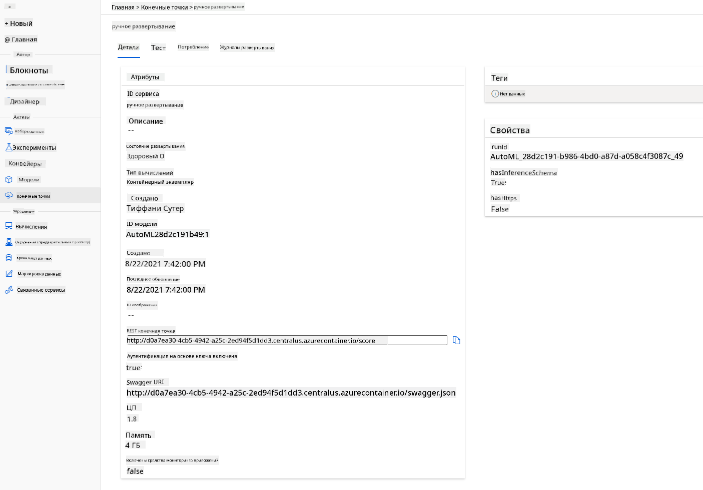

Потрясающе! Теперь, когда у нас есть развернутая модель, мы можем начать использование конечной точки.

### 3.2 Использование конечной точки

Нажмите на вкладку "Consume". Здесь вы найдете REST конечную точку и скрипт на Python в опции использования. Потратьте время на изучение кода Python.

Этот скрипт можно запустить непосредственно с вашего локального компьютера, и он будет использовать вашу конечную точку.

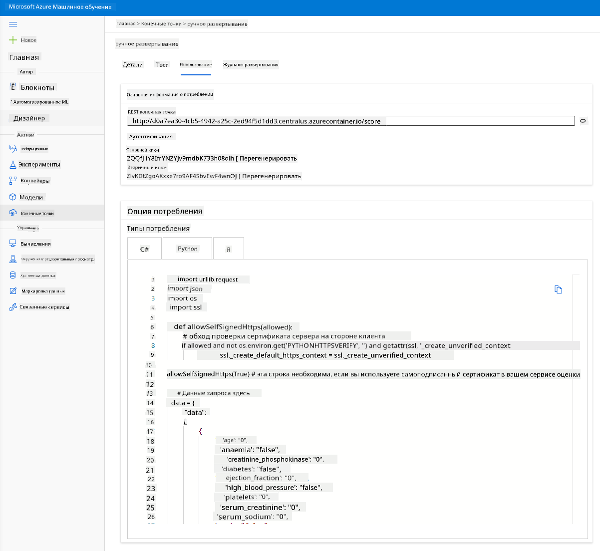

Обратите внимание на эти две строки кода:

```python
url = 'http://98e3715f-xxxx-xxxx-xxxx-9ec22d57b796.centralus.azurecontainer.io/score'
api_key = '' # Replace this with the API key for the web service
```
Переменная `url` — это REST конечная точка, найденная на вкладке использования, а переменная `api_key` — это основной ключ, также найденный на вкладке использования (только если вы включили аутентификацию). Именно так скрипт может использовать конечную точку.

18. Запустив скрипт, вы должны увидеть следующий вывод:
    ```python
    b'"{\\"result\\": [true]}"'
    ```
Это означает, что прогноз сердечной недостаточности для предоставленных данных — true. Это логично, потому что если вы внимательно посмотрите на данные, автоматически сгенерированные в скрипте, все значения равны 0 и false по умолчанию. Вы можете изменить данные на следующий пример ввода:

```python
data = {
    "data":
    [
        {
            'age': "0",
            'anaemia': "false",
            'creatinine_phosphokinase': "0",
            'diabetes': "false",
            'ejection_fraction': "0",
            'high_blood_pressure': "false",
            'platelets': "0",
            'serum_creatinine': "0",
            'serum_sodium': "0",
            'sex': "false",
            'smoking': "false",
            'time': "0",
        },
        {
            'age': "60",
            'anaemia': "false",
            'creatinine_phosphokinase': "500",
            'diabetes': "false",
            'ejection_fraction': "38",
            'high_blood_pressure': "false",
            'platelets': "260000",
            'serum_creatinine': "1.40",
            'serum_sodium': "137",
            'sex': "false",
            'smoking': "false",
            'time': "130",
        },
    ],
}
```
Скрипт должен вернуть:
    ```python
    b'"{\\"result\\": [true, false]}"'
    ```

Поздравляем! Вы только что использовали развернутую модель и обучили ее в Azure ML!

> **_Примечание:_** После завершения проекта не забудьте удалить все ресурсы.
## 🚀 Задание

Внимательно изучите объяснения модели и детали, которые AutoML сгенерировал для лучших моделей. Попробуйте понять, почему лучшая модель лучше других. Какие алгоритмы были сравнены? Какие различия между ними? Почему лучшая модель показывает лучшие результаты в данном случае?

## [Тест после лекции](https://purple-hill-04aebfb03.1.azurestaticapps.net/quiz/35)

## Обзор и самостоятельное изучение

В этом уроке вы узнали, как обучить, развернуть и использовать модель для прогнозирования риска сердечной недостаточности с минимальным кодом/без кода в облаке. Если вы еще этого не сделали, углубитесь в объяснения модели, которые AutoML сгенерировал для лучших моделей, и попробуйте понять, почему лучшая модель лучше других.

Вы можете углубиться в AutoML с минимальным кодом/без кода, прочитав эту [документацию](https://docs.microsoft.com/azure/machine-learning/tutorial-first-experiment-automated-ml?WT.mc_id=academic-77958-bethanycheum&ocid=AID3041109).

## Задание

[Проект по Data Science с минимальным кодом/без кода на Azure ML](assignment.md)

---

**Отказ от ответственности**:  
Этот документ был переведен с использованием сервиса автоматического перевода [Co-op Translator](https://github.com/Azure/co-op-translator). Хотя мы стремимся к точности, пожалуйста, имейте в виду, что автоматические переводы могут содержать ошибки или неточности. Оригинальный документ на его исходном языке следует считать авторитетным источником. Для получения критически важной информации рекомендуется профессиональный перевод человеком. Мы не несем ответственности за любые недоразумения или неправильные интерпретации, возникшие в результате использования данного перевода.