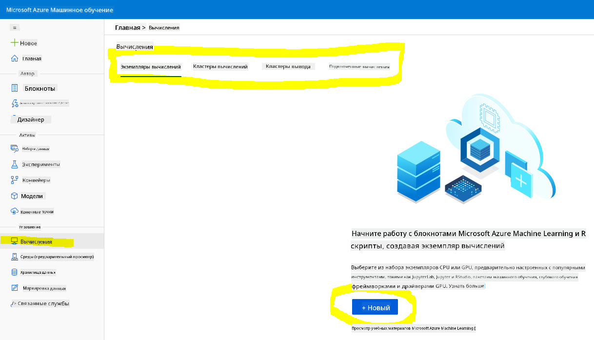
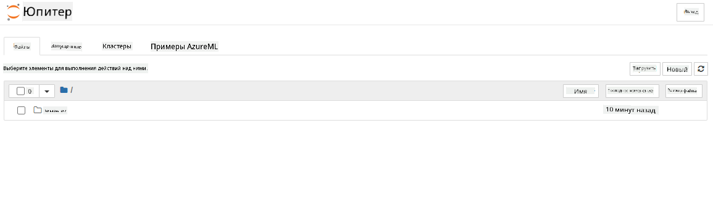

<!--
CO_OP_TRANSLATOR_METADATA:
{
  "original_hash": "73dead89dc2ddda4d6ec0232814a191e",
  "translation_date": "2025-08-27T09:39:11+00:00",
  "source_file": "5-Data-Science-In-Cloud/19-Azure/README.md",
  "language_code": "ru"
}
-->
# Наука о данных в облаке: подход "Azure ML SDK"

| ](../../sketchnotes/19-DataScience-Cloud.png)|
|:---:|
| Наука о данных в облаке: Azure ML SDK - _Скетчноут от [@nitya](https://twitter.com/nitya)_ |

Содержание:

- [Наука о данных в облаке: подход "Azure ML SDK"](../../../../5-Data-Science-In-Cloud/19-Azure)
  - [Предварительный тест](../../../../5-Data-Science-In-Cloud/19-Azure)
  - [1. Введение](../../../../5-Data-Science-In-Cloud/19-Azure)
    - [1.1 Что такое Azure ML SDK?](../../../../5-Data-Science-In-Cloud/19-Azure)
    - [1.2 Проект прогнозирования сердечной недостаточности и введение в набор данных](../../../../5-Data-Science-In-Cloud/19-Azure)
  - [2. Обучение модели с помощью Azure ML SDK](../../../../5-Data-Science-In-Cloud/19-Azure)
    - [2.1 Создание рабочей области Azure ML](../../../../5-Data-Science-In-Cloud/19-Azure)
    - [2.2 Создание вычислительного экземпляра](../../../../5-Data-Science-In-Cloud/19-Azure)
    - [2.3 Загрузка набора данных](../../../../5-Data-Science-In-Cloud/19-Azure)
    - [2.4 Создание ноутбуков](../../../../5-Data-Science-In-Cloud/19-Azure)
    - [2.5 Обучение модели](../../../../5-Data-Science-In-Cloud/19-Azure)
      - [2.5.1 Настройка рабочей области, эксперимента, вычислительного кластера и набора данных](../../../../5-Data-Science-In-Cloud/19-Azure)
      - [2.5.2 Конфигурация AutoML и обучение](../../../../5-Data-Science-In-Cloud/19-Azure)
  - [3. Развертывание модели и использование конечной точки с Azure ML SDK](../../../../5-Data-Science-In-Cloud/19-Azure)
    - [3.1 Сохранение лучшей модели](../../../../5-Data-Science-In-Cloud/19-Azure)
    - [3.2 Развертывание модели](../../../../5-Data-Science-In-Cloud/19-Azure)
    - [3.3 Использование конечной точки](../../../../5-Data-Science-In-Cloud/19-Azure)
  - [🚀 Задание](../../../../5-Data-Science-In-Cloud/19-Azure)
  - [Тест после лекции](../../../../5-Data-Science-In-Cloud/19-Azure)
  - [Обзор и самостоятельное изучение](../../../../5-Data-Science-In-Cloud/19-Azure)
  - [Домашнее задание](../../../../5-Data-Science-In-Cloud/19-Azure)

## [Предварительный тест](https://purple-hill-04aebfb03.1.azurestaticapps.net/quiz/36)

## 1. Введение

### 1.1 Что такое Azure ML SDK?

Специалисты по данным и разработчики ИИ используют Azure Machine Learning SDK для создания и выполнения рабочих процессов машинного обучения с помощью сервиса Azure Machine Learning. Вы можете взаимодействовать с сервисом в любой среде Python, включая Jupyter Notebooks, Visual Studio Code или ваш любимый IDE для Python.

Основные возможности SDK включают:

- Исследование, подготовка и управление жизненным циклом наборов данных, используемых в экспериментах машинного обучения.
- Управление облачными ресурсами для мониторинга, ведения журналов и организации экспериментов машинного обучения.
- Обучение моделей локально или с использованием облачных ресурсов, включая обучение моделей с ускорением на GPU.
- Использование автоматизированного машинного обучения, которое принимает параметры конфигурации и данные для обучения. Оно автоматически перебирает алгоритмы и настройки гиперпараметров, чтобы найти лучшую модель для выполнения прогнозов.
- Развертывание веб-сервисов для преобразования обученных моделей в RESTful-сервисы, которые могут быть использованы в любом приложении.

[Узнайте больше о Azure Machine Learning SDK](https://docs.microsoft.com/python/api/overview/azure/ml?WT.mc_id=academic-77958-bethanycheum&ocid=AID3041109)

В [предыдущем уроке](../18-Low-Code/README.md) мы рассмотрели, как обучать, развертывать и использовать модель в формате Low code/No code. Мы использовали набор данных о сердечной недостаточности для создания модели прогнозирования сердечной недостаточности. В этом уроке мы сделаем то же самое, но с использованием Azure Machine Learning SDK.


### 1.2 Проект прогнозирования сердечной недостаточности и введение в набор данных

Посмотрите [здесь](../18-Low-Code/README.md) введение в проект прогнозирования сердечной недостаточности и набор данных.

## 2. Обучение модели с помощью Azure ML SDK
### 2.1 Создание рабочей области Azure ML

Для простоты мы будем работать в Jupyter Notebook. Это предполагает, что у вас уже есть рабочая область и вычислительный экземпляр. Если у вас уже есть рабочая область, вы можете сразу перейти к разделу 2.3 Создание ноутбука.

Если нет, пожалуйста, следуйте инструкциям в разделе **2.1 Создание рабочей области Azure ML** в [предыдущем уроке](../18-Low-Code/README.md), чтобы создать рабочую область.

### 2.2 Создание вычислительного экземпляра

В [рабочей области Azure ML](https://ml.azure.com/), которую мы создали ранее, перейдите в меню Compute, и вы увидите доступные вычислительные ресурсы.



Давайте создадим вычислительный экземпляр для работы с Jupyter Notebook. 
1. Нажмите кнопку + New. 
2. Дайте имя вашему вычислительному экземпляру.
3. Выберите параметры: CPU или GPU, размер виртуальной машины и количество ядер.
4. Нажмите кнопку Create.

Поздравляем, вы только что создали вычислительный экземпляр! Мы будем использовать этот экземпляр для создания ноутбука в разделе [Создание ноутбуков](../../../../5-Data-Science-In-Cloud/19-Azure).

### 2.3 Загрузка набора данных
Обратитесь к [предыдущему уроку](../18-Low-Code/README.md) в разделе **2.3 Загрузка набора данных**, если вы еще не загрузили набор данных.

### 2.4 Создание ноутбуков

> **_Примечание:_** На следующем шаге вы можете либо создать новый ноутбук с нуля, либо загрузить [ноутбук, который мы создали](notebook.ipynb) в вашу Azure ML Studio. Чтобы загрузить его, просто нажмите на меню "Notebook" и загрузите ноутбук.

Ноутбуки играют важную роль в процессе науки о данных. Они могут использоваться для проведения разведочного анализа данных (EDA), вызова вычислительного кластера для обучения модели, вызова кластера для развертывания конечной точки.

Чтобы создать ноутбук, нам нужен вычислительный узел, который обслуживает экземпляр Jupyter Notebook. Вернитесь в [рабочую область Azure ML](https://ml.azure.com/) и нажмите на Compute instances. В списке вычислительных экземпляров вы должны увидеть [вычислительный экземпляр, который мы создали ранее](../../../../5-Data-Science-In-Cloud/19-Azure). 

1. В разделе Applications нажмите на опцию Jupyter. 
2. Отметьте поле "Yes, I understand" и нажмите кнопку Continue.

3. Это должно открыть новую вкладку браузера с вашим экземпляром Jupyter Notebook. Нажмите кнопку "New", чтобы создать ноутбук.



Теперь, когда у нас есть ноутбук, мы можем начать обучение модели с помощью Azure ML SDK.

### 2.5 Обучение модели

Прежде всего, если у вас возникнут сомнения, обратитесь к [документации Azure ML SDK](https://docs.microsoft.com/python/api/overview/azure/ml?WT.mc_id=academic-77958-bethanycheum&ocid=AID3041109). Она содержит всю необходимую информацию для понимания модулей, которые мы будем рассматривать в этом уроке.

#### 2.5.1 Настройка рабочей области, эксперимента, вычислительного кластера и набора данных

Вам нужно загрузить `workspace` из конфигурационного файла, используя следующий код:

```python
from azureml.core import Workspace
ws = Workspace.from_config()
```

Это возвращает объект типа `Workspace`, который представляет рабочую область. Затем вам нужно создать `experiment`, используя следующий код:

```python
from azureml.core import Experiment
experiment_name = 'aml-experiment'
experiment = Experiment(ws, experiment_name)
```
Чтобы получить или создать эксперимент из рабочей области, вы запрашиваете эксперимент, используя его имя. Имя эксперимента должно содержать от 3 до 36 символов, начинаться с буквы или цифры и может содержать только буквы, цифры, подчеркивания и дефисы. Если эксперимент не найден в рабочей области, создается новый эксперимент.

Теперь вам нужно создать вычислительный кластер для обучения, используя следующий код. Обратите внимание, что этот шаг может занять несколько минут. 

```python
from azureml.core.compute import AmlCompute

aml_name = "heart-f-cluster"
try:
    aml_compute = AmlCompute(ws, aml_name)
    print('Found existing AML compute context.')
except:
    print('Creating new AML compute context.')
    aml_config = AmlCompute.provisioning_configuration(vm_size = "Standard_D2_v2", min_nodes=1, max_nodes=3)
    aml_compute = AmlCompute.create(ws, name = aml_name, provisioning_configuration = aml_config)
    aml_compute.wait_for_completion(show_output = True)

cts = ws.compute_targets
compute_target = cts[aml_name]
```

Вы можете получить набор данных из рабочей области, используя имя набора данных следующим образом:

```python
dataset = ws.datasets['heart-failure-records']
df = dataset.to_pandas_dataframe()
df.describe()
```
#### 2.5.2 Конфигурация AutoML и обучение

Чтобы настроить конфигурацию AutoML, используйте [класс AutoMLConfig](https://docs.microsoft.com/python/api/azureml-train-automl-client/azureml.train.automl.automlconfig(class)?WT.mc_id=academic-77958-bethanycheum&ocid=AID3041109).

Как описано в документации, существует множество параметров, с которыми можно работать. Для этого проекта мы будем использовать следующие параметры:

- `experiment_timeout_minutes`: Максимальное количество времени (в минутах), которое эксперимент может выполняться, прежде чем он автоматически остановится, а результаты автоматически станут доступными.
- `max_concurrent_iterations`: Максимальное количество одновременных итераций обучения, разрешенных для эксперимента.
- `primary_metric`: Основной метрик, используемый для определения статуса эксперимента.
- `compute_target`: Целевой вычислительный ресурс Azure Machine Learning для выполнения эксперимента автоматизированного машинного обучения.
- `task`: Тип задачи для выполнения. Значения могут быть 'classification', 'regression' или 'forecasting' в зависимости от типа задачи автоматизированного машинного обучения.
- `training_data`: Данные для обучения, которые будут использоваться в эксперименте. Они должны содержать как обучающие признаки, так и столбец меток (опционально столбец весов выборки).
- `label_column_name`: Имя столбца меток.
- `path`: Полный путь к папке проекта Azure Machine Learning.
- `enable_early_stopping`: Включение раннего завершения, если оценка не улучшается в краткосрочной перспективе.
- `featurization`: Индикатор того, следует ли автоматически выполнять этап фичеризации или использовать настроенную фичеризацию.
- `debug_log`: Файл журнала для записи отладочной информации.

```python
from azureml.train.automl import AutoMLConfig

project_folder = './aml-project'

automl_settings = {
    "experiment_timeout_minutes": 20,
    "max_concurrent_iterations": 3,
    "primary_metric" : 'AUC_weighted'
}

automl_config = AutoMLConfig(compute_target=compute_target,
                             task = "classification",
                             training_data=dataset,
                             label_column_name="DEATH_EVENT",
                             path = project_folder,  
                             enable_early_stopping= True,
                             featurization= 'auto',
                             debug_log = "automl_errors.log",
                             **automl_settings
                            )
```
Теперь, когда конфигурация настроена, вы можете обучить модель, используя следующий код. Этот шаг может занять до часа, в зависимости от размера вашего кластера.

```python
remote_run = experiment.submit(automl_config)
```
Вы можете запустить виджет RunDetails, чтобы показать различные эксперименты.
```python
from azureml.widgets import RunDetails
RunDetails(remote_run).show()
```
## 3. Развертывание модели и использование конечной точки с Azure ML SDK

### 3.1 Сохранение лучшей модели

`remote_run` — это объект типа [AutoMLRun](https://docs.microsoft.com/python/api/azureml-train-automl-client/azureml.train.automl.run.automlrun?WT.mc_id=academic-77958-bethanycheum&ocid=AID3041109). Этот объект содержит метод `get_output()`, который возвращает лучший запуск и соответствующую обученную модель.

```python
best_run, fitted_model = remote_run.get_output()
```
Вы можете увидеть параметры, использованные для лучшей модели, просто напечатав fitted_model, и посмотреть свойства лучшей модели, используя метод [get_properties()](https://docs.microsoft.com/python/api/azureml-core/azureml.core.run(class)?view=azure-ml-py#azureml_core_Run_get_properties?WT.mc_id=academic-77958-bethanycheum&ocid=AID3041109).

```python
best_run.get_properties()
```

Теперь зарегистрируйте модель с помощью метода [register_model](https://docs.microsoft.com/python/api/azureml-train-automl-client/azureml.train.automl.run.automlrun?view=azure-ml-py#register-model-model-name-none--description-none--tags-none--iteration-none--metric-none-?WT.mc_id=academic-77958-bethanycheum&ocid=AID3041109).
```python
model_name = best_run.properties['model_name']
script_file_name = 'inference/score.py'
best_run.download_file('outputs/scoring_file_v_1_0_0.py', 'inference/score.py')
description = "aml heart failure project sdk"
model = best_run.register_model(model_name = model_name,
                                model_path = './outputs/',
                                description = description,
                                tags = None)
```
### 3.2 Развертывание модели

После сохранения лучшей модели мы можем развернуть ее с помощью класса [InferenceConfig](https://docs.microsoft.com/python/api/azureml-core/azureml.core.model.inferenceconfig?view=azure-ml-py?ocid=AID3041109). InferenceConfig представляет настройки конфигурации для пользовательской среды, используемой для развертывания. Класс [AciWebservice](https://docs.microsoft.com/python/api/azureml-core/azureml.core.webservice.aciwebservice?view=azure-ml-py) представляет модель машинного обучения, развернутую как конечная точка веб-сервиса на Azure Container Instances. Развернутый сервис создается из модели, скрипта и связанных файлов. Полученный веб-сервис является балансированным HTTP-эндпоинтом с REST API. Вы можете отправить данные на этот API и получить прогноз, возвращенный моделью.

Модель развертывается с помощью метода [deploy](https://docs.microsoft.com/python/api/azureml-core/azureml.core.model(class)?view=azure-ml-py#deploy-workspace--name--models--inference-config-none--deployment-config-none--deployment-target-none--overwrite-false--show-output-false-?WT.mc_id=academic-77958-bethanycheum&ocid=AID3041109).

```python
from azureml.core.model import InferenceConfig, Model
from azureml.core.webservice import AciWebservice

inference_config = InferenceConfig(entry_script=script_file_name, environment=best_run.get_environment())

aciconfig = AciWebservice.deploy_configuration(cpu_cores = 1,
                                               memory_gb = 1,
                                               tags = {'type': "automl-heart-failure-prediction"},
                                               description = 'Sample service for AutoML Heart Failure Prediction')

aci_service_name = 'automl-hf-sdk'
aci_service = Model.deploy(ws, aci_service_name, [model], inference_config, aciconfig)
aci_service.wait_for_deployment(True)
print(aci_service.state)
```
Этот шаг должен занять несколько минут.

### 3.3 Использование конечной точки

Вы можете использовать вашу конечную точку, создав пример входных данных:

```python
data = {
    "data":
    [
        {
            'age': "60",
            'anaemia': "false",
            'creatinine_phosphokinase': "500",
            'diabetes': "false",
            'ejection_fraction': "38",
            'high_blood_pressure': "false",
            'platelets': "260000",
            'serum_creatinine': "1.40",
            'serum_sodium': "137",
            'sex': "false",
            'smoking': "false",
            'time': "130",
        },
    ],
}

test_sample = str.encode(json.dumps(data))
```
А затем отправить эти данные в вашу модель для получения прогноза:
```python
response = aci_service.run(input_data=test_sample)
response
```
Это должно вывести `'{"result": [false]}'`. Это означает, что данные пациента, которые мы отправили на конечную точку, сгенерировали предсказание `false`, что говорит о том, что этот человек, скорее всего, не подвержен риску сердечного приступа.

Поздравляем! Вы только что использовали модель, развернутую и обученную на Azure ML с помощью Azure ML SDK!


> **_NOTE:_** После завершения проекта не забудьте удалить все ресурсы.

## 🚀 Задание

С помощью SDK можно сделать множество других вещей, к сожалению, мы не можем рассмотреть их все в этом уроке. Но хорошая новость: умение быстро находить нужную информацию в документации SDK может значительно помочь вам в самостоятельной работе. Ознакомьтесь с документацией Azure ML SDK и найдите класс `Pipeline`, который позволяет создавать конвейеры. Конвейер — это набор шагов, которые можно выполнить как единый рабочий процесс.

**ПОДСКАЗКА:** Перейдите в [документацию SDK](https://docs.microsoft.com/python/api/overview/azure/ml/?view=azure-ml-py?WT.mc_id=academic-77958-bethanycheum&ocid=AID3041109) и введите ключевые слова, такие как "Pipeline", в строку поиска. В результатах поиска должен появиться класс `azureml.pipeline.core.Pipeline`.

## [Тест после лекции](https://purple-hill-04aebfb03.1.azurestaticapps.net/quiz/37)

## Обзор и самостоятельное изучение

В этом уроке вы узнали, как обучить, развернуть и использовать модель для предсказания риска сердечной недостаточности с помощью Azure ML SDK в облаке. Ознакомьтесь с этой [документацией](https://docs.microsoft.com/python/api/overview/azure/ml/?view=azure-ml-py?WT.mc_id=academic-77958-bethanycheum&ocid=AID3041109) для получения дополнительной информации о Azure ML SDK. Попробуйте создать свою собственную модель с помощью Azure ML SDK.

## Задание

[Проект по анализу данных с использованием Azure ML SDK](assignment.md)

---

**Отказ от ответственности**:  
Этот документ был переведен с помощью сервиса автоматического перевода [Co-op Translator](https://github.com/Azure/co-op-translator). Хотя мы стремимся к точности, пожалуйста, имейте в виду, что автоматические переводы могут содержать ошибки или неточности. Оригинальный документ на его родном языке следует считать авторитетным источником. Для получения критически важной информации рекомендуется профессиональный перевод человеком. Мы не несем ответственности за любые недоразумения или неправильные интерпретации, возникшие в результате использования данного перевода.