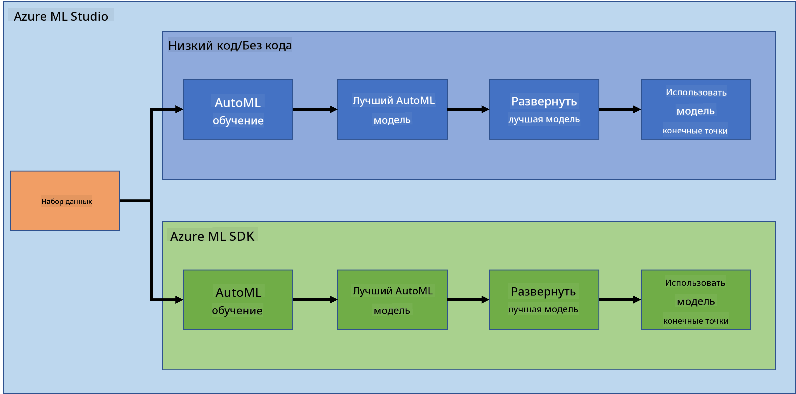

<!--
CO_OP_TRANSLATOR_METADATA:
{
  "original_hash": "8dfe141a0f46f7d253e07f74913c7f44",
  "translation_date": "2025-08-27T09:25:32+00:00",
  "source_file": "5-Data-Science-In-Cloud/README.md",
  "language_code": "ru"
}
-->
# Наука о данных в облаке

> Фото [Jelleke Vanooteghem](https://unsplash.com/@ilumire) с [Unsplash](https://unsplash.com/s/photos/cloud?orientation=landscape)

Когда речь идет о работе с большими данными в области науки о данных, облако может стать настоящим прорывом. В следующих трех уроках мы узнаем, что такое облако и почему оно может быть очень полезным. Мы также изучим набор данных о сердечной недостаточности и создадим модель, которая поможет оценить вероятность сердечной недостаточности у человека. Мы будем использовать возможности облака для обучения, развертывания и использования модели двумя различными способами. Один способ — используя только пользовательский интерфейс в стиле Low code/No code, другой — с помощью набора инструментов разработчика Azure Machine Learning (Azure ML SDK).

### Темы

1. [Почему использовать облако для науки о данных?](17-Introduction/README.md)
2. [Наука о данных в облаке: подход "Low code/No code"](18-Low-Code/README.md)
3. [Наука о данных в облаке: подход "Azure ML SDK"](19-Azure/README.md)

### Благодарности
Эти уроки были написаны с ☁️ и 💕 [Maud Levy](https://twitter.com/maudstweets) и [Tiffany Souterre](https://twitter.com/TiffanySouterre).

Данные для проекта прогнозирования сердечной недостаточности взяты из [
Larxel](https://www.kaggle.com/andrewmvd) на [Kaggle](https://www.kaggle.com/andrewmvd/heart-failure-clinical-data). Лицензия: [Attribution 4.0 International (CC BY 4.0)](https://creativecommons.org/licenses/by/4.0/).

---

**Отказ от ответственности**:  
Этот документ был переведен с помощью сервиса автоматического перевода [Co-op Translator](https://github.com/Azure/co-op-translator). Хотя мы стремимся к точности, пожалуйста, имейте в виду, что автоматические переводы могут содержать ошибки или неточности. Оригинальный документ на его родном языке следует считать авторитетным источником. Для критически важной информации рекомендуется профессиональный перевод человеком. Мы не несем ответственности за любые недоразумения или неправильные интерпретации, возникающие в результате использования этого перевода.