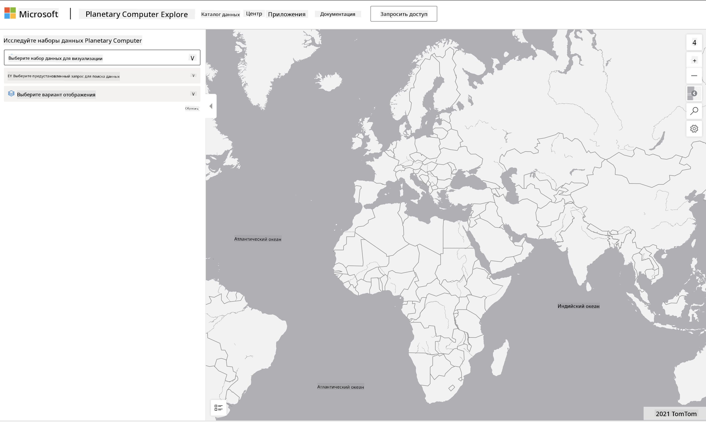

<!--
CO_OP_TRANSLATOR_METADATA:
{
  "original_hash": "d1e05715f9d97de6c4f1fb0c5a4702c0",
  "translation_date": "2025-08-27T09:24:24+00:00",
  "source_file": "6-Data-Science-In-Wild/20-Real-World-Examples/assignment.md",
  "language_code": "ru"
}
-->
# Изучение набора данных Planetary Computer

## Инструкции

В этом уроке мы обсудили различные области применения науки о данных, углубившись в примеры, связанные с исследованиями, устойчивым развитием и цифровыми гуманитарными науками. В этом задании вам предстоит изучить один из этих примеров более подробно и применить свои знания о визуализации и анализе данных, чтобы получить инсайты из данных об устойчивом развитии.

Проект [Planetary Computer](https://planetarycomputer.microsoft.com/) предоставляет наборы данных и API, доступ к которым можно получить, создав учетную запись. Запросите учетную запись, если хотите попробовать выполнить бонусный шаг задания. Сайт также предлагает функцию [Explorer](https://planetarycomputer.microsoft.com/explore), которой можно пользоваться без создания учетной записи.

`Шаги:`
Интерфейс Explorer (показан на скриншоте ниже) позволяет выбрать набор данных (из предложенных вариантов), предустановленный запрос (для фильтрации данных) и вариант визуализации (для создания соответствующего графика). В рамках этого задания вам нужно:

 1. Прочитать [документацию Explorer](https://planetarycomputer.microsoft.com/docs/overview/explorer/) — понять доступные опции.
 2. Изучить [каталог наборов данных](https://planetarycomputer.microsoft.com/catalog) — узнать назначение каждого набора.
 3. Использовать Explorer — выбрать интересующий набор данных, подходящий запрос и вариант визуализации.

`Ваше задание:`
Теперь изучите визуализацию, которая отображается в браузере, и ответьте на следующие вопросы:
 * Какие _характеристики_ есть у набора данных?
 * Какие _инсайты_ или результаты предоставляет визуализация?
 * Каковы _последствия_ этих инсайтов для целей устойчивого развития проекта?
 * Каковы _ограничения_ визуализации (т.е. какие инсайты вы не смогли получить)?
 * Если бы у вас были исходные данные, какие _альтернативные визуализации_ вы бы создали и почему?

`Бонусные баллы:`
Запросите учетную запись и войдите в систему после получения доступа.
 * Используйте опцию _Launch Hub_, чтобы открыть исходные данные в Notebook.
 * Изучите данные интерактивно и реализуйте альтернативные визуализации, которые вы придумали.
 * Теперь проанализируйте свои собственные визуализации — удалось ли вам получить инсайты, которые вы пропустили ранее?

## Критерии оценки

Превосходно | Удовлетворительно | Требует улучшения
--- | --- | -- |
Все пять основных вопросов были отвечены. Студент четко определил, как текущие и альтернативные визуализации могут предоставить инсайты для целей или результатов устойчивого развития.| Студент ответил как минимум на три основных вопроса в деталях, показав, что имел практический опыт работы с Explorer.| Студент не ответил на несколько вопросов или предоставил недостаточно деталей, что указывает на отсутствие значимых попыток выполнить проект.|

---

**Отказ от ответственности**:  
Этот документ был переведен с использованием сервиса автоматического перевода [Co-op Translator](https://github.com/Azure/co-op-translator). Хотя мы стремимся к точности, пожалуйста, имейте в виду, что автоматические переводы могут содержать ошибки или неточности. Оригинальный документ на его исходном языке следует считать авторитетным источником. Для получения критически важной информации рекомендуется профессиональный перевод человеком. Мы не несем ответственности за любые недоразумения или неправильные интерпретации, возникшие в результате использования данного перевода.