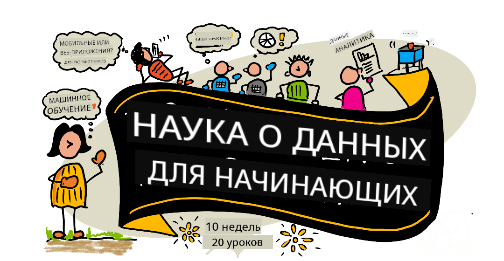

<!--
CO_OP_TRANSLATOR_METADATA:
{
  "original_hash": "ae529efe508173a92d4019d86744ec00",
  "translation_date": "2025-09-23T08:43:23+00:00",
  "source_file": "README.md",
  "language_code": "ru"
}
-->
# Основы Data Science - Учебный курс

Команда Azure Cloud Advocates в Microsoft рада предложить 10-недельный курс из 20 уроков, посвященный Data Science. Каждый урок включает в себя предварительные и итоговые тесты, письменные инструкции для выполнения задания, решение и задание. Наш проектно-ориентированный подход позволяет учиться через практику, что доказано способствует лучшему усвоению новых навыков.

**Огромная благодарность авторам:** [Jasmine Greenaway](https://www.twitter.com/paladique), [Dmitry Soshnikov](http://soshnikov.com), [Nitya Narasimhan](https://twitter.com/nitya), [Jalen McGee](https://twitter.com/JalenMcG), [Jen Looper](https://twitter.com/jenlooper), [Maud Levy](https://twitter.com/maudstweets), [Tiffany Souterre](https://twitter.com/TiffanySouterre), [Christopher Harrison](https://www.twitter.com/geektrainer).

**🙏 Особая благодарность 🙏 нашим авторам, рецензентам и контрибьюторам из числа [Microsoft Student Ambassador](https://studentambassadors.microsoft.com/),** включая Aaryan Arora, [Aditya Garg](https://github.com/AdityaGarg00), [Alondra Sanchez](https://www.linkedin.com/in/alondra-sanchez-molina/), [Ankita Singh](https://www.linkedin.com/in/ankitasingh007), [Anupam Mishra](https://www.linkedin.com/in/anupam--mishra/), [Arpita Das](https://www.linkedin.com/in/arpitadas01/), ChhailBihari Dubey, [Dibri Nsofor](https://www.linkedin.com/in/dibrinsofor), [Dishita Bhasin](https://www.linkedin.com/in/dishita-bhasin-7065281bb), [Majd Safi](https://www.linkedin.com/in/majd-s/), [Max Blum](https://www.linkedin.com/in/max-blum-6036a1186/), [Miguel Correa](https://www.linkedin.com/in/miguelmque/), [Mohamma Iftekher (Iftu) Ebne Jalal](https://twitter.com/iftu119), [Nawrin Tabassum](https://www.linkedin.com/in/nawrin-tabassum), [Raymond Wangsa Putra](https://www.linkedin.com/in/raymond-wp/), [Rohit Yadav](https://www.linkedin.com/in/rty2423), Samridhi Sharma, [Sanya Sinha](https://www.linkedin.com/mwlite/in/sanya-sinha-13aab1200),
[Sheena Narula](https://www.linkedin.com/in/sheena-narua-n/), [Tauqeer Ahmad](https://www.linkedin.com/in/tauqeerahmad5201/), Yogendrasingh Pawar, [Vidushi Gupta](https://www.linkedin.com/in/vidushi-gupta07/), [Jasleen Sondhi](https://www.linkedin.com/in/jasleen-sondhi/)

||
|:---:|
| Data Science For Beginners - _Скетчноут от [@nitya](https://twitter.com/nitya)_ |

### 🌐 Поддержка нескольких языков

#### Поддерживается через GitHub Action (автоматически и всегда актуально)

[Французский](../fr/README.md) | [Испанский](../es/README.md) | [Немецкий](../de/README.md) | [Русский](./README.md) | [Арабский](../ar/README.md) | [Персидский (фарси)](../fa/README.md) | [Урду](../ur/README.md) | [Китайский (упрощенный)](../zh/README.md) | [Китайский (традиционный, Макао)](../mo/README.md) | [Китайский (традиционный, Гонконг)](../hk/README.md) | [Китайский (традиционный, Тайвань)](../tw/README.md) | [Японский](../ja/README.md) | [Корейский](../ko/README.md) | [Хинди](../hi/README.md) | [Бенгальский](../bn/README.md) | [Маратхи](../mr/README.md) | [Непальский](../ne/README.md) | [Панджаби (гурмукхи)](../pa/README.md) | [Португальский (Португалия)](../pt/README.md) | [Португальский (Бразилия)](../br/README.md) | [Итальянский](../it/README.md) | [Польский](../pl/README.md) | [Турецкий](../tr/README.md) | [Греческий](../el/README.md) | [Тайский](../th/README.md) | [Шведский](../sv/README.md) | [Датский](../da/README.md) | [Норвежский](../no/README.md) | [Финский](../fi/README.md) | [Голландский](../nl/README.md) | [Иврит](../he/README.md) | [Вьетнамский](../vi/README.md) | [Индонезийский](../id/README.md) | [Малайский](../ms/README.md) | [Тагальский (филиппинский)](../tl/README.md) | [Суахили](../sw/README.md) | [Венгерский](../hu/README.md) | [Чешский](../cs/README.md) | [Словацкий](../sk/README.md) | [Румынский](../ro/README.md) | [Болгарский](../bg/README.md) | [Сербский (кириллица)](../sr/README.md) | [Хорватский](../hr/README.md) | [Словенский](../sl/README.md) | [Украинский](../uk/README.md) | [Бирманский (Мьянма)](../my/README.md)

**Если вы хотите добавить поддержку других языков, список доступных языков находится [здесь](https://github.com/Azure/co-op-translator/blob/main/getting_started/supported-languages.md)**

#### Присоединяйтесь к нашему сообществу 

У нас проходит серия обучений с использованием ИИ в Discord. Узнайте больше и присоединяйтесь к нам на [Learn with AI Series](https://aka.ms/learnwithai/discord) с 18 по 30 сентября 2025 года. Вы получите советы и рекомендации по использованию GitHub Copilot для Data Science.

# Вы студент?

Начните с этих ресурсов:

- [Студенческая страница](https://docs.microsoft.com/en-gb/learn/student-hub?WT.mc_id=academic-77958-bethanycheum). Здесь вы найдете ресурсы для начинающих, студенческие пакеты и даже способы получить бесплатный ваучер на сертификацию. Это страница, которую стоит добавить в закладки и проверять время от времени, так как мы обновляем контент как минимум раз в месяц.
- [Microsoft Learn Student Ambassadors](https://studentambassadors.microsoft.com?WT.mc_id=academic-77958-bethanycheum). Присоединяйтесь к глобальному сообществу студенческих амбассадоров — это может стать вашим путем в Microsoft.

# Начало работы

> **Преподаватели**: мы [добавили несколько рекомендаций](for-teachers.md) о том, как использовать этот курс. Мы будем рады вашему отзыву [в нашем форуме обсуждений](https://github.com/microsoft/Data-Science-For-Beginners/discussions)!

> **[Студенты](https://aka.ms/student-page)**: чтобы использовать этот курс самостоятельно, сделайте форк репозитория и выполняйте задания самостоятельно, начиная с предварительного теста. Затем прочитайте лекцию и выполните остальные задания. Постарайтесь создавать проекты, понимая уроки, а не копируя готовый код решений; однако этот код доступен в папках /solutions для каждого проектно-ориентированного урока. Еще одна идея — создать учебную группу с друзьями и изучать материал вместе. Для дальнейшего изучения мы рекомендуем [Microsoft Learn](https://docs.microsoft.com/en-us/users/jenlooper-2911/collections/qprpajyoy3x0g7?WT.mc_id=academic-77958-bethanycheum).

## Знакомьтесь с командой

**Gif создан** [Mohit Jaisal](https://www.linkedin.com/in/mohitjaisal)

> 🎥 Нажмите на изображение выше, чтобы посмотреть видео о проекте и людях, которые его создали!

## Педагогический подход

При создании этого курса мы выбрали два педагогических принципа: проектно-ориентированный подход и частые тесты. К концу этого курса студенты изучат основные принципы Data Science, включая этические аспекты, подготовку данных, различные методы работы с данными, визуализацию данных, анализ данных, реальные примеры использования Data Science и многое другое.

Кроме того, тесты с низким уровнем стресса перед занятием настраивают студента на изучение темы, а второй тест после занятия способствует лучшему запоминанию. Этот курс был разработан как гибкий и увлекательный, его можно проходить полностью или частично. Проекты начинаются с простых и становятся все более сложными к концу 10-недельного цикла.

> Ознакомьтесь с нашими [Правилами поведения](CODE_OF_CONDUCT.md), [Руководством по участию](CONTRIBUTING.md), [Руководством по переводу](TRANSLATIONS.md). Мы будем рады вашим конструктивным отзывам!

## Каждый урок включает:

- Опциональный скетчноут
- Опциональное дополнительное видео
- Разогревающий тест перед уроком
- Письменный урок
- Для проектно-ориентированных уроков — пошаговые инструкции по созданию проекта
- Проверка знаний
- Задание
- Дополнительное чтение
- Домашнее задание
- [Тест после урока](https://ff-quizzes.netlify.app/en/)

> **Примечание о тестах**: Все тесты находятся в папке Quiz-App, всего 40 тестов по три вопроса в каждом. Они связаны с уроками, но приложение для тестов можно запустить локально или развернуть в Azure; следуйте инструкциям в папке `quiz-app`. Постепенно тесты переводятся на другие языки.

## Уроки
||
|:---:|
| Data Science For Beginners: Дорожная карта - _Скетчноут от [@nitya](https://twitter.com/nitya)_ |

| Номер урока | Тема | Группа уроков | Цели обучения | Связанный урок | Автор |
| :-----------: | :----------------------------------------: | :--------------------------------------------------: | :-----------------------------------------------------------------------------------------------------------------------------------------------------------------------: | :---------------------------------------------------------------------: | :----: |
| 01 | Определение Data Science | [Введение](1-Introduction/README.md) | Изучите основные концепции Data Science и его связь с искусственным интеллектом, машинным обучением и большими данными. | [урок](1-Introduction/01-defining-data-science/README.md) [видео](https://youtu.be/beZ7Mb_oz9I) | [Дмитрий](http://soshnikov.com) |
| 02 | Этика Data Science | [Введение](1-Introduction/README.md) | Концепции этики данных, вызовы и подходы. | [урок](1-Introduction/02-ethics/README.md) | [Нития](https://twitter.com/nitya) |
| 03 | Определение данных | [Введение](1-Introduction/README.md) | Как классифицируются данные и их основные источники. | [урок](1-Introduction/03-defining-data/README.md) | [Жасмин](https://www.twitter.com/paladique) |
| 04 | Введение в статистику и теорию вероятностей | [Введение](1-Introduction/README.md) | Математические методы теории вероятностей и статистики для анализа данных. | [урок](1-Introduction/04-stats-and-probability/README.md) [видео](https://youtu.be/Z5Zy85g4Yjw) | [Дмитрий](http://soshnikov.com) |
| 05 | Работа с реляционными данными | [Работа с данными](2-Working-With-Data/README.md) | Введение в реляционные данные и основы их анализа с использованием языка SQL (произносится как "си-квел"). | [урок](2-Working-With-Data/05-relational-databases/README.md) | [Кристофер](https://www.twitter.com/geektrainer) | | |
| 06 | Работа с данными NoSQL | [Работа с данными](2-Working-With-Data/README.md) | Введение в нереляционные данные, их типы и основы анализа документных баз данных. | [урок](2-Working-With-Data/06-non-relational/README.md) | [Жасмин](https://twitter.com/paladique) |
| 07 | Работа с Python | [Работа с данными](2-Working-With-Data/README.md) | Основы использования Python для анализа данных с библиотеками, такими как Pandas. Рекомендуется базовое понимание программирования на Python. | [урок](2-Working-With-Data/07-python/README.md) [видео](https://youtu.be/dZjWOGbsN4Y) | [Дмитрий](http://soshnikov.com) |
| 08 | Подготовка данных | [Работа с данными](2-Working-With-Data/README.md) | Техники очистки и преобразования данных для решения проблем, связанных с отсутствующими, неточными или неполными данными. | [урок](2-Working-With-Data/08-data-preparation/README.md) | [Жасмин](https://www.twitter.com/paladique) |
| 09 | Визуализация количеств | [Визуализация данных](3-Data-Visualization/README.md) | Узнайте, как использовать Matplotlib для визуализации данных о птицах 🦆 | [урок](3-Data-Visualization/09-visualization-quantities/README.md) | [Джен](https://twitter.com/jenlooper) |
| 10 | Визуализация распределений данных | [Визуализация данных](3-Data-Visualization/README.md) | Визуализация наблюдений и трендов в пределах интервала. | [урок](3-Data-Visualization/10-visualization-distributions/README.md) | [Джен](https://twitter.com/jenlooper) |
| 11 | Визуализация пропорций | [Визуализация данных](3-Data-Visualization/README.md) | Визуализация дискретных и сгруппированных процентов. | [урок](3-Data-Visualization/11-visualization-proportions/README.md) | [Джен](https://twitter.com/jenlooper) |
| 12 | Визуализация взаимосвязей | [Визуализация данных](3-Data-Visualization/README.md) | Визуализация связей и корреляций между наборами данных и их переменными. | [урок](3-Data-Visualization/12-visualization-relationships/README.md) | [Джен](https://twitter.com/jenlooper) |
| 13 | Значимые визуализации | [Визуализация данных](3-Data-Visualization/README.md) | Техники и рекомендации для создания визуализаций, которые помогают эффективно решать задачи и получать инсайты. | [урок](3-Data-Visualization/13-meaningful-visualizations/README.md) | [Джен](https://twitter.com/jenlooper) |
| 14 | Введение в жизненный цикл Data Science | [Жизненный цикл](4-Data-Science-Lifecycle/README.md) | Введение в жизненный цикл Data Science и его первый этап — сбор и извлечение данных. | [урок](4-Data-Science-Lifecycle/14-Introduction/README.md) | [Жасмин](https://twitter.com/paladique) |
| 15 | Анализ | [Жизненный цикл](4-Data-Science-Lifecycle/README.md) | Этот этап жизненного цикла Data Science посвящен техникам анализа данных. | [урок](4-Data-Science-Lifecycle/15-analyzing/README.md) | [Жасмин](https://twitter.com/paladique) | | |
| 16 | Коммуникация | [Жизненный цикл](4-Data-Science-Lifecycle/README.md) | Этот этап жизненного цикла Data Science посвящен представлению инсайтов из данных в удобной для понимания форме для лиц, принимающих решения. | [урок](4-Data-Science-Lifecycle/16-communication/README.md) | [Джейлен](https://twitter.com/JalenMcG) | | |
| 17 | Data Science в облаке | [Облачные данные](5-Data-Science-In-Cloud/README.md) | Серия уроков, посвященная Data Science в облаке и его преимуществам. | [урок](5-Data-Science-In-Cloud/17-Introduction/README.md) | [Тиффани](https://twitter.com/TiffanySouterre) и [Мод](https://twitter.com/maudstweets) |
| 18 | Data Science в облаке | [Облачные данные](5-Data-Science-In-Cloud/README.md) | Обучение моделей с использованием инструментов Low Code. | [урок](5-Data-Science-In-Cloud/18-Low-Code/README.md) | [Тиффани](https://twitter.com/TiffanySouterre) и [Мод](https://twitter.com/maudstweets) |
| 19 | Data Science в облаке | [Облачные данные](5-Data-Science-In-Cloud/README.md) | Развертывание моделей с помощью Azure Machine Learning Studio. | [урок](5-Data-Science-In-Cloud/19-Azure/README.md) | [Тиффани](https://twitter.com/TiffanySouterre) и [Мод](https://twitter.com/maudstweets) |
| 20 | Data Science в реальном мире | [В реальном мире](6-Data-Science-In-Wild/README.md) | Проекты, основанные на Data Science, в реальных условиях. | [урок](6-Data-Science-In-Wild/20-Real-World-Examples/README.md) | [Нития](https://twitter.com/nitya) |

## GitHub Codespaces

Следуйте этим шагам, чтобы открыть этот пример в Codespace:
1. Нажмите на выпадающее меню Code и выберите опцию Open with Codespaces.
2. Выберите + New codespace внизу панели.
Для получения дополнительной информации ознакомьтесь с [документацией GitHub](https://docs.github.com/en/codespaces/developing-in-codespaces/creating-a-codespace-for-a-repository#creating-a-codespace).

## VSCode Remote - Containers
Следуйте этим шагам, чтобы открыть этот репозиторий в контейнере, используя ваш локальный компьютер и VSCode с расширением VS Code Remote - Containers:

1. Если вы впервые используете контейнеры для разработки, убедитесь, что ваша система соответствует требованиям (например, установлен Docker), указанным в [документации по началу работы](https://code.visualstudio.com/docs/devcontainers/containers#_getting-started).

Чтобы использовать этот репозиторий, вы можете открыть его в изолированном Docker-томе:

**Примечание**: Внутри будет использоваться команда Remote-Containers: **Clone Repository in Container Volume...** для клонирования исходного кода в Docker-том вместо локальной файловой системы. [Томы](https://docs.docker.com/storage/volumes/) являются предпочтительным механизмом для сохранения данных контейнера.

Или откройте локально клонированную или загруженную версию репозитория:

- Клонируйте этот репозиторий на вашу локальную файловую систему.
- Нажмите F1 и выберите команду **Remote-Containers: Open Folder in Container...**.
- Выберите клонированную копию этой папки, дождитесь запуска контейнера и начните работу.

## Оффлайн-доступ

Вы можете запустить эту документацию оффлайн, используя [Docsify](https://docsify.js.org/#/). Форкните этот репозиторий, [установите Docsify](https://docsify.js.org/#/quickstart) на вашем локальном компьютере, затем в корневой папке этого репозитория введите `docsify serve`. Веб-сайт будет доступен на порту 3000 вашего localhost: `localhost:3000`.

> Примечание: блокноты не будут отображаться через Docsify, поэтому, если вам нужно запустить блокнот, сделайте это отдельно в VS Code с запущенным Python-ядром.

## Другие учебные материалы

Наша команда создает другие учебные материалы! Ознакомьтесь с:

- [Generative AI для начинающих](https://aka.ms/genai-beginners)
- [Generative AI для начинающих .NET](https://github.com/microsoft/Generative-AI-for-beginners-dotnet)
- [Generative AI с JavaScript](https://github.com/microsoft/generative-ai-with-javascript)
- [Generative AI с Java](https://aka.ms/genaijava)
- [AI для начинающих](https://aka.ms/ai-beginners)
- [Data Science для начинающих](https://aka.ms/datascience-beginners)
- [Bash для начинающих](https://github.com/microsoft/bash-for-beginners)
- [ML для начинающих](https://aka.ms/ml-beginners)
- [Кибербезопасность для начинающих](https://github.com/microsoft/Security-101) 
- [Веб-разработка для начинающих](https://aka.ms/webdev-beginners)
- [IoT для начинающих](https://aka.ms/iot-beginners)
- [Машинное обучение для начинающих](https://aka.ms/ml-beginners)
- [Разработка XR для начинающих](https://aka.ms/xr-dev-for-beginners)
- [Мастерство GitHub Copilot для парного программирования с AI](https://aka.ms/GitHubCopilotAI)
- [Разработка XR для начинающих](https://github.com/microsoft/xr-development-for-beginners)
- [Мастерство GitHub Copilot для разработчиков C#/.NET](https://github.com/microsoft/mastering-github-copilot-for-dotnet-csharp-developers)
- [Выберите свое приключение с Copilot](https://github.com/microsoft/CopilotAdventures)

---

