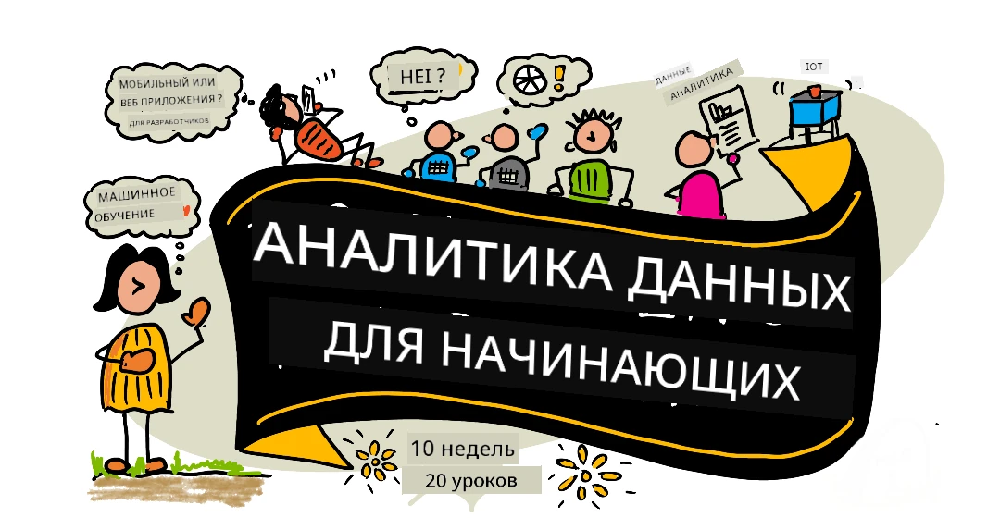
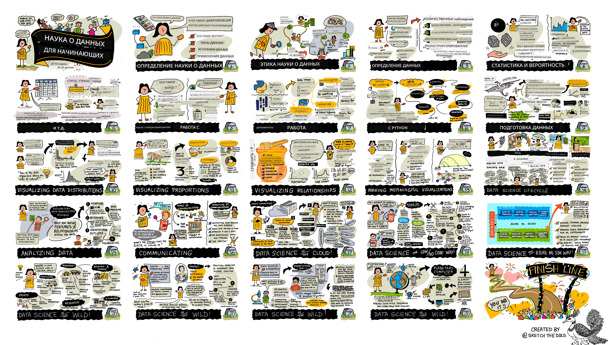

# Data Science для начинающих - Учебная программа

[](https://github.com/codespaces/new?hide_repo_select=true&ref=main&repo=344191198)

[](https://github.com/microsoft/Data-Science-For-Beginners/blob/master/LICENSE)
[](https://GitHub.com/microsoft/Data-Science-For-Beginners/graphs/contributors/)
[](https://GitHub.com/microsoft/Data-Science-For-Beginners/issues/)
[](https://GitHub.com/microsoft/Data-Science-For-Beginners/pulls/)
[](http://makeapullrequest.com)

[](https://GitHub.com/microsoft/Data-Science-For-Beginners/watchers/)
[](https://GitHub.com/microsoft/Data-Science-For-Beginners/network/)
[](https://GitHub.com/microsoft/Data-Science-For-Beginners/stargazers/)


[](https://discord.gg/nTYy5BXMWG)

[](https://aka.ms/foundry/forum)

Azure Cloud Advocates в Microsoft рады предложить 10-недельную программу из 20 уроков, полностью посвящённую Data Science. Каждый урок включает тесты до и после занятия, письменные инструкции для выполнения урока, решение и задание. Наша проектно-ориентированная методика обучения позволяет учиться на практике — это проверенный способ закрепления новых навыков.

**Большое спасибо нашим авторам:** [Jasmine Greenaway](https://www.twitter.com/paladique), [Dmitry Soshnikov](http://soshnikov.com), [Nitya Narasimhan](https://twitter.com/nitya), [Jalen McGee](https://twitter.com/JalenMcG), [Jen Looper](https://twitter.com/jenlooper), [Maud Levy](https://twitter.com/maudstweets), [Tiffany Souterre](https://twitter.com/TiffanySouterre), [Christopher Harrison](https://www.twitter.com/geektrainer).

**🙏 Особая благодарность 🙏 нашим автором, рецензентам и контрибьюторам из числа [студенческих послов Microsoft](https://studentambassadors.microsoft.com/),** в частности Aaryan Arora, [Aditya Garg](https://github.com/AdityaGarg00), [Alondra Sanchez](https://www.linkedin.com/in/alondra-sanchez-molina/), [Ankita Singh](https://www.linkedin.com/in/ankitasingh007), [Anupam Mishra](https://www.linkedin.com/in/anupam--mishra/), [Arpita Das](https://www.linkedin.com/in/arpitadas01/), ChhailBihari Dubey, [Dibri Nsofor](https://www.linkedin.com/in/dibrinsofor), [Dishita Bhasin](https://www.linkedin.com/in/dishita-bhasin-7065281bb), [Majd Safi](https://www.linkedin.com/in/majd-s/), [Max Blum](https://www.linkedin.com/in/max-blum-6036a1186/), [Miguel Correa](https://www.linkedin.com/in/miguelmque/), [Mohamma Iftekher (Iftu) Ebne Jalal](https://twitter.com/iftu119), [Nawrin Tabassum](https://www.linkedin.com/in/nawrin-tabassum), [Raymond Wangsa Putra](https://www.linkedin.com/in/raymond-wp/), [Rohit Yadav](https://www.linkedin.com/in/rty2423), Samridhi Sharma, [Sanya Sinha](https://www.linkedin.com/mwlite/in/sanya-sinha-13aab1200),
[Sheena Narula](https://www.linkedin.com/in/sheena-narua-n/), [Tauqeer Ahmad](https://www.linkedin.com/in/tauqeerahmad5201/), Yogendrasingh Pawar , [Vidushi Gupta](https://www.linkedin.com/in/vidushi-gupta07/), [Jasleen Sondhi](https://www.linkedin.com/in/jasleen-sondhi/)

||
|:---:|
| Data Science для начинающих - _Скетчноут от [@nitya](https://twitter.com/nitya)_ |

### 🌐 Поддержка нескольких языков

#### Поддерживается с помощью GitHub Action (Автоматизировано и всегда актуально)

<!-- CO-OP TRANSLATOR LANGUAGES TABLE START -->
[Arabic](../ar/README.md) | [Bengali](../bn/README.md) | [Bulgarian](../bg/README.md) | [Burmese (Myanmar)](../my/README.md) | [Chinese (Simplified)](../zh-CN/README.md) | [Chinese (Traditional, Hong Kong)](../zh-HK/README.md) | [Chinese (Traditional, Macau)](../zh-MO/README.md) | [Chinese (Traditional, Taiwan)](../zh-TW/README.md) | [Croatian](../hr/README.md) | [Czech](../cs/README.md) | [Danish](../da/README.md) | [Dutch](../nl/README.md) | [Estonian](../et/README.md) | [Finnish](../fi/README.md) | [French](../fr/README.md) | [German](../de/README.md) | [Greek](../el/README.md) | [Hebrew](../he/README.md) | [Hindi](../hi/README.md) | [Hungarian](../hu/README.md) | [Indonesian](../id/README.md) | [Italian](../it/README.md) | [Japanese](../ja/README.md) | [Kannada](../kn/README.md) | [Khmer](../km/README.md) | [Korean](../ko/README.md) | [Lithuanian](../lt/README.md) | [Malay](../ms/README.md) | [Malayalam](../ml/README.md) | [Marathi](../mr/README.md) | [Nepali](../ne/README.md) | [Nigerian Pidgin](../pcm/README.md) | [Norwegian](../no/README.md) | [Persian (Farsi)](../fa/README.md) | [Polish](../pl/README.md) | [Portuguese (Brazil)](../pt-BR/README.md) | [Portuguese (Portugal)](../pt-PT/README.md) | [Punjabi (Gurmukhi)](../pa/README.md) | [Romanian](../ro/README.md) | [Russian](./README.md) | [Serbian (Cyrillic)](../sr/README.md) | [Slovak](../sk/README.md) | [Slovenian](../sl/README.md) | [Spanish](../es/README.md) | [Swahili](../sw/README.md) | [Swedish](../sv/README.md) | [Tagalog (Filipino)](../tl/README.md) | [Tamil](../ta/README.md) | [Telugu](../te/README.md) | [Thai](../th/README.md) | [Turkish](../tr/README.md) | [Ukrainian](../uk/README.md) | [Urdu](../ur/README.md) | [Vietnamese](../vi/README.md)

> **Предпочитаете клонировать локально?**
>
> Этот репозиторий содержит более 50 переводов, что значительно увеличивает размер загрузки. Чтобы клонировать без переводов, используйте разреженную загрузку (sparse checkout):
>
> **Bash / macOS / Linux:**
> ```bash
> git clone --filter=blob:none --sparse https://github.com/microsoft/Data-Science-For-Beginners.git
> cd Data-Science-For-Beginners
> git sparse-checkout set --no-cone '/*' '!translations' '!translated_images'
> ```
>
> **CMD (Windows):**
> ```cmd
> git clone --filter=blob:none --sparse https://github.com/microsoft/Data-Science-For-Beginners.git
> cd Data-Science-For-Beginners
> git sparse-checkout set --no-cone "/*" "!translations" "!translated_images"
> ```
>
> Это даст вам всё необходимое для прохождения курса с гораздо более быстрой загрузкой.
<!-- CO-OP TRANSLATOR LANGUAGES TABLE END -->

**Если вы хотите поддерживать дополнительные языки перевода, они перечислены [здесь](https://github.com/Azure/co-op-translator/blob/main/getting_started/supported-languages.md)**

#### Присоединяйтесь к нашему сообществу 
[](https://discord.gg/nTYy5BXMWG)

У нас проходит серия на Discord с обучением ИИ, узнайте больше и присоединяйтесь к нам на [Learn with AI Series](https://aka.ms/learnwithai/discord) с 18 по 30 сентября 2025 года. Вы получите советы и трюки по использованию GitHub Copilot для Data Science.


# Вы студент?

Начните с следующих ресурсов:

- [Страница студента](https://docs.microsoft.com/en-gb/learn/student-hub?WT.mc_id=academic-77958-bethanycheum) Здесь вы найдете материалы для начинающих, студенческие пакеты и даже способы получить бесплатный ваучер на сертификацию. Это страница, которую стоит добавить в закладки и периодически проверять, так как мы обновляем контент как минимум раз в месяц.
- [Microsoft Learn Student Ambassadors](https://studentambassadors.microsoft.com?WT.mc_id=academic-77958-bethanycheum) Присоединяйтесь к глобальному сообществу студенческих послов, это может стать вашим путём в Microsoft.

# Начало работы

## 📚 Документация

- **[Руководство по установке](INSTALLATION.md)** - Пошаговая инструкция по настройке для новичков
- **[Руководство пользователя](USAGE.md)** - Примеры и типовые рабочие процессы
- **[Устранение неполадок](TROUBLESHOOTING.md)** - Решения типичных проблем
- **[Руководство для контрибьюторов](CONTRIBUTING.md)** - Как внести свой вклад в этот проект
- **[Для преподавателей](for-teachers.md)** - Методические указания и материалы для занятий

## 👨‍🎓 Для студентов
> **Полные новички**: Новый в Data Science? Начните с наших [простых примеров для начинающих](examples/README.md)! Эти простые, хорошо прокомментированные примеры помогут вам разобраться с основами перед тем, как перейти к полной программе.
> **[Студенты](https://aka.ms/student-page)**: чтобы использовать эту учебную программу самостоятельно, форкните весь репозиторий и выполняйте упражнения самостоятельно, начиная с теста перед лекцией. Затем прочитайте лекцию и выполните остальные задания. Пытайтесь создавать проекты, понимая уроки, а не просто копируйте код решения; однако код можно найти в папках /solutions в каждом проектно-ориентированном уроке. Другой вариант — сформировать учебную группу с друзьями и проходить материал вместе. Для дальнейшего изучения рекомендуем [Microsoft Learn](https://docs.microsoft.com/en-us/users/jenlooper-2911/collections/qprpajyoy3x0g7?WT.mc_id=academic-77958-bethanycheum).

**Быстрый старт:**
1. Ознакомьтесь с [Руководством по установке](INSTALLATION.md) для настройки вашей среды
2. Просмотрите [Руководство пользователя](USAGE.md), чтобы узнать как работать с учебной программой
3. Начните с Урока 1 и проходите последовательно
4. Присоединяйтесь к нашему [сообществу в Discord](https://aka.ms/ds4beginners/discord) для поддержки

## 👩‍🏫 Для преподавателей
> **Учителям**: мы [включили некоторые рекомендации](for-teachers.md) о том, как использовать эту учебную программу. Мы будем рады вашим отзывам [на нашем форуме для обсуждений](https://github.com/microsoft/Data-Science-For-Beginners/discussions)!

## Встречайте команду

[](https://youtu.be/8mzavjQSMM4 "Промо-видео")

**Gif от** [Mohit Jaisal](https://www.linkedin.com/in/mohitjaisal)

> 🎥 Нажмите на изображение выше, чтобы посмотреть видео о проекте и людях, его создавших!

## Педагогика

При создании этой учебной программы мы выбрали два педагогических принципа: обеспечение проектной направленности и частое проведение викторин. К концу этой серии студенты изучат основные принципы науки о данных, включая этические концепции, подготовку данных, различные способы работы с данными, визуализацию данных, анализ данных, реальные примеры использования науки о данных и многое другое.

Кроме того, викторина с низкой ставкой перед занятиями задаёт намерение студента для изучения темы, а вторая викторина после занятия обеспечивает лучшее усвоение материала. Эта учебная программа разработана так, чтобы быть гибкой и увлекательной, её можно пройти полностью или частично. Проекты начинают с простого и постепенно усложняются к концу 10-недельного цикла.

> Ознакомьтесь с нашим [Кодексом поведения](CODE_OF_CONDUCT.md), [Правилами участия](CONTRIBUTING.md), [Руководством по переводам](TRANSLATIONS.md). Мы приветствуем ваши конструктивные отзывы!

## Каждое занятие включает:

- Необязательную скетчноут
- Необязательное дополнительное видео
- Разминочную викторину перед занятием
- Письменное занятие
- Для проектных занятий — пошаговые руководства по созданию проекта
- Проверку знаний
- Задание-челлендж
- Дополнительное чтение
- Домашнее задание
- [Викторину после занятия](https://ff-quizzes.netlify.app/en/)

> **Заметка о викторинах**: Все викторины находятся в папке Quiz-App, всего 40 викторин по три вопроса в каждой. Они связаны с уроками, но приложение викторин можно запускать локально или развертывать в Azure; следуйте инструкциям в папке `quiz-app`. Викторины постепенно локализуются.

## 🎓 Примеры для начинающих

**Новичок в науке о данных?** Мы создали специальный [каталог примеров](examples/README.md) с простым, хорошо прокомментированным кодом, чтобы помочь начать:

- 🌟 **Hello World** — Ваша первая программа по науке о данных
- 📂 **Загрузка данных** — Научитесь читать и исследовать наборы данных
- 📊 **Простой анализ** — Вычисление статистики и поиск закономерностей
- 📈 **Базовая визуализация** — Создание диаграмм и графиков
- 🔬 **Реальный проект** — Полный рабочий процесс от начала до конца

Каждый пример включает подробные комментарии, объясняющие каждый шаг — идеален для абсолютных новичков!

👉 **[Начните с примеров](examples/README.md)** 👈

## Уроки


||
|:---:|
| Наука о данных для начинающих: Дорожная карта — _скетчноут от [@nitya](https://twitter.com/nitya)_ |


| Номер урока | Тема | Группа уроков | Цели обучения | Связанный урок | Автор |
| :-----------: | :----------------------------------------: | :--------------------------------------------------: | :-----------------------------------------------------------------------------------------------------------------------------------------------------------------------: | :---------------------------------------------------------------------: | :----: |
| 01 | Определение науки о данных | [Введение](1-Introduction/README.md) | Изучить основные понятия науки о данных и её связь с искусственным интеллектом, машинным обучением и большими данными. | [урок](1-Introduction/01-defining-data-science/README.md) [видео](https://youtu.be/beZ7Mb_oz9I) | [Дмитрий](http://soshnikov.com) |
| 02 | Этика в науке о данных | [Введение](1-Introduction/README.md) | Понятия, вызовы и рамки этики данных. | [урок](1-Introduction/02-ethics/README.md) | [Нитя](https://twitter.com/nitya) |
| 03 | Определение данных | [Введение](1-Introduction/README.md) | Как классифицируются данные и их основные источники. | [урок](1-Introduction/03-defining-data/README.md) | [Жасмин](https://www.twitter.com/paladique) |
| 04 | Введение в статистику и вероятность | [Введение](1-Introduction/README.md) | Математические методы вероятности и статистики для понимания данных. | [урок](1-Introduction/04-stats-and-probability/README.md) [видео](https://youtu.be/Z5Zy85g4Yjw) | [Дмитрий](http://soshnikov.com) |
| 05 | Работа с реляционными данными | [Работа с данными](2-Working-With-Data/README.md) | Введение в реляционные данные и основы изучения и анализа реляционных данных с помощью языка структурированных запросов SQL (произносится «си-квел»). | [урок](2-Working-With-Data/05-relational-databases/README.md) | [Кристофер](https://www.twitter.com/geektrainer) | | |
| 06 | Работа с NoSQL данными | [Работа с данными](2-Working-With-Data/README.md) | Введение в нереляционные данные, их различные типы и основы изучения и анализа документных баз данных. | [урок](2-Working-With-Data/06-non-relational/README.md) | [Жасмин](https://twitter.com/paladique)|
| 07 | Работа с Python | [Работа с данными](2-Working-With-Data/README.md) | Основы использования Python для исследования данных с библиотеками, такими как Pandas. Рекомендуется базовое понимание программирования на Python. | [урок](2-Working-With-Data/07-python/README.md) [видео](https://youtu.be/dZjWOGbsN4Y) | [Дмитрий](http://soshnikov.com) |
| 08 | Подготовка данных | [Работа с данными](2-Working-With-Data/README.md) | Темы по методам очистки и трансформации данных для обработки проблем с отсутствующими, неточными или неполными данными. | [урок](2-Working-With-Data/08-data-preparation/README.md) | [Жасмин](https://www.twitter.com/paladique) |
| 09 | Визуализация количеств | [Визуализация данных](3-Data-Visualization/README.md) | Научитесь использовать Matplotlib для визуализации данных о птицах 🦆 | [урок](3-Data-Visualization/09-visualization-quantities/README.md) | [Джен](https://twitter.com/jenlooper) |
| 10 | Визуализация распределений данных | [Визуализация данных](3-Data-Visualization/README.md) | Визуализация наблюдений и трендов в рамках интервала. | [урок](3-Data-Visualization/10-visualization-distributions/README.md) | [Джен](https://twitter.com/jenlooper) |
| 11 | Визуализация пропорций | [Визуализация данных](3-Data-Visualization/README.md) | Визуализация дискретных и сгруппированных процентов. | [урок](3-Data-Visualization/11-visualization-proportions/README.md) | [Джен](https://twitter.com/jenlooper) |
| 12 | Визуализация взаимосвязей | [Визуализация данных](3-Data-Visualization/README.md) | Визуализация связей и корреляций между наборами данных и их переменными. | [урок](3-Data-Visualization/12-visualization-relationships/README.md) | [Джен](https://twitter.com/jenlooper) |
| 13 | Значимые визуализации | [Визуализация данных](3-Data-Visualization/README.md) | Методики и рекомендации для создания ценных визуализаций для эффективного решения проблем и получения инсайтов. | [урок](3-Data-Visualization/13-meaningful-visualizations/README.md) | [Джен](https://twitter.com/jenlooper) |
| 14 | Введение в жизненный цикл науки о данных | [Жизненный цикл](4-Data-Science-Lifecycle/README.md) | Введение в жизненный цикл науки о данных и его первый этап — получение и извлечение данных. | [урок](4-Data-Science-Lifecycle/14-Introduction/README.md) | [Жасмин](https://twitter.com/paladique) |
| 15 | Анализ | [Жизненный цикл](4-Data-Science-Lifecycle/README.md) | Эта фаза жизненного цикла науки о данных посвящена методам анализа данных. | [урок](4-Data-Science-Lifecycle/15-analyzing/README.md) | [Жасмин](https://twitter.com/paladique) | | |
| 16 | Коммуникация | [Жизненный цикл](4-Data-Science-Lifecycle/README.md) | Эта фаза жизненного цикла науки о данных посвящена представлению инсайтов из данных таким образом, чтобы облегчить понимание лицам, принимающим решения. | [урок](4-Data-Science-Lifecycle/16-communication/README.md) | [Джейлен](https://twitter.com/JalenMcG) | | |
| 17 | Наука о данных в облаке | [Облачные данные](5-Data-Science-In-Cloud/README.md) | Эта серия уроков знакомит с наукой о данных в облаке и её преимуществами. | [урок](5-Data-Science-In-Cloud/17-Introduction/README.md) | [Тиффани](https://twitter.com/TiffanySouterre) и [Мод](https://twitter.com/maudstweets) |
| 18 | Наука о данных в облаке | [Облачные данные](5-Data-Science-In-Cloud/README.md) | Обучение моделей с помощью инструментов низкокодового программирования. |[урок](5-Data-Science-In-Cloud/18-Low-Code/README.md) | [Тиффани](https://twitter.com/TiffanySouterre) и [Мод](https://twitter.com/maudstweets) |
| 19 | Наука о данных в облаке | [Облачные данные](5-Data-Science-In-Cloud/README.md) | Развертывание моделей с Azure Machine Learning Studio. | [урок](5-Data-Science-In-Cloud/19-Azure/README.md)| [Тиффани](https://twitter.com/TiffanySouterre) и [Мод](https://twitter.com/maudstweets) |
| 20 | Наука о данных в реальном мире | [В реальном мире](6-Data-Science-In-Wild/README.md) | Проекты, основанные на науке о данных в реальной жизни. | [урок](6-Data-Science-In-Wild/20-Real-World-Examples/README.md) | [Нитя](https://twitter.com/nitya) |

## GitHub Codespaces

Следуйте этим шагам, чтобы открыть этот пример в Codespace:
1. Нажмите меню Code и выберите опцию Open with Codespaces.
2. Выберите + New codespace внизу панели.
Более подробную информацию смотрите в [документации GitHub](https://docs.github.com/en/codespaces/developing-in-codespaces/creating-a-codespace-for-a-repository#creating-a-codespace).

## VSCode Remote - Containers
Следуйте этим шагам, чтобы открыть этот репозиторий в контейнере, используя локальную машину и VSCode с расширением VS Code Remote - Containers:

1. Если вы используете контейнер разработки впервые, убедитесь, что ваша система соответствует требованиям (например, установлен Docker) в [документации по началу работы](https://code.visualstudio.com/docs/devcontainers/containers#_getting-started).

Для работы с этим репозиторием можно открыть репозиторий в изолированном Docker volume:

**Примечание**: В этом случае будет использована команда Remote-Containers: **Clone Repository in Container Volume...** для клонирования исходного кода в Docker volume вместо локальной файловой системы. [Volumes](https://docs.docker.com/storage/volumes/) — предпочтительный механизм для сохранения данных контейнера.

Или откройте локально клонированную или загруженную копию репозитория:

- Клонируйте этот репозиторий в локальную файловую систему.
- Нажмите F1 и выберите команду **Remote-Containers: Open Folder in Container...**.
- Выберите склонированную копию этой папки, дождитесь запуска контейнера и начните работать.

## Оффлайн-доступ

Вы можете просматривать эту документацию оффлайн, используя [Docsify](https://docsify.js.org/#/). Форкните этот репозиторий, [установите Docsify](https://docsify.js.org/#/quickstart) на свой локальный компьютер, затем в корневой папке этого репозитория выполните команду `docsify serve`. Сайт будет доступен на порту 3000 вашего localhost: `localhost:3000`.

> Обратите внимание, что блокноты не будут отображаться через Docsify, поэтому для запуска блокнотов используйте VS Code с Python kernel отдельно.

## Другие учебные программы

Наша команда создает и другие учебные программы! Ознакомьтесь с: 

<!-- CO-OP TRANSLATOR OTHER COURSES START -->
### LangChain
[](https://aka.ms/langchain4j-for-beginners)
[](https://aka.ms/langchainjs-for-beginners?WT.mc_id=m365-94501-dwahlin)
[](https://github.com/microsoft/langchain-for-beginners?WT.mc_id=m365-94501-dwahlin)
---

### Azure / Edge / MCP / Агенты
[](https://github.com/microsoft/AZD-for-beginners?WT.mc_id=academic-105485-koreyst)
[](https://github.com/microsoft/edgeai-for-beginners?WT.mc_id=academic-105485-koreyst)
[](https://github.com/microsoft/mcp-for-beginners?WT.mc_id=academic-105485-koreyst)
[](https://github.com/microsoft/ai-agents-for-beginners?WT.mc_id=academic-105485-koreyst)

---
 
### Серия по генеративному ИИ
[](https://github.com/microsoft/generative-ai-for-beginners?WT.mc_id=academic-105485-koreyst)
[-9333EA?style=for-the-badge&labelColor=E5E7EB&color=9333EA)](https://github.com/microsoft/Generative-AI-for-beginners-dotnet?WT.mc_id=academic-105485-koreyst)
[-C084FC?style=for-the-badge&labelColor=E5E7EB&color=C084FC)](https://github.com/microsoft/generative-ai-for-beginners-java?WT.mc_id=academic-105485-koreyst)
[-E879F9?style=for-the-badge&labelColor=E5E7EB&color=E879F9)](https://github.com/microsoft/generative-ai-with-javascript?WT.mc_id=academic-105485-koreyst)

---
 
### Основное обучение
[](https://aka.ms/ml-beginners?WT.mc_id=academic-105485-koreyst)
[](https://aka.ms/datascience-beginners?WT.mc_id=academic-105485-koreyst)
[](https://aka.ms/ai-beginners?WT.mc_id=academic-105485-koreyst)
[](https://github.com/microsoft/Security-101?WT.mc_id=academic-96948-sayoung)
[](https://aka.ms/webdev-beginners?WT.mc_id=academic-105485-koreyst)
[](https://aka.ms/iot-beginners?WT.mc_id=academic-105485-koreyst)
[](https://github.com/microsoft/xr-development-for-beginners?WT.mc_id=academic-105485-koreyst)

---
 
### Серия Copilot
[](https://aka.ms/GitHubCopilotAI?WT.mc_id=academic-105485-koreyst)
[](https://github.com/microsoft/mastering-github-copilot-for-dotnet-csharp-developers?WT.mc_id=academic-105485-koreyst)
[](https://github.com/microsoft/CopilotAdventures?WT.mc_id=academic-105485-koreyst)
<!-- CO-OP TRANSLATOR OTHER COURSES END -->

## Получение помощи

**Возникли проблемы?** Ознакомьтесь с нашим [Руководством по устранению неполадок](TROUBLESHOOTING.md) для решения общих проблем.

Если вы застряли или у вас есть вопросы по созданию AI-приложений, присоединяйтесь к сообществу учащихся и опытных разработчиков для обсуждений о MCP. Это поддерживающее сообщество, где вопросы приветствуются, а знания свободно обмениваются.

[](https://discord.gg/nTYy5BXMWG)

Если у вас есть отзывы о продукте или вы столкнулись с ошибками во время разработки, посетите:

[](https://aka.ms/foundry/forum)

---

<!-- CO-OP TRANSLATOR DISCLAIMER START -->
**Отказ от ответственности**:  
Этот документ был переведен с использованием сервиса автоматического перевода [Co-op Translator](https://github.com/Azure/co-op-translator). Несмотря на наши усилия обеспечить точность, обратите внимание, что автоматические переводы могут содержать ошибки или неточности. Оригинальный документ на его исходном языке должен считаться авторитетным источником. Для критически важной информации рекомендуется профессиональный перевод человеком. Мы не несем ответственности за любые недоразумения или неправильные толкования, возникшие в результате использования данного перевода.
<!-- CO-OP TRANSLATOR DISCLAIMER END -->