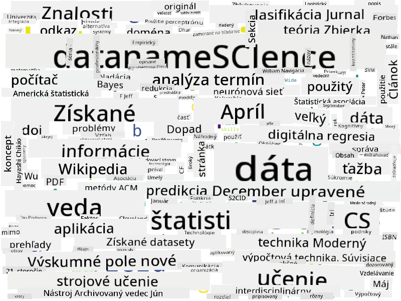

<!--
CO_OP_TRANSLATOR_METADATA:
{
  "original_hash": "2583a9894af7123b2fcae3376b14c035",
  "translation_date": "2025-08-26T15:21:27+00:00",
  "source_file": "1-Introduction/01-defining-data-science/README.md",
  "language_code": "sk"
}
-->
## Typy údajov

Ako sme už spomenuli, údaje sú všade okolo nás. Stačí ich len správne zachytiť! Je užitočné rozlišovať medzi **štruktúrovanými** a **neštruktúrovanými** údajmi. Prvé sú zvyčajne reprezentované v nejakej dobre štruktúrovanej forme, často ako tabuľka alebo množstvo tabuliek, zatiaľ čo druhé sú len zbierkou súborov. Niekedy môžeme hovoriť aj o **polostruktúrovaných** údajoch, ktoré majú určitú štruktúru, no tá sa môže značne líšiť.

| Štruktúrované                                                              | Polostruktúrované                                                                            | Neštruktúrované                        |
| -------------------------------------------------------------------------- | ------------------------------------------------------------------------------------------- | -------------------------------------- |
| Zoznam ľudí s ich telefónnymi číslami                                      | Stránky Wikipédie s odkazmi                                                                 | Text Encyklopédie Britannica          |
| Teplota vo všetkých miestnostiach budovy každú minútu za posledných 20 rokov | Zbierka vedeckých článkov vo formáte JSON s autormi, dátumom publikácie a abstraktom         | Zdieľaný priečinok s firemnými dokumentmi |
| Údaje o veku a pohlaví všetkých ľudí vstupujúcich do budovy                | Internetové stránky                                                                         | Surový videozáznam z bezpečnostnej kamery |

## Odkiaľ získať údaje

Existuje mnoho možných zdrojov údajov, a bolo by nemožné ich všetky vymenovať! Spomeňme si však niektoré typické miesta, kde môžete údaje získať:

* **Štruktúrované**
  - **Internet vecí** (IoT), vrátane údajov z rôznych senzorov, ako sú senzory teploty alebo tlaku, poskytuje množstvo užitočných údajov. Napríklad, ak je kancelárska budova vybavená IoT senzormi, môžeme automaticky riadiť kúrenie a osvetlenie, aby sme minimalizovali náklady.
  - **Prieskumy**, ktoré žiadame používateľov vyplniť po nákupe alebo po návšteve webovej stránky.
  - **Analýza správania** nám môže napríklad pomôcť pochopiť, ako hlboko používateľ prechádza stránkou a aký je typický dôvod jej opustenia.
* **Neštruktúrované**
  - **Texty** môžu byť bohatým zdrojom poznatkov, ako napríklad celkový **sentiment skóre** alebo extrakcia kľúčových slov a sémantického významu.
  - **Obrázky** alebo **video**. Video z bezpečnostnej kamery môže byť použité na odhad dopravy na ceste a informovanie ľudí o možných dopravných zápchach.
  - **Logy** webových serverov môžu byť použité na pochopenie, ktoré stránky našej webovej stránky sú najčastejšie navštevované a ako dlho.
* **Polostruktúrované**
  - **Grafy sociálnych sietí** môžu byť skvelým zdrojom údajov o osobnostiach používateľov a ich potenciálnej efektivite pri šírení informácií.
  - Ak máme množstvo fotografií z večierka, môžeme sa pokúsiť extrahovať údaje o **skupinovej dynamike** vytvorením grafu ľudí, ktorí sa fotili spolu.

Poznaním rôznych možných zdrojov údajov môžete premýšľať o rôznych scenároch, kde môžu byť techniky dátovej vedy aplikované na lepšie pochopenie situácie a zlepšenie obchodných procesov.

## Čo môžete robiť s údajmi

V dátovej vede sa zameriavame na nasledujúce kroky v práci s údajmi:

Samozrejme, v závislosti od konkrétnych údajov môžu niektoré kroky chýbať (napr. keď už máme údaje v databáze alebo keď nepotrebujeme trénovať model), alebo sa niektoré kroky môžu opakovať viackrát (napríklad spracovanie údajov).

## Digitalizácia a digitálna transformácia

V poslednom desaťročí si mnoho firiem začalo uvedomovať dôležitosť údajov pri rozhodovaní. Aby bolo možné aplikovať princípy dátovej vedy na riadenie podniku, je najprv potrebné zhromaždiť nejaké údaje, t. j. preložiť obchodné procesy do digitálnej podoby. Toto sa nazýva **digitalizácia**. Aplikácia techník dátovej vedy na tieto údaje na podporu rozhodovania môže viesť k výraznému zvýšeniu produktivity (alebo dokonca k zmene obchodného modelu), čo sa nazýva **digitálna transformácia**.

Pozrime sa na príklad. Predstavme si, že máme kurz dátovej vedy (ako tento), ktorý poskytujeme online študentom, a chceme ho zlepšiť pomocou dátovej vedy. Ako to môžeme urobiť?

Môžeme začať otázkou „Čo môžeme digitalizovať?“ Najjednoduchším spôsobom by bolo merať čas, ktorý každému študentovi trvá dokončenie každého modulu, a merať získané vedomosti pomocou testu s výberom odpovedí na konci každého modulu. Priemerovaním času na dokončenie medzi všetkými študentmi môžeme zistiť, ktoré moduly spôsobujú študentom najväčšie ťažkosti, a pracovať na ich zjednodušení.
Môžete namietať, že tento prístup nie je ideálny, pretože moduly môžu mať rôznu dĺžku. Pravdepodobne by bolo spravodlivejšie rozdeliť čas podľa dĺžky modulu (v počte znakov) a namiesto toho porovnať tieto hodnoty.
Keď začneme analyzovať výsledky testov s výberom odpovede, môžeme sa pokúsiť určiť, ktoré koncepty robia študentom problémy, a použiť tieto informácie na zlepšenie obsahu. Aby sme to dosiahli, musíme navrhnúť testy tak, aby každá otázka bola spojená s konkrétnym konceptom alebo časťou vedomostí.

Ak chceme ísť ešte ďalej, môžeme porovnať čas potrebný na dokončenie každého modulu s vekovou kategóriou študentov. Môžeme zistiť, že pre niektoré vekové kategórie trvá dokončenie modulu neprimerane dlho, alebo že študenti odchádzajú pred jeho dokončením. To nám môže pomôcť poskytnúť vekové odporúčania pre modul a minimalizovať nespokojnosť ľudí spôsobenú nesprávnymi očakávaniami.

## 🚀 Výzva

V tejto výzve sa pokúsime nájsť koncepty relevantné pre oblasť dátovej vedy analýzou textov. Vezmeme článok z Wikipédie o dátovej vede, stiahneme a spracujeme text, a potom vytvoríme slovný mrak, ako je tento:

Navštívte [`notebook.ipynb`](../../../../../../../../../1-Introduction/01-defining-data-science/notebook.ipynb ':ignore'), aby ste si prešli kód. Môžete tiež spustiť kód a sledovať, ako vykonáva všetky transformácie dát v reálnom čase.

> Ak neviete, ako spustiť kód v Jupyter Notebooku, pozrite si [tento článok](https://soshnikov.com/education/how-to-execute-notebooks-from-github/).

## [Kvíz po prednáške](https://purple-hill-04aebfb03.1.azurestaticapps.net/quiz/1)

## Úlohy

* **Úloha 1**: Upraviť vyššie uvedený kód na vyhľadanie súvisiacich konceptov pre oblasti **Big Data** a **Machine Learning**
* **Úloha 2**: [Premýšľajte o scenároch dátovej vedy](assignment.md)

## Kredity

Táto lekcia bola vytvorená s ♥️ od [Dmitry Soshnikov](http://soshnikov.com)

---

**Upozornenie**:  
Tento dokument bol preložený pomocou služby AI prekladu [Co-op Translator](https://github.com/Azure/co-op-translator). Hoci sa snažíme o presnosť, prosím, berte na vedomie, že automatizované preklady môžu obsahovať chyby alebo nepresnosti. Pôvodný dokument v jeho rodnom jazyku by mal byť považovaný za autoritatívny zdroj. Pre kritické informácie sa odporúča profesionálny ľudský preklad. Nie sme zodpovední za akékoľvek nedorozumenia alebo nesprávne interpretácie vyplývajúce z použitia tohto prekladu.