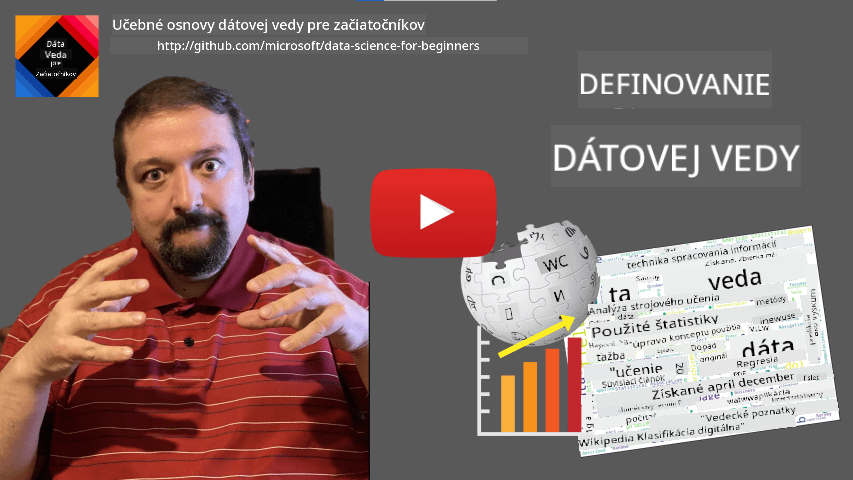

<!--
CO_OP_TRANSLATOR_METADATA:
{
  "original_hash": "43212cc1ac137b7bb1dcfb37ca06b0f4",
  "translation_date": "2025-10-25T19:05:52+00:00",
  "source_file": "1-Introduction/01-defining-data-science/README.md",
  "language_code": "sk"
}
-->
# Definícia dátovej vedy

|  ](../../sketchnotes/01-Definitions.png) |
| :----------------------------------------------------------------------------------------------------: |
|              Definícia dátovej vedy - _Sketchnote od [@nitya](https://twitter.com/nitya)_               |

---

## [Kvíz pred prednáškou](https://ff-quizzes.netlify.app/en/ds/quiz/0)

## Čo sú dáta?
V našom každodennom živote sme neustále obklopení dátami. Text, ktorý práve čítate, sú dáta. Zoznam telefónnych čísel vašich priateľov vo vašom smartfóne sú dáta, rovnako ako aktuálny čas zobrazený na vašich hodinkách. Ako ľudia prirodzene pracujeme s dátami, či už počítaním peňazí, ktoré máme, alebo písaním listov priateľom.

Avšak dáta sa stali oveľa dôležitejšími s príchodom počítačov. Primárnou úlohou počítačov je vykonávať výpočty, ale na to potrebujú dáta. Preto je dôležité pochopiť, ako počítače ukladajú a spracovávajú dáta.

S príchodom internetu sa úloha počítačov ako zariadení na spracovanie dát zvýšila. Ak sa nad tým zamyslíte, počítače teraz používame čoraz viac na spracovanie dát a komunikáciu, než na samotné výpočty. Keď píšeme e-mail priateľovi alebo hľadáme informácie na internete, v podstate vytvárame, ukladáme, prenášame a manipulujeme s dátami.
> Pamätáte si, kedy ste naposledy použili počítač na skutočné výpočty?

## Čo je dátová veda?

Podľa [Wikipédie](https://en.wikipedia.org/wiki/Data_science) je **dátová veda** definovaná ako *vedecká oblasť, ktorá využíva vedecké metódy na získanie poznatkov a vhľadov zo štruktúrovaných a neštruktúrovaných dát a aplikuje tieto poznatky a praktické vhľady z dát v širokom spektre aplikačných oblastí*.

Táto definícia zdôrazňuje nasledujúce dôležité aspekty dátovej vedy:

* Hlavným cieľom dátovej vedy je **získanie poznatkov** z dát, inými slovami - **porozumieť** dátam, nájsť skryté vzťahy a vytvoriť **model**.
* Dátová veda využíva **vedecké metódy**, ako sú pravdepodobnosť a štatistika. Keď bol pojem *dátová veda* prvýkrát predstavený, niektorí tvrdili, že ide len o nový módny názov pre štatistiku. Dnes je však zrejmé, že táto oblasť je oveľa širšia.
* Získané poznatky by sa mali aplikovať na vytvorenie **praktických vhľadov**, teda praktických poznatkov, ktoré môžete aplikovať v reálnych obchodných situáciách.
* Mali by sme byť schopní pracovať s **štruktúrovanými** aj **neštruktúrovanými** dátami. K rôznym typom dát sa vrátime neskôr v kurze.
* **Aplikačná oblasť** je dôležitý koncept a dátoví vedci často potrebujú aspoň určitú mieru odbornosti v danej problematike, napríklad v oblasti financií, medicíny, marketingu atď.

> Ďalším dôležitým aspektom dátovej vedy je štúdium toho, ako možno dáta zhromažďovať, ukladať a spracovávať pomocou počítačov. Zatiaľ čo štatistika nám poskytuje matematické základy, dátová veda aplikuje matematické koncepty na získanie skutočných poznatkov z dát.

Jedným zo spôsobov (pripisovaným [Jimovi Grayovi](https://en.wikipedia.org/wiki/Jim_Gray_(computer_scientist))) ako sa pozerať na dátovú vedu, je považovať ju za samostatný vedecký paradigmus:
* **Empirický**, kde sa spoliehame najmä na pozorovania a výsledky experimentov
* **Teoretický**, kde nové koncepty vznikajú na základe existujúcich vedeckých poznatkov
* **Výpočtový**, kde objavujeme nové princípy na základe výpočtových experimentov
* **Dátovo orientovaný**, založený na objavovaní vzťahov a vzorcov v dátach  

## Ostatné príbuzné oblasti

Keďže dáta sú všadeprítomné, dátová veda je tiež široká oblasť, ktorá sa dotýka mnohých iných disciplín.

<dl>
<dt>Databázy</dt>
<dd>
Dôležitým aspektom je <b>ako ukladať</b> dáta, teda ako ich štruktúrovať tak, aby sa dali rýchlejšie spracovať. Existujú rôzne typy databáz, ktoré ukladajú štruktúrované a neštruktúrované dáta, ktoré <a href="../../2-Working-With-Data/README.md">budeme skúmať v našom kurze</a>.
</dd>
<dt>Big Data</dt>
<dd>
Často potrebujeme ukladať a spracovávať veľmi veľké množstvá dát s relatívne jednoduchou štruktúrou. Existujú špeciálne prístupy a nástroje na ukladanie týchto dát distribuovaným spôsobom na klastroch počítačov a ich efektívne spracovanie.
</dd>
<dt>Strojové učenie</dt>
<dd>
Jedným zo spôsobov, ako porozumieť dátam, je <b>vytvoriť model</b>, ktorý bude schopný predpovedať požadovaný výsledok. Vývoj modelov z dát sa nazýva <b>strojové učenie</b>. Môžete sa pozrieť na náš <a href="https://aka.ms/ml-beginners">kurz Strojové učenie pre začiatočníkov</a>, aby ste sa o tom dozvedeli viac.
</dd>
<dt>Umelá inteligencia</dt>
<dd>
Oblasť strojového učenia známa ako umelá inteligencia (AI) tiež závisí od dát a zahŕňa vytváranie modelov s vysokou komplexnosťou, ktoré napodobňujú ľudské myslenie. Metódy AI nám často umožňujú premeniť neštruktúrované dáta (napr. prirodzený jazyk) na štruktúrované poznatky.
</dd>
<dt>Vizualizácia</dt>
<dd>
Obrovské množstvo dát je pre človeka nepochopiteľné, ale keď vytvoríme užitočné vizualizácie pomocou týchto dát, môžeme lepšie pochopiť dáta a vyvodiť z nich závery. Preto je dôležité poznať mnoho spôsobov vizualizácie informácií - niečo, čo pokryjeme v <a href="../../3-Data-Visualization/README.md">Sekcii 3</a> nášho kurzu. Súvisiace oblasti zahŕňajú aj <b>infografiku</b> a <b>interakciu človeka s počítačom</b> vo všeobecnosti.
</dd>
</dl>

## Typy dát

Ako sme už spomenuli, dáta sú všade. Stačí ich zachytiť správnym spôsobom! Je užitočné rozlišovať medzi **štruktúrovanými** a **neštruktúrovanými** dátami. Prvé sú zvyčajne reprezentované v nejakej dobre štruktúrovanej forme, často ako tabuľka alebo množstvo tabuliek, zatiaľ čo druhé sú len zbierkou súborov. Niekedy môžeme hovoriť aj o **polostruktúrovaných** dátach, ktoré majú určitý druh štruktúry, ktorá sa môže značne líšiť.

| Štruktúrované                                                               | Polostruktúrované                                                                             | Neštruktúrované                        |
| ---------------------------------------------------------------------------- | ---------------------------------------------------------------------------------------------- | --------------------------------------- |
| Zoznam ľudí s ich telefónnymi číslami                                        | Stránky Wikipédie s odkazmi                                                                   | Text Encyklopédie Britannica           |
| Teplota vo všetkých miestnostiach budovy každú minútu za posledných 20 rokov | Zbierka vedeckých článkov vo formáte JSON s autormi, dátumom publikácie a abstraktom           | Zdieľané súbory s firemnými dokumentmi |
| Dáta o veku a pohlaví všetkých ľudí vstupujúcich do budovy                   | Internetové stránky                                                                           | Surový videozáznam z bezpečnostnej kamery |

## Kde získať dáta

Existuje mnoho možných zdrojov dát a je nemožné ich všetky vymenovať! Avšak spomeňme niektoré typické miesta, kde môžete získať dáta:

* **Štruktúrované**
  - **Internet vecí** (IoT), vrátane dát z rôznych senzorov, ako sú teplotné alebo tlakové senzory, poskytuje veľa užitočných dát. Napríklad, ak je kancelárska budova vybavená IoT senzormi, môžeme automaticky riadiť vykurovanie a osvetlenie, aby sme minimalizovali náklady.
  - **Prieskumy**, ktoré žiadame používateľov vyplniť po nákupe alebo po návšteve webovej stránky.
  - **Analýza správania** nám môže napríklad pomôcť pochopiť, ako hlboko sa používateľ dostane na stránku a aký je typický dôvod jej opustenia.
* **Neštruktúrované**
  - **Texty** môžu byť bohatým zdrojom poznatkov, ako je celkový **skóre sentimentu** alebo extrakcia kľúčových slov a sémantického významu.
  - **Obrázky** alebo **video**. Video z bezpečnostnej kamery môže byť použité na odhad premávky na ceste a informovanie ľudí o možných dopravných zápchach.
  - **Logy webových serverov** môžu byť použité na pochopenie, ktoré stránky našej webovej stránky sú najčastejšie navštevované a ako dlho.
* Polostruktúrované
  - **Grafy sociálnych sietí** môžu byť skvelými zdrojmi dát o osobnostiach používateľov a potenciálnej efektivite šírenia informácií.
  - Keď máme množstvo fotografií z večierka, môžeme sa pokúsiť extrahovať dáta o **skupinovej dynamike** vytvorením grafu ľudí, ktorí sa fotili spolu.

Poznaním rôznych možných zdrojov dát môžete premýšľať o rôznych scenároch, kde je možné aplikovať techniky dátovej vedy na lepšie pochopenie situácie a zlepšenie obchodných procesov.

## Čo môžete robiť s dátami

V dátovej vede sa zameriavame na nasledujúce kroky v ceste dát:

<dl>
<dt>1) Získavanie dát</dt>
<dd>
Prvým krokom je zhromažďovanie dát. Zatiaľ čo v mnohých prípadoch to môže byť jednoduchý proces, ako napríklad dáta prichádzajúce do databázy z webovej aplikácie, niekedy musíme použiť špeciálne techniky. Napríklad dáta zo senzorov IoT môžu byť ohromujúce, a je dobrým zvykom používať medzibodové úložiská, ako je IoT Hub, na zhromažďovanie všetkých dát pred ďalším spracovaním.
</dd>
<dt>2) Ukladanie dát</dt>
<dd>
Ukladanie dát môže byť náročné, najmä ak hovoríme o veľkých dátach. Pri rozhodovaní o tom, ako ukladať dáta, má zmysel predvídať spôsob, akým by ste chceli dáta v budúcnosti vyhľadávať. Existuje niekoľko spôsobov, ako môžu byť dáta uložené:
<ul>
<li>Relačná databáza uchováva zbierku tabuliek a používa špeciálny jazyk nazývaný SQL na ich vyhľadávanie. Tabuľky sú zvyčajne organizované do rôznych skupín nazývaných schémy. V mnohých prípadoch musíme dáta konvertovať z pôvodnej formy, aby vyhovovali schéme.</li>
<li><a href="https://en.wikipedia.org/wiki/NoSQL">NoSQL</a> databáza, ako napríklad <a href="https://azure.microsoft.com/services/cosmos-db/?WT.mc_id=academic-77958-bethanycheum">CosmosDB</a>, nevyžaduje schémy na dáta a umožňuje ukladať zložitejšie dáta, napríklad hierarchické JSON dokumenty alebo grafy. Avšak NoSQL databázy nemajú bohaté možnosti vyhľadávania ako SQL a nemôžu zabezpečiť referenčnú integritu, teda pravidlá o tom, ako sú dáta štruktúrované v tabuľkách a ako sa vzťahujú medzi sebou.</li>
<li><a href="https://en.wikipedia.org/wiki/Data_lake">Úložisko dátového jazera</a> sa používa na veľké zbierky dát v surovej, neštruktúrovanej forme. Dátové jazerá sa často používajú pri veľkých dátach, kde všetky dáta nemôžu byť uložené na jednom stroji a musia byť uložené a spracované klastrom serverov. <a href="https://en.wikipedia.org/wiki/Apache_Parquet">Parquet</a> je dátový formát, ktorý sa často používa v spojení s veľkými dátami.</li> 
</ul>
</dd>
<dt>3) Spracovanie dát</dt>
<dd>
Toto je najzaujímavejšia časť cesty dát, ktorá zahŕňa konverziu dát z ich pôvodnej formy na formu, ktorá môže byť použitá na vizualizáciu alebo tréning modelov. Pri práci s neštruktúrovanými dátami, ako sú texty alebo obrázky, môžeme potrebovať použiť niektoré techniky AI na extrakciu <b>znakov</b> z dát, čím ich konvertujeme na štruktúrovanú formu.
</dd>
<dt>4) Vizualizácia / Ľudské vhľady</dt>
<dd>
Často, aby sme pochopili dáta, ich musíme vizualizovať. S mnohými rôznymi technikami vizualizácie v našej "nástrojovej skrinke" môžeme nájsť správny pohľad na získanie vhľadu. Často dátový vedec potrebuje "hrať sa s dátami", vizualizovať ich mnohokrát a hľadať nejaké vzťahy. Tiež môžeme použiť štatistické techniky na testovanie hypotéz alebo dokázanie korelácie medzi rôznymi časťami dát.   
</dd>
<dt>5) Tréning prediktívneho modelu</dt>
<dd>
Keďže konečným cieľom dátovej vedy je byť schopný robiť rozhodnutia na základe dát, môžeme chcieť použiť techniky <a href="http://github.com/microsoft/ml-for-beginners">strojového učenia</a> na vytvorenie prediktívneho modelu. Tento model potom môžeme použiť na predpovede pomocou nových dátových súborov s podobnými štruktúrami.
</dd>
</dl>

Samozrejme, v závislosti od skutočných dát môžu niektoré kroky chýbať (napr. keď už máme dáta v databáze alebo keď nepotrebujeme tréning modelu), alebo niektoré kroky môžu byť opakované viackrát (napríklad spracovanie dát).

## Digitalizácia a digitálna transformácia

V poslednom desaťročí mnoho firiem začalo chápať dôležitosť dát pri rozhodovaní o podnikaní. Na aplikáciu princípov dátovej vedy na riadenie podnikania je najprv potrebné zhromaždiť nejaké dáta, teda preložiť obchodné procesy do digitálnej podoby. Toto je známe ako **digitalizácia**. Aplikácia techník dátovej vedy na tieto dáta na usmernenie rozhodnutí môže viesť k významnému zvýšeniu produktivity (alebo dokonca k zmene podnikania), čo sa nazýva **digitálna transformácia**.

Pozrime sa na príklad. Predpokladajme, že máme kurz dátovej vedy (ako je tento), ktorý poskytujeme online študentom, a chceme použiť dátovú vedu na jeho z
> Môžete namietať, že tento prístup nie je ideálny, pretože moduly môžu mať rôznu dĺžku. Pravdepodobne by bolo spravodlivejšie rozdeliť čas podľa dĺžky modulu (v počte znakov) a porovnať tieto hodnoty.

Keď začneme analyzovať výsledky testov s výberom odpovedí, môžeme sa pokúsiť určiť, ktoré koncepty majú študenti problém pochopiť, a použiť tieto informácie na zlepšenie obsahu. Aby sme to dosiahli, musíme navrhnúť testy tak, aby každá otázka zodpovedala určitému konceptu alebo časti vedomostí.

Ak chceme ísť ešte ďalej, môžeme vykresliť čas potrebný na dokončenie každého modulu v závislosti od vekovej kategórie študentov. Môžeme zistiť, že pre niektoré vekové kategórie trvá neprimerane dlho dokončiť modul, alebo že študenti odchádzajú pred jeho dokončením. To nám môže pomôcť poskytnúť vekové odporúčania pre modul a minimalizovať nespokojnosť ľudí z nesprávnych očakávaní.

## 🚀 Výzva

V tejto výzve sa pokúsime nájsť koncepty relevantné pre oblasť dátovej vedy tým, že sa pozrieme na texty. Vezmeme článok z Wikipédie o dátovej vede, stiahneme a spracujeme text, a potom vytvoríme oblak slov, ako je tento:

Navštívte [`notebook.ipynb`](../../../../1-Introduction/01-defining-data-science/notebook.ipynb ':ignore'), aby ste si prečítali kód. Môžete tiež spustiť kód a vidieť, ako vykonáva všetky transformácie dát v reálnom čase.

> Ak neviete, ako spustiť kód v Jupyter Notebooku, pozrite si [tento článok](https://soshnikov.com/education/how-to-execute-notebooks-from-github/).

## [Kvíz po prednáške](https://ff-quizzes.netlify.app/en/ds/quiz/1)

## Úlohy

* **Úloha 1**: Upraviť vyššie uvedený kód na zistenie súvisiacich konceptov pre oblasti **Big Data** a **Machine Learning**
* **Úloha 2**: [Premýšľajte o scenároch dátovej vedy](assignment.md)

## Kredity

Táto lekcia bola vytvorená s ♥️ [Dmitry Soshnikov](http://soshnikov.com)

---

**Zrieknutie sa zodpovednosti**:  
Tento dokument bol preložený pomocou služby AI prekladu [Co-op Translator](https://github.com/Azure/co-op-translator). Hoci sa snažíme o presnosť, prosím, berte na vedomie, že automatizované preklady môžu obsahovať chyby alebo nepresnosti. Pôvodný dokument v jeho rodnom jazyku by mal byť považovaný za autoritatívny zdroj. Pre kritické informácie sa odporúča profesionálny ľudský preklad. Nenesieme zodpovednosť za akékoľvek nedorozumenia alebo nesprávne interpretácie vyplývajúce z použitia tohto prekladu.