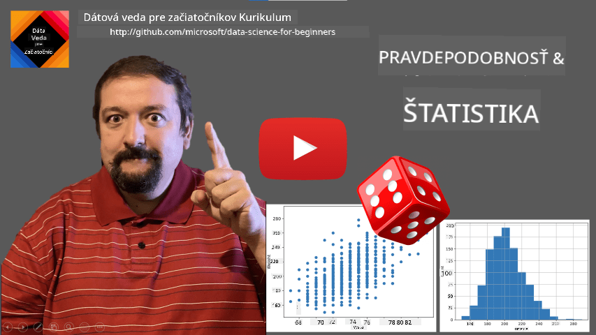
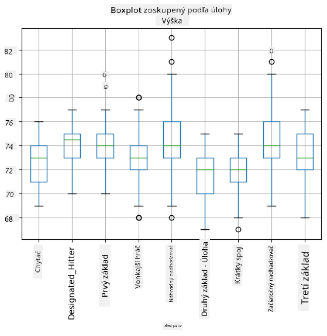
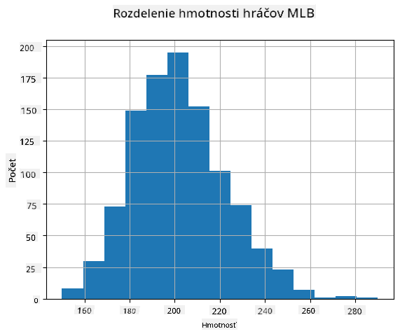
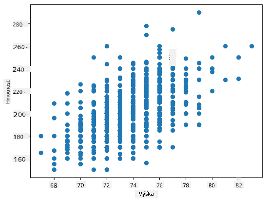

<!--
CO_OP_TRANSLATOR_METADATA:
{
  "original_hash": "ce95884566a74db72572cd51f0cb25ad",
  "translation_date": "2025-09-06T14:04:58+00:00",
  "source_file": "1-Introduction/04-stats-and-probability/README.md",
  "language_code": "sk"
}
-->
# Stručný úvod do štatistiky a pravdepodobnosti

| ](../../sketchnotes/04-Statistics-Probability.png)|
|:---:|
| Štatistika a pravdepodobnosť - _Sketchnote od [@nitya](https://twitter.com/nitya)_ |

Teória štatistiky a pravdepodobnosti sú dve úzko prepojené oblasti matematiky, ktoré sú veľmi dôležité pre dátovú vedu. Dá sa pracovať s dátami aj bez hlbokých matematických znalostí, ale je lepšie poznať aspoň základné koncepty. Tu vám predstavíme krátky úvod, ktorý vám pomôže začať.

[](https://youtu.be/Z5Zy85g4Yjw)

## [Kvíz pred prednáškou](https://ff-quizzes.netlify.app/en/ds/quiz/6)

## Pravdepodobnosť a náhodné premenné

**Pravdepodobnosť** je číslo medzi 0 a 1, ktoré vyjadruje, aká pravdepodobná je určitá **udalosť**. Definuje sa ako počet pozitívnych výsledkov (ktoré vedú k udalosti) vydelený celkovým počtom výsledkov, za predpokladu, že všetky výsledky sú rovnako pravdepodobné. Napríklad, keď hodíme kockou, pravdepodobnosť, že padne párne číslo, je 3/6 = 0,5.

Keď hovoríme o udalostiach, používame **náhodné premenné**. Napríklad náhodná premenná, ktorá reprezentuje číslo získané pri hode kockou, nadobúda hodnoty od 1 do 6. Súbor čísel od 1 do 6 sa nazýva **priestor výsledkov**. Môžeme hovoriť o pravdepodobnosti, že náhodná premenná nadobudne určitú hodnotu, napríklad P(X=3)=1/6.

Náhodná premenná v predchádzajúcom príklade sa nazýva **diskrétna**, pretože má spočítateľný priestor výsledkov, t.j. existujú oddelené hodnoty, ktoré sa dajú vymenovať. Existujú však prípady, keď je priestor výsledkov intervalom reálnych čísel alebo celou množinou reálnych čísel. Takéto premenné sa nazývajú **spojité**. Dobrým príkladom je čas príchodu autobusu.

## Pravdepodobnostné rozdelenie

V prípade diskrétnych náhodných premenných je jednoduché opísať pravdepodobnosť každej udalosti pomocou funkcie P(X). Pre každú hodnotu *s* z priestoru výsledkov *S* poskytne číslo od 0 do 1, pričom súčet všetkých hodnôt P(X=s) pre všetky udalosti bude 1.

Najznámejším diskrétnym rozdelením je **rovnomerné rozdelenie**, v ktorom existuje priestor výsledkov s N prvkami, pričom každá z nich má rovnakú pravdepodobnosť 1/N.

Je ťažšie opísať pravdepodobnostné rozdelenie spojitej premennej, ktorej hodnoty sú čerpané z nejakého intervalu [a,b] alebo celej množiny reálnych čísel ℝ. Zoberme si prípad času príchodu autobusu. V skutočnosti je pravdepodobnosť, že autobus príde presne v určitom čase *t*, rovná 0!

> Teraz už viete, že udalosti s pravdepodobnosťou 0 sa dejú, a to veľmi často! Aspoň vždy, keď autobus príde!

Môžeme hovoriť iba o pravdepodobnosti, že premenná spadne do daného intervalu hodnôt, napr. P(t<sub>1</sub>≤X<t<sub>2</sub>). V tomto prípade je pravdepodobnostné rozdelenie opísané pomocou **hustoty pravdepodobnosti** p(x), pričom


Spojitý analóg rovnomerného rozdelenia sa nazýva **spojité rovnomerné rozdelenie**, ktoré je definované na konečnom intervale. Pravdepodobnosť, že hodnota X spadne do intervalu dĺžky l, je úmerná l a stúpa až na 1.

Ďalším dôležitým rozdelením je **normálne rozdelenie**, o ktorom si povieme viac nižšie.

## Priemer, rozptyl a smerodajná odchýlka

Predpokladajme, že máme sekvenciu n vzoriek náhodnej premennej X: x<sub>1</sub>, x<sub>2</sub>, ..., x<sub>n</sub>. Môžeme definovať **priemer** (alebo **aritmetický priemer**) sekvencie tradičným spôsobom ako (x<sub>1</sub>+x<sub>2</sub>+x<sub>n</sub>)/n. Ak zväčšíme veľkosť vzorky (t.j. vezmeme limit s n→∞), získame priemer (nazývaný aj **očakávanie**) rozdelenia. Očakávanie označíme ako **E**(x).

> Dá sa ukázať, že pre akékoľvek diskrétne rozdelenie s hodnotami {x<sub>1</sub>, x<sub>2</sub>, ..., x<sub>N</sub>} a zodpovedajúcimi pravdepodobnosťami p<sub>1</sub>, p<sub>2</sub>, ..., p<sub>N</sub>, očakávanie bude rovné E(X)=x<sub>1</sub>p<sub>1</sub>+x<sub>2</sub>p<sub>2</sub>+...+x<sub>N</sub>p<sub>N</sub>.

Na určenie, ako ďaleko sú hodnoty rozptýlené, môžeme vypočítať rozptyl σ<sup>2</sup> = ∑(x<sub>i</sub> - μ)<sup>2</sup>/n, kde μ je priemer sekvencie. Hodnota σ sa nazýva **smerodajná odchýlka** a σ<sup>2</sup> sa nazýva **rozptyl**.

## Mód, medián a kvartily

Niekedy priemer nepredstavuje dostatočne "typickú" hodnotu pre dáta. Napríklad, ak existuje niekoľko extrémnych hodnôt, ktoré sú úplne mimo rozsahu, môžu ovplyvniť priemer. Ďalším dobrým ukazovateľom je **medián**, hodnota, pri ktorej je polovica dátových bodov nižšia a druhá polovica vyššia.

Na lepšie pochopenie rozdelenia dát je užitočné hovoriť o **kvartiloch**:

* Prvý kvartil, alebo Q1, je hodnota, pod ktorou leží 25 % dát
* Tretí kvartil, alebo Q3, je hodnota, pod ktorou leží 75 % dát

Graficky môžeme vzťah medzi mediánom a kvartilmi znázorniť v diagrame nazývanom **boxplot**:


Tu tiež počítame **medzikvartilové rozpätie** IQR=Q3-Q1 a tzv. **odľahlé hodnoty** - hodnoty, ktoré ležia mimo hraníc [Q1-1.5*IQR,Q3+1.5*IQR].

Pre konečné rozdelenie, ktoré obsahuje malý počet možných hodnôt, je dobrá "typická" hodnota tá, ktorá sa vyskytuje najčastejšie, a tá sa nazýva **mód**. Často sa používa pri kategorizovaných dátach, ako sú farby. Predstavte si situáciu, keď máme dve skupiny ľudí - niektorí silne preferujú červenú a iní modrú. Ak kódujeme farby číslami, priemerná hodnota obľúbenej farby by bola niekde v oranžovo-zelenej škále, čo neodráža skutočné preferencie ani jednej skupiny. Mód by však bol buď jedna z farieb, alebo obe farby, ak by počet ľudí hlasujúcich za ne bol rovnaký (v tomto prípade hovoríme, že vzorka je **multimodálna**).

## Dáta z reálneho sveta

Keď analyzujeme dáta z reálneho sveta, často nie sú náhodnými premennými v tom zmysle, že nevykonávame experimenty s neznámym výsledkom. Napríklad, vezmime tím hráčov baseballu a ich telesné údaje, ako výšku, váhu a vek. Tieto čísla nie sú presne náhodné, ale stále môžeme aplikovať rovnaké matematické koncepty. Napríklad sekvencia váh ľudí môže byť považovaná za sekvenciu hodnôt čerpaných z nejakej náhodnej premennej. Nižšie je sekvencia váh skutočných hráčov baseballu z [Major League Baseball](http://mlb.mlb.com/index.jsp), prevzatá z [tohto datasetu](http://wiki.stat.ucla.edu/socr/index.php/SOCR_Data_MLB_HeightsWeights) (pre vašu pohodlnosť je zobrazených iba prvých 20 hodnôt):

```
[180.0, 215.0, 210.0, 210.0, 188.0, 176.0, 209.0, 200.0, 231.0, 180.0, 188.0, 180.0, 185.0, 160.0, 180.0, 185.0, 197.0, 189.0, 185.0, 219.0]
```

> **Poznámka**: Ak chcete vidieť príklad práce s týmto datasetom, pozrite si [sprievodný notebook](notebook.ipynb). Počas tejto lekcie je tiež niekoľko výziev, ktoré môžete splniť pridaním kódu do tohto notebooku. Ak si nie ste istí, ako pracovať s dátami, nebojte sa - k práci s dátami pomocou Pythonu sa vrátime neskôr. Ak neviete, ako spustiť kód v Jupyter Notebooku, pozrite si [tento článok](https://soshnikov.com/education/how-to-execute-notebooks-from-github/).

Tu je boxplot zobrazujúci priemer, medián a kvartily pre naše dáta:


Keďže naše dáta obsahujú informácie o rôznych hráčskych **rolách**, môžeme tiež vytvoriť boxplot podľa rolí - umožní nám to získať predstavu o tom, ako sa hodnoty parametrov líšia medzi rolami. Tentokrát budeme uvažovať o výške:



Tento diagram naznačuje, že priemerná výška hráčov na prvej méte je vyššia ako výška hráčov na druhej méte. Neskôr v tejto lekcii sa naučíme, ako môžeme túto hypotézu formálnejšie otestovať a ako ukázať, že naše dáta sú štatisticky významné na jej preukázanie.

> Pri práci s dátami z reálneho sveta predpokladáme, že všetky dátové body sú vzorky čerpané z nejakého pravdepodobnostného rozdelenia. Tento predpoklad nám umožňuje aplikovať techniky strojového učenia a vytvárať funkčné prediktívne modely.

Na zistenie, aké je rozdelenie našich dát, môžeme vytvoriť graf nazývaný **histogram**. X-os bude obsahovať počet rôznych intervalov váh (tzv. **binov**), a vertikálna os bude ukazovať počet prípadov, keď naša vzorka náhodnej premennej spadla do daného intervalu.



Z tohto histogramu vidíte, že všetky hodnoty sú sústredené okolo určitého priemeru váhy a čím ďalej ideme od tejto váhy, tým menej hodnôt tejto váhy sa vyskytuje. T.j., je veľmi nepravdepodobné, že váha hráča baseballu bude veľmi odlišná od priemernej váhy. Rozptyl váh ukazuje, do akej miery sa váhy pravdepodobne líšia od priemeru.

> Ak vezmeme váhy iných ľudí, nie z baseballovej ligy, rozdelenie bude pravdepodobne odlišné. Tvar rozdelenia však zostane rovnaký, ale priemer a rozptyl sa zmenia. Ak teda trénujeme náš model na hráčoch baseballu, pravdepodobne poskytne nesprávne výsledky, keď sa aplikuje na študentov univerzity, pretože základné rozdelenie je odlišné.

## Normálne rozdelenie

Rozdelenie váh, ktoré sme videli vyššie, je veľmi typické a mnoho meraní z reálneho sveta sleduje rovnaký typ rozdelenia, ale s rôznym priemerom a rozptylom. Toto rozdelenie sa nazýva **normálne rozdelenie** a hrá veľmi dôležitú úlohu v štatistike.

Použitie normálneho rozdelenia je správny spôsob, ako generovať náhodné váhy potenciálnych hráčov baseballu. Akonáhle poznáme priemernú váhu `mean` a smerodajnú odchýlku `std`, môžeme vygenerovať 1000 vzoriek váh nasledujúcim spôsobom:
```python
samples = np.random.normal(mean,std,1000)
``` 

Ak vykreslíme histogram vygenerovaných vzoriek, uvidíme obrázok veľmi podobný tomu, ktorý je uvedený vyššie. A ak zvýšime počet vzoriek a počet binov, môžeme vytvoriť obrázok normálneho rozdelenia, ktorý je bližší ideálu:


*Normálne rozdelenie s priemerom=0 a smerodajnou odchýlkou=1*

## Intervaly spoľahlivosti

Keď hovoríme o váhach hráčov baseballu, predpokladáme, že existuje určitá **náhodná premenná W**, ktorá zodpovedá ideálnemu pravdepodobnostnému rozdeleniu váh všetkých hráčov baseballu (tzv. **populácia**). Naša sekvencia váh zodpovedá podmnožine všetkých hráčov baseballu, ktorú nazývame **vzorka**. Zaujímavou otázkou je, či môžeme poznať parametre rozdelenia W, t.j. priemer a rozptyl populácie.

Najjednoduchšou odpoveďou by bolo vypočítať priemer a rozptyl našej vzorky. Môže sa však stať, že naša náhodná vzorka presne neodráža celú populáciu. Preto má zmysel hovoriť o **intervale spoľahlivosti**.

> **Interval spoľahlivosti** je odhad skutočného priemeru populácie na základe našej vzorky, ktorý je presný s určitou pravdepodobnosťou (alebo **úrovňou spoľahlivosti**).

Predpokladajme, že máme vzorku X...

1</sub>, ..., X<sub>n</sub> z našej distribúcie. Každý raz, keď odoberieme vzorku z našej distribúcie, dostaneme inú hodnotu priemeru μ. Preto môže byť μ považované za náhodnú premennú. **Interval spoľahlivosti** s dôverou p je dvojica hodnôt (L<sub>p</sub>,R<sub>p</sub>), taká, že **P**(L<sub>p</sub>≤μ≤R<sub>p</sub>) = p, t.j. pravdepodobnosť, že nameraná hodnota priemeru spadne do intervalu, sa rovná p.

Podrobný výpočet týchto intervalov spoľahlivosti presahuje rámec nášho krátkeho úvodu. Viac podrobností nájdete [na Wikipédii](https://en.wikipedia.org/wiki/Confidence_interval). Stručne povedané, definujeme distribúciu vypočítaného priemeru vzorky vzhľadom na skutočný priemer populácie, ktorá sa nazýva **študentova distribúcia**.

> **Zaujímavý fakt**: Študentova distribúcia je pomenovaná po matematikovi Williamovi Sealy Gossetovi, ktorý publikoval svoj článok pod pseudonymom "Student". Pracoval v pivovare Guinness a podľa jednej z verzií jeho zamestnávateľ nechcel, aby verejnosť vedela, že používajú štatistické testy na určenie kvality surovín.

Ak chceme odhadnúť priemer μ našej populácie s dôverou p, musíme vziať *(1-p)/2-tý percentil* zo študentovej distribúcie A, ktorý môže byť buď získaný z tabuliek, alebo vypočítaný pomocou zabudovaných funkcií štatistického softvéru (napr. Python, R, atď.). Potom by interval pre μ bol daný X±A*D/√n, kde X je získaný priemer vzorky, D je štandardná odchýlka.

> **Poznámka**: Vynechávame aj diskusiu o dôležitom koncepte [stupňov voľnosti](https://en.wikipedia.org/wiki/Degrees_of_freedom_(statistics)), ktorý je dôležitý v súvislosti so študentovou distribúciou. Pre hlbšie pochopenie tohto konceptu môžete odkazovať na komplexnejšie knihy o štatistike.

Príklad výpočtu intervalu spoľahlivosti pre hmotnosti a výšky je uvedený v [sprievodných notebookoch](notebook.ipynb).

| p | Priemer hmotnosti |
|-----|------------------|
| 0.85 | 201.73±0.94     |
| 0.90 | 201.73±1.08     |
| 0.95 | 201.73±1.28     |

Všimnite si, že čím vyššia je pravdepodobnosť spoľahlivosti, tým širší je interval spoľahlivosti.

## Testovanie hypotéz

V našej databáze hráčov baseballu existujú rôzne hráčske role, ktoré môžeme zhrnúť nasledovne (pozrite si [sprievodný notebook](notebook.ipynb), aby ste videli, ako sa táto tabuľka dá vypočítať):

| Rola | Výška | Hmotnosť | Počet |
|------|-------|----------|-------|
| Catcher | 72.723684 | 204.328947 | 76 |
| Designated_Hitter | 74.222222 | 220.888889 | 18 |
| First_Baseman | 74.000000 | 213.109091 | 55 |
| Outfielder | 73.010309 | 199.113402 | 194 |
| Relief_Pitcher | 74.374603 | 203.517460 | 315 |
| Second_Baseman | 71.362069 | 184.344828 | 58 |
| Shortstop | 71.903846 | 182.923077 | 52 |
| Starting_Pitcher | 74.719457 | 205.163636 | 221 |
| Third_Baseman | 73.044444 | 200.955556 | 45 |

Môžeme si všimnúť, že priemerné výšky hráčov na pozícii First Baseman sú vyššie ako na pozícii Second Baseman. Preto môžeme byť v pokušení dospieť k záveru, že **hráči na pozícii First Baseman sú vyšší ako hráči na pozícii Second Baseman**.

> Toto tvrdenie sa nazýva **hypotéza**, pretože nevieme, či je tento fakt skutočne pravdivý alebo nie.

Avšak nie je vždy zrejmé, či môžeme urobiť tento záver. Z vyššie uvedenej diskusie vieme, že každý priemer má pridružený interval spoľahlivosti, a preto tento rozdiel môže byť len štatistická chyba. Potrebujeme formálnejší spôsob na testovanie našej hypotézy.

Poďme vypočítať intervaly spoľahlivosti samostatne pre výšky hráčov na pozíciách First Baseman a Second Baseman:

| Spoľahlivosť | First Baseman | Second Baseman |
|--------------|---------------|----------------|
| 0.85         | 73.62..74.38  | 71.04..71.69   |
| 0.90         | 73.56..74.44  | 70.99..71.73   |
| 0.95         | 73.47..74.53  | 70.92..71.81   |

Vidíme, že pri žiadnej úrovni spoľahlivosti sa intervaly neprekrývajú. To dokazuje našu hypotézu, že hráči na pozícii First Baseman sú vyšší ako hráči na pozícii Second Baseman.

Formálnejšie, problém, ktorý riešime, je zistiť, či **dve pravdepodobnostné distribúcie sú rovnaké**, alebo aspoň majú rovnaké parametre. V závislosti od distribúcie musíme na to použiť rôzne testy. Ak vieme, že naše distribúcie sú normálne, môžeme použiť **[študentov t-test](https://en.wikipedia.org/wiki/Student%27s_t-test)**.

V študentovom t-teste vypočítame tzv. **t-hodnotu**, ktorá indikuje rozdiel medzi priemermi, pričom berie do úvahy rozptyl. Je dokázané, že t-hodnota nasleduje **študentovu distribúciu**, čo nám umožňuje získať prahovú hodnotu pre danú úroveň spoľahlivosti **p** (táto hodnota môže byť vypočítaná alebo vyhľadaná v numerických tabuľkách). Potom porovnáme t-hodnotu s touto prahovou hodnotou, aby sme schválili alebo zamietli hypotézu.

V Pythone môžeme použiť balík **SciPy**, ktorý obsahuje funkciu `ttest_ind` (okrem mnohých ďalších užitočných štatistických funkcií!). Táto funkcia vypočíta t-hodnotu za nás a tiež vykoná spätné vyhľadanie p-hodnoty spoľahlivosti, takže môžeme jednoducho pozrieť na spoľahlivosť a urobiť záver.

Napríklad, naše porovnanie výšok hráčov na pozíciách First Baseman a Second Baseman nám dáva nasledujúce výsledky: 
```python
from scipy.stats import ttest_ind

tval, pval = ttest_ind(df.loc[df['Role']=='First_Baseman',['Height']], df.loc[df['Role']=='Designated_Hitter',['Height']],equal_var=False)
print(f"T-value = {tval[0]:.2f}\nP-value: {pval[0]}")
```
```
T-value = 7.65
P-value: 9.137321189738925e-12
```
V našom prípade je p-hodnota veľmi nízka, čo znamená, že existuje silný dôkaz podporujúci, že hráči na pozícii First Baseman sú vyšší.

Existujú aj rôzne iné typy hypotéz, ktoré by sme mohli chcieť testovať, napríklad:
* Dokázať, že daná vzorka nasleduje určitú distribúciu. V našom prípade sme predpokladali, že výšky sú normálne rozdelené, ale to si vyžaduje formálne štatistické overenie.
* Dokázať, že priemerná hodnota vzorky zodpovedá nejakej preddefinovanej hodnote.
* Porovnať priemery viacerých vzoriek (napr. aký je rozdiel v úrovniach šťastia medzi rôznymi vekovými skupinami).

## Zákon veľkých čísel a centrálny limitný teorém

Jedným z dôvodov, prečo je normálne rozdelenie také dôležité, je tzv. **centrálny limitný teorém**. Predpokladajme, že máme veľkú vzorku nezávislých N hodnôt X<sub>1</sub>, ..., X<sub>N</sub>, odobratých z akejkoľvek distribúcie s priemerom μ a rozptylom σ<sup>2</sup>. Potom, pre dostatočne veľké N (inými slovami, keď N→∞), priemer Σ<sub>i</sub>X<sub>i</sub> bude normálne rozdelený, s priemerom μ a rozptylom σ<sup>2</sup>/N.

> Ďalší spôsob interpretácie centrálneho limitného teorému je povedať, že bez ohľadu na distribúciu, keď vypočítate priemer súčtu akýchkoľvek hodnôt náhodných premenných, skončíte s normálnym rozdelením.

Z centrálneho limitného teorému tiež vyplýva, že keď N→∞, pravdepodobnosť, že priemer vzorky sa rovná μ, sa stáva 1. Toto je známe ako **zákon veľkých čísel**.

## Kovariancia a korelácia

Jednou z vecí, ktoré Data Science robí, je hľadanie vzťahov medzi údajmi. Hovoríme, že dve sekvencie **korelujú**, keď vykazujú podobné správanie v rovnakom čase, t.j. buď stúpajú/klesajú súčasne, alebo jedna sekvencia stúpa, keď druhá klesá a naopak. Inými slovami, zdá sa, že medzi dvoma sekvenciami existuje nejaký vzťah.

> Korelácia nemusí nevyhnutne indikovať kauzálny vzťah medzi dvoma sekvenciami; niekedy obe premenné môžu závisieť od nejakej vonkajšej príčiny, alebo to môže byť čisto náhoda, že dve sekvencie korelujú. Avšak silná matematická korelácia je dobrým indikátorom, že dve premenné sú nejako prepojené.

Matematicky, hlavný koncept, ktorý ukazuje vzťah medzi dvoma náhodnými premennými, je **kovariancia**, ktorá sa vypočíta takto: Cov(X,Y) = **E**\[(X-**E**(X))(Y-**E**(Y))\]. Vypočítame odchýlku oboch premenných od ich priemerných hodnôt a potom súčin týchto odchýlok. Ak obe premenné odchýlia spolu, súčin bude vždy kladná hodnota, ktorá sa sčíta na kladnú kovarianciu. Ak obe premenné odchýlia nesúhlasne (t.j. jedna klesne pod priemer, keď druhá stúpa nad priemer), vždy dostaneme záporné čísla, ktoré sa sčítajú na zápornú kovarianciu. Ak odchýlky nie sú závislé, sčítajú sa približne na nulu.

Absolútna hodnota kovariancie nám veľa nehovorí o tom, aká veľká je korelácia, pretože závisí od veľkosti skutočných hodnôt. Na jej normalizáciu môžeme rozdeliť kovarianciu štandardnou odchýlkou oboch premenných, aby sme získali **koreláciu**. Dobrá vec je, že korelácia je vždy v rozsahu [-1,1], kde 1 indikuje silnú pozitívnu koreláciu medzi hodnotami, -1 - silnú negatívnu koreláciu a 0 - žiadnu koreláciu (premenné sú nezávislé).

**Príklad**: Môžeme vypočítať koreláciu medzi hmotnosťami a výškami hráčov baseballu z vyššie uvedenej databázy:
```python
print(np.corrcoef(weights,heights))
```
Výsledkom je **korelačná matica** ako táto:
```
array([[1.        , 0.52959196],
       [0.52959196, 1.        ]])
```

> Korelačná matica C môže byť vypočítaná pre akýkoľvek počet vstupných sekvencií S<sub>1</sub>, ..., S<sub>n</sub>. Hodnota C<sub>ij</sub> je korelácia medzi S<sub>i</sub> a S<sub>j</sub>, a diagonálne prvky sú vždy 1 (čo je tiež samokorelácia S<sub>i</sub>).

V našom prípade hodnota 0.53 indikuje, že existuje určitá korelácia medzi hmotnosťou a výškou osoby. Môžeme tiež vytvoriť scatter plot jednej hodnoty proti druhej, aby sme videli vzťah vizuálne:



> Viac príkladov korelácie a kovariancie nájdete v [sprievodnom notebooku](notebook.ipynb).

## Záver

V tejto sekcii sme sa naučili:

* základné štatistické vlastnosti údajov, ako priemer, rozptyl, modus a kvartily
* rôzne distribúcie náhodných premenných, vrátane normálneho rozdelenia
* ako nájsť koreláciu medzi rôznymi vlastnosťami
* ako použiť matematický a štatistický aparát na dokázanie hypotéz
* ako vypočítať intervaly spoľahlivosti pre náhodnú premennú na základe vzorky údajov

Aj keď to určite nie je vyčerpávajúci zoznam tém, ktoré existujú v rámci pravdepodobnosti a štatistiky, malo by to byť dostatočné na to, aby vám poskytlo dobrý začiatok do tohto kurzu.

## 🚀 Výzva

Použite ukážkový kód v notebooku na testovanie iných hypotéz, že: 
1. Hráči na pozícii First Baseman sú starší ako hráči na pozícii Second Baseman
2. Hráči na pozícii First Baseman sú vyšší ako hráči na pozícii Third Baseman
3. Hráči na pozícii Shortstop sú vyšší ako hráči na pozícii Second Baseman

## [Kvíz po prednáške](https://ff-quizzes.netlify.app/en/ds/quiz/7)

## Prehľad a samostatné štúdium

Pravdepodobnosť a štatistika je tak široká téma, že si zaslúži vlastný kurz. Ak máte záujem ísť hlbšie do teórie, môžete pokračovať v čítaní niektorých z nasledujúcich kníh:

1. [Carlos Fernandez-Granda](https://cims.nyu.edu/~cfgranda/) z New York University má skvelé poznámky z prednášok [Pravdepodobnosť a štatistika pre Data Science](https://cims.nyu.edu/~cfgranda/pages/stuff/probability_stats_for_DS.pdf) (dostupné online)
1. [Peter a Andrew Bruce. Praktická štatistika pre Data Scientists.](https://www.oreilly.com/library/view/practical-statistics-for/9781491952955/) [[ukážkový kód v R](https://github.com/andrewgbruce/statistics-for-data-scientists)]. 
1. [James D. Miller. Štatistika pre Data Science](https://www.packtpub.com/product/statistics-for-data-science/9781788290678) [[ukážkový kód v R](https://github.com/PacktPublishing/Statistics-for-Data-Science)]

## Zadanie

[Malá štúdia o diabete](assignment.md)

## Kredity

Táto lekcia bola vytvorená s ♥️ od [Dmitry Soshnikov](http://soshnikov.com)

---

**Upozornenie**:  
Tento dokument bol preložený pomocou služby na automatický preklad [Co-op Translator](https://github.com/Azure/co-op-translator). Aj keď sa snažíme o presnosť, upozorňujeme, že automatické preklady môžu obsahovať chyby alebo nepresnosti. Pôvodný dokument v jeho pôvodnom jazyku by mal byť považovaný za autoritatívny zdroj. Pre dôležité informácie sa odporúča profesionálny ľudský preklad. Nezodpovedáme za žiadne nedorozumenia alebo nesprávne interpretácie vyplývajúce z použitia tohto prekladu.