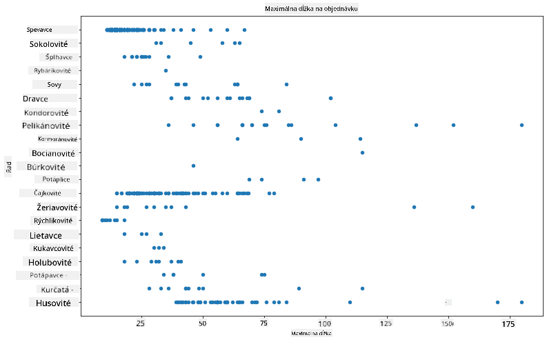
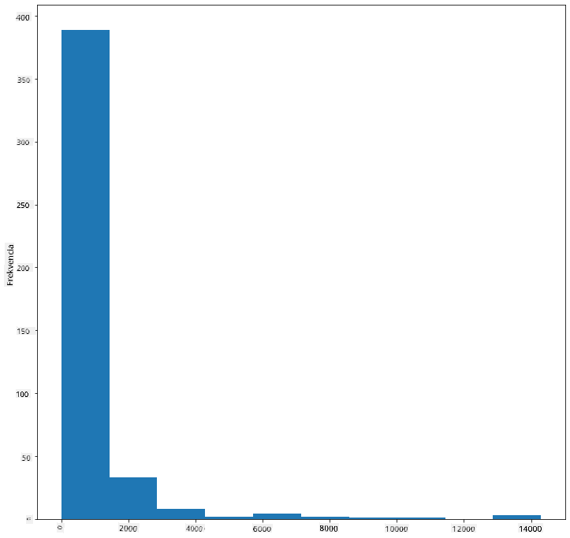
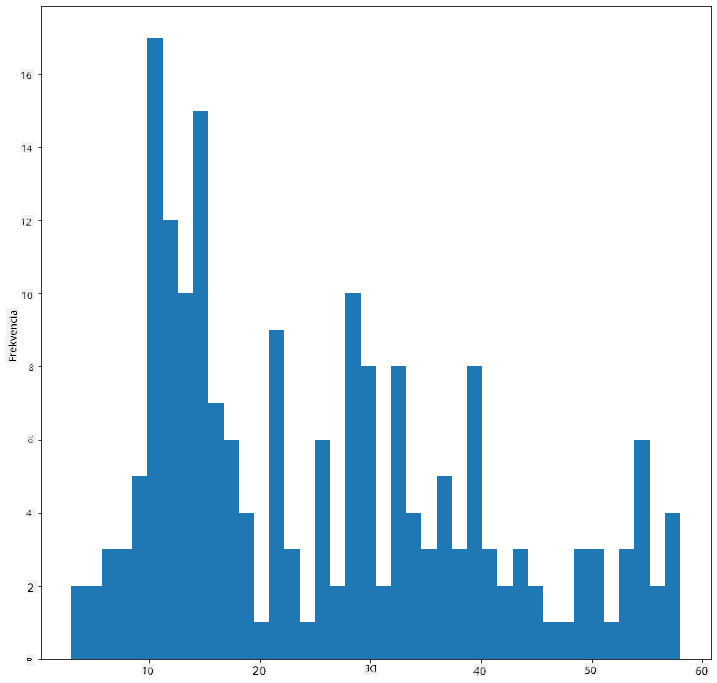
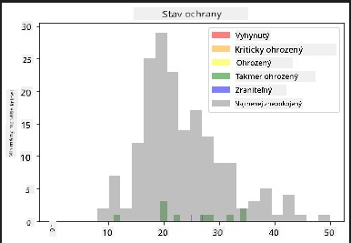
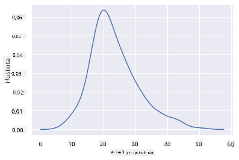
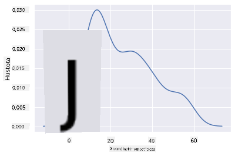
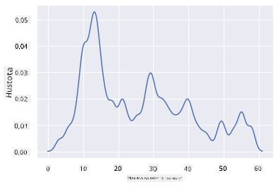
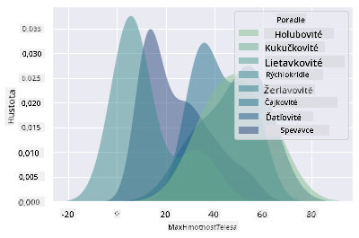
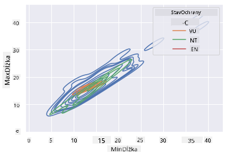

<!--
CO_OP_TRANSLATOR_METADATA:
{
  "original_hash": "87faccac113d772551486a67a607153e",
  "translation_date": "2025-08-26T16:50:43+00:00",
  "source_file": "3-Data-Visualization/10-visualization-distributions/README.md",
  "language_code": "sk"
}
-->
# Vizualizácia distribúcií

| ](../../sketchnotes/10-Visualizing-Distributions.png)|
|:---:|
| Vizualizácia distribúcií - _Sketchnote od [@nitya](https://twitter.com/nitya)_ |

V predchádzajúcej lekcii ste sa dozvedeli niekoľko zaujímavých faktov o dátovej sade o vtákoch z Minnesoty. Našli ste chybné údaje vizualizáciou odľahlých hodnôt a pozreli ste sa na rozdiely medzi kategóriami vtákov podľa ich maximálnej dĺžky.

## [Kvíz pred prednáškou](https://purple-hill-04aebfb03.1.azurestaticapps.net/quiz/18)
## Preskúmajte dátovú sadu vtákov

Ďalším spôsobom, ako sa ponoriť do údajov, je pozrieť sa na ich distribúciu, teda ako sú údaje usporiadané pozdĺž osi. Možno by ste napríklad chceli zistiť všeobecnú distribúciu maximálneho rozpätia krídel alebo maximálnej telesnej hmotnosti vtákov z Minnesoty v tejto dátovej sade.

Poďme objaviť niektoré fakty o distribúciách údajov v tejto dátovej sade. V súbore _notebook.ipynb_ v koreňovom adresári tejto lekcie importujte Pandas, Matplotlib a svoje údaje:

```python
import pandas as pd
import matplotlib.pyplot as plt
birds = pd.read_csv('../../data/birds.csv')
birds.head()
```

|      | Názov                        | Vedecký názov          | Kategória             | Rad          | Čeľaď    | Rod         | Stav ochrany        | MinDĺžka | MaxDĺžka | MinHmotnosť | MaxHmotnosť | MinRozpätie | MaxRozpätie |
| ---: | :--------------------------- | :--------------------- | :-------------------- | :----------- | :------- | :---------- | :----------------- | --------: | --------: | ----------: | ----------: | ----------: | ----------: |
|    0 | Čiernobruchá husica          | Dendrocygna autumnalis | Kačice/Husi/Vodné vtáky | Anseriformes | Anatidae | Dendrocygna | LC                 |        47 |        56 |         652 |        1020 |          76 |          94 |
|    1 | Hnedá husica                 | Dendrocygna bicolor    | Kačice/Husi/Vodné vtáky | Anseriformes | Anatidae | Dendrocygna | LC                 |        45 |        53 |         712 |        1050 |          85 |          93 |
|    2 | Snežná hus                   | Anser caerulescens     | Kačice/Husi/Vodné vtáky | Anseriformes | Anatidae | Anser       | LC                 |        64 |        79 |        2050 |        4050 |         135 |         165 |
|    3 | Rossova hus                  | Anser rossii           | Kačice/Husi/Vodné vtáky | Anseriformes | Anatidae | Anser       | LC                 |      57.3 |        64 |        1066 |        1567 |         113 |         116 |
|    4 | Veľká bieločelá hus          | Anser albifrons        | Kačice/Husi/Vodné vtáky | Anseriformes | Anatidae | Anser       | LC                 |        64 |        81 |        1930 |        3310 |         130 |         165 |

Vo všeobecnosti môžete rýchlo získať prehľad o tom, ako sú údaje distribuované, pomocou bodového grafu, ako sme to robili v predchádzajúcej lekcii:

```python
birds.plot(kind='scatter',x='MaxLength',y='Order',figsize=(12,8))

plt.title('Max Length per Order')
plt.ylabel('Order')
plt.xlabel('Max Length')

plt.show()
```


Tento graf poskytuje prehľad o všeobecnej distribúcii dĺžky tela podľa radu vtákov, ale nie je to optimálny spôsob zobrazenia skutočných distribúcií. Na tento účel sa zvyčajne používa histogram.

## Práca s histogramami

Matplotlib ponúka veľmi dobré spôsoby vizualizácie distribúcie údajov pomocou histogramov. Tento typ grafu je podobný stĺpcovému grafu, kde distribúciu možno vidieť prostredníctvom stúpania a klesania stĺpcov. Na vytvorenie histogramu potrebujete číselné údaje. Na vytvorenie histogramu môžete definovať typ grafu ako 'hist' pre histogram. Tento graf ukazuje distribúciu MaxBodyMass pre celý rozsah číselných údajov v dátovej sade. Rozdelením poľa údajov na menšie časti (bins) dokáže zobraziť distribúciu hodnôt údajov:

```python
birds['MaxBodyMass'].plot(kind = 'hist', bins = 10, figsize = (12,12))
plt.show()
```


Ako vidíte, väčšina z viac ako 400 vtákov v tejto dátovej sade spadá do rozsahu pod 2000 pre ich maximálnu telesnú hmotnosť. Získajte viac informácií o údajoch zmenou parametra `bins` na vyššie číslo, napríklad 30:

```python
birds['MaxBodyMass'].plot(kind = 'hist', bins = 30, figsize = (12,12))
plt.show()
```


Tento graf ukazuje distribúciu o niečo podrobnejšie. Menej skreslený graf by sa dal vytvoriť tak, že by ste vybrali iba údaje v určitom rozsahu:

Filtrovať údaje tak, aby ste získali iba tie vtáky, ktorých telesná hmotnosť je pod 60, a zobraziť 40 `bins`:

```python
filteredBirds = birds[(birds['MaxBodyMass'] > 1) & (birds['MaxBodyMass'] < 60)]      
filteredBirds['MaxBodyMass'].plot(kind = 'hist',bins = 40,figsize = (12,12))
plt.show()     
```


✅ Vyskúšajte iné filtre a dátové body. Ak chcete vidieť celú distribúciu údajov, odstráňte filter `['MaxBodyMass']`, aby ste zobrazili označené distribúcie.

Histogram ponúka aj niektoré pekné vylepšenia farieb a označovania, ktoré môžete vyskúšať:

Vytvorte 2D histogram na porovnanie vzťahu medzi dvoma distribúciami. Porovnajme `MaxBodyMass` vs. `MaxLength`. Matplotlib ponúka zabudovaný spôsob zobrazenia konvergencie pomocou jasnejších farieb:

```python
x = filteredBirds['MaxBodyMass']
y = filteredBirds['MaxLength']

fig, ax = plt.subplots(tight_layout=True)
hist = ax.hist2d(x, y)
```
Zdá sa, že medzi týmito dvoma prvkami existuje očakávaná korelácia pozdĺž očakávanej osi, s jedným obzvlášť silným bodom konvergencie:


Histogramy fungujú dobre predvolene pre číselné údaje. Čo ak potrebujete vidieť distribúcie podľa textových údajov? 
## Preskúmajte dátovú sadu pre distribúcie pomocou textových údajov 

Táto dátová sada obsahuje aj dobré informácie o kategórii vtákov, ich rode, druhu a čeľadi, ako aj o ich stave ochrany. Poďme sa pozrieť na tieto informácie o stave ochrany. Aká je distribúcia vtákov podľa ich stavu ochrany?

> ✅ V dátovej sade sa používa niekoľko skratiek na opis stavu ochrany. Tieto skratky pochádzajú z [IUCN Red List Categories](https://www.iucnredlist.org/), organizácie, ktorá katalogizuje stav druhov.
> 
> - CR: Kriticky ohrozený
> - EN: Ohrozený
> - EX: Vyhynutý
> - LC: Najmenej ohrozený
> - NT: Takmer ohrozený
> - VU: Zraniteľný

Tieto hodnoty sú textové, takže budete musieť vykonať transformáciu na vytvorenie histogramu. Pomocou dataframe `filteredBirds` zobrazte jeho stav ochrany spolu s minimálnym rozpätím krídel. Čo vidíte? 

```python
x1 = filteredBirds.loc[filteredBirds.ConservationStatus=='EX', 'MinWingspan']
x2 = filteredBirds.loc[filteredBirds.ConservationStatus=='CR', 'MinWingspan']
x3 = filteredBirds.loc[filteredBirds.ConservationStatus=='EN', 'MinWingspan']
x4 = filteredBirds.loc[filteredBirds.ConservationStatus=='NT', 'MinWingspan']
x5 = filteredBirds.loc[filteredBirds.ConservationStatus=='VU', 'MinWingspan']
x6 = filteredBirds.loc[filteredBirds.ConservationStatus=='LC', 'MinWingspan']

kwargs = dict(alpha=0.5, bins=20)

plt.hist(x1, **kwargs, color='red', label='Extinct')
plt.hist(x2, **kwargs, color='orange', label='Critically Endangered')
plt.hist(x3, **kwargs, color='yellow', label='Endangered')
plt.hist(x4, **kwargs, color='green', label='Near Threatened')
plt.hist(x5, **kwargs, color='blue', label='Vulnerable')
plt.hist(x6, **kwargs, color='gray', label='Least Concern')

plt.gca().set(title='Conservation Status', ylabel='Min Wingspan')
plt.legend();
```



Zdá sa, že medzi minimálnym rozpätím krídel a stavom ochrany neexistuje dobrá korelácia. Otestujte iné prvky dátovej sady pomocou tejto metódy. Môžete vyskúšať rôzne filtre. Nájdete nejakú koreláciu?

## Hustotné grafy

Možno ste si všimli, že histogramy, ktoré sme doteraz videli, sú „krokové“ a neplynú hladko v oblúku. Ak chcete zobraziť hladší hustotný graf, môžete vyskúšať hustotný graf.

Na prácu s hustotnými grafmi sa oboznámte s novou knižnicou na vykresľovanie, [Seaborn](https://seaborn.pydata.org/generated/seaborn.kdeplot.html). 

Po načítaní Seaborn vyskúšajte základný hustotný graf:

```python
import seaborn as sns
import matplotlib.pyplot as plt
sns.kdeplot(filteredBirds['MinWingspan'])
plt.show()
```


Vidíte, ako graf odráža ten predchádzajúci pre údaje o minimálnom rozpätí krídel; je len o niečo hladší. Podľa dokumentácie Seaborn: „V porovnaní s histogramom môže KDE vytvoriť graf, ktorý je menej preplnený a ľahšie interpretovateľný, najmä pri vykresľovaní viacerých distribúcií. Ale má potenciál zaviesť skreslenia, ak je základná distribúcia ohraničená alebo nie je hladká. Podobne ako histogram, kvalita reprezentácie tiež závisí od výberu dobrých parametrov vyhladzovania." [zdroj](https://seaborn.pydata.org/generated/seaborn.kdeplot.html) Inými slovami, odľahlé hodnoty, ako vždy, môžu spôsobiť, že vaše grafy budú nesprávne.

Ak by ste chceli znovu navštíviť tú zubatú čiaru MaxBodyMass v druhom grafe, ktorý ste vytvorili, mohli by ste ju veľmi dobre vyhladiť opätovným vytvorením pomocou tejto metódy:

```python
sns.kdeplot(filteredBirds['MaxBodyMass'])
plt.show()
```


Ak by ste chceli hladkú, ale nie príliš hladkú čiaru, upravte parameter `bw_adjust`: 

```python
sns.kdeplot(filteredBirds['MaxBodyMass'], bw_adjust=.2)
plt.show()
```


✅ Prečítajte si o parametroch dostupných pre tento typ grafu a experimentujte!

Tento typ grafu ponúka krásne vysvetľujúce vizualizácie. S niekoľkými riadkami kódu môžete napríklad zobraziť hustotu maximálnej telesnej hmotnosti podľa radu vtákov:

```python
sns.kdeplot(
   data=filteredBirds, x="MaxBodyMass", hue="Order",
   fill=True, common_norm=False, palette="crest",
   alpha=.5, linewidth=0,
)
```



Môžete tiež mapovať hustotu viacerých premenných v jednom grafe. Porovnajte MaxLength a MinLength vtáka podľa ich stavu ochrany:

```python
sns.kdeplot(data=filteredBirds, x="MinLength", y="MaxLength", hue="ConservationStatus")
```



Možno stojí za to preskúmať, či je zhluk „zraniteľných“ vtákov podľa ich dĺžok významný alebo nie.

## 🚀 Výzva

Histogramy sú sofistikovanejším typom grafu ako základné bodové grafy, stĺpcové grafy alebo čiarové grafy. Vyhľadajte na internete dobré príklady použitia histogramov. Ako sa používajú, čo demonštrujú a v akých oblastiach alebo oblastiach výskumu sa zvyčajne používajú?

## [Kvíz po prednáške](https://purple-hill-04aebfb03.1.azurestaticapps.net/quiz/19)

## Prehľad a samoštúdium

V tejto lekcii ste použili Matplotlib a začali pracovať so Seaborn na vytváranie sofistikovanejších grafov. Urobte si výskum o `kdeplot` v Seaborn, „kontinuálnej krivke pravdepodobnostnej hustoty v jednej alebo viacerých dimenziách“. Prečítajte si [dokumentáciu](https://seaborn.pydata.org/generated/seaborn.kdeplot.html), aby ste pochopili, ako funguje.

## Zadanie

[Uplatnite svoje zručnosti](assignment.md)

---

**Upozornenie**:  
Tento dokument bol preložený pomocou služby AI prekladu [Co-op Translator](https://github.com/Azure/co-op-translator). Aj keď sa snažíme o presnosť, prosím, berte na vedomie, že automatizované preklady môžu obsahovať chyby alebo nepresnosti. Pôvodný dokument v jeho pôvodnom jazyku by mal byť považovaný za autoritatívny zdroj. Pre kritické informácie sa odporúča profesionálny ľudský preklad. Nie sme zodpovední za akékoľvek nedorozumenia alebo nesprávne interpretácie vyplývajúce z použitia tohto prekladu.