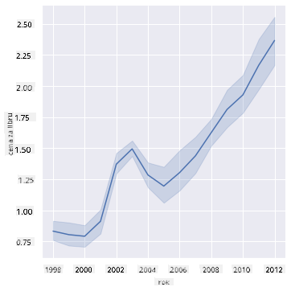
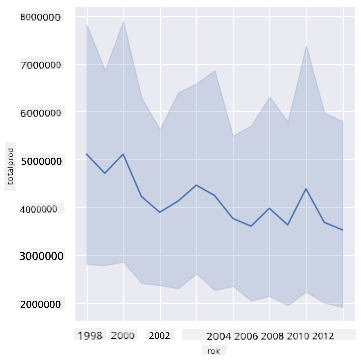
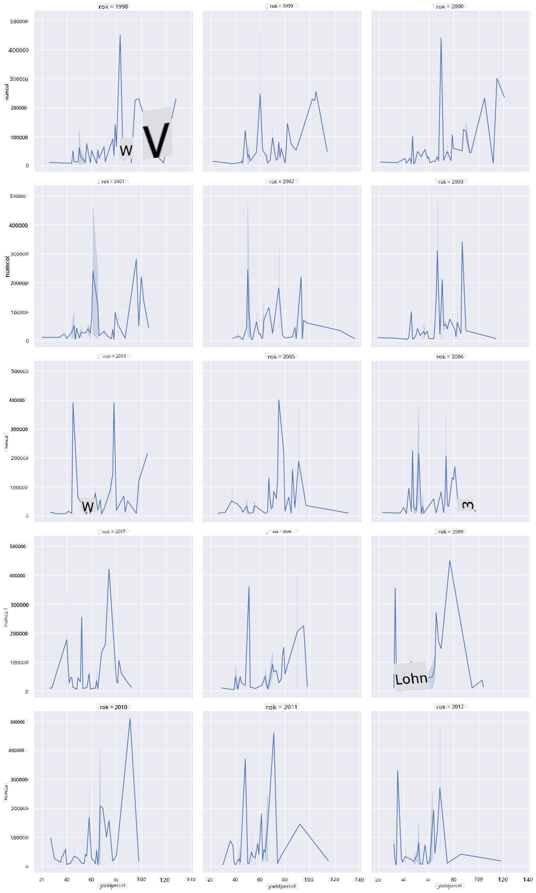
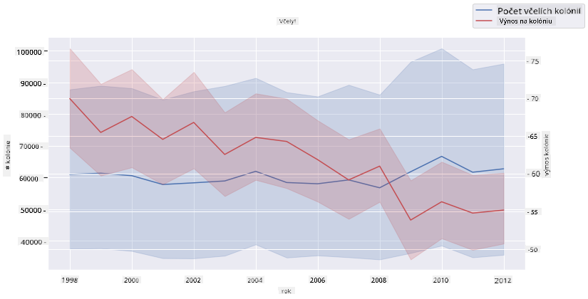

<!--
CO_OP_TRANSLATOR_METADATA:
{
  "original_hash": "cad419b574d5c35eaa417e9abfdcb0c8",
  "translation_date": "2025-08-26T16:55:10+00:00",
  "source_file": "3-Data-Visualization/12-visualization-relationships/README.md",
  "language_code": "sk"
}
-->
# Vizualizácia vzťahov: Všetko o mede 🍯

| ](../../sketchnotes/12-Visualizing-Relationships.png)|
|:---:|
|Vizualizácia vzťahov - _Sketchnote od [@nitya](https://twitter.com/nitya)_ |

Pokračujúc v prírodnom zameraní nášho výskumu, objavme zaujímavé vizualizácie na zobrazenie vzťahov medzi rôznymi druhmi medu podľa datasetu odvodeného z [Ministerstva poľnohospodárstva Spojených štátov](https://www.nass.usda.gov/About_NASS/index.php).

Tento dataset obsahuje približne 600 položiek a zobrazuje produkciu medu v mnohých štátoch USA. Napríklad môžete preskúmať počet kolónií, výnos na kolóniu, celkovú produkciu, zásoby, cenu za libru a hodnotu vyprodukovaného medu v danom štáte od roku 1998 do 2012, pričom každý riadok predstavuje jeden rok pre každý štát.

Bude zaujímavé vizualizovať vzťah medzi produkciou v danom štáte za rok a napríklad cenou medu v tom istom štáte. Alternatívne by ste mohli vizualizovať vzťah medzi výnosom medu na kolóniu v jednotlivých štátoch. Toto obdobie zahŕňa aj ničivý fenomén 'CCD' alebo 'Colony Collapse Disorder', ktorý bol prvýkrát zaznamenaný v roku 2006 (http://npic.orst.edu/envir/ccd.html), takže ide o dojímavý dataset na štúdium. 🐝

## [Kvíz pred prednáškou](https://purple-hill-04aebfb03.1.azurestaticapps.net/quiz/22)

V tejto lekcii môžete použiť knižnicu Seaborn, ktorú ste už používali, ako skvelý nástroj na vizualizáciu vzťahov medzi premennými. Obzvlášť zaujímavá je funkcia `relplot` v Seaborne, ktorá umožňuje rýchlo vytvárať bodové a čiarové grafy na vizualizáciu '[štatistických vzťahov](https://seaborn.pydata.org/tutorial/relational.html?highlight=relationships)', čo umožňuje dátovému analytikovi lepšie pochopiť, ako sa premenné navzájom ovplyvňujú.

## Bodové grafy

Použite bodový graf na zobrazenie, ako sa cena medu vyvíjala rok čo rok v jednotlivých štátoch. Seaborn, pomocou `relplot`, pohodlne zoskupuje údaje podľa štátov a zobrazuje dátové body pre kategorizované aj číselné údaje.

Začnime importovaním údajov a knižnice Seaborn:

```python
import pandas as pd
import matplotlib.pyplot as plt
import seaborn as sns
honey = pd.read_csv('../../data/honey.csv')
honey.head()
```
Všimnete si, že údaje o mede obsahujú niekoľko zaujímavých stĺpcov, vrátane roku a ceny za libru. Preskúmajme tieto údaje, zoskupené podľa štátov USA:

| štát | počet kolónií | výnos na kolóniu | celková produkcia | zásoby   | cena za libru | hodnota produkcie | rok |
| ----- | ------------- | ---------------- | ----------------- | -------- | ------------- | ----------------- | --- |
| AL    | 16000         | 71              | 1136000           | 159000   | 0.72          | 818000            | 1998 |
| AZ    | 55000         | 60              | 3300000           | 1485000  | 0.64          | 2112000           | 1998 |
| AR    | 53000         | 65              | 3445000           | 1688000  | 0.59          | 2033000           | 1998 |
| CA    | 450000        | 83              | 37350000          | 12326000 | 0.62          | 23157000          | 1998 |
| CO    | 27000         | 72              | 1944000           | 1594000  | 0.7           | 1361000           | 1998 |

Vytvorte základný bodový graf na zobrazenie vzťahu medzi cenou za libru medu a jeho pôvodným štátom v USA. Nastavte os `y` dostatočne vysokú, aby zobrazila všetky štáty:

```python
sns.relplot(x="priceperlb", y="state", data=honey, height=15, aspect=.5);
```


Teraz zobrazte tie isté údaje s farebnou schémou pripomínajúcou med, aby ste ukázali, ako sa cena vyvíja v priebehu rokov. Môžete to dosiahnuť pridaním parametra 'hue', ktorý ukáže zmenu rok čo rok:

> ✅ Viac o [farebných paletách, ktoré môžete použiť v Seaborne](https://seaborn.pydata.org/tutorial/color_palettes.html) - vyskúšajte krásnu dúhovú farebnú schému!

```python
sns.relplot(x="priceperlb", y="state", hue="year", palette="YlOrBr", data=honey, height=15, aspect=.5);
```


S touto zmenou farebnej schémy môžete vidieť, že cena za libru medu má zjavne silný progres v priebehu rokov. Ak sa pozriete na vzorku údajov (napríklad štát Arizona), môžete vidieť vzor zvyšovania cien rok čo rok, s niekoľkými výnimkami:

| štát | počet kolónií | výnos na kolóniu | celková produkcia | zásoby  | cena za libru | hodnota produkcie | rok |
| ----- | ------------- | ---------------- | ----------------- | ------- | ------------- | ----------------- | --- |
| AZ    | 55000         | 60              | 3300000           | 1485000 | 0.64          | 2112000           | 1998 |
| AZ    | 52000         | 62              | 3224000           | 1548000 | 0.62          | 1999000           | 1999 |
| AZ    | 40000         | 59              | 2360000           | 1322000 | 0.73          | 1723000           | 2000 |
| AZ    | 43000         | 59              | 2537000           | 1142000 | 0.72          | 1827000           | 2001 |
| AZ    | 38000         | 63              | 2394000           | 1197000 | 1.08          | 2586000           | 2002 |
| AZ    | 35000         | 72              | 2520000           | 983000  | 1.34          | 3377000           | 2003 |
| AZ    | 32000         | 55              | 1760000           | 774000  | 1.11          | 1954000           | 2004 |
| AZ    | 36000         | 50              | 1800000           | 720000  | 1.04          | 1872000           | 2005 |
| AZ    | 30000         | 65              | 1950000           | 839000  | 0.91          | 1775000           | 2006 |
| AZ    | 30000         | 64              | 1920000           | 902000  | 1.26          | 2419000           | 2007 |
| AZ    | 25000         | 64              | 1600000           | 336000  | 1.26          | 2016000           | 2008 |
| AZ    | 20000         | 52              | 1040000           | 562000  | 1.45          | 1508000           | 2009 |
| AZ    | 24000         | 77              | 1848000           | 665000  | 1.52          | 2809000           | 2010 |
| AZ    | 23000         | 53              | 1219000           | 427000  | 1.55          | 1889000           | 2011 |
| AZ    | 22000         | 46              | 1012000           | 253000  | 1.79          | 1811000           | 2012 |

Ďalším spôsobom, ako vizualizovať tento progres, je použiť veľkosť namiesto farby. Pre používateľov s poruchami farebného videnia by to mohla byť lepšia možnosť. Upravte svoju vizualizáciu tak, aby zvýšenie ceny bolo znázornené zväčšením obvodu bodov:

```python
sns.relplot(x="priceperlb", y="state", size="year", data=honey, height=15, aspect=.5);
```
Vidíte, že veľkosť bodov sa postupne zväčšuje.


Je to jednoduchý prípad ponuky a dopytu? Kvôli faktorom, ako je zmena klímy a kolaps kolónií, je k dispozícii menej medu na predaj rok čo rok, a preto cena rastie?

Aby sme objavili koreláciu medzi niektorými premennými v tomto datasete, preskúmajme niekoľko čiarových grafov.

## Čiarové grafy

Otázka: Je zrejmý nárast ceny medu za libru rok čo rok? Najjednoduchšie to zistíte vytvorením jedného čiarového grafu:

```python
sns.relplot(x="year", y="priceperlb", kind="line", data=honey);
```
Odpoveď: Áno, s niekoľkými výnimkami okolo roku 2003:



✅ Keďže Seaborn agreguje údaje do jednej čiary, zobrazuje "viacero meraní pre každú hodnotu x tým, že vykresľuje priemer a 95% interval spoľahlivosti okolo priemeru". [Zdroj](https://seaborn.pydata.org/tutorial/relational.html). Toto časovo náročné správanie môžete vypnúť pridaním `ci=None`.

Otázka: No, v roku 2003 môžeme tiež vidieť nárast v zásobách medu? Čo ak sa pozriete na celkovú produkciu rok čo rok?

```python
sns.relplot(x="year", y="totalprod", kind="line", data=honey);
```



Odpoveď: Nie celkom. Ak sa pozriete na celkovú produkciu, zdá sa, že v tomto konkrétnom roku skutočne vzrástla, aj keď všeobecne množstvo vyprodukovaného medu v týchto rokoch klesá.

Otázka: V tom prípade, čo mohlo spôsobiť ten nárast ceny medu okolo roku 2003?

Aby sme to zistili, môžeme preskúmať mriežku aspektov.

## Mriežky aspektov

Mriežky aspektov berú jeden aspekt vášho datasetu (v našom prípade môžete zvoliť 'rok', aby sa nevytvorilo príliš veľa aspektov). Seaborn potom môže vytvoriť graf pre každý z týchto aspektov vašich zvolených súradníc x a y pre jednoduchšie vizuálne porovnanie. Vyniká rok 2003 v tomto type porovnania?

Vytvorte mriežku aspektov pokračovaním v používaní `relplot`, ako odporúča [dokumentácia Seaborn](https://seaborn.pydata.org/generated/seaborn.FacetGrid.html?highlight=facetgrid#seaborn.FacetGrid).

```python
sns.relplot(
    data=honey, 
    x="yieldpercol", y="numcol",
    col="year", 
    col_wrap=3,
    kind="line"
```
V tejto vizualizácii môžete porovnať výnos na kolóniu a počet kolónií rok čo rok, vedľa seba, s nastavením wrap na 3 pre stĺpce:



Pre tento dataset nič zvlášť nevyniká, pokiaľ ide o počet kolónií a ich výnos, rok čo rok a štát po štáte. Existuje iný spôsob, ako nájsť koreláciu medzi týmito dvoma premennými?

## Dvojité čiarové grafy

Vyskúšajte viacnásobný čiarový graf prekrytím dvoch čiarových grafov na seba, pomocou funkcie Seaborn 'despine' na odstránenie horných a pravých osí a použitia `ax.twinx` [odvodeného z Matplotlib](https://matplotlib.org/stable/api/_as_gen/matplotlib.axes.Axes.twinx.html). Twinx umožňuje grafu zdieľať os x a zobraziť dve osi y. Zobrazte výnos na kolóniu a počet kolónií, prekryté:

```python
fig, ax = plt.subplots(figsize=(12,6))
lineplot = sns.lineplot(x=honey['year'], y=honey['numcol'], data=honey, 
                        label = 'Number of bee colonies', legend=False)
sns.despine()
plt.ylabel('# colonies')
plt.title('Honey Production Year over Year');

ax2 = ax.twinx()
lineplot2 = sns.lineplot(x=honey['year'], y=honey['yieldpercol'], ax=ax2, color="r", 
                         label ='Yield per colony', legend=False) 
sns.despine(right=False)
plt.ylabel('colony yield')
ax.figure.legend();
```


Aj keď nič výrazne nevyniká okolo roku 2003, umožňuje nám to ukončiť túto lekciu na trochu pozitívnejšiu nôtu: aj keď počet kolónií celkovo klesá, ich počet sa stabilizuje, aj keď ich výnos na kolóniu klesá.

Do toho, včely, do toho!

🐝❤️
## 🚀 Výzva

V tejto lekcii ste sa dozvedeli viac o iných využitiach bodových grafov a mriežok aspektov, vrátane mriežok aspektov. Vyzvite sa na vytvorenie mriežky aspektov pomocou iného datasetu, možno takého, ktorý ste použili pred týmito lekciami. Všimnite si, ako dlho trvá ich vytvorenie a ako musíte byť opatrní pri počte mriežok, ktoré potrebujete vykresliť pomocou týchto techník.
## [Kvíz po prednáške](https://purple-hill-04aebfb03.1.azurestaticapps.net/quiz/23)

## Prehľad a samoštúdium

Čiarové grafy môžu byť jednoduché alebo pomerne zložité. Prečítajte si trochu viac v [dokumentácii Seaborn](https://seaborn.pydata.org/generated/seaborn.lineplot.html) o rôznych spôsoboch, ako ich môžete vytvoriť. Skúste vylepšiť čiarové grafy, ktoré ste vytvorili v tejto lekcii, pomocou iných metód uvedených v dokumentácii.
## Zadanie

[Ponorte sa do úľa](assignment.md)

---

**Upozornenie**:  
Tento dokument bol preložený pomocou služby AI prekladu [Co-op Translator](https://github.com/Azure/co-op-translator). Hoci sa snažíme o presnosť, prosím, berte na vedomie, že automatizované preklady môžu obsahovať chyby alebo nepresnosti. Pôvodný dokument v jeho rodnom jazyku by mal byť považovaný za autoritatívny zdroj. Pre kritické informácie sa odporúča profesionálny ľudský preklad. Nie sme zodpovední za akékoľvek nedorozumenia alebo nesprávne interpretácie vyplývajúce z použitia tohto prekladu.