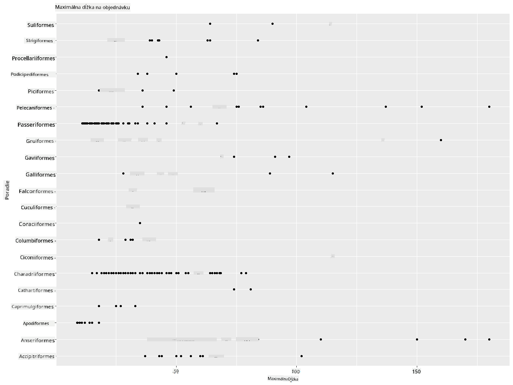
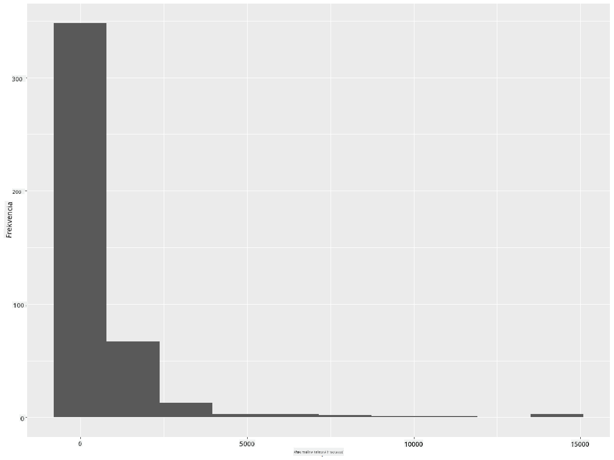
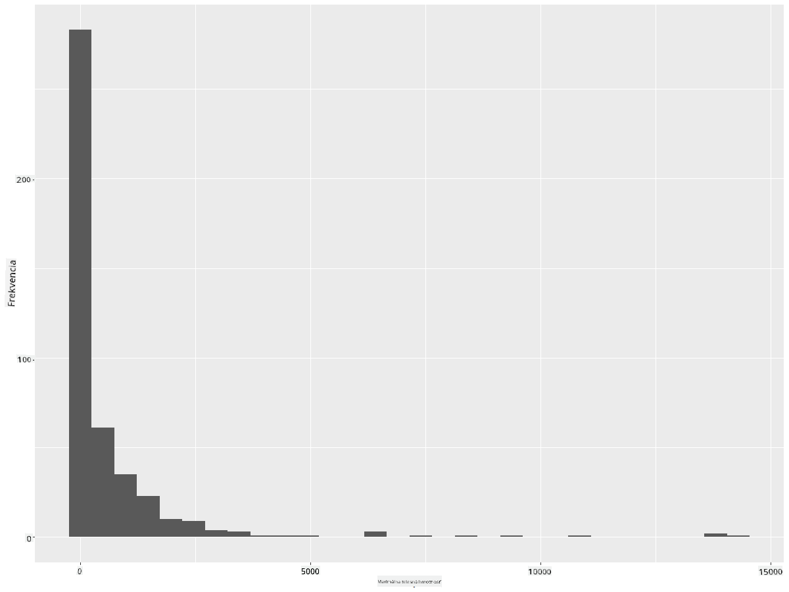
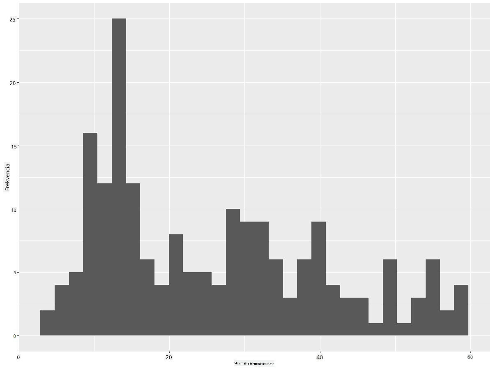
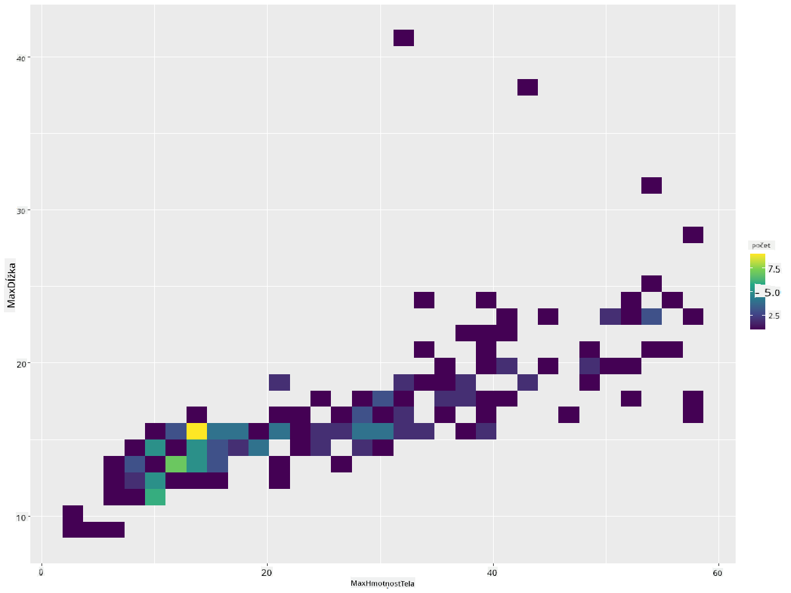
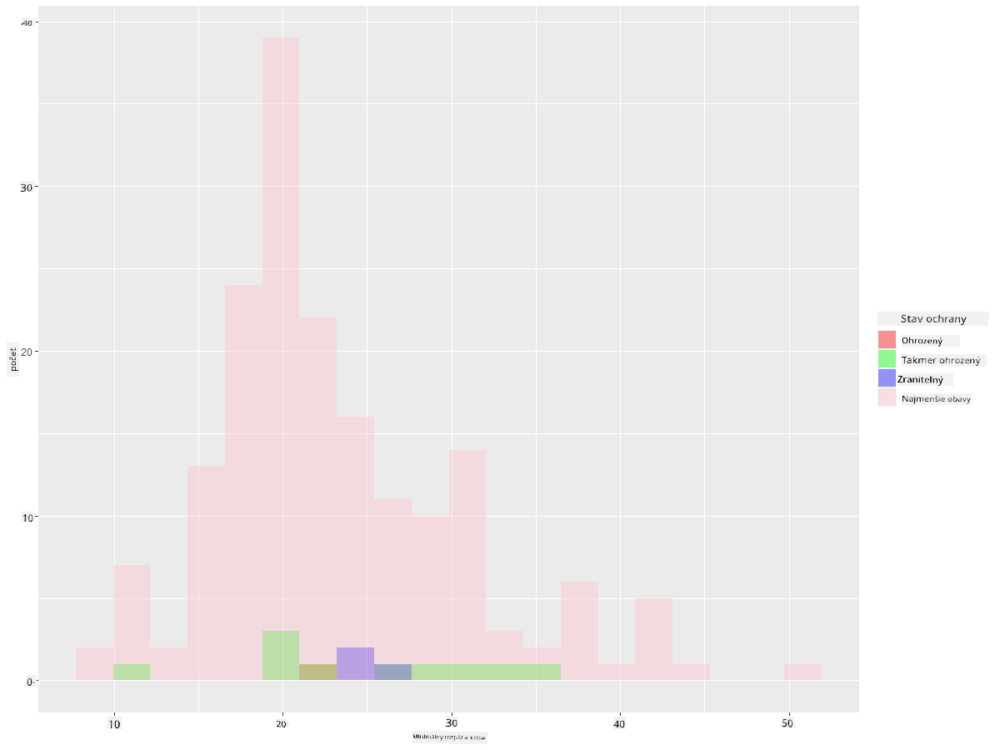
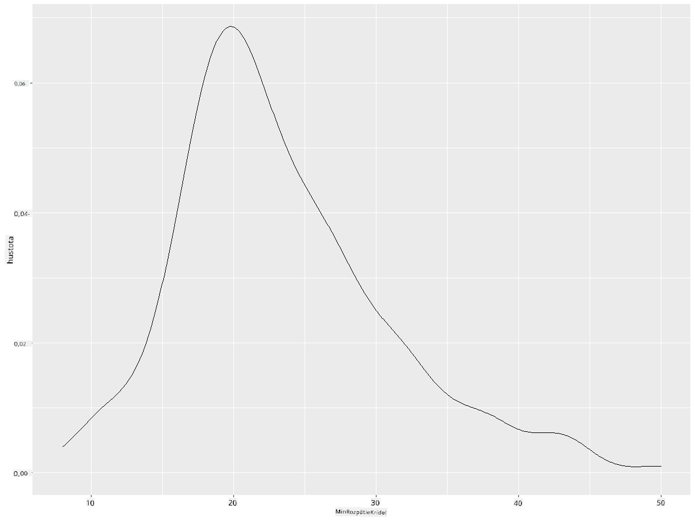
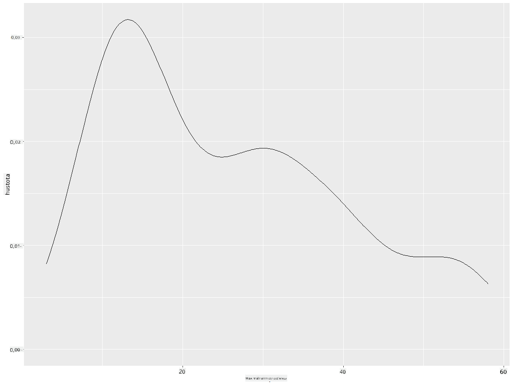
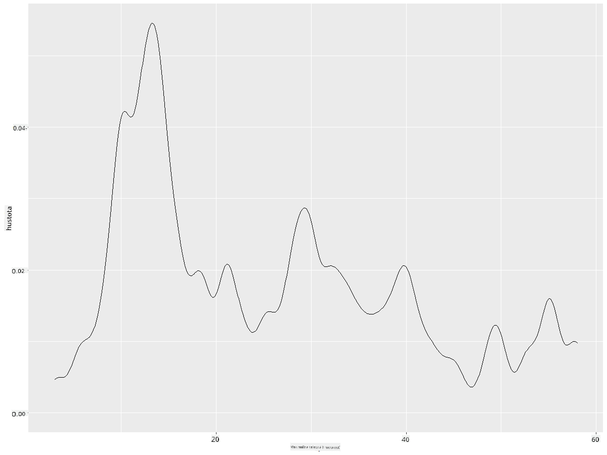
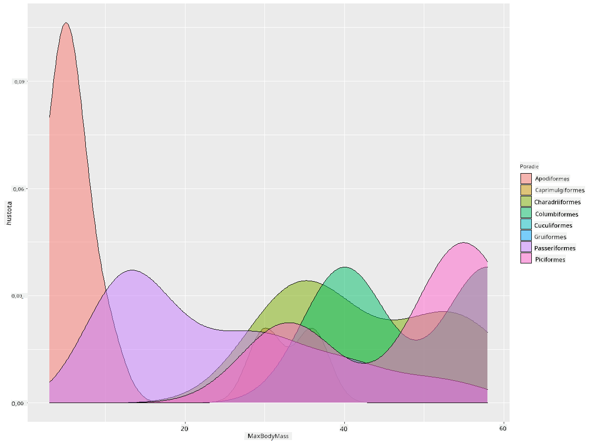

<!--
CO_OP_TRANSLATOR_METADATA:
{
  "original_hash": "ea67c0c40808fd723594de6896c37ccf",
  "translation_date": "2025-08-26T17:00:10+00:00",
  "source_file": "3-Data-Visualization/R/10-visualization-distributions/README.md",
  "language_code": "sk"
}
-->
# Vizualizácia distribúcií

| ](https://github.com/microsoft/Data-Science-For-Beginners/blob/main/sketchnotes/10-Visualizing-Distributions.png)|
|:---:|
| Vizualizácia distribúcií - _Sketchnote od [@nitya](https://twitter.com/nitya)_ |

V predchádzajúcej lekcii ste sa dozvedeli niekoľko zaujímavých faktov o súbore údajov o vtákoch z Minnesoty. Našli ste chybné údaje vizualizáciou odľahlých hodnôt a pozreli ste sa na rozdiely medzi kategóriami vtákov podľa ich maximálnej dĺžky.

## [Kvíz pred prednáškou](https://purple-hill-04aebfb03.1.azurestaticapps.net/quiz/18)
## Preskúmajte dataset vtákov

Ďalším spôsobom, ako sa ponoriť do údajov, je pozrieť sa na ich distribúciu, teda na to, ako sú údaje usporiadané pozdĺž osi. Možno by ste napríklad chceli zistiť všeobecnú distribúciu maximálneho rozpätia krídel alebo maximálnej telesnej hmotnosti vtákov z Minnesoty v tomto datasete.

Poďme objaviť niektoré fakty o distribúciách údajov v tomto datasete. Vo vašej R konzole importujte `ggplot2` a databázu. Odstráňte odľahlé hodnoty z databázy rovnako ako v predchádzajúcej téme.

```r
library(ggplot2)

birds <- read.csv("../../data/birds.csv",fileEncoding="UTF-8-BOM")

birds_filtered <- subset(birds, MaxWingspan < 500)
head(birds_filtered)
```
|      | Názov                        | Vedecký názov          | Kategória             | Rad          | Čeľaď    | Rod         | Stav ochrany         | MinDĺžka | MaxDĺžka | MinHmotnosť | MaxHmotnosť | MinRozpätie | MaxRozpätie |
| ---: | :--------------------------- | :--------------------- | :-------------------- | :----------- | :------- | :---------- | :------------------- | --------: | --------: | ----------: | ----------: | ----------: | ----------: |
|    0 | Čiernobruchá pískajúca kačica | Dendrocygna autumnalis | Kačice/Husi/Vodné vtáky | Anseriformes | Anatidae | Dendrocygna | LC                   |        47 |        56 |         652 |        1020 |          76 |          94 |
|    1 | Hnedá pískajúca kačica        | Dendrocygna bicolor    | Kačice/Husi/Vodné vtáky | Anseriformes | Anatidae | Dendrocygna | LC                   |        45 |        53 |         712 |        1050 |          85 |          93 |
|    2 | Snežná hus                    | Anser caerulescens     | Kačice/Husi/Vodné vtáky | Anseriformes | Anatidae | Anser       | LC                   |        64 |        79 |        2050 |        4050 |         135 |         165 |
|    3 | Rossova hus                   | Anser rossii           | Kačice/Husi/Vodné vtáky | Anseriformes | Anatidae | Anser       | LC                   |      57.3 |        64 |        1066 |        1567 |         113 |         116 |
|    4 | Veľká bieločelá hus           | Anser albifrons        | Kačice/Husi/Vodné vtáky | Anseriformes | Anatidae | Anser       | LC                   |        64 |        81 |        1930 |        3310 |         130 |         165 |

Vo všeobecnosti sa môžete rýchlo pozrieť na spôsob, akým sú údaje distribuované, pomocou bodového grafu, ako sme to urobili v predchádzajúcej lekcii:

```r
ggplot(data=birds_filtered, aes(x=Order, y=MaxLength,group=1)) +
  geom_point() +
  ggtitle("Max Length per order") + coord_flip()
```


Toto poskytuje prehľad o všeobecnej distribúcii dĺžky tela podľa radu vtákov, ale nie je to optimálny spôsob zobrazenia skutočných distribúcií. Táto úloha sa zvyčajne rieši vytvorením histogramu.

## Práca s histogramami

`ggplot2` ponúka veľmi dobré spôsoby vizualizácie distribúcie údajov pomocou histogramov. Tento typ grafu je podobný stĺpcovému grafu, kde distribúciu možno vidieť prostredníctvom stúpania a klesania stĺpcov. Na vytvorenie histogramu potrebujete číselné údaje. Na vytvorenie histogramu môžete vykresliť graf, pričom definujete typ ako 'hist' pre histogram. Tento graf ukazuje distribúciu MaxBodyMass pre celý rozsah číselných údajov datasetu. Rozdelením poľa údajov na menšie intervaly môže zobraziť distribúciu hodnôt údajov:

```r
ggplot(data = birds_filtered, aes(x = MaxBodyMass)) + 
  geom_histogram(bins=10)+ylab('Frequency')
```


Ako vidíte, väčšina z viac ako 400 vtákov v tomto datasete spadá do rozsahu pod 2000 pre ich maximálnu telesnú hmotnosť. Získajte viac informácií o údajoch zmenou parametra `bins` na vyššie číslo, napríklad 30:

```r
ggplot(data = birds_filtered, aes(x = MaxBodyMass)) + geom_histogram(bins=30)+ylab('Frequency')
```



Tento graf ukazuje distribúciu o niečo podrobnejšie. Graf menej posunutý doľava by sa dal vytvoriť zabezpečením, že vyberiete iba údaje v danom rozsahu:

Filtrovať údaje tak, aby ste získali iba tie vtáky, ktorých telesná hmotnosť je pod 60, a zobraziť 30 `bins`:

```r
birds_filtered_1 <- subset(birds_filtered, MaxBodyMass > 1 & MaxBodyMass < 60)
ggplot(data = birds_filtered_1, aes(x = MaxBodyMass)) + 
  geom_histogram(bins=30)+ylab('Frequency')
```



✅ Vyskúšajte iné filtre a dátové body. Ak chcete vidieť úplnú distribúciu údajov, odstráňte filter `['MaxBodyMass']`, aby sa zobrazili označené distribúcie.

Histogram ponúka aj niektoré pekné farebné a označovacie vylepšenia, ktoré môžete vyskúšať:

Vytvorte 2D histogram na porovnanie vzťahu medzi dvoma distribúciami. Porovnajme `MaxBodyMass` vs. `MaxLength`. `ggplot2` ponúka zabudovaný spôsob, ako ukázať konvergenciu pomocou jasnejších farieb:

```r
ggplot(data=birds_filtered_1, aes(x=MaxBodyMass, y=MaxLength) ) +
  geom_bin2d() +scale_fill_continuous(type = "viridis")
```
Zdá sa, že medzi týmito dvoma prvkami existuje očakávaná korelácia pozdĺž očakávanej osi, s jedným obzvlášť silným bodom konvergencie:



Histogramy fungujú dobre predvolene pre číselné údaje. Čo ak potrebujete vidieť distribúcie podľa textových údajov? 
## Preskúmajte dataset pre distribúcie pomocou textových údajov 

Tento dataset obsahuje aj dobré informácie o kategórii vtákov, ich rode, druhu a čeľadi, ako aj o ich stave ochrany. Poďme sa pozrieť na tieto informácie o ochrane. Aká je distribúcia vtákov podľa ich stavu ochrany?

> ✅ V datasete sa používa niekoľko skratiek na opis stavu ochrany. Tieto skratky pochádzajú z [IUCN Red List Categories](https://www.iucnredlist.org/), organizácie, ktorá katalogizuje stav druhov.
> 
> - CR: Kriticky ohrozený
> - EN: Ohrozený
> - EX: Vyhynutý
> - LC: Najmenej ohrozený
> - NT: Takmer ohrozený
> - VU: Zraniteľný

Tieto hodnoty sú textové, takže budete musieť vykonať transformáciu na vytvorenie histogramu. Pomocou dataframe `filteredBirds` zobrazte jeho stav ochrany spolu s minimálnym rozpätím krídel. Čo vidíte? 

```r
birds_filtered_1$ConservationStatus[birds_filtered_1$ConservationStatus == 'EX'] <- 'x1' 
birds_filtered_1$ConservationStatus[birds_filtered_1$ConservationStatus == 'CR'] <- 'x2'
birds_filtered_1$ConservationStatus[birds_filtered_1$ConservationStatus == 'EN'] <- 'x3'
birds_filtered_1$ConservationStatus[birds_filtered_1$ConservationStatus == 'NT'] <- 'x4'
birds_filtered_1$ConservationStatus[birds_filtered_1$ConservationStatus == 'VU'] <- 'x5'
birds_filtered_1$ConservationStatus[birds_filtered_1$ConservationStatus == 'LC'] <- 'x6'

ggplot(data=birds_filtered_1, aes(x = MinWingspan, fill = ConservationStatus)) +
  geom_histogram(position = "identity", alpha = 0.4, bins = 20) +
  scale_fill_manual(name="Conservation Status",values=c("red","green","blue","pink"),labels=c("Endangered","Near Threathened","Vulnerable","Least Concern"))
```



Zdá sa, že medzi minimálnym rozpätím krídel a stavom ochrany neexistuje dobrá korelácia. Otestujte iné prvky datasetu pomocou tejto metódy. Môžete vyskúšať aj rôzne filtre. Nájdete nejakú koreláciu?

## Hustotné grafy

Možno ste si všimli, že histogramy, ktoré sme doteraz videli, sú „krokové“ a nepôsobia plynulo v oblúku. Na zobrazenie plynulejšieho hustotného grafu môžete vyskúšať hustotný graf.

Poďme teraz pracovať s hustotnými grafmi!

```r
ggplot(data = birds_filtered_1, aes(x = MinWingspan)) + 
  geom_density()
```


Vidíte, ako graf odráža ten predchádzajúci pre údaje o minimálnom rozpätí krídel; je len o niečo plynulejší. Ak by ste chceli znovu navštíviť tú zubatú čiaru MaxBodyMass v druhom grafe, ktorý ste vytvorili, mohli by ste ju veľmi dobre vyhladiť opätovným vytvorením pomocou tejto metódy:

```r
ggplot(data = birds_filtered_1, aes(x = MaxBodyMass)) + 
  geom_density()
```


Ak by ste chceli hladkú, ale nie príliš hladkú čiaru, upravte parameter `adjust`: 

```r
ggplot(data = birds_filtered_1, aes(x = MaxBodyMass)) + 
  geom_density(adjust = 1/5)
```


✅ Prečítajte si o parametroch dostupných pre tento typ grafu a experimentujte!

Tento typ grafu ponúka krásne vysvetľujúce vizualizácie. S niekoľkými riadkami kódu môžete napríklad zobraziť hustotu maximálnej telesnej hmotnosti podľa radu vtákov:

```r
ggplot(data=birds_filtered_1,aes(x = MaxBodyMass, fill = Order)) +
  geom_density(alpha=0.5)
```


## 🚀 Výzva

Histogramy sú sofistikovanejším typom grafu ako základné bodové grafy, stĺpcové grafy alebo čiarové grafy. Vyhľadajte na internete dobré príklady použitia histogramov. Ako sa používajú, čo demonštrujú a v akých oblastiach alebo oblastiach výskumu sa zvyčajne používajú?

## [Kvíz po prednáške](https://purple-hill-04aebfb03.1.azurestaticapps.net/quiz/19)

## Prehľad a samoštúdium

V tejto lekcii ste použili `ggplot2` a začali ste pracovať na zobrazovaní sofistikovanejších grafov. Urobte si výskum o `geom_density_2d()` - "kontinuálna krivka hustoty pravdepodobnosti v jednej alebo viacerých dimenziách". Prečítajte si [dokumentáciu](https://ggplot2.tidyverse.org/reference/geom_density_2d.html), aby ste pochopili, ako funguje.

## Zadanie

[Uplatnite svoje zručnosti](assignment.md)

---

**Upozornenie**:  
Tento dokument bol preložený pomocou služby AI prekladu [Co-op Translator](https://github.com/Azure/co-op-translator). Hoci sa snažíme o presnosť, prosím, berte na vedomie, že automatizované preklady môžu obsahovať chyby alebo nepresnosti. Pôvodný dokument v jeho rodnom jazyku by mal byť považovaný za autoritatívny zdroj. Pre kritické informácie sa odporúča profesionálny ľudský preklad. Nie sme zodpovední za akékoľvek nedorozumenia alebo nesprávne interpretácie vyplývajúce z použitia tohto prekladu.