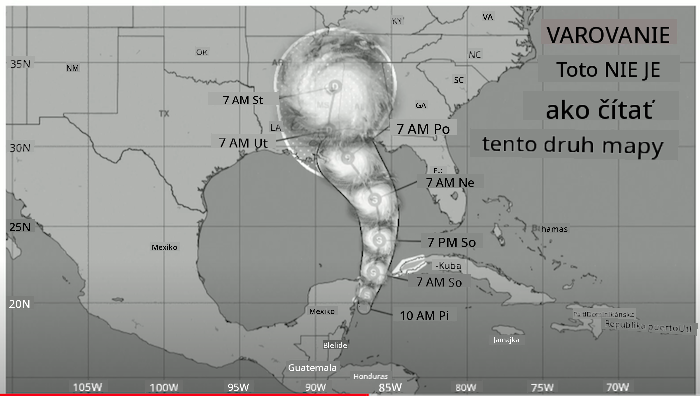
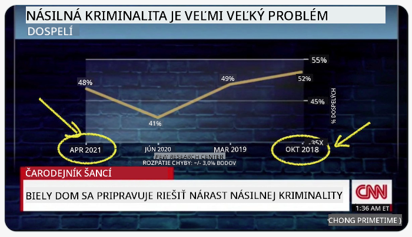
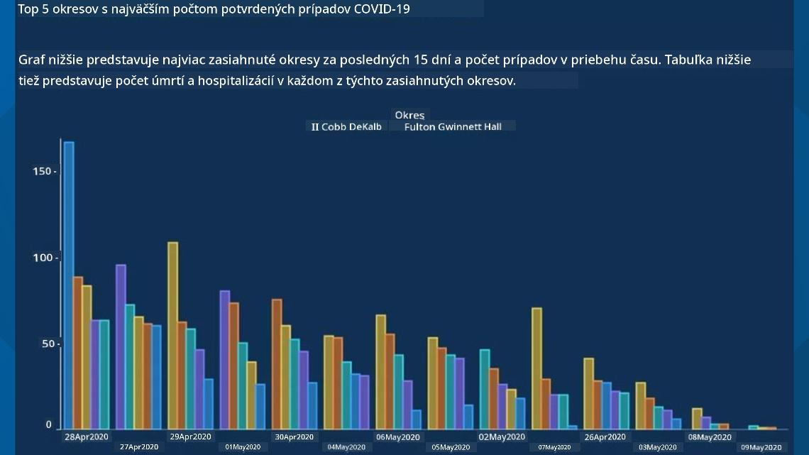
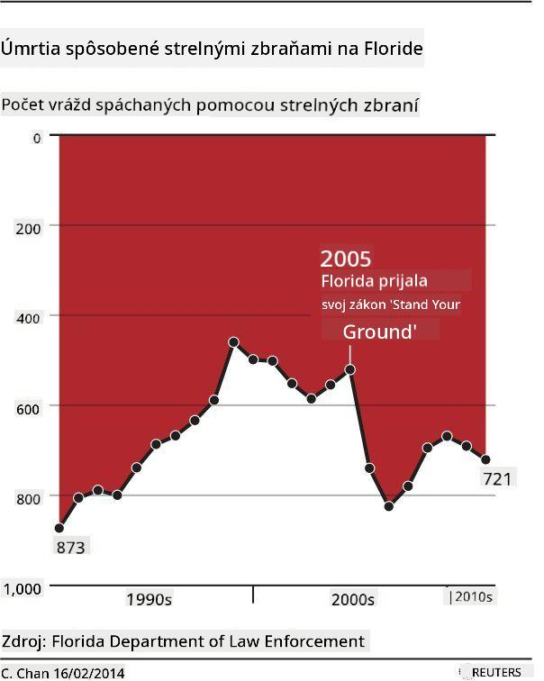
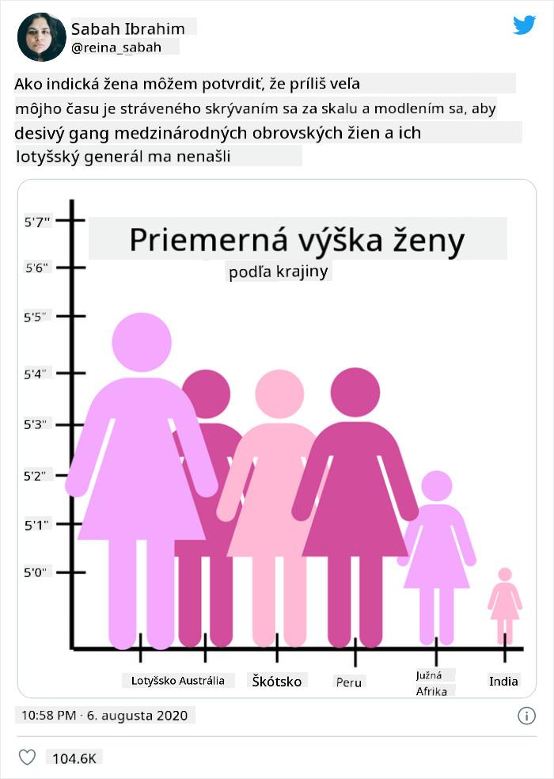
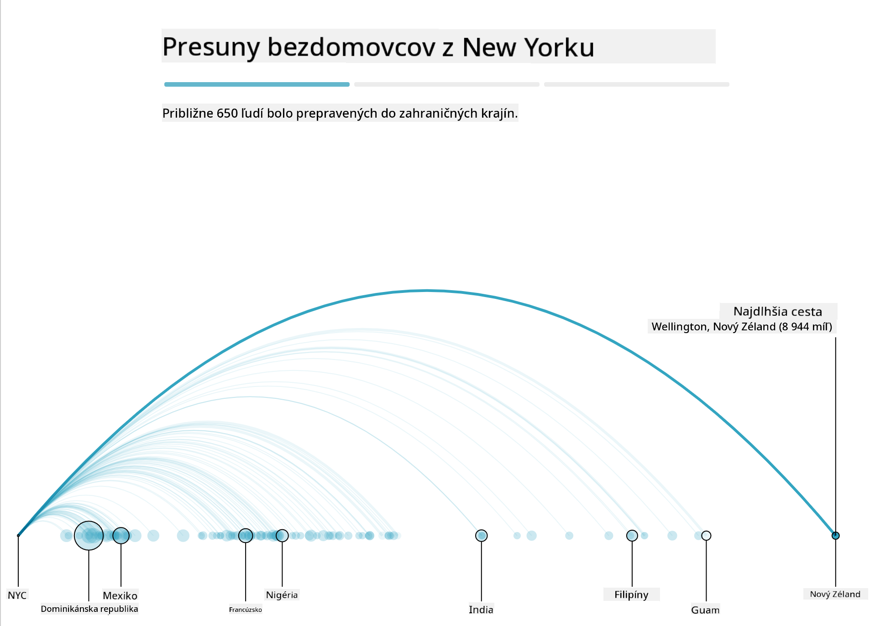
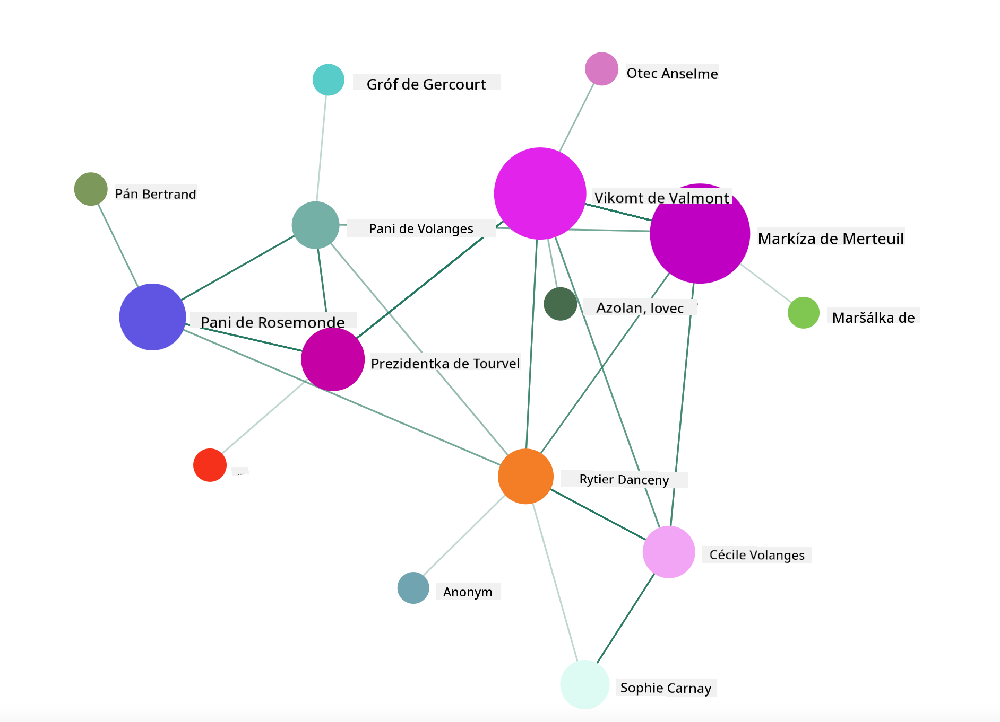

<!--
CO_OP_TRANSLATOR_METADATA:
{
  "original_hash": "b4039f1c76548d144a0aee0bf28304ec",
  "translation_date": "2025-08-26T17:16:23+00:00",
  "source_file": "3-Data-Visualization/R/13-meaningful-vizualizations/README.md",
  "language_code": "sk"
}
-->
# Tvorba zmysluplných vizualizácií

| ](../../../sketchnotes/13-MeaningfulViz.png)|
|:---:|
| Zmysluplné vizualizácie - _Sketchnote od [@nitya](https://twitter.com/nitya)_ |

> "Ak budete dáta mučiť dostatočne dlho, priznajú čokoľvek." -- [Ronald Coase](https://en.wikiquote.org/wiki/Ronald_Coase)

Jednou zo základných zručností dátového vedca je schopnosť vytvoriť zmysluplnú vizualizáciu dát, ktorá pomáha odpovedať na otázky, ktoré si kladiete. Predtým, než začnete dáta vizualizovať, je potrebné ich vyčistiť a pripraviť, ako ste to robili v predchádzajúcich lekciách. Potom môžete začať rozhodovať, ako najlepšie dáta prezentovať.

V tejto lekcii si prejdete:

1. Ako vybrať správny typ grafu
2. Ako sa vyhnúť zavádzajúcim grafom
3. Ako pracovať s farbami
4. Ako upraviť grafy pre lepšiu čitateľnosť
5. Ako vytvoriť animované alebo 3D grafy
6. Ako vytvoriť kreatívnu vizualizáciu

## [Kvíz pred lekciou](https://purple-hill-04aebfb03.1.azurestaticapps.net/quiz/24)

## Vyberte správny typ grafu

V predchádzajúcich lekciách ste experimentovali s vytváraním rôznych zaujímavých vizualizácií dát pomocou knižníc Matplotlib a Seaborn. Vo všeobecnosti môžete vybrať [správny typ grafu](https://chartio.com/learn/charts/how-to-select-a-data-vizualization/) pre otázku, ktorú si kladiete, pomocou tejto tabuľky:

| Potrebujete:               | Mali by ste použiť:            |
| -------------------------- | ----------------------------- |
| Ukázať trendy v čase       | Čiarový graf                  |
| Porovnať kategórie         | Stĺpcový, Koláčový graf       |
| Porovnať celkové hodnoty   | Koláčový, Stohovaný stĺpcový  |
| Ukázať vzťahy              | Bodový, Čiarový, Facet, Dual Line |
| Ukázať distribúcie         | Bodový, Histogram, Boxplot    |
| Ukázať proporcie           | Koláčový, Donut, Waffle       |

> ✅ V závislosti od štruktúry vašich dát môže byť potrebné ich previesť z textového na číselný formát, aby ste mohli použiť konkrétny typ grafu.

## Vyhnite sa zavádzaniu

Aj keď dátový vedec starostlivo vyberie správny graf pre správne dáta, existuje mnoho spôsobov, ako môžu byť dáta prezentované tak, aby podporili určitý názor, často na úkor samotných dát. Existuje veľa príkladov zavádzajúcich grafov a infografík!

[](https://www.youtube.com/watch?v=oX74Nge8Wkw "Ako grafy klamú")

> 🎥 Kliknite na obrázok vyššie pre konferenčný prejav o zavádzajúcich grafoch

Tento graf prevracia os X, aby ukázal opak pravdy na základe dátumu:



[Tento graf](https://media.firstcoastnews.com/assets/WTLV/images/170ae16f-4643-438f-b689-50d66ca6a8d8/170ae16f-4643-438f-b689-50d66ca6a8d8_1140x641.jpg) je ešte zavádzajúcejší, pretože oko je vedené k záveru, že počet prípadov COVID klesal v rôznych okresoch. Ak sa však pozriete bližšie na dátumy, zistíte, že boli preusporiadané, aby vytvorili tento zavádzajúci klesajúci trend.



Tento notoricky známy príklad používa farbu A prevrátenú os Y na zavádzanie: namiesto záveru, že počet úmrtí na strelné zbrane vzrástol po prijatí legislatívy podporujúcej zbrane, oko je oklamané, aby si myslelo opak:



Tento zvláštny graf ukazuje, ako môže byť proporcia manipulovaná, a to až do komického efektu:



Porovnávanie neporovnateľného je ďalší pochybný trik. Existuje [úžasná webová stránka](https://tylervigen.com/spurious-correlations) venovaná 'falošným koreláciám', ktorá zobrazuje 'fakty' korelujúce veci ako rozvodovosť v Maine a spotrebu margarínu. Skupina na Reddite tiež zbiera [škaredé použitia](https://www.reddit.com/r/dataisugly/top/?t=all) dát.

Je dôležité pochopiť, ako ľahko môže byť oko oklamané zavádzajúcimi grafmi. Aj keď má dátový vedec dobrý úmysel, výber zlého typu grafu, ako napríklad koláčového grafu s príliš veľa kategóriami, môže byť zavádzajúci.

## Farby

Ako ste videli na grafe 'Florida gun violence', farba môže poskytnúť ďalšiu vrstvu významu grafom, najmä tým, ktoré nie sú navrhnuté pomocou knižníc ako ggplot2 a RColorBrewer, ktoré obsahujú rôzne overené farebné knižnice a palety. Ak vytvárate graf ručne, trochu si naštudujte [teóriu farieb](https://colormatters.com/color-and-design/basic-color-theory).

> ✅ Pri navrhovaní grafov majte na pamäti, že prístupnosť je dôležitým aspektom vizualizácie. Niektorí vaši používatelia môžu byť farboslepí - zobrazuje sa váš graf dobre pre používateľov so zrakovým postihnutím?

Buďte opatrní pri výbere farieb pre váš graf, pretože farba môže niesť význam, ktorý ste nemali v úmysle. 'Ružové dámy' v grafe 'výška' vyššie nesú výrazne 'ženský' priradený význam, ktorý pridáva k bizarnosti samotného grafu.

Hoci [význam farieb](https://colormatters.com/color-symbolism/the-meanings-of-colors) sa môže líšiť v rôznych častiach sveta a má tendenciu meniť sa podľa odtieňa, vo všeobecnosti farby znamenajú:

| Farba  | Význam              |
| ------ | ------------------- |
| červená| sila                |
| modrá  | dôvera, lojalita    |
| žltá   | šťastie, opatrnosť  |
| zelená | ekológia, šťastie, závisť |
| fialová| šťastie             |
| oranžová| energia            |

Ak máte za úlohu vytvoriť graf s vlastnými farbami, uistite sa, že vaše grafy sú prístupné a farba, ktorú vyberiete, zodpovedá významu, ktorý sa snažíte sprostredkovať.

## Úprava grafov pre čitateľnosť

Grafy nie sú zmysluplné, ak nie sú čitateľné! Zvážte úpravu šírky a výšky grafu tak, aby dobre zodpovedali vašim dátam. Ak je potrebné zobraziť jednu premennú (napríklad všetkých 50 štátov), zobrazte ich vertikálne na osi Y, ak je to možné, aby ste sa vyhli horizontálnemu posúvaniu grafu.

Označte svoje osi, poskytnite legendu, ak je to potrebné, a ponúknite tooltipy pre lepšie pochopenie dát.

Ak sú vaše dáta textové a na osi X príliš dlhé, môžete text nakloniť pre lepšiu čitateľnosť. [plot3D](https://cran.r-project.org/web/packages/plot3D/index.html) ponúka 3D vykresľovanie, ak to vaše dáta podporujú. Pomocou neho je možné vytvoriť sofistikované vizualizácie dát.


## Animácia a 3D zobrazenie grafov

Niektoré z najlepších vizualizácií dát sú dnes animované. Shirley Wu vytvorila úžasné vizualizácie pomocou D3, ako napríklad '[film flowers](http://bl.ocks.org/sxywu/raw/d612c6c653fb8b4d7ff3d422be164a5d/)', kde každý kvet predstavuje vizualizáciu filmu. Ďalším príkladom pre Guardian je 'bussed out', interaktívny zážitok kombinujúci vizualizácie s Greensock a D3 spolu s článkom vo formáte scrollytelling, ktorý ukazuje, ako NYC rieši problém bezdomovcov tým, že ich presúva mimo mesta.



> "Bussed Out: Ako Amerika presúva svojich bezdomovcov" od [Guardian](https://www.theguardian.com/us-news/ng-interactive/2017/dec/20/bussed-out-america-moves-homeless-people-country-study). Vizualizácie od Nadieh Bremer & Shirley Wu

Hoci táto lekcia nie je dostatočne podrobná na to, aby vás naučila tieto výkonné knižnice na vizualizáciu, skúste si vyskúšať D3 v aplikácii Vue.js pomocou knižnice na zobrazenie vizualizácie knihy "Nebezpečné známosti" ako animovanej sociálnej siete.

> "Les Liaisons Dangereuses" je epistolárny román, teda román prezentovaný ako séria listov. Napísaný v roku 1782 Choderlosom de Laclos, rozpráva príbeh zákerných, morálne skazených spoločenských intríg dvoch hlavných postáv francúzskej aristokracie koncom 18. storočia, vikomta de Valmont a markízy de Merteuil. Obaja nakoniec zahynú, ale nie bez toho, aby spôsobili veľké spoločenské škody. Román sa odvíja ako séria listov písaných rôznym ľuďom v ich kruhoch, plánujúcich pomstu alebo jednoducho spôsobujúcich problémy. Vytvorte vizualizáciu týchto listov, aby ste objavili hlavných aktérov príbehu vizuálne.

Dokončíte webovú aplikáciu, ktorá zobrazí animovaný pohľad na túto sociálnu sieť. Používa knižnicu, ktorá bola vytvorená na [vizualizáciu siete](https://github.com/emiliorizzo/vue-d3-network) pomocou Vue.js a D3. Keď aplikácia beží, môžete uzly na obrazovke presúvať a meniť usporiadanie dát.



## Projekt: Vytvorte graf na zobrazenie siete pomocou D3.js

> Tento priečinok lekcie obsahuje priečinok `solution`, kde nájdete dokončený projekt pre vašu referenciu.

1. Postupujte podľa pokynov v súbore README.md v koreňovom priečinku priečinka starter. Uistite sa, že máte na svojom zariadení nainštalované NPM a Node.js pred inštaláciou závislostí projektu.

2. Otvorte priečinok `starter/src`. Nájdete priečinok `assets`, kde je .json súbor so všetkými listami z románu, očíslovanými, s anotáciami 'to' a 'from'.

3. Dokončite kód v `components/Nodes.vue`, aby ste umožnili vizualizáciu. Nájdite metódu s názvom `createLinks()` a pridajte nasledujúcu vnorenú slučku.

Prejdite objekt .json, aby ste zachytili údaje 'to' a 'from' pre listy a vytvorili objekt `links`, ktorý môže knižnica na vizualizáciu použiť:

```javascript
//loop through letters
      let f = 0;
      let t = 0;
      for (var i = 0; i < letters.length; i++) {
          for (var j = 0; j < characters.length; j++) {
              
            if (characters[j] == letters[i].from) {
              f = j;
            }
            if (characters[j] == letters[i].to) {
              t = j;
            }
        }
        this.links.push({ sid: f, tid: t });
      }
  ```

Spustite svoju aplikáciu z terminálu (npm run serve) a užite si vizualizáciu!

## 🚀 Výzva

Prejdite si internet a objavte zavádzajúce vizualizácie. Ako autor klame používateľa a je to úmyselné? Skúste opraviť vizualizácie, aby ste ukázali, ako by mali vyzerať.

## [Kvíz po lekcii](https://purple-hill-04aebfb03.1.azurestaticapps.net/quiz/25)

## Prehľad a samoštúdium

Tu sú niektoré články na prečítanie o zavádzajúcich vizualizáciách dát:

https://gizmodo.com/how-to-lie-with-data-visualization-1563576606

http://ixd.prattsi.org/2017/12/visual-lies-usability-in-deceptive-data-visualizations/

Pozrite si tieto zaujímavé vizualizácie historických artefaktov:

https://handbook.pubpub.org/

Prečítajte si tento článok o tom, ako animácia môže zlepšiť vaše vizualizácie:

https://medium.com/@EvanSinar/use-animation-to-supercharge-data-visualization-cd905a882ad4

## Zadanie

[Vytvorte si vlastnú vizualizáciu](assignment.md)

---

**Upozornenie**:  
Tento dokument bol preložený pomocou služby AI prekladu [Co-op Translator](https://github.com/Azure/co-op-translator). Hoci sa snažíme o presnosť, prosím, berte na vedomie, že automatizované preklady môžu obsahovať chyby alebo nepresnosti. Pôvodný dokument v jeho rodnom jazyku by mal byť považovaný za autoritatívny zdroj. Pre kritické informácie sa odporúča profesionálny ľudský preklad. Nie sme zodpovední za akékoľvek nedorozumenia alebo nesprávne interpretácie vyplývajúce z použitia tohto prekladu.