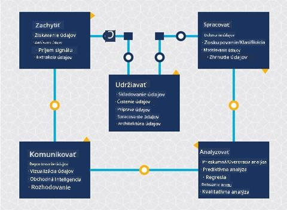
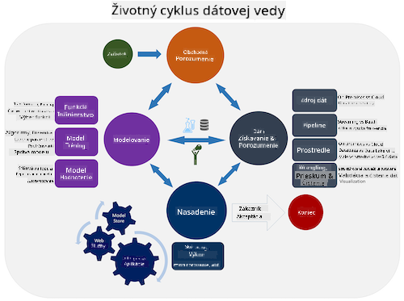
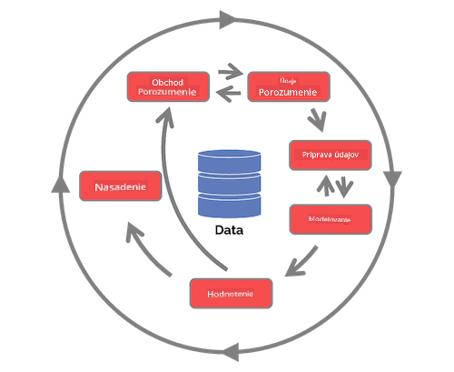

<!--
CO_OP_TRANSLATOR_METADATA:
{
  "original_hash": "c368f8f2506fe56bca0f7be05c4eb71d",
  "translation_date": "2025-08-26T16:24:43+00:00",
  "source_file": "4-Data-Science-Lifecycle/14-Introduction/README.md",
  "language_code": "sk"
}
-->
# Úvod do životného cyklu dátovej vedy

| ](../../sketchnotes/14-DataScience-Lifecycle.png)|
|:---:|
| Úvod do životného cyklu dátovej vedy - _Sketchnote od [@nitya](https://twitter.com/nitya)_ |

## [Kvíz pred prednáškou](https://red-water-0103e7a0f.azurestaticapps.net/quiz/26)

V tomto bode ste si pravdepodobne uvedomili, že dátová veda je proces. Tento proces možno rozdeliť do 5 fáz:

- Zber
- Spracovanie
- Analýza
- Komunikácia
- Údržba

Táto lekcia sa zameriava na 3 časti životného cyklu: zber, spracovanie a údržbu.

  
> Foto od [Berkeley School of Information](https://ischoolonline.berkeley.edu/data-science/what-is-data-science/)

## Zber

Prvá fáza životného cyklu je veľmi dôležitá, pretože na nej závisia ďalšie fázy. Prakticky ide o dve fázy spojené do jednej: získavanie dát a definovanie účelu a problémov, ktoré je potrebné riešiť.  
Definovanie cieľov projektu si vyžaduje hlbší kontext problému alebo otázky. Najprv musíme identifikovať a osloviť tých, ktorí potrebujú vyriešiť svoj problém. Môžu to byť zainteresované strany v podniku alebo sponzori projektu, ktorí môžu pomôcť identifikovať, kto alebo čo bude mať z projektu úžitok, ako aj čo a prečo to potrebujú. Dobre definovaný cieľ by mal byť merateľný a kvantifikovateľný, aby bolo možné definovať prijateľný výsledok.

Otázky, ktoré si môže dátový vedec položiť:
- Bol tento problém už niekedy riešený? Čo sa zistilo?
- Rozumejú všetci zúčastnení účelu a cieľu?
- Existuje nejasnosť a ako ju znížiť?
- Aké sú obmedzenia?
- Ako by mohol vyzerať konečný výsledok?
- Koľko zdrojov (čas, ľudia, výpočtová kapacita) je k dispozícii?

Ďalším krokom je identifikácia, zber a nakoniec preskúmanie dát potrebných na dosiahnutie týchto definovaných cieľov. V tomto kroku získavania musia dátoví vedci tiež vyhodnotiť množstvo a kvalitu dát. To si vyžaduje určitý prieskum dát, aby sa potvrdilo, že získané dáta podporia dosiahnutie požadovaného výsledku.

Otázky, ktoré si môže dátový vedec položiť o dátach:
- Aké dáta už mám k dispozícii?
- Kto vlastní tieto dáta?
- Aké sú obavy týkajúce sa ochrany súkromia?
- Mám dostatok dát na vyriešenie tohto problému?
- Sú dáta dostatočnej kvality pre tento problém?
- Ak objavím ďalšie informácie prostredníctvom týchto dát, mali by sme zvážiť zmenu alebo predefinovanie cieľov?

## Spracovanie

Fáza spracovania životného cyklu sa zameriava na objavovanie vzorcov v dátach a modelovanie. Niektoré techniky používané v tejto fáze vyžadujú štatistické metódy na odhalenie vzorcov. Typicky by to bola únavná úloha pre človeka pri práci s veľkým dátovým súborom, preto sa spoliehame na počítače, ktoré urýchlia proces. Táto fáza je tiež miestom, kde sa dátová veda a strojové učenie prelínajú. Ako ste sa naučili v prvej lekcii, strojové učenie je proces budovania modelov na pochopenie dát. Modely predstavujú vzťah medzi premennými v dátach, ktoré pomáhajú predpovedať výsledky.

Bežné techniky používané v tejto fáze sú pokryté v učebných materiáloch o strojovom učení. Nasledujte odkazy, aby ste sa o nich dozvedeli viac:

- [Klasifikácia](https://github.com/microsoft/ML-For-Beginners/tree/main/4-Classification): Organizovanie dát do kategórií pre efektívnejšie využitie.
- [Zhlukovanie](https://github.com/microsoft/ML-For-Beginners/tree/main/5-Clustering): Zoskupovanie dát do podobných skupín.
- [Regresia](https://github.com/microsoft/ML-For-Beginners/tree/main/2-Regression): Určenie vzťahov medzi premennými na predpovedanie alebo prognózovanie hodnôt.

## Údržba

Na diagrame životného cyklu ste si mohli všimnúť, že údržba sa nachádza medzi zberom a spracovaním. Údržba je nepretržitý proces spravovania, ukladania a zabezpečovania dát počas celého procesu projektu a mala by byť zohľadnená počas celej doby trvania projektu.

### Ukladanie dát
Úvahy o tom, ako a kde sú dáta uložené, môžu ovplyvniť náklady na ich ukladanie, ako aj výkon pri ich prístupe. Takéto rozhodnutia pravdepodobne neurobí dátový vedec sám, ale môže sa ocitnúť v situácii, keď bude musieť robiť rozhodnutia o tom, ako s dátami pracovať na základe spôsobu ich uloženia.

Tu sú niektoré aspekty moderných systémov na ukladanie dát, ktoré môžu ovplyvniť tieto rozhodnutia:

**On-premise vs off-premise vs verejný alebo súkromný cloud**

On-premise označuje hosťovanie a spravovanie dát na vlastnom zariadení, napríklad vlastnenie servera s pevnými diskami, ktoré ukladajú dáta, zatiaľ čo off-premise sa spolieha na zariadenia, ktoré nevlastníte, ako napríklad dátové centrum. Verejný cloud je populárnou voľbou na ukladanie dát, ktorá nevyžaduje znalosť toho, ako alebo kde presne sú dáta uložené, pričom verejný označuje jednotnú základnú infraštruktúru, ktorú zdieľajú všetci používatelia cloudu. Niektoré organizácie majú prísne bezpečnostné politiky, ktoré vyžadujú úplný prístup k zariadeniam, kde sú dáta hosťované, a spoliehajú sa na súkromný cloud, ktorý poskytuje vlastné cloudové služby. O dátach v cloude sa dozviete viac v [neskorších lekciách](https://github.com/microsoft/Data-Science-For-Beginners/tree/main/5-Data-Science-In-Cloud).

**Studené vs horúce dáta**

Pri trénovaní modelov môžete potrebovať viac tréningových dát. Ak ste spokojní so svojím modelom, prídu ďalšie dáta, aby model mohol plniť svoj účel. V každom prípade sa náklady na ukladanie a prístup k dátam zvýšia, keď ich budete zhromažďovať viac. Oddelenie zriedkavo používaných dát, známych ako studené dáta, od často prístupných horúcich dát môže byť lacnejšou možnosťou ukladania dát prostredníctvom hardvérových alebo softvérových služieb. Ak je potrebné pristúpiť k studeným dátam, môže to trvať o niečo dlhšie v porovnaní s horúcimi dátami.

### Spravovanie dát
Pri práci s dátami môžete zistiť, že niektoré dáta je potrebné vyčistiť pomocou techník pokrytých v lekcii zameranej na [prípravu dát](https://github.com/microsoft/Data-Science-For-Beginners/tree/main/2-Working-With-Data/08-data-preparation), aby ste mohli vytvárať presné modely. Keď prídu nové dáta, budú potrebovať rovnaké aplikácie na udržanie konzistencie v kvalite. Niektoré projekty budú zahŕňať použitie automatizovaného nástroja na čistenie, agregáciu a kompresiu predtým, ako sa dáta presunú na svoje konečné miesto. Príkladom jedného z týchto nástrojov je Azure Data Factory.

### Zabezpečenie dát
Jedným z hlavných cieľov zabezpečenia dát je zabezpečiť, aby tí, ktorí s nimi pracujú, mali kontrolu nad tým, čo sa zhromažďuje a v akom kontexte sa to používa. Udržiavanie dát v bezpečí zahŕňa obmedzenie prístupu len na tých, ktorí ho potrebujú, dodržiavanie miestnych zákonov a predpisov, ako aj udržiavanie etických štandardov, ako je uvedené v [lekcii o etike](https://github.com/microsoft/Data-Science-For-Beginners/tree/main/1-Introduction/02-ethics).

Tu sú niektoré kroky, ktoré môže tím podniknúť s ohľadom na bezpečnosť:
- Overiť, že všetky dáta sú šifrované
- Poskytnúť zákazníkom informácie o tom, ako sa ich dáta používajú
- Odobrať prístup k dátam tým, ktorí projekt opustili
- Povoliť len určitým členom projektu meniť dáta

## 🚀 Výzva

Existuje mnoho verzií životného cyklu dátovej vedy, kde každý krok môže mať rôzne názvy a počet fáz, ale bude obsahovať rovnaké procesy uvedené v tejto lekcii.

Preskúmajte [životný cyklus procesu tímovej dátovej vedy](https://docs.microsoft.com/en-us/azure/architecture/data-science-process/lifecycle) a [štandardný proces pre dolovanie dát naprieč odvetviami](https://www.datascience-pm.com/crisp-dm-2/). Pomenujte 3 podobnosti a rozdiely medzi nimi.

|Proces tímovej dátovej vedy (TDSP)|Štandardný proces pre dolovanie dát naprieč odvetviami (CRISP-DM)|
|--|--|
| |  |
| Obrázok od [Microsoft](https://docs.microsoft.comazure/architecture/data-science-process/lifecycle) | Obrázok od [Data Science Process Alliance](https://www.datascience-pm.com/crisp-dm-2/) |

## [Kvíz po prednáške](https://red-water-0103e7a0f.azurestaticapps.net/quiz/27)

## Prehľad a samoštúdium

Aplikovanie životného cyklu dátovej vedy zahŕňa viacero rolí a úloh, kde sa niektorí môžu zamerať na konkrétne časti každej fázy. Proces tímovej dátovej vedy poskytuje niekoľko zdrojov, ktoré vysvetľujú typy rolí a úloh, ktoré môže niekto v projekte mať.

* [Roly a úlohy v procese tímovej dátovej vedy](https://docs.microsoft.com/en-us/azure/architecture/data-science-process/roles-tasks)  
* [Vykonávanie úloh dátovej vedy: prieskum, modelovanie a nasadenie](https://docs.microsoft.com/en-us/azure/architecture/data-science-process/execute-data-science-tasks)

## Zadanie

[Hodnotenie dátového súboru](assignment.md)

---

**Upozornenie**:  
Tento dokument bol preložený pomocou služby AI prekladu [Co-op Translator](https://github.com/Azure/co-op-translator). Aj keď sa snažíme o presnosť, prosím, berte na vedomie, že automatizované preklady môžu obsahovať chyby alebo nepresnosti. Pôvodný dokument v jeho pôvodnom jazyku by mal byť považovaný za autoritatívny zdroj. Pre kritické informácie sa odporúča profesionálny ľudský preklad. Nie sme zodpovední za akékoľvek nedorozumenia alebo nesprávne interpretácie vyplývajúce z použitia tohto prekladu.