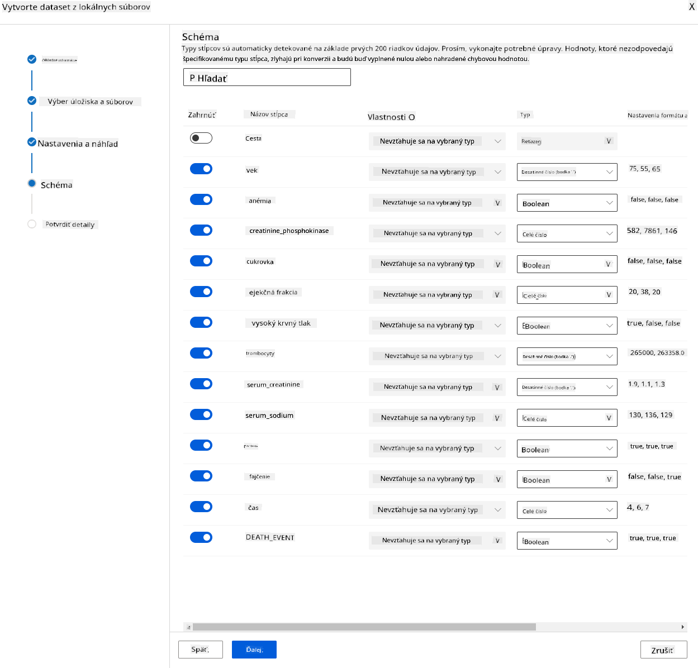

<!--
CO_OP_TRANSLATOR_METADATA:
{
  "original_hash": "14b2a7f1c63202920bd98eeb913f5614",
  "translation_date": "2025-08-26T15:58:22+00:00",
  "source_file": "5-Data-Science-In-Cloud/18-Low-Code/README.md",
  "language_code": "sk"
}
-->
# Data Science v cloude: Cesta "Low code/No code"

| ](../../sketchnotes/18-DataScience-Cloud.png)|
|:---:|
| Data Science v cloude: Low Code - _Sketchnote od [@nitya](https://twitter.com/nitya)_ |

Obsah:

- [Data Science v cloude: Cesta "Low code/No code"](../../../../5-Data-Science-In-Cloud/18-Low-Code)
  - [Kvíz pred prednáškou](../../../../5-Data-Science-In-Cloud/18-Low-Code)
  - [1. Úvod](../../../../5-Data-Science-In-Cloud/18-Low-Code)
    - [1.1 Čo je Azure Machine Learning?](../../../../5-Data-Science-In-Cloud/18-Low-Code)
    - [1.2 Projekt predikcie zlyhania srdca:](../../../../5-Data-Science-In-Cloud/18-Low-Code)
    - [1.3 Dataset pre zlyhanie srdca:](../../../../5-Data-Science-In-Cloud/18-Low-Code)
  - [2. Tréning modelu v Azure ML Studio pomocou Low code/No code](../../../../5-Data-Science-In-Cloud/18-Low-Code)
    - [2.1 Vytvorenie pracovného priestoru Azure ML](../../../../5-Data-Science-In-Cloud/18-Low-Code)
    - [2.2 Výpočtové zdroje](../../../../5-Data-Science-In-Cloud/18-Low-Code)
      - [2.2.1 Výber správnych možností pre vaše výpočtové zdroje](../../../../5-Data-Science-In-Cloud/18-Low-Code)
      - [2.2.2 Vytvorenie výpočtového klastru](../../../../5-Data-Science-In-Cloud/18-Low-Code)
    - [2.3 Načítanie datasetu](../../../../5-Data-Science-In-Cloud/18-Low-Code)
    - [2.4 Tréning pomocou AutoML s Low code/No code](../../../../5-Data-Science-In-Cloud/18-Low-Code)
  - [3. Nasadenie modelu a využitie endpointu pomocou Low code/No code](../../../../5-Data-Science-In-Cloud/18-Low-Code)
    - [3.1 Nasadenie modelu](../../../../5-Data-Science-In-Cloud/18-Low-Code)
    - [3.2 Využitie endpointu](../../../../5-Data-Science-In-Cloud/18-Low-Code)
  - [🚀 Výzva](../../../../5-Data-Science-In-Cloud/18-Low-Code)
  - [Kvíz po prednáške](../../../../5-Data-Science-In-Cloud/18-Low-Code)
  - [Revízia a samostatné štúdium](../../../../5-Data-Science-In-Cloud/18-Low-Code)
  - [Úloha](../../../../5-Data-Science-In-Cloud/18-Low-Code)

## [Kvíz pred prednáškou](https://purple-hill-04aebfb03.1.azurestaticapps.net/quiz/34)

## 1. Úvod

### 1.1 Čo je Azure Machine Learning?

Platforma Azure cloud obsahuje viac ako 200 produktov a cloudových služieb navrhnutých na to, aby vám pomohli priniesť nové riešenia k životu. Dátoví vedci vynakladajú veľa úsilia na skúmanie a predspracovanie dát a skúšanie rôznych typov algoritmov na tréning modelov, aby vytvorili presné modely. Tieto úlohy sú časovo náročné a často neefektívne využívajú drahý výpočtový hardvér.

[Azure ML](https://docs.microsoft.com/azure/machine-learning/overview-what-is-azure-machine-learning?WT.mc_id=academic-77958-bethanycheum&ocid=AID3041109) je cloudová platforma na vytváranie a prevádzkovanie riešení strojového učenia v Azure. Obsahuje širokú škálu funkcií a možností, ktoré pomáhajú dátovým vedcom pripravovať dáta, trénovať modely, publikovať prediktívne služby a monitorovať ich používanie. Najdôležitejšie je, že im pomáha zvýšiť efektivitu automatizáciou mnohých časovo náročných úloh spojených s tréningom modelov; a umožňuje im používať cloudové výpočtové zdroje, ktoré sa efektívne škálujú na spracovanie veľkých objemov dát, pričom náklady vznikajú iba pri ich skutočnom použití.

Azure ML poskytuje všetky nástroje, ktoré vývojári a dátoví vedci potrebujú pre svoje pracovné postupy strojového učenia. Patria sem:

- **Azure Machine Learning Studio**: webový portál v Azure Machine Learning pre možnosti tréningu modelov, nasadenia, automatizácie, sledovania a správy aktív s nízkym alebo žiadnym kódom. Studio sa integruje s Azure Machine Learning SDK pre bezproblémový zážitok.
- **Jupyter Notebooks**: rýchle prototypovanie a testovanie ML modelov.
- **Azure Machine Learning Designer**: umožňuje ťahanie a púšťanie modulov na vytváranie experimentov a následné nasadenie pipeline v prostredí s nízkym kódom.
- **Automatizované strojové učenie (AutoML)**: automatizuje iteratívne úlohy vývoja modelov strojového učenia, čo umožňuje vytvárať ML modely vo veľkom rozsahu, efektívne a produktívne, pričom sa zachováva kvalita modelu.
- **Označovanie dát**: asistovaný ML nástroj na automatické označovanie dát.
- **Rozšírenie strojového učenia pre Visual Studio Code**: poskytuje plnohodnotné vývojové prostredie na vytváranie a správu ML projektov.
- **CLI pre strojové učenie**: poskytuje príkazy na správu zdrojov Azure ML z príkazového riadku.
- **Integrácia s open-source frameworkmi** ako PyTorch, TensorFlow, Scikit-learn a mnohými ďalšími na tréning, nasadenie a správu celého procesu strojového učenia.
- **MLflow**: open-source knižnica na správu životného cyklu experimentov strojového učenia. **MLFlow Tracking** je komponent MLflow, ktorý zaznamenáva a sleduje metriky tréningových behov a artefakty modelov, bez ohľadu na prostredie vášho experimentu.

### 1.2 Projekt predikcie zlyhania srdca:

Niet pochýb o tom, že vytváranie a budovanie projektov je najlepší spôsob, ako otestovať svoje zručnosti a vedomosti. V tejto lekcii preskúmame dva rôzne spôsoby vytvárania projektu dátovej vedy na predikciu zlyhania srdca v Azure ML Studio, a to pomocou Low code/No code a pomocou Azure ML SDK, ako je znázornené na nasledujúcej schéme:


Každý spôsob má svoje výhody a nevýhody. Cesta Low code/No code je jednoduchšia na začiatok, pretože zahŕňa interakciu s grafickým používateľským rozhraním (GUI) a nevyžaduje predchádzajúce znalosti kódu. Táto metóda umožňuje rýchle testovanie životaschopnosti projektu a vytvorenie POC (Proof Of Concept). Avšak, keď projekt rastie a je potrebné ho pripraviť na produkciu, nie je praktické vytvárať zdroje cez GUI. Vtedy je nevyhnutné programovo automatizovať všetko, od vytvárania zdrojov až po nasadenie modelu. Tu sa stáva kľúčovým ovládanie Azure ML SDK.

|                   | Low code/No code | Azure ML SDK              |
|-------------------|------------------|---------------------------|
| Znalosť kódu      | Nie je potrebná  | Potrebná                  |
| Čas na vývoj      | Rýchly a jednoduchý | Závisí od znalostí kódu   |
| Pripravenosť na produkciu | Nie               | Áno                       |

### 1.3 Dataset pre zlyhanie srdca:

Kardiovaskulárne ochorenia (CVD) sú celosvetovo hlavnou príčinou úmrtí, pričom predstavujú 31 % všetkých úmrtí. Environmentálne a behaviorálne rizikové faktory, ako je používanie tabaku, nezdravá strava a obezita, fyzická nečinnosť a škodlivé používanie alkoholu, by mohli byť použité ako vlastnosti pre odhadové modely. Schopnosť odhadnúť pravdepodobnosť vývoja CVD by mohla byť veľmi užitočná na prevenciu útokov u ľudí s vysokým rizikom.

Kaggle sprístupnil verejne [dataset pre zlyhanie srdca](https://www.kaggle.com/andrewmvd/heart-failure-clinical-data), ktorý použijeme pre tento projekt. Dataset si môžete stiahnuť teraz. Ide o tabuľkový dataset s 13 stĺpcami (12 vlastností a 1 cieľová premenná) a 299 riadkami.

|    | Názov premennej          | Typ            | Popis                                                    | Príklad           |
|----|--------------------------|----------------|----------------------------------------------------------|-------------------|
| 1  | age                      | numerický      | vek pacienta                                             | 25                |
| 2  | anaemia                  | boolean        | Zníženie červených krviniek alebo hemoglobínu            | 0 alebo 1         |
| 3  | creatinine_phosphokinase | numerický      | Hladina enzýmu CPK v krvi                                | 542               |
| 4  | diabetes                 | boolean        | Či má pacient cukrovku                                   | 0 alebo 1         |
| 5  | ejection_fraction        | numerický      | Percento krvi opúšťajúcej srdce pri každej kontrakcii    | 45                |
| 6  | high_blood_pressure      | boolean        | Či má pacient hypertenziu                                | 0 alebo 1         |
| 7  | platelets                | numerický      | Počet krvných doštičiek v krvi                           | 149000            |
| 8  | serum_creatinine         | numerický      | Hladina sérového kreatinínu v krvi                       | 0.5               |
| 9  | serum_sodium             | numerický      | Hladina sérového sodíka v krvi                           | jun               |
| 10 | sex                      | boolean        | žena alebo muž                                           | 0 alebo 1         |
| 11 | smoking                  | boolean        | Či pacient fajčí                                         | 0 alebo 1         |
| 12 | time                     | numerický      | obdobie sledovania (dni)                                 | 4                 |
|----|--------------------------|----------------|----------------------------------------------------------|-------------------|
| 21 | DEATH_EVENT [Cieľ]       | boolean        | Či pacient zomrie počas obdobia sledovania               | 0 alebo 1         |

Keď máte dataset, môžeme začať projekt v Azure.

## 2. Tréning modelu v Azure ML Studio pomocou Low code/No code

### 2.1 Vytvorenie pracovného priestoru Azure ML

Na tréning modelu v Azure ML musíte najprv vytvoriť pracovný priestor Azure ML. Pracovný priestor je najvyššia úroveň zdroja pre Azure Machine Learning, ktorá poskytuje centralizované miesto na prácu so všetkými artefaktmi, ktoré vytvoríte pri používaní Azure Machine Learning. Pracovný priestor uchováva históriu všetkých tréningových behov vrátane logov, metrík, výstupov a snímok vašich skriptov. Tieto informácie používate na určenie, ktorý tréningový beh produkuje najlepší model. [Viac informácií](https://docs.microsoft.com/azure/machine-learning/concept-workspace?WT.mc_id=academic-77958-bethanycheum&ocid=AID3041109)

Odporúča sa používať najaktuálnejší prehliadač kompatibilný s vaším operačným systémom. Podporované sú nasledujúce prehliadače:

- Microsoft Edge (nový Microsoft Edge, najnovšia verzia. Nie Microsoft Edge legacy)
- Safari (najnovšia verzia, iba Mac)
- Chrome (najnovšia verzia)
- Firefox (najnovšia verzia)

Na používanie Azure Machine Learning vytvorte pracovný priestor vo vašom predplatnom Azure. Tento pracovný priestor potom môžete použiť na správu dát, výpočtových zdrojov, kódu, modelov a ďalších artefaktov súvisiacich s vašimi pracovnými záťažami strojového učenia.

> **_POZNÁMKA:_** Vaše predplatné Azure bude účtované malou sumou za ukladanie dát, pokiaľ pracovný priestor Azure Machine Learning existuje vo vašom predplatnom, preto odporúčame odstrániť pracovný priestor Azure Machine Learning, keď ho už nepoužívate.

1. Prihláste sa do [portálu Azure](https://ms.portal.azure.com/) pomocou prihlasovacích údajov Microsoft spojených s vaším predplatným Azure.
2. Vyberte **＋Vytvoriť zdroj**
   
   

   Vyhľadajte Machine Learning a vyberte dlaždicu Machine Learning.

   

   Kliknite na tlačidlo vytvoriť.

   

   Vyplňte nastavenia nasledovne:
   - Predplatné: Vaše predplatné Azure
   - Skupina zdrojov: Vytvorte alebo vyberte skupinu zdrojov
   - Názov pracovného priestoru: Zadajte jedinečný názov pre váš pracovný priestor
   - Región: Vyberte geografický región najbližší k vám
   - Účet úložiska: Poznámka o predvolenom novom účte úložiska, ktorý bude vytvorený pre váš pracovný priestor
   - Key vault: Poznámka o predvolenom novom key vault, ktorý bude vytvorený pre váš pracovný priestor
   - Application insights: Poznámka o predvolenom novom zdroji Application Insights, ktorý bude vytvorený pre váš pracovný priestor
   - Kontajnerový register: Žiadny (jeden bude automaticky vytvorený pri prvom nasadení modelu do kontajnera)

    

   - Kliknite na tlačidlo vytvoriť + preskúmať a potom na tlačidlo vytvoriť.
3. Počkajte, kým sa váš pracovný priestor vytvorí (môže to trvať niekoľko minút). Potom do neho prejdite v portáli. Nájdete ho cez službu Machine Learning Azure.
4. Na stránke Prehľad vášho pracovného priestoru spustite Azure Machine Learning Studio (alebo otvorte novú kartu prehliadača a prejdite na https://ml.azure.com) a prihláste sa do Azure Machine Learning Studio pomocou vášho účtu Microsoft. Ak budete vyzvaní, vyberte váš adresár a predplatné Azure a váš pracovný priestor Azure Machine Learning.
   


5. V Azure Machine Learning Studio prepnite ikonu ☰ v ľavom hornom rohu na zobrazenie rôznych stránok v rozhraní. Tieto stránky môžete použiť na správu zdrojov vo vašom pracovnom priestore.


Pracovný priestor môžete spravovať pomocou portálu Azure, ale pre dátových vedcov a inžinierov prevádzky strojového učenia poskytuje Azure Machine Learning Studio viac zamerané používateľské rozhranie na správu zdrojov pracovného priestoru.

### 2.2 Výpočtové zdroje

Výpočtové zdroje sú cloudové zdroje, na ktorých môžete spúšťať procesy tréningu modelov a skúmania dát. Existujú štyri druhy výpočtových zdrojov, ktoré môžete vytvoriť:

- **Výpočtové inštancie**: Vývojové pracovné stanice, ktoré môžu dátoví vedci používať na prácu s dátami a modelmi. To zahŕňa vytvorenie virtuálneho stroja (VM) a spustenie inštancie notebooku. Potom môžete trénovať model volaním výpočtového klastru z notebooku.
- **Výpočtové klastry**: Škálovateľné klastry VM na spracovanie experimentálneho kódu na požiadanie. Budete ich potrebovať pri tréningu modelu. Výpočtové klastry môžu tiež využívať špecializované GPU alebo CPU zdroje.
- **Inferenčné klastry**: Ciele nasadenia pre prediktívne služby, ktoré používajú vaše trénované modely.
- **Pripojený výpočet**: Odkazy na existujúce výpočtové zdroje Azure, ako sú virtuálne počítače alebo klastre Azure Databricks.

#### 2.2.1 Výber správnych možností pre vaše výpočtové zdroje

Pri vytváraní výpočtového zdroja je potrebné zvážiť niekoľko kľúčových faktorov, ktoré môžu byť kritickými rozhodnutiami.

**Potrebujete CPU alebo GPU?**

CPU (centrálna procesorová jednotka) je elektronický obvod, ktorý vykonáva inštrukcie tvoriace počítačový program. GPU (grafická procesorová jednotka) je špecializovaný elektronický obvod, ktorý dokáže vykonávať graficky orientovaný kód veľmi vysokou rýchlosťou.

Hlavný rozdiel medzi architektúrou CPU a GPU je v tom, že CPU je navrhnuté na rýchle zvládanie širokého spektra úloh (merané rýchlosťou hodín CPU), ale má obmedzenú súbežnosť úloh, ktoré môžu bežať. GPU sú navrhnuté na paralelné výpočty, a preto sú oveľa lepšie na úlohy hlbokého učenia.

| CPU                                     | GPU                         |
|-----------------------------------------|-----------------------------|
| Menej nákladné                          | Viac nákladné               |
| Nižšia úroveň súbežnosti                | Vyššia úroveň súbežnosti    |
| Pomalšie pri trénovaní modelov hlbokého učenia | Optimálne pre hlboké učenie |

**Veľkosť klastra**

Väčšie klastre sú drahšie, ale zabezpečia lepšiu odozvu. Preto, ak máte čas, ale obmedzený rozpočet, mali by ste začať s menším klastrom. Naopak, ak máte dostatok financií, ale málo času, mali by ste začať s väčším klastrom.

**Veľkosť virtuálneho počítača (VM)**

V závislosti od vašich časových a rozpočtových obmedzení môžete meniť veľkosť RAM, disku, počet jadier a rýchlosť hodín. Zvýšenie všetkých týchto parametrov bude drahšie, ale zabezpečí lepší výkon.

**Dedikované alebo nízko-prioritné inštancie?**

Nízko-prioritná inštancia znamená, že je prerušiteľná: v podstate, Microsoft Azure môže tieto zdroje odobrať a priradiť ich inej úlohe, čím preruší vašu prácu. Dedikovaná inštancia, alebo neprerušiteľná, znamená, že úloha nebude nikdy ukončená bez vášho povolenia. Toto je ďalší aspekt rozhodovania medzi časom a peniazmi, pretože prerušiteľné inštancie sú lacnejšie ako dedikované.

#### 2.2.2 Vytvorenie výpočtového klastra

V [Azure ML pracovnom priestore](https://ml.azure.com/), ktorý sme vytvorili skôr, prejdite na výpočty a budete môcť vidieť rôzne výpočtové zdroje, o ktorých sme práve hovorili (t.j. výpočtové inštancie, výpočtové klastre, inferenčné klastre a pripojené výpočty). Pre tento projekt budeme potrebovať výpočtový klaster na trénovanie modelu. V Studio kliknite na menu "Compute", potom na kartu "Compute cluster" a kliknite na tlačidlo "+ New" na vytvorenie výpočtového klastra.


1. Vyberte svoje možnosti: Dedikované vs Nízko-prioritné, CPU alebo GPU, veľkosť VM a počet jadier (pre tento projekt môžete ponechať predvolené nastavenia).
2. Kliknite na tlačidlo Next.


3. Dajte klastru názov.
4. Vyberte svoje možnosti: Minimálny/Maximálny počet uzlov, čas nečinnosti pred zmenšením, prístup SSH. Upozorňujeme, že ak je minimálny počet uzlov 0, ušetríte peniaze, keď je klaster nečinný. Upozorňujeme, že čím vyšší je maximálny počet uzlov, tým kratšie bude trénovanie. Odporúčaný maximálny počet uzlov je 3.
5. Kliknite na tlačidlo "Create". Tento krok môže trvať niekoľko minút.


Skvelé! Teraz, keď máme výpočtový klaster, musíme nahrať dáta do Azure ML Studio.

### 2.3 Nahrávanie datasetu

1. V [Azure ML pracovnom priestore](https://ml.azure.com/), ktorý sme vytvorili skôr, kliknite na "Datasets" v ľavom menu a kliknite na tlačidlo "+ Create dataset" na vytvorenie datasetu. Vyberte možnosť "From local files" a vyberte Kaggle dataset, ktorý sme stiahli skôr.

   

2. Dajte datasetu názov, typ a popis. Kliknite na Next. Nahrajte dáta zo súborov. Kliknite na Next.

   

3. V schéme zmeňte dátový typ na Boolean pre nasledujúce vlastnosti: anaemia, diabetes, high blood pressure, sex, smoking a DEATH_EVENT. Kliknite na Next a potom na Create.

   

Výborne! Teraz, keď je dataset pripravený a výpočtový klaster vytvorený, môžeme začať trénovanie modelu!

### 2.4 Trénovanie s nízkym kódom/bez kódu pomocou AutoML

Tradičný vývoj modelov strojového učenia je náročný na zdroje, vyžaduje si významné znalosti domény a čas na vytvorenie a porovnanie desiatok modelov. Automatizované strojové učenie (AutoML) je proces automatizácie časovo náročných, iteratívnych úloh vývoja modelov strojového učenia. Umožňuje dátovým vedcom, analytikom a vývojárom vytvárať ML modely vo veľkom rozsahu, efektívne a produktívne, pričom zachováva kvalitu modelov. Skracuje čas potrebný na získanie produkčne pripravených ML modelov s veľkou ľahkosťou a efektívnosťou. [Viac informácií](https://docs.microsoft.com/azure/machine-learning/concept-automated-ml?WT.mc_id=academic-77958-bethanycheum&ocid=AID3041109)

1. V [Azure ML pracovnom priestore](https://ml.azure.com/), ktorý sme vytvorili skôr, kliknite na "Automated ML" v ľavom menu a vyberte dataset, ktorý ste práve nahrali. Kliknite na Next.

   

2. Zadajte nový názov experimentu, cieľový stĺpec (DEATH_EVENT) a výpočtový klaster, ktorý sme vytvorili. Kliknite na Next.

   

3. Vyberte "Classification" a kliknite na Finish. Tento krok môže trvať 30 minút až 1 hodinu, v závislosti od veľkosti vášho výpočtového klastra.

   

4. Po dokončení behu kliknite na kartu "Automated ML", kliknite na váš beh a potom na algoritmus v karte "Best model summary".

   

Tu môžete vidieť podrobný popis najlepšieho modelu, ktorý AutoML vygeneroval. Môžete tiež preskúmať ďalšie modely v karte Models. Venujte niekoľko minút preskúmaniu modelov v sekcii Explanations (preview). Keď si vyberiete model, ktorý chcete použiť (tu vyberieme najlepší model vybraný AutoML), uvidíme, ako ho môžeme nasadiť.

## 3. Nasadenie modelu s nízkym kódom/bez kódu a spotreba endpointu
### 3.1 Nasadenie modelu

Rozhranie automatizovaného strojového učenia umožňuje nasadiť najlepší model ako webovú službu v niekoľkých krokoch. Nasadenie je integrácia modelu tak, aby mohol robiť predpovede na základe nových údajov a identifikovať potenciálne oblasti príležitostí. Pre tento projekt nasadenie do webovej služby znamená, že medicínske aplikácie budú môcť využívať model na živé predpovede rizika srdcového infarktu u pacientov.

V popise najlepšieho modelu kliknite na tlačidlo "Deploy".


15. Dajte mu názov, popis, typ výpočtu (Azure Container Instance), povolte autentifikáciu a kliknite na Deploy. Tento krok môže trvať približne 20 minút. Proces nasadenia zahŕňa niekoľko krokov vrátane registrácie modelu, generovania zdrojov a ich konfigurácie pre webovú službu. Stavová správa sa zobrazí pod stavom nasadenia. Pravidelne klikajte na Refresh, aby ste skontrolovali stav nasadenia. Je nasadený a spustený, keď je stav "Healthy".


16. Po nasadení kliknite na kartu Endpoint a kliknite na endpoint, ktorý ste práve nasadili. Tu nájdete všetky podrobnosti, ktoré potrebujete vedieť o endpointe.


Úžasné! Teraz, keď máme model nasadený, môžeme začať so spotrebou endpointu.

### 3.2 Spotreba endpointu

Kliknite na kartu "Consume". Tu nájdete REST endpoint a python skript v možnosti spotreby. Venujte chvíľu čítaniu python kódu.

Tento skript môžete spustiť priamo z vášho lokálneho počítača a bude spotrebovávať váš endpoint.


Venujte chvíľu kontrole týchto dvoch riadkov kódu:

```python
url = 'http://98e3715f-xxxx-xxxx-xxxx-9ec22d57b796.centralus.azurecontainer.io/score'
api_key = '' # Replace this with the API key for the web service
```
Premenná `url` je REST endpoint nájdený v karte consume a premenná `api_key` je primárny kľúč tiež nájdený v karte consume (iba v prípade, že ste povolili autentifikáciu). Takto môže skript spotrebovávať endpoint.

18. Po spustení skriptu by ste mali vidieť nasledujúci výstup:
    ```python
    b'"{\\"result\\": [true]}"'
    ```
To znamená, že predpoveď srdcového zlyhania pre zadané údaje je pravdivá. To dáva zmysel, pretože ak sa pozriete bližšie na údaje automaticky generované v skripte, všetko je predvolene nastavené na 0 a false. Môžete zmeniť údaje na nasledujúci vzor vstupu:

```python
data = {
    "data":
    [
        {
            'age': "0",
            'anaemia': "false",
            'creatinine_phosphokinase': "0",
            'diabetes': "false",
            'ejection_fraction': "0",
            'high_blood_pressure': "false",
            'platelets': "0",
            'serum_creatinine': "0",
            'serum_sodium': "0",
            'sex': "false",
            'smoking': "false",
            'time': "0",
        },
        {
            'age': "60",
            'anaemia': "false",
            'creatinine_phosphokinase': "500",
            'diabetes': "false",
            'ejection_fraction': "38",
            'high_blood_pressure': "false",
            'platelets': "260000",
            'serum_creatinine': "1.40",
            'serum_sodium': "137",
            'sex': "false",
            'smoking': "false",
            'time': "130",
        },
    ],
}
```
Skript by mal vrátiť:
    ```python
    b'"{\\"result\\": [true, false]}"'
    ```

Gratulujeme! Práve ste spotrebovali model nasadený a trénovaný na Azure ML!

> **_POZNÁMKA:_** Po dokončení projektu nezabudnite odstrániť všetky zdroje.
## 🚀 Výzva

Pozorne si prezrite vysvetlenia modelu a podrobnosti, ktoré AutoML vygeneroval pre najlepšie modely. Pokúste sa pochopiť, prečo je najlepší model lepší ako ostatné. Aké algoritmy boli porovnávané? Aké sú medzi nimi rozdiely? Prečo je najlepší model v tomto prípade výkonnejší?

## [Kvíz po prednáške](https://purple-hill-04aebfb03.1.azurestaticapps.net/quiz/35)

## Prehľad a samoštúdium

V tejto lekcii ste sa naučili, ako trénovať, nasadiť a spotrebovať model na predpovedanie rizika srdcového zlyhania s nízkym kódom/bez kódu v cloude. Ak ste to ešte neurobili, ponorte sa hlbšie do vysvetlení modelu, ktoré AutoML vygeneroval pre najlepšie modely, a pokúste sa pochopiť, prečo je najlepší model lepší ako ostatné.

Môžete ísť ďalej do oblasti nízkeho kódu/bez kódu AutoML čítaním tejto [dokumentácie](https://docs.microsoft.com/azure/machine-learning/tutorial-first-experiment-automated-ml?WT.mc_id=academic-77958-bethanycheum&ocid=AID3041109).

## Zadanie

[Projekt dátovej vedy s nízkym kódom/bez kódu na Azure ML](assignment.md)

---

**Upozornenie**:  
Tento dokument bol preložený pomocou služby AI prekladu [Co-op Translator](https://github.com/Azure/co-op-translator). Aj keď sa snažíme o presnosť, prosím, berte na vedomie, že automatizované preklady môžu obsahovať chyby alebo nepresnosti. Pôvodný dokument v jeho pôvodnom jazyku by mal byť považovaný za autoritatívny zdroj. Pre kritické informácie sa odporúča profesionálny ľudský preklad. Nie sme zodpovední za akékoľvek nedorozumenia alebo nesprávne interpretácie vyplývajúce z použitia tohto prekladu.