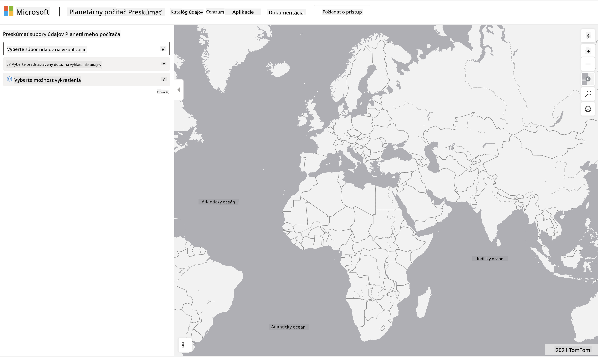

<!--
CO_OP_TRANSLATOR_METADATA:
{
  "original_hash": "d1e05715f9d97de6c4f1fb0c5a4702c0",
  "translation_date": "2025-08-26T15:51:58+00:00",
  "source_file": "6-Data-Science-In-Wild/20-Real-World-Examples/assignment.md",
  "language_code": "sk"
}
-->
# Preskúmajte dataset Planetary Computer

## Pokyny

V tejto lekcii sme hovorili o rôznych aplikačných oblastiach dátovej vedy – s podrobnými príkladmi týkajúcimi sa výskumu, udržateľnosti a digitálnych humanitných vied. V tejto úlohe preskúmate jeden z týchto príkladov podrobnejšie a aplikujete niektoré z vašich poznatkov o vizualizáciách a analýze dát, aby ste získali poznatky o údajoch týkajúcich sa udržateľnosti.

Projekt [Planetary Computer](https://planetarycomputer.microsoft.com/) obsahuje datasety a API, ku ktorým je možné získať prístup pomocou účtu – požiadajte o prístup, ak chcete vyskúšať bonusový krok úlohy. Stránka tiež poskytuje funkciu [Explorer](https://planetarycomputer.microsoft.com/explore), ktorú môžete použiť bez vytvorenia účtu.

`Kroky:`
Rozhranie Explorer (zobrazené na snímke obrazovky nižšie) vám umožňuje vybrať dataset (z dostupných možností), prednastavený dotaz (na filtrovanie údajov) a možnosť vykreslenia (na vytvorenie relevantnej vizualizácie). Vašou úlohou v tejto úlohe je:

 1. Prečítajte si [dokumentáciu Explorer](https://planetarycomputer.microsoft.com/docs/overview/explorer/) – pochopte možnosti.
 2. Preskúmajte dataset [Katalóg](https://planetarycomputer.microsoft.com/catalog) – zistite účel každého datasetu.
 3. Použite Explorer – vyberte dataset, ktorý vás zaujíma, zvoľte relevantný dotaz a možnosť vykreslenia.

`Vaša úloha:`
Teraz preskúmajte vizualizáciu, ktorá sa zobrazí v prehliadači, a odpovedzte na nasledujúce otázky:
 * Aké _vlastnosti_ má dataset?
 * Aké _poznatky_ alebo výsledky poskytuje vizualizácia?
 * Aké sú _dôsledky_ týchto poznatkov pre ciele udržateľnosti projektu?
 * Aké sú _obmedzenia_ vizualizácie (t. j. aké poznatky ste nezískali)?
 * Ak by ste mali prístup k surovým údajom, aké _alternatívne vizualizácie_ by ste vytvorili a prečo?

`Bonusové body:`
Požiadajte o účet – a prihláste sa po jeho schválení.
 * Použite možnosť _Launch Hub_ na otvorenie surových údajov v Notebooku.
 * Preskúmajte údaje interaktívne a implementujte alternatívne vizualizácie, ktoré ste si predstavili.
 * Teraz analyzujte svoje vlastné vizualizácie – podarilo sa vám získať poznatky, ktoré vám predtým chýbali?

## Hodnotiace kritériá

Vynikajúce | Dostatočné | Potrebuje zlepšenie
--- | --- | -- |
Všetkých päť hlavných otázok bolo zodpovedaných. Študent jasne identifikoval, ako aktuálne a alternatívne vizualizácie môžu poskytnúť poznatky o cieľoch alebo výsledkoch udržateľnosti.| Študent odpovedal aspoň na prvé tri otázky podrobne, čo ukazuje, že mal praktické skúsenosti s Explorerom. | Študent nezodpovedal viaceré otázky alebo poskytol nedostatočné detaily – čo naznačuje, že nebol urobený zmysluplný pokus o splnenie úlohy |

---

**Upozornenie**:  
Tento dokument bol preložený pomocou služby AI prekladu [Co-op Translator](https://github.com/Azure/co-op-translator). Hoci sa snažíme o presnosť, prosím, berte na vedomie, že automatizované preklady môžu obsahovať chyby alebo nepresnosti. Pôvodný dokument v jeho rodnom jazyku by mal byť považovaný za autoritatívny zdroj. Pre kritické informácie sa odporúča profesionálny ľudský preklad. Nenesieme zodpovednosť za akékoľvek nedorozumenia alebo nesprávne interpretácie vyplývajúce z použitia tohto prekladu.