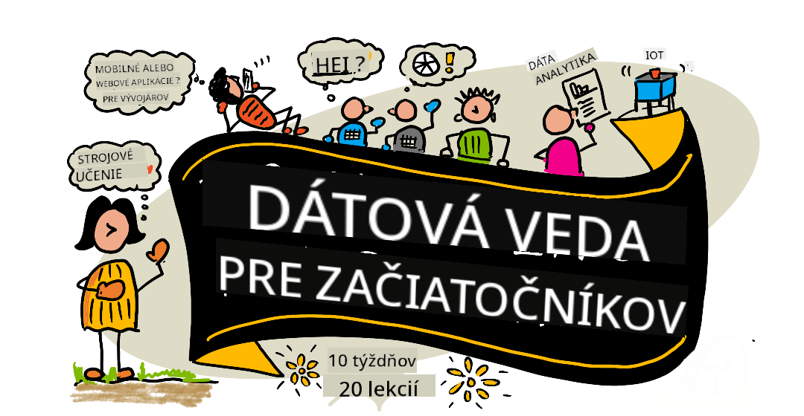

<!--
CO_OP_TRANSLATOR_METADATA:
{
  "original_hash": "26afff0d5c802e24a14f000c9c9f4614",
  "translation_date": "2025-11-18T17:54:23+00:00",
  "source_file": "README.md",
  "language_code": "sk"
}
-->
# Data Science pre začiatočníkov - Učebné osnovy

Azure Cloud Advocates v Microsofte s radosťou ponúkajú 10-týždňový, 20-lekciový kurz o Data Science. Každá lekcia obsahuje kvízy pred a po lekcii, písomné pokyny na dokončenie lekcie, riešenie a úlohu. Náš projektovo orientovaný prístup vám umožní učiť sa prostredníctvom tvorby, čo je osvedčený spôsob, ako si nové zručnosti lepšie osvojiť.

**Veľká vďaka našim autorom:** [Jasmine Greenaway](https://www.twitter.com/paladique), [Dmitry Soshnikov](http://soshnikov.com), [Nitya Narasimhan](https://twitter.com/nitya), [Jalen McGee](https://twitter.com/JalenMcG), [Jen Looper](https://twitter.com/jenlooper), [Maud Levy](https://twitter.com/maudstweets), [Tiffany Souterre](https://twitter.com/TiffanySouterre), [Christopher Harrison](https://www.twitter.com/geektrainer).

**🙏 Špeciálne poďakovanie 🙏 našim [Microsoft Student Ambassador](https://studentambassadors.microsoft.com/) autorom, recenzentom a prispievateľom obsahu,** najmä Aaryan Arora, [Aditya Garg](https://github.com/AdityaGarg00), [Alondra Sanchez](https://www.linkedin.com/in/alondra-sanchez-molina/), [Ankita Singh](https://www.linkedin.com/in/ankitasingh007), [Anupam Mishra](https://www.linkedin.com/in/anupam--mishra/), [Arpita Das](https://www.linkedin.com/in/arpitadas01/), ChhailBihari Dubey, [Dibri Nsofor](https://www.linkedin.com/in/dibrinsofor), [Dishita Bhasin](https://www.linkedin.com/in/dishita-bhasin-7065281bb), [Majd Safi](https://www.linkedin.com/in/majd-s/), [Max Blum](https://www.linkedin.com/in/max-blum-6036a1186/), [Miguel Correa](https://www.linkedin.com/in/miguelmque/), [Mohamma Iftekher (Iftu) Ebne Jalal](https://twitter.com/iftu119), [Nawrin Tabassum](https://www.linkedin.com/in/nawrin-tabassum), [Raymond Wangsa Putra](https://www.linkedin.com/in/raymond-wp/), [Rohit Yadav](https://www.linkedin.com/in/rty2423), Samridhi Sharma, [Sanya Sinha](https://www.linkedin.com/mwlite/in/sanya-sinha-13aab1200),
[Sheena Narula](https://www.linkedin.com/in/sheena-narua-n/), [Tauqeer Ahmad](https://www.linkedin.com/in/tauqeerahmad5201/), Yogendrasingh Pawar , [Vidushi Gupta](https://www.linkedin.com/in/vidushi-gupta07/), [Jasleen Sondhi](https://www.linkedin.com/in/jasleen-sondhi/)

||
|:---:|
| Data Science pre začiatočníkov - _Sketchnote od [@nitya](https://twitter.com/nitya)_ |

### 🌐 Podpora viacerých jazykov

#### Podporované prostredníctvom GitHub Action (Automatizované a vždy aktuálne)

[Arabčina](../ar/README.md) | [Bengálčina](../bn/README.md) | [Bulharčina](../bg/README.md) | [Barmčina (Myanmar)](../my/README.md) | [Čínština (zjednodušená)](../zh/README.md) | [Čínština (tradičná, Hongkong)](../hk/README.md) | [Čínština (tradičná, Macao)](../mo/README.md) | [Čínština (tradičná, Taiwan)](../tw/README.md) | [Chorvátčina](../hr/README.md) | [Čeština](../cs/README.md) | [Dánčina](../da/README.md) | [Holandčina](../nl/README.md) | [Estónčina](../et/README.md) | [Fínčina](../fi/README.md) | [Francúzština](../fr/README.md) | [Nemčina](../de/README.md) | [Gréčtina](../el/README.md) | [Hebrejčina](../he/README.md) | [Hindčina](../hi/README.md) | [Maďarčina](../hu/README.md) | [Indonézština](../id/README.md) | [Taliančina](../it/README.md) | [Japončina](../ja/README.md) | [Kórejčina](../ko/README.md) | [Litovčina](../lt/README.md) | [Malajčina](../ms/README.md) | [Maráthčina](../mr/README.md) | [Nepálčina](../ne/README.md) | [Nigérijský pidgin](../pcm/README.md) | [Nórčina](../no/README.md) | [Perzština (Farsi)](../fa/README.md) | [Poľština](../pl/README.md) | [Portugalčina (Brazília)](../br/README.md) | [Portugalčina (Portugalsko)](../pt/README.md) | [Pandžábčina (Gurmukhi)](../pa/README.md) | [Rumunčina](../ro/README.md) | [Ruština](../ru/README.md) | [Srbčina (cyrilika)](../sr/README.md) | [Slovenčina](./README.md) | [Slovinčina](../sl/README.md) | [Španielčina](../es/README.md) | [Swahilčina](../sw/README.md) | [Švédčina](../sv/README.md) | [Tagalog (Filipínčina)](../tl/README.md) | [Tamilčina](../ta/README.md) | [Thajčina](../th/README.md) | [Turečtina](../tr/README.md) | [Ukrajinčina](../uk/README.md) | [Urdu](../ur/README.md) | [Vietnamčina](../vi/README.md)

**Ak si želáte podporu ďalších jazykov, zoznam podporovaných jazykov nájdete [tu](https://github.com/Azure/co-op-translator/blob/main/getting_started/supported-languages.md)**

#### Pripojte sa k našej komunite 

Máme prebiehajúcu sériu Learn with AI na Discorde, dozviete sa viac a pripojte sa k nám na [Learn with AI Series](https://aka.ms/learnwithai/discord) od 18. do 30. septembra 2025. Získate tipy a triky na používanie GitHub Copilot pre Data Science.

# Ste študent?

Začnite s nasledujúcimi zdrojmi:

- [Stránka Student Hub](https://docs.microsoft.com/en-gb/learn/student-hub?WT.mc_id=academic-77958-bethanycheum) Na tejto stránke nájdete zdroje pre začiatočníkov, študentské balíčky a dokonca aj spôsoby, ako získať bezplatný certifikát. Túto stránku si určite uložte a pravidelne kontrolujte, pretože obsah meníme minimálne raz mesačne.
- [Microsoft Learn Student Ambassadors](https://studentambassadors.microsoft.com?WT.mc_id=academic-77958-bethanycheum) Pripojte sa k globálnej komunite študentských ambasádorov, toto môže byť vaša cesta do Microsoftu.

# Začíname

## 📚 Dokumentácia

- **[Inštalačný sprievodca](INSTALLATION.md)** - Krok za krokom nastavenie pre začiatočníkov
- **[Používateľský sprievodca](USAGE.md)** - Príklady a bežné pracovné postupy
- **[Riešenie problémov](TROUBLESHOOTING.md)** - Riešenia bežných problémov
- **[Príručka pre prispievateľov](CONTRIBUTING.md)** - Ako prispievať do tohto projektu
- **[Pre učiteľov](for-teachers.md)** - Pokyny na výučbu a zdroje pre triedu

## 👨‍🎓 Pre študentov
> **Úplní začiatočníci**: Noví v oblasti Data Science? Začnite s našimi [príkladmi pre začiatočníkov](examples/README.md)! Tieto jednoduché, dobre komentované príklady vám pomôžu pochopiť základy predtým, než sa pustíte do celého kurzu.
> **[Študenti](https://aka.ms/student-page)**: Ak chcete tento kurz používať samostatne, vytvorte si vlastnú kópiu celého repozitára a dokončite cvičenia sami, začnite kvízom pred lekciou. Potom si prečítajte lekciu a dokončite zvyšok aktivít. Pokúste sa vytvárať projekty pochopením lekcií namiesto kopírovania kódu riešenia; tento kód je však dostupný v priečinkoch /solutions v každej lekcii orientovanej na projekt. Ďalším nápadom by bolo vytvoriť študijnú skupinu s priateľmi a prejsť obsah spolu. Pre ďalšie štúdium odporúčame [Microsoft Learn](https://docs.microsoft.com/en-us/users/jenlooper-2911/collections/qprpajyoy3x0g7?WT.mc_id=academic-77958-bethanycheum).

**Rýchly štart:**
1. Skontrolujte [Inštalačný sprievodca](INSTALLATION.md) na nastavenie vášho prostredia
2. Prezrite si [Používateľský sprievodca](USAGE.md) na naučenie sa práce s kurzom
3. Začnite s lekciou 1 a postupujte postupne
4. Pripojte sa k našej [Discord komunite](https://aka.ms/ds4beginners/discord) pre podporu

## 👩‍🏫 Pre učiteľov

> **Učitelia**: [zahrnuli sme niekoľko návrhov](for-teachers.md) na použitie tohto kurzu. Radi by sme získali vašu spätnú väzbu [v našom diskusnom fóre](https://github.com/microsoft/Data-Science-For-Beginners/discussions)!

## Spoznajte tím

**Gif od** [Mohit Jaisal](https://www.linkedin.com/in/mohitjaisal)

> 🎥 Kliknite na obrázok vyššie pre video o projekte a ľuďoch, ktorí ho vytvorili!

## Pedagogika
Pri vytváraní tohto kurikula sme si zvolili dve pedagogické zásady: zabezpečiť, aby bolo založené na projektoch a aby obsahovalo časté kvízy. Na konci tejto série sa študenti naučia základné princípy dátovej vedy, vrátane etických konceptov, prípravy dát, rôznych spôsobov práce s dátami, vizualizácie dát, analýzy dát, reálnych prípadov použitia dátovej vedy a ďalšie.

Okrem toho, nízko-stresový kvíz pred hodinou nastaví študentov na učenie sa témy, zatiaľ čo druhý kvíz po hodine zabezpečí lepšie zapamätanie. Toto kurikulum bolo navrhnuté tak, aby bolo flexibilné a zábavné, a môže byť absolvované celé alebo len jeho časti. Projekty začínajú jednoduchými úlohami a postupne sa stávajú zložitejšími na konci 10-týždňového cyklu.

> Nájdite naše [Pravidlá správania](CODE_OF_CONDUCT.md), [Pravidlá prispievania](CONTRIBUTING.md), [Pravidlá prekladu](TRANSLATIONS.md). Uvítame vašu konštruktívnu spätnú väzbu!

## Každá lekcia obsahuje:

- Voliteľnú sketchnote
- Voliteľné doplnkové video
- Rozcvičkový kvíz pred lekciou
- Písanú lekciu
- Pre lekcie založené na projektoch, podrobné návody na vytvorenie projektu
- Kontrolu vedomostí
- Výzvu
- Doplnkové čítanie
- Zadanie
- [Kvíz po lekcii](https://ff-quizzes.netlify.app/en/)

> **Poznámka ku kvízom**: Všetky kvízy sú obsiahnuté v priečinku Quiz-App, celkovo 40 kvízov, každý s tromi otázkami. Sú prepojené priamo z lekcií, ale aplikáciu kvízov je možné spustiť lokálne alebo nasadiť na Azure; postupujte podľa pokynov v priečinku `quiz-app`. Postupne sa lokalizujú.

## 🎓 Príklady pre začiatočníkov

**Noví v dátovej vede?** Vytvorili sme špeciálny [adresár príkladov](examples/README.md) s jednoduchým, dobre komentovaným kódom, ktorý vám pomôže začať:

- 🌟 **Hello World** - Váš prvý program v dátovej vede
- 📂 **Načítanie dát** - Naučte sa čítať a skúmať datasety
- 📊 **Jednoduchá analýza** - Vypočítajte štatistiky a nájdite vzory
- 📈 **Základná vizualizácia** - Vytvorte grafy a diagramy
- 🔬 **Reálny projekt** - Kompletný pracovný postup od začiatku do konca

Každý príklad obsahuje podrobné komentáre vysvetľujúce každý krok, čo je ideálne pre úplných začiatočníkov!

👉 **[Začnite s príkladmi](examples/README.md)** 👈

## Lekcie

||
|:---:|
| Dátová veda pre začiatočníkov: Cestovná mapa - _Sketchnote od [@nitya](https://twitter.com/nitya)_ |

| Číslo lekcie | Téma | Skupina lekcií | Ciele učenia | Prepojená lekcia | Autor |
| :-----------: | :----------------------------------------: | :--------------------------------------------------: | :-----------------------------------------------------------------------------------------------------------------------------------------------------------------------: | :---------------------------------------------------------------------: | :----: |
| 01 | Definovanie dátovej vedy | [Úvod](1-Introduction/README.md) | Naučte sa základné koncepty dátovej vedy a ako súvisí s umelou inteligenciou, strojovým učením a veľkými dátami. | [lekcia](1-Introduction/01-defining-data-science/README.md) [video](https://youtu.be/beZ7Mb_oz9I) | [Dmitry](http://soshnikov.com) |
| 02 | Etika dátovej vedy | [Úvod](1-Introduction/README.md) | Koncepty etiky dát, výzvy a rámce. | [lekcia](1-Introduction/02-ethics/README.md) | [Nitya](https://twitter.com/nitya) |
| 03 | Definovanie dát | [Úvod](1-Introduction/README.md) | Ako sú dáta klasifikované a ich bežné zdroje. | [lekcia](1-Introduction/03-defining-data/README.md) | [Jasmine](https://www.twitter.com/paladique) |
| 04 | Úvod do štatistiky a pravdepodobnosti | [Úvod](1-Introduction/README.md) | Matematické techniky pravdepodobnosti a štatistiky na pochopenie dát. | [lekcia](1-Introduction/04-stats-and-probability/README.md) [video](https://youtu.be/Z5Zy85g4Yjw) | [Dmitry](http://soshnikov.com) |
| 05 | Práca s relačnými dátami | [Práca s dátami](2-Working-With-Data/README.md) | Úvod do relačných dát a základy skúmania a analýzy relačných dát pomocou Structured Query Language, známeho ako SQL (vyslovuje sa „si-kvel“). | [lekcia](2-Working-With-Data/05-relational-databases/README.md) | [Christopher](https://www.twitter.com/geektrainer) | | |
| 06 | Práca s NoSQL dátami | [Práca s dátami](2-Working-With-Data/README.md) | Úvod do nerelačných dát, ich rôznych typov a základy skúmania a analýzy dokumentových databáz. | [lekcia](2-Working-With-Data/06-non-relational/README.md) | [Jasmine](https://twitter.com/paladique)|
| 07 | Práca s Pythonom | [Práca s dátami](2-Working-With-Data/README.md) | Základy používania Pythonu na skúmanie dát s knižnicami ako Pandas. Odporúča sa základné pochopenie programovania v Pythone. | [lekcia](2-Working-With-Data/07-python/README.md) [video](https://youtu.be/dZjWOGbsN4Y) | [Dmitry](http://soshnikov.com) |
| 08 | Príprava dát | [Práca s dátami](2-Working-With-Data/README.md) | Témy o technikách čistenia a transformácie dát na riešenie problémov s chýbajúcimi, nepresnými alebo neúplnými dátami. | [lekcia](2-Working-With-Data/08-data-preparation/README.md) | [Jasmine](https://www.twitter.com/paladique) |
| 09 | Vizualizácia množstiev | [Vizualizácia dát](3-Data-Visualization/README.md) | Naučte sa používať Matplotlib na vizualizáciu dát o vtákoch 🦆 | [lekcia](3-Data-Visualization/09-visualization-quantities/README.md) | [Jen](https://twitter.com/jenlooper) |
| 10 | Vizualizácia distribúcií dát | [Vizualizácia dát](3-Data-Visualization/README.md) | Vizualizácia pozorovaní a trendov v rámci intervalu. | [lekcia](3-Data-Visualization/10-visualization-distributions/README.md) | [Jen](https://twitter.com/jenlooper) |
| 11 | Vizualizácia proporcií | [Vizualizácia dát](3-Data-Visualization/README.md) | Vizualizácia diskrétnych a skupinových percentuálnych hodnôt. | [lekcia](3-Data-Visualization/11-visualization-proportions/README.md) | [Jen](https://twitter.com/jenlooper) |
| 12 | Vizualizácia vzťahov | [Vizualizácia dát](3-Data-Visualization/README.md) | Vizualizácia spojení a korelácií medzi súbormi dát a ich premennými. | [lekcia](3-Data-Visualization/12-visualization-relationships/README.md) | [Jen](https://twitter.com/jenlooper) |
| 13 | Zmysluplné vizualizácie | [Vizualizácia dát](3-Data-Visualization/README.md) | Techniky a rady na vytváranie vizualizácií, ktoré sú hodnotné pre efektívne riešenie problémov a získavanie poznatkov. | [lekcia](3-Data-Visualization/13-meaningful-visualizations/README.md) | [Jen](https://twitter.com/jenlooper) |
| 14 | Úvod do životného cyklu dátovej vedy | [Životný cyklus](4-Data-Science-Lifecycle/README.md) | Úvod do životného cyklu dátovej vedy a jeho prvého kroku získavania a extrakcie dát. | [lekcia](4-Data-Science-Lifecycle/14-Introduction/README.md) | [Jasmine](https://twitter.com/paladique) |
| 15 | Analýza | [Životný cyklus](4-Data-Science-Lifecycle/README.md) | Táto fáza životného cyklu dátovej vedy sa zameriava na techniky analýzy dát. | [lekcia](4-Data-Science-Lifecycle/15-analyzing/README.md) | [Jasmine](https://twitter.com/paladique) | | |
| 16 | Komunikácia | [Životný cyklus](4-Data-Science-Lifecycle/README.md) | Táto fáza životného cyklu dátovej vedy sa zameriava na prezentovanie poznatkov z dát spôsobom, ktorý uľahčuje ich pochopenie pre rozhodovateľov. | [lekcia](4-Data-Science-Lifecycle/16-communication/README.md) | [Jalen](https://twitter.com/JalenMcG) | | |
| 17 | Dátová veda v cloude | [Cloudové dáta](5-Data-Science-In-Cloud/README.md) | Táto séria lekcií predstavuje dátovú vedu v cloude a jej výhody. | [lekcia](5-Data-Science-In-Cloud/17-Introduction/README.md) | [Tiffany](https://twitter.com/TiffanySouterre) a [Maud](https://twitter.com/maudstweets) |
| 18 | Dátová veda v cloude | [Cloudové dáta](5-Data-Science-In-Cloud/README.md) | Tréning modelov pomocou nástrojov s nízkym kódom. |[lekcia](5-Data-Science-In-Cloud/18-Low-Code/README.md) | [Tiffany](https://twitter.com/TiffanySouterre) a [Maud](https://twitter.com/maudstweets) |
| 19 | Dátová veda v cloude | [Cloudové dáta](5-Data-Science-In-Cloud/README.md) | Nasadzovanie modelov pomocou Azure Machine Learning Studio. | [lekcia](5-Data-Science-In-Cloud/19-Azure/README.md)| [Tiffany](https://twitter.com/TiffanySouterre) a [Maud](https://twitter.com/maudstweets) |
| 20 | Dátová veda v praxi | [V praxi](6-Data-Science-In-Wild/README.md) | Projekty riadené dátovou vedou v reálnom svete. | [lekcia](6-Data-Science-In-Wild/20-Real-World-Examples/README.md) | [Nitya](https://twitter.com/nitya) |

## GitHub Codespaces

Postupujte podľa týchto krokov na otvorenie tejto ukážky v Codespace:
1. Kliknite na rozbaľovacie menu Code a vyberte možnosť Open with Codespaces.
2. Vyberte + New codespace v dolnej časti panela.
Pre viac informácií si pozrite [dokumentáciu GitHub](https://docs.github.com/en/codespaces/developing-in-codespaces/creating-a-codespace-for-a-repository#creating-a-codespace).

## VSCode Remote - Kontajnery
Postupujte podľa týchto krokov na otvorenie tohto repozitára v kontajneri pomocou vášho lokálneho počítača a VSCode s rozšírením VS Code Remote - Containers:

1. Ak je to váš prvýkrát, čo používate vývojový kontajner, uistite sa, že váš systém spĺňa predpoklady (napr. máte nainštalovaný Docker) v [dokumentácii pre začiatok](https://code.visualstudio.com/docs/devcontainers/containers#_getting-started).

Na použitie tohto repozitára môžete buď otvoriť repozitár v izolovanom Docker objeme:

**Poznámka**: V pozadí sa použije príkaz Remote-Containers: **Clone Repository in Container Volume...** na klonovanie zdrojového kódu do Docker objemu namiesto lokálneho súborového systému. [Objemy](https://docs.docker.com/storage/volumes/) sú preferovaným mechanizmom na uchovávanie dát kontajnera.

Alebo otvorte lokálne klonovanú alebo stiahnutú verziu repozitára:

- Klonujte tento repozitár do vášho lokálneho súborového systému.
- Stlačte F1 a vyberte príkaz **Remote-Containers: Open Folder in Container...**.
- Vyberte klonovanú kópiu tohto priečinka, počkajte, kým sa kontajner spustí, a vyskúšajte si veci.

## Offline prístup

Túto dokumentáciu môžete spustiť offline pomocou [Docsify](https://docsify.js.org/#/). Forknite tento repozitár, [nainštalujte Docsify](https://docsify.js.org/#/quickstart) na váš lokálny počítač, potom v koreňovom priečinku tohto repozitára zadajte `docsify serve`. Webová stránka bude spustená na porte 3000 na vašom localhost: `localhost:3000`.

> Poznámka, notebooky nebudú renderované cez Docsify, takže keď potrebujete spustiť notebook, urobte to samostatne vo VS Code s bežiacim Python kernelom.

## Iné kurikulum

Náš tím vytvára aj iné kurikulum! Pozrite si:

<!-- CO-OP TRANSLATOR OTHER COURSES START -->
### Azure / Edge / MCP / Agenti

  

---

### Generatívna AI séria  
  
[-9333EA?style=for-the-badge&labelColor=E5E7EB&color=9333EA)](https://github.com/microsoft/Generative-AI-for-beginners-dotnet?WT.mc_id=academic-105485-koreyst)  
[-C084FC?style=for-the-badge&labelColor=E5E7EB&color=C084FC)](https://github.com/microsoft/generative-ai-for-beginners-java?WT.mc_id=academic-105485-koreyst)  
[-E879F9?style=for-the-badge&labelColor=E5E7EB&color=E879F9)](https://github.com/microsoft/generative-ai-with-javascript?WT.mc_id=academic-105485-koreyst)

---

### Základné učenie  
  
  
  
  
  
  

---

### Copilot séria  
  
  
  
<!-- CO-OP TRANSLATOR OTHER COURSES END -->

## Získanie pomoci  

**Máte problémy?** Pozrite si náš [Sprievodca riešením problémov](TROUBLESHOOTING.md) pre riešenia bežných problémov.

Ak sa zaseknete alebo máte otázky ohľadom budovania AI aplikácií, pridajte sa k ostatným študentom a skúseným vývojárom v diskusiách o MCP. Je to podporná komunita, kde sú otázky vítané a znalosti sa voľne zdieľajú.

Ak máte spätnú väzbu k produktom alebo chyby pri budovaní, navštívte:  

  

---

<!-- CO-OP TRANSLATOR DISCLAIMER START -->
**Zrieknutie sa zodpovednosti**:  
Tento dokument bol preložený pomocou služby AI prekladu [Co-op Translator](https://github.com/Azure/co-op-translator). Hoci sa snažíme o presnosť, prosím, berte na vedomie, že automatizované preklady môžu obsahovať chyby alebo nepresnosti. Pôvodný dokument v jeho rodnom jazyku by mal byť považovaný za autoritatívny zdroj. Pre kritické informácie sa odporúča profesionálny ľudský preklad. Nenesieme zodpovednosť za akékoľvek nedorozumenia alebo nesprávne interpretácie vyplývajúce z použitia tohto prekladu.
<!-- CO-OP TRANSLATOR DISCLAIMER END -->