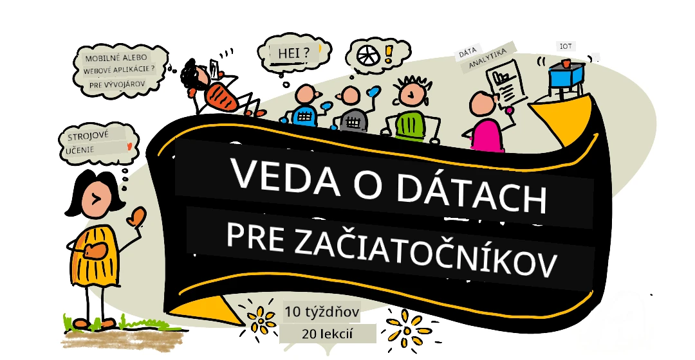
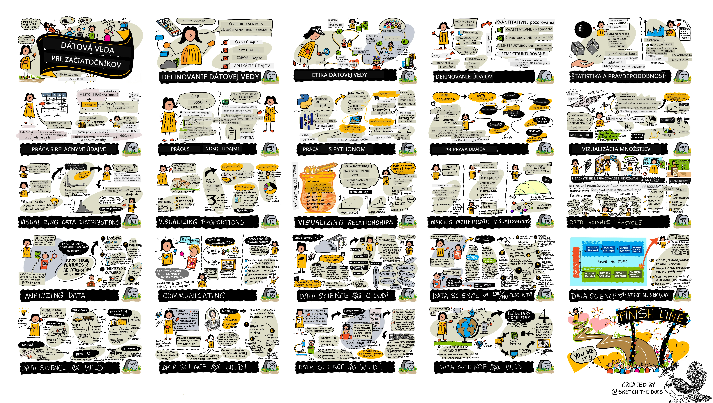

# Data Science pre začiatočníkov - Osnovy

[](https://github.com/codespaces/new?hide_repo_select=true&ref=main&repo=344191198)

[](https://github.com/microsoft/Data-Science-For-Beginners/blob/master/LICENSE)
[](https://GitHub.com/microsoft/Data-Science-For-Beginners/graphs/contributors/)
[](https://GitHub.com/microsoft/Data-Science-For-Beginners/issues/)
[](https://GitHub.com/microsoft/Data-Science-For-Beginners/pulls/)
[](http://makeapullrequest.com)

[](https://GitHub.com/microsoft/Data-Science-For-Beginners/watchers/)
[](https://GitHub.com/microsoft/Data-Science-For-Beginners/network/)
[](https://GitHub.com/microsoft/Data-Science-For-Beginners/stargazers/)


[](https://discord.gg/nTYy5BXMWG)

[](https://aka.ms/foundry/forum)

Azure Cloud Advocates v Microsoft s radosťou ponúkajú 10-týždňový, 20-lekčný kurz zameraný na Data Science. Každá lekcia obsahuje predlekčný a poposledný kvíz, písomné inštrukcie na dokončenie lekcie, riešenie a úlohu. Naša projektová pedagogika vám umožňuje učiť sa pri tvorbe, čo je overený spôsob, ako nové zručnosti „zafixovať“.

**Srdečná vďaka našim autorom:** [Jasmine Greenaway](https://www.twitter.com/paladique), [Dmitry Soshnikov](http://soshnikov.com), [Nitya Narasimhan](https://twitter.com/nitya), [Jalen McGee](https://twitter.com/JalenMcG), [Jen Looper](https://twitter.com/jenlooper), [Maud Levy](https://twitter.com/maudstweets), [Tiffany Souterre](https://twitter.com/TiffanySouterre), [Christopher Harrison](https://www.twitter.com/geektrainer).

**🙏 Špeciálne poďakovanie 🙏 našim autorom, recenzentom a prispievateľom obsahu z [Microsoft Student Ambassador](https://studentambassadors.microsoft.com/),** hlavne Aaryan Arora, [Aditya Garg](https://github.com/AdityaGarg00), [Alondra Sanchez](https://www.linkedin.com/in/alondra-sanchez-molina/), [Ankita Singh](https://www.linkedin.com/in/ankitasingh007), [Anupam Mishra](https://www.linkedin.com/in/anupam--mishra/), [Arpita Das](https://www.linkedin.com/in/arpitadas01/), ChhailBihari Dubey, [Dibri Nsofor](https://www.linkedin.com/in/dibrinsofor), [Dishita Bhasin](https://www.linkedin.com/in/dishita-bhasin-7065281bb), [Majd Safi](https://www.linkedin.com/in/majd-s/), [Max Blum](https://www.linkedin.com/in/max-blum-6036a1186/), [Miguel Correa](https://www.linkedin.com/in/miguelmque/), [Mohamma Iftekher (Iftu) Ebne Jalal](https://twitter.com/iftu119), [Nawrin Tabassum](https://www.linkedin.com/in/nawrin-tabassum), [Raymond Wangsa Putra](https://www.linkedin.com/in/raymond-wp/), [Rohit Yadav](https://www.linkedin.com/in/rty2423), Samridhi Sharma, [Sanya Sinha](https://www.linkedin.com/mwlite/in/sanya-sinha-13aab1200),
[Sheena Narula](https://www.linkedin.com/in/sheena-narua-n/), [Tauqeer Ahmad](https://www.linkedin.com/in/tauqeerahmad5201/), Yogendrasingh Pawar , [Vidushi Gupta](https://www.linkedin.com/in/vidushi-gupta07/), [Jasleen Sondhi](https://www.linkedin.com/in/jasleen-sondhi/)

||
|:---:|
| Data Science pre začiatočníkov - _Sketchnote od [@nitya](https://twitter.com/nitya)_ |

### 🌐 Podpora viacerých jazykov

#### Podporované cez GitHub Action (automatizované a vždy aktuálne)

<!-- CO-OP TRANSLATOR LANGUAGES TABLE START -->
[Arabic](../ar/README.md) | [Bengali](../bn/README.md) | [Bulgarian](../bg/README.md) | [Burmese (Myanmar)](../my/README.md) | [Chinese (Simplified)](../zh-CN/README.md) | [Chinese (Traditional, Hong Kong)](../zh-HK/README.md) | [Chinese (Traditional, Macau)](../zh-MO/README.md) | [Chinese (Traditional, Taiwan)](../zh-TW/README.md) | [Croatian](../hr/README.md) | [Czech](../cs/README.md) | [Danish](../da/README.md) | [Dutch](../nl/README.md) | [Estonian](../et/README.md) | [Finnish](../fi/README.md) | [French](../fr/README.md) | [German](../de/README.md) | [Greek](../el/README.md) | [Hebrew](../he/README.md) | [Hindi](../hi/README.md) | [Hungarian](../hu/README.md) | [Indonesian](../id/README.md) | [Italian](../it/README.md) | [Japanese](../ja/README.md) | [Kannada](../kn/README.md) | [Khmer](../km/README.md) | [Korean](../ko/README.md) | [Lithuanian](../lt/README.md) | [Malay](../ms/README.md) | [Malayalam](../ml/README.md) | [Marathi](../mr/README.md) | [Nepali](../ne/README.md) | [Nigerian Pidgin](../pcm/README.md) | [Norwegian](../no/README.md) | [Persian (Farsi)](../fa/README.md) | [Polish](../pl/README.md) | [Portuguese (Brazil)](../pt-BR/README.md) | [Portuguese (Portugal)](../pt-PT/README.md) | [Punjabi (Gurmukhi)](../pa/README.md) | [Romanian](../ro/README.md) | [Russian](../ru/README.md) | [Serbian (Cyrillic)](../sr/README.md) | [Slovak](./README.md) | [Slovenian](../sl/README.md) | [Spanish](../es/README.md) | [Swahili](../sw/README.md) | [Swedish](../sv/README.md) | [Tagalog (Filipino)](../tl/README.md) | [Tamil](../ta/README.md) | [Telugu](../te/README.md) | [Thai](../th/README.md) | [Turkish](../tr/README.md) | [Ukrainian](../uk/README.md) | [Urdu](../ur/README.md) | [Vietnamese](../vi/README.md)

> **Uprednostňujete klonovanie lokálne?**
>
> Tento repozitár obsahuje preklady do viac ako 50 jazykov, čo výrazne zvyšuje veľkosť stiahnutia. Ak chcete klonovať bez prekladov, použite sparse checkout:
>
> **Bash / macOS / Linux:**
> ```bash
> git clone --filter=blob:none --sparse https://github.com/microsoft/Data-Science-For-Beginners.git
> cd Data-Science-For-Beginners
> git sparse-checkout set --no-cone '/*' '!translations' '!translated_images'
> ```
>
> **CMD (Windows):**
> ```cmd
> git clone --filter=blob:none --sparse https://github.com/microsoft/Data-Science-For-Beginners.git
> cd Data-Science-For-Beginners
> git sparse-checkout set --no-cone "/*" "!translations" "!translated_images"
> ```
>
> Toto vám poskytne všetko potrebné na dokončenie kurzu s oveľa rýchlejším stiahnutím.
<!-- CO-OP TRANSLATOR LANGUAGES TABLE END -->

**Ak si želáte, aby boli podporované ďalšie jazyky s prekladmi, sú uvedené [tu](https://github.com/Azure/co-op-translator/blob/main/getting_started/supported-languages.md)**

#### Pridajte sa k našej komunite 
[](https://discord.gg/nTYy5BXMWG)

Máme prebiehajúcu sériu Learn with AI na Discorde, dozviete sa viac a pripojíte sa na [Learn with AI Series](https://aka.ms/learnwithai/discord) od 18. do 30. septembra 2025. Dostanete tipy a triky na používanie GitHub Copilota pre Data Science.


# Ste študent?

Začnite s nasledujúcimi zdrojmi:

- [Stránka pre študentov](https://docs.microsoft.com/en-gb/learn/student-hub?WT.mc_id=academic-77958-bethanycheum) Na tejto stránke nájdete zdroje pre začiatočníkov, študentské balíky a dokonca aj spôsoby, ako získať bezplatný certifikačný poukaz. Toto je stránka, ktorú si chcete uložiť do záložiek a občas si ju pozrieť, pretože obsah aspoň raz za mesiac meníme.
- [Microsoft Learn Student Ambassadors](https://studentambassadors.microsoft.com?WT.mc_id=academic-77958-bethanycheum) Pridajte sa k globálnej komunite študentských ambasádorov, toto by mohla byť vaša cesta do Microsoftu.

# Začíname

## 📚 Dokumentácia

- **[Inštalačný návod](INSTALLATION.md)** - krok za krokom nastavenie pre začiatočníkov
- **[Používateľský sprievodca](USAGE.md)** - príklady a bežné pracovné postupy
- **[Riešenie problémov](TROUBLESHOOTING.md)** - riešenia bežných problémov
- **[Sprievodca prispievania](CONTRIBUTING.md)** - ako prispieť do tohto projektu
- **[Pre učiteľov](for-teachers.md)** - pedagogické vedenie a materiály do triedy

## 👨‍🎓 Pre študentov
> **Úplní začiatočníci**: Ste nový v oblasti data science? Začnite s našimi [príkladmi vhodnými pre začiatočníkov](examples/README.md)! Tieto jednoduché, dobre okomentované príklady vám pomôžu pochopiť základy predtým, než sa pustíte do celej osnovy.
> **[Študenti](https://aka.ms/student-page)**: ak chcete používať túto osnovu sami, vytvorte si fork celého repozitára a cvičenia riešte samostatne, začínajúc prednáškovým kvízom. Potom si prečítajte prednášku a dokončite zvyšok aktivít. Pokúste sa vytvoriť projekty pochopením lekcií namiesto kopírovania riešení; tie však nájdete v priečinkoch /solutions v každej projektovo orientovanej lekcii. Ďalším nápadom je založiť študijnú skupinu s priateľmi a prejsť obsah spolu. Na ďalšie štúdium odporúčame [Microsoft Learn](https://docs.microsoft.com/en-us/users/jenlooper-2911/collections/qprpajyoy3x0g7?WT.mc_id=academic-77958-bethanycheum).

**Rýchly štart:**
1. Skontrolujte [Inštalačný návod](INSTALLATION.md) a nastavte si prostredie
2. Prečítajte si [Používateľský sprievodca](USAGE.md), aby ste sa naučili pracovať s osnovou
3. Začnite s Lekciou 1 a pokračujte postupne
4. Pridajte sa k našej [Discord komunite](https://aka.ms/ds4beginners/discord) pre podporu

## 👩‍🏫 Pre učiteľov
> **Učitelia**: zahrnuli sme [niekoľko návrhov](for-teachers.md), ako tento učebný plán používať. Radi privítame vaše spätné väzby [na našom diskusnom fóre](https://github.com/microsoft/Data-Science-For-Beginners/discussions)!

## Spoznajte tím

[](https://youtu.be/8mzavjQSMM4 "Promo video")

**Gif od** [Mohit Jaisal](https://www.linkedin.com/in/mohitjaisal)

> 🎥 Kliknite na obrázok vyššie pre video o projekte a ľuďoch, ktorí ho vytvorili!

## Pedagógia

Pri tvorbe tohto učebného plánu sme si zvolili dva pedagogické princípy: zabezpečiť, aby bol založený na projektoch a aby obsahoval časté kvízy. Na konci tejto série sa študenti naučia základné princípy dátovej vedy, vrátane etických konceptov, prípravy dát, rôznych spôsobov práce s dátami, vizualizácie dát, analýzy dát, reálnych prípadov použitia dátovej vedy a ďalšie.

Okrem toho kvíz s nízkou záťažou pred hodinou nastavuje študentovi cieľ učiť sa danú tému, zatiaľ čo druhý kvíz po hodine zabezpečuje ďalšie udržanie vedomostí. Tento učebný plán bol navrhnutý tak, aby bol flexibilný a zábavný, a môže byť absolvovaný celý alebo čiastočne. Projekty začínajú malé a postupne sa počas 10 týždňového cyklu stávajú zložitejšími.

> Nájdite náš [Kódex správania](CODE_OF_CONDUCT.md), [Príspevky](CONTRIBUTING.md), [Preklady](TRANSLATIONS.md) pravidlá. Radi privítame vašu konštruktívnu spätnú väzbu!

## Každá lekcia obsahuje:

- Voliteľnú náčrtnú poznámku (sketchnote)
- Voliteľné doplnkové video
- Rozcvičkový kvíz pred lekciou
- Písanú lekciu
- Pre lekcie založené na projektoch, krok za krokom návody na vytvorenie projektu
- Overenia vedomostí
- Výzvu
- Doplnkové čítanie
- Zadanie
- [Kvíz po lekcii](https://ff-quizzes.netlify.app/en/)

> **Poznámka o kvízoch**: Všetky kvízy sú obsiahnuté v priečinku Quiz-App, celkovo 40 kvízov po tri otázky v každom. Sú prepojené v rámci lekcií, ale aplikáciu kvízov je možné spustiť lokálne alebo nasadiť na Azure; nasledujte inštrukcie v priečinku `quiz-app`. Postupne sa lokalizujú.

## 🎓 Príklady vhodné pre začiatočníkov

**Noví v dátovej vede?** Vytvorili sme špeciálny [adresár príkladov](examples/README.md) so jednoduchým, dobre komentovaným kódom, ktorý vám pomôže začať:

- 🌟 **Hello World** - Váš prvý program v dátovej vede
- 📂 **Načítavanie dát** - Naučte sa čítať a skúmať datasety
- 📊 **Jednoduchá analýza** - Vypočítajte štatistiky a nájdite vzory
- 📈 **Základná vizualizácia** - Vytvorte grafy a diagramy
- 🔬 **Projekt z reálneho sveta** - Kompletný pracovný tok od začiatku do konca

Každý príklad obsahuje podrobné komentáre vysvetľujúce každý krok, čo je ideálne pre úplných začiatočníkov!

👉 **[Začnite s príkladmi](examples/README.md)** 👈

## Lekcie


||
|:---:|
| Dátová veda pre začiatočníkov: Plán - _Sketchnote od [@nitya](https://twitter.com/nitya)_ |


| Číslo lekcie | Téma | Skupina lekcií | Ciele učenia | Prepojená lekcia | Autor |
| :-----------: | :----------------------------------------: | :--------------------------------------------------: | :-----------------------------------------------------------------------------------------------------------------------------------------------------------------------: | :---------------------------------------------------------------------: | :----: |
| 01 | Definovanie dátovej vedy | [Úvod](1-Introduction/README.md) | Naučte sa základné koncepty dátovej vedy a ako súvisí s umelou inteligenciou, strojovým učením a veľkými dátami. | [lekcia](1-Introduction/01-defining-data-science/README.md) [video](https://youtu.be/beZ7Mb_oz9I) | [Dmitry](http://soshnikov.com) |
| 02 | Etika dátovej vedy | [Úvod](1-Introduction/README.md) | Koncepty, výzvy a rámce etiky dát. | [lekcia](1-Introduction/02-ethics/README.md) | [Nitya](https://twitter.com/nitya) |
| 03 | Definovanie dát | [Úvod](1-Introduction/README.md) | Ako sa klasifikujú dáta a ich bežné zdroje. | [lekcia](1-Introduction/03-defining-data/README.md) | [Jasmine](https://www.twitter.com/paladique) |
| 04 | Úvod do štatistiky a pravdepodobnosti | [Úvod](1-Introduction/README.md) | Matematické techniky pravdepodobnosti a štatistiky na porozumenie dát. | [lekcia](1-Introduction/04-stats-and-probability/README.md) [video](https://youtu.be/Z5Zy85g4Yjw) | [Dmitry](http://soshnikov.com) |
| 05 | Práca s relačnými dátami | [Práca s dátami](2-Working-With-Data/README.md) | Úvod do relačných dát a základy skúmania a analýzy relačných dát pomocou štruktúrovaného dopytovacieho jazyka, známeho ako SQL (vyslovované “see-quell”). | [lekcia](2-Working-With-Data/05-relational-databases/README.md) | [Christopher](https://www.twitter.com/geektrainer) | | |
| 06 | Práca s NoSQL dátami | [Práca s dátami](2-Working-With-Data/README.md) | Úvod do nerelačných dát, ich rôznych typov a základy skúmania a analýzy dokumentových databáz. | [lekcia](2-Working-With-Data/06-non-relational/README.md) | [Jasmine](https://twitter.com/paladique)|
| 07 | Práca s Python | [Práca s dátami](2-Working-With-Data/README.md) | Základy používania Pythonu na prieskum dát s knižnicami, ako je Pandas. Odporúča sa základné znalosť programovania v Pythone. | [lekcia](2-Working-With-Data/07-python/README.md) [video](https://youtu.be/dZjWOGbsN4Y) | [Dmitry](http://soshnikov.com) |
| 08 | Príprava dát | [Práca s dátami](2-Working-With-Data/README.md) | Témy o technikách čistenia a transformácie dát na riešenie výziev so chýbajúcimi, nepresnými alebo neúplnými dátami. | [lekcia](2-Working-With-Data/08-data-preparation/README.md) | [Jasmine](https://www.twitter.com/paladique) |
| 09 | Vizualizácia množstiev | [Vizualizácia dát](3-Data-Visualization/README.md) | Naučte sa používať Matplotlib na vizualizáciu údajov o vtákoch 🦆 | [lekcia](3-Data-Visualization/09-visualization-quantities/README.md) | [Jen](https://twitter.com/jenlooper) |
| 10 | Vizualizácia rozdelení dát | [Vizualizácia dát](3-Data-Visualization/README.md) | Vizualizácia pozorovaní a trendov v rámci intervalu. | [lekcia](3-Data-Visualization/10-visualization-distributions/README.md) | [Jen](https://twitter.com/jenlooper) |
| 11 | Vizualizácia pomerov | [Vizualizácia dát](3-Data-Visualization/README.md) | Vizualizácia diskrétnych a zoskupených percent. | [lekcia](3-Data-Visualization/11-visualization-proportions/README.md) | [Jen](https://twitter.com/jenlooper) |
| 12 | Vizualizácia vzťahov | [Vizualizácia dát](3-Data-Visualization/README.md) | Vizualizácia spojení a korelácií medzi dátovými sadami a ich premennými. | [lekcia](3-Data-Visualization/12-visualization-relationships/README.md) | [Jen](https://twitter.com/jenlooper) |
| 13 | Významné vizualizácie | [Vizualizácia dát](3-Data-Visualization/README.md) | Techniky a odporúčania na vytváranie hodnotných vizualizácií pre efektívne riešenie problémov a získavanie poznatkov. | [lekcia](3-Data-Visualization/13-meaningful-visualizations/README.md) | [Jen](https://twitter.com/jenlooper) |
| 14 | Úvod do životného cyklu dátovej vedy | [Životný cyklus](4-Data-Science-Lifecycle/README.md) | Úvod do životného cyklu dátovej vedy a jeho prvého kroku – získavanie a extrahovanie dát. | [lekcia](4-Data-Science-Lifecycle/14-Introduction/README.md) | [Jasmine](https://twitter.com/paladique) |
| 15 | Analyzovanie | [Životný cyklus](4-Data-Science-Lifecycle/README.md) | Táto fáza životného cyklu dátovej vedy sa zameriava na techniky analýzy dát. | [lekcia](4-Data-Science-Lifecycle/15-analyzing/README.md) | [Jasmine](https://twitter.com/paladique) | | |
| 16 | Komunikácia | [Životný cyklus](4-Data-Science-Lifecycle/README.md) | Táto fáza životného cyklu dátovej vedy sa zameriava na prezentovanie poznatkov z dát spôsobom, ktorý uľahčuje pochopenie pre rozhodovateľov. | [lekcia](4-Data-Science-Lifecycle/16-communication/README.md) | [Jalen](https://twitter.com/JalenMcG) | | |
| 17 | Dátová veda v cloude | [Cloud Data](5-Data-Science-In-Cloud/README.md) | Táto séria lekcií predstavuje dátovú vedu v cloude a jej výhody. | [lekcia](5-Data-Science-In-Cloud/17-Introduction/README.md) | [Tiffany](https://twitter.com/TiffanySouterre) a [Maud](https://twitter.com/maudstweets) |
| 18 | Dátová veda v cloude | [Cloud Data](5-Data-Science-In-Cloud/README.md) | Tréning modelov pomocou nástrojov Low Code. |[lekcia](5-Data-Science-In-Cloud/18-Low-Code/README.md) | [Tiffany](https://twitter.com/TiffanySouterre) a [Maud](https://twitter.com/maudstweets) |
| 19 | Dátová veda v cloude | [Cloud Data](5-Data-Science-In-Cloud/README.md) | Nasadzovanie modelov cez Azure Machine Learning Studio. | [lekcia](5-Data-Science-In-Cloud/19-Azure/README.md)| [Tiffany](https://twitter.com/TiffanySouterre) a [Maud](https://twitter.com/maudstweets) |
| 20 | Dátová veda v teréne | [In the Wild](6-Data-Science-In-Wild/README.md) | Projekty založené na dátovej vede v reálnom svete. | [lekcia](6-Data-Science-In-Wild/20-Real-World-Examples/README.md) | [Nitya](https://twitter.com/nitya) |

## GitHub Codespaces

Postupujte podľa týchto krokov, aby ste otvorili tento príklad v Codespace:
1. Kliknite na rozbaľovacie menu Kód a vyberte možnosť Otvoriť v Codespaces.
2. Vyberte + Nový codespace v spodnej časti panela.
Pre viac informácií pozrite si [dokumentáciu GitHub](https://docs.github.com/en/codespaces/developing-in-codespaces/creating-a-codespace-for-a-repository#creating-a-codespace).

## VSCode Remote - Kontajnery
Postupujte podľa týchto krokov, aby ste otvorili tento repozitár v kontejnery pomocou vášho lokálneho počítača a VSCode s rozšírením VS Code Remote - Containers:

1. Ak používate kontajner na vývoj po prvýkrát, uistite sa, prosím, že váš systém spĺňa požiadavky (t.j. máte nainštalovaný Docker) v [dokumentácii pre začiatočníkov](https://code.visualstudio.com/docs/devcontainers/containers#_getting-started).

Pre využitie tohto repozitára môžete buď otvoriť repozitár v izolovanom Docker volume:

**Poznámka**: Pod kapotou sa použije príkaz Remote-Containers: **Clone Repository in Container Volume...** na naklonovanie zdrojového kódu do Docker volume namiesto lokálneho súborového systému. [Volume](https://docs.docker.com/storage/volumes/) sú preferovaný mechanizmus pre uchovávanie dát kontajnera.

Alebo otvorte lokálne naklonovanú alebo stiahnutú verziu repozitára:

- Naklonujte si tento repozitár do lokálneho súborového systému.
- Stlačte F1 a vyberte príkaz **Remote-Containers: Open Folder in Container...**.
- Vyberte naklonovanú kópiu tohto priečinka, počkajte kým sa kontajner spustí, a vyskúšajte to.

## Offline prístup

Túto dokumentáciu môžete používať aj offline pomocou [Docsify](https://docsify.js.org/#/). Forknite tento repozitár, [nainštalujte Docsify](https://docsify.js.org/#/quickstart) na vašom lokálnom počítači, potom v koreňovom priečinku tohto repozitára zadajte `docsify serve`. Webová stránka bude dostupná na porte 3000 na vašom localhost: `localhost:3000`.

> Poznámka, notebooky sa cez Docsify nevykresľujú, preto ak potrebujete spustiť notebook, robte to samostatne vo VS Code s bežiacim Python kernelom.

## Iné učebné plány

Náš tím vytvára aj iné učebné plány! Pozrite si:

<!-- CO-OP TRANSLATOR OTHER COURSES START -->
### LangChain
[](https://aka.ms/langchain4j-for-beginners)
[](https://aka.ms/langchainjs-for-beginners?WT.mc_id=m365-94501-dwahlin)
[](https://github.com/microsoft/langchain-for-beginners?WT.mc_id=m365-94501-dwahlin)
---

### Azure / Edge / MCP / Agenti
[](https://github.com/microsoft/AZD-for-beginners?WT.mc_id=academic-105485-koreyst)
[](https://github.com/microsoft/edgeai-for-beginners?WT.mc_id=academic-105485-koreyst)
[](https://github.com/microsoft/mcp-for-beginners?WT.mc_id=academic-105485-koreyst)
[](https://github.com/microsoft/ai-agents-for-beginners?WT.mc_id=academic-105485-koreyst)

---
 
### Séria Generatívnej AI
[](https://github.com/microsoft/generative-ai-for-beginners?WT.mc_id=academic-105485-koreyst)
[-9333EA?style=for-the-badge&labelColor=E5E7EB&color=9333EA)](https://github.com/microsoft/Generative-AI-for-beginners-dotnet?WT.mc_id=academic-105485-koreyst)
[-C084FC?style=for-the-badge&labelColor=E5E7EB&color=C084FC)](https://github.com/microsoft/generative-ai-for-beginners-java?WT.mc_id=academic-105485-koreyst)
[-E879F9?style=for-the-badge&labelColor=E5E7EB&color=E879F9)](https://github.com/microsoft/generative-ai-with-javascript?WT.mc_id=academic-105485-koreyst)

---
 
### Základné učenie
[](https://aka.ms/ml-beginners?WT.mc_id=academic-105485-koreyst)
[](https://aka.ms/datascience-beginners?WT.mc_id=academic-105485-koreyst)
[](https://aka.ms/ai-beginners?WT.mc_id=academic-105485-koreyst)
[](https://github.com/microsoft/Security-101?WT.mc_id=academic-96948-sayoung)
[](https://aka.ms/webdev-beginners?WT.mc_id=academic-105485-koreyst)
[](https://aka.ms/iot-beginners?WT.mc_id=academic-105485-koreyst)
[](https://github.com/microsoft/xr-development-for-beginners?WT.mc_id=academic-105485-koreyst)

---
 
### Séria Copilot
[](https://aka.ms/GitHubCopilotAI?WT.mc_id=academic-105485-koreyst)
[](https://github.com/microsoft/mastering-github-copilot-for-dotnet-csharp-developers?WT.mc_id=academic-105485-koreyst)
[](https://github.com/microsoft/CopilotAdventures?WT.mc_id=academic-105485-koreyst)
<!-- CO-OP TRANSLATOR OTHER COURSES END -->

## Získanie Pomoci

**Máte problémy?** Skontrolujte náš [Sprievodca riešením problémov](TROUBLESHOOTING.md) pre riešenia bežných problémov.

Ak ste zablokovaní alebo máte otázky týkajúce sa vývoja AI aplikácií, pripojte sa k ostatným študentom a skúseným vývojárom v diskusiách o MCP. Je to podporná komunita, kde sú otázky vítané a vedomosti sa slobodne zdieľajú.

[](https://discord.gg/nTYy5BXMWG)

Ak máte spätnú väzbu k produktu alebo narazíte na chyby počas tvorby, navštívte:

[](https://aka.ms/foundry/forum)

---

<!-- CO-OP TRANSLATOR DISCLAIMER START -->
**Zrieknutie sa zodpovednosti**:
Tento dokument bol preložený pomocou automatizovanej prekladateľskej služby AI [Co-op Translator](https://github.com/Azure/co-op-translator). Hoci sa snažíme o presnosť, prosím uvedomte si, že automatizované preklady môžu obsahovať chyby alebo nepresnosti. Originálny dokument v jeho pôvodnom jazyku by sa mal považovať za autoritatívny zdroj. Pre kritické informácie sa odporúča profesionálny ľudský preklad. Nie sme zodpovední za akékoľvek nedorozumenia alebo nesprávne interpretácie vyplývajúce z použitia tohto prekladu.
<!-- CO-OP TRANSLATOR DISCLAIMER END -->