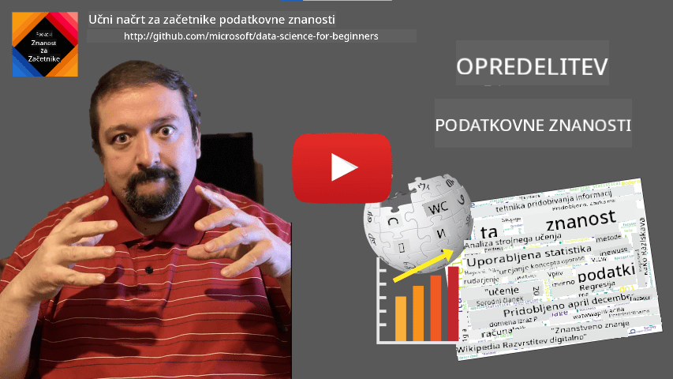
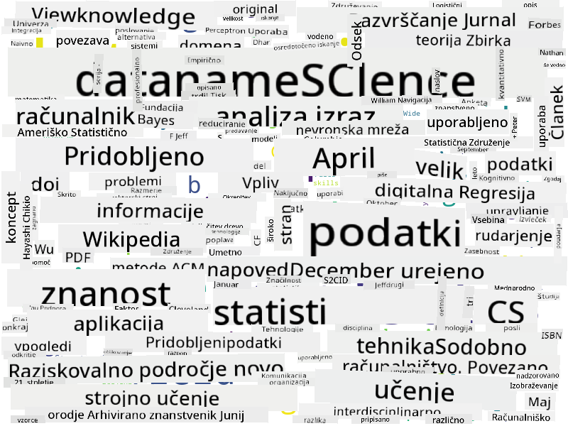

<!--
CO_OP_TRANSLATOR_METADATA:
{
  "original_hash": "2583a9894af7123b2fcae3376b14c035",
  "translation_date": "2025-08-30T19:29:12+00:00",
  "source_file": "1-Introduction/01-defining-data-science/README.md",
  "language_code": "sl"
}
-->
## Določanje podatkovne znanosti

|  ](../../sketchnotes/01-Definitions.png) |
| :--------------------------------------------------------------------------------------------------------: |
|              Določanje podatkovne znanosti - _Sketchnote avtorja [@nitya](https://twitter.com/nitya)_       |

---

## [Predhodni kviz pred predavanjem](https://purple-hill-04aebfb03.1.azurestaticapps.net/quiz/0)

## Kaj so podatki?
V našem vsakdanjem življenju smo nenehno obdani s podatki. Besedilo, ki ga trenutno berete, so podatki. Seznam telefonskih številk vaših prijateljev v pametnem telefonu so podatki, prav tako trenutni čas, ki ga prikazuje vaša ura. Kot ljudje naravno delujemo s podatki, na primer ko štejemo denar ali pišemo pisma prijateljem.

Vendar pa so podatki postali veliko bolj pomembni z nastankom računalnikov. Primarna naloga računalnikov je izvajanje izračunov, vendar za delovanje potrebujejo podatke. Zato moramo razumeti, kako računalniki shranjujejo in obdelujejo podatke.

S pojavom interneta se je vloga računalnikov kot naprav za obdelavo podatkov povečala. Če pomislite, danes računalnike vse bolj uporabljamo za obdelavo podatkov in komunikacijo, ne pa za dejanske izračune. Ko napišemo e-pošto prijatelju ali iščemo informacije na internetu, v bistvu ustvarjamo, shranjujemo, prenašamo in manipuliramo s podatki.
> Se spomnite, kdaj ste nazadnje uporabili računalnik za dejanski izračun?

## Kaj je podatkovna znanost?

Na [Wikipediji](https://en.wikipedia.org/wiki/Data_science) je **podatkovna znanost** opredeljena kot *znanstveno področje, ki uporablja znanstvene metode za pridobivanje znanja in vpogledov iz strukturiranih in nestrukturiranih podatkov ter uporabi pridobljeno znanje in praktične vpoglede iz podatkov na širokem spektru aplikacijskih področij*.

Ta definicija poudarja naslednje pomembne vidike podatkovne znanosti:

* Glavni cilj podatkovne znanosti je **pridobivanje znanja** iz podatkov, z drugimi besedami - **razumevanje** podatkov, iskanje skritih povezav in gradnja **modela**.
* Podatkovna znanost uporablja **znanstvene metode**, kot so verjetnost in statistika. Pravzaprav so nekateri ob uvedbi izraza *podatkovna znanost* trdili, da je to le nov moderen izraz za statistiko. Danes je jasno, da je področje veliko širše.
* Pridobljeno znanje je treba uporabiti za ustvarjanje **praktičnih vpogledov**, tj. uporabnih vpogledov, ki jih lahko uporabimo v resničnih poslovnih situacijah.
* Moramo biti sposobni delovati tako na **strukturiranih** kot na **nestrukturiranih** podatkih. O različnih vrstah podatkov bomo podrobneje govorili kasneje v tečaju.
* **Aplikacijsko področje** je pomemben koncept, saj podatkovni znanstveniki pogosto potrebujejo vsaj nekaj stopnje strokovnega znanja na področju problema, na primer: finance, medicina, marketing itd.

> Drug pomemben vidik podatkovne znanosti je, da preučuje, kako se podatki lahko zbirajo, shranjujejo in obdelujejo z računalniki. Medtem ko nam statistika daje matematične temelje, podatkovna znanost uporablja matematične koncepte za dejansko pridobivanje vpogledov iz podatkov.

Eden od načinov (pripisan [Jimu Grayu](https://en.wikipedia.org/wiki/Jim_Gray_(computer_scientist))) za razumevanje podatkovne znanosti je, da jo obravnavamo kot ločen znanstveni pristop:
* **Empirični**, kjer se zanašamo predvsem na opazovanja in rezultate eksperimentov
* **Teoretični**, kjer novi koncepti izhajajo iz obstoječega znanstvenega znanja
* **Računalniški**, kjer odkrivamo nova načela na podlagi računalniških eksperimentov
* **Na podatkih temelječi**, kjer odkrivamo povezave in vzorce v podatkih  

## Druga povezana področja

Ker so podatki vseprisotni, je tudi podatkovna znanost široko področje, ki se dotika številnih drugih disciplin.

## Vrste podatkov

Kot smo že omenili, so podatki povsod. Le zajeti jih moramo na pravi način! Koristno je razlikovati med **strukturiranimi** in **nestrukturiranimi** podatki. Prvi so običajno predstavljeni v dobro strukturirani obliki, pogosto kot tabela ali več tabel, medtem ko so drugi le zbirka datotek. Včasih lahko govorimo tudi o **polstrukturiranih** podatkih, ki imajo neko vrsto strukture, ki se lahko močno razlikuje.

| Strukturirani                                                              | Polstrukturirani                                                                                  | Nestrukturirani                          |
| -------------------------------------------------------------------------- | ------------------------------------------------------------------------------------------------- | --------------------------------------- |
| Seznam ljudi s telefonskimi številkami                                     | Wikipedijine strani s povezavami                                                                  | Besedilo Enciklopedije Britannica       |
| Temperatura v vseh sobah stavbe vsako minuto v zadnjih 20 letih            | Zbirka znanstvenih člankov v formatu JSON z avtorji, datumom objave in povzetkom                  | Datotečna shramba s korporativnimi dokumenti |
| Podatki o starosti in spolu vseh ljudi, ki vstopajo v stavbo               | Spletne strani                                                                                   | Surov video posnetek iz nadzorne kamere |

## Kje dobiti podatke

Obstaja veliko možnih virov podatkov, zato jih je nemogoče vse našteti! Vendar pa omenimo nekaj tipičnih mest, kjer lahko dobite podatke:

* **Strukturirani**
  - **Internet stvari** (IoT), vključno s podatki iz različnih senzorjev, kot so senzorji temperature ali tlaka, zagotavlja veliko uporabnih podatkov. Na primer, če je poslovna stavba opremljena s senzorji IoT, lahko samodejno nadzorujemo ogrevanje in razsvetljavo, da zmanjšamo stroške.
  - **Ankete**, ki jih prosimo uporabnike, da izpolnijo po nakupu ali po obisku spletne strani.
  - **Analiza vedenja** lahko na primer pomaga razumeti, kako globoko uporabnik raziskuje spletno stran in kaj je tipičen razlog za zapustitev strani.
* **Nestrukturirani**
  - **Besedila** so lahko bogat vir vpogledov, kot je skupna **ocena sentimenta** ali pridobivanje ključnih besed in semantičnega pomena.
  - **Slike** ali **video**. Video iz nadzorne kamere lahko uporabimo za oceno prometa na cesti in obveščanje ljudi o morebitnih zastojih.
  - **Dnevniki spletnih strežnikov** lahko pomagajo razumeti, katere strani naše spletne strani so najpogosteje obiskane in kako dolgo.
* **Polstrukturirani**
  - **Grafi družbenih omrežij** so lahko odličen vir podatkov o osebnostih uporabnikov in potencialni učinkovitosti pri širjenju informacij.
  - Ko imamo kup fotografij s zabave, lahko poskusimo pridobiti podatke o **skupinski dinamiki** z gradnjo grafa ljudi, ki se fotografirajo skupaj.

Z poznavanjem različnih možnih virov podatkov lahko razmišljate o različnih scenarijih, kjer je mogoče uporabiti tehnike podatkovne znanosti za boljše razumevanje situacije in izboljšanje poslovnih procesov.

## Kaj lahko storite s podatki

V podatkovni znanosti se osredotočamo na naslednje korake pri delu s podatki:

Seveda, odvisno od dejanskih podatkov, nekateri koraki morda manjkajo (npr. ko že imamo podatke v bazi podatkov ali ko ne potrebujemo usposabljanja modela), ali pa se nekateri koraki večkrat ponovijo (kot je obdelava podatkov).

## Digitalizacija in digitalna transformacija

V zadnjem desetletju so številna podjetja začela razumeti pomen podatkov pri sprejemanju poslovnih odločitev. Za uporabo načel podatkovne znanosti pri vodenju podjetja je najprej treba zbrati nekaj podatkov, tj. prevesti poslovne procese v digitalno obliko. To je znano kot **digitalizacija**. Uporaba tehnik podatkovne znanosti na teh podatkih za usmerjanje odločitev lahko vodi do znatnih povečanj produktivnosti (ali celo preoblikovanja poslovanja), kar imenujemo **digitalna transformacija**.

Poglejmo primer. Recimo, da imamo tečaj podatkovne znanosti (kot je ta), ki ga izvajamo prek spleta za študente, in želimo uporabiti podatkovno znanost za njegovo izboljšanje. Kako lahko to storimo?

Začnemo lahko z vprašanjem "Kaj lahko digitaliziramo?" Najpreprostejši način bi bil merjenje časa, ki ga vsak študent porabi za dokončanje vsakega modula, ter merjenje pridobljenega znanja z večkratno izbiro testa na koncu vsakega modula. Z izračunom povprečnega časa dokončanja med vsemi študenti lahko ugotovimo, kateri moduli povzročajo največ težav študentom, in delamo na njihovi poenostavitvi.
> Lahko bi trdili, da ta pristop ni idealen, saj so moduli lahko različno dolgi. Verjetno bi bilo bolj pravično čas razdeliti glede na dolžino modula (v številu znakov) in primerjati te vrednosti namesto tega.
Ko začnemo analizirati rezultate testov z več izbirami, lahko poskusimo ugotoviti, katere koncepte imajo študenti težave razumeti, in uporabimo te informacije za izboljšanje vsebine. Da bi to dosegli, moramo teste oblikovati tako, da vsako vprašanje ustreza določenemu konceptu ali delu znanja.

Če želimo stvari še bolj zaplesti, lahko primerjamo čas, potreben za dokončanje posameznega modula, glede na starostno kategorijo študentov. Morda ugotovimo, da za nekatere starostne kategorije traja neprimerno dolgo, da dokončajo modul, ali pa da študenti odnehajo, preden ga zaključijo. To nam lahko pomaga podati starostna priporočila za modul in zmanjšati nezadovoljstvo ljudi zaradi napačnih pričakovanj.

## 🚀 Izziv

V tem izzivu bomo poskušali najti koncepte, ki so relevantni za področje podatkovne znanosti, tako da preučimo besedila. Vzeli bomo Wikipedijski članek o podatkovni znanosti, prenesli in obdelali besedilo ter nato ustvarili oblak besed, kot je ta:

Obiščite [`notebook.ipynb`](../../../../../../../../../1-Introduction/01-defining-data-science/notebook.ipynb ':ignore'), da preberete kodo. Prav tako lahko zaženete kodo in si ogledate, kako v realnem času izvaja vse transformacije podatkov.

> Če ne veste, kako zagnati kodo v Jupyter Notebooku, si oglejte [ta članek](https://soshnikov.com/education/how-to-execute-notebooks-from-github/).

## [Kvizi po predavanju](https://purple-hill-04aebfb03.1.azurestaticapps.net/quiz/1)

## Naloge

* **Naloga 1**: Spremenite zgornjo kodo, da poiščete povezane koncepte za področji **Big Data** in **Machine Learning**.
* **Naloga 2**: [Razmislite o scenarijih podatkovne znanosti](assignment.md)

## Zasluge

To lekcijo je z ljubeznijo pripravil [Dmitry Soshnikov](http://soshnikov.com).

---

**Omejitev odgovornosti**:  
Ta dokument je bil preveden z uporabo storitve za strojno prevajanje [Co-op Translator](https://github.com/Azure/co-op-translator). Čeprav si prizadevamo za natančnost, vas prosimo, da upoštevate, da lahko avtomatizirani prevodi vsebujejo napake ali netočnosti. Izvirni dokument v njegovem maternem jeziku je treba obravnavati kot avtoritativni vir. Za ključne informacije priporočamo profesionalni človeški prevod. Ne prevzemamo odgovornosti za morebitne nesporazume ali napačne razlage, ki izhajajo iz uporabe tega prevoda.