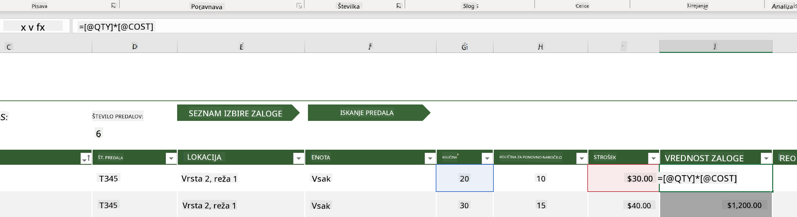
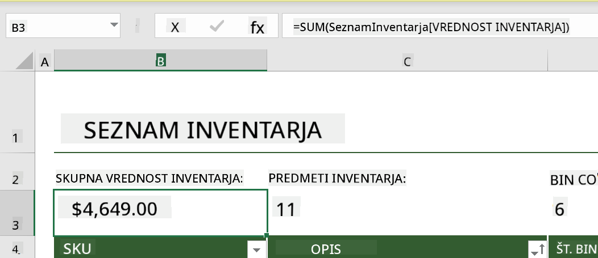
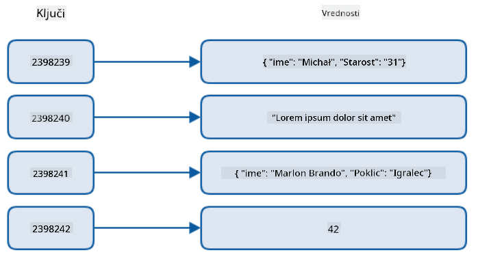
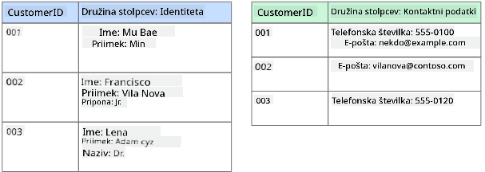
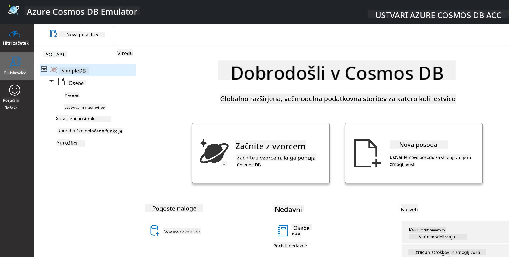
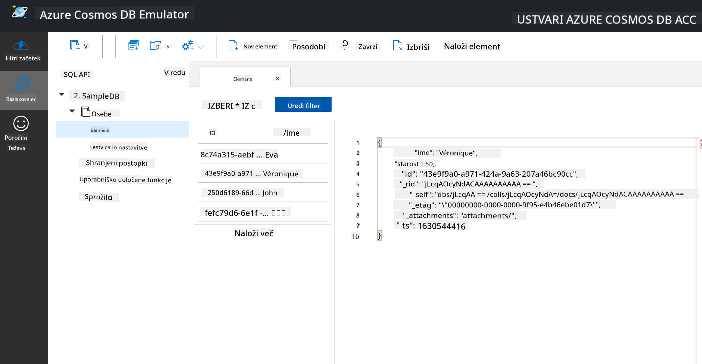
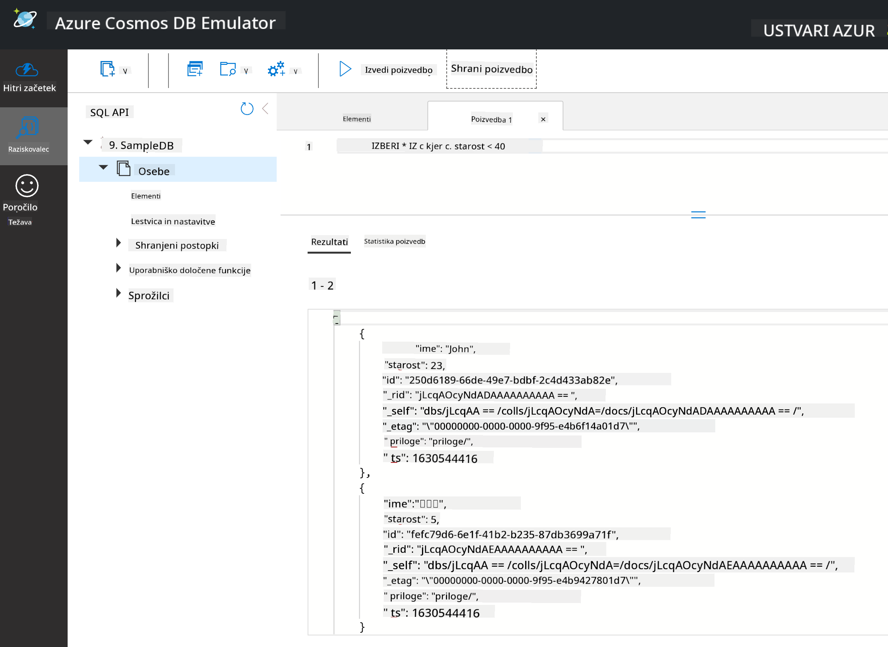

<!--
CO_OP_TRANSLATOR_METADATA:
{
  "original_hash": "32ddfef8121650f2ca2f3416fd283c37",
  "translation_date": "2025-08-30T18:01:47+00:00",
  "source_file": "2-Working-With-Data/06-non-relational/README.md",
  "language_code": "sl"
}
-->
# Delo s podatki: Nerelacijski podatki

| ](../../sketchnotes/06-NoSQL.png)|
|:---:|
|Delo z NoSQL podatki - _Sketchnote avtorja [@nitya](https://twitter.com/nitya)_ |

## [Predavanje: Kviz pred začetkom](https://purple-hill-04aebfb03.1.azurestaticapps.net/quiz/10)

Podatki niso omejeni le na relacijske baze podatkov. Ta lekcija se osredotoča na nerelacijske podatke in zajema osnove preglednic ter NoSQL.

## Preglednice

Preglednice so priljubljen način za shranjevanje in raziskovanje podatkov, saj zahtevajo manj priprave za začetek dela. V tej lekciji boste spoznali osnovne sestavne dele preglednice, formule in funkcije. Primeri bodo prikazani z Microsoft Excelom, vendar bodo večina delov in tem imela podobna imena in korake tudi v drugih programih za preglednice.


Preglednica je datoteka, ki je dostopna v datotečnem sistemu računalnika, naprave ali oblaka. Programska oprema je lahko brskalniška ali aplikacija, ki jo je treba namestiti na računalnik ali prenesti kot aplikacijo. V Excelu so te datoteke definirane kot **delovne knjige**, kar bo uporabljeno v preostanku te lekcije.

Delovna knjiga vsebuje enega ali več **delovnih listov**, ki so označeni z zavihki. Znotraj delovnega lista so pravokotniki, imenovani **celice**, ki vsebujejo dejanske podatke. Celica je presečišče vrstice in stolpca, kjer so stolpci označeni z abecednimi znaki, vrstice pa številčno. Nekatere preglednice vsebujejo glave v prvih nekaj vrsticah, ki opisujejo podatke v celici.

Z osnovnimi elementi Excelove delovne knjige bomo uporabili primer iz [Microsoft Templates](https://templates.office.com/), osredotočen na inventar, da bomo preučili dodatne dele preglednice.

### Upravljanje inventarja

Datoteka preglednice z imenom "InventoryExample" je oblikovana preglednica predmetov v inventarju, ki vsebuje tri delovne liste, kjer so zavihki označeni kot "Inventory List", "Inventory Pick List" in "Bin Lookup". Vrstica 4 na delovnem listu Inventory List je glava, ki opisuje vrednost vsake celice v stolpcu glave.



Obstajajo primeri, kjer je vrednost celice odvisna od vrednosti drugih celic. Preglednica Inventory List spremlja stroške vsakega predmeta v inventarju, vendar kaj, če želimo vedeti vrednost celotnega inventarja? [**Formule**](https://support.microsoft.com/en-us/office/overview-of-formulas-34519a4e-1e8d-4f4b-84d4-d642c4f63263) izvajajo dejanja na podatkih v celicah in se uporabljajo za izračun stroškov inventarja v tem primeru. Ta preglednica uporablja formulo v stolpcu Inventory Value za izračun vrednosti vsakega predmeta z množenjem količine pod glavo QTY in stroškov pod glavo COST. Dvoklik ali označitev celice prikaže formulo. Opazili boste, da formule začnejo z znakom za enačbo, ki mu sledi izračun ali operacija.



Za seštevanje vseh vrednosti stolpca Inventory Value lahko uporabimo drugo formulo. To bi lahko izračunali z dodajanjem vsake celice posebej, vendar je to lahko zamudno. Excel ima [**funkcije**](https://support.microsoft.com/en-us/office/sum-function-043e1c7d-7726-4e80-8f32-07b23e057f89), ali vnaprej določene formule za izvajanje izračunov na vrednostih celic. Funkcije zahtevajo argumente, kar so potrebne vrednosti za izvedbo teh izračunov. Če funkcije zahtevajo več kot en argument, jih je treba navesti v določenem vrstnem redu, sicer funkcija morda ne bo pravilno izračunala vrednosti. Ta primer uporablja funkcijo SUM in uporablja vrednosti stolpca Inventory Value kot argument za izračun skupne vrednosti, navedene v vrstici 3, stolpec B (imenovan tudi B3).

## NoSQL

NoSQL je splošen izraz za različne načine shranjevanja nerelacijskih podatkov in ga lahko interpretiramo kot "non-SQL", "nerelacijski" ali "ne samo SQL". Te vrste podatkovnih sistemov lahko razvrstimo v 4 tipe.


> Vir: [Michał Białecki Blog](https://www.michalbialecki.com/2018/03/18/azure-cosmos-db-key-value-database-cloud/)

[Podatkovne shrambe ključ-vrednost](https://docs.microsoft.com/en-us/azure/architecture/data-guide/big-data/non-relational-data#keyvalue-data-stores) povezujejo edinstvene ključe, ki so unikatni identifikatorji, z vrednostmi. Ti pari so shranjeni z uporabo [hash tabele](https://www.hackerearth.com/practice/data-structures/hash-tables/basics-of-hash-tables/tutorial/) z ustrezno hash funkcijo.


> Vir: [Microsoft](https://docs.microsoft.com/en-us/azure/cosmos-db/graph/graph-introduction#graph-database-by-example)

[Grafične](https://docs.microsoft.com/en-us/azure/architecture/data-guide/big-data/non-relational-data#graph-data-stores) podatkovne shrambe opisujejo odnose v podatkih in so predstavljene kot zbirka vozlišč in povezav. Vozlišče predstavlja entiteto, nekaj, kar obstaja v resničnem svetu, kot je študent ali bančni izpisek. Povezave predstavljajo odnose med dvema entitetama. Vsako vozlišče in povezava imata lastnosti, ki zagotavljajo dodatne informacije o vozliščih in povezavah.



[Stolpčne](https://docs.microsoft.com/en-us/azure/architecture/data-guide/big-data/non-relational-data#columnar-data-stores) podatkovne shrambe organizirajo podatke v stolpce in vrstice, podobno kot relacijska struktura podatkov, vendar je vsak stolpec razdeljen v skupine, imenovane družine stolpcev, kjer so vsi podatki pod enim stolpcem povezani in jih je mogoče pridobiti ali spremeniti kot eno enoto.

### Dokumentne podatkovne shrambe z Azure Cosmos DB

[Dokumentne](https://docs.microsoft.com/en-us/azure/architecture/data-guide/big-data/non-relational-data#document-data-stores) podatkovne shrambe temeljijo na konceptu shrambe ključ-vrednost in so sestavljene iz serije polj in objektov. Ta razdelek raziskuje dokumentne baze podatkov z emulatorjem Cosmos DB.

Baza podatkov Cosmos DB ustreza definiciji "ne samo SQL", kjer dokumentna baza podatkov Cosmos DB uporablja SQL za poizvedovanje podatkov. [Prejšnja lekcija](../05-relational-databases/README.md) o SQL zajema osnove jezika, ki jih bomo lahko uporabili tudi tukaj. Uporabili bomo emulator Cosmos DB, ki omogoča ustvarjanje in raziskovanje dokumentne baze podatkov lokalno na računalniku. Več o emulatorju preberite [tukaj](https://docs.microsoft.com/en-us/azure/cosmos-db/local-emulator?tabs=ssl-netstd21).

Dokument je zbirka polj in vrednosti objektov, kjer polja opisujejo, kaj vrednost objekta predstavlja. Spodaj je primer dokumenta.

```json
{
    "firstname": "Eva",
    "age": 44,
    "id": "8c74a315-aebf-4a16-bb38-2430a9896ce5",
    "_rid": "bHwDAPQz8s0BAAAAAAAAAA==",
    "_self": "dbs/bHwDAA==/colls/bHwDAPQz8s0=/docs/bHwDAPQz8s0BAAAAAAAAAA==/",
    "_etag": "\"00000000-0000-0000-9f95-010a691e01d7\"",
    "_attachments": "attachments/",
    "_ts": 1630544034
}
```

Polja, ki nas zanimajo v tem dokumentu, so: `firstname`, `id` in `age`. Ostala polja z podčrtaji so bila ustvarjena s strani Cosmos DB.

#### Raziskovanje podatkov z emulatorjem Cosmos DB

Emulator lahko prenesete in namestite [za Windows tukaj](https://aka.ms/cosmosdb-emulator). Za možnosti uporabe emulatorja na macOS in Linuxu si oglejte to [dokumentacijo](https://docs.microsoft.com/en-us/azure/cosmos-db/local-emulator?tabs=ssl-netstd21#run-on-linux-macos).

Emulator odpre okno brskalnika, kjer pogled Explorer omogoča raziskovanje dokumentov.



Če sledite navodilom, kliknite "Start with Sample", da ustvarite vzorčno bazo podatkov z imenom SampleDB. Če razširite SampleDB s klikom na puščico, boste našli zbirko z imenom `Persons`. Zbirka vsebuje zbirko elementov, ki so dokumenti znotraj zbirke. Raziskujete lahko štiri posamezne dokumente pod `Items`.



#### Poizvedovanje dokumentnih podatkov z emulatorjem Cosmos DB

V emulatorju lahko poizvedujete vzorčne podatke s klikom na gumb za novo SQL poizvedbo (drugi gumb z leve).

`SELECT * FROM c` vrne vse dokumente v zbirki. Dodajmo stavek WHERE in poiščimo vse, ki so mlajši od 40 let.

`SELECT * FROM c where c.age < 40`



Poizvedba vrne dva dokumenta, pri čemer je vrednost polja age v vsakem dokumentu manjša od 40.

#### JSON in dokumenti

Če poznate JavaScript Object Notation (JSON), boste opazili, da so dokumenti podobni JSON-u. V tej mapi je datoteka `PersonsData.json` z več podatki, ki jih lahko naložite v zbirko Persons v emulatorju prek gumba `Upload Item`.

V večini primerov lahko API-ji, ki vračajo JSON podatke, neposredno prenesejo in shranijo podatke v dokumentne baze podatkov. Spodaj je še en dokument, ki predstavlja tvite z Microsoftovega Twitter računa, pridobljene z uporabo Twitter API-ja in nato vstavljene v Cosmos DB.

```json
{
    "created_at": "2021-08-31T19:03:01.000Z",
    "id": "1432780985872142341",
    "text": "Blank slate. Like this tweet if you’ve ever painted in Microsoft Paint before. https://t.co/cFeEs8eOPK",
    "_rid": "dhAmAIUsA4oHAAAAAAAAAA==",
    "_self": "dbs/dhAmAA==/colls/dhAmAIUsA4o=/docs/dhAmAIUsA4oHAAAAAAAAAA==/",
    "_etag": "\"00000000-0000-0000-9f84-a0958ad901d7\"",
    "_attachments": "attachments/",
    "_ts": 1630537000
```

Polja, ki nas zanimajo v tem dokumentu, so: `created_at`, `id` in `text`.

## 🚀 Izziv

V datoteki `TwitterData.json` so podatki, ki jih lahko naložite v bazo SampleDB. Priporočljivo je, da jih dodate v ločeno zbirko. To lahko storite tako:

1. Kliknite gumb za novo zbirko v zgornjem desnem kotu.
2. Izberite obstoječo bazo podatkov (SampleDB) in ustvarite ID zbirke za zbirko.
3. Nastavite ključ particije na `/id`.
4. Kliknite OK (preostale informacije v tem pogledu lahko ignorirate, saj gre za majhen nabor podatkov, ki se izvaja lokalno na vašem računalniku).
5. Odprite novo zbirko in naložite datoteko Twitter Data z gumbom `Upload Item`.

Poskusite izvesti nekaj poizvedb SELECT, da poiščete dokumente, ki vsebujejo besedo Microsoft v polju text. Namig: uporabite [ključno besedo LIKE](https://docs.microsoft.com/en-us/azure/cosmos-db/sql/sql-query-keywords#using-like-with-the--wildcard-character).

## [Kviz po predavanju](https://purple-hill-04aebfb03.1.azurestaticapps.net/quiz/11)

## Pregled in samostojno učenje

- Obstajajo dodatne funkcije in oblikovanja, dodana tej preglednici, ki jih ta lekcija ne zajema. Microsoft ima [obsežno knjižnico dokumentacije in videov](https://support.microsoft.com/excel) o Excelu, če vas zanima več.

- Ta arhitekturna dokumentacija podrobno opisuje značilnosti različnih vrst nerelacijskih podatkov: [Nerelacijski podatki in NoSQL](https://docs.microsoft.com/en-us/azure/architecture/data-guide/big-data/non-relational-data).

- Cosmos DB je oblačna nerelacijska baza podatkov, ki lahko shranjuje tudi različne vrste NoSQL, omenjene v tej lekciji. Več o teh vrstah si preberite v tem [modulu Microsoft Learn o Cosmos DB](https://docs.microsoft.com/en-us/learn/paths/work-with-nosql-data-in-azure-cosmos-db/).

## Naloga

[Soda Profits](assignment.md)

---

**Omejitev odgovornosti**:  
Ta dokument je bil preveden z uporabo storitve za strojno prevajanje [Co-op Translator](https://github.com/Azure/co-op-translator). Čeprav si prizadevamo za natančnost, vas prosimo, da upoštevate, da lahko avtomatizirani prevodi vsebujejo napake ali netočnosti. Izvirni dokument v njegovem maternem jeziku je treba obravnavati kot avtoritativni vir. Za ključne informacije priporočamo profesionalni človeški prevod. Ne prevzemamo odgovornosti za morebitne nesporazume ali napačne razlage, ki izhajajo iz uporabe tega prevoda.