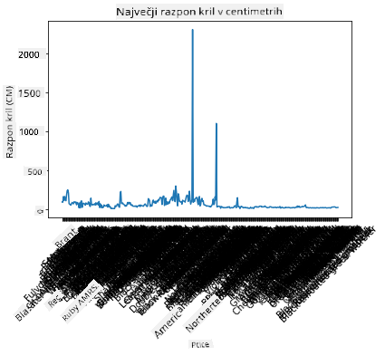
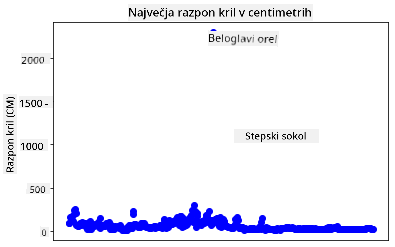
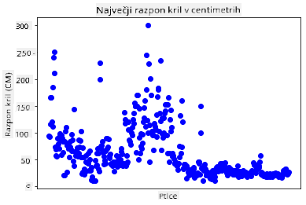
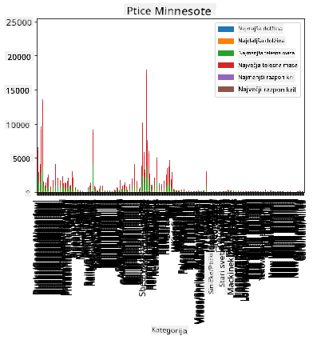
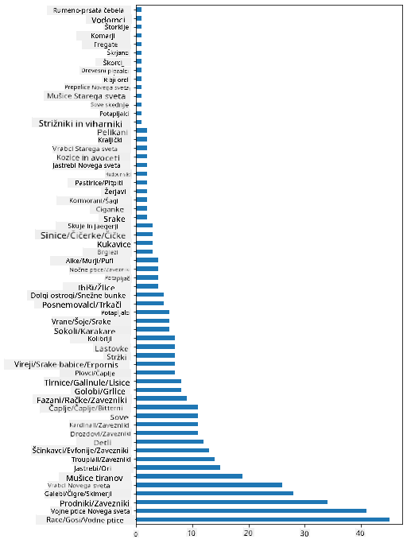
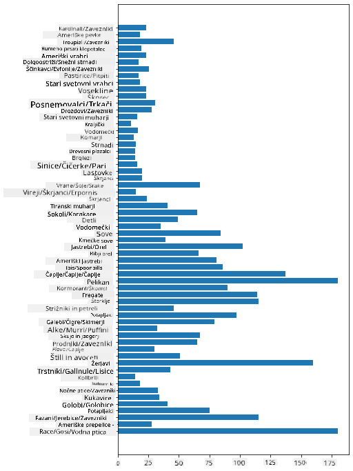
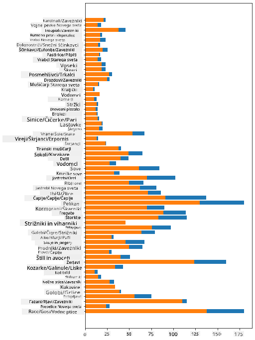

<!--
CO_OP_TRANSLATOR_METADATA:
{
  "original_hash": "43c402d9d90ae6da55d004519ada5033",
  "translation_date": "2025-08-30T19:01:34+00:00",
  "source_file": "3-Data-Visualization/09-visualization-quantities/README.md",
  "language_code": "sl"
}
-->
# Vizualizacija količin

| ](../../sketchnotes/09-Visualizing-Quantities.png)|
|:---:|
| Vizualizacija količin - _Sketchnote avtorja [@nitya](https://twitter.com/nitya)_ |

V tej lekciji boste raziskali, kako uporabiti eno izmed številnih Python knjižnic za ustvarjanje zanimivih vizualizacij, povezanih s konceptom količine. Z uporabo očiščenega nabora podatkov o pticah iz Minnesote se lahko naučite veliko zanimivih dejstev o lokalni divjini.  
## [Predhodni kviz](https://purple-hill-04aebfb03.1.azurestaticapps.net/quiz/16)

## Opazovanje razpona kril z Matplotlib

Odlična knjižnica za ustvarjanje tako preprostih kot tudi sofisticiranih grafov in diagramov različnih vrst je [Matplotlib](https://matplotlib.org/stable/index.html). Na splošno postopek risanja podatkov s temi knjižnicami vključuje: določitev delov vašega dataframe-a, ki jih želite obdelati, izvedbo potrebnih transformacij podatkov, dodelitev vrednosti za osi x in y, odločitev o vrsti grafa in nato prikaz grafa. Matplotlib ponuja veliko različnih vizualizacij, vendar se bomo v tej lekciji osredotočili na tiste, ki so najbolj primerne za vizualizacijo količin: črtne grafe, razpršene grafe in stolpčne grafe.

> ✅ Uporabite najboljši graf glede na strukturo vaših podatkov in zgodbo, ki jo želite povedati.  
> - Za analizo trendov skozi čas: črta  
> - Za primerjavo vrednosti: stolpec, stolpec, tortni graf, razpršeni graf  
> - Za prikaz, kako deli sestavljajo celoto: tortni graf  
> - Za prikaz porazdelitve podatkov: razpršeni graf, stolpec  
> - Za prikaz trendov: črta, stolpec  
> - Za prikaz odnosov med vrednostmi: črta, razpršeni graf, mehurčasti graf  

Če imate nabor podatkov in želite ugotoviti, koliko določenega elementa je vključenega, bo ena izmed prvih nalog pregled njegovih vrednosti.  

✅ Na voljo so odlični 'cheat sheeti' za Matplotlib [tukaj](https://matplotlib.org/cheatsheets/cheatsheets.pdf).

## Ustvarjanje črtnega grafa za vrednosti razpona kril ptic

Odprite datoteko `notebook.ipynb` v korenski mapi te lekcije in dodajte celico.

> Opomba: podatki so shranjeni v korenu tega repozitorija v mapi `/data`.

```python
import pandas as pd
import matplotlib.pyplot as plt
birds = pd.read_csv('../../data/birds.csv')
birds.head()
```  
Ti podatki so mešanica besedila in številk:

|      | Ime                          | ZnanstvenoIme          | Kategorija            | Red          | Družina  | Rod         | StanjeOhranitve    | MinDolžina | MaxDolžina | MinTežaTelesa | MaxTežaTelesa | MinRazponKril | MaxRazponKril |
| ---: | :--------------------------- | :--------------------- | :-------------------- | :----------- | :------- | :---------- | :----------------- | ---------: | ---------: | ------------: | ------------: | ------------: | ------------: |
|    0 | Črno-trebušna žvižgajoča raca | Dendrocygna autumnalis | Race/Gosi/Vodna ptica | Anseriformes | Anatidae | Dendrocygna | LC                 |        47  |        56  |          652  |         1020  |           76  |           94  |
|    1 | Rjava žvižgajoča raca         | Dendrocygna bicolor    | Race/Gosi/Vodna ptica | Anseriformes | Anatidae | Dendrocygna | LC                 |        45  |        53  |          712  |         1050  |           85  |           93  |
|    2 | Snežna gos                    | Anser caerulescens     | Race/Gosi/Vodna ptica | Anseriformes | Anatidae | Anser       | LC                 |        64  |        79  |         2050  |         4050  |          135  |          165  |
|    3 | Rossova gos                   | Anser rossii           | Race/Gosi/Vodna ptica | Anseriformes | Anatidae | Anser       | LC                 |      57.3  |        64  |         1066  |         1567  |          113  |          116  |
|    4 | Velika bela čelna gos         | Anser albifrons        | Race/Gosi/Vodna ptica | Anseriformes | Anatidae | Anser       | LC                 |        64  |        81  |         1930  |         3310  |          130  |          165  |

Začnimo z risanjem nekaterih številskih podatkov z osnovnim črtnim grafom. Recimo, da želite prikazati največji razpon kril teh zanimivih ptic.

```python
wingspan = birds['MaxWingspan'] 
wingspan.plot()
```  


Kaj opazite takoj? Zdi se, da je vsaj en odstopajoč podatek - to je precejšen razpon kril! Razpon kril 2300 centimetrov pomeni 23 metrov - ali v Minnesoti letajo pterodaktili? Raziščimo.

Čeprav bi lahko hitro razvrstili podatke v Excelu, da bi našli te odstopajoče vrednosti, nadaljujte z vizualizacijo znotraj grafa.

Dodajte oznake osi x, da prikažete, za katere ptice gre:

```
plt.title('Max Wingspan in Centimeters')
plt.ylabel('Wingspan (CM)')
plt.xlabel('Birds')
plt.xticks(rotation=45)
x = birds['Name'] 
y = birds['MaxWingspan']

plt.plot(x, y)

plt.show()
```  


Tudi z rotacijo oznak na 45 stopinj je preveč podatkov za branje. Poskusimo drugačno strategijo: označimo samo odstopajoče vrednosti in postavimo oznake znotraj grafa. Uporabite razpršeni graf, da naredite več prostora za označevanje:

```python
plt.title('Max Wingspan in Centimeters')
plt.ylabel('Wingspan (CM)')
plt.tick_params(axis='both',which='both',labelbottom=False,bottom=False)

for i in range(len(birds)):
    x = birds['Name'][i]
    y = birds['MaxWingspan'][i]
    plt.plot(x, y, 'bo')
    if birds['MaxWingspan'][i] > 500:
        plt.text(x, y * (1 - 0.05), birds['Name'][i], fontsize=12)
    
plt.show()
```  
Kaj se dogaja tukaj? Uporabili ste `tick_params`, da skrijete spodnje oznake, nato pa ustvarili zanko čez vaš nabor podatkov o pticah. Z risanjem grafa z majhnimi modrimi pikami z uporabo `bo` ste preverili, ali ima katera ptica največji razpon kril nad 500, in če je tako, ste prikazali njeno oznako poleg pike. Oznake ste nekoliko premaknili na osi y (`y * (1 - 0.05)`) in uporabili ime ptice kot oznako.

Kaj ste odkrili?

  
## Filtriranje podatkov

Tako plešasti orel kot prerijski sokol, čeprav sta verjetno zelo veliki ptici, sta očitno napačno označena, z dodatno `0` pri največjem razponu kril. Malo verjetno je, da boste srečali plešastega orla z razponom kril 25 metrov, vendar če ga, nam to prosim sporočite! Ustvarimo nov dataframe brez teh dveh odstopajočih vrednosti:

```python
plt.title('Max Wingspan in Centimeters')
plt.ylabel('Wingspan (CM)')
plt.xlabel('Birds')
plt.tick_params(axis='both',which='both',labelbottom=False,bottom=False)
for i in range(len(birds)):
    x = birds['Name'][i]
    y = birds['MaxWingspan'][i]
    if birds['Name'][i] not in ['Bald eagle', 'Prairie falcon']:
        plt.plot(x, y, 'bo')
plt.show()
```  

Z odstranitvijo odstopajočih vrednosti so vaši podatki zdaj bolj skladni in razumljivi.



Zdaj, ko imamo bolj očiščen nabor podatkov vsaj glede razpona kril, odkrijmo več o teh pticah.

Čeprav črtni in razpršeni grafi lahko prikazujejo informacije o vrednostih podatkov in njihovih porazdelitvah, želimo razmisliti o vrednostih, ki so lastne temu naboru podatkov. Lahko bi ustvarili vizualizacije za odgovore na naslednja vprašanja o količinah:

> Koliko kategorij ptic obstaja in kakšno je njihovo število?  
> Koliko ptic je izumrlih, ogroženih, redkih ali pogostih?  
> Koliko je različnih rodov in redov v Linnaeusovi terminologiji?  
## Raziskovanje stolpčnih grafov

Stolpčni grafi so praktični, ko morate prikazati skupine podatkov. Raziščimo kategorije ptic, ki obstajajo v tem naboru podatkov, da vidimo, katera je najpogostejša po številu.

V datoteki zvezka ustvarite osnovni stolpčni graf.

✅ Opomba: lahko odstranite dve odstopajoči ptici, ki smo ju identificirali v prejšnjem razdelku, popravite tipkarsko napako v njunem razponu kril ali ju pustite vključeni za te vaje, ki ne temeljijo na vrednostih razpona kril.

Če želite ustvariti stolpčni graf, lahko izberete podatke, na katere se želite osredotočiti. Stolpčne grafe lahko ustvarite iz surovih podatkov:

```python
birds.plot(x='Category',
        kind='bar',
        stacked=True,
        title='Birds of Minnesota')

```  


Ta stolpčni graf pa je neberljiv, ker je preveč nepovezanih podatkov. Izbrati morate samo podatke, ki jih želite prikazati, zato si oglejmo dolžino ptic glede na njihovo kategorijo.

Filtrirajte svoje podatke, da vključite samo kategorijo ptic.

✅ Opazite, da uporabljate Pandas za upravljanje podatkov, nato pa Matplotlib za risanje grafa.

Ker je veliko kategorij, lahko ta graf prikažete vertikalno in prilagodite njegovo višino, da vključite vse podatke:

```python
category_count = birds.value_counts(birds['Category'].values, sort=True)
plt.rcParams['figure.figsize'] = [6, 12]
category_count.plot.barh()
```  


Ta stolpčni graf prikazuje dober pregled števila ptic v vsaki kategoriji. Na prvi pogled vidite, da je največ ptic v tej regiji v kategoriji Race/Gosi/Vodna ptica. Minnesota je 'dežela 10.000 jezer', zato to ni presenetljivo!

✅ Preizkusite nekaj drugih izračunov na tem naboru podatkov. Vas kaj preseneti?

## Primerjava podatkov

Lahko poskusite različne primerjave združenih podatkov z ustvarjanjem novih osi. Poskusite primerjavo MaxDolžine ptice glede na njeno kategorijo:

```python
maxlength = birds['MaxLength']
plt.barh(y=birds['Category'], width=maxlength)
plt.rcParams['figure.figsize'] = [6, 12]
plt.show()
```  


Tukaj ni nič presenetljivega: kolibriji imajo najmanjšo MaxDolžino v primerjavi s pelikani ali gosi. Dobro je, ko podatki logično ustrezajo!

Lahko ustvarite bolj zanimive vizualizacije stolpčnih grafov z nadgrajevanjem podatkov. Nadgradimo Minimalno in Maksimalno Dolžino na določeno kategorijo ptic:

```python
minLength = birds['MinLength']
maxLength = birds['MaxLength']
category = birds['Category']

plt.barh(category, maxLength)
plt.barh(category, minLength)

plt.show()
```  
Na tem grafu lahko vidite razpon za vsako kategorijo ptic glede na Minimalno in Maksimalno Dolžino. Lahko varno rečete, da je glede na te podatke večja ptica, večji je njen razpon dolžine. Fascinantno!



## 🚀 Izziv

Ta nabor podatkov o pticah ponuja bogastvo informacij o različnih vrstah ptic znotraj določenega ekosistema. Poiščite po internetu in preverite, ali lahko najdete druge nabore podatkov o pticah. Vadite ustvarjanje grafov in diagramov o teh pticah, da odkrijete dejstva, ki jih niste poznali.  
## [Kviz po predavanju](https://purple-hill-04aebfb03.1.azurestaticapps.net/quiz/17)

## Pregled in samostojno učenje

Ta prva lekcija vam je dala nekaj informacij o tem, kako uporabiti Matplotlib za vizualizacijo količin. Raziskujte druge načine dela z nabori podatkov za vizualizacijo. [Plotly](https://github.com/plotly/plotly.py) je ena izmed možnosti, ki je ne bomo obravnavali v teh lekcijah, zato si oglejte, kaj ponuja.  
## Naloga

[Črte, razpršeni grafi in stolpci](assignment.md)

---

**Omejitev odgovornosti**:  
Ta dokument je bil preveden z uporabo storitve za prevajanje z umetno inteligenco [Co-op Translator](https://github.com/Azure/co-op-translator). Čeprav si prizadevamo za natančnost, vas prosimo, da upoštevate, da lahko avtomatizirani prevodi vsebujejo napake ali netočnosti. Izvirni dokument v njegovem maternem jeziku je treba obravnavati kot avtoritativni vir. Za ključne informacije priporočamo profesionalni človeški prevod. Ne prevzemamo odgovornosti za morebitna nesporazumevanja ali napačne razlage, ki bi nastale zaradi uporabe tega prevoda.