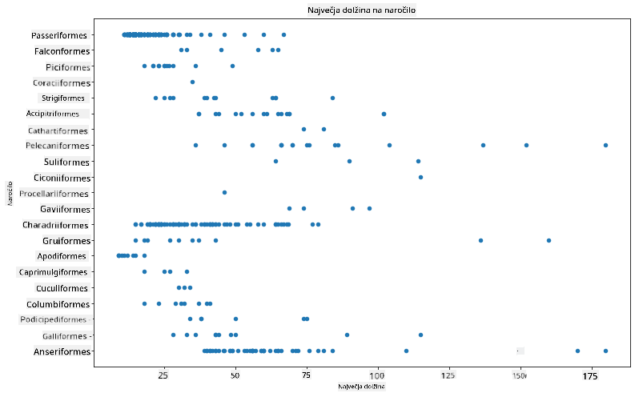
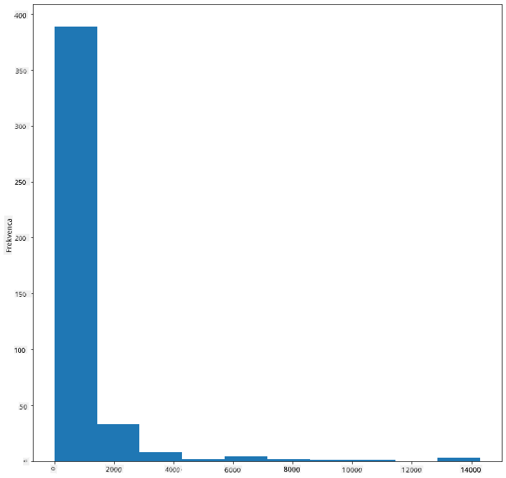
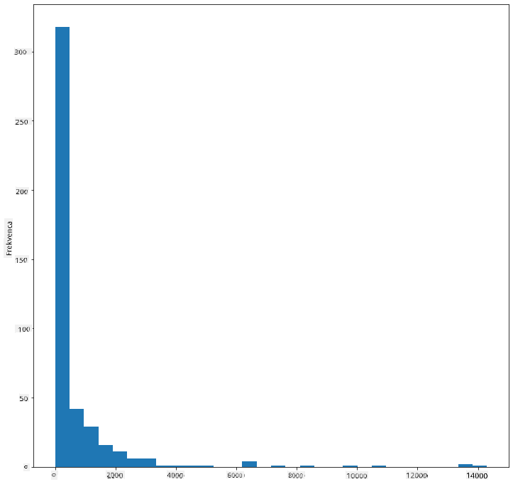
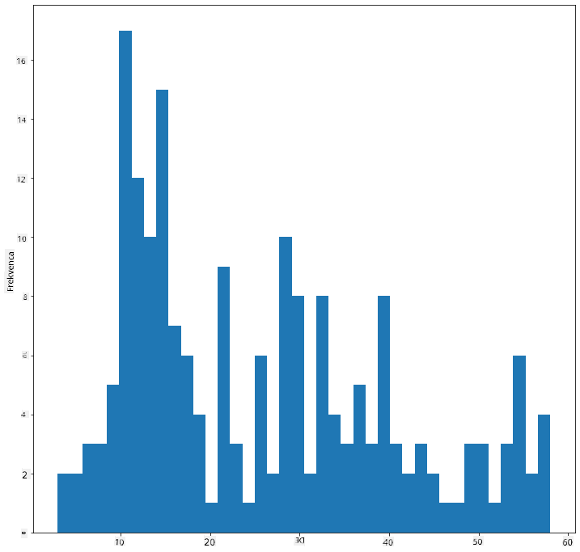
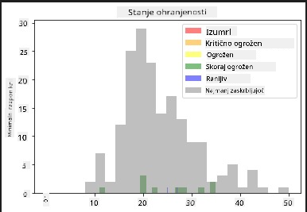
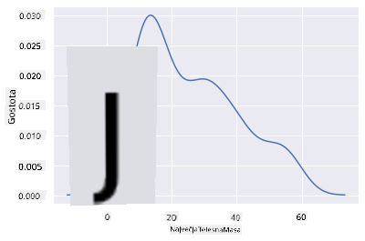
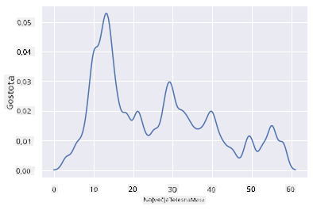
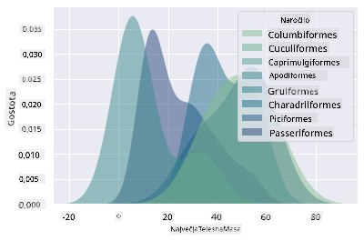
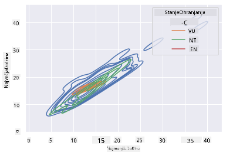

<!--
CO_OP_TRANSLATOR_METADATA:
{
  "original_hash": "87faccac113d772551486a67a607153e",
  "translation_date": "2025-08-30T19:15:05+00:00",
  "source_file": "3-Data-Visualization/10-visualization-distributions/README.md",
  "language_code": "sl"
}
-->
# Vizualizacija porazdelitev

| ](../../sketchnotes/10-Visualizing-Distributions.png)|
|:---:|
| Vizualizacija porazdelitev - _Sketchnote avtorja [@nitya](https://twitter.com/nitya)_ |

V prejšnji lekciji ste izvedeli nekaj zanimivih dejstev o podatkovnem naboru o pticah iz Minnesote. Z vizualizacijo odstopajočih vrednosti ste našli nekaj napačnih podatkov in si ogledali razlike med kategorijami ptic glede na njihovo največjo dolžino.

## [Predlekcijski kviz](https://purple-hill-04aebfb03.1.azurestaticapps.net/quiz/18)
## Raziskovanje podatkovnega nabora ptic

Drug način za raziskovanje podatkov je pogled na njihovo porazdelitev oziroma kako so podatki organizirani vzdolž osi. Morda bi na primer želeli izvedeti več o splošni porazdelitvi največjega razpona kril ali največje telesne mase ptic iz Minnesote v tem podatkovnem naboru.

Odkrijmo nekaj dejstev o porazdelitvah podatkov v tem naboru. V datoteki _notebook.ipynb_ v korenski mapi te lekcije uvozite Pandas, Matplotlib in svoje podatke:

```python
import pandas as pd
import matplotlib.pyplot as plt
birds = pd.read_csv('../../data/birds.csv')
birds.head()
```

|      | Ime                          | ZnanstvenoIme          | Kategorija            | Red          | Družina  | Rod         | StanjeOhranjenosti | MinDolžina | MaxDolžina | MinTelesnaMasa | MaxTelesnaMasa | MinRazponKril | MaxRazponKril |
| ---: | :--------------------------- | :--------------------- | :-------------------- | :----------- | :------- | :---------- | :----------------- | ---------: | ---------: | -------------: | -------------: | ------------: | ------------: |
|    0 | Črno-trebušna žvižgača       | Dendrocygna autumnalis | Race/Gosi/Vodna ptica | Anseriformes | Anatidae | Dendrocygna | LC                 |        47  |        56  |           652  |          1020  |           76  |           94  |
|    1 | Rjava žvižgača               | Dendrocygna bicolor    | Race/Gosi/Vodna ptica | Anseriformes | Anatidae | Dendrocygna | LC                 |        45  |        53  |           712  |          1050  |           85  |           93  |
|    2 | Snežna gos                   | Anser caerulescens     | Race/Gosi/Vodna ptica | Anseriformes | Anatidae | Anser       | LC                 |        64  |        79  |          2050  |          4050  |          135  |          165  |
|    3 | Rossova gos                  | Anser rossii           | Race/Gosi/Vodna ptica | Anseriformes | Anatidae | Anser       | LC                 |      57.3  |        64  |          1066  |          1567  |          113  |          116  |
|    4 | Velika bela čelna gos        | Anser albifrons        | Race/Gosi/Vodna ptica | Anseriformes | Anatidae | Anser       | LC                 |        64  |        81  |          1930  |          3310  |          130  |          165  |

Na splošno lahko hitro pogledate, kako so podatki porazdeljeni, z uporabo razsevnega diagrama, kot smo to storili v prejšnji lekciji:

```python
birds.plot(kind='scatter',x='MaxLength',y='Order',figsize=(12,8))

plt.title('Max Length per Order')
plt.ylabel('Order')
plt.xlabel('Max Length')

plt.show()
```


To daje pregled splošne porazdelitve dolžine telesa po redih ptic, vendar to ni optimalen način za prikaz resničnih porazdelitev. Ta naloga je običajno izvedena z ustvarjanjem histograma.

## Delo s histogrami

Matplotlib ponuja zelo dobre načine za vizualizacijo porazdelitve podatkov z uporabo histogramov. Ta vrsta grafa je podobna stolpičnemu diagramu, kjer je porazdelitev vidna skozi vzpon in padec stolpcev. Za izdelavo histograma potrebujete numerične podatke. Histogram lahko ustvarite tako, da določite vrsto grafa kot 'hist' za histogram. Ta graf prikazuje porazdelitev MaxBodyMass za celoten razpon numeričnih podatkov v naboru. Z razdelitvijo podatkovnega niza na manjše razpone (bins) lahko prikaže porazdelitev vrednosti podatkov:

```python
birds['MaxBodyMass'].plot(kind = 'hist', bins = 10, figsize = (12,12))
plt.show()
```


Kot lahko vidite, večina od 400+ ptic v tem naboru podatkov spada v razpon pod 2000 za njihovo največjo telesno maso. Pridobite več vpogleda v podatke tako, da spremenite parameter `bins` na višjo vrednost, na primer 30:

```python
birds['MaxBodyMass'].plot(kind = 'hist', bins = 30, figsize = (12,12))
plt.show()
```


Ta graf prikazuje porazdelitev na nekoliko bolj podroben način. Manj pristranski graf na levo bi lahko ustvarili tako, da izberete samo podatke znotraj določenega razpona:

Filtrirajte svoje podatke, da dobite samo tiste ptice, katerih telesna masa je pod 60, in prikažite 40 `bins`:

```python
filteredBirds = birds[(birds['MaxBodyMass'] > 1) & (birds['MaxBodyMass'] < 60)]      
filteredBirds['MaxBodyMass'].plot(kind = 'hist',bins = 40,figsize = (12,12))
plt.show()     
```


✅ Preizkusite nekaj drugih filtrov in podatkovnih točk. Če želite videti celotno porazdelitev podatkov, odstranite filter `['MaxBodyMass']`, da prikažete označene porazdelitve.

Histogram ponuja tudi nekaj lepih izboljšav barv in označevanja, ki jih lahko preizkusite:

Ustvarite 2D histogram za primerjavo razmerja med dvema porazdelitvama. Primerjajmo `MaxBodyMass` in `MaxLength`. Matplotlib ponuja vgrajen način za prikaz konvergence z uporabo svetlejših barv:

```python
x = filteredBirds['MaxBodyMass']
y = filteredBirds['MaxLength']

fig, ax = plt.subplots(tight_layout=True)
hist = ax.hist2d(x, y)
```
Zdi se, da obstaja pričakovana korelacija med tema dvema elementoma vzdolž pričakovane osi, z eno posebej močno točko konvergence:


Histogrami dobro delujejo privzeto za numerične podatke. Kaj pa, če morate videti porazdelitve glede na besedilne podatke? 
## Raziskovanje porazdelitev v naboru podatkov z uporabo besedilnih podatkov 

Ta nabor podatkov vključuje tudi dobre informacije o kategoriji ptic ter njihovem rodu, vrsti in družini, pa tudi o njihovem stanju ohranjenosti. Raziščimo te informacije o ohranjenosti. Kakšna je porazdelitev ptic glede na njihovo stanje ohranjenosti?

> ✅ V naboru podatkov je uporabljenih več kratic za opis stanja ohranjenosti. Te kratice izhajajo iz [IUCN Rdečega seznama kategorij](https://www.iucnredlist.org/), organizacije, ki katalogizira stanje vrst.
> 
> - CR: Kritično ogrožena
> - EN: Ogrožena
> - EX: Izumrla
> - LC: Najmanj zaskrbljujoča
> - NT: Skoraj ogrožena
> - VU: Ranljiva

To so besedilne vrednosti, zato boste morali izvesti transformacijo, da ustvarite histogram. Z uporabo podatkovnega okvira filteredBirds prikažite njegovo stanje ohranjenosti skupaj z minimalnim razponom kril. Kaj opazite? 

```python
x1 = filteredBirds.loc[filteredBirds.ConservationStatus=='EX', 'MinWingspan']
x2 = filteredBirds.loc[filteredBirds.ConservationStatus=='CR', 'MinWingspan']
x3 = filteredBirds.loc[filteredBirds.ConservationStatus=='EN', 'MinWingspan']
x4 = filteredBirds.loc[filteredBirds.ConservationStatus=='NT', 'MinWingspan']
x5 = filteredBirds.loc[filteredBirds.ConservationStatus=='VU', 'MinWingspan']
x6 = filteredBirds.loc[filteredBirds.ConservationStatus=='LC', 'MinWingspan']

kwargs = dict(alpha=0.5, bins=20)

plt.hist(x1, **kwargs, color='red', label='Extinct')
plt.hist(x2, **kwargs, color='orange', label='Critically Endangered')
plt.hist(x3, **kwargs, color='yellow', label='Endangered')
plt.hist(x4, **kwargs, color='green', label='Near Threatened')
plt.hist(x5, **kwargs, color='blue', label='Vulnerable')
plt.hist(x6, **kwargs, color='gray', label='Least Concern')

plt.gca().set(title='Conservation Status', ylabel='Min Wingspan')
plt.legend();
```



Zdi se, da ni dobre korelacije med minimalnim razponom kril in stanjem ohranjenosti. Preizkusite druge elemente nabora podatkov z uporabo te metode. Lahko preizkusite tudi različne filtre. Ali najdete kakšno korelacijo?

## Grafi gostote

Morda ste opazili, da so histogrami, ki smo jih do zdaj pregledali, 'stopničasti' in ne tečejo gladko v loku. Za prikaz bolj gladkega grafa gostote lahko poskusite graf gostote.

Za delo z grafi gostote se seznanite z novo knjižnico za risanje, [Seaborn](https://seaborn.pydata.org/generated/seaborn.kdeplot.html). 

Z nalaganjem Seaborn poskusite osnovni graf gostote:

```python
import seaborn as sns
import matplotlib.pyplot as plt
sns.kdeplot(filteredBirds['MinWingspan'])
plt.show()
```


Vidite lahko, kako graf odraža prejšnjega za podatke o minimalnem razponu kril; le da je nekoliko bolj gladek. Po dokumentaciji Seaborn "v primerjavi s histogramom lahko KDE ustvari graf, ki je manj natrpan in bolj razumljiv, še posebej pri risanju več porazdelitev. Vendar pa lahko uvede popačenja, če je osnovna porazdelitev omejena ali ni gladka. Tako kot pri histogramu tudi kakovost predstavitve odvisna od izbire dobrih parametrov glajenja." [vir](https://seaborn.pydata.org/generated/seaborn.kdeplot.html) Z drugimi besedami, odstopajoče vrednosti bodo, kot vedno, povzročile nepravilno obnašanje vaših grafov.

Če bi želeli ponovno pregledati tisto nazobčano črto MaxBodyMass v drugem grafu, ki ste ga ustvarili, bi jo lahko zelo dobro zgladili z uporabo te metode:

```python
sns.kdeplot(filteredBirds['MaxBodyMass'])
plt.show()
```


Če želite gladko, vendar ne preveč gladko črto, uredite parameter `bw_adjust`: 

```python
sns.kdeplot(filteredBirds['MaxBodyMass'], bw_adjust=.2)
plt.show()
```


✅ Preberite o parametrih, ki so na voljo za to vrsto grafa, in eksperimentirajte!

Ta vrsta grafa ponuja čudovito razlagalne vizualizacije. Z nekaj vrsticami kode lahko na primer prikažete gostoto največje telesne mase po redih ptic:

```python
sns.kdeplot(
   data=filteredBirds, x="MaxBodyMass", hue="Order",
   fill=True, common_norm=False, palette="crest",
   alpha=.5, linewidth=0,
)
```



Prav tako lahko na enem grafu prikažete gostoto več spremenljivk. Preizkusite največjo in najmanjšo dolžino ptice v primerjavi z njihovim stanjem ohranjenosti:

```python
sns.kdeplot(data=filteredBirds, x="MinLength", y="MaxLength", hue="ConservationStatus")
```



Morda je vredno raziskati, ali je skupina 'ranljivih' ptic glede na njihove dolžine smiselna ali ne.

## 🚀 Izziv

Histogrami so bolj izpopolnjena vrsta grafa kot osnovni razsevni diagrami, stolpični diagrami ali črtni diagrami. Poiščite na internetu dobre primere uporabe histogramov. Kako se uporabljajo, kaj prikazujejo in na katerih področjih ali področjih raziskovanja se običajno uporabljajo?

## [Po-lekcijski kviz](https://purple-hill-04aebfb03.1.azurestaticapps.net/quiz/19)

## Pregled in samostojno učenje

V tej lekciji ste uporabili Matplotlib in začeli delati s Seaborn za prikaz bolj izpopolnjenih grafov. Raziščite `kdeplot` v Seaborn, "neprekinjeno krivuljo gostote verjetnosti v eni ali več dimenzijah". Preberite [dokumentacijo](https://seaborn.pydata.org/generated/seaborn.kdeplot.html), da razumete, kako deluje.

## Naloga

[Uporabite svoje veščine](assignment.md)

---

**Omejitev odgovornosti**:  
Ta dokument je bil preveden z uporabo storitve za prevajanje z umetno inteligenco [Co-op Translator](https://github.com/Azure/co-op-translator). Čeprav si prizadevamo za natančnost, vas prosimo, da upoštevate, da lahko avtomatizirani prevodi vsebujejo napake ali netočnosti. Izvirni dokument v njegovem maternem jeziku je treba obravnavati kot avtoritativni vir. Za ključne informacije priporočamo profesionalni človeški prevod. Ne prevzemamo odgovornosti za morebitna napačna razumevanja ali napačne interpretacije, ki izhajajo iz uporabe tega prevoda.