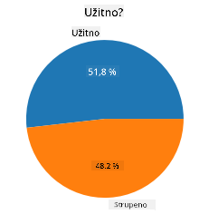
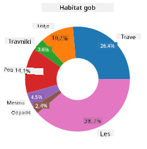
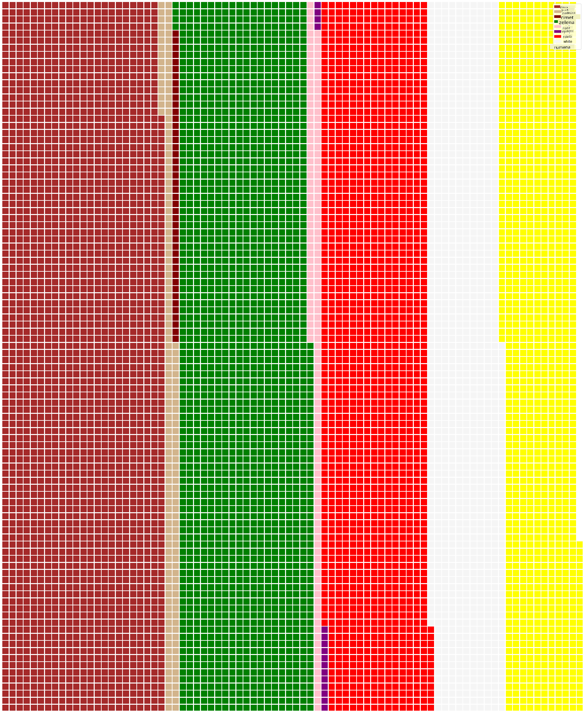

<!--
CO_OP_TRANSLATOR_METADATA:
{
  "original_hash": "af6a12015c6e250e500b570a9fa42593",
  "translation_date": "2025-08-30T18:58:21+00:00",
  "source_file": "3-Data-Visualization/11-visualization-proportions/README.md",
  "language_code": "sl"
}
-->
# Vizualizacija deležev

| ](../../sketchnotes/11-Visualizing-Proportions.png)|
|:---:|
|Vizualizacija deležev - _Sketchnote by [@nitya](https://twitter.com/nitya)_ |

V tej lekciji boste uporabili naravoslovno usmerjen nabor podatkov za vizualizacijo deležev, na primer koliko različnih vrst gliv je prisotnih v danem naboru podatkov o gobah. Raziskali bomo te fascinantne glive z naborom podatkov, pridobljenim iz Audubona, ki vsebuje podrobnosti o 23 vrstah gob z lističi iz družin Agaricus in Lepiota. Eksperimentirali boste z okusnimi vizualizacijami, kot so:

- Torte 🥧
- Krofi 🍩
- Vaflji 🧇

> 💡 Zelo zanimiv projekt [Charticulator](https://charticulator.com) Microsoft Researcha ponuja brezplačen vmesnik za vizualizacijo podatkov z metodo povleci in spusti. V enem od njihovih vaj uporabljajo tudi ta nabor podatkov o gobah! Tako lahko raziskujete podatke in hkrati spoznate knjižnico: [Charticulator tutorial](https://charticulator.com/tutorials/tutorial4.html).

## [Predlekcijski kviz](https://purple-hill-04aebfb03.1.azurestaticapps.net/quiz/20)

## Spoznajte svoje gobe 🍄

Gobe so zelo zanimive. Uvozimo nabor podatkov, da jih preučimo:

```python
import pandas as pd
import matplotlib.pyplot as plt
mushrooms = pd.read_csv('../../data/mushrooms.csv')
mushrooms.head()
```
Izpiše se tabela z odličnimi podatki za analizo:


| razred    | oblika klobuka | površina klobuka | barva klobuka | modrice | vonj     | pritrditev lističev | razmik lističev | velikost lističev | barva lističev | oblika bet | korenina bet | površina nad obročem | površina pod obročem | barva nad obročem | barva pod obročem | tip zastora | barva zastora | število obročev | tip obroča | barva trosnega prahu | populacija | habitat |
| --------- | -------------- | ---------------- | ------------- | ------- | -------- | ------------------- | ---------------- | ----------------- | -------------- | ---------- | ------------ | ------------------- | ------------------- | ---------------- | ---------------- | ---------- | ------------- | -------------- | ---------- | -------------------- | ---------- | ------- |
| Strupena  | Konveksna      | Gladka           | Rjava         | Modrice | Ostri    | Prosta              | Tesna            | Ozka              | Črna           | Povečana   | Enaka        | Gladka              | Gladka              | Bela             | Bela             | Delna      | Bela          | Ena            | Viseča     | Črna                | Razpršena  | Urbana  |
| Užitna    | Konveksna      | Gladka           | Rumena        | Modrice | Mandelj  | Prosta              | Tesna            | Široka            | Črna           | Povečana   | Klub         | Gladka              | Gladka              | Bela             | Bela             | Delna      | Bela          | Ena            | Viseča     | Rjava               | Številna   | Trava   |
| Užitna    | Zvono          | Gladka           | Bela          | Modrice | Janež    | Prosta              | Tesna            | Široka            | Rjava          | Povečana   | Klub         | Gladka              | Gladka              | Bela             | Bela             | Delna      | Bela          | Ena            | Viseča     | Rjava               | Številna   | Travniki |
| Strupena  | Konveksna      | Luskasta         | Bela          | Modrice | Ostri    | Prosta              | Tesna            | Ozka              | Rjava          | Povečana   | Enaka        | Gladka              | Gladka              | Bela             | Bela             | Delna      | Bela          | Ena            | Viseča     | Črna                | Razpršena  | Urbana  |

Takoj opazite, da so vsi podatki besedilni. Te podatke boste morali pretvoriti, da jih boste lahko uporabili v grafu. Večina podatkov je dejansko predstavljena kot objekt:

```python
print(mushrooms.select_dtypes(["object"]).columns)
```

Rezultat je:

```output
Index(['class', 'cap-shape', 'cap-surface', 'cap-color', 'bruises', 'odor',
       'gill-attachment', 'gill-spacing', 'gill-size', 'gill-color',
       'stalk-shape', 'stalk-root', 'stalk-surface-above-ring',
       'stalk-surface-below-ring', 'stalk-color-above-ring',
       'stalk-color-below-ring', 'veil-type', 'veil-color', 'ring-number',
       'ring-type', 'spore-print-color', 'population', 'habitat'],
      dtype='object')
```
Vzemite te podatke in pretvorite stolpec 'razred' v kategorijo:

```python
cols = mushrooms.select_dtypes(["object"]).columns
mushrooms[cols] = mushrooms[cols].astype('category')
```

```python
edibleclass=mushrooms.groupby(['class']).count()
edibleclass
```

Zdaj, če izpišete podatke o gobah, lahko vidite, da so razvrščeni v kategorije glede na razred strupenosti/užitnosti:


|           | oblika klobuka | površina klobuka | barva klobuka | modrice | vonj | pritrditev lističev | razmik lističev | velikost lističev | barva lističev | oblika bet | ... | površina pod obročem | barva nad obročem | barva pod obročem | tip zastora | barva zastora | število obročev | tip obroča | barva trosnega prahu | populacija | habitat |
| --------- | -------------- | ---------------- | ------------- | ------- | ---- | ------------------- | ---------------- | ----------------- | -------------- | ---------- | --- | ------------------- | ---------------- | ---------------- | ---------- | ------------- | -------------- | ---------- | -------------------- | ---------- | ------- |
| razred    |                |                  |               |         |      |                     |                  |                   |                |            |     |                     |                  |                  |            |               |                |            |                    |            |         |
| Užitna    | 4208           | 4208             | 4208          | 4208    | 4208 | 4208                | 4208             | 4208              | 4208           | 4208       | ... | 4208               | 4208             | 4208             | 4208       | 4208          | 4208           | 4208       | 4208               | 4208       | 4208    |
| Strupena  | 3916           | 3916             | 3916          | 3916    | 3916 | 3916                | 3916             | 3916              | 3916           | 3916       | ... | 3916               | 3916             | 3916             | 3916       | 3916          | 3916           | 3916       | 3916               | 3916       | 3916    |

Če sledite vrstnemu redu, predstavljenemu v tej tabeli, da ustvarite oznake kategorij razreda, lahko ustvarite tortni graf:

## Torta!

```python
labels=['Edible','Poisonous']
plt.pie(edibleclass['population'],labels=labels,autopct='%.1f %%')
plt.title('Edible?')
plt.show()
```
Voila, tortni graf, ki prikazuje deleže teh podatkov glede na dva razreda gob. Zelo pomembno je, da pravilno določite vrstni red oznak, še posebej tukaj, zato preverite vrstni red, s katerim je zgrajeno polje oznak!



## Krofi!

Vizualno nekoliko bolj zanimiv tortni graf je krofni graf, ki je tortni graf z luknjo v sredini. Poglejmo naše podatke s to metodo.

Oglejte si različna življenjska okolja, kjer rastejo gobe:

```python
habitat=mushrooms.groupby(['habitat']).count()
habitat
```
Tukaj razvrščate podatke glede na habitat. Naštetih je 7, zato jih uporabite kot oznake za krofni graf:

```python
labels=['Grasses','Leaves','Meadows','Paths','Urban','Waste','Wood']

plt.pie(habitat['class'], labels=labels,
        autopct='%1.1f%%', pctdistance=0.85)
  
center_circle = plt.Circle((0, 0), 0.40, fc='white')
fig = plt.gcf()

fig.gca().add_artist(center_circle)
  
plt.title('Mushroom Habitats')
  
plt.show()
```



Ta koda nariše graf in osrednji krog, nato pa doda ta osrednji krog v graf. Širino osrednjega kroga lahko uredite tako, da spremenite `0.40` v drugo vrednost.

Krofni grafi se lahko prilagodijo na več načinov, da spremenite oznake. Oznake lahko zlasti poudarite za boljšo berljivost. Več o tem si preberite v [dokumentaciji](https://matplotlib.org/stable/gallery/pie_and_polar_charts/pie_and_donut_labels.html?highlight=donut).

Zdaj, ko veste, kako razvrstiti podatke in jih nato prikazati kot torto ali krof, lahko raziščete druge vrste grafov. Poskusite vafeljni graf, ki je le drugačen način raziskovanja količine.
## Vaflji!

Graf tipa 'vafelj' je drugačen način vizualizacije količin kot 2D matrika kvadratov. Poskusite vizualizirati različne količine barv klobukov gob v tem naboru podatkov. Za to morate namestiti pomožno knjižnico [PyWaffle](https://pypi.org/project/pywaffle/) in uporabiti Matplotlib:

```python
pip install pywaffle
```

Izberite segment svojih podatkov za razvrščanje:

```python
capcolor=mushrooms.groupby(['cap-color']).count()
capcolor
```

Ustvarite vafeljni graf z ustvarjanjem oznak in nato razvrščanjem podatkov:

```python
import pandas as pd
import matplotlib.pyplot as plt
from pywaffle import Waffle
  
data ={'color': ['brown', 'buff', 'cinnamon', 'green', 'pink', 'purple', 'red', 'white', 'yellow'],
    'amount': capcolor['class']
     }
  
df = pd.DataFrame(data)
  
fig = plt.figure(
    FigureClass = Waffle,
    rows = 100,
    values = df.amount,
    labels = list(df.color),
    figsize = (30,30),
    colors=["brown", "tan", "maroon", "green", "pink", "purple", "red", "whitesmoke", "yellow"],
)
```

Z uporabo vafeljnega grafa lahko jasno vidite deleže barv klobukov v tem naboru podatkov o gobah. Zanimivo je, da je veliko gob z zelenimi klobuki!



✅ Pywaffle podpira ikone znotraj grafov, ki uporabljajo katero koli ikono, ki je na voljo v [Font Awesome](https://fontawesome.com/). Naredite nekaj eksperimentov, da ustvarite še bolj zanimiv vafeljni graf z uporabo ikon namesto kvadratov.

V tej lekciji ste spoznali tri načine vizualizacije deležev. Najprej morate razvrstiti podatke v kategorije in nato odločiti, kateri način prikaza podatkov je najboljši - torta, krof ali vafelj. Vsi so okusni in uporabniku takoj ponudijo vpogled v nabor podatkov.

## 🚀 Izziv

Poskusite poustvariti te okusne grafe v [Charticulator](https://charticulator.com).
## [Po-lekcijski kviz](https://purple-hill-04aebfb03.1.azurestaticapps.net/quiz/21)

## Pregled & Samostojno učenje

Včasih ni očitno, kdaj uporabiti tortni, krofni ali vafeljni graf. Tukaj je nekaj člankov za branje na to temo:

https://www.beautiful.ai/blog/battle-of-the-charts-pie-chart-vs-donut-chart

https://medium.com/@hypsypops/pie-chart-vs-donut-chart-showdown-in-the-ring-5d24fd86a9ce

https://www.mit.edu/~mbarker/formula1/f1help/11-ch-c6.htm

https://medium.datadriveninvestor.com/data-visualization-done-the-right-way-with-tableau-waffle-chart-fdf2a19be402

Raziskujte, da najdete več informacij o tej težki odločitvi.
## Naloga

[Poskusite v Excelu](assignment.md)

---

**Omejitev odgovornosti**:  
Ta dokument je bil preveden z uporabo storitve za prevajanje z umetno inteligenco [Co-op Translator](https://github.com/Azure/co-op-translator). Čeprav si prizadevamo za natančnost, vas prosimo, da upoštevate, da lahko avtomatizirani prevodi vsebujejo napake ali netočnosti. Izvirni dokument v njegovem izvirnem jeziku je treba obravnavati kot avtoritativni vir. Za ključne informacije priporočamo profesionalni človeški prevod. Ne prevzemamo odgovornosti za morebitna nesporazumevanja ali napačne razlage, ki bi nastale zaradi uporabe tega prevoda.