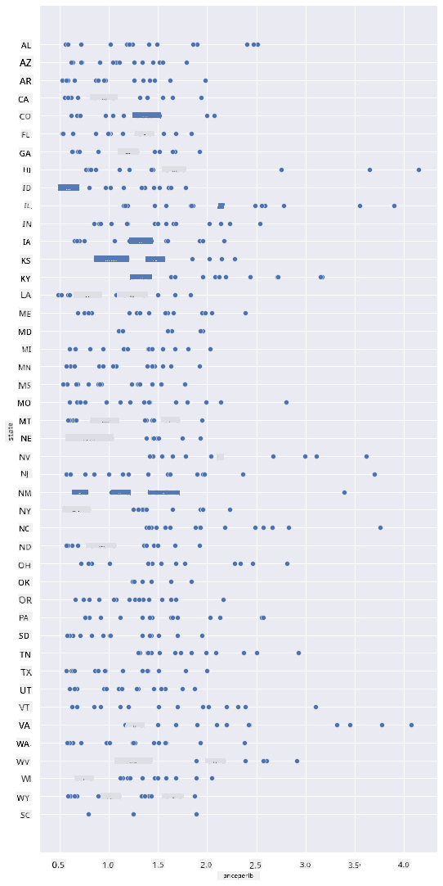
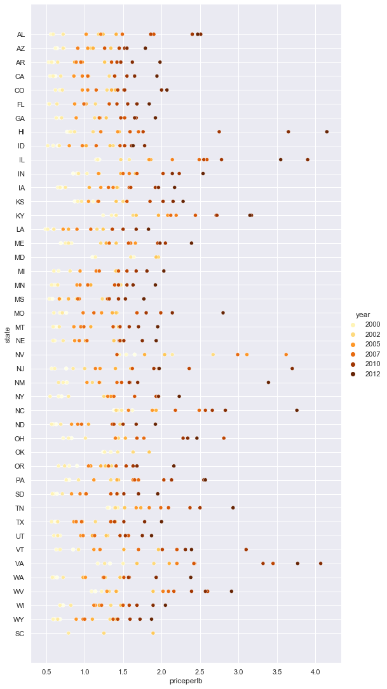
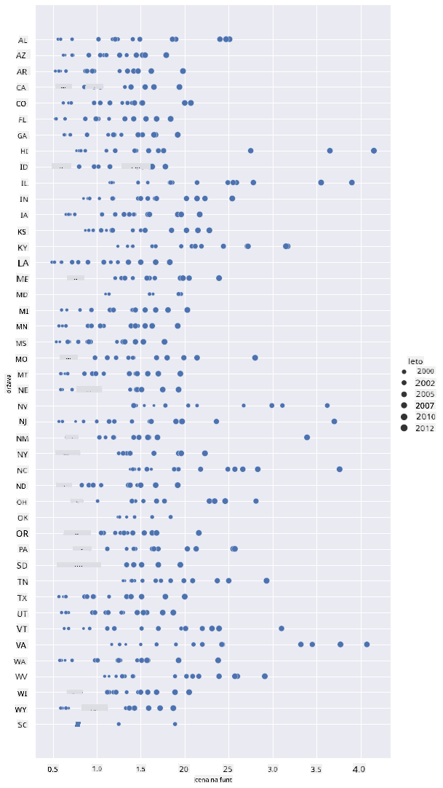
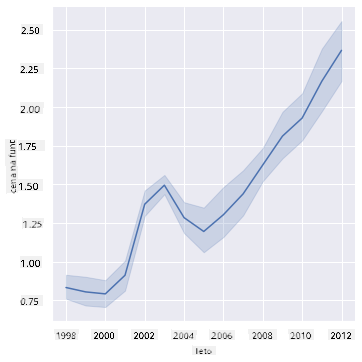
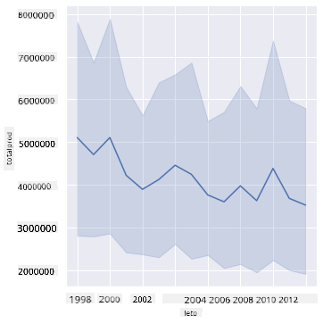
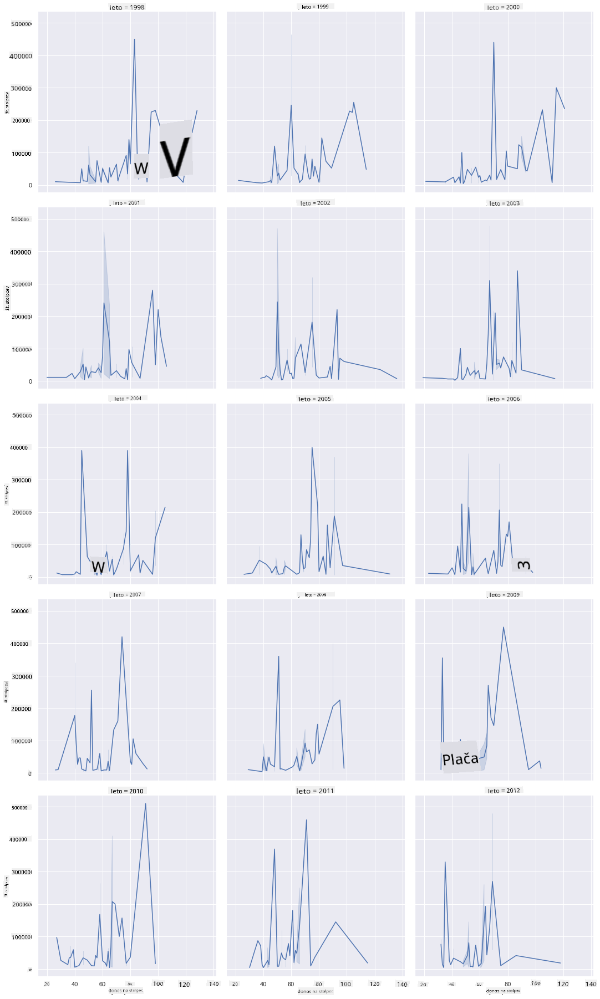
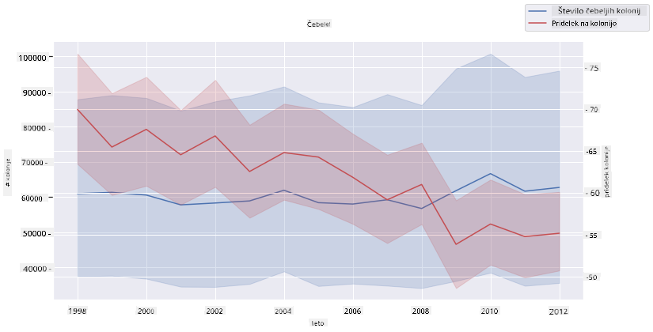

<!--
CO_OP_TRANSLATOR_METADATA:
{
  "original_hash": "cad419b574d5c35eaa417e9abfdcb0c8",
  "translation_date": "2025-08-30T19:11:22+00:00",
  "source_file": "3-Data-Visualization/12-visualization-relationships/README.md",
  "language_code": "sl"
}
-->
# Vizualizacija odnosov: Vse o medu 🍯

| ](../../sketchnotes/12-Visualizing-Relationships.png)|
|:---:|
|Vizualizacija odnosov - _Sketchnote avtorja [@nitya](https://twitter.com/nitya)_ |

Nadaljujmo z naravoslovno usmeritvijo našega raziskovanja in odkrijmo zanimive vizualizacije, ki prikazujejo odnose med različnimi vrstami medu, na podlagi podatkovne zbirke, pridobljene iz [Ministrstva za kmetijstvo Združenih držav Amerike](https://www.nass.usda.gov/About_NASS/index.php).

Ta podatkovna zbirka, ki vsebuje približno 600 postavk, prikazuje proizvodnjo medu v številnih zveznih državah ZDA. Na primer, lahko si ogledate število čebeljih družin, donos na družino, skupno proizvodnjo, zaloge, ceno na funt in vrednost proizvedenega medu v določeni državi od leta 1998 do 2012, pri čemer vsaka vrstica predstavlja eno leto za posamezno državo.

Zanimivo bo vizualizirati odnos med letno proizvodnjo določene države in, na primer, ceno medu v tej državi. Alternativno bi lahko prikazali odnos med donosom medu na družino v različnih državah. To časovno obdobje zajema tudi uničujočo 'motnjo propada čebeljih družin' (CCD), ki so jo prvič opazili leta 2006 (http://npic.orst.edu/envir/ccd.html), zato je to ganljiva podatkovna zbirka za raziskovanje. 🐝

## [Pred-predavanjski kviz](https://purple-hill-04aebfb03.1.azurestaticapps.net/quiz/22)

V tej lekciji lahko uporabite knjižnico Seaborn, ki ste jo že uporabljali, kot odlično orodje za vizualizacijo odnosov med spremenljivkami. Posebej zanimiva je uporaba funkcije `relplot` v Seabornu, ki omogoča hitro ustvarjanje razpršenih in linijskih grafov za prikaz '[statističnih odnosov](https://seaborn.pydata.org/tutorial/relational.html?highlight=relationships)', kar podatkovnemu znanstveniku omogoča boljše razumevanje, kako so spremenljivke med seboj povezane.

## Razpršeni grafi

Uporabite razpršeni graf za prikaz, kako se je cena medu razvijala iz leta v leto po posameznih državah. Seaborn z uporabo `relplot` priročno združuje podatke držav in prikazuje točke za tako kategorialne kot numerične podatke.

Začnimo z uvozom podatkov in knjižnice Seaborn:

```python
import pandas as pd
import matplotlib.pyplot as plt
import seaborn as sns
honey = pd.read_csv('../../data/honey.csv')
honey.head()
```
Opazili boste, da ima podatkovna zbirka o medu več zanimivih stolpcev, vključno z letom in ceno na funt. Raziščimo te podatke, združene po zveznih državah ZDA:

| država | št. družin | donos na družino | skupna proizvodnja | zaloge   | cena na funt | vrednost proizvodnje | leto |
| ------ | ---------- | ---------------- | ------------------ | -------- | ------------ | -------------------- | ---- |
| AL     | 16000      | 71              | 1136000           | 159000   | 0.72         | 818000               | 1998 |
| AZ     | 55000      | 60              | 3300000           | 1485000  | 0.64         | 2112000              | 1998 |
| AR     | 53000      | 65              | 3445000           | 1688000  | 0.59         | 2033000              | 1998 |
| CA     | 450000     | 83              | 37350000          | 12326000 | 0.62         | 23157000             | 1998 |
| CO     | 27000      | 72              | 1944000           | 1594000  | 0.7          | 1361000              | 1998 |

Ustvarite osnovni razpršeni graf za prikaz odnosa med ceno na funt medu in državo izvora. Osi `y` nastavite tako, da bo dovolj visoka za prikaz vseh držav:

```python
sns.relplot(x="priceperlb", y="state", data=honey, height=15, aspect=.5);
```


Zdaj prikažite iste podatke z barvno shemo, ki ponazarja, kako se cena spreminja skozi leta. To lahko storite z dodajanjem parametra 'hue', ki prikazuje spremembe iz leta v leto:

> ✅ Več o [barvnih paletah, ki jih lahko uporabite v Seabornu](https://seaborn.pydata.org/tutorial/color_palettes.html) - preizkusite čudovito mavrično barvno shemo!

```python
sns.relplot(x="priceperlb", y="state", hue="year", palette="YlOrBr", data=honey, height=15, aspect=.5);
```


S to spremembo barvne sheme lahko jasno vidite močan trend naraščanja cene medu na funt skozi leta. Če preverite vzorec podatkov (na primer za državo Arizona), lahko opazite vzorec zviševanja cen iz leta v leto, z nekaj izjemami:

| država | št. družin | donos na družino | skupna proizvodnja | zaloge  | cena na funt | vrednost proizvodnje | leto |
| ------ | ---------- | ---------------- | ------------------ | ------- | ------------ | -------------------- | ---- |
| AZ     | 55000      | 60              | 3300000           | 1485000 | 0.64         | 2112000              | 1998 |
| AZ     | 52000      | 62              | 3224000           | 1548000 | 0.62         | 1999000              | 1999 |
| AZ     | 40000      | 59              | 2360000           | 1322000 | 0.73         | 1723000              | 2000 |
| AZ     | 43000      | 59              | 2537000           | 1142000 | 0.72         | 1827000              | 2001 |
| AZ     | 38000      | 63              | 2394000           | 1197000 | 1.08         | 2586000              | 2002 |
| AZ     | 35000      | 72              | 2520000           | 983000  | 1.34         | 3377000              | 2003 |
| AZ     | 32000      | 55              | 1760000           | 774000  | 1.11         | 1954000              | 2004 |
| AZ     | 36000      | 50              | 1800000           | 720000  | 1.04         | 1872000              | 2005 |
| AZ     | 30000      | 65              | 1950000           | 839000  | 0.91         | 1775000              | 2006 |
| AZ     | 30000      | 64              | 1920000           | 902000  | 1.26         | 2419000              | 2007 |
| AZ     | 25000      | 64              | 1600000           | 336000  | 1.26         | 2016000              | 2008 |
| AZ     | 20000      | 52              | 1040000           | 562000  | 1.45         | 1508000              | 2009 |
| AZ     | 24000      | 77              | 1848000           | 665000  | 1.52         | 2809000              | 2010 |
| AZ     | 23000      | 53              | 1219000           | 427000  | 1.55         | 1889000              | 2011 |
| AZ     | 22000      | 46              | 1012000           | 253000  | 1.79         | 1811000              | 2012 |

Drug način za prikaz tega trenda je uporaba velikosti namesto barve. Za uporabnike z barvno slepoto je to morda boljša možnost. Prilagodite vizualizacijo tako, da povečanje cene prikažete z večanjem obsega točk:

```python
sns.relplot(x="priceperlb", y="state", size="year", data=honey, height=15, aspect=.5);
```
Vidite lahko, da se velikost točk postopoma povečuje.



Je to preprost primer ponudbe in povpraševanja? Zaradi dejavnikov, kot so podnebne spremembe in propad čebeljih družin, je morda na voljo manj medu za nakup, kar povzroča zvišanje cen?

Za odkrivanje korelacije med nekaterimi spremenljivkami v tej podatkovni zbirki raziščimo nekaj linijskih grafov.

## Linijski grafi

Vprašanje: Ali obstaja jasen trend naraščanja cene medu na funt iz leta v leto? To lahko najlažje odkrijete z ustvarjanjem enega samega linijskega grafa:

```python
sns.relplot(x="year", y="priceperlb", kind="line", data=honey);
```
Odgovor: Da, z nekaj izjemami okoli leta 2003:



✅ Ker Seaborn združuje podatke okoli ene linije, prikazuje "več meritev za vsako vrednost x z izrisom povprečja in 95-odstotnega intervala zaupanja okoli povprečja". [Vir](https://seaborn.pydata.org/tutorial/relational.html). To časovno zahtevno vedenje lahko onemogočite z dodajanjem `ci=None`.

Vprašanje: No, ali lahko leta 2003 opazimo tudi porast zaloge medu? Kaj pa, če pogledate skupno proizvodnjo iz leta v leto?

```python
sns.relplot(x="year", y="totalprod", kind="line", data=honey);
```



Odgovor: Ne ravno. Če pogledate skupno proizvodnjo, se zdi, da se je v tem letu dejansko povečala, čeprav se na splošno količina proizvedenega medu v teh letih zmanjšuje.

Vprašanje: V tem primeru, kaj bi lahko povzročilo porast cene medu okoli leta 2003?

Za odkrivanje tega lahko raziščete mrežo faset.

## Mreže faset

Mreže faset vzamejo en vidik vaše podatkovne zbirke (v našem primeru lahko izberete 'leto', da se izognete prevelikemu številu faset). Seaborn nato ustvari graf za vsako od teh faset z izbranimi x in y koordinatami za lažjo vizualno primerjavo. Ali leto 2003 izstopa v tej vrsti primerjave?

Ustvarite mrežo faset z nadaljevanjem uporabe `relplot`, kot je priporočeno v [dokumentaciji Seaborn](https://seaborn.pydata.org/generated/seaborn.FacetGrid.html?highlight=facetgrid#seaborn.FacetGrid).

```python
sns.relplot(
    data=honey, 
    x="yieldpercol", y="numcol",
    col="year", 
    col_wrap=3,
    kind="line"
```
V tej vizualizaciji lahko primerjate donos na družino in število družin iz leta v leto, ena ob drugi, z nastavitvijo 'wrap' na 3 za stolpce:



Za to podatkovno zbirko nič posebej ne izstopa glede števila družin in njihovega donosa iz leta v leto ter med državami. Ali obstaja drugačen način za iskanje korelacije med tema dvema spremenljivkama?

## Dvovrstični grafi

Poskusite večvrstični graf tako, da prekrivate dva linijska grafa enega na drugega, uporabite Seabornov 'despine' za odstranitev zgornjih in desnih osi ter uporabite `ax.twinx` [iz Matplotliba](https://matplotlib.org/stable/api/_as_gen/matplotlib.axes.Axes.twinx.html). Twinx omogoča grafu, da deli os x in prikaže dve osi y. Tako prikažite donos na družino in število družin, prekrivajoče:

```python
fig, ax = plt.subplots(figsize=(12,6))
lineplot = sns.lineplot(x=honey['year'], y=honey['numcol'], data=honey, 
                        label = 'Number of bee colonies', legend=False)
sns.despine()
plt.ylabel('# colonies')
plt.title('Honey Production Year over Year');

ax2 = ax.twinx()
lineplot2 = sns.lineplot(x=honey['year'], y=honey['yieldpercol'], ax=ax2, color="r", 
                         label ='Yield per colony', legend=False) 
sns.despine(right=False)
plt.ylabel('colony yield')
ax.figure.legend();
```


Čeprav nič posebej ne izstopa okoli leta 2003, nam to omogoča, da zaključimo to lekcijo na nekoliko bolj optimistični noti: čeprav se število družin na splošno zmanjšuje, se število družin stabilizira, tudi če njihov donos na družino upada.

Naprej, čebele, naprej!

🐝❤️
## 🚀 Izziv

V tej lekciji ste izvedeli več o uporabi razpršenih grafov in mrež faset, vključno z mrežami faset. Izzovite se in ustvarite mrežo faset z uporabo druge podatkovne zbirke, morda tiste, ki ste jo uporabili v prejšnjih lekcijah. Opazujte, koliko časa traja njihova izdelava in kako morate biti previdni glede števila mrež, ki jih ustvarite s temi tehnikami.
## [Po-predavanjski kviz](https://purple-hill-04aebfb03.1.azurestaticapps.net/quiz/23)

## Pregled in samostojno učenje

Linijski grafi so lahko preprosti ali precej zapleteni. Preberite več v [dokumentaciji Seaborn](https://seaborn.pydata.org/generated/seaborn.lineplot.html) o različnih načinih, kako jih lahko zgradite. Poskusite izboljšati linijske grafe, ki ste jih ustvarili v tej lekciji, z drugimi metodami, navedenimi v dokumentaciji.
## Naloga

[Potopite se v čebelnjak](assignment.md)

---

**Omejitev odgovornosti**:  
Ta dokument je bil preveden z uporabo storitve za prevajanje z umetno inteligenco [Co-op Translator](https://github.com/Azure/co-op-translator). Čeprav si prizadevamo za natančnost, vas prosimo, da upoštevate, da lahko avtomatizirani prevodi vsebujejo napake ali netočnosti. Izvirni dokument v njegovem maternem jeziku je treba obravnavati kot avtoritativni vir. Za ključne informacije priporočamo profesionalni človeški prevod. Ne prevzemamo odgovornosti za morebitna napačna razumevanja ali napačne interpretacije, ki bi nastale zaradi uporabe tega prevoda.