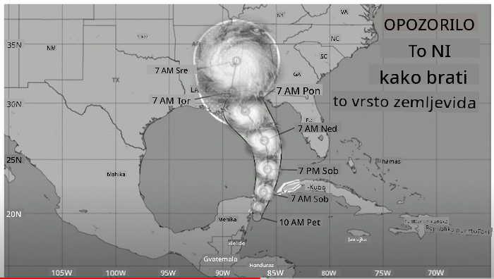
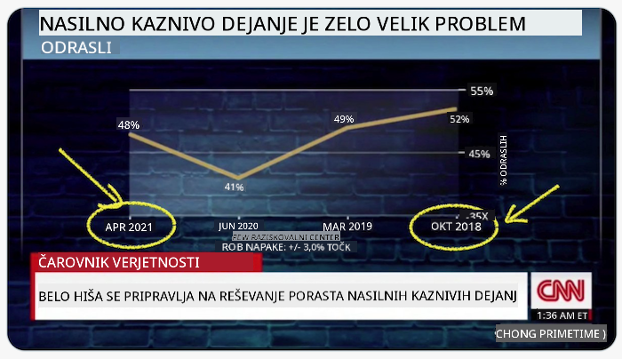
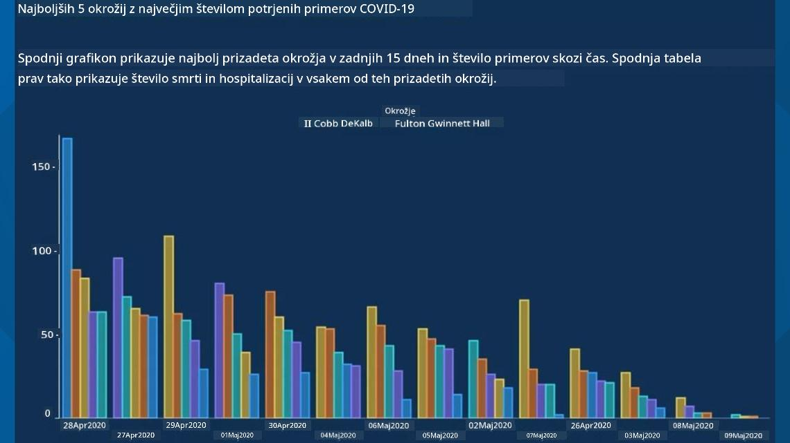
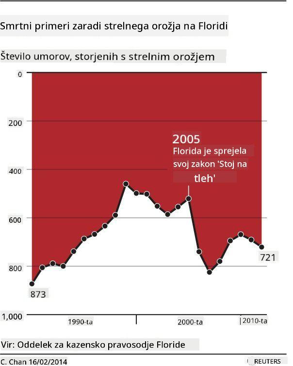
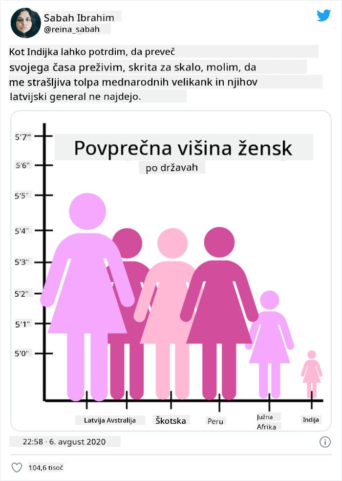
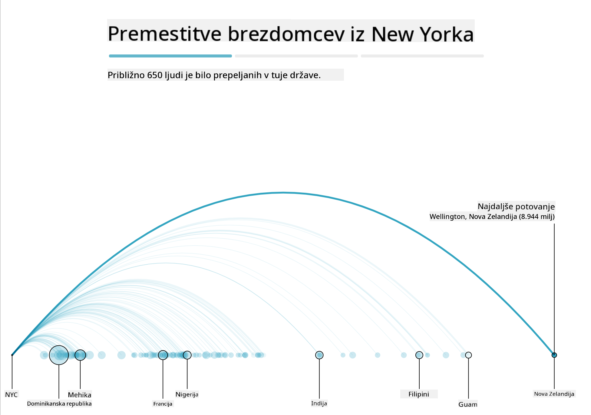
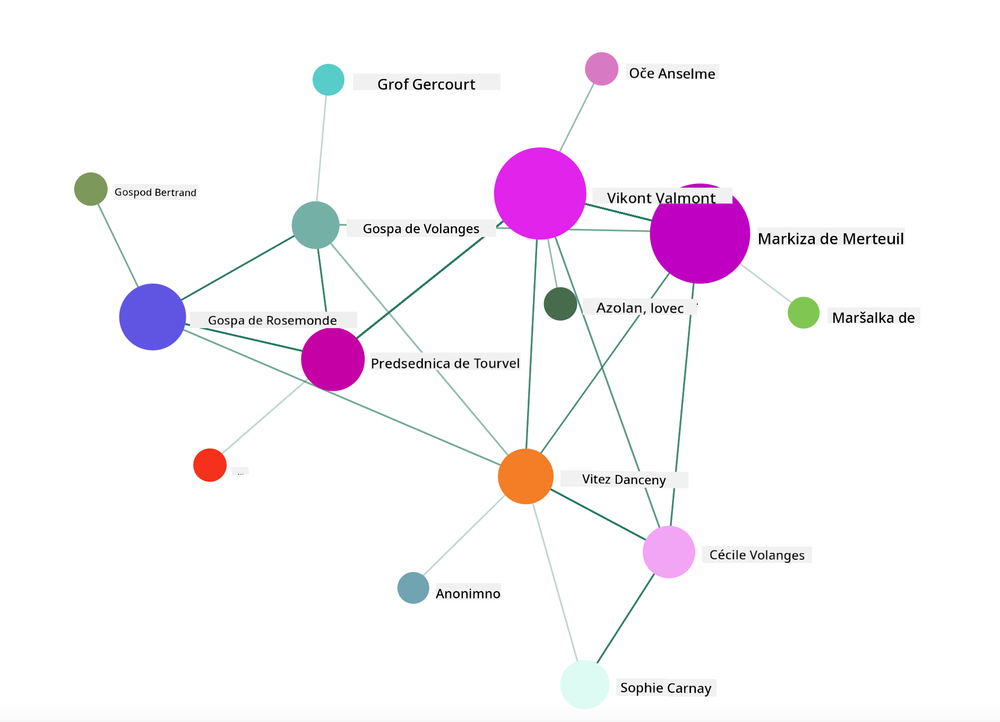

<!--
CO_OP_TRANSLATOR_METADATA:
{
  "original_hash": "4ec4747a9f4f7d194248ea29903ae165",
  "translation_date": "2025-08-30T19:06:22+00:00",
  "source_file": "3-Data-Visualization/13-meaningful-visualizations/README.md",
  "language_code": "sl"
}
-->
# Ustvarjanje smiselnih vizualizacij

| ](../../sketchnotes/13-MeaningfulViz.png)|
|:---:|
| Smiselne vizualizacije - _Sketchnote avtorja [@nitya](https://twitter.com/nitya)_ |

> "Če dovolj dolgo mučiš podatke, bodo priznali karkoli." -- [Ronald Coase](https://en.wikiquote.org/wiki/Ronald_Coase)

Ena osnovnih veščin podatkovnega znanstvenika je sposobnost ustvarjanja smiselnih vizualizacij podatkov, ki pomagajo odgovoriti na zastavljena vprašanja. Preden vizualizirate svoje podatke, morate poskrbeti, da so očiščeni in pripravljeni, kot ste to storili v prejšnjih lekcijah. Šele nato lahko začnete razmišljati, kako najbolje predstaviti podatke.

V tej lekciji boste pregledali:

1. Kako izbrati pravi tip grafa
2. Kako se izogniti zavajajočim grafom
3. Kako delati z barvami
4. Kako oblikovati grafe za boljšo berljivost
5. Kako ustvariti animirane ali 3D rešitve za grafe
6. Kako ustvariti kreativno vizualizacijo

## [Predlekcijski kviz](https://purple-hill-04aebfb03.1.azurestaticapps.net/quiz/24)

## Izberite pravi tip grafa

V prejšnjih lekcijah ste eksperimentirali z ustvarjanjem različnih zanimivih vizualizacij podatkov z uporabo knjižnic Matplotlib in Seaborn. Na splošno lahko izberete [pravi tip grafa](https://chartio.com/learn/charts/how-to-select-a-data-vizualization/) glede na vprašanje, ki ga zastavljate, s pomočjo te tabele:

| Potrebujete:               | Uporabite:                      |
| -------------------------- | ------------------------------- |
| Prikazati trende skozi čas | Črta                            |
| Primerjati kategorije      | Stolpec, Torta                  |
| Primerjati skupne vrednosti| Torta, Zloženi stolpec          |
| Prikazati odnose           | Raztresen, Črta, Facet, Dvojna črta |
| Prikazati porazdelitve     | Raztresen, Histogram, Box       |
| Prikazati deleže           | Torta, Krofi, Waffle            |

> ✅ Glede na sestavo vaših podatkov boste morda morali pretvoriti besedilo v številke, da bo določen graf deloval.

## Izogibajte se zavajanju

Tudi če podatkovni znanstvenik skrbno izbere pravi graf za prave podatke, obstaja veliko načinov, kako lahko podatke prikaže na način, ki podpira določeno stališče, pogosto na račun resničnosti podatkov. Obstaja veliko primerov zavajajočih grafov in infografik!

[](https://www.youtube.com/watch?v=oX74Nge8Wkw "Kako grafi lažejo")

> 🎥 Kliknite zgornjo sliko za konferenčno predavanje o zavajajočih grafih

Ta graf obrne os X, da prikaže nasprotje resnice glede na datum:



[Ta graf](https://media.firstcoastnews.com/assets/WTLV/images/170ae16f-4643-438f-b689-50d66ca6a8d8/170ae16f-4643-438f-b689-50d66ca6a8d8_1140x641.jpg) je še bolj zavajajoč, saj oko pritegne desno stran, kar daje vtis, da so se primeri COVID-a v različnih okrožjih sčasoma zmanjšali. Če pa natančno pogledate datume, ugotovite, da so bili preurejeni, da bi ustvarili zavajajoč trend navzdol.



Ta zloglasni primer uporablja barvo IN obrnjeno os Y za zavajanje: namesto da bi sklepali, da so se smrti zaradi strelnega orožja povečale po sprejetju zakonodaje, ki podpira orožje, je oko zavedeno, da misli nasprotno:



Ta nenavaden graf prikazuje, kako je mogoče manipulirati s proporcijami, kar vodi do smešnih rezultatov:



Primerjava neprimerljivega je še en sumljiv trik. Obstaja [čudovita spletna stran](https://tylervigen.com/spurious-correlations), ki prikazuje 'lažne korelacije', kot je povezava med stopnjo ločitev v Maineu in porabo margarine. Skupina na Redditu prav tako zbira [grde primere](https://www.reddit.com/r/dataisugly/top/?t=all) uporabe podatkov.

Pomembno je razumeti, kako zlahka lahko oko zavedejo zavajajoči grafi. Tudi če so nameni podatkovnega znanstvenika dobri, lahko izbira napačnega tipa grafa, kot je tortni graf z preveč kategorijami, povzroči zavajanje.

## Barve

Kot ste videli v zgornjem grafu o 'nasilju s strelnim orožjem na Floridi', lahko barva doda dodatno plast pomena grafom, še posebej tistim, ki niso zasnovani z uporabo knjižnic, kot sta Matplotlib in Seaborn, ki vključujeta preverjene barvne knjižnice in palete. Če graf izdelujete ročno, si vzemite čas za študij [teorije barv](https://colormatters.com/color-and-design/basic-color-theory).

> ✅ Zavedajte se, da je pri oblikovanju grafov dostopnost pomemben vidik vizualizacije. Nekateri vaši uporabniki so lahko barvno slepi - ali je vaš graf berljiv za uporabnike z vidnimi ovirami?

Bodite previdni pri izbiri barv za svoj graf, saj lahko barva prenaša pomen, ki ga morda niste nameravali. 'Rožnate dame' v zgornjem grafu o 'višini' prenašajo izrazito 'ženski' pomen, kar še povečuje nenavadnost samega grafa.

Čeprav se [pomen barv](https://colormatters.com/color-symbolism/the-meanings-of-colors) lahko razlikuje glede na del sveta in se spreminja glede na odtenek, na splošno barve pomenijo:

| Barva  | Pomen               |
| ------ | ------------------- |
| rdeča  | moč                |
| modra  | zaupanje, lojalnost |
| rumena | sreča, previdnost  |
| zelena | ekologija, sreča, zavist |
| vijolična | sreča            |
| oranžna | živahnost          |

Če morate ustvariti graf z lastnimi barvami, poskrbite, da bodo vaši grafi dostopni in da barve, ki jih izberete, ustrezajo sporočilu, ki ga želite posredovati.

## Oblikovanje grafov za boljšo berljivost

Grafi niso smiselni, če niso berljivi! Vzemite si trenutek za prilagoditev širine in višine grafa, da se dobro prilagodi vašim podatkom. Če morate prikazati veliko spremenljivk (npr. vseh 50 zveznih držav), jih prikažite navpično na osi Y, če je mogoče, da se izognete vodoravnemu pomikanju.

Označite osi, dodajte legendo, če je potrebno, in ponudite orodja za boljše razumevanje podatkov.

Če so vaši podatki na osi X besedilni in obsežni, lahko besedilo nagnite za boljšo berljivost. [Matplotlib](https://matplotlib.org/stable/tutorials/toolkits/mplot3d.html) omogoča 3D risanje, če vaši podatki to podpirajo. S sofisticiranimi vizualizacijami podatkov lahko ustvarite z uporabo `mpl_toolkits.mplot3d`.


## Animacija in prikaz 3D grafov

Nekatere najboljše vizualizacije podatkov danes so animirane. Shirley Wu je ustvarila neverjetne vizualizacije z D3, kot je '[film flowers](http://bl.ocks.org/sxywu/raw/d612c6c653fb8b4d7ff3d422be164a5d/)', kjer vsak cvet predstavlja film. Drug primer za Guardian je 'bussed out', interaktivna izkušnja, ki združuje vizualizacije z Greensock in D3 ter format članka za prikaz, kako NYC rešuje problem brezdomcev z njihovim prevozom iz mesta.



> "Bussed Out: Kako Amerika premika svoje brezdomce" iz [Guardiana](https://www.theguardian.com/us-news/ng-interactive/2017/dec/20/bussed-out-america-moves-homeless-people-country-study). Vizualizacije avtorjev Nadieh Bremer & Shirley Wu

Čeprav ta lekcija ne gre dovolj v globino, da bi vas naučila teh močnih knjižnic za vizualizacijo, poskusite uporabiti D3 v aplikaciji Vue.js z uporabo knjižnice za prikaz vizualizacije knjige "Nevarna razmerja" kot animirano socialno omrežje.

> "Les Liaisons Dangereuses" je epistolarni roman, predstavljen kot serija pisem. Napisal ga je Choderlos de Laclos leta 1782 in pripoveduje zgodbo o zlobnih, moralno pokvarjenih družbenih manevrih dveh protagonistov francoske aristokracije v poznem 18. stoletju, vikonta de Valmonta in markize de Merteuil. Oba na koncu propadeta, vendar ne brez povzročanja velike družbene škode. Roman se odvija kot serija pisem, napisanih različnim ljudem v njunem krogu, z namenom maščevanja ali zgolj povzročanja težav. Ustvarite vizualizacijo teh pisem, da odkrijete glavne akterje zgodbe, vizualno.

Dokončali boste spletno aplikacijo, ki bo prikazala animiran pogled na to socialno omrežje. Uporablja knjižnico, ki je bila ustvarjena za [vizualizacijo omrežja](https://github.com/emiliorizzo/vue-d3-network) z uporabo Vue.js in D3. Ko aplikacija deluje, lahko premikate vozlišča po zaslonu in premešate podatke.



## Projekt: Ustvarite graf za prikaz omrežja z uporabo D3.js

> Ta mapa lekcije vključuje mapo `solution`, kjer lahko najdete dokončan projekt za referenco.

1. Sledite navodilom v datoteki README.md v korenski mapi starterja. Pred namestitvijo odvisnosti projekta poskrbite, da imate na računalniku nameščena NPM in Node.js.

2. Odprite mapo `starter/src`. V njej boste našli mapo `assets`, kjer je .json datoteka z vsemi pismi iz romana, oštevilčenimi, z oznakama 'to' in 'from'.

3. Dokončajte kodo v `components/Nodes.vue`, da omogočite vizualizacijo. Poiščite metodo `createLinks()` in dodajte naslednjo zanko.

Zanka skozi .json objekt za zajem podatkov 'to' in 'from' za pisma ter sestavite objekt `links`, da ga lahko knjižnica za vizualizacijo uporabi:

```javascript
//loop through letters
      let f = 0;
      let t = 0;
      for (var i = 0; i < letters.length; i++) {
          for (var j = 0; j < characters.length; j++) {
              
            if (characters[j] == letters[i].from) {
              f = j;
            }
            if (characters[j] == letters[i].to) {
              t = j;
            }
        }
        this.links.push({ sid: f, tid: t });
      }
  ```

Zaženite svojo aplikacijo iz terminala (npm run serve) in uživajte v vizualizaciji!

## 🚀 Izziv

Raziskujte internet in odkrijte zavajajoče vizualizacije. Kako avtor zavaja uporabnika in ali je to namerno? Poskusite popraviti vizualizacije, da pokažete, kako bi morale izgledati.

## [Po-lekcijski kviz](https://purple-hill-04aebfb03.1.azurestaticapps.net/quiz/25)

## Pregled in samostojno učenje

Tukaj je nekaj člankov o zavajajočih vizualizacijah podatkov:

https://gizmodo.com/how-to-lie-with-data-visualization-1563576606

http://ixd.prattsi.org/2017/12/visual-lies-usability-in-deceptive-data-visualizations/

Oglejte si te zanimive vizualizacije zgodovinskih virov in artefaktov:

https://handbook.pubpub.org/

Preberite ta članek o tem, kako animacija lahko izboljša vaše vizualizacije:

https://medium.com/@EvanSinar/use-animation-to-supercharge-data-visualization-cd905a882ad4

## Naloga

[Ustvarite svojo lastno vizualizacijo](assignment.md)

---

**Omejitev odgovornosti**:  
Ta dokument je bil preveden z uporabo storitve za prevajanje z umetno inteligenco [Co-op Translator](https://github.com/Azure/co-op-translator). Čeprav si prizadevamo za natančnost, vas prosimo, da upoštevate, da lahko avtomatizirani prevodi vsebujejo napake ali netočnosti. Izvirni dokument v njegovem maternem jeziku je treba obravnavati kot avtoritativni vir. Za ključne informacije priporočamo profesionalni človeški prevod. Ne prevzemamo odgovornosti za morebitna napačna razumevanja ali napačne interpretacije, ki bi nastale zaradi uporabe tega prevoda.