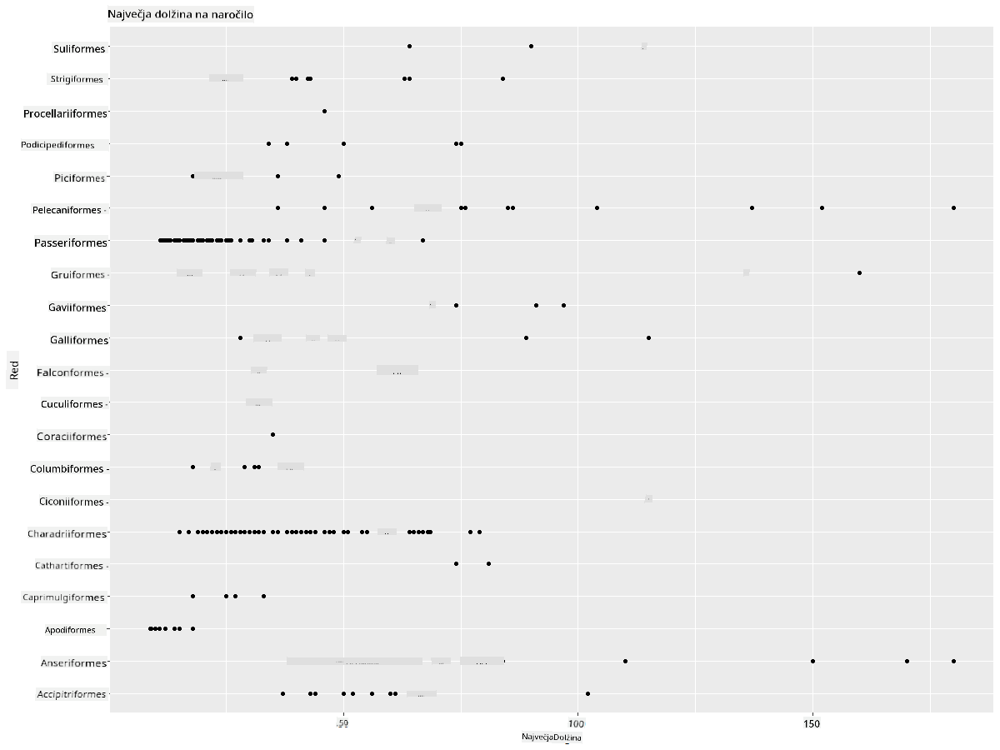
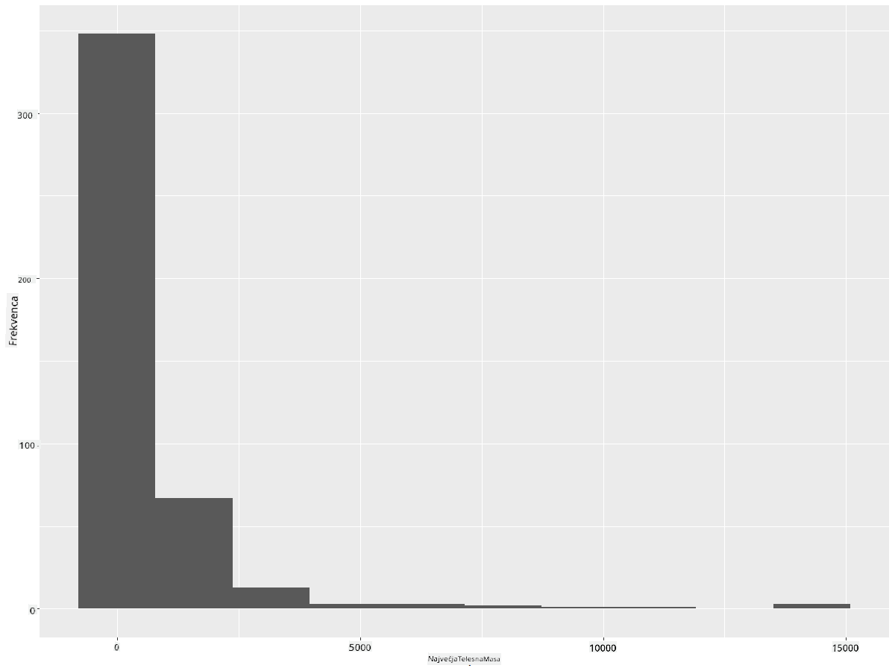
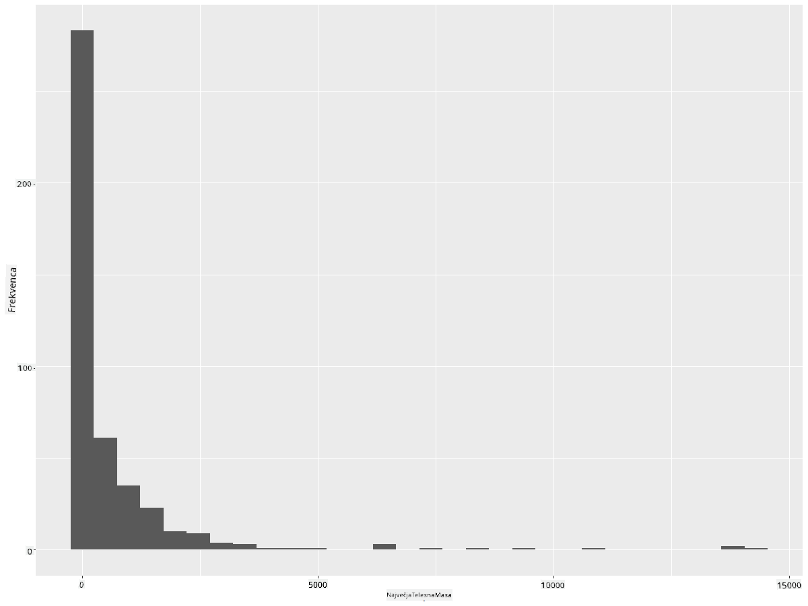
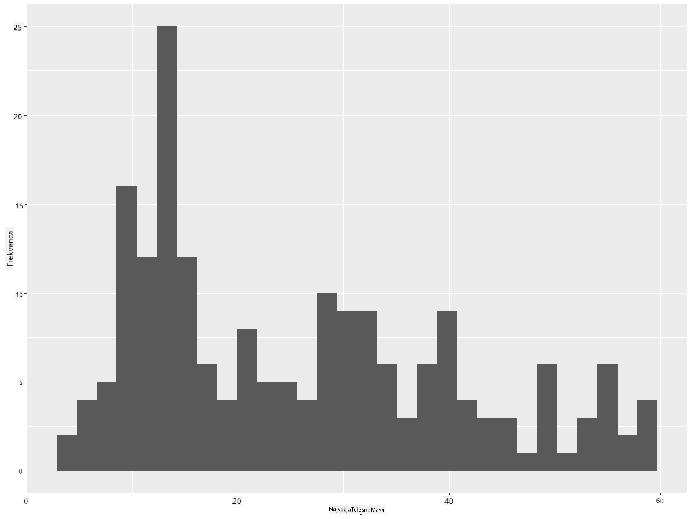
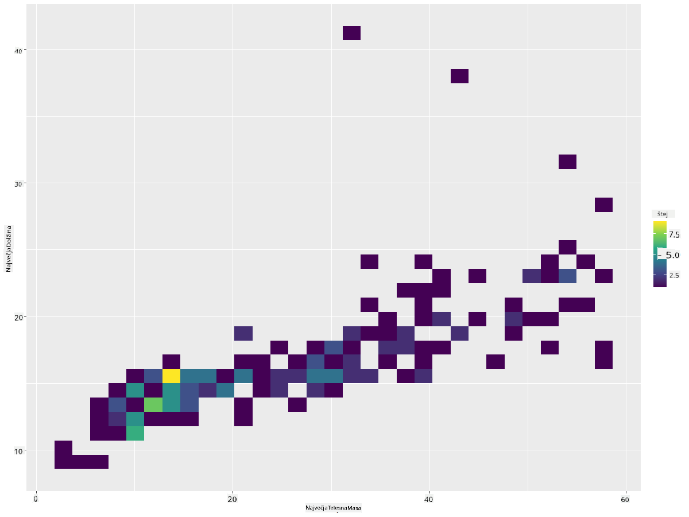
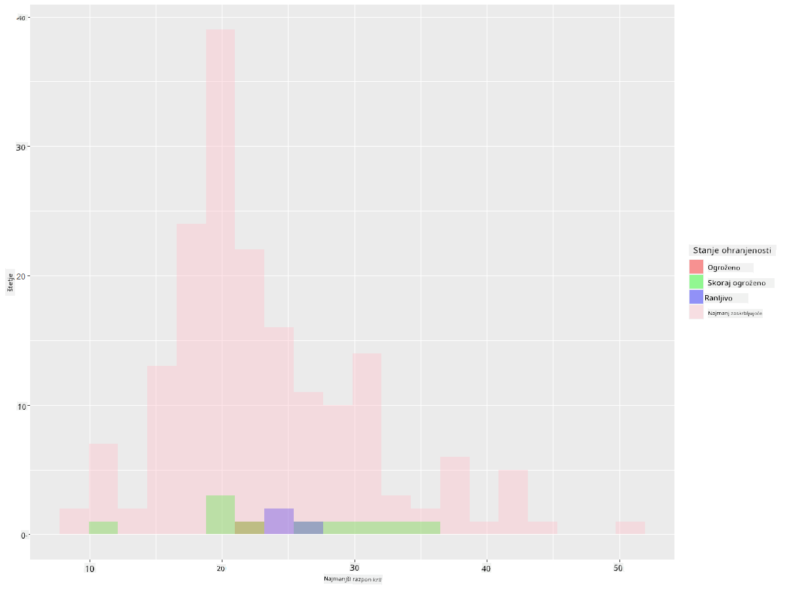
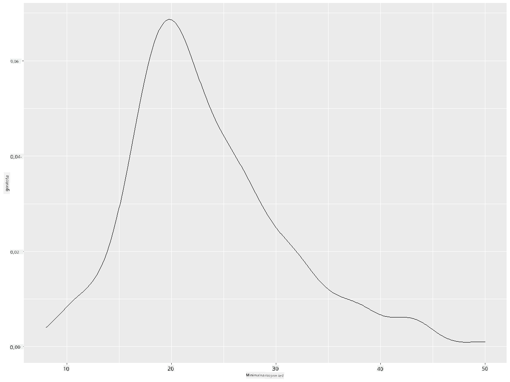
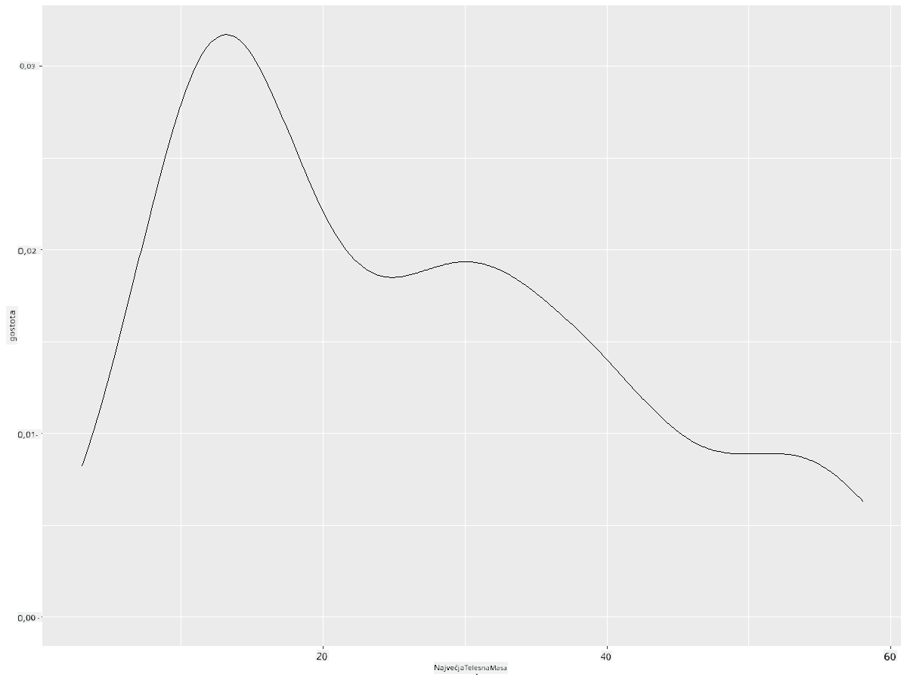
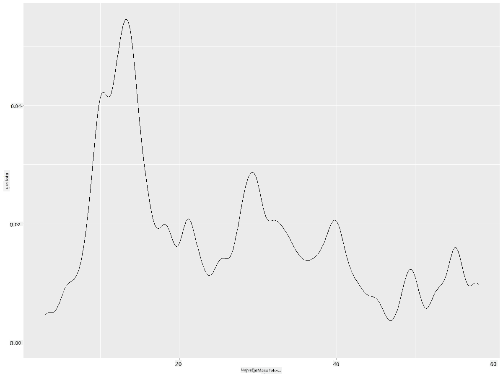
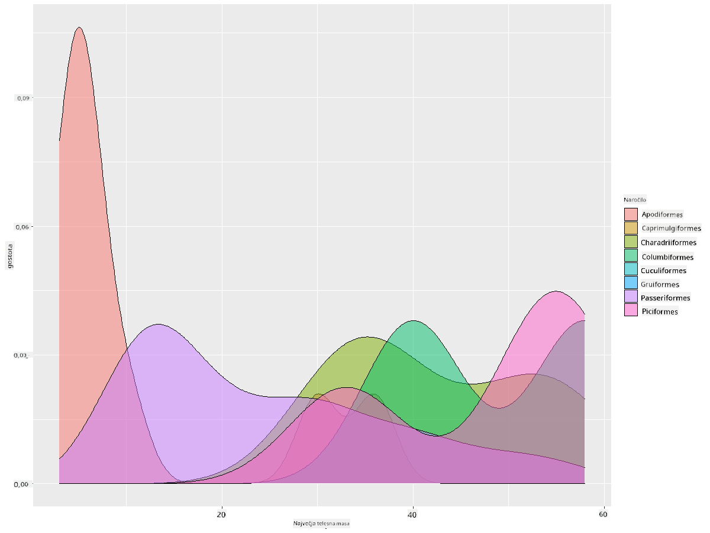

<!--
CO_OP_TRANSLATOR_METADATA:
{
  "original_hash": "ea67c0c40808fd723594de6896c37ccf",
  "translation_date": "2025-08-30T18:51:14+00:00",
  "source_file": "3-Data-Visualization/R/10-visualization-distributions/README.md",
  "language_code": "sl"
}
-->
# Vizualizacija porazdelitev

| ](https://github.com/microsoft/Data-Science-For-Beginners/blob/main/sketchnotes/10-Visualizing-Distributions.png)|
|:---:|
| Vizualizacija porazdelitev - _Sketchnote avtorja [@nitya](https://twitter.com/nitya)_ |

V prejšnji lekciji ste izvedeli nekaj zanimivih dejstev o podatkovnem naboru o pticah iz Minnesote. Z vizualizacijo odstopajočih vrednosti ste našli nekaj napačnih podatkov in si ogledali razlike med kategorijami ptic glede na njihovo največjo dolžino.

## [Predlekcijski kviz](https://purple-hill-04aebfb03.1.azurestaticapps.net/quiz/18)
## Raziskovanje podatkovnega nabora ptic

Drug način za raziskovanje podatkov je pogled na njihovo porazdelitev oziroma kako so podatki organizirani vzdolž osi. Morda bi na primer želeli izvedeti več o splošni porazdelitvi največjega razpona kril ali največje telesne mase ptic iz Minnesote v tem podatkovnem naboru.

Odkrijmo nekaj dejstev o porazdelitvah podatkov v tem naboru. V svoji konzoli R uvozite `ggplot2` in podatkovno bazo. Odstranite odstopajoče vrednosti iz podatkovne baze, tako kot v prejšnji temi.

```r
library(ggplot2)

birds <- read.csv("../../data/birds.csv",fileEncoding="UTF-8-BOM")

birds_filtered <- subset(birds, MaxWingspan < 500)
head(birds_filtered)
```
|      | Ime                          | ZnanstvenoIme          | Kategorija            | Red          | Družina  | Rod         | StanjeOhranitve     | MinDolžina | MaxDolžina | MinTelesnaMasa | MaxTelesnaMasa | MinRazponKril | MaxRazponKril |
| ---: | :--------------------------- | :--------------------- | :-------------------- | :----------- | :------- | :---------- | :----------------- | --------: | --------: | ----------: | ----------: | ----------: | ----------: |
|    0 | Črno-trebušni žvižgač        | Dendrocygna autumnalis | Race/Gosi/Vodna ptica | Anseriformes | Anatidae | Dendrocygna | LC                 |        47 |        56 |         652 |        1020 |          76 |          94 |
|    1 | Rjavi žvižgač                | Dendrocygna bicolor    | Race/Gosi/Vodna ptica | Anseriformes | Anatidae | Dendrocygna | LC                 |        45 |        53 |         712 |        1050 |          85 |          93 |
|    2 | Snežna gos                   | Anser caerulescens     | Race/Gosi/Vodna ptica | Anseriformes | Anatidae | Anser       | LC                 |        64 |        79 |        2050 |        4050 |         135 |         165 |
|    3 | Rossova gos                  | Anser rossii           | Race/Gosi/Vodna ptica | Anseriformes | Anatidae | Anser       | LC                 |      57.3 |        64 |        1066 |        1567 |         113 |         116 |
|    4 | Velika bela čelna gos        | Anser albifrons        | Race/Gosi/Vodna ptica | Anseriformes | Anatidae | Anser       | LC                 |        64 |        81 |        1930 |        3310 |         130 |         165 |

Na splošno lahko hitro pogledate, kako so podatki porazdeljeni, z uporabo razpršenega diagrama, kot smo to storili v prejšnji lekciji:

```r
ggplot(data=birds_filtered, aes(x=Order, y=MaxLength,group=1)) +
  geom_point() +
  ggtitle("Max Length per order") + coord_flip()
```


To daje pregled splošne porazdelitve dolžine telesa po redih ptic, vendar to ni optimalen način za prikaz resničnih porazdelitev. Ta naloga se običajno opravi z ustvarjanjem histograma.

## Delo s histogrami

`ggplot2` ponuja zelo dobre načine za vizualizacijo porazdelitve podatkov z uporabo histogramov. Ta vrsta grafa je podobna stolpčnemu diagramu, kjer je porazdelitev vidna skozi vzpone in padce stolpcev. Za izdelavo histograma potrebujete številske podatke. Za izdelavo histograma lahko narišete graf, kjer določite vrsto kot 'hist' za histogram. Ta graf prikazuje porazdelitev MaxBodyMass za celoten razpon številskih podatkov v naboru. Z razdelitvijo niza podatkov na manjše razpone lahko prikaže porazdelitev vrednosti podatkov:

```r
ggplot(data = birds_filtered, aes(x = MaxBodyMass)) + 
  geom_histogram(bins=10)+ylab('Frequency')
```


Kot lahko vidite, večina od 400+ ptic v tem naboru spada v razpon pod 2000 za njihovo največjo telesno maso. Pridobite več vpogleda v podatke tako, da spremenite parameter `bins` na višjo številko, na primer 30:

```r
ggplot(data = birds_filtered, aes(x = MaxBodyMass)) + geom_histogram(bins=30)+ylab('Frequency')
```



Ta graf prikazuje porazdelitev na nekoliko bolj podroben način. Manj pristranski graf na levo bi lahko ustvarili tako, da izberete samo podatke znotraj določenega razpona:

Filtrirajte svoje podatke, da dobite samo tiste ptice, katerih telesna masa je pod 60, in prikažite 30 `bins`:

```r
birds_filtered_1 <- subset(birds_filtered, MaxBodyMass > 1 & MaxBodyMass < 60)
ggplot(data = birds_filtered_1, aes(x = MaxBodyMass)) + 
  geom_histogram(bins=30)+ylab('Frequency')
```



✅ Preizkusite nekaj drugih filtrov in podatkovnih točk. Če želite videti celotno porazdelitev podatkov, odstranite filter `['MaxBodyMass']`, da prikažete označene porazdelitve.

Histogram ponuja tudi nekaj lepih barvnih in označevalnih izboljšav za preizkus:

Ustvarite 2D histogram za primerjavo razmerja med dvema porazdelitvama. Primerjajmo `MaxBodyMass` in `MaxLength`. `ggplot2` ponuja vgrajen način za prikaz konvergence z uporabo svetlejših barv:

```r
ggplot(data=birds_filtered_1, aes(x=MaxBodyMass, y=MaxLength) ) +
  geom_bin2d() +scale_fill_continuous(type = "viridis")
```
Zdi se, da obstaja pričakovana korelacija med tema dvema elementoma vzdolž pričakovane osi, z eno posebej močno točko konvergence:



Histograme je privzeto mogoče dobro uporabiti za številske podatke. Kaj pa, če morate videti porazdelitve glede na besedilne podatke? 
## Raziskovanje porazdelitev v naboru podatkov z uporabo besedilnih podatkov 

Ta nabor podatkov vključuje tudi koristne informacije o kategoriji ptic, njihovem rodu, vrsti, družini in stanju ohranitve. Poglobimo se v te informacije o ohranitvi. Kakšna je porazdelitev ptic glede na njihovo stanje ohranitve?

> ✅ V naboru podatkov je uporabljenih več kratic za opis stanja ohranitve. Te kratice izhajajo iz [IUCN Red List Categories](https://www.iucnredlist.org/), organizacije, ki katalogizira stanje vrst.
> 
> - CR: Kritično ogrožena
> - EN: Ogrožena
> - EX: Izumrla
> - LC: Najmanj zaskrbljujoča
> - NT: Potencialno ogrožena
> - VU: Ranljiva

To so besedilne vrednosti, zato boste morali izvesti transformacijo za ustvarjanje histograma. Z uporabo podatkovnega okvira `filteredBirds` prikažite njegovo stanje ohranitve skupaj z minimalnim razponom kril. Kaj opazite? 

```r
birds_filtered_1$ConservationStatus[birds_filtered_1$ConservationStatus == 'EX'] <- 'x1' 
birds_filtered_1$ConservationStatus[birds_filtered_1$ConservationStatus == 'CR'] <- 'x2'
birds_filtered_1$ConservationStatus[birds_filtered_1$ConservationStatus == 'EN'] <- 'x3'
birds_filtered_1$ConservationStatus[birds_filtered_1$ConservationStatus == 'NT'] <- 'x4'
birds_filtered_1$ConservationStatus[birds_filtered_1$ConservationStatus == 'VU'] <- 'x5'
birds_filtered_1$ConservationStatus[birds_filtered_1$ConservationStatus == 'LC'] <- 'x6'

ggplot(data=birds_filtered_1, aes(x = MinWingspan, fill = ConservationStatus)) +
  geom_histogram(position = "identity", alpha = 0.4, bins = 20) +
  scale_fill_manual(name="Conservation Status",values=c("red","green","blue","pink"),labels=c("Endangered","Near Threathened","Vulnerable","Least Concern"))
```



Zdi se, da ni dobre korelacije med minimalnim razponom kril in stanjem ohranitve. Preizkusite druge elemente nabora podatkov z uporabo te metode. Poskusite tudi različne filtre. Ali najdete kakšno korelacijo?

## Grafi gostote

Morda ste opazili, da so histogrami, ki smo jih do zdaj pregledali, 'stopničasti' in ne tečejo gladko v loku. Za prikaz bolj gladkega grafa gostote lahko poskusite graf gostote.

Zdaj se lotimo grafov gostote!

```r
ggplot(data = birds_filtered_1, aes(x = MinWingspan)) + 
  geom_density()
```


Vidite lahko, kako graf odraža prejšnjega za podatke o minimalnem razponu kril; le da je nekoliko bolj gladek. Če bi želeli ponovno pregledati tisto nazobčano črto MaxBodyMass v drugem grafu, ki ste ga ustvarili, bi jo lahko zelo dobro zgladili z uporabo te metode:

```r
ggplot(data = birds_filtered_1, aes(x = MaxBodyMass)) + 
  geom_density()
```


Če želite gladko, a ne preveč gladko črto, uredite parameter `adjust`: 

```r
ggplot(data = birds_filtered_1, aes(x = MaxBodyMass)) + 
  geom_density(adjust = 1/5)
```


✅ Preberite o parametrih, ki so na voljo za to vrsto grafa, in eksperimentirajte!

Ta vrsta grafa ponuja čudovito razlagalne vizualizacije. Na primer, z nekaj vrsticami kode lahko prikažete gostoto največje telesne mase po redih ptic:

```r
ggplot(data=birds_filtered_1,aes(x = MaxBodyMass, fill = Order)) +
  geom_density(alpha=0.5)
```


## 🚀 Izziv

Histogrami so bolj izpopolnjena vrsta grafa kot osnovni razpršeni diagrami, stolpčni diagrami ali črtni diagrami. Poiščite na internetu dobre primere uporabe histogramov. Kako se uporabljajo, kaj prikazujejo in na katerih področjih ali področjih raziskovanja se običajno uporabljajo?

## [Po-lekcijski kviz](https://purple-hill-04aebfb03.1.azurestaticapps.net/quiz/19)

## Pregled in samostojno učenje

V tej lekciji ste uporabili `ggplot2` in začeli delati na prikazu bolj izpopolnjenih grafov. Raziščite `geom_density_2d()`, "kontinuirano krivuljo gostote verjetnosti v eni ali več dimenzijah". Preberite [dokumentacijo](https://ggplot2.tidyverse.org/reference/geom_density_2d.html), da razumete, kako deluje.

## Naloga

[Uporabite svoje veščine](assignment.md)

---

**Omejitev odgovornosti**:  
Ta dokument je bil preveden z uporabo storitve za prevajanje z umetno inteligenco [Co-op Translator](https://github.com/Azure/co-op-translator). Čeprav si prizadevamo za natančnost, vas prosimo, da upoštevate, da lahko avtomatizirani prevodi vsebujejo napake ali netočnosti. Izvirni dokument v njegovem maternem jeziku je treba obravnavati kot avtoritativni vir. Za ključne informacije priporočamo profesionalni človeški prevod. Ne prevzemamo odgovornosti za morebitna napačna razumevanja ali napačne interpretacije, ki bi nastale zaradi uporabe tega prevoda.