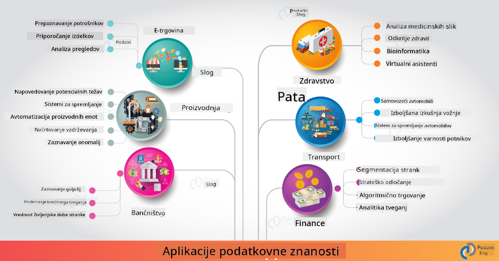

<!--
CO_OP_TRANSLATOR_METADATA:
{
  "original_hash": "67076ed50f54e7d26ba1ba378d6078f1",
  "translation_date": "2025-08-30T19:53:34+00:00",
  "source_file": "6-Data-Science-In-Wild/20-Real-World-Examples/README.md",
  "language_code": "sl"
}
-->
# Podatkovna znanost v resni캜nem svetu

|  ](../../sketchnotes/20-DataScience-RealWorld.png) |
| :--------------------------------------------------------------------------------------------------------------: |
|               Podatkovna znanost v resni캜nem svetu - _Sketchnote avtorja [@nitya](https://twitter.com/nitya)_               |

Smo skoraj na koncu te u캜ne poti!

Za캜eli smo z definicijami podatkovne znanosti in etike, raziskali razli캜na orodja in tehnike za analizo in vizualizacijo podatkov, pregledali 쬴vljenjski cikel podatkovne znanosti ter preu캜ili, kako raz코iriti in avtomatizirati delovne tokove podatkovne znanosti s storitvami v oblaku. Verjetno se zdaj spra코ujete: _"Kako lahko vse to znanje uporabim v resni캜nih situacijah?"_

V tej lekciji bomo raziskali resni캜ne primere uporabe podatkovne znanosti v industriji ter se poglobili v specifi캜ne primere na podro캜ju raziskav, digitalne humanistike in trajnosti. Pogledali bomo tudi prilo쬹osti za 코tudentske projekte in zaklju캜ili z uporabnimi viri, ki vam bodo pomagali nadaljevati va코o u캜no pot!

## Predhodni kviz

[Predhodni kviz](https://purple-hill-04aebfb03.1.azurestaticapps.net/quiz/38)

## Podatkovna znanost + industrija

Zaradi demokratizacije umetne inteligence je razvijalcem zdaj la쬵e oblikovati in vklju캜evati odlo캜itve, ki temeljijo na umetni inteligenci, ter vpoglede, ki temeljijo na podatkih, v uporabni코ke izku코nje in razvojne delovne tokove. Tukaj je nekaj primerov, kako se podatkovna znanost "uporablja" v resni캜nih aplikacijah v industriji:

 * [Google Flu Trends](https://www.wired.com/2015/10/can-learn-epic-failure-google-flu-trends/) je uporabil podatkovno znanost za povezovanje iskalnih izrazov s trendi gripe. 캛eprav je imel pristop pomanjkljivosti, je opozoril na mo쬹osti (in izzive) napovedovanja zdravja na podlagi podatkov.

 * [UPS Routing Predictions](https://www.technologyreview.com/2018/11/21/139000/how-ups-uses-ai-to-outsmart-bad-weather/) - pojasnjuje, kako UPS uporablja podatkovno znanost in strojno u캜enje za napovedovanje optimalnih poti za dostavo, pri 캜emer upo코teva vremenske razmere, prometne vzorce, roke dostave in drugo.

 * [Vizualizacija poti taksijev v NYC](http://chriswhong.github.io/nyctaxi/) - podatki, zbrani z uporabo [zakonov o svobodi informacij](https://chriswhong.com/open-data/foil_nyc_taxi/), so pomagali vizualizirati en dan v 쬴vljenju taksijev v NYC, kar nam omogo캜a razumevanje, kako se premikajo po mestu, koliko zaslu쬴jo in kako dolge so njihove vo쬹je v 24-urnem obdobju.

 * [Uber Data Science Workbench](https://eng.uber.com/dsw/) - uporablja podatke (o lokacijah prevzema in odlaganja, trajanju vo쬰nj, priljubljenih poteh itd.), zbrane iz milijonov Uber vo쬰nj *dnevno*, za izdelavo orodja za analizo podatkov, ki pomaga pri dolo캜anju cen, varnosti, odkrivanju prevar in navigacijskih odlo캜itvah.

 * [맗ortna analitika](https://towardsdatascience.com/scope-of-analytics-in-sports-world-37ed09c39860) - osredoto캜a se na _napovedno analitiko_ (analiza ekip in igralcev - pomislite na [Moneyball](https://datasciencedegree.wisconsin.edu/blog/moneyball-proves-importance-big-data-big-ideas/) - in upravljanje navija캜ev) ter _vizualizacijo podatkov_ (nadzorne plo코캜e ekip in navija캜ev, igre itd.) z aplikacijami, kot so iskanje talentov, 코portne stave in upravljanje zalog/objektov.

 * [Podatkovna znanost v ban캜ni코tvu](https://data-flair.training/blogs/data-science-in-banking/) - poudarja vrednost podatkovne znanosti v finan캜ni industriji z aplikacijami, ki segajo od modeliranja tveganj in odkrivanja prevar do segmentacije strank, napovedovanja v realnem 캜asu in priporo캜ilnih sistemov. Napovedna analitika prav tako poganja klju캜ne ukrepe, kot so [kreditne ocene](https://dzone.com/articles/using-big-data-and-predictive-analytics-for-credit).

 * [Podatkovna znanost v zdravstvu](https://data-flair.training/blogs/data-science-in-healthcare/) - poudarja aplikacije, kot so medicinsko slikanje (npr. MRI, rentgen, CT-skeniranje), genomika (sekvenciranje DNK), razvoj zdravil (ocena tveganja, napoved uspeha), napovedna analitika (oskrba pacientov in logistika oskrbe), sledenje boleznim in prepre캜evanje itd.

 Vir slike: [Data Flair: 6 Amazing Data Science Applications ](https://data-flair.training/blogs/data-science-applications/)

Slika prikazuje druge domene in primere uporabe tehnik podatkovne znanosti. 콯elite raziskati druge aplikacije? Oglejte si razdelek [Pregled in samostojno u캜enje](../../../../6-Data-Science-In-Wild/20-Real-World-Examples) spodaj.

## Podatkovna znanost + raziskave

|  ](../../sketchnotes/20-DataScience-Research.png) |
| :---------------------------------------------------------------------------------------------------------------: |
|              Podatkovna znanost in raziskave - _Sketchnote avtorja [@nitya](https://twitter.com/nitya)_              |

Medtem ko se resni캜ne aplikacije pogosto osredoto캜ajo na industrijske primere uporabe v velikem obsegu, so _raziskovalne_ aplikacije in projekti koristni z dveh vidikov:

* _prilo쬹osti za inovacije_ - raziskovanje hitrega prototipiranja naprednih konceptov in testiranje uporabni코kih izku코enj za aplikacije naslednje generacije.
* _izzivi pri implementaciji_ - preu캜evanje morebitnih 코kod ali nenamernih posledic tehnologij podatkovne znanosti v resni캜nih kontekstih.

Za 코tudente lahko ti raziskovalni projekti nudijo prilo쬹osti za u캜enje in sodelovanje, ki izbolj코ajo razumevanje teme ter raz코irijo zavedanje in anga쬴ranost z ustreznimi ljudmi ali ekipami, ki delajo na podro캜jih zanimanja. Kako torej izgledajo raziskovalni projekti in kak코en vpliv lahko imajo?

Poglejmo en primer - [MIT Gender Shades Study](http://gendershades.org/overview.html) avtorice Joy Buolamwini (MIT Media Labs) s [pomembnim raziskovalnim 캜lankom](http://proceedings.mlr.press/v81/buolamwini18a/buolamwini18a.pdf), ki ga je soavtorila Timnit Gebru (takrat pri Microsoft Research). 맚udija se je osredoto캜ila na:

 * **Kaj:** Cilj raziskovalnega projekta je bil _oceniti pristranskost v algoritmih in podatkovnih zbirkah za avtomatizirano analizo obrazov_ glede na spol in barvo ko쬰.
 * **Zakaj:** Analiza obrazov se uporablja na podro캜jih, kot so kazenski pregon, varnost na letali코캜ih, sistemi zaposlovanja in drugo - konteksti, kjer lahko neto캜ne klasifikacije (npr. zaradi pristranskosti) povzro캜ijo ekonomsko in socialno 코kodo prizadetim posameznikom ali skupinam. Razumevanje (in odpravljanje ali zmanj코evanje) pristranskosti je klju캜no za pravi캜nost pri uporabi.
 * **Kako:** Raziskovalci so ugotovili, da so obstoje캜i referen캜ni standardi uporabljali prete쬹o svetlopolte subjekte, zato so ustvarili novo podatkovno zbirko (1000+ slik), ki je bila _bolj uravnote쬰na_ glede na spol in barvo ko쬰. Podatkovna zbirka je bila uporabljena za oceno natan캜nosti treh izdelkov za klasifikacijo spola (Microsoft, IBM in Face++).

Rezultati so pokazali, da je bila, 캜eprav je bila splo코na natan캜nost klasifikacije dobra, opazna razlika v stopnjah napak med razli캜nimi podskupinami - z **napa캜no dolo캜itvijo spola**, ki je bila pogostej코a pri 쬰nskah ali osebah s temnej코o barvo ko쬰, kar ka쬰 na pristranskost.

**Klju캜ni rezultati:** Pove캜ano zavedanje, da podatkovna znanost potrebuje bolj _reprezentativne podatkovne zbirke_ (uravnote쬰ne podskupine) in bolj _vklju캜ujo캜e ekipe_ (raznolika ozadja), da bi lahko pristranskosti prepoznali in odpravili ali zmanj코ali 쬰 v zgodnjih fazah re코itev umetne inteligence. Tak코ni raziskovalni napori so prav tako klju캜ni za 코tevilne organizacije pri oblikovanju na캜el in praks za _odgovorno umetno inteligenco_, da bi izbolj코ali pravi캜nost svojih AI izdelkov in procesov.

**콯elite izvedeti ve캜 o ustreznih raziskovalnih prizadevanjih pri Microsoftu?**

* Oglejte si [Microsoft Research Projects](https://www.microsoft.com/research/research-area/artificial-intelligence/?facet%5Btax%5D%5Bmsr-research-area%5D%5B%5D=13556&facet%5Btax%5D%5Bmsr-content-type%5D%5B%5D=msr-project) na podro캜ju umetne inteligence.
* Razi코캜ite 코tudentske projekte iz [Microsoft Research Data Science Summer School](https://www.microsoft.com/en-us/research/academic-program/data-science-summer-school/).
* Oglejte si projekt [Fairlearn](https://fairlearn.org/) in pobude za [odgovorno umetno inteligenco](https://www.microsoft.com/en-us/ai/responsible-ai?activetab=pivot1%3aprimaryr6).

## Podatkovna znanost + humanistika

|  ](../../sketchnotes/20-DataScience-Humanities.png) |
| :---------------------------------------------------------------------------------------------------------------: |
|              Podatkovna znanost in digitalna humanistika - _Sketchnote avtorja [@nitya](https://twitter.com/nitya)_              |

Digitalna humanistika [je opredeljena](https://digitalhumanities.stanford.edu/about-dh-stanford) kot "zbirka praks in pristopov, ki zdru쬿jejo ra캜unalni코ke metode s humanisti캜nim raziskovanjem". [Stanfordovi projekti](https://digitalhumanities.stanford.edu/projects), kot sta _"rebooting history"_ in _"poetic thinking"_, ponazarjajo povezavo med [digitalno humanistiko in podatkovno znanostjo](https://digitalhumanities.stanford.edu/digital-humanities-and-data-science) - poudarjajo tehnike, kot so analiza omre쬴j, vizualizacija informacij, prostorska in besedilna analiza, ki nam lahko pomagajo ponovno preu캜iti zgodovinske in literarne podatkovne zbirke ter pridobiti nove vpoglede in perspektive.

*콯elite raziskati in raz코iriti projekt na tem podro캜ju?*

Oglejte si ["Emily Dickinson and the Meter of Mood"](https://gist.github.com/jlooper/ce4d102efd057137bc000db796bfd671) - odli캜en primer avtorice [Jen Looper](https://twitter.com/jenlooper), ki se spra코uje, kako lahko uporabimo podatkovno znanost za ponovno preu캜itev znane poezije in ponovno ovrednotenje njenega pomena ter prispevkov avtorice v novih kontekstih. Na primer, _ali lahko napovemo letni 캜as, v katerem je bila pesem napisana, z analizo njenega tona ali razpolo쬰nja_ - in kaj nam to pove o avtorjevem du코evnem stanju v relevantnem obdobju?

Za odgovor na to vpra코anje sledimo korakom 쬴vljenjskega cikla podatkovne znanosti:
 * [`Pridobivanje podatkov`](https://gist.github.com/jlooper/ce4d102efd057137bc000db796bfd671#acquiring-the-dataset) - za zbiranje ustreznega nabora podatkov za analizo. Mo쬹osti vklju캜ujejo uporabo API-jev (npr. [Poetry DB API](https://poetrydb.org/index.html)) ali strganje spletnih strani (npr. [Project Gutenberg](https://www.gutenberg.org/files/12242/12242-h/12242-h.htm)) z orodji, kot je [Scrapy](https://scrapy.org/).
 * [`캛i코캜enje podatkov`](https://gist.github.com/jlooper/ce4d102efd057137bc000db796bfd671#clean-the-data) - pojasnjuje, kako lahko besedilo formatiramo, o캜istimo in poenostavimo z osnovnimi orodji, kot sta Visual Studio Code in Microsoft Excel.
 * [`Analiza podatkov`](https://gist.github.com/jlooper/ce4d102efd057137bc000db796bfd671#working-with-the-data-in-a-notebook) - pojasnjuje, kako lahko zdaj uvozimo nabor podatkov v "zvezke" za analizo z uporabo Pythonovih knji쬹ic (kot so pandas, numpy in matplotlib) za organizacijo in vizualizacijo podatkov.
 * [`Analiza razpolo쬰nja`](https://gist.github.com/jlooper/ce4d102efd057137bc000db796bfd671#sentiment-analysis-using-cognitive-services) - pojasnjuje, kako lahko vklju캜imo storitve v oblaku, kot je Text Analytics, z uporabo orodij z malo kode, kot je [Power Automate](https://flow.microsoft.com/en-us/) za avtomatizirane delovne tokove obdelave podatkov.

Z uporabo tega delovnega toka lahko raziskujemo sezonske vplive na razpolo쬰nje pesmi in si oblikujemo lastne poglede na avtorico. Preizkusite sami - nato raz코irite zvezek, da postavite druga vpra코anja ali vizualizirate podatke na nove na캜ine!

> Nekatera orodja iz [Digital Humanities Toolkit](https://github.com/Digital-Humanities-Toolkit) lahko uporabite za raziskovanje teh vpra코anj.

## Podatkovna znanost + trajnost

|  ](../../sketchnotes/20-DataScience-Sustainability.png) |
| :---------------------------------------------------------------------------------------------------------------: |
|              Podatkovna znanost in trajnost - _Sketchnote avtorja [@nitya](https://twitter.com/nitya)_              |

[Agenda 2030 za trajnostni razvoj](https://sdgs.un.org/2030agenda) - ki so jo leta 2015 sprejele vse 캜lanice Zdru쬰nih narodov - dolo캜a 17 ciljev, vklju캜no s tistimi, ki se osredoto캜ajo na **za코캜ito planeta** pred degradacijo in vplivi podnebnih sprememb. Pobuda [Microsoft Sustainability](https://www.microsoft.com/en-us/sustainability) podpira te cilje z raziskovanjem na캜inov, kako lahko tehnolo코ke re코itve podpirajo in gradijo bolj trajnostno prihodnost, s [fokusom na 4 cilje](https://dev.to/azure/a-visual-guide-to-sustainable-software-engineering-53hh) - postati oglji캜no negativni, vodno pozitivni, brez odpadkov in biotsko raznovrstni do leta 2030.

Re코evanje teh izzivov na obse쬰n in pravo캜asen na캜in zahteva razmi코ljanje na ravni oblaka - in velike koli캜ine podatkov. Pobuda [Planetary Computer](https://planetarycomputer.microsoft.com/) ponuja 4 komponente, ki pomagajo podatkovnim znanstvenikom in razvijalcem pri tem prizadevanju:

 * [Katalog podatkov](https://planetarycomputer.microsoft.com/catalog) - s petabajti podatkov o zemeljskih sistemih (brezpla캜no in gostovano na Azure).
 * [Planetary API](https://planetarycomputer.microsoft.com/docs/reference/stac/) - za pomo캜 uporabnikom pri iskanju ustreznih podatkov po prostoru in 캜asu.
 * [Hub](https://planetarycomputer.microsoft.com/docs/overview/environment/) - upravljano okolje za znanstvenike za obdelavo masivnih geosprostorskih podatkovnih zbirk.
 * [Aplikacije](https://planetarycomputer.microsoft.com/applications) - prikaz primerov uporabe in orodij za vpoglede v trajnost.
**Projekt Planetary Computer je trenutno v predogledu (od septembra 2021)** - tukaj je, kako lahko za캜nete prispevati k re코itvam za trajnost z uporabo podatkovne znanosti.

* [Zahtevajte dostop](https://planetarycomputer.microsoft.com/account/request) za za캜etek raziskovanja in povezovanje s kolegi.
* [Razi코캜ite dokumentacijo](https://planetarycomputer.microsoft.com/docs/overview/about), da razumete podprte nabore podatkov in API-je.
* Razi코캜ite aplikacije, kot je [Ecosystem Monitoring](https://analytics-lab.org/ecosystemmonitoring/), za navdih pri idejah za aplikacije.

Razmislite, kako lahko uporabite vizualizacijo podatkov za razkrivanje ali poudarjanje pomembnih vpogledov na podro캜jih, kot sta podnebne spremembe in kr캜enje gozdov. Ali pa razmislite, kako je mogo캜e vpoglede uporabiti za ustvarjanje novih uporabni코kih izku코enj, ki spodbujajo vedenjske spremembe za bolj trajnostno 쬴vljenje.

## Podatkovna znanost + 맚udenti

Govorili smo o aplikacijah iz resni캜nega sveta v industriji in raziskavah ter raziskovali primere uporabe podatkovne znanosti v digitalnih humanisti캜nih vedah in trajnosti. Kako torej lahko kot za캜etniki v podatkovni znanosti gradite svoje ve코캜ine in delite svoje znanje?

Tukaj je nekaj primerov 코tudentskih projektov iz podatkovne znanosti za navdih.

* [Poletna 코ola podatkovne znanosti MSR](https://www.microsoft.com/en-us/research/academic-program/data-science-summer-school/#!projects) z GitHub [projekti](https://github.com/msr-ds3), ki raziskujejo teme, kot so:
    - [Rasna pristranskost pri uporabi sile s strani policije](https://www.microsoft.com/en-us/research/video/data-science-summer-school-2019-replicating-an-empirical-analysis-of-racial-differences-in-police-use-of-force/) | [Github](https://github.com/msr-ds3/stop-question-frisk)
    - [Zanesljivost podzemne 쬰leznice v New Yorku](https://www.microsoft.com/en-us/research/video/data-science-summer-school-2018-exploring-the-reliability-of-the-nyc-subway-system/) | [Github](https://github.com/msr-ds3/nyctransit)
* [Digitalizacija materialne kulture: Raziskovanje socio-ekonomskih razporeditev v Sirkapu](https://claremont.maps.arcgis.com/apps/Cascade/index.html?appid=bdf2aef0f45a4674ba41cd373fa23afc) - od [Ornella Altunyan](https://twitter.com/ornelladotcom) in ekipe na Claremontu, z uporabo [ArcGIS StoryMaps](https://storymaps.arcgis.com/).

## 游 Izziv

Poi코캜ite 캜lanke, ki priporo캜ajo projekte iz podatkovne znanosti, primerni za za캜etnike - na primer [teh 50 tematskih podro캜ij](https://www.upgrad.com/blog/data-science-project-ideas-topics-beginners/) ali [teh 21 idej za projekte](https://www.intellspot.com/data-science-project-ideas) ali [teh 16 projektov s kodo](https://data-flair.training/blogs/data-science-project-ideas/), ki jih lahko razstavite in predelate. Ne pozabite tudi pisati blogov o svojih u캜nih poteh in deliti svoje vpoglede z nami.

## Kviz po predavanju

[Kviz po predavanju](https://purple-hill-04aebfb03.1.azurestaticapps.net/quiz/39)

## Pregled in samostojno u캜enje

콯elite raziskati ve캜 primerov uporabe? Tukaj je nekaj ustreznih 캜lankov:
* [17 aplikacij in primerov uporabe podatkovne znanosti](https://builtin.com/data-science/data-science-applications-examples) - julij 2021
* [11 osupljivih aplikacij podatkovne znanosti v resni캜nem svetu](https://myblindbird.com/data-science-applications-real-world/) - maj 2021
* [Podatkovna znanost v resni캜nem svetu](https://towardsdatascience.com/data-science-in-the-real-world/home) - zbirka 캜lankov
* Podatkovna znanost v: [Izobra쬰vanju](https://data-flair.training/blogs/data-science-in-education/), [Kmetijstvu](https://data-flair.training/blogs/data-science-in-agriculture/), [Financah](https://data-flair.training/blogs/data-science-in-finance/), [Filmih](https://data-flair.training/blogs/data-science-at-movies/) in ve캜.

## Naloga

[Razi코캜ite nabor podatkov Planetary Computer](assignment.md)

---

**Omejitev odgovornosti**:  
Ta dokument je bil preveden z uporabo storitve za strojno prevajanje [Co-op Translator](https://github.com/Azure/co-op-translator). 캛eprav si prizadevamo za natan캜nost, vas prosimo, da upo코tevate, da lahko avtomatizirani prevodi vsebujejo napake ali neto캜nosti. Izvirni dokument v njegovem maternem jeziku je treba obravnavati kot avtoritativni vir. Za klju캜ne informacije priporo캜amo profesionalni 캜love코ki prevod. Ne prevzemamo odgovornosti za morebitne nesporazume ali napa캜ne razlage, ki izhajajo iz uporabe tega prevoda.