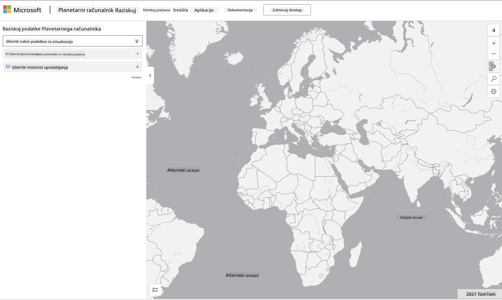

<!--
CO_OP_TRANSLATOR_METADATA:
{
  "original_hash": "d1e05715f9d97de6c4f1fb0c5a4702c0",
  "translation_date": "2025-08-30T19:56:55+00:00",
  "source_file": "6-Data-Science-In-Wild/20-Real-World-Examples/assignment.md",
  "language_code": "sl"
}
-->
# Raziskovanje podatkovne zbirke Planetary Computer

## Navodila

V tej lekciji smo govorili o različnih področjih uporabe podatkovne znanosti – s poglobljenimi primeri, povezanimi z raziskovanjem, trajnostjo in digitalnimi humanističnimi vedami. V tej nalogi boste podrobneje raziskali enega od teh primerov in uporabili svoje znanje o vizualizaciji in analizi podatkov, da pridobite vpoglede v podatke o trajnosti.

Projekt [Planetary Computer](https://planetarycomputer.microsoft.com/) vsebuje podatkovne zbirke in API-je, do katerih lahko dostopate z računom – če želite preizkusiti dodatni korak naloge, zaprosite za dostop. Spletno mesto ponuja tudi funkcijo [Explorer](https://planetarycomputer.microsoft.com/explore), ki jo lahko uporabljate brez ustvarjanja računa.

`Koraki:`
Vmesnik Explorer (prikazan na spodnjem posnetku zaslona) vam omogoča izbiro podatkovne zbirke (iz ponujenih možnosti), prednastavljene poizvedbe (za filtriranje podatkov) in možnosti upodabljanja (za ustvarjanje ustrezne vizualizacije). Vaša naloga v tej nalogi je:

 1. Preberite [dokumentacijo Explorerja](https://planetarycomputer.microsoft.com/docs/overview/explorer/) – razumite možnosti.
 2. Raziščite [katalog podatkovnih zbirk](https://planetarycomputer.microsoft.com/catalog) – spoznajte namen vsake zbirke.
 3. Uporabite Explorer – izberite podatkovno zbirko, ki vas zanima, izberite ustrezno poizvedbo in možnost upodabljanja.

`Vaša naloga:`
Zdaj preučite vizualizacijo, ki je prikazana v brskalniku, in odgovorite na naslednje:
 * Katere _lastnosti_ ima podatkovna zbirka?
 * Katere _vpoglede_ ali rezultate ponuja vizualizacija?
 * Kakšne so _posledice_ teh vpogledov za cilje trajnostnega projekta?
 * Katere so _omejitve_ vizualizacije (tj. kateri vpogledov niste dobili)?
 * Če bi imeli dostop do surovih podatkov, katere _alternativne vizualizacije_ bi ustvarili in zakaj?

`Dodatne točke:`
Zaprosite za račun – in se prijavite, ko je odobren.
 * Uporabite možnost _Launch Hub_ za odpiranje surovih podatkov v beležnici (Notebook).
 * Interaktivno raziskujte podatke in izvedite alternativne vizualizacije, ki ste jih predlagali.
 * Zdaj analizirajte svoje prilagojene vizualizacije – ali ste lahko pridobili vpoglede, ki jih prej niste?

## Merila ocenjevanja

Odlično | Zadostno | Potrebna izboljšava
--- | --- | -- |
Na vseh pet osnovnih vprašanj je bilo odgovorjeno. Študent je jasno opredelil, kako lahko trenutne in alternativne vizualizacije prispevajo k vpogledom v cilje ali rezultate trajnosti. | Študent je podrobno odgovoril na vsaj prva tri vprašanja, kar kaže, da ima praktične izkušnje z Explorerjem. | Študent ni odgovoril na več vprašanj ali je podal premalo podrobnosti – kar kaže, da ni bil narejen smiseln poskus izvedbe projekta. |

---

**Omejitev odgovornosti**:  
Ta dokument je bil preveden z uporabo storitve za strojno prevajanje [Co-op Translator](https://github.com/Azure/co-op-translator). Čeprav si prizadevamo za natančnost, vas prosimo, da upoštevate, da lahko avtomatizirani prevodi vsebujejo napake ali netočnosti. Izvirni dokument v njegovem izvirnem jeziku je treba obravnavati kot avtoritativni vir. Za ključne informacije priporočamo strokovno človeško prevajanje. Ne prevzemamo odgovornosti za morebitna nesporazumevanja ali napačne razlage, ki izhajajo iz uporabe tega prevoda.