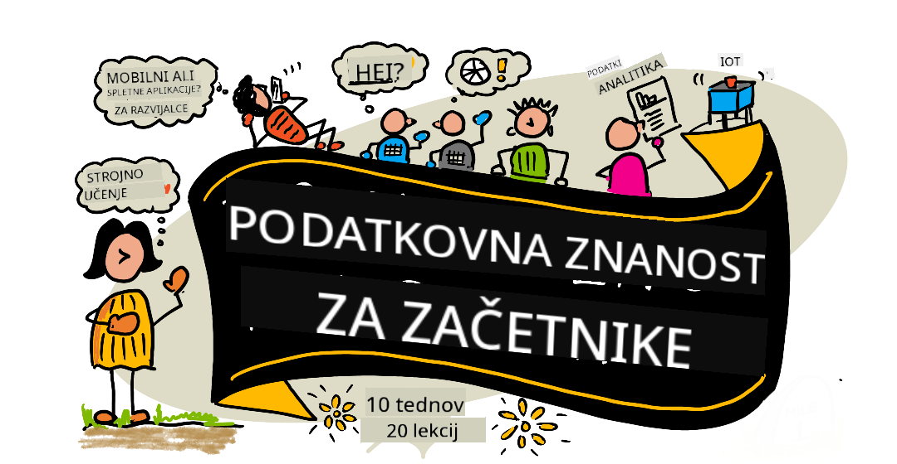

<!--
CO_OP_TRANSLATOR_METADATA:
{
  "original_hash": "dd9a1deb4da680b2cf11ba2e9f5a0a6e",
  "translation_date": "2025-09-29T22:13:01+00:00",
  "source_file": "README.md",
  "language_code": "sl"
}
-->
# Podatkovna znanost za začetnike - Kurikulum

Azure Cloud Advocates pri Microsoftu z veseljem ponujajo 10-tedenski, 20-lekcijski kurikulum o podatkovni znanosti. Vsaka lekcija vključuje kvize pred in po lekciji, pisna navodila za dokončanje lekcije, rešitev in nalogo. Naš projektno usmerjen pristop omogoča učenje skozi ustvarjanje, kar je dokazano učinkovit način za trajno pridobivanje novih veščin.

**Iskrena zahvala našim avtorjem:** [Jasmine Greenaway](https://www.twitter.com/paladique), [Dmitry Soshnikov](http://soshnikov.com), [Nitya Narasimhan](https://twitter.com/nitya), [Jalen McGee](https://twitter.com/JalenMcG), [Jen Looper](https://twitter.com/jenlooper), [Maud Levy](https://twitter.com/maudstweets), [Tiffany Souterre](https://twitter.com/TiffanySouterre), [Christopher Harrison](https://www.twitter.com/geektrainer).

**🙏 Posebna zahvala 🙏 našim [Microsoft Student Ambassador](https://studentambassadors.microsoft.com/) avtorjem, recenzentom in prispevalcem vsebine,** med njimi Aaryan Arora, [Aditya Garg](https://github.com/AdityaGarg00), [Alondra Sanchez](https://www.linkedin.com/in/alondra-sanchez-molina/), [Ankita Singh](https://www.linkedin.com/in/ankitasingh007), [Anupam Mishra](https://www.linkedin.com/in/anupam--mishra/), [Arpita Das](https://www.linkedin.com/in/arpitadas01/), ChhailBihari Dubey, [Dibri Nsofor](https://www.linkedin.com/in/dibrinsofor), [Dishita Bhasin](https://www.linkedin.com/in/dishita-bhasin-7065281bb), [Majd Safi](https://www.linkedin.com/in/majd-s/), [Max Blum](https://www.linkedin.com/in/max-blum-6036a1186/), [Miguel Correa](https://www.linkedin.com/in/miguelmque/), [Mohamma Iftekher (Iftu) Ebne Jalal](https://twitter.com/iftu119), [Nawrin Tabassum](https://www.linkedin.com/in/nawrin-tabassum), [Raymond Wangsa Putra](https://www.linkedin.com/in/raymond-wp/), [Rohit Yadav](https://www.linkedin.com/in/rty2423), Samridhi Sharma, [Sanya Sinha](https://www.linkedin.com/mwlite/in/sanya-sinha-13aab1200),
[Sheena Narula](https://www.linkedin.com/in/sheena-narua-n/), [Tauqeer Ahmad](https://www.linkedin.com/in/tauqeerahmad5201/), Yogendrasingh Pawar , [Vidushi Gupta](https://www.linkedin.com/in/vidushi-gupta07/), [Jasleen Sondhi](https://www.linkedin.com/in/jasleen-sondhi/)

||
|:---:|
| Podatkovna znanost za začetnike - _Sketchnote by [@nitya](https://twitter.com/nitya)_ |

### 🌐 Podpora za več jezikov

#### Podprto prek GitHub Action (samodejno in vedno posodobljeno)

[Francoščina](../fr/README.md) | [Španščina](../es/README.md) | [Nemščina](../de/README.md) | [Ruščina](../ru/README.md) | [Arabščina](../ar/README.md) | [Perzijščina (Farsi)](../fa/README.md) | [Urdu](../ur/README.md) | [Kitajščina (poenostavljena)](../zh/README.md) | [Kitajščina (tradicionalna, Macao)](../mo/README.md) | [Kitajščina (tradicionalna, Hong Kong)](../hk/README.md) | [Kitajščina (tradicionalna, Tajvan)](../tw/README.md) | [Japonščina](../ja/README.md) | [Korejščina](../ko/README.md) | [Hindijščina](../hi/README.md) | [Bengalščina](../bn/README.md) | [Maratščina](../mr/README.md) | [Nepalščina](../ne/README.md) | [Pandžabščina (Gurmukhi)](../pa/README.md) | [Portugalščina (Portugalska)](../pt/README.md) | [Portugalščina (Brazilija)](../br/README.md) | [Italijanščina](../it/README.md) | [Poljščina](../pl/README.md) | [Turščina](../tr/README.md) | [Grščina](../el/README.md) | [Tajščina](../th/README.md) | [Švedščina](../sv/README.md) | [Danščina](../da/README.md) | [Norveščina](../no/README.md) | [Finščina](../fi/README.md) | [Nizozemščina](../nl/README.md) | [Hebrejščina](../he/README.md) | [Vietnamščina](../vi/README.md) | [Indonezijščina](../id/README.md) | [Malajščina](../ms/README.md) | [Tagalog (Filipino)](../tl/README.md) | [Svahili](../sw/README.md) | [Madžarščina](../hu/README.md) | [Češčina](../cs/README.md) | [Slovaščina](../sk/README.md) | [Romunščina](../ro/README.md) | [Bolgarščina](../bg/README.md) | [Srbščina (cirilica)](../sr/README.md) | [Hrvaščina](../hr/README.md) | [Slovenščina](./README.md) | [Ukrajinščina](../uk/README.md) | [Burmanščina (Myanmar)](../my/README.md)

**Če želite dodati dodatne prevode, so podprti jeziki navedeni [tukaj](https://github.com/Azure/co-op-translator/blob/main/getting_started/supported-languages.md)**

#### Pridružite se naši skupnosti 

Imamo serijo učenja z AI na Discordu, več o tem in pridružite se nam na [Learn with AI Series](https://aka.ms/learnwithai/discord) od 18. do 30. septembra 2025. Naučili se boste nasvetov in trikov za uporabo GitHub Copilot za podatkovno znanost.

# Ste študent?

Začnite z naslednjimi viri:

- [Stran Student Hub](https://docs.microsoft.com/en-gb/learn/student-hub?WT.mc_id=academic-77958-bethanycheum) Na tej strani boste našli začetniške vire, študentske pakete in celo načine za pridobitev brezplačnega certifikata. To je stran, ki jo želite shraniti med zaznamke in občasno preveriti, saj vsebino menjamo vsaj enkrat mesečno.
- [Microsoft Learn Student Ambassadors](https://studentambassadors.microsoft.com?WT.mc_id=academic-77958-bethanycheum) Pridružite se globalni skupnosti študentskih ambasadorjev, to bi lahko bil vaš vstop v Microsoft.

# Začetek

> **Učitelji**: [vključili smo nekaj predlogov](for-teachers.md) o tem, kako uporabiti ta kurikulum. Veseli bomo vaših povratnih informacij [v našem forumu za razprave](https://github.com/microsoft/Data-Science-For-Beginners/discussions)!

> **[Študenti](https://aka.ms/student-page)**: če želite ta kurikulum uporabljati sami, razvejite celoten repozitorij in samostojno dokončajte vaje, začenši s kvizom pred predavanjem. Nato preberite predavanje in dokončajte preostale aktivnosti. Poskusite ustvariti projekte z razumevanjem lekcij, namesto da kopirate kodo rešitve; vendar je ta koda na voljo v mapah /solutions v vsaki lekciji, usmerjeni na projekt. Druga ideja je, da oblikujete študijsko skupino s prijatelji in skupaj preučite vsebino. Za nadaljnje študije priporočamo [Microsoft Learn](https://docs.microsoft.com/en-us/users/jenlooper-2911/collections/qprpajyoy3x0g7?WT.mc_id=academic-77958-bethanycheum).

## Spoznajte ekipo

**Gif avtorja** [Mohit Jaisal](https://www.linkedin.com/in/mohitjaisal)

> 🎥 Kliknite zgornjo sliko za video o projektu in ljudeh, ki so ga ustvarili!

## Pedagogika

Pri oblikovanju tega kurikuluma smo se odločili za dva pedagoška načela: zagotoviti, da je projektno usmerjen in da vključuje pogoste kvize. Do konca te serije bodo študenti osvojili osnovna načela podatkovne znanosti, vključno z etičnimi koncepti, pripravo podatkov, različnimi načini dela s podatki, vizualizacijo podatkov, analizo podatkov, resničnimi primeri uporabe podatkovne znanosti in še več.

Poleg tega kviz z nizkim tveganjem pred predavanjem usmeri pozornost študenta na učenje teme, medtem ko drugi kviz po predavanju zagotavlja dodatno zadrževanje znanja. Ta kurikulum je bil zasnovan tako, da je prilagodljiv in zabaven ter ga je mogoče jemati v celoti ali delno. Projekti se začnejo majhni in postajajo vse bolj kompleksni do konca 10-tedenskega cikla.

> Najdite naš [Kodeks ravnanja](CODE_OF_CONDUCT.md), [Prispevanje](CONTRIBUTING.md), [Smernice za prevajanje](TRANSLATIONS.md). Veseli bomo vaših konstruktivnih povratnih informacij!

## Vsaka lekcija vključuje:

- Neobvezna sketchnote
- Neobvezni dopolnilni video
- Ogrevalni kviz pred lekcijo
- Pisna lekcija
- Za lekcije, usmerjene na projekt, vodniki korak za korakom, kako zgraditi projekt
- Preverjanje znanja
- Izziv
- Dopolnilno branje
- Naloga
- [Kviz po lekciji](https://ff-quizzes.netlify.app/en/)

> **Opomba o kvizih**: Vsi kvizi so vsebovani v mapi Quiz-App, skupaj 40 kvizov s po tremi vprašanji. Povezani so znotraj lekcij, vendar je aplikacijo za kvize mogoče zagnati lokalno ali jo namestiti na Azure; sledite navodilom v mapi `quiz-app`. Postopoma se lokalizirajo.

## Lekcije
||
|:---:|
| Podatkovna znanost za začetnike: Načrt - _Sketchnote avtorja [@nitya](https://twitter.com/nitya)_ |

| Številka lekcije | Tema | Skupina lekcij | Cilji učenja | Povezana lekcija | Avtor |
| :-----------: | :----------------------------------------: | :--------------------------------------------------: | :-----------------------------------------------------------------------------------------------------------------------------------------------------------------------: | :---------------------------------------------------------------------: | :----: |
| 01 | Definicija podatkovne znanosti | [Uvod](1-Introduction/README.md) | Spoznajte osnovne koncepte podatkovne znanosti in kako je povezana z umetno inteligenco, strojno učenje in velikimi podatki. | [lekcija](1-Introduction/01-defining-data-science/README.md) [video](https://youtu.be/beZ7Mb_oz9I) | [Dmitry](http://soshnikov.com) |
| 02 | Etika podatkovne znanosti | [Uvod](1-Introduction/README.md) | Koncepti etike podatkov, izzivi in okvirji. | [lekcija](1-Introduction/02-ethics/README.md) | [Nitya](https://twitter.com/nitya) |
| 03 | Definicija podatkov | [Uvod](1-Introduction/README.md) | Kako so podatki razvrščeni in njihovi pogosti viri. | [lekcija](1-Introduction/03-defining-data/README.md) | [Jasmine](https://www.twitter.com/paladique) |
| 04 | Uvod v statistiko in verjetnost | [Uvod](1-Introduction/README.md) | Matematične tehnike verjetnosti in statistike za razumevanje podatkov. | [lekcija](1-Introduction/04-stats-and-probability/README.md) [video](https://youtu.be/Z5Zy85g4Yjw) | [Dmitry](http://soshnikov.com) |
| 05 | Delo z relacijskimi podatki | [Delo s podatki](2-Working-With-Data/README.md) | Uvod v relacijske podatke in osnove raziskovanja ter analize relacijskih podatkov z jezikom SQL (izgovorjava "si-kvel"). | [lekcija](2-Working-With-Data/05-relational-databases/README.md) | [Christopher](https://www.twitter.com/geektrainer) | | |
| 06 | Delo z NoSQL podatki | [Delo s podatki](2-Working-With-Data/README.md) | Uvod v nerelacijske podatke, njihove različne vrste ter osnove raziskovanja in analize dokumentnih baz. | [lekcija](2-Working-With-Data/06-non-relational/README.md) | [Jasmine](https://twitter.com/paladique)|
| 07 | Delo s Pythonom | [Delo s podatki](2-Working-With-Data/README.md) | Osnove uporabe Pythona za raziskovanje podatkov z knjižnicami, kot je Pandas. Priporočljivo je osnovno razumevanje programiranja v Pythonu. | [lekcija](2-Working-With-Data/07-python/README.md) [video](https://youtu.be/dZjWOGbsN4Y) | [Dmitry](http://soshnikov.com) |
| 08 | Priprava podatkov | [Delo s podatki](2-Working-With-Data/README.md) | Tehnike čiščenja in preoblikovanja podatkov za obvladovanje izzivov, kot so manjkajoči, netočni ali nepopolni podatki. | [lekcija](2-Working-With-Data/08-data-preparation/README.md) | [Jasmine](https://www.twitter.com/paladique) |
| 09 | Vizualizacija količin | [Vizualizacija podatkov](3-Data-Visualization/README.md) | Naučite se uporabljati Matplotlib za vizualizacijo podatkov o pticah 🦆 | [lekcija](3-Data-Visualization/09-visualization-quantities/README.md) | [Jen](https://twitter.com/jenlooper) |
| 10 | Vizualizacija porazdelitev podatkov | [Vizualizacija podatkov](3-Data-Visualization/README.md) | Vizualizacija opazovanj in trendov znotraj intervala. | [lekcija](3-Data-Visualization/10-visualization-distributions/README.md) | [Jen](https://twitter.com/jenlooper) |
| 11 | Vizualizacija deležev | [Vizualizacija podatkov](3-Data-Visualization/README.md) | Vizualizacija diskretnih in združenih odstotkov. | [lekcija](3-Data-Visualization/11-visualization-proportions/README.md) | [Jen](https://twitter.com/jenlooper) |
| 12 | Vizualizacija odnosov | [Vizualizacija podatkov](3-Data-Visualization/README.md) | Vizualizacija povezav in korelacij med nabori podatkov in njihovimi spremenljivkami. | [lekcija](3-Data-Visualization/12-visualization-relationships/README.md) | [Jen](https://twitter.com/jenlooper) |
| 13 | Smiselne vizualizacije | [Vizualizacija podatkov](3-Data-Visualization/README.md) | Tehnike in smernice za ustvarjanje vizualizacij, ki so koristne za učinkovito reševanje problemov in pridobivanje vpogledov. | [lekcija](3-Data-Visualization/13-meaningful-visualizations/README.md) | [Jen](https://twitter.com/jenlooper) |
| 14 | Uvod v življenjski cikel podatkovne znanosti | [Življenjski cikel](4-Data-Science-Lifecycle/README.md) | Uvod v življenjski cikel podatkovne znanosti in njegov prvi korak pridobivanja ter ekstrakcije podatkov. | [lekcija](4-Data-Science-Lifecycle/14-Introduction/README.md) | [Jasmine](https://twitter.com/paladique) |
| 15 | Analiza | [Življenjski cikel](4-Data-Science-Lifecycle/README.md) | Ta faza življenjskega cikla podatkovne znanosti se osredotoča na tehnike analize podatkov. | [lekcija](4-Data-Science-Lifecycle/15-analyzing/README.md) | [Jasmine](https://twitter.com/paladique) | | |
| 16 | Komunikacija | [Življenjski cikel](4-Data-Science-Lifecycle/README.md) | Ta faza življenjskega cikla podatkovne znanosti se osredotoča na predstavitev vpogledov iz podatkov na način, ki ga odločevalci lažje razumejo. | [lekcija](4-Data-Science-Lifecycle/16-communication/README.md) | [Jalen](https://twitter.com/JalenMcG) | | |
| 17 | Podatkovna znanost v oblaku | [Podatki v oblaku](5-Data-Science-In-Cloud/README.md) | Serija lekcij, ki uvaja podatkovno znanost v oblaku in njene prednosti. | [lekcija](5-Data-Science-In-Cloud/17-Introduction/README.md) | [Tiffany](https://twitter.com/TiffanySouterre) in [Maud](https://twitter.com/maudstweets) |
| 18 | Podatkovna znanost v oblaku | [Podatki v oblaku](5-Data-Science-In-Cloud/README.md) | Učenje modelov z orodji za nizko kodiranje. |[lekcija](5-Data-Science-In-Cloud/18-Low-Code/README.md) | [Tiffany](https://twitter.com/TiffanySouterre) in [Maud](https://twitter.com/maudstweets) |
| 19 | Podatkovna znanost v oblaku | [Podatki v oblaku](5-Data-Science-In-Cloud/README.md) | Uvajanje modelov z Azure Machine Learning Studio. | [lekcija](5-Data-Science-In-Cloud/19-Azure/README.md)| [Tiffany](https://twitter.com/TiffanySouterre) in [Maud](https://twitter.com/maudstweets) |
| 20 | Podatkovna znanost v naravi | [V naravi](6-Data-Science-In-Wild/README.md) | Projekti, ki jih poganja podatkovna znanost v resničnem svetu. | [lekcija](6-Data-Science-In-Wild/20-Real-World-Examples/README.md) | [Nitya](https://twitter.com/nitya) |

## GitHub Codespaces

Sledite tem korakom za odprtje tega vzorca v Codespace:
1. Kliknite spustni meni Code in izberite možnost Open with Codespaces.
2. Na dnu podokna izberite + New codespace.
Za več informacij si oglejte [dokumentacijo GitHub](https://docs.github.com/en/codespaces/developing-in-codespaces/creating-a-codespace-for-a-repository#creating-a-codespace).

## VSCode Remote - Containers
Sledite tem korakom za odprtje tega repozitorija v vsebniku z uporabo vaše lokalne naprave in VSCode z razširitvijo VS Code Remote - Containers:

1. Če prvič uporabljate razvojni vsebnik, se prepričajte, da vaš sistem izpolnjuje predpogoje (npr. imate nameščen Docker) v [dokumentaciji za začetek](https://code.visualstudio.com/docs/devcontainers/containers#_getting-started).

Za uporabo tega repozitorija ga lahko odprete bodisi v izoliranem Docker volumnu:

**Opomba**: V ozadju bo uporabljen ukaz Remote-Containers: **Clone Repository in Container Volume...**, da se izvorna koda klonira v Docker volumen namesto lokalnega datotečnega sistema. [Volumni](https://docs.docker.com/storage/volumes/) so prednostni mehanizem za shranjevanje podatkov vsebnika.

Ali pa odprete lokalno klonirano ali preneseno različico repozitorija:

- Klonirajte ta repozitorij na vaš lokalni datotečni sistem.
- Pritisnite F1 in izberite ukaz **Remote-Containers: Open Folder in Container...**.
- Izberite klonirano kopijo te mape, počakajte, da se vsebnik zažene, in preizkusite stvari.

## Dostop brez povezave

To dokumentacijo lahko zaženete brez povezave z uporabo [Docsify](https://docsify.js.org/#/). Forkajte ta repozitorij, [namestite Docsify](https://docsify.js.org/#/quickstart) na vašo lokalno napravo, nato v korenski mapi tega repozitorija vnesite `docsify serve`. Spletna stran bo na voljo na portu 3000 na vašem localhostu: `localhost:3000`.

> Opomba, zvezki ne bodo upodobljeni prek Docsify, zato jih, ko jih potrebujete, zaženite ločeno v VS Code z uporabo Python jedra.

## Druge učne vsebine

Naša ekipa ustvarja tudi druge učne vsebine! Oglejte si:

- [Edge AI za začetnike](https://aka.ms/edgeai-for-beginners)
- [AI agenti za začetnike](https://aka.ms/ai-agents-beginners)
- [Generativna AI za začetnike](https://aka.ms/genai-beginners)
- [Generativna AI za začetnike .NET](https://github.com/microsoft/Generative-AI-for-beginners-dotnet)
- [Generativna AI z JavaScriptom](https://github.com/microsoft/generative-ai-with-javascript)
- [Generativna AI z Javo](https://aka.ms/genaijava)
- [AI za začetnike](https://aka.ms/ai-beginners)
- [Podatkovna znanost za začetnike](https://aka.ms/datascience-beginners)
- [Bash za začetnike](https://github.com/microsoft/bash-for-beginners)
- [ML za začetnike](https://aka.ms/ml-beginners)
- [Kibernetska varnost za začetnike](https://github.com/microsoft/Security-101) 
- [Spletni razvoj za začetnike](https://aka.ms/webdev-beginners)
- [IoT za začetnike](https://aka.ms/iot-beginners)
- [Strojno učenje za začetnike](https://aka.ms/ml-beginners)
- [XR razvoj za začetnike](https://aka.ms/xr-dev-for-beginners)
- [Obvladovanje GitHub Copilot za AI programiranje v paru](https://aka.ms/GitHubCopilotAI)
- [XR razvoj za začetnike](https://github.com/microsoft/xr-development-for-beginners)
- [Obvladovanje GitHub Copilot za C#/.NET razvijalce](https://github.com/microsoft/mastering-github-copilot-for-dotnet-csharp-developers)
- [Izberite svojo Copilot pustolovščino](https://github.com/microsoft/CopilotAdventures)

---

**Omejitev odgovornosti**:  
Ta dokument je bil preveden z uporabo storitve AI za prevajanje [Co-op Translator](https://github.com/Azure/co-op-translator). Čeprav si prizadevamo za natančnost, vas prosimo, da upoštevate, da lahko avtomatizirani prevodi vsebujejo napake ali netočnosti. Izvirni dokument v njegovem maternem jeziku je treba obravnavati kot avtoritativni vir. Za ključne informacije priporočamo profesionalni človeški prevod. Ne prevzemamo odgovornosti za morebitna nesporazumevanja ali napačne razlage, ki izhajajo iz uporabe tega prevoda.