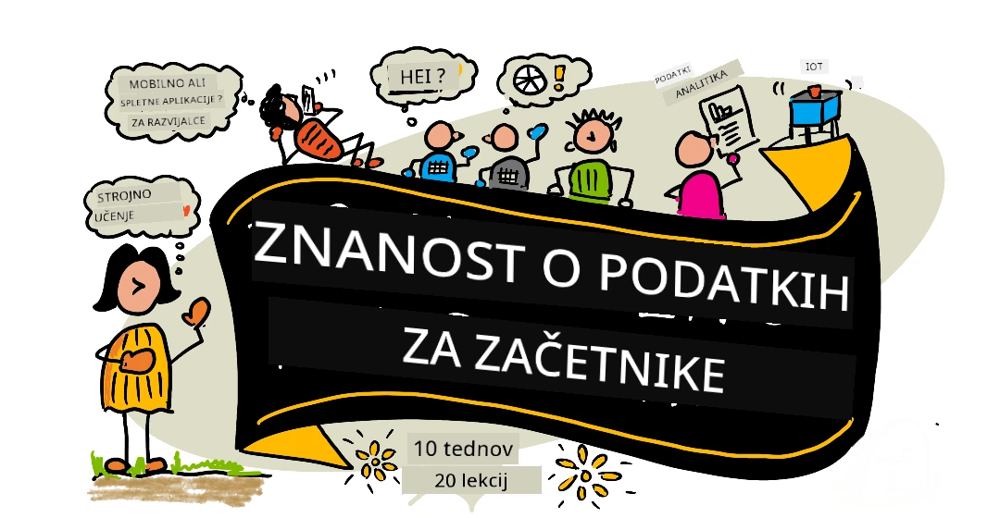
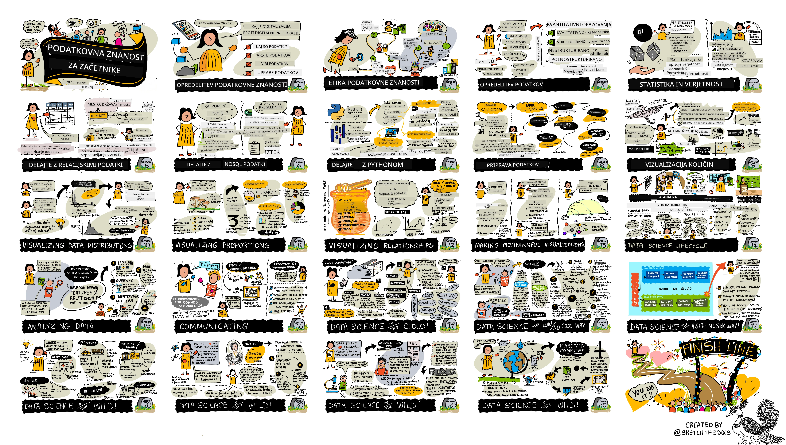

# Področje podatkovne znanosti za začetnike - učni načrt

[](https://github.com/codespaces/new?hide_repo_select=true&ref=main&repo=344191198)

[](https://github.com/microsoft/Data-Science-For-Beginners/blob/master/LICENSE)
[](https://GitHub.com/microsoft/Data-Science-For-Beginners/graphs/contributors/)
[](https://GitHub.com/microsoft/Data-Science-For-Beginners/issues/)
[](https://GitHub.com/microsoft/Data-Science-For-Beginners/pulls/)
[](http://makeapullrequest.com)

[](https://GitHub.com/microsoft/Data-Science-For-Beginners/watchers/)
[](https://GitHub.com/microsoft/Data-Science-For-Beginners/network/)
[](https://GitHub.com/microsoft/Data-Science-For-Beginners/stargazers/)


[](https://discord.gg/nTYy5BXMWG)

[](https://aka.ms/foundry/forum)

Zagovorniki Azure Clouda pri Microsoftu z veseljem ponujajo 10-tedenski, 20-urni učni načrt, ki pokriva podatkovno znanost. Vsaka lekcija vključuje kvize pred in po lekciji, pisna navodila za dokončanje lekcije, rešitev in nalogo. Naša projektno usmerjena pedagogika vam omogoča učenje med gradnjo, kar je dokazano učinkovit način za ohranjanje novih znanj.

**Iskrena hvala našim avtorjem:** [Jasmine Greenaway](https://www.twitter.com/paladique), [Dmitry Soshnikov](http://soshnikov.com), [Nitya Narasimhan](https://twitter.com/nitya), [Jalen McGee](https://twitter.com/JalenMcG), [Jen Looper](https://twitter.com/jenlooper), [Maud Levy](https://twitter.com/maudstweets), [Tiffany Souterre](https://twitter.com/TiffanySouterre), [Christopher Harrison](https://www.twitter.com/geektrainer).

**🙏 Posebna zahvala 🙏 našim avtorjem, recenzentom in prispevkom vsebin iz [Microsoft Student Ambassador](https://studentambassadors.microsoft.com/),** zlasti Aaryanu Arori, [Aditya Garg](https://github.com/AdityaGarg00), [Alondra Sanchez](https://www.linkedin.com/in/alondra-sanchez-molina/), [Ankita Singh](https://www.linkedin.com/in/ankitasingh007), [Anupam Mishra](https://www.linkedin.com/in/anupam--mishra/), [Arpita Das](https://www.linkedin.com/in/arpitadas01/), ChhailBihari Dubey, [Dibri Nsofor](https://www.linkedin.com/in/dibrinsofor), [Dishita Bhasin](https://www.linkedin.com/in/dishita-bhasin-7065281bb), [Majd Safi](https://www.linkedin.com/in/majd-s/), [Max Blum](https://www.linkedin.com/in/max-blum-6036a1186/), [Miguel Correa](https://www.linkedin.com/in/miguelmque/), [Mohamma Iftekher (Iftu) Ebne Jalal](https://twitter.com/iftu119), [Nawrin Tabassum](https://www.linkedin.com/in/nawrin-tabassum), [Raymond Wangsa Putra](https://www.linkedin.com/in/raymond-wp/), [Rohit Yadav](https://www.linkedin.com/in/rty2423), Samridhi Sharma, [Sanya Sinha](https://www.linkedin.com/mwlite/in/sanya-sinha-13aab1200),
[Sheena Narula](https://www.linkedin.com/in/sheena-narua-n/), [Tauqeer Ahmad](https://www.linkedin.com/in/tauqeerahmad5201/), Yogendrasingh Pawar , [Vidushi Gupta](https://www.linkedin.com/in/vidushi-gupta07/), [Jasleen Sondhi](https://www.linkedin.com/in/jasleen-sondhi/)

||
|:---:|
| Področje podatkovne znanosti za začetnike - _Skična nota avtorja [@nitya](https://twitter.com/nitya)_ |

### 🌐 Večjezična podpora

#### Podprto prek GitHub Action (Avtomatizirano in vedno posodobljeno)

<!-- CO-OP TRANSLATOR LANGUAGES TABLE START -->
[Arabic](../ar/README.md) | [Bengali](../bn/README.md) | [Bulgarian](../bg/README.md) | [Burmese (Myanmar)](../my/README.md) | [Chinese (Simplified)](../zh-CN/README.md) | [Chinese (Traditional, Hong Kong)](../zh-HK/README.md) | [Chinese (Traditional, Macau)](../zh-MO/README.md) | [Chinese (Traditional, Taiwan)](../zh-TW/README.md) | [Croatian](../hr/README.md) | [Czech](../cs/README.md) | [Danish](../da/README.md) | [Dutch](../nl/README.md) | [Estonian](../et/README.md) | [Finnish](../fi/README.md) | [French](../fr/README.md) | [German](../de/README.md) | [Greek](../el/README.md) | [Hebrew](../he/README.md) | [Hindi](../hi/README.md) | [Hungarian](../hu/README.md) | [Indonesian](../id/README.md) | [Italian](../it/README.md) | [Japanese](../ja/README.md) | [Kannada](../kn/README.md) | [Khmer](../km/README.md) | [Korean](../ko/README.md) | [Lithuanian](../lt/README.md) | [Malay](../ms/README.md) | [Malayalam](../ml/README.md) | [Marathi](../mr/README.md) | [Nepali](../ne/README.md) | [Nigerian Pidgin](../pcm/README.md) | [Norwegian](../no/README.md) | [Persian (Farsi)](../fa/README.md) | [Polish](../pl/README.md) | [Portuguese (Brazil)](../pt-BR/README.md) | [Portuguese (Portugal)](../pt-PT/README.md) | [Punjabi (Gurmukhi)](../pa/README.md) | [Romanian](../ro/README.md) | [Russian](../ru/README.md) | [Serbian (Cyrillic)](../sr/README.md) | [Slovak](../sk/README.md) | [Slovenian](./README.md) | [Spanish](../es/README.md) | [Swahili](../sw/README.md) | [Swedish](../sv/README.md) | [Tagalog (Filipino)](../tl/README.md) | [Tamil](../ta/README.md) | [Telugu](../te/README.md) | [Thai](../th/README.md) | [Turkish](../tr/README.md) | [Ukrainian](../uk/README.md) | [Urdu](../ur/README.md) | [Vietnamese](../vi/README.md)

> **Raje lokalno klonirate?**
>
> Ta repozitorij vključuje prevode v več kot 50 jezikih, kar znatno poveča velikost prenosa. Če želite klonirati brez prevodov, uporabite sparse checkout:
>
> **Bash / macOS / Linux:**
> ```bash
> git clone --filter=blob:none --sparse https://github.com/microsoft/Data-Science-For-Beginners.git
> cd Data-Science-For-Beginners
> git sparse-checkout set --no-cone '/*' '!translations' '!translated_images'
> ```
>
> **CMD (Windows):**
> ```cmd
> git clone --filter=blob:none --sparse https://github.com/microsoft/Data-Science-For-Beginners.git
> cd Data-Science-For-Beginners
> git sparse-checkout set --no-cone "/*" "!translations" "!translated_images"
> ```
>
> Tako dobite vse, kar potrebujete za dokončanje tečaja, z bistveno hitrejšim prenosom.
<!-- CO-OP TRANSLATOR LANGUAGES TABLE END -->

**Če želite, da so podprti dodatni prevodi jezikov, so našteti [tukaj](https://github.com/Azure/co-op-translator/blob/main/getting_started/supported-languages.md)**

#### Pridružite se naši skupnosti  
[](https://discord.gg/nTYy5BXMWG)

Imamo tekočo serijo Discord učnih dogodkov z AI, izveste več in se pridružite na [Learn with AI Series](https://aka.ms/learnwithai/discord) od 18. do 30. septembra 2025. Dobite nasvete in trike za uporabo GitHub Copilota pri podatkovni znanosti.


# Ste študent?

Začnite z naslednjimi viri:

- [Stran Student Hub](https://docs.microsoft.com/en-gb/learn/student-hub?WT.mc_id=academic-77958-bethanycheum) Na tej strani boste našli vire za začetnike, študentske pakete in celo načine za pridobitev brezplačnega certifikatnega bona. To stran si želite dodati med zaznamke in jo od časa do časa pregledati, saj redno menjamo vsebino vsaj na mesečni ravni.
- [Microsoft Learn Student Ambassadors](https://studentambassadors.microsoft.com?WT.mc_id=academic-77958-bethanycheum) Pridružite se globalni skupnosti študentskih ambasadorjev, to bi lahko bila vaša pot v Microsoft.

# Začetek

## 📚 Dokumentacija

- **[Vodnik za namestitev](INSTALLATION.md)** - navodila po korakih za začetnike
- **[Uporabniški vodič](USAGE.md)** - primeri in pogosti delovni poteki
- **[Odpravljanje težav](TROUBLESHOOTING.md)** - rešitve pogostih težav
- **[Prispevanje](CONTRIBUTING.md)** - kako prispevati k temu projektu
- **[Za učitelje](for-teachers.md)** - navodila za poučevanje in učni viri

## 👨‍🎓 Za študente
> **Popolni začetniki**: Novi v podatkovni znanosti? Začnite z našimi [prijaznimi primeri za začetnike](examples/README.md)! Ti preprosti, dobro komentirani primeri vam bodo pomagali razumeti osnove, preden se podate v celoten učni načrt.
> **[Študenti](https://aka.ms/student-page)**: za samostojno uporabo tega učnega načrta razvejite celoten repozitorij in dokončajte vaje sami, pri tem začnite s kvizom pred predavanjem. Nato preberite predavanje in dokončajte ostale aktivnosti. Poskusite ustvariti projekte s pomočjo razumevanja lekcij namesto kopiranja rešitvene kode; ta koda je sicer na voljo v mapah /solutions v vsaki lekciji, usmerjeni na projekt. Druga ideja je, da oblikujete študijsko skupino s prijatelji in skupaj pregledate vsebino. Za nadaljnje študije priporočamo [Microsoft Learn](https://docs.microsoft.com/en-us/users/jenlooper-2911/collections/qprpajyoy3x0g7?WT.mc_id=academic-77958-bethanycheum).

**Hiter začetek:**
1. Preverite [vodnik za namestitev](INSTALLATION.md) za nastavitev okolja
2. Preglejte [uporabniški vodič](USAGE.md) za nauk dela z učnim načrtom
3. Začnite z Lekcijo 1 in nadaljujte zaporedno
4. Pridružite se naši [Discord skupnosti](https://aka.ms/ds4beginners/discord) za podporo

## 👩‍🏫 Za učitelje
> **Učitelji**: vključili smo [nekaj predlogov](for-teachers.md), kako uporabiti ta kurikulum. Veselimo se vaših povratnih informacij [v našem forumu za razprave](https://github.com/microsoft/Data-Science-For-Beginners/discussions)!

## Spoznajte ekipo

[](https://youtu.be/8mzavjQSMM4 "Promo video")

**Gif avtor** [Mohit Jaisal](https://www.linkedin.com/in/mohitjaisal)

> 🎥 Kliknite zgornjo sliko za video o projektu in ljudeh, ki so ga ustvarili!

## Pedagogika

Pri oblikovanju tega kurikuluma smo izbrali dva pedagoška načela: zagotoviti, da temelji na projektih in da vključuje pogoste kvize. Na koncu te serije bodo študenti osvojili osnovna načela podatkovne znanosti, vključno z etičnimi koncepti, pripravo podatkov, različnimi načini dela s podatki, vizualizacijo podatkov, analizo podatkov, primeri uporabe podatkovne znanosti v resničnem svetu in še več.

Poleg tega nizkoklidnostni kviz pred predavanjem usmeri študenta k učenju določene teme, medtem ko drugi kviz po predavanju zagotovi nadaljnje pomnjenje. Ta kurikulum je zasnovan tako, da je prilagodljiv in zabaven ter ga je mogoče opraviti v celoti ali delno. Projekti se začnejo majhni in postajajo vse kompleksnejši do konca 10-tedenskega cikla.

> Najdite naš [Kodeks ravnanja](CODE_OF_CONDUCT.md), [Smernice za prispevke](CONTRIBUTING.md), [Prevajanje](TRANSLATIONS.md). Veselimo se vaših konstruktivnih povratnih informacij!

## Vsaka lekcija vključuje:

- Neobvezno skico zapiskov
- Neobvezni dodatni video
- Predhodni ogrevalni kviz
- Pisno lekcijo
- Za lekcije, ki temeljijo na projektih, korak-po-korak vodiče, kako zgraditi projekt
- Preverjanje znanja
- Izziv
- Dodatno branje
- [Kviz po lekciji](https://ff-quizzes.netlify.app/en/)

> **Opomba o kvizih**: Vsi kvizi so shranjeni v mapi Quiz-App, skupaj 40 kvizov s tremi vprašanji v vsakem. Povezani so iz lekcij, vendar lahko aplikacijo za kvize zaženete lokalno ali jo namestite v Azure; sledite navodilom v mapi `quiz-app`. Postopoma se prevajajo.

## 🎓 Prijazni primeri za začetnike

**Nov v podatkovni znanosti?** Ustvarili smo poseben [imenik primerov](examples/README.md) z enostavno, dobro komentirano kodo, ki vam pomaga začeti:

- 🌟 **Pozdravljen svet** - vaš prvi program podatkovne znanosti
- 📂 **Nalaganje podatkov** - naučite se brati in raziskovati nize podatkov
- 📊 **Enostavna analiza** - izračunajte statistiko in poiščite vzorce
- 📈 **Osnovna vizualizacija** - ustvarite diagrame in grafe
- 🔬 **Projekt iz resničnega sveta** - celoten potek dela od začetka do konca

Vsak primer vsebuje podrobne komentarje, ki pojasnjujejo vsak korak, zato je popoln za popolne začetnike!

👉 **[Začnite s primeri](examples/README.md)** 👈

## Lekcije


||
|:---:|
| Podatkovna znanost za začetnike: Načrt poti - _Sketchnote avtor [@nitya](https://twitter.com/nitya)_ |


| Številka lekcije | Tema | Skupina lekcij | Cilji učenja | Povezana lekcija | Avtor |
| :-----------: | :----------------------------------------: | :--------------------------------------------------: | :-----------------------------------------------------------------------------------------------------------------------------------------------------------------------: | :---------------------------------------------------------------------: | :----: |
| 01 | Določanje podatkovne znanosti | [Uvod](1-Introduction/README.md) | Spoznajte osnovne koncepte podatkovne znanosti in povezave z umetno inteligenco, strojno učenjem in velikimi podatki. | [lekcija](1-Introduction/01-defining-data-science/README.md) [video](https://youtu.be/beZ7Mb_oz9I) | [Dmitry](http://soshnikov.com) |
| 02 | Etika podatkovne znanosti | [Uvod](1-Introduction/README.md) | Koncepti etike podatkov, izzivi in okvirji. | [lekcija](1-Introduction/02-ethics/README.md) | [Nitya](https://twitter.com/nitya) |
| 03 | Določanje podatkov | [Uvod](1-Introduction/README.md) | Kako so podatki razvrščeni in njihovi pogosti viri. | [lekcija](1-Introduction/03-defining-data/README.md) | [Jasmine](https://www.twitter.com/paladique) |
| 04 | Uvod v statistiko in verjetnost | [Uvod](1-Introduction/README.md) | Matematične tehnike verjetnosti in statistike za razumevanje podatkov. | [lekcija](1-Introduction/04-stats-and-probability/README.md) [video](https://youtu.be/Z5Zy85g4Yjw) | [Dmitry](http://soshnikov.com) |
| 05 | Delo s relacijskimi podatki | [Delo s podatki](2-Working-With-Data/README.md) | Uvod v relacijske podatke in osnove raziskovanja ter analize relacijskih podatkov z jezikom Structured Query Language, znanim kot SQL (izgovori se "see-quell"). | [lekcija](2-Working-With-Data/05-relational-databases/README.md) | [Christopher](https://www.twitter.com/geektrainer) | | |
| 06 | Delo z NoSQL podatki | [Delo s podatki](2-Working-With-Data/README.md) | Uvod v nerezalacijske podatke, njihove različne tipe in osnove raziskovanja ter analize dokumentarnih baz podatkov. | [lekcija](2-Working-With-Data/06-non-relational/README.md) | [Jasmine](https://twitter.com/paladique)|
| 07 | Delo s Pythonom | [Delo s podatki](2-Working-With-Data/README.md) | Osnove uporabe Pythona za raziskovanje podatkov z uporabo knjižnic, kot je Pandas. Priporočeno osnovno znanje programiranja v Pythonu. | [lekcija](2-Working-With-Data/07-python/README.md) [video](https://youtu.be/dZjWOGbsN4Y) | [Dmitry](http://soshnikov.com) |
| 08 | Priprava podatkov | [Delo s podatki](2-Working-With-Data/README.md) | Teme o tehnikah čiščenja in pretvorbe podatkov za obvladovanje izzivov z manjkajočimi, netočnimi ali nepopolnimi podatki. | [lekcija](2-Working-With-Data/08-data-preparation/README.md) | [Jasmine](https://www.twitter.com/paladique) |
| 09 | Vizualizacija količin | [Vizualizacija podatkov](3-Data-Visualization/README.md) | Naučite se uporabljati Matplotlib za vizualizacijo podatkov o pticah 🦆 | [lekcija](3-Data-Visualization/09-visualization-quantities/README.md) | [Jen](https://twitter.com/jenlooper) |
| 10 | Vizualizacija porazdelitev podatkov | [Vizualizacija podatkov](3-Data-Visualization/README.md) | Vizualizacija opazovanj in trendov v določenem intervalu. | [lekcija](3-Data-Visualization/10-visualization-distributions/README.md) | [Jen](https://twitter.com/jenlooper) |
| 11 | Vizualizacija deležev | [Vizualizacija podatkov](3-Data-Visualization/README.md) | Vizualizacija diskretnih in združenih odstotkov. | [lekcija](3-Data-Visualization/11-visualization-proportions/README.md) | [Jen](https://twitter.com/jenlooper) |
| 12 | Vizualizacija odnosov | [Vizualizacija podatkov](3-Data-Visualization/README.md) | Vizualizacija povezav in korelacij med nizi podatkov in njihovimi spremenljivkami. | [lekcija](3-Data-Visualization/12-visualization-relationships/README.md) | [Jen](https://twitter.com/jenlooper) |
| 13 | Smiselne vizualizacije | [Vizualizacija podatkov](3-Data-Visualization/README.md) | Tehnike in smernice za ustvarjanje vrednih vizualizacij za učinkovito reševanje problemov in vpogledov. | [lekcija](3-Data-Visualization/13-meaningful-visualizations/README.md) | [Jen](https://twitter.com/jenlooper) |
| 14 | Uvod v življenjski cikel podatkovne znanosti | [Življenjski cikel](4-Data-Science-Lifecycle/README.md) | Uvod v življenjski cikel podatkovne znanosti in njegov prvi korak pridobivanja in ekstrakcije podatkov. | [lekcija](4-Data-Science-Lifecycle/14-Introduction/README.md) | [Jasmine](https://twitter.com/paladique) |
| 15 | Analiziranje | [Življenjski cikel](4-Data-Science-Lifecycle/README.md) | Ta faza življenjskega cikla podatkovne znanosti se osredotoča na tehnike analize podatkov. | [lekcija](4-Data-Science-Lifecycle/15-analyzing/README.md) | [Jasmine](https://twitter.com/paladique) | | |
| 16 | Komunikacija | [Življenjski cikel](4-Data-Science-Lifecycle/README.md) | Ta faza življenjskega cikla podatkovne znanosti se osredotoča na predstavitev vpogledov iz podatkov na način, ki olajša razumevanje odločevalcem. | [lekcija](4-Data-Science-Lifecycle/16-communication/README.md) | [Jalen](https://twitter.com/JalenMcG) | | |
| 17 | Podatkovna znanost v oblaku | [Podatki v oblaku](5-Data-Science-In-Cloud/README.md) | Ta serija lekcij uvaja podatkovno znanost v oblaku in njene koristi. | [lekcija](5-Data-Science-In-Cloud/17-Introduction/README.md) | [Tiffany](https://twitter.com/TiffanySouterre) in [Maud](https://twitter.com/maudstweets) |
| 18 | Podatkovna znanost v oblaku | [Podatki v oblaku](5-Data-Science-In-Cloud/README.md) | Usposabljanje modelov z orodji nizke kode. |[lekcija](5-Data-Science-In-Cloud/18-Low-Code/README.md) | [Tiffany](https://twitter.com/TiffanySouterre) in [Maud](https://twitter.com/maudstweets) |
| 19 | Podatkovna znanost v oblaku | [Podatki v oblaku](5-Data-Science-In-Cloud/README.md) | Uvajanje modelov z Azure Machine Learning Studio. | [lekcija](5-Data-Science-In-Cloud/19-Azure/README.md)| [Tiffany](https://twitter.com/TiffanySouterre) in [Maud](https://twitter.com/maudstweets) |
| 20 | Podatkovna znanost v naravi | [V naravi](6-Data-Science-In-Wild/README.md) | Projekti podatkovne znanosti v resničnem svetu. | [lekcija](6-Data-Science-In-Wild/20-Real-World-Examples/README.md) | [Nitya](https://twitter.com/nitya) |

## GitHub Codespaces

Sledite tem korakom za odpiranje tega vzorca v Codespace:
1. Kliknite spustni meni Code in izberite možnost Open with Codespaces.
2. Izberite + New codespace na dnu plošče.
Za več informacij si oglejte [GitHub dokumentacijo](https://docs.github.com/en/codespaces/developing-in-codespaces/creating-a-codespace-for-a-repository#creating-a-codespace).

## VSCode Remote - Containers
Sledite tem korakom za odpiranje tega repozitorija v vsebniku z uporabo lokalnega računalnika in VSCode z razširitvijo VS Code Remote - Containers:

1. Če prvič uporabljate razvojni vsebnik, preverite, ali vaš sistem izpolnjuje predpogoje (npr. ima nameščen Docker) v [dokumentaciji za začetek](https://code.visualstudio.com/docs/devcontainers/containers#_getting-started).

Za uporabo tega repozitorija lahko odprete repozitorij v izoliranem Docker volumnu:

**Opomba**: V ozadju bo to uporabilo ukaz Remote-Containers: **Clone Repository in Container Volume...** za kloniranje izvorne kode v Docker volumen namesto lokalnega datotečnega sistema. [Volumni](https://docs.docker.com/storage/volumes/) so priporočeni mehanizem za trajno shranjevanje podatkov vsebnika.

Ali odprite lokalno klonirano ali preneseno različico repozitorija:

- Klonirajte ta repozitorij na svoj lokalni datotečni sistem.
- Pritisnite F1 in izberite ukaz **Remote-Containers: Open Folder in Container...**.
- Izberite klonirano kopijo te mape, počakajte, da se vsebnik zažene, in preizkusite funkcije.

## Dostop brez povezave

To dokumentacijo lahko zaženete brez povezave z uporabo [Docsify](https://docsify.js.org/#/). Kopirajte ta repozitorij, [namestite Docsify](https://docsify.js.org/#/quickstart) na svoj lokalni računalnik, nato v korenski mapi tega repozitorija vnesite `docsify serve`. Spletna stran bo na voljo na portu 3000 na vašem lokalnem računalniku: `localhost:3000`.

> Opomba: zvezki se prek Docsify ne bodo prikazovali, zato jih zaženite ločeno v VS Code z zagonom Python jedra.

## Drugi kurikulumi

Naša ekipa ustvarja tudi druge kurikulume! Oglejte si:

<!-- CO-OP TRANSLATOR OTHER COURSES START -->
### LangChain
[](https://aka.ms/langchain4j-for-beginners)
[](https://aka.ms/langchainjs-for-beginners?WT.mc_id=m365-94501-dwahlin)
[](https://github.com/microsoft/langchain-for-beginners?WT.mc_id=m365-94501-dwahlin)
---

### Azure / Edge / MCP / Agentje
[](https://github.com/microsoft/AZD-for-beginners?WT.mc_id=academic-105485-koreyst)
[](https://github.com/microsoft/edgeai-for-beginners?WT.mc_id=academic-105485-koreyst)
[](https://github.com/microsoft/mcp-for-beginners?WT.mc_id=academic-105485-koreyst)
[](https://github.com/microsoft/ai-agents-for-beginners?WT.mc_id=academic-105485-koreyst)

---
 
### Serija Generativne AI
[](https://github.com/microsoft/generative-ai-for-beginners?WT.mc_id=academic-105485-koreyst)
[-9333EA?style=for-the-badge&labelColor=E5E7EB&color=9333EA)](https://github.com/microsoft/Generative-AI-for-beginners-dotnet?WT.mc_id=academic-105485-koreyst)
[-C084FC?style=for-the-badge&labelColor=E5E7EB&color=C084FC)](https://github.com/microsoft/generative-ai-for-beginners-java?WT.mc_id=academic-105485-koreyst)
[-E879F9?style=for-the-badge&labelColor=E5E7EB&color=E879F9)](https://github.com/microsoft/generative-ai-with-javascript?WT.mc_id=academic-105485-koreyst)

---
 
### Osnovno učenje
[](https://aka.ms/ml-beginners?WT.mc_id=academic-105485-koreyst)
[](https://aka.ms/datascience-beginners?WT.mc_id=academic-105485-koreyst)
[](https://aka.ms/ai-beginners?WT.mc_id=academic-105485-koreyst)
[](https://github.com/microsoft/Security-101?WT.mc_id=academic-96948-sayoung)
[](https://aka.ms/webdev-beginners?WT.mc_id=academic-105485-koreyst)
[](https://aka.ms/iot-beginners?WT.mc_id=academic-105485-koreyst)
[](https://github.com/microsoft/xr-development-for-beginners?WT.mc_id=academic-105485-koreyst)

---
 
### Serija Copilot
[](https://aka.ms/GitHubCopilotAI?WT.mc_id=academic-105485-koreyst)
[](https://github.com/microsoft/mastering-github-copilot-for-dotnet-csharp-developers?WT.mc_id=academic-105485-koreyst)
[](https://github.com/microsoft/CopilotAdventures?WT.mc_id=academic-105485-koreyst)
<!-- CO-OP TRANSLATOR OTHER COURSES END -->

## Pridobivanje pomoči

**Se vam pojavljajo težave?** Preverite naš [Vodič za odpravljanje težav](TROUBLESHOOTING.md) za rešitve pogostih problemov.

Če se zataknete ali imate kakršnakoli vprašanja o razvoju AI aplikacij, se pridružite drugim učencem in izkušenim razvijalcem v razpravah o MCP. To je spodbudna skupnost, kjer so vprašanja dobrodošla in kjer se znanje svobodno deli.

[](https://discord.gg/nTYy5BXMWG)

Če imate povratne informacije o izdelku ali napake med razvojem, obiščite:

[](https://aka.ms/foundry/forum)

---

<!-- CO-OP TRANSLATOR DISCLAIMER START -->
**Opozorilo**:
To besedilo je bilo prevedeno z uporabo storitve za samodejni prevod AI [Co-op Translator](https://github.com/Azure/co-op-translator). Čeprav si prizadevamo za natančnost, vas opozarjamo, da lahko samodejni prevodi vsebujejo napake ali netočnosti. Izvirni dokument v maternem jeziku naj velja za avtoritativni vir. Za ključne informacije priporočamo strokovni človeški prevod. Za kakršnekoli nesporazume ali napačne interpretacije, ki izhajajo iz uporabe tega prevoda, ne odgovarjamo.
<!-- CO-OP TRANSLATOR DISCLAIMER END -->