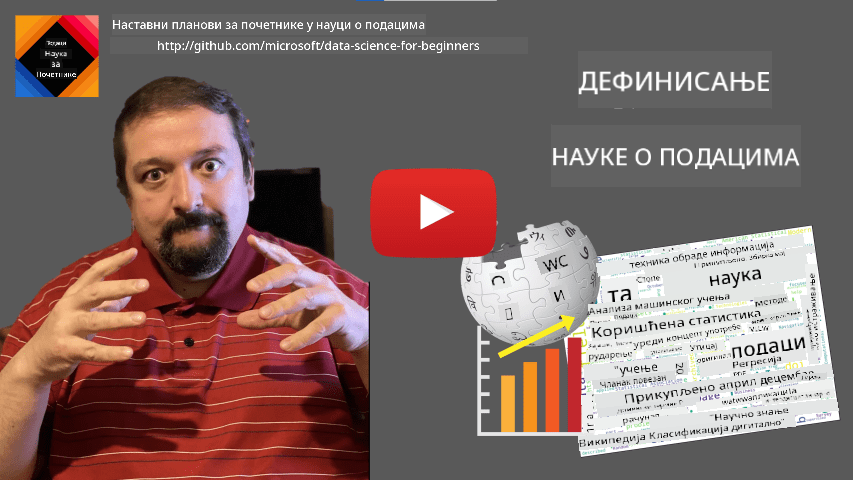

<!--
CO_OP_TRANSLATOR_METADATA:
{
  "original_hash": "a76ab694b1534fa57981311975660bfe",
  "translation_date": "2025-09-06T12:33:42+00:00",
  "source_file": "1-Introduction/01-defining-data-science/README.md",
  "language_code": "sr"
}
-->
# Дефинисање науке о подацима

|  ](../../sketchnotes/01-Definitions.png) |
| :----------------------------------------------------------------------------------------------------: |
|              Дефинисање науке о подацима - _Скетч од [@nitya](https://twitter.com/nitya)_               |

---

## [Квиз пре предавања](https://ff-quizzes.netlify.app/en/ds/quiz/0)

## Шта су подаци?
У нашем свакодневном животу, стално смо окружени подацима. Текст који сада читате су подаци. Листа телефонских бројева ваших пријатеља у вашем паметном телефону су подаци, као и тренутно време приказано на вашем сату. Као људска бића, природно оперишемо подацима бројећи новац који имамо или пишући писма пријатељима.

Међутим, подаци су постали много значајнији са стварањем рачунара. Основна улога рачунара је извођење прорачуна, али им је потребно да имају податке над којима ће радити. Због тога је важно разумети како рачунари чувају и обрађују податке.

Са појавом интернета, улога рачунара као уређаја за руковање подацима се повећала. Ако размислите, сада све више користимо рачунаре за обраду и комуникацију података, а не за стварне прорачуне. Када пишемо е-пошту пријатељу или тражимо неке информације на интернету - у суштини стварамо, чувамо, преносимо и манипулишемо подацима.
> Можете ли се сетити када сте последњи пут користили рачунар за стварно извођење прорачуна?

## Шта је наука о подацима?

На [Википедији](https://en.wikipedia.org/wiki/Data_science), **наука о подацима** је дефинисана као *научна област која користи научне методе за извлачење знања и увида из структурираних и неструктурираних података, и примењује знање и применљиве увиде из података у широком спектру области примене*.

Ова дефиниција истиче следеће важне аспекте науке о подацима:

* Главни циљ науке о подацима је **извлачење знања** из података, другим речима - **разумевање** података, проналажење скривених односа и изградња **модела**.
* Наука о подацима користи **научне методе**, као што су вероватноћа и статистика. У ствари, када је термин *наука о подацима* први пут уведен, неки су тврдили да је то само нови модеран назив за статистику. Данас је јасно да је ова област много шира.
* Добијено знање треба применити за стварање **применљивих увида**, тј. практичних увида који се могу применити у стварним пословним ситуацијама.
* Требало би да будемо у могућности да радимо са **структурираним** и **неструктурираним** подацима. О различитим типовима података ћемо говорити касније у курсу.
* **Област примене** је важан концепт, и научници о подацима често морају имати барем одређени ниво стручности у области проблема, на пример: финансије, медицина, маркетинг итд.

> Још један важан аспект науке о подацима је да проучава како се подаци могу прикупљати, чувати и обрађивати помоћу рачунара. Док нам статистика пружа математичке основе, наука о подацима примењује математичке концепте за стварно извлачење увида из података.

Један од начина (који се приписује [Џиму Греју](https://en.wikipedia.org/wiki/Jim_Gray_(computer_scientist))) да се посматра наука о подацима је да се сматра посебном парадигмом науке:
* **Емпиријска**, у којој се углавном ослањамо на посматрања и резултате експеримената
* **Теоријска**, где нови концепти произилазе из постојећег научног знања
* **Рачунарска**, где откривамо нове принципе на основу рачунарских експеримената
* **Заснована на подацима**, која се базира на откривању односа и образаца у подацима  

## Друге сродне области

Пошто су подаци свеприсутни, наука о подацима је такође широка област која додирује многе друге дисциплине.

## Типови података

Као што смо већ поменули, подаци су свуда око нас. Само их треба ухватити на прави начин! Корисно је разликовати **структуриране** и **неструктуриране** податке. Први су обично представљени у неком добро структурисаном облику, често као табела или више табела, док су други само збирка датотека. Понекад можемо говорити и о **полуструктурираним** подацима, који имају неку врсту структуре која може знатно варирати.

| Структурирани                                                               | Полуструктурирани                                                                            | Неструктурирани                          |
| ---------------------------------------------------------------------------- | ------------------------------------------------------------------------------------------- | --------------------------------------- |
| Листа људи са њиховим телефонским бројевима                                  | Википедијине странице са линковима                                                          | Текст Енциклопедије Британика           |
| Температура у свим просторијама зграде сваког минута у последњих 20 година   | Збирка научних радова у JSON формату са ауторима, датумом објављивања и апстрактом           | Датотеке са корпоративним документима   |
| Подаци о старости и полу свих људи који улазе у зграду                       | Интернет странице                                                                           | Сирови видео снимци са надзорних камера |

## Где пронаћи податке

Постоји много могућих извора података, и било би немогуће навести све! Међутим, хајде да поменемо нека типична места где можете пронаћи податке:

* **Структурирани**
  - **Интернет ствари** (IoT), укључујући податке са различитих сензора, као што су сензори температуре или притиска, пружају много корисних података. На пример, ако је пословна зграда опремљена IoT сензорима, можемо аутоматски контролисати грејање и осветљење како бисмо минимизирали трошкове.
  - **Анкете** које тражимо од корисника да попуне након куповине или након посете веб сајту.
  - **Анализа понашања** може нам, на пример, помоћи да разумемо колико дубоко корисник улази у сајт и који је типичан разлог за напуштање сајта.
* **Неструктурирани**
  - **Текстови** могу бити богат извор увида, као што је укупна **оценa сентимента**, или извлачење кључних речи и семантичког значења.
  - **Слике** или **Видео**. Видео са надзорне камере може се користити за процену саобраћаја на путу и информисање људи о потенцијалним гужвама.
  - **Логови веб сервера** могу се користити за разумевање које странице нашег сајта се најчешће посећују и колико дуго.
* **Полуструктурирани**
  - **Графови друштвених мрежа** могу бити одлични извори података о личностима корисника и потенцијалној ефикасности у ширењу информација.
  - Када имамо збирку фотографија са забаве, можемо покушати да извучемо податке о **групној динамици** тако што ћемо изградити граф људи који се фотографишу заједно.

Познавањем различитих могућих извора података, можете размишљати о различитим сценаријима где се технике науке о подацима могу применити за боље разумевање ситуације и побољшање пословних процеса.

## Шта можете радити са подацима

У науци о подацима, фокусирамо се на следеће кораке у раду са подацима:

Наравно, у зависности од стварних података, неки кораци могу недостајати (нпр. када већ имамо податке у бази података или када није потребно обучавање модела), или се неки кораци могу понављати више пута (као што је обрада података).

## Дигитализација и дигитална трансформација

У последњој деценији, многи послови су почели да разумеју важност података приликом доношења пословних одлука. Да би се применили принципи науке о подацима у вођењу пословања, прво је потребно прикупити неке податке, односно превести пословне процесе у дигитални облик. Ово је познато као **дигитализација**. Примена техника науке о подацима на ове податке ради доношења одлука може довести до значајног повећања продуктивности (или чак до промене пословног модела), што се назива **дигитална трансформација**.

Размотримо пример. Претпоставимо да имамо курс о науци о подацима (као што је овај) који држимо онлајн студентима и желимо да користимо науку о подацима како бисмо га побољшали. Како то можемо урадити?

Можемо почети питањем "Шта се може дигитализовати?" Најједноставнији начин био би мерење времена које је сваком студенту потребно да заврши сваки модул, као и мерење стеченог знања давањем теста са вишеструким избором на крају сваког модула. Просечавањем времена завршетка за све студенте, можемо открити који модули изазивају највише потешкоћа и радити на њиховом поједностављењу.
Можете тврдити да овај приступ није идеалан, јер модули могу бити различитих дужина. Вероватно је праведније поделити време са дужином модула (у броју карактера) и упоредити те вредности уместо тога.
Када почнемо да анализирамо резултате тестова са вишеструким избором, можемо покушати да утврдимо које концепте ученици тешко разумеју и искористимо те информације за побољшање садржаја. Да бисмо то урадили, потребно је да дизајнирамо тестове на такав начин да свако питање одговара одређеном концепту или делу знања.

Ако желимо да идемо још дубље, можемо упоредити време потребно за сваки модул са старосном категоријом ученика. Можда ћемо открити да за неке старосне категорије завршетак модула траје непримерено дуго или да ученици одустану пре него што га заврше. Ово нам може помоћи да дамо препоруке за старосну доб модула и смањимо незадовољство људи због погрешних очекивања.

## 🚀 Изазов

У овом изазову покушаћемо да пронађемо концепте релевантне за област науке о подацима анализирајући текстове. Преузећемо Википедијски чланак о науци о подацима, обрадити текст и затим направити облак речи попут овог:

Посетите [`notebook.ipynb`](../../../../1-Introduction/01-defining-data-science/notebook.ipynb ':ignore') да бисте прегледали код. Такође можете покренути код и видети како у реалном времену извршава све трансформације података.

> Ако не знате како да покренете код у Jupyter Notebook-у, погледајте [овај чланак](https://soshnikov.com/education/how-to-execute-notebooks-from-github/).

## [Квиз након предавања](https://ff-quizzes.netlify.app/en/ds/quiz/1)

## Задаци

* **Задатак 1**: Измените горњи код да бисте пронашли повезане концепте за области **Big Data** и **Machine Learning**
* **Задатак 2**: [Размислите о сценаријима у науци о подацима](assignment.md)

## Захвалнице

Ова лекција је написана са ♥️ од стране [Дмитрија Сошњикова](http://soshnikov.com)

---

**Одрицање од одговорности**:  
Овај документ је преведен коришћењем услуге за превођење помоћу вештачке интелигенције [Co-op Translator](https://github.com/Azure/co-op-translator). Иако настојимо да обезбедимо тачност, молимо вас да имате у виду да аутоматски преводи могу садржати грешке или нетачности. Оригинални документ на изворном језику треба сматрати ауторитативним извором. За критичне информације препоручује се професионални превод од стране људи. Не сносимо одговорност за било каква погрешна тумачења или неспоразуме који могу произаћи из коришћења овог превода.