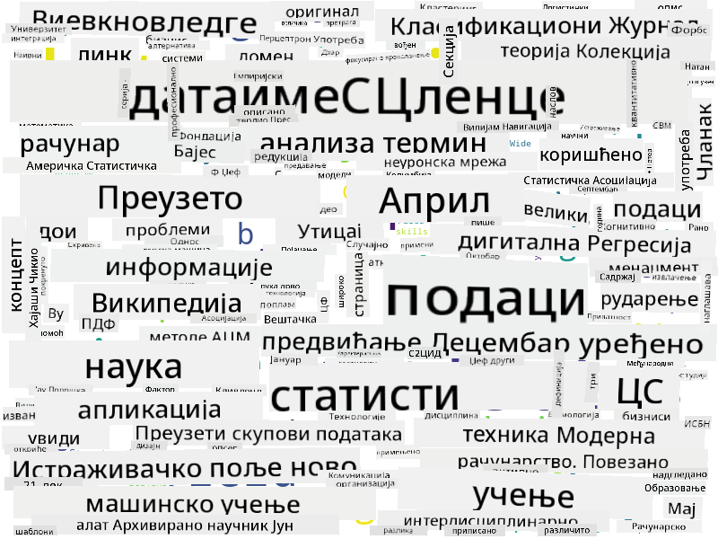

<!--
CO_OP_TRANSLATOR_METADATA:
{
  "original_hash": "8141e7195841682914be03ef930fe43d",
  "translation_date": "2025-09-03T20:30:55+00:00",
  "source_file": "1-Introduction/01-defining-data-science/README.md",
  "language_code": "sr"
}
-->
## Типови података

Као што смо већ поменули, подаци су свуда око нас. Само их треба правилно ухватити! Корисно је разликовати између **структурираних** и **неструктурираних** података. Први су обично представљени у добро организованом облику, често као табела или више табела, док су други само збирка датотека. Понекад можемо говорити и о **полуструктурираним** подацима, који имају неку врсту структуре која може значајно варирати.

| Структурирани                                                               | Полуструктурирани                                                                             | Неструктурирани                          |
| ---------------------------------------------------------------------------- | -------------------------------------------------------------------------------------------- | --------------------------------------- |
| Листа људи са њиховим телефонским бројевима                                  | Википедијине странице са линковима                                                           | Текст Енциклопедије Британика            |
| Температура у свим просторијама зграде сваког минута у последњих 20 година   | Збирка научних радова у JSON формату са ауторима, датумом објављивања и апстрактом            | Датотеке са корпоративним документима    |
| Подаци о старости и полу свих људи који улазе у зграду                       | Интернет странице                                                                             | Сирови видео снимак са надзорне камере   |

## Где пронаћи податке

Постоји много могућих извора података, и било би немогуће набројати их све! Међутим, хајде да поменемо неке од типичних места где можете пронаћи податке:

* **Структурирани**
  - **Интернет ствари** (IoT), укључујући податке са различитих сензора, као што су сензори температуре или притиска, пружају много корисних података. На пример, ако је пословна зграда опремљена IoT сензорима, можемо аутоматски контролисати грејање и осветљење како бисмо минимизирали трошкове.
  - **Анкете** које тражимо од корисника да попуне након куповине или након посете веб сајту.
  - **Анализа понашања** може, на пример, помоћи да разумемо колико дубоко корисник улази у сајт и који је типичан разлог за напуштање сајта.
* **Неструктурирани**
  - **Текстови** могу бити богат извор увида, као што је укупна **оценa сентимента**, или извлачење кључних речи и семантичког значења.
  - **Слике** или **Видео**. Видео са надзорне камере може се користити за процену саобраћаја на путу и информисање људи о потенцијалним гужвама.
  - **Логови веб сервера** могу се користити за разумевање које странице нашег сајта се најчешће посећују и колико дуго.
* **Полуструктурирани**
  - **Графови друштвених мрежа** могу бити одличан извор података о личностима корисника и потенцијалној ефикасности у ширењу информација.
  - Када имамо гомилу фотографија са забаве, можемо покушати да извучемо податке о **групној динамици** тако што ћемо направити граф људи који се фотографишу једни с другима.

Познавањем различитих могућих извора података, можете размишљати о различитим сценаријима где се технике науке о подацима могу применити за боље разумевање ситуације и побољшање пословних процеса.

## Шта можете радити са подацима

У науци о подацима, фокусирамо се на следеће кораке у раду са подацима:

Наравно, у зависности од стварних података, неки кораци могу недостајати (нпр. када већ имамо податке у бази или када нам није потребно тренирање модела), или се неки кораци могу поновити више пута (као што је обрада података).

## Дигитализација и дигитална трансформација

У последњој деценији, многе компаније су почеле да схватају важност података при доношењу пословних одлука. Да би се применили принципи науке о подацима у вођењу пословања, прво је потребно прикупити неке податке, односно превести пословне процесе у дигитални облик. Ово је познато као **дигитализација**. Примена техника науке о подацима на ове податке ради доношења одлука може довести до значајног повећања продуктивности (или чак пословног преокрета), што се назива **дигитална трансформација**.

Хајде да размотримо пример. Претпоставимо да имамо курс о науци о подацима (као овај) који онлајн предајемо студентима и желимо да користимо науку о подацима за његово побољшање. Како то можемо урадити?

Можемо почети питањем "Шта се може дигитализовати?" Најједноставнији начин би био да измеримо време које је сваком студенту потребно да заврши сваки модул и да измеримо стечено знање давањем теста са вишеструким избором на крају сваког модула. Просечним временом завршетка за све студенте можемо открити који модули изазивају највише потешкоћа и радити на њиховом поједностављењу.
> Можете тврдити да овај приступ није идеалан, јер модули могу бити различитих дужина. Вероватно је праведније поделити време са дужином модула (у броју карактера) и упоредити те вредности уместо тога.
Када почнемо да анализирамо резултате тестова са вишеструким избором, можемо покушати да утврдимо које концепте ученици тешко разумеју и искористимо те информације за побољшање садржаја. Да бисмо то урадили, потребно је да осмислимо тестове тако да свако питање одговара одређеном концепту или делу знања.

Ако желимо да идемо још дубље, можемо упоредити време потребно за сваки модул са старосном категоријом ученика. Можда ћемо открити да за неке старосне категорије завршетак модула траје непримерено дуго или да ученици одустају пре него што га заврше. Ово нам може помоћи да дамо препоруке за старосну групу за модул и минимизирамо незадовољство људи због погрешних очекивања.

## 🚀 Изазов

У овом изазову, покушаћемо да пронађемо концепте релевантне за област науке о подацима анализирајући текстове. Узет ћемо Википедијски чланак о науци о подацима, преузети и обрадити текст, а затим направити облак речи попут овог:

Посетите [`notebook.ipynb`](../../../../../../../../../1-Introduction/01-defining-data-science/notebook.ipynb ':ignore') да бисте прочитали код. Такође можете покренути код и видети како он изводи све трансформације података у реалном времену.

> Ако не знате како да покренете код у Jupyter Notebook-у, погледајте [овај чланак](https://soshnikov.com/education/how-to-execute-notebooks-from-github/).

## [Квиз након предавања](https://ff-quizzes.netlify.app/en/ds/)

## Задаци

* **Задатак 1**: Измените горњи код да бисте пронашли повезане концепте за области **Big Data** и **Machine Learning**
* **Задатак 2**: [Размислите о сценаријима из науке о подацима](assignment.md)

## Захвалнице

Ова лекција је написана са ♥️ од стране [Дмитрија Сошњикова](http://soshnikov.com)

---

**Одрицање од одговорности**:  
Овај документ је преведен коришћењем услуге за превођење помоћу вештачке интелигенције [Co-op Translator](https://github.com/Azure/co-op-translator). Иако се трудимо да обезбедимо тачност, молимо вас да имате у виду да аутоматски преводи могу садржати грешке или нетачности. Оригинални документ на његовом изворном језику треба сматрати меродавним извором. За критичне информације препоручује се професионални превод од стране људи. Не преузимамо одговорност за било каква погрешна тумачења или неспоразуме који могу настати услед коришћења овог превода.