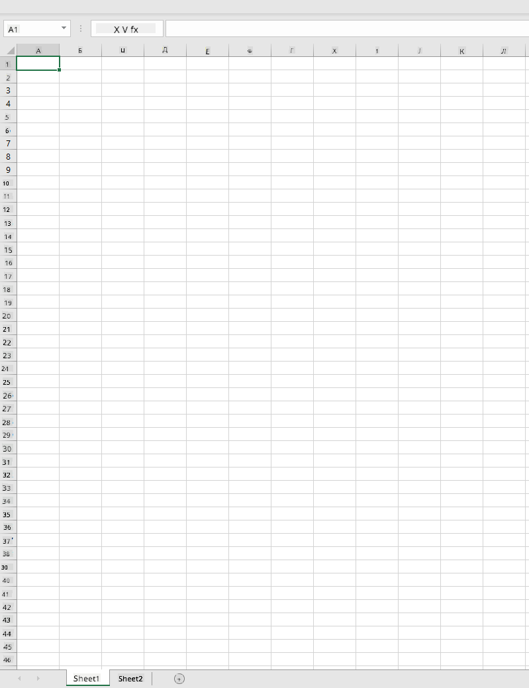
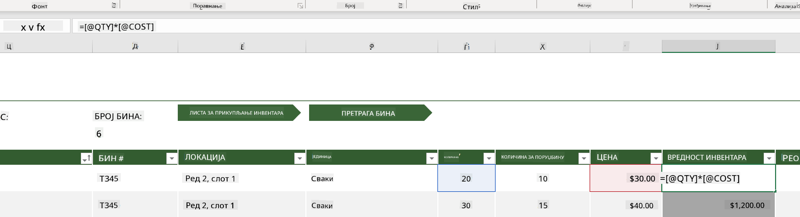
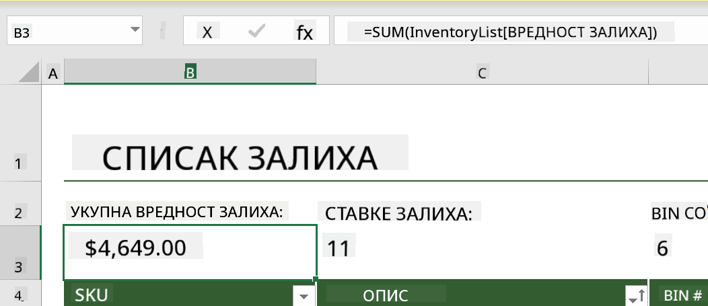
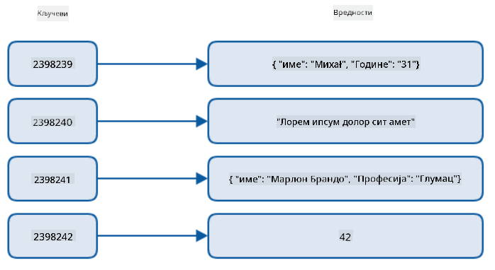
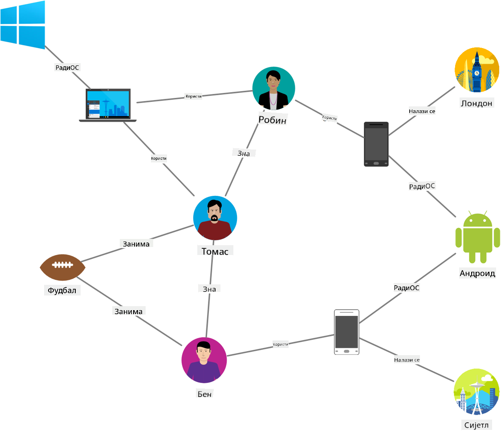
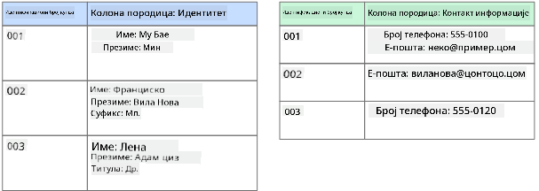
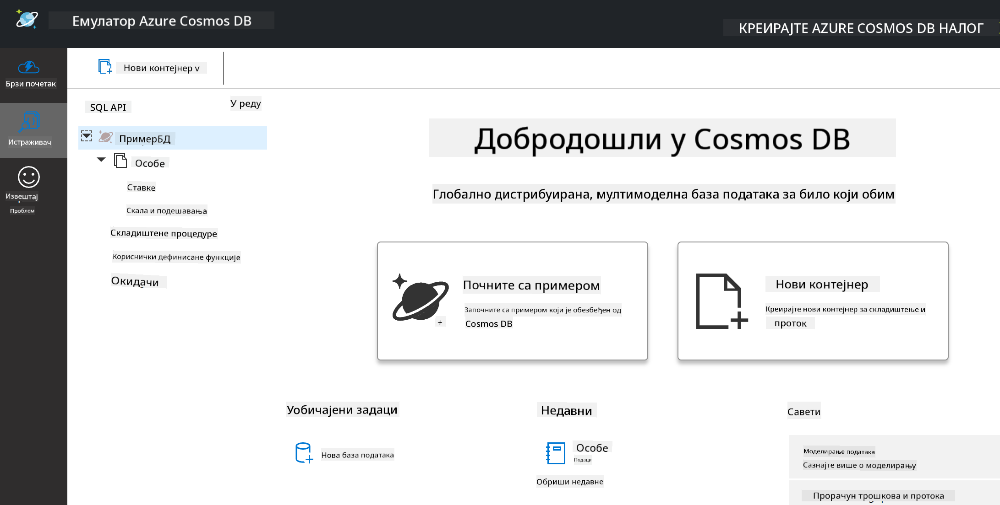
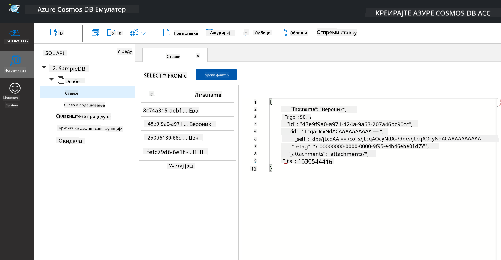
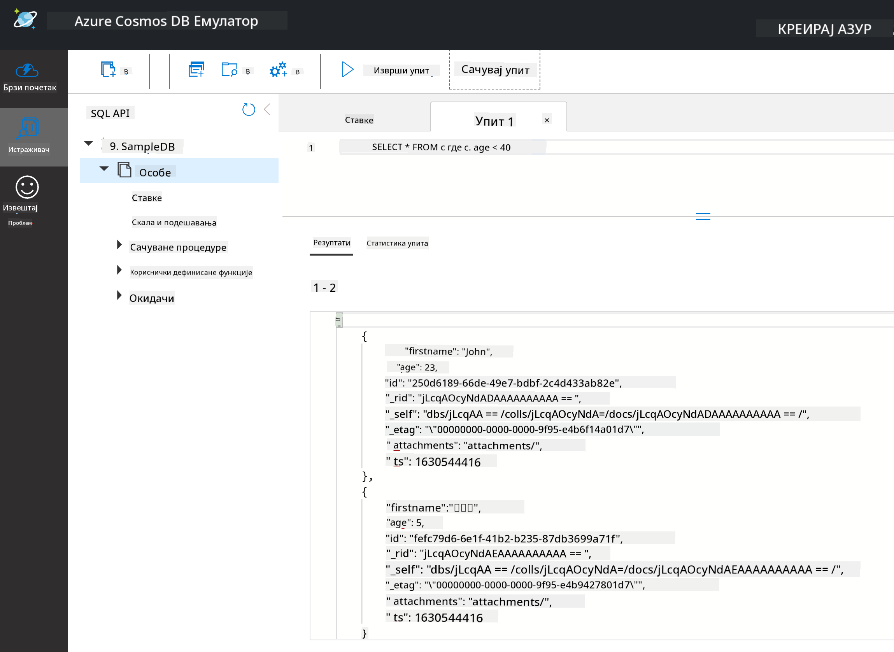

<!--
CO_OP_TRANSLATOR_METADATA:
{
  "original_hash": "32ddfef8121650f2ca2f3416fd283c37",
  "translation_date": "2025-08-30T18:00:33+00:00",
  "source_file": "2-Working-With-Data/06-non-relational/README.md",
  "language_code": "sr"
}
-->
# Рад са подацима: Нерелациони подаци

| ](../../sketchnotes/06-NoSQL.png)|
|:---:|
|Рад са NoSQL подацима - _Скетч од [@nitya](https://twitter.com/nitya)_ |

## [Квиз пре предавања](https://purple-hill-04aebfb03.1.azurestaticapps.net/quiz/10)

Подаци нису ограничени само на релационе базе података. Ова лекција се фокусира на нерелационе податке и обухватиће основе табела и NoSQL-а.

## Табеле

Табеле су популаран начин за чување и истраживање података јер захтевају мање рада за подешавање и почетак рада. У овој лекцији ћете научити основне компоненте табеле, као и формуле и функције. Примери ће бити илустровани помоћу Microsoft Excel-а, али већина делова и тема имаће слична имена и кораке у поређењу са другим софтверима за табеле.



Табела је датотека и биће доступна у фајл систему рачунара, уређаја или у облаку. Сам софтвер може бити заснован на претраживачу или апликација која мора бити инсталирана на рачунару или преузета као апликација. У Excel-у, ове датотеке се такође дефинишу као **радне свеске**, и ова терминологија ће се користити у остатку ове лекције.

Радна свеска садржи један или више **радних листова**, где су сваки радни листови означени картицама. Унутар радног листа налазе се правоугаоници који се називају **ћелије**, које садрже стварне податке. Ћелија је пресек реда и колоне, где су колоне означене алфабетским карактерима, а редови нумерички. Неке табеле ће садржати заглавља у првим редовима како би описале податке у ћелији.

Са овим основним елементима Excel радне свеске, користићемо пример из [Microsoft Templates](https://templates.office.com/) који се фокусира на инвентар како бисмо прошли кроз додатне делове табеле.

### Управљање инвентаром

Датотека табеле под називом "InventoryExample" је форматирана табела ставки у инвентару која садржи три радна листа, где су картице означене као "Inventory List", "Inventory Pick List" и "Bin Lookup". Ред 4 радног листа Inventory List је заглавље које описује вредност сваке ћелије у колони заглавља.



Постоје случајеви када је вредност ћелије зависна од вредности других ћелија. Табела Inventory List прати трошкове сваке ставке у инвентару, али шта ако треба да знамо укупну вредност свих ставки у инвентару? [**Формуле**](https://support.microsoft.com/en-us/office/overview-of-formulas-34519a4e-1e8d-4f4b-84d4-d642c4f63263) извршавају радње на подацима у ћелијама и користе се за израчунавање вредности инвентара у овом примеру. Ова табела користи формулу у колони Inventory Value за израчунавање вредности сваке ставке множењем количине под QTY заглављем и трошкова под COST заглављем. Дупли клик или истицање ћелије ће приказати формулу. Приметићете да формуле почињу знаком једнакости, након чега следи израчун или операција.



Можемо користити другу формулу да саберемо све вредности у колони Inventory Value како бисмо добили њену укупну вредност. Ово би могло бити израчунато додавањем сваке ћелије, али то може бити заморан задатак. Excel има [**функције**](https://support.microsoft.com/en-us/office/sum-function-043e1c7d-7726-4e80-8f32-07b23e057f89), или унапред дефинисане формуле за извршавање израчунавања на вредностима ћелија. Функције захтевају аргументе, који су потребне вредности за извршавање ових израчунавања. Када функције захтевају више од једног аргумента, они морају бити наведени у одређеном редоследу или функција можда неће израчунати исправну вредност. У овом примеру користи се функција SUM, која користи вредности у колони Inventory Value као аргумент за сабирање и генерисање укупне вредности наведене у реду 3, колони B (такође познатој као B3).

## NoSQL

NoSQL је општи термин за различите начине чувања нерелационих података и може се тумачити као "не-SQL", "нерелационо" или "не само SQL". Ове врсте система база података могу се категоризовати у 4 типа.


> Извор: [Michał Białecki Blog](https://www.michalbialecki.com/2018/03/18/azure-cosmos-db-key-value-database-cloud/)

[Key-value](https://docs.microsoft.com/en-us/azure/architecture/data-guide/big-data/non-relational-data#keyvalue-data-stores) базе података повезују јединствене кључеве, који су јединствени идентификатори повезани са вредностима. Ови парови се чувају помоћу [хеш табеле](https://www.hackerearth.com/practice/data-structures/hash-tables/basics-of-hash-tables/tutorial/) са одговарајућом хеш функцијом.


> Извор: [Microsoft](https://docs.microsoft.com/en-us/azure/cosmos-db/graph/graph-introduction#graph-database-by-example)

[Graph](https://docs.microsoft.com/en-us/azure/architecture/data-guide/big-data/non-relational-data#graph-data-stores) базе података описују односе у подацима и представљене су као колекција чворова и ивица. Чвор представља ентитет, нешто што постоји у стварном свету, као што је студент или банковни извод. Ивице представљају однос између два ентитета. Сваки чвор и ивица имају својства која пружају додатне информације о њима.



[Columnar](https://docs.microsoft.com/en-us/azure/architecture/data-guide/big-data/non-relational-data#columnar-data-stores) базе података организују податке у колоне и редове слично релационој структури података, али је свака колона подељена у групе које се називају породице колона, где су сви подаци унутар једне колоне повезани и могу се преузети и мењати као једна целина.

### Чување докумената у Azure Cosmos DB

[Document](https://docs.microsoft.com/en-us/azure/architecture/data-guide/big-data/non-relational-data#document-data-stores) базе података граде се на концепту key-value база података и састоје се од серије поља и објеката. Овај део ће истражити базе података докумената помоћу Cosmos DB емулатора.

Cosmos DB база података одговара дефиницији "Не само SQL", где се Cosmos DB база докумената ослања на SQL за упите података. [Претходна лекција](../05-relational-databases/README.md) о SQL-у покрива основе језика, и моћи ћемо да применимо неке од истих упита на базу докумената овде. Користићемо Cosmos DB емулатор, који нам омогућава да креирамо и истражујемо базу докумената локално на рачунару. Прочитајте више о емулатору [овде](https://docs.microsoft.com/en-us/azure/cosmos-db/local-emulator?tabs=ssl-netstd21).

Документ је колекција поља и вредности објеката, где поља описују шта вредност објекта представља. Испод је пример документа.

```json
{
    "firstname": "Eva",
    "age": 44,
    "id": "8c74a315-aebf-4a16-bb38-2430a9896ce5",
    "_rid": "bHwDAPQz8s0BAAAAAAAAAA==",
    "_self": "dbs/bHwDAA==/colls/bHwDAPQz8s0=/docs/bHwDAPQz8s0BAAAAAAAAAA==/",
    "_etag": "\"00000000-0000-0000-9f95-010a691e01d7\"",
    "_attachments": "attachments/",
    "_ts": 1630544034
}
```

Поља од интереса у овом документу су: `firstname`, `id` и `age`. Остала поља са подвученим линијама генерисана су од стране Cosmos DB-а.

#### Истраживање података помоћу Cosmos DB емулатора

Можете преузети и инсталирати емулатор [за Windows овде](https://aka.ms/cosmosdb-emulator). Погледајте ову [документацију](https://docs.microsoft.com/en-us/azure/cosmos-db/local-emulator?tabs=ssl-netstd21#run-on-linux-macos) за опције како да покренете емулатор на macOS-у и Linux-у.

Емулатор покреће прозор у претраживачу, где Explorer приказ омогућава истраживање докумената.



Ако пратите кораке, кликните на "Start with Sample" да бисте генерисали пример базе података под називом SampleDB. Ако проширите SampleDB кликом на стрелицу, пронаћи ћете контејнер под називом `Persons`. Контејнер садржи колекцију ставки, које су документи унутар контејнера. Можете истражити четири појединачна документа под `Items`.



#### Упити докумената помоћу Cosmos DB емулатора

Такође можемо извршавати упите на пример подацима кликом на дугме "New SQL Query" (друго дугме с лева).

`SELECT * FROM c` враћа све документе у контејнеру. Додајмо where клаузу и пронађимо све који су млађи од 40 година.

`SELECT * FROM c where c.age < 40`



Упит враћа два документа, приметите да је вредност поља age за сваки документ мања од 40.

#### JSON и документи

Ако сте упознати са JavaScript Object Notation (JSON), приметићете да документи изгледају слично JSON-у. У овом директоријуму постоји датотека `PersonsData.json` са више података коју можете отпремити у контејнер Persons у емулатору помоћу дугмета `Upload Item`.

У већини случајева, API-ји који враћају JSON податке могу се директно пренети и чувати у базама докумената. Испод је још један документ, који представља твитове са Microsoft Twitter налога, преузете помоћу Twitter API-ја, а затим уметнуте у Cosmos DB.

```json
{
    "created_at": "2021-08-31T19:03:01.000Z",
    "id": "1432780985872142341",
    "text": "Blank slate. Like this tweet if you’ve ever painted in Microsoft Paint before. https://t.co/cFeEs8eOPK",
    "_rid": "dhAmAIUsA4oHAAAAAAAAAA==",
    "_self": "dbs/dhAmAA==/colls/dhAmAIUsA4o=/docs/dhAmAIUsA4oHAAAAAAAAAA==/",
    "_etag": "\"00000000-0000-0000-9f84-a0958ad901d7\"",
    "_attachments": "attachments/",
    "_ts": 1630537000
```

Поља од интереса у овом документу су: `created_at`, `id` и `text`.

## 🚀 Изазов

Постоји датотека `TwitterData.json` коју можете отпремити у базу података SampleDB. Препоручује се да је додате у посебан контејнер. Ово се може урадити на следећи начин:

1. Кликните на дугме "New Container" у горњем десном углу
1. Изаберите постојећу базу података (SampleDB), креирајте ID за контејнер
1. Поставите partition key на `/id`
1. Кликните OK (можете игнорисати остале информације у овом приказу јер је ово мали скуп података који ради локално на вашем рачунару)
1. Отворите нови контејнер и отпремите датотеку Twitter Data помоћу дугмета `Upload Item`

Покушајте да извршите неколико SELECT упита како бисте пронашли документе који у пољу text садрже реч "Microsoft". Савет: покушајте да користите [LIKE кључну реч](https://docs.microsoft.com/en-us/azure/cosmos-db/sql/sql-query-keywords#using-like-with-the--wildcard-character).

## [Квиз након предавања](https://purple-hill-04aebfb03.1.azurestaticapps.net/quiz/11)

## Преглед и самостално учење

- Постоје додатна форматирања и функције додате у ову табелу које ова лекција не покрива. Microsoft има [велику библиотеку документације и видео снимака](https://support.microsoft.com/excel) о Excel-у ако сте заинтересовани за више информација.

- Ова архитектонска документација детаљно описује карактеристике различитих типова нерелационих података: [Нерелациони подаци и NoSQL](https://docs.microsoft.com/en-us/azure/architecture/data-guide/big-data/non-relational-data)

- Cosmos DB је база података у облаку која такође може чувати различите типове NoSQL података поменуте у овој лекцији. Сазнајте више о овим типовима у овом [Cosmos DB Microsoft Learn модулу](https://docs.microsoft.com/en-us/learn/paths/work-with-nosql-data-in-azure-cosmos-db/).

## Задатак

[Soda Profits](assignment.md)

---

**Одрицање од одговорности**:  
Овај документ је преведен коришћењем услуге за превођење помоћу вештачке интелигенције [Co-op Translator](https://github.com/Azure/co-op-translator). Иако се трудимо да обезбедимо тачност, молимо вас да имате у виду да аутоматизовани преводи могу садржати грешке или нетачности. Оригинални документ на његовом изворном језику треба сматрати меродавним извором. За критичне информације препоручује се професионални превод од стране људи. Не преузимамо одговорност за било каква погрешна тумачења или неспоразуме који могу настати услед коришћења овог превода.