<!--
CO_OP_TRANSLATOR_METADATA:
{
  "original_hash": "87faccac113d772551486a67a607153e",
  "translation_date": "2025-08-30T19:14:04+00:00",
  "source_file": "3-Data-Visualization/10-visualization-distributions/README.md",
  "language_code": "sr"
}
-->
# Визуализација дистрибуција

| ](../../sketchnotes/10-Visualizing-Distributions.png)|
|:---:|
| Визуализација дистрибуција - _Скетч од [@nitya](https://twitter.com/nitya)_ |

У претходној лекцији, научили сте неке занимљиве чињенице о скупу података о птицама из Минесоте. Пронашли сте погрешне податке визуализујући одступања и погледали разлике између категорија птица према њиховој максималној дужини.

## [Квиз пре предавања](https://purple-hill-04aebfb03.1.azurestaticapps.net/quiz/18)
## Истражите скуп података о птицама

Још један начин да се дубље истражи скуп података је гледањем његове дистрибуције, односно како су подаци организовани дуж осе. На пример, можда желите да сазнате општу дистрибуцију максималног распона крила или максималне телесне масе птица из Минесоте.

Хајде да откријемо неке чињенице о дистрибуцијама података у овом скупу података. У датотеци _notebook.ipynb_ која се налази у корену фасцикле ове лекције, увезите Pandas, Matplotlib и ваше податке:

```python
import pandas as pd
import matplotlib.pyplot as plt
birds = pd.read_csv('../../data/birds.csv')
birds.head()
```

|      | Име                          | Научно име             | Категорија            | Ред          | Породица | Род         | Статус заштите       | МинДужина | МаксДужина | МинТелеснаМаса | МаксТелеснаМаса | МинРаспонКрила | МаксРаспонКрила |
| ---: | :--------------------------- | :--------------------- | :-------------------- | :----------- | :------- | :---------- | :----------------- | --------: | --------: | ----------: | ----------: | ----------: | ----------: |
|    0 | Црнобрки патак               | Dendrocygna autumnalis | Патке/Гуске/Водене птице | Anseriformes | Anatidae | Dendrocygna | LC                 |        47 |        56 |         652 |        1020 |          76 |          94 |
|    1 | Жућкасти патак               | Dendrocygna bicolor    | Патке/Гуске/Водене птице | Anseriformes | Anatidae | Dendrocygna | LC                 |        45 |        53 |         712 |        1050 |          85 |          93 |
|    2 | Снежна гуска                 | Anser caerulescens     | Патке/Гуске/Водене птице | Anseriformes | Anatidae | Anser       | LC                 |        64 |        79 |        2050 |        4050 |         135 |         165 |
|    3 | Росова гуска                 | Anser rossii           | Патке/Гуске/Водене птице | Anseriformes | Anatidae | Anser       | LC                 |      57.3 |        64 |        1066 |        1567 |         113 |         116 |
|    4 | Велика бела гуска            | Anser albifrons        | Патке/Гуске/Водене птице | Anseriformes | Anatidae | Anser       | LC                 |        64 |        81 |        1930 |        3310 |         130 |         165 |

Уопштено, можете брзо погледати начин на који су подаци распоређени користећи расејани графикон као што смо то урадили у претходној лекцији:

```python
birds.plot(kind='scatter',x='MaxLength',y='Order',figsize=(12,8))

plt.title('Max Length per Order')
plt.ylabel('Order')
plt.xlabel('Max Length')

plt.show()
```
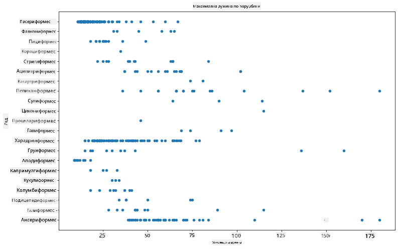

Ово даје преглед опште дистрибуције дужине тела по реду птица, али није оптималан начин за приказивање правих дистрибуција. Тај задатак се обично обавља креирањем хистограма.
## Рад са хистограмима

Matplotlib нуди веома добре начине за визуализацију дистрибуције података користећи хистограме. Овај тип графикона је сличан стубичастом графикону где се дистрибуција може видети кроз раст и пад стубова. Да бисте направили хистограм, потребни су вам нумерички подаци. Да бисте направили хистограм, можете нацртати графикон дефинишући врсту као 'hist' за хистограм. Овај графикон приказује дистрибуцију MaxBodyMass за цео опсег нумеричких података скупа података. Дељењем низа података на мање групе, може приказати дистрибуцију вредности података:

```python
birds['MaxBodyMass'].plot(kind = 'hist', bins = 10, figsize = (12,12))
plt.show()
```
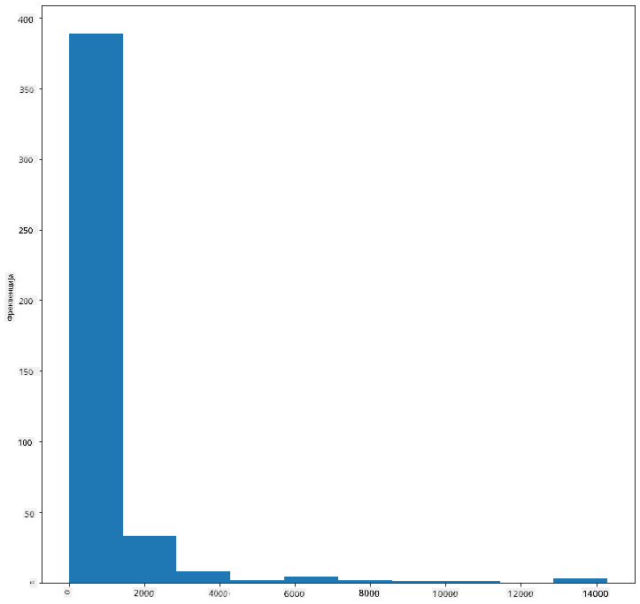

Као што видите, већина од 400+ птица у овом скупу података спада у опсег испод 2000 за њихову максималну телесну масу. Стеците више увида у податке променом параметра `bins` на већи број, нешто попут 30:

```python
birds['MaxBodyMass'].plot(kind = 'hist', bins = 30, figsize = (12,12))
plt.show()
```
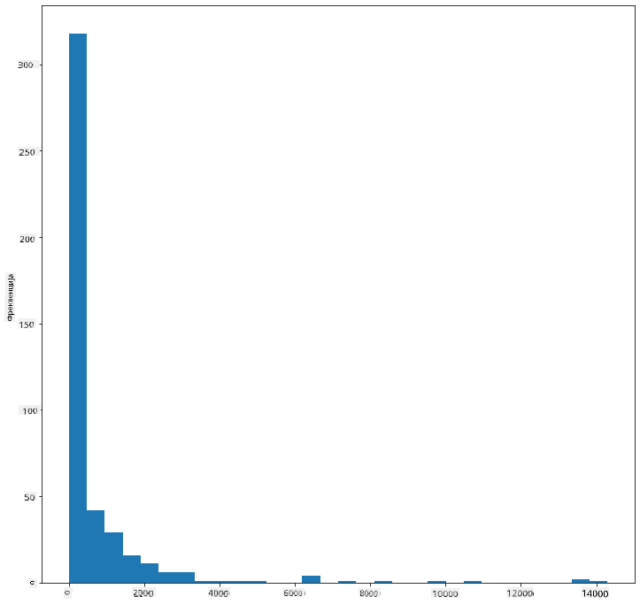

Овај графикон приказује дистрибуцију на мало детаљнији начин. Графикон мање нагнут улево могао би се направити тако што бисте осигурали да изаберете само податке унутар датог опсега:

Филтрирајте своје податке да добијете само оне птице чија је телесна маса испод 60 и прикажите 40 `bins`:

```python
filteredBirds = birds[(birds['MaxBodyMass'] > 1) & (birds['MaxBodyMass'] < 60)]      
filteredBirds['MaxBodyMass'].plot(kind = 'hist',bins = 40,figsize = (12,12))
plt.show()     
```
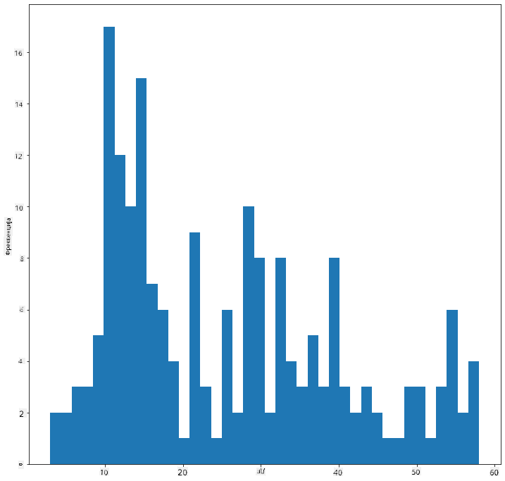

✅ Испробајте неке друге филтере и тачке података. Да бисте видели пуну дистрибуцију података, уклоните филтер `['MaxBodyMass']` да бисте приказали означене дистрибуције.

Хистограм нуди неке лепе боје и побољшања означавања које можете испробати:

Направите 2D хистограм да упоредите однос између две дистрибуције. Хајде да упоредимо `MaxBodyMass` и `MaxLength`. Matplotlib нуди уграђен начин да покаже конвергенцију користећи светлије боје:

```python
x = filteredBirds['MaxBodyMass']
y = filteredBirds['MaxLength']

fig, ax = plt.subplots(tight_layout=True)
hist = ax.hist2d(x, y)
```
Чини се да постоји очекивана корелација између ова два елемента дуж очекиване осе, са једном посебно снажном тачком конвергенције:

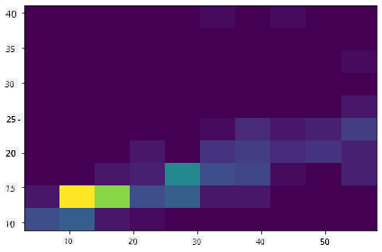

Хистограми добро функционишу по подразумеваним подешавањима за нумеричке податке. Шта ако треба да видите дистрибуције према текстуалним подацима? 
## Истражите скуп података за дистрибуције користећи текстуалне податке 

Овај скуп података такође укључује добре информације о категорији птица и њеном роду, врсти и породици, као и њеном статусу заштите. Хајде да истражимо ове информације о статусу заштите. Каква је дистрибуција птица према њиховом статусу заштите?

> ✅ У скупу података, користи се неколико акронима за описивање статуса заштите. Ови акроними потичу из [IUCN Red List Categories](https://www.iucnredlist.org/), организације која каталогизује статус врста.
> 
> - CR: Критично угрожене
> - EN: Угрожене
> - EX: Изумрле
> - LC: Најмање забрињавајуће
> - NT: Близу угрожености
> - VU: Ранљиве

Ово су текстуалне вредности, па ћете морати да урадите трансформацију да бисте направили хистограм. Користећи dataframe filteredBirds, прикажите његов статус заштите уз његов минимални распон крила. Шта видите?

```python
x1 = filteredBirds.loc[filteredBirds.ConservationStatus=='EX', 'MinWingspan']
x2 = filteredBirds.loc[filteredBirds.ConservationStatus=='CR', 'MinWingspan']
x3 = filteredBirds.loc[filteredBirds.ConservationStatus=='EN', 'MinWingspan']
x4 = filteredBirds.loc[filteredBirds.ConservationStatus=='NT', 'MinWingspan']
x5 = filteredBirds.loc[filteredBirds.ConservationStatus=='VU', 'MinWingspan']
x6 = filteredBirds.loc[filteredBirds.ConservationStatus=='LC', 'MinWingspan']

kwargs = dict(alpha=0.5, bins=20)

plt.hist(x1, **kwargs, color='red', label='Extinct')
plt.hist(x2, **kwargs, color='orange', label='Critically Endangered')
plt.hist(x3, **kwargs, color='yellow', label='Endangered')
plt.hist(x4, **kwargs, color='green', label='Near Threatened')
plt.hist(x5, **kwargs, color='blue', label='Vulnerable')
plt.hist(x6, **kwargs, color='gray', label='Least Concern')

plt.gca().set(title='Conservation Status', ylabel='Min Wingspan')
plt.legend();
```

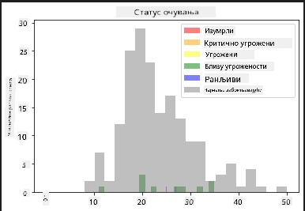

Не чини се да постоји добра корелација између минималног распона крила и статуса заштите. Тестирајте друге елементе скупа података користећи овај метод. Можете испробати различите филтере. Да ли налазите неку корелацију?

## Графикони густине

Можда сте приметили да хистограми које смо до сада гледали имају 'кораке' и не теку глатко у луку. Да бисте приказали глаткији графикон густине, можете пробати графикон густине.

Да бисте радили са графиконима густине, упознајте се са новом библиотеком за графиконе, [Seaborn](https://seaborn.pydata.org/generated/seaborn.kdeplot.html). 

Учитавањем Seaborn-а, пробајте основни графикон густине:

```python
import seaborn as sns
import matplotlib.pyplot as plt
sns.kdeplot(filteredBirds['MinWingspan'])
plt.show()
```
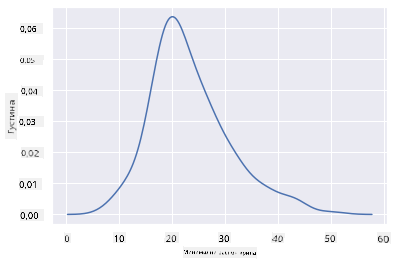

Можете видети како графикон одражава претходни за податке о минималном распону крила; само је мало глаткији. Према документацији Seaborn-а, "У односу на хистограм, KDE може произвести графикон који је мање претрпан и лакши за интерпретацију, посебно када се цртају више дистрибуција. Али има потенцијал да уведе изобличења ако је основна дистрибуција ограничена или није глатка. Као и хистограм, квалитет репрезентације такође зависи од избора добрих параметара за глаткоћу." [извор](https://seaborn.pydata.org/generated/seaborn.kdeplot.html) Другим речима, одступања ће, као и увек, учинити да ваши графикони лоше функционишу.

Ако желите да поново погледате ту назубљену линију MaxBodyMass у другом графикону који сте направили, могли бисте је веома добро изгладити поновним креирањем користећи овај метод:

```python
sns.kdeplot(filteredBirds['MaxBodyMass'])
plt.show()
```
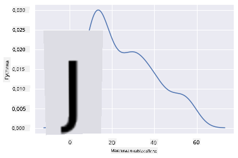

Ако желите глатку, али не превише глатку линију, измените параметар `bw_adjust`: 

```python
sns.kdeplot(filteredBirds['MaxBodyMass'], bw_adjust=.2)
plt.show()
```
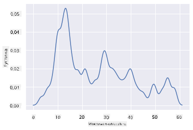

✅ Прочитајте о доступним параметрима за овај тип графикона и експериментишите!

Овај тип графикона нуди лепе визуализације које објашњавају податке. Са неколико линија кода, на пример, можете приказати густину максималне телесне масе по реду птица:

```python
sns.kdeplot(
   data=filteredBirds, x="MaxBodyMass", hue="Order",
   fill=True, common_norm=False, palette="crest",
   alpha=.5, linewidth=0,
)
```

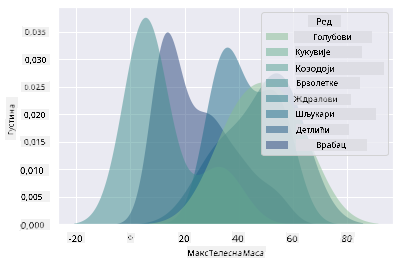

Такође можете мапирати густину неколико варијабли на једном графикону. Тестирајте максималну и минималну дужину птице у поређењу са њеним статусом заштите:

```python
sns.kdeplot(data=filteredBirds, x="MinLength", y="MaxLength", hue="ConservationStatus")
```

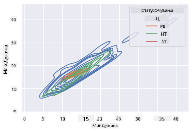

Можда је вредно истражити да ли је кластер 'ранљивих' птица према њиховим дужинама значајан или не.

## 🚀 Изазов

Хистограми су софистициранији тип графикона од основних расејаних графикона, стубичастих графикона или линијских графикона. Потражите на интернету добре примере употребе хистограма. Како се користе, шта показују и у којим областима или областима истраживања се обично користе?

## [Квиз после предавања](https://purple-hill-04aebfb03.1.azurestaticapps.net/quiz/19)

## Преглед и самостално учење

У овој лекцији, користили сте Matplotlib и почели да радите са Seaborn-ом да бисте приказали софистицираније графиконе. Истражите `kdeplot` у Seaborn-у, "континуирана крива густине вероватноће у једној или више димензија". Прочитајте [документацију](https://seaborn.pydata.org/generated/seaborn.kdeplot.html) да бисте разумели како функционише.

## Задатак

[Примените своје вештине](assignment.md)

---

**Одрицање од одговорности**:  
Овај документ је преведен коришћењем услуге за превођење помоћу вештачке интелигенције [Co-op Translator](https://github.com/Azure/co-op-translator). Иако се трудимо да обезбедимо тачност, имајте у виду да аутоматски преводи могу садржати грешке или нетачности. Оригинални документ на изворном језику треба сматрати ауторитативним извором. За критичне информације препоручује се професионални превод од стране људи. Не сносимо одговорност за било каква погрешна тумачења или неспоразуме који могу произаћи из коришћења овог превода.