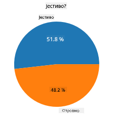
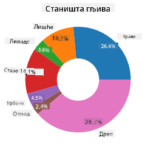
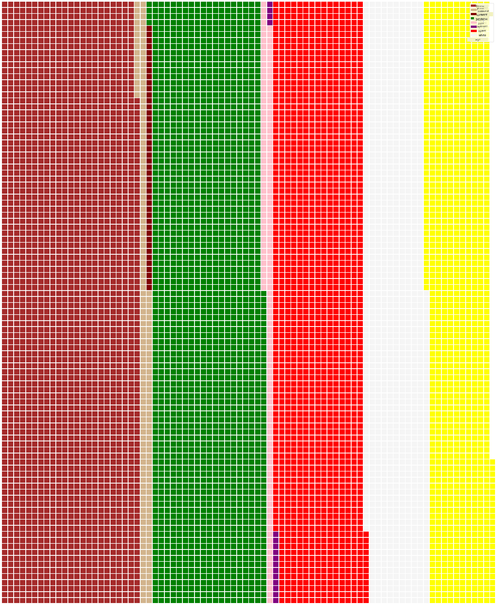

<!--
CO_OP_TRANSLATOR_METADATA:
{
  "original_hash": "af6a12015c6e250e500b570a9fa42593",
  "translation_date": "2025-08-30T18:57:22+00:00",
  "source_file": "3-Data-Visualization/11-visualization-proportions/README.md",
  "language_code": "sr"
}
-->
# Визуелизација пропорција

| ](../../sketchnotes/11-Visualizing-Proportions.png)|
|:---:|
|Визуелизација пропорција - _Скетч од [@nitya](https://twitter.com/nitya)_ |

У овој лекцији, користићете скуп података са природном тематиком како бисте визуелизовали пропорције, као што је број различитих врста гљива у датом скупу података о печуркама. Истражићемо ове фасцинантне гљиве користећи скуп података преузет од Audubon-а, који садржи детаље о 23 врсте ламеларних гљива из породица Agaricus и Lepiota. Испробаћете занимљиве визуализације као што су:

- Пита графикони 🥧
- Крофна графикони 🍩
- Вафл графикони 🧇

> 💡 Веома занимљив пројекат под називом [Charticulator](https://charticulator.com) од Microsoft Research-а нуди бесплатан интерфејс за визуелизацију података методом "превуци и пусти". У једном од њихових туторијала такође користе овај скуп података о печуркама! Тако можете истражити податке и истовремено научити како да користите библиотеку: [Charticulator туторијал](https://charticulator.com/tutorials/tutorial4.html).

## [Квиз пре лекције](https://purple-hill-04aebfb03.1.azurestaticapps.net/quiz/20)

## Упознајте своје печурке 🍄

Печурке су веома занимљиве. Увезимо скуп података како бисмо их проучили:

```python
import pandas as pd
import matplotlib.pyplot as plt
mushrooms = pd.read_csv('../../data/mushrooms.csv')
mushrooms.head()
```
Табела се исписује са одличним подацима за анализу:


| класа      | облик-шешира | површина-шешира | боја-шешира | модрице | мирис    | причвршћивање-ламела | размак-ламела | величина-ламела | боја-ламела | облик-стабљике | корен-стабљике | површина-изнад-прстена | површина-испод-прстена | боја-изнад-прстена | боја-испод-прстена | тип-веоа | боја-веоа | број-прстенова | тип-прстена | боја-спора | популација | станиште |
| --------- | ------------ | --------------- | ----------- | ------- | -------- | -------------------- | ------------- | --------------- | ----------- | -------------- | --------------- | --------------------- | --------------------- | ----------------- | ----------------- | -------- | --------- | ------------- | ----------- | ---------- | ---------- | -------- |
| Отровна   | Конвексна    | Глатка          | Браон       | Модрице | Јак мирис | Слободно            | Густо         | Уско            | Црна        | Широка         | Једнака         | Глатка               | Глатка               | Бела              | Бела              | Делимичан | Бела      | Један         | Висећи      | Црна       | Расута     | Урбана   |
| Јестива   | Конвексна    | Глатка          | Жута        | Модрице | Бадем     | Слободно            | Густо         | Широко          | Црна        | Широка         | Клупка          | Глатка               | Глатка               | Бела              | Бела              | Делимичан | Бела      | Један         | Висећи      | Браон      | Бројна     | Травњаци |
| Јестива   | Звонаста     | Глатка          | Бела        | Модрице | Анис      | Слободно            | Густо         | Широко          | Браон       | Широка         | Клупка          | Глатка               | Глатка               | Бела              | Бела              | Делимичан | Бела      | Један         | Висећи      | Браон      | Бројна     | Ливаде   |
| Отровна   | Конвексна    | Љускава         | Бела        | Модрице | Јак мирис | Слободно            | Густо         | Уско            | Браон       | Широка         | Једнака         | Глатка               | Глатка               | Бела              | Бела              | Делимичан | Бела      | Један         | Висећи      | Црна       | Расута     | Урбана   |

Одмах примећујете да су сви подаци текстуални. Мораћете да конвертујете ове податке како бисте их могли користити у графикону. Већина података је, у ствари, представљена као објекат:

```python
print(mushrooms.select_dtypes(["object"]).columns)
```

Резултат је:

```output
Index(['class', 'cap-shape', 'cap-surface', 'cap-color', 'bruises', 'odor',
       'gill-attachment', 'gill-spacing', 'gill-size', 'gill-color',
       'stalk-shape', 'stalk-root', 'stalk-surface-above-ring',
       'stalk-surface-below-ring', 'stalk-color-above-ring',
       'stalk-color-below-ring', 'veil-type', 'veil-color', 'ring-number',
       'ring-type', 'spore-print-color', 'population', 'habitat'],
      dtype='object')
```
Претворите податке из колоне 'класа' у категорије:

```python
cols = mushrooms.select_dtypes(["object"]).columns
mushrooms[cols] = mushrooms[cols].astype('category')
```

```python
edibleclass=mushrooms.groupby(['class']).count()
edibleclass
```

Сада, ако испишете податке о печуркама, видећете да су груписани у категорије према класи (отровна/јестива):


|           | облик-шешира | површина-шешира | боја-шешира | модрице | мирис | причвршћивање-ламела | размак-ламела | величина-ламела | боја-ламела | облик-стабљике | ... | површина-испод-прстена | боја-изнад-прстена | боја-испод-прстена | тип-веоа | боја-веоа | број-прстенова | тип-прстена | боја-спора | популација | станиште |
| --------- | ------------ | --------------- | ----------- | ------- | ----- | -------------------- | ------------- | --------------- | ----------- | -------------- | --- | --------------------- | ----------------- | ----------------- | -------- | --------- | ------------- | ----------- | ---------- | ---------- | -------- |
| класа     |              |                 |             |         |       |                      |               |                 |             |                |     |                       |                   |                   |          |           |               |             |            |            |          |
| Јестива   | 4208         | 4208            | 4208        | 4208    | 4208  | 4208                | 4208          | 4208            | 4208        | 4208           | ... | 4208                 | 4208              | 4208              | 4208     | 4208      | 4208          | 4208        | 4208       | 4208       | 4208     |
| Отровна   | 3916         | 3916            | 3916        | 3916    | 3916  | 3916                | 3916          | 3916            | 3916        | 3916           | ... | 3916                 | 3916              | 3916              | 3916     | 3916      | 3916          | 3916        | 3916       | 3916       | 3916     |

Ако пратите редослед приказан у овој табели за креирање етикета категорија класе, можете направити пита графикон:

## Пита!

```python
labels=['Edible','Poisonous']
plt.pie(edibleclass['population'],labels=labels,autopct='%.1f %%')
plt.title('Edible?')
plt.show()
```
Ево га, пита графикон који приказује пропорције ових података према две класе печурака. Веома је важно правилно одредити редослед етикета, посебно овде, па обавезно проверите редослед приликом креирања низа етикета!



## Крофне!

Мало визуелно занимљивији пита графикон је крофна графикон, који је пита графикон са рупом у средини. Погледајмо наше податке користећи овај метод.

Погледајте различита станишта у којима печурке расту:

```python
habitat=mushrooms.groupby(['habitat']).count()
habitat
```
Овде групишете податке према станишту. Постоји 7 наведених станишта, па их користите као етикете за ваш крофна графикон:

```python
labels=['Grasses','Leaves','Meadows','Paths','Urban','Waste','Wood']

plt.pie(habitat['class'], labels=labels,
        autopct='%1.1f%%', pctdistance=0.85)
  
center_circle = plt.Circle((0, 0), 0.40, fc='white')
fig = plt.gcf()

fig.gca().add_artist(center_circle)
  
plt.title('Mushroom Habitats')
  
plt.show()
```



Овај код црта графикон и централни круг, а затим додаје тај централни круг у графикон. Промените ширину централног круга мењањем `0.40` у неку другу вредност.

Крофна графикони могу се прилагодити на више начина како би се промениле етикете. Етикете се посебно могу истакнути ради боље читљивости. Сазнајте више у [документацији](https://matplotlib.org/stable/gallery/pie_and_polar_charts/pie_and_donut_labels.html?highlight=donut).

Сада када знате како да групишете податке и прикажете их као пита или крофна графикон, можете истражити друге типове графикона. Испробајте вафл графикон, који је само другачији начин истраживања количина.
## Вафли!

'Вафл' тип графикона је другачији начин визуелизације количина као 2Д низ квадрата. Испробајте визуелизацију различитих количина боја шешира печурака у овом скупу података. Да бисте то урадили, потребно је да инсталирате помоћну библиотеку под називом [PyWaffle](https://pypi.org/project/pywaffle/) и користите Matplotlib:

```python
pip install pywaffle
```

Изаберите сегмент ваших података за груписање:

```python
capcolor=mushrooms.groupby(['cap-color']).count()
capcolor
```

Направите вафл графикон креирањем етикета, а затим груписањем ваших података:

```python
import pandas as pd
import matplotlib.pyplot as plt
from pywaffle import Waffle
  
data ={'color': ['brown', 'buff', 'cinnamon', 'green', 'pink', 'purple', 'red', 'white', 'yellow'],
    'amount': capcolor['class']
     }
  
df = pd.DataFrame(data)
  
fig = plt.figure(
    FigureClass = Waffle,
    rows = 100,
    values = df.amount,
    labels = list(df.color),
    figsize = (30,30),
    colors=["brown", "tan", "maroon", "green", "pink", "purple", "red", "whitesmoke", "yellow"],
)
```

Користећи вафл графикон, јасно можете видети пропорције боја шешира у овом скупу података о печуркама. Интересантно је да постоји много печурака са зеленим шеширима!



✅ Pywaffle подржава иконе унутар графикона које користе било коју икону доступну у [Font Awesome](https://fontawesome.com/). Експериментишите како бисте направили још занимљивији вафл графикон користећи иконе уместо квадрата.

У овој лекцији, научили сте три начина за визуелизацију пропорција. Прво, потребно је да групишете податке у категорије, а затим одлучите који је најбољи начин за приказивање података - пита, крофна или вафл. Сви су "укусни" и пружају кориснику тренутан увид у скуп података.

## 🚀 Изазов

Покушајте да поново направите ове "укусне" графиконе у [Charticulator](https://charticulator.com).
## [Квиз након лекције](https://purple-hill-04aebfb03.1.azurestaticapps.net/quiz/21)

## Преглед и самостално учење

Понекад није очигледно када користити пита, крофна или вафл графикон. Ево неколико чланака које можете прочитати на ову тему:

https://www.beautiful.ai/blog/battle-of-the-charts-pie-chart-vs-donut-chart

https://medium.com/@hypsypops/pie-chart-vs-donut-chart-showdown-in-the-ring-5d24fd86a9ce

https://www.mit.edu/~mbarker/formula1/f1help/11-ch-c6.htm

https://medium.datadriveninvestor.com/data-visualization-done-the-right-way-with-tableau-waffle-chart-fdf2a19be402

Истражите више како бисте пронашли додатне информације о овој "лепљивој" одлуци.
## Задатак

[Испробајте у Excel-у](assignment.md)

---

**Одрицање од одговорности**:  
Овај документ је преведен коришћењем услуге за превођење помоћу вештачке интелигенције [Co-op Translator](https://github.com/Azure/co-op-translator). Иако се трудимо да обезбедимо тачност, молимо вас да имате у виду да аутоматски преводи могу садржати грешке или нетачности. Оригинални документ на његовом изворном језику треба сматрати ауторитативним извором. За критичне информације препоручује се професионални превод од стране људи. Не сносимо одговорност за било каква погрешна тумачења или неспоразуме који могу произаћи из коришћења овог превода.