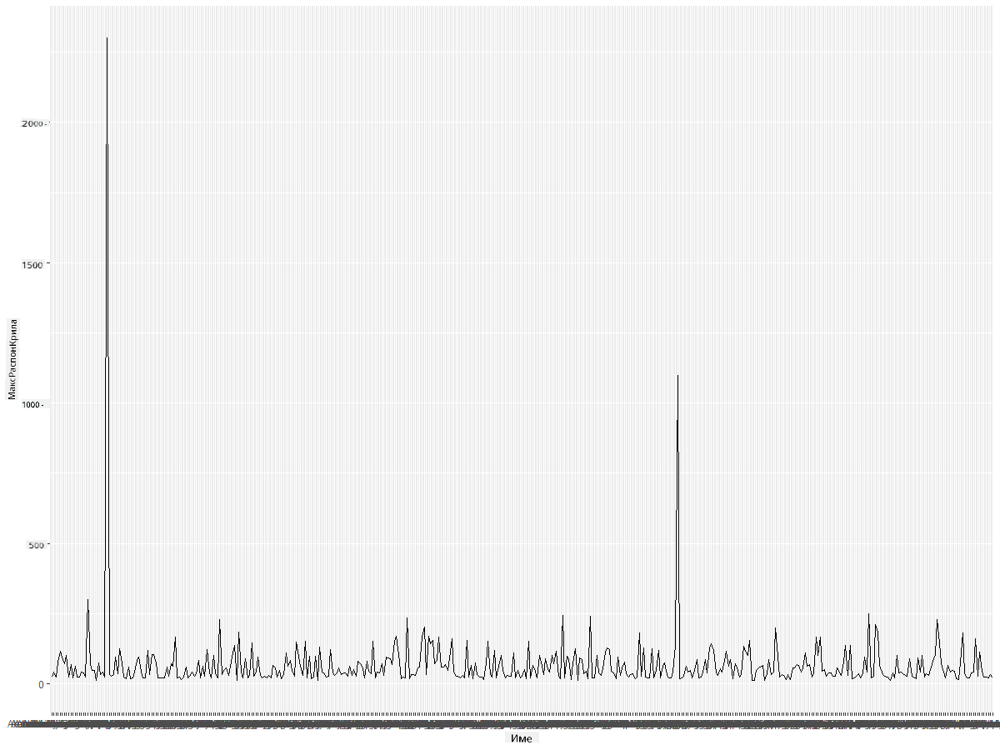
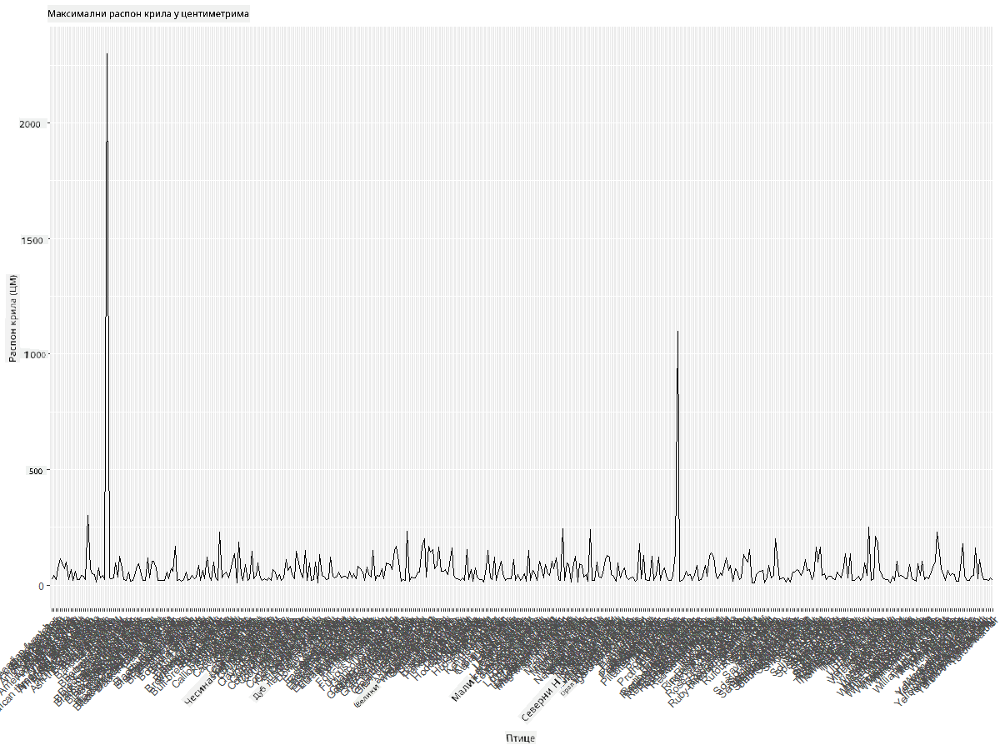
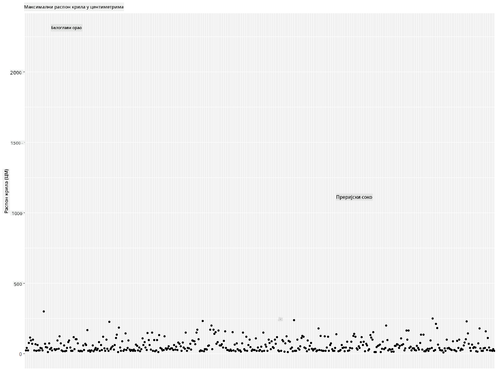
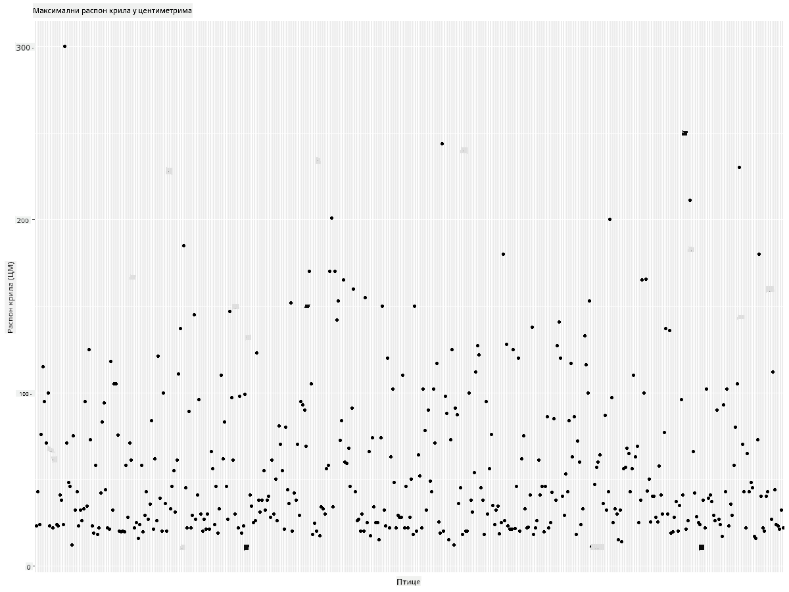
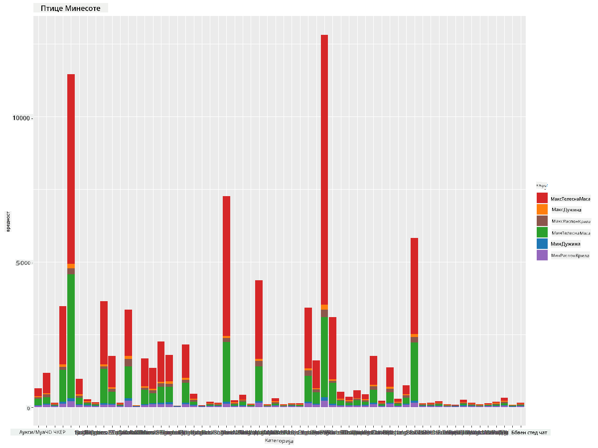
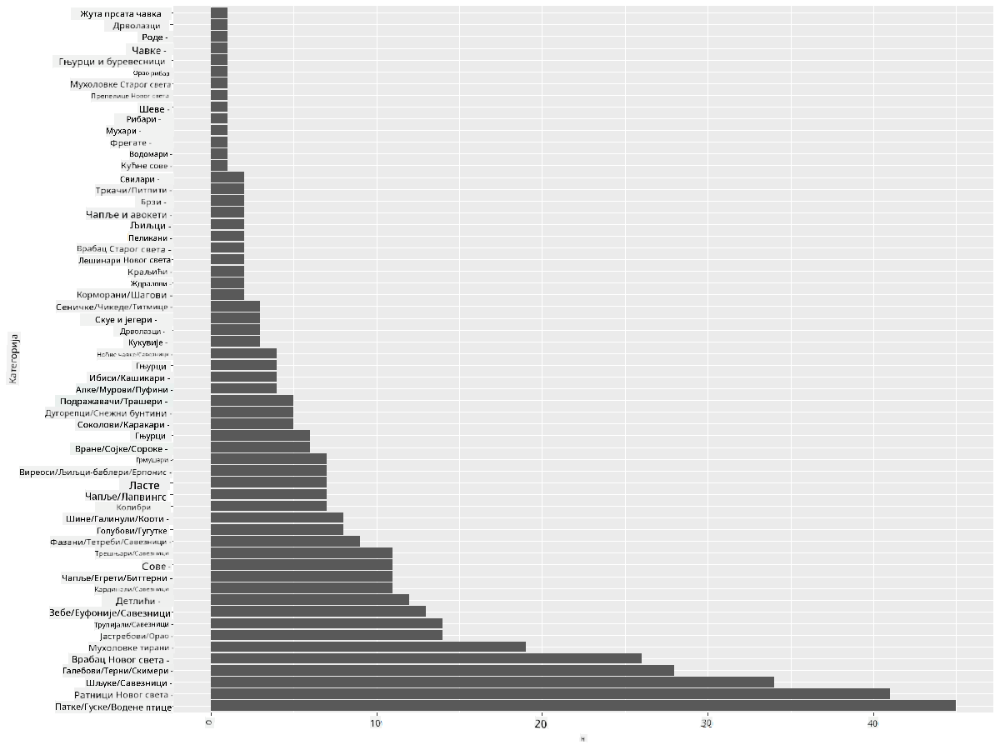
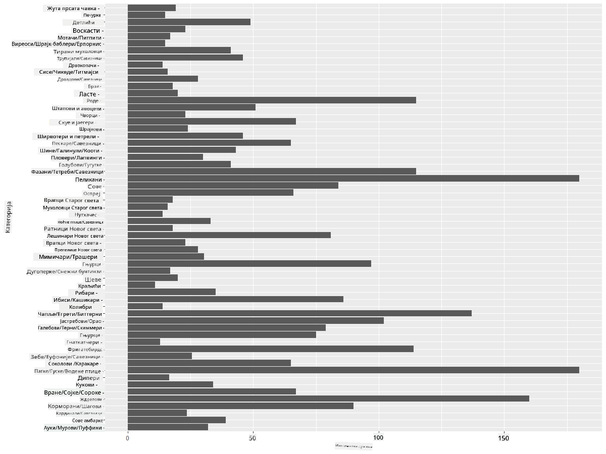
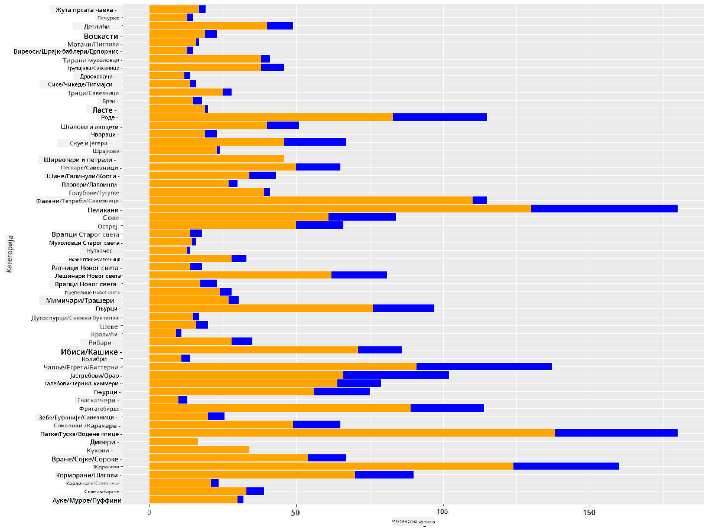

<!--
CO_OP_TRANSLATOR_METADATA:
{
  "original_hash": "22acf28f518a4769ea14fa42f4734b9f",
  "translation_date": "2025-08-30T18:42:30+00:00",
  "source_file": "3-Data-Visualization/R/09-visualization-quantities/README.md",
  "language_code": "sr"
}
-->
# Визуелизација количина
| ](https://github.com/microsoft/Data-Science-For-Beginners/blob/main/sketchnotes/09-Visualizing-Quantities.png)|
|:---:|
| Визуелизација количина - _Скетч од [@nitya](https://twitter.com/nitya)_ |

У овој лекцији ћете истражити како да користите неке од многих доступних библиотека R пакета како бисте научили да креирате занимљиве визуелизације засноване на концепту количине. Користећи очишћену базу података о птицама из Минесоте, можете научити многе занимљиве чињенице о локалној дивљини.  
## [Квиз пре предавања](https://purple-hill-04aebfb03.1.azurestaticapps.net/quiz/16)

## Посматрање распона крила са ggplot2
Одлична библиотека за креирање и једноставних и сложених графикона и дијаграма различитих врста је [ggplot2](https://cran.r-project.org/web/packages/ggplot2/index.html). Уопштено, процес креирања графикона користећи ове библиотеке укључује идентификовање делова вашег датафрејма које желите да циљате, извршавање потребних трансформација на тим подацима, додељивање вредности за x и y осе, одлучивање о врсти графикона који желите да прикажете, и затим приказивање графикона.

`ggplot2` је систем за декларативно креирање графике, заснован на Граматици графике. [Граматика графике](https://en.wikipedia.org/wiki/Ggplot2) је општа шема за визуелизацију података која дели графиконе на семантичке компоненте као што су скале и слојеви. Другим речима, лакоћа креирања графикона за униваријантне или мултиваријантне податке уз мало кода чини `ggplot2` најпопуларнијим пакетом за визуелизацију у R-у. Корисник каже `ggplot2` како да мапира променљиве на естетику, графичке примитиве које треба користити, а `ggplot2` се брине о осталом.

> ✅ Графикон = Подаци + Естетика + Геометрија  
> - Подаци се односе на базу података  
> - Естетика указује на променљиве које се проучавају (x и y променљиве)  
> - Геометрија се односи на врсту графикона (линијски графикон, стубни графикон, итд.)  

Изаберите најбољу геометрију (врсту графикона) у складу са вашим подацима и причом коју желите да испричате кроз графикон.  

> - За анализу трендова: линијски, стубни  
> - За поређење вредности: стубни, бар, пите, расејани графикон  
> - За приказ односа делова према целини: пите  
> - За приказ дистрибуције података: расејани графикон, бар  
> - За приказ односа између вредности: линијски, расејани графикон, мехурићи  

✅ Можете такође погледати овај описни [чит-шит](https://nyu-cdsc.github.io/learningr/assets/data-visualization-2.1.pdf) за ggplot2.

## Креирање линијског графикона о вредностима распона крила птица

Отворите R конзолу и увезите базу података.  
> Напомена: База података се налази у корену овог репозиторијума у `/data` фасцикли.

Увезимо базу података и посматрајмо првих 5 редова података.

```r
birds <- read.csv("../../data/birds.csv",fileEncoding="UTF-8-BOM")
head(birds)
```  
Првих неколико редова података садржи мешавину текста и бројева:

|      | Име                          | Научно име             | Категорија            | Ред          | Породица | Род         | Статус очувања      | МинДужина | МаксДужина | МинТежина   | МаксТежина   | МинРаспонКрила | МаксРаспонКрила |
| ---: | :--------------------------- | :--------------------- | :-------------------- | :----------- | :------- | :---------- | :----------------- | --------: | --------: | ----------: | ----------: | ----------: | ----------: |
|    0 | Црнотрбушаста патка          | Dendrocygna autumnalis | Патке/Гуске/Водене птице | Anseriformes | Anatidae | Dendrocygna | LC                 |        47 |        56 |         652 |        1020 |          76 |          94 |
|    1 | Жућкаста патка               | Dendrocygna bicolor    | Патке/Гуске/Водене птице | Anseriformes | Anatidae | Dendrocygna | LC                 |        45 |        53 |         712 |        1050 |          85 |          93 |
|    2 | Снежна гуска                 | Anser caerulescens     | Патке/Гуске/Водене птице | Anseriformes | Anatidae | Anser       | LC                 |        64 |        79 |        2050 |        4050 |         135 |         165 |
|    3 | Росова гуска                 | Anser rossii           | Патке/Гуске/Водене птице | Anseriformes | Anatidae | Anser       | LC                 |      57.3 |        64 |        1066 |        1567 |         113 |         116 |
|    4 | Велика бела гуска            | Anser albifrons        | Патке/Гуске/Водене птице | Anseriformes | Anatidae | Anser       | LC                 |        64 |        81 |        1930 |        3310 |         130 |         165 |

Почнимо са графиконом неких нумеричких података користећи основни линијски графикон. Претпоставимо да желите приказ максималног распона крила ових занимљивих птица.

```r
install.packages("ggplot2")
library("ggplot2")
ggplot(data=birds, aes(x=Name, y=MaxWingspan,group=1)) +
  geom_line() 
```  
Овде инсталирате `ggplot2` пакет и затим га увозите у радни простор користећи команду `library("ggplot2")`. За креирање било ког графикона у ggplot-у користи се функција `ggplot()` и ви одређујете базу података, x и y променљиве као атрибуте. У овом случају, користимо функцију `geom_line()` јер желимо да креирамо линијски графикон.



Шта одмах примећујете? Чини се да постоји бар један изузетак - то је прилично велики распон крила! Распон крила од преко 2000 центиметара је више од 20 метара - да ли Птеродактили лете изнад Минесоте? Хајде да истражимо.

Иако бисте могли брзо сортирати податке у Excel-у да бисте пронашли те изузетке, који су вероватно грешке у куцању, наставите процес визуелизације радећи изнутра графикона.

Додајте ознаке на x-осу да бисте приказали о којим птицама је реч:

```r
ggplot(data=birds, aes(x=Name, y=MaxWingspan,group=1)) +
  geom_line() +
  theme(axis.text.x = element_text(angle = 45, hjust=1))+
  xlab("Birds") +
  ylab("Wingspan (CM)") +
  ggtitle("Max Wingspan in Centimeters")
```  
Одређујемо угао у `theme` и одређујемо ознаке за x и y осе у `xlab()` и `ylab()` респективно. `ggtitle()` даје назив графикону.



Чак и са ротацијом ознака постављеном на 45 степени, има их превише за читање. Хајде да пробамо другачију стратегију: означимо само те изузетке и поставимо ознаке унутар графикона. Можете користити расејани графикон да бисте направили више простора за означавање:

```r
ggplot(data=birds, aes(x=Name, y=MaxWingspan,group=1)) +
  geom_point() +
  geom_text(aes(label=ifelse(MaxWingspan>500,as.character(Name),'')),hjust=0,vjust=0) + 
  theme(axis.title.x=element_blank(), axis.text.x=element_blank(), axis.ticks.x=element_blank())
  ylab("Wingspan (CM)") +
  ggtitle("Max Wingspan in Centimeters") + 
```  
Шта се овде дешава? Користили сте функцију `geom_point()` за креирање расејаних тачака. Уз то, додали сте ознаке за птице које имају `MaxWingspan > 500` и такође сакрили ознаке на x оси да бисте смањили неред на графикону.

Шта откривате?



## Филтрирање података

И Белоглави орао и Преријски соко, иако вероватно веома велике птице, изгледа да су погрешно означени, са додатном нулом у максималном распону крила. Мало је вероватно да ћете срести Белоглавог орла са распоном крила од 25 метара, али ако се то догоди, молимо вас да нас обавестите! Хајде да креирамо нови датафрејм без та два изузетка:

```r
birds_filtered <- subset(birds, MaxWingspan < 500)

ggplot(data=birds_filtered, aes(x=Name, y=MaxWingspan,group=1)) +
  geom_point() +
  ylab("Wingspan (CM)") +
  xlab("Birds") +
  ggtitle("Max Wingspan in Centimeters") + 
  geom_text(aes(label=ifelse(MaxWingspan>500,as.character(Name),'')),hjust=0,vjust=0) +
  theme(axis.text.x=element_blank(), axis.ticks.x=element_blank())
```  
Креирали смо нови датафрејм `birds_filtered` и затим креирали расејани графикон. Филтрирањем изузетака, ваши подаци су сада кохезивнији и разумљивији.



Сада када имамо чистију базу података барем у смислу распона крила, хајде да откријемо више о овим птицама.

Док линијски и расејани графикони могу приказати информације о вредностима података и њиховим дистрибуцијама, желимо да размотримо вредности које су инхерентне у овој бази података. Могли бисте креирати визуелизације да одговорите на следећа питања о количини:

> Колико категорија птица постоји и који су њихови бројеви?  
> Колико птица је изумрло, угрожено, ретко или уобичајено?  
> Колико их има у различитим родовима и редовима у Линеовој терминологији?  
## Истраживање стубних графикона

Стубни графикони су практични када треба да прикажете груписање података. Хајде да истражимо категорије птица које постоје у овој бази података да видимо која је најчешћа по броју.  
Хајде да креирамо стубни графикон на филтрираним подацима.

```r
install.packages("dplyr")
install.packages("tidyverse")

library(lubridate)
library(scales)
library(dplyr)
library(ggplot2)
library(tidyverse)

birds_filtered %>% group_by(Category) %>%
  summarise(n=n(),
  MinLength = mean(MinLength),
  MaxLength = mean(MaxLength),
  MinBodyMass = mean(MinBodyMass),
  MaxBodyMass = mean(MaxBodyMass),
  MinWingspan=mean(MinWingspan),
  MaxWingspan=mean(MaxWingspan)) %>% 
  gather("key", "value", - c(Category, n)) %>%
  ggplot(aes(x = Category, y = value, group = key, fill = key)) +
  geom_bar(stat = "identity") +
  scale_fill_manual(values = c("#D62728", "#FF7F0E", "#8C564B","#2CA02C", "#1F77B4", "#9467BD")) +                   
  xlab("Category")+ggtitle("Birds of Minnesota")

```  
У следећем исечку, инсталирамо [dplyr](https://www.rdocumentation.org/packages/dplyr/versions/0.7.8) и [lubridate](https://www.rdocumentation.org/packages/lubridate/versions/1.8.0) пакете како бисмо помогли у манипулацији и груписању података ради креирања сложеног стубног графикона. Прво групишете податке по `Category` птица и затим сумирате колоне `MinLength`, `MaxLength`, `MinBodyMass`, `MaxBodyMass`, `MinWingspan`, `MaxWingspan`. Затим креирате стубни графикон користећи `ggplot2` пакет и одређујете боје за различите категорије и ознаке.



Овај стубни графикон, међутим, није читљив јер има превише неконсолидованих података. Потребно је да изаберете само податке које желите да прикажете, па хајде да погледамо дужину птица на основу њихове категорије.

Филтрирајте своје податке да укључите само категорију птица.

Пошто има много категорија, можете приказати овај графикон вертикално и прилагодити његову висину да обухвати све податке:

```r
birds_count<-dplyr::count(birds_filtered, Category, sort = TRUE)
birds_count$Category <- factor(birds_count$Category, levels = birds_count$Category)
ggplot(birds_count,aes(Category,n))+geom_bar(stat="identity")+coord_flip()
```  
Прво бројите јединствене вредности у колони `Category` и затим их сортирате у нови датафрејм `birds_count`. Ови сортирани подаци се затим факторизују на истом нивоу како би били приказани у сортираном редоследу. Користећи `ggplot2` затим креирате графикон у облику стубног графикона. `coord_flip()` приказује хоризонталне стубове.



Овај стубни графикон пружа добар приказ броја птица у свакој категорији. На први поглед видите да је највећи број птица у овом региону у категорији Патке/Гуске/Водене птице. Минесота је 'земља 10,000 језера', па то није изненађујуће!

✅ Пробајте нека друга бројања на овој бази података. Да ли вас нешто изненађује?

## Поређење података

Можете пробати различита поређења груписаних података креирањем нових оса. Пробајте поређење максималне дужине птице, на основу њене категорије:

```r
birds_grouped <- birds_filtered %>%
  group_by(Category) %>%
  summarise(
  MaxLength = max(MaxLength, na.rm = T),
  MinLength = max(MinLength, na.rm = T)
           ) %>%
  arrange(Category)
  
ggplot(birds_grouped,aes(Category,MaxLength))+geom_bar(stat="identity")+coord_flip()
```  
Групишемо `birds_filtered` податке по `Category` и затим креирамо стубни графикон.



Ништа није изненађујуће овде: колибри имају најмању максималну дужину у поређењу са пеликанима или гускама. Добро је када подаци имају логичан смисао!

Можете креирати занимљивије визуелизације стубних графикона суперимпонујући податке. Хајде да суперимпонујемо минималну и максималну дужину на одређену категорију птица:

```r
ggplot(data=birds_grouped, aes(x=Category)) +
  geom_bar(aes(y=MaxLength), stat="identity", position ="identity",  fill='blue') +
  geom_bar(aes(y=MinLength), stat="identity", position="identity", fill='orange')+
  coord_flip()
```  


## 🚀 Изазов

Ова база података о птицама нуди богатство информација о различитим врстама птица унутар одређеног екосистема. Претражите интернет и видите да ли можете пронаћи друге базе података о птицама. Вежбајте креирање графикона и дијаграма о овим птицама како бисте открили чињенице које нисте знали.

## [Квиз после предавања](https://purple-hill-04aebfb03.1.azurestaticapps.net/quiz/17)

## Преглед и самостално учење

Ова прва лекција вам је дала неке информације о томе како да користите `ggplot2` за визуелизацију количина. Истражите друге начине рада са базама података за визуелизацију. Истражите и потражите базе података које бисте могли визуелизовати користећи друге пакете као што су [Lattice](https://stat.ethz.ch/R-manual/R-devel/library/lattice/html/Lattice.html) и [Plotly](https://github.com/plotly/plotly.R#readme).

## Задатак  
[Линије, Расејани графикони и Стубови](assignment.md)

---

**Одрицање од одговорности**:  
Овај документ је преведен коришћењем услуге за превођење помоћу вештачке интелигенције [Co-op Translator](https://github.com/Azure/co-op-translator). Иако се трудимо да обезбедимо тачност, молимо вас да имате у виду да аутоматски преводи могу садржати грешке или нетачности. Оригинални документ на његовом изворном језику треба сматрати ауторитативним извором. За критичне информације препоручује се професионални превод од стране људи. Не преузимамо одговорност за било каква погрешна тумачења или неспоразуме који могу настати услед коришћења овог превода.