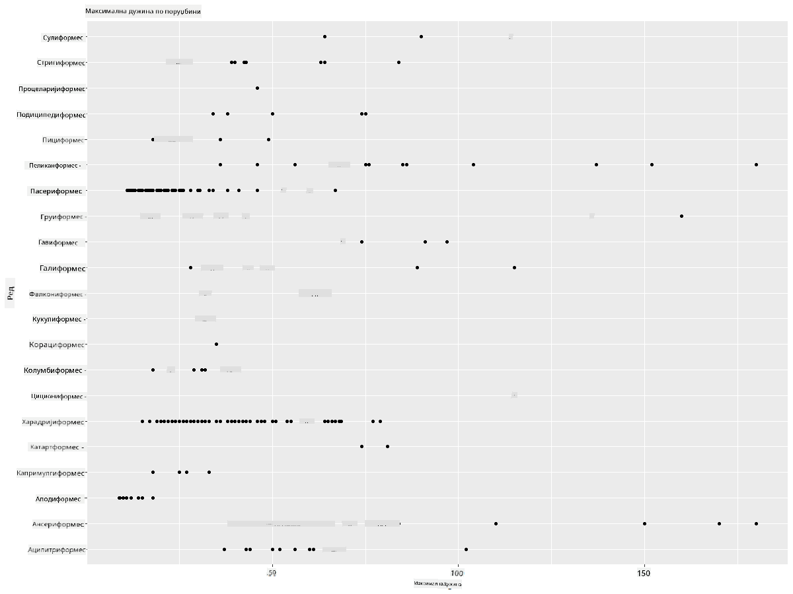
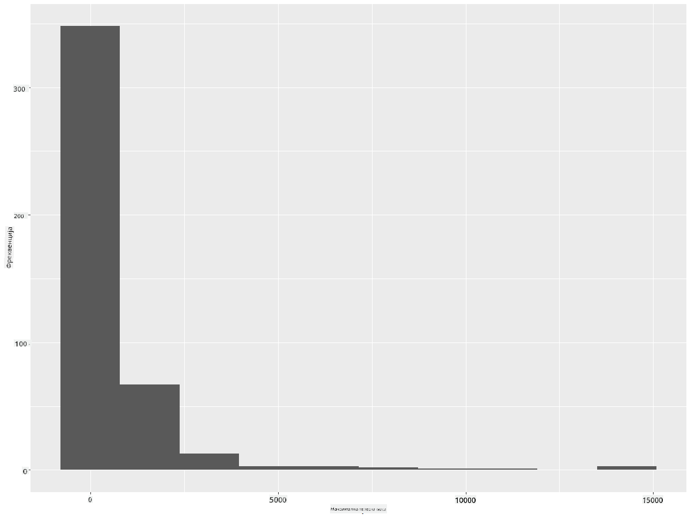
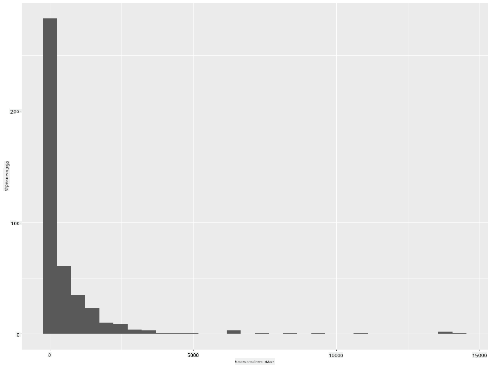
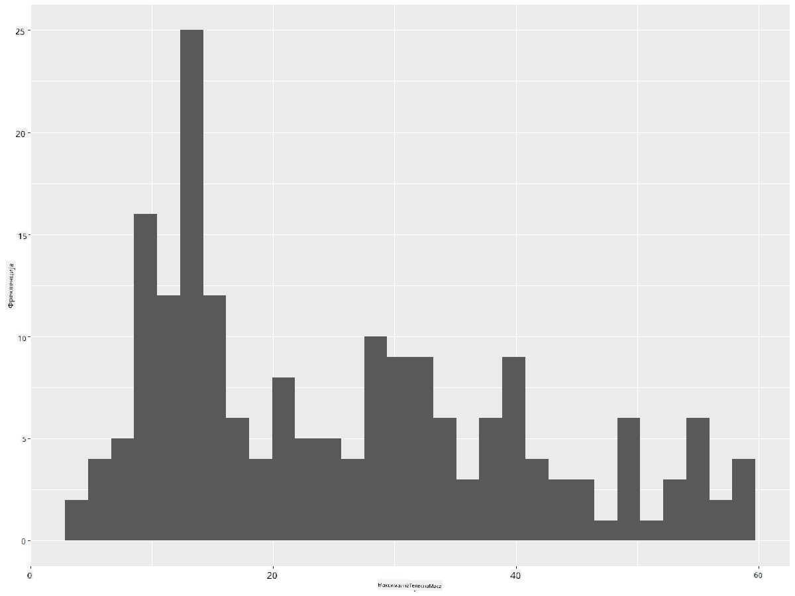
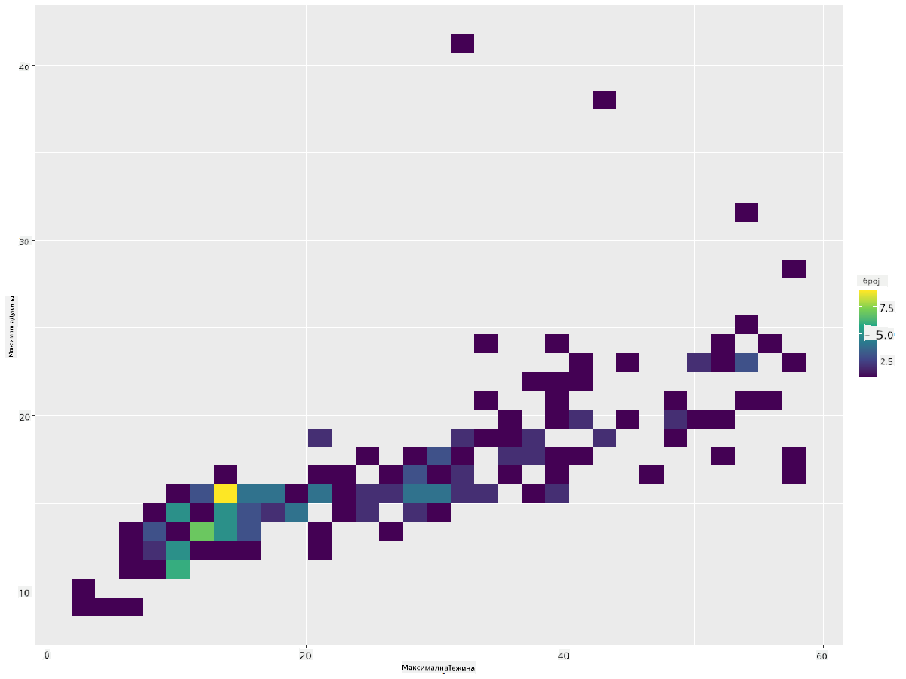
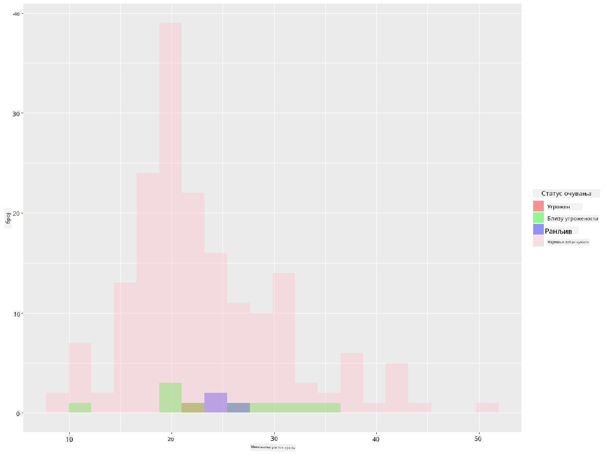
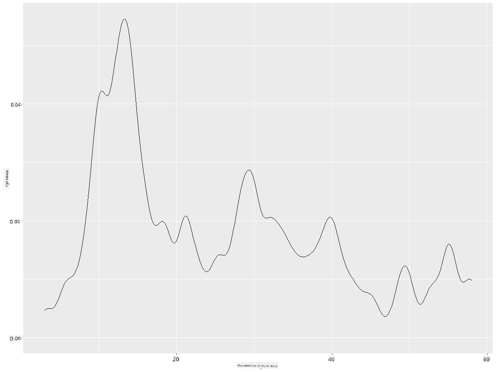
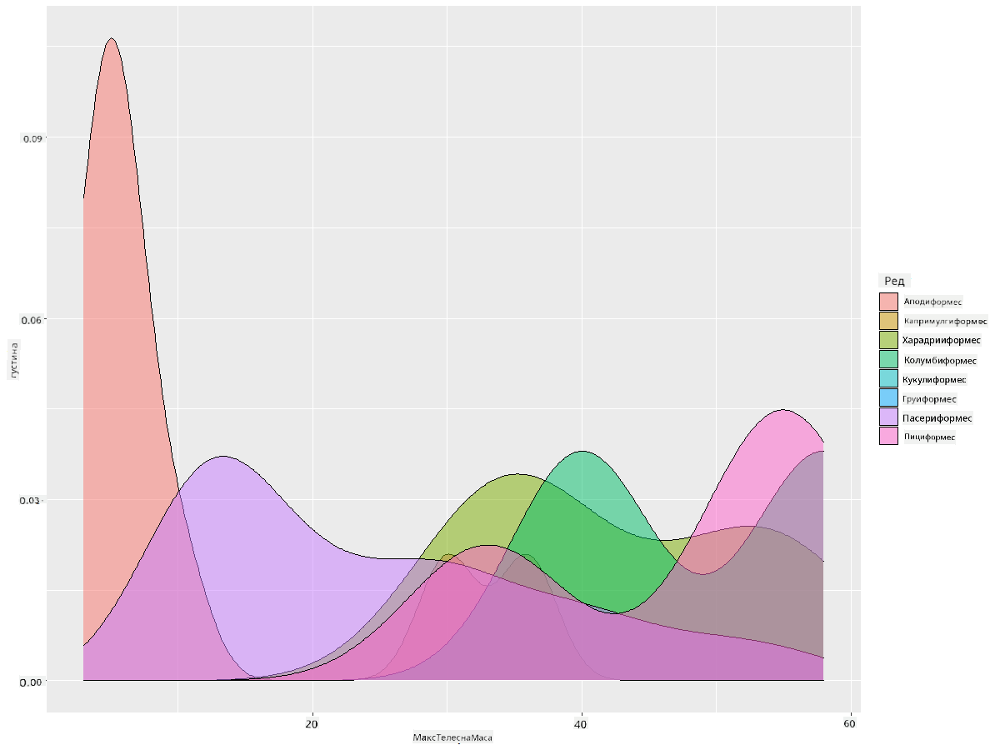

<!--
CO_OP_TRANSLATOR_METADATA:
{
  "original_hash": "ea67c0c40808fd723594de6896c37ccf",
  "translation_date": "2025-08-30T18:50:13+00:00",
  "source_file": "3-Data-Visualization/R/10-visualization-distributions/README.md",
  "language_code": "sr"
}
-->
# Визуализација дистрибуција

| ](https://github.com/microsoft/Data-Science-For-Beginners/blob/main/sketchnotes/10-Visualizing-Distributions.png)|
|:---:|
| Визуализација дистрибуција - _Скетч од [@nitya](https://twitter.com/nitya)_ |

У претходној лекцији, научили сте неке занимљиве чињенице о скупу података о птицама из Минесоте. Пронашли сте погрешне податке визуализујући екстремне вредности и погледали разлике између категорија птица на основу њихове максималне дужине.

## [Квиз пре предавања](https://purple-hill-04aebfb03.1.azurestaticapps.net/quiz/18)
## Истражите скуп података о птицама

Још један начин да се дубље истражи скуп података је гледањем његове дистрибуције, односно како су подаци организовани дуж осе. Можда, на пример, желите да сазнате о општој дистрибуцији максималног распона крила или максималне телесне масе птица из Минесоте у овом скупу података.

Хајде да откријемо неке чињенице о дистрибуцијама података у овом скупу. У вашем R конзоли, увезите `ggplot2` и базу података. Уклоните екстремне вредности из базе података као што сте то урадили у претходној теми.

```r
library(ggplot2)

birds <- read.csv("../../data/birds.csv",fileEncoding="UTF-8-BOM")

birds_filtered <- subset(birds, MaxWingspan < 500)
head(birds_filtered)
```
|      | Име                          | Научно име             | Категорија            | Ред          | Породица | Род         | Статус очувања      | МинДужина | МаксДужина | МинТелеснаМаса | МаксТелеснаМаса | МинРаспонКрила | МаксРаспонКрила |
| ---: | :--------------------------- | :--------------------- | :-------------------- | :----------- | :------- | :---------- | :----------------- | --------: | --------: | ----------: | ----------: | ----------: | ----------: |
|    0 | Црнобрки патак               | Dendrocygna autumnalis | Патке/Гуске/Водене птице | Anseriformes | Anatidae | Dendrocygna | LC                 |        47 |        56 |         652 |        1020 |          76 |          94 |
|    1 | Жућкасти патак               | Dendrocygna bicolor    | Патке/Гуске/Водене птице | Anseriformes | Anatidae | Dendrocygna | LC                 |        45 |        53 |         712 |        1050 |          85 |          93 |
|    2 | Снежна гуска                 | Anser caerulescens     | Патке/Гуске/Водене птице | Anseriformes | Anatidae | Anser       | LC                 |        64 |        79 |        2050 |        4050 |         135 |         165 |
|    3 | Росова гуска                 | Anser rossii           | Патке/Гуске/Водене птице | Anseriformes | Anatidae | Anser       | LC                 |      57.3 |        64 |        1066 |        1567 |         113 |         116 |
|    4 | Велика бела гуска            | Anser albifrons        | Патке/Гуске/Водене птице | Anseriformes | Anatidae | Anser       | LC                 |        64 |        81 |        1930 |        3310 |         130 |         165 |

Уопштено, можете брзо погледати начин на који су подаци распоређени користећи расејани графикон као што смо то урадили у претходној лекцији:

```r
ggplot(data=birds_filtered, aes(x=Order, y=MaxLength,group=1)) +
  geom_point() +
  ggtitle("Max Length per order") + coord_flip()
```


Ово даје преглед опште дистрибуције дужине тела по реду птица, али није оптималан начин за приказивање правих дистрибуција. Тај задатак се обично обавља креирањем хистограма.
## Рад са хистограмима

`ggplot2` нуди веома добре начине за визуализацију дистрибуције података користећи хистограме. Овај тип графикона је сличан стубичастом графикону где се дистрибуција може видети кроз раст и пад стубова. Да бисте направили хистограм, потребни су вам нумерички подаци. Да бисте направили хистограм, можете нацртати графикон дефинишући тип као 'hist' за хистограм. Овај графикон приказује дистрибуцију MaxBodyMass за цео опсег нумеричких података скупа. Дељењем низа података на мање сегменте, може приказати дистрибуцију вредности података:

```r
ggplot(data = birds_filtered, aes(x = MaxBodyMass)) + 
  geom_histogram(bins=10)+ylab('Frequency')
```


Као што видите, већина од 400+ птица у овом скупу података спада у опсег испод 2000 за њихову максималну телесну масу. Стеците више увида у податке променом параметра `bins` на већи број, нешто попут 30:

```r
ggplot(data = birds_filtered, aes(x = MaxBodyMass)) + geom_histogram(bins=30)+ylab('Frequency')
```



Овај графикон приказује дистрибуцију на мало детаљнији начин. Мање искривљен графикон могао би се направити тако што бисте осигурали да одаберете само податке унутар датог опсега:

Филтрирајте своје податке да добијете само оне птице чија је телесна маса испод 60, и прикажите 30 `bins`:

```r
birds_filtered_1 <- subset(birds_filtered, MaxBodyMass > 1 & MaxBodyMass < 60)
ggplot(data = birds_filtered_1, aes(x = MaxBodyMass)) + 
  geom_histogram(bins=30)+ylab('Frequency')
```



✅ Испробајте неке друге филтере и тачке података. Да бисте видели пуну дистрибуцију података, уклоните филтер `['MaxBodyMass']` да бисте приказали означене дистрибуције.

Хистограм нуди лепе боје и побољшања означавања које можете испробати:

Направите 2D хистограм да упоредите однос између две дистрибуције. Упоредимо `MaxBodyMass` и `MaxLength`. `ggplot2` нуди уграђен начин да покаже конвергенцију користећи светлије боје:

```r
ggplot(data=birds_filtered_1, aes(x=MaxBodyMass, y=MaxLength) ) +
  geom_bin2d() +scale_fill_continuous(type = "viridis")
```
Чини се да постоји очекивана корелација између ова два елемента дуж очекиване осе, са једном посебно снажном тачком конвергенције:



Хистограми добро функционишу по подразумеваним подешавањима за нумеричке податке. Шта ако треба да видите дистрибуције према текстуалним подацима? 
## Истражите скуп података за дистрибуције користећи текстуалне податке 

Овај скуп података такође укључује добре информације о категорији птица и њиховом роду, врсти и породици, као и о њиховом статусу очувања. Хајде да истражимо ове информације о очувању. Каква је дистрибуција птица према њиховом статусу очувања?

> ✅ У скупу података, користи се неколико акронима за описивање статуса очувања. Ови акроними потичу из [IUCN Red List Categories](https://www.iucnredlist.org/), организације која каталогизује статус врста.
> 
> - CR: Критично угрожене
> - EN: Угрожене
> - EX: Изумрле
> - LC: Најмање забрињавајуће
> - NT: Близу угрожености
> - VU: Ранљиве

Ово су текстуалне вредности, па ћете морати да урадите трансформацију да бисте направили хистограм. Користећи filteredBirds dataframe, прикажите њихов статус очувања уз њихов минимални распон крила. Шта видите?

```r
birds_filtered_1$ConservationStatus[birds_filtered_1$ConservationStatus == 'EX'] <- 'x1' 
birds_filtered_1$ConservationStatus[birds_filtered_1$ConservationStatus == 'CR'] <- 'x2'
birds_filtered_1$ConservationStatus[birds_filtered_1$ConservationStatus == 'EN'] <- 'x3'
birds_filtered_1$ConservationStatus[birds_filtered_1$ConservationStatus == 'NT'] <- 'x4'
birds_filtered_1$ConservationStatus[birds_filtered_1$ConservationStatus == 'VU'] <- 'x5'
birds_filtered_1$ConservationStatus[birds_filtered_1$ConservationStatus == 'LC'] <- 'x6'

ggplot(data=birds_filtered_1, aes(x = MinWingspan, fill = ConservationStatus)) +
  geom_histogram(position = "identity", alpha = 0.4, bins = 20) +
  scale_fill_manual(name="Conservation Status",values=c("red","green","blue","pink"),labels=c("Endangered","Near Threathened","Vulnerable","Least Concern"))
```



Чини се да не постоји добра корелација између минималног распона крила и статуса очувања. Тестирајте друге елементе скупа података користећи овај метод. Можете испробати различите филтере. Да ли налазите неку корелацију?

## Густински графикони

Можда сте приметили да хистограми које смо до сада гледали имају 'степенаст' изглед и не теку глатко у облику лука. Да бисте приказали глаткији графикон густине, можете пробати густински графикон.

Хајде сада да радимо са густинским графиконима!

```r
ggplot(data = birds_filtered_1, aes(x = MinWingspan)) + 
  geom_density()
```


Можете видети како графикон одражава претходни за податке о минималном распону крила; само је мало глаткији. Ако желите да поново погледате ту назубљену линију MaxBodyMass у другом графикону који сте направили, могли бисте је веома добро изгладити поновним креирањем користећи овај метод:

```r
ggplot(data = birds_filtered_1, aes(x = MaxBodyMass)) + 
  geom_density()
```


Ако желите глатку, али не превише глатку линију, измените параметар `adjust`: 

```r
ggplot(data = birds_filtered_1, aes(x = MaxBodyMass)) + 
  geom_density(adjust = 1/5)
```


✅ Прочитајте о доступним параметрима за овај тип графикона и експериментишите!

Овај тип графикона нуди лепе визуализације које објашњавају податке. Са неколико линија кода, на пример, можете приказати густину максималне телесне масе по реду птица:

```r
ggplot(data=birds_filtered_1,aes(x = MaxBodyMass, fill = Order)) +
  geom_density(alpha=0.5)
```


## 🚀 Изазов

Хистограми су софистициранији тип графикона од основних расејаних графикона, стубичастих графикона или линијских графикона. Потражите на интернету добре примере употребе хистограма. Како се користе, шта показују и у којим областима или областима истраживања се обично користе?

## [Квиз после предавања](https://purple-hill-04aebfb03.1.azurestaticapps.net/quiz/19)

## Преглед и самостално учење

У овој лекцији, користили сте `ggplot2` и почели да радите на приказивању софистициранијих графикона. Истражите `geom_density_2d()` - "континуиска крива густине вероватноће у једној или више димензија". Прочитајте [документацију](https://ggplot2.tidyverse.org/reference/geom_density_2d.html) да бисте разумели како функционише.

## Задатак

[Примените своје вештине](assignment.md)

---

**Одрицање од одговорности**:  
Овај документ је преведен коришћењем услуге за превођење помоћу вештачке интелигенције [Co-op Translator](https://github.com/Azure/co-op-translator). Иако се трудимо да обезбедимо тачност, молимо вас да имате у виду да аутоматски преводи могу садржати грешке или нетачности. Оригинални документ на његовом изворном језику треба сматрати ауторитативним извором. За критичне информације препоручује се професионални превод од стране људи. Не преузимамо одговорност за било каква погрешна тумачења или неспоразуме који могу настати услед коришћења овог превода.