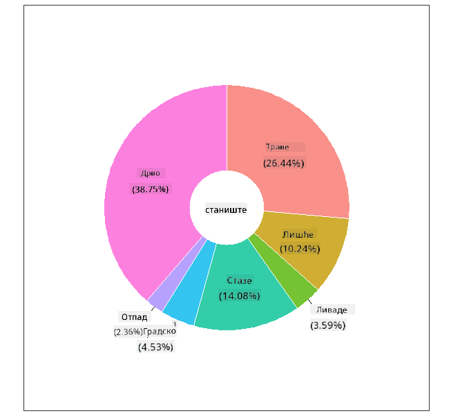
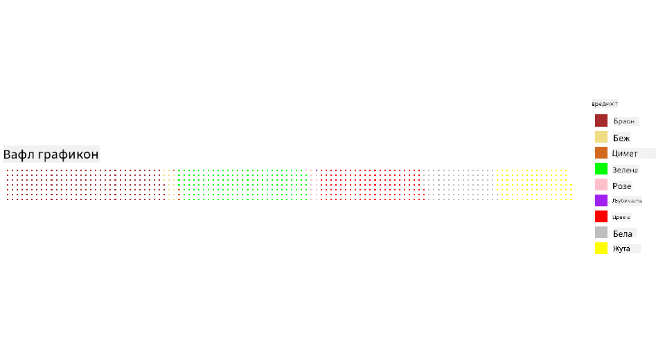

<!--
CO_OP_TRANSLATOR_METADATA:
{
  "original_hash": "47028abaaafa2bcb1079702d20569066",
  "translation_date": "2025-08-30T18:39:55+00:00",
  "source_file": "3-Data-Visualization/R/11-visualization-proportions/README.md",
  "language_code": "sr"
}
-->
# Визуализација Пропорција

| ](../../../sketchnotes/11-Visualizing-Proportions.png)|
|:---:|
|Визуализација Пропорција - _Скетч од [@nitya](https://twitter.com/nitya)_ |

У овој лекцији, користићете другачији сет података са природном тематиком како бисте визуализовали пропорције, као што је број различитих врста гљива у датом скупу података о печуркама. Истражимо ове фасцинантне гљиве користећи сет података из Audubon-а који садржи детаље о 23 врсте гљива са ламелама из породица Agaricus и Lepiota. Експериментисаћете са укусним визуализацијама као што су:

- Пита графикони 🥧  
- Крофна графикони 🍩  
- Вафл графикони 🧇  

> 💡 Веома занимљив пројекат под називом [Charticulator](https://charticulator.com) од Microsoft Research-а нуди бесплатан интерфејс за визуализацију података методом превлачења и испуштања. У једном од њихових туторијала такође користе овај сет података о печуркама! Тако да можете истражити податке и истовремено научити библиотеку: [Charticulator туторијал](https://charticulator.com/tutorials/tutorial4.html).

## [Квиз пре предавања](https://purple-hill-04aebfb03.1.azurestaticapps.net/quiz/20)

## Упознајте своје печурке 🍄

Печурке су веома занимљиве. Увезимо сет података да их проучимо:

```r
mushrooms = read.csv('../../data/mushrooms.csv')
head(mushrooms)
```  
Табела се приказује са одличним подацима за анализу:

| класа     | облик-шешира | површина-шешира | боја-шешира | модрице | мирис    | везаност-ламела | размак-ламела | величина-ламела | боја-ламела | облик-стабљике | корен-стабљике | површина-стабљике-изнад-прстена | површина-стабљике-испод-прстена | боја-стабљике-изнад-прстена | боја-стабљике-испод-прстена | тип-вела | боја-вела | број-прстена | тип-прстена | боја-спора | популација | станиште |
| --------- | ------------ | --------------- | ----------- | ------- | -------- | --------------- | ------------- | --------------- | ----------- | -------------- | ------------ | ---------------------------- | ---------------------------- | -------------------------- | -------------------------- | -------- | --------- | ------------ | ----------- | ---------- | ---------- | -------- |
| Отровна   | Конвексна    | Глатка          | Браон       | Модрице | Јак      | Слободна        | Густа         | Уска            | Црна        | Широка         | Једнака       | Глатка                     | Глатка                     | Бела                      | Бела                      | Делимична | Бела      | Један        | Висећи      | Црна       | Расута     | Урбана   |
| Јестива   | Конвексна    | Глатка          | Жута        | Модрице | Бадем    | Слободна        | Густа         | Широка          | Црна        | Широка         | Клупка       | Глатка                     | Глатка                     | Бела                      | Бела                      | Делимична | Бела      | Један        | Висећи      | Браон      | Бројна     | Травњаци |
| Јестива   | Звонаста     | Глатка          | Бела        | Модрице | Анис     | Слободна        | Густа         | Широка          | Браон       | Широка         | Клупка       | Глатка                     | Глатка                     | Бела                      | Бела                      | Делимична | Бела      | Један        | Висећи      | Браон      | Бројна     | Ливаде   |
| Отровна   | Конвексна    | Љускава         | Бела        | Модрице | Јак      | Слободна        | Густа         | Уска            | Браон       | Широка         | Једнака       | Глатка                     | Глатка                     | Бела                      | Бела                      | Делимична | Бела      | Један        | Висећи      | Црна       | Расута     | Урбана   |
| Јестива   | Конвексна    | Глатка          | Зелена      | Без модрица | Нема  | Слободна        | Густа         | Широка          | Црна        | Сужена         | Једнака       | Глатка                     | Глатка                     | Бела                      | Бела                      | Делимична | Бела      | Један        | Пролазна    | Браон      | Обилна     | Травњаци |
| Јестива   | Конвексна    | Љускава         | Жута        | Модрице | Бадем    | Слободна        | Густа         | Широка          | Браон       | Широка         | Клупка       | Глатка                     | Глатка                     | Бела                      | Бела                      | Делимична | Бела      | Један        | Висећи      | Црна       | Бројна     | Травњаци |

Одмах примећујете да су сви подаци текстуални. Мораћете да конвертујете ове податке како бисте их могли користити у графикону. Већина података је, заправо, представљена као објекат:

```r
names(mushrooms)
```  

Резултат је:

```output
[1] "class"                    "cap.shape"               
 [3] "cap.surface"              "cap.color"               
 [5] "bruises"                  "odor"                    
 [7] "gill.attachment"          "gill.spacing"            
 [9] "gill.size"                "gill.color"              
[11] "stalk.shape"              "stalk.root"              
[13] "stalk.surface.above.ring" "stalk.surface.below.ring"
[15] "stalk.color.above.ring"   "stalk.color.below.ring"  
[17] "veil.type"                "veil.color"              
[19] "ring.number"              "ring.type"               
[21] "spore.print.color"        "population"              
[23] "habitat"            
```  
Узмите ове податке и конвертујте колону 'класа' у категорију:

```r
library(dplyr)
grouped=mushrooms %>%
  group_by(class) %>%
  summarise(count=n())
```  

Сада, ако одштампате податке о печуркама, видећете да су груписани у категорије према класи јестиво/отровно:  
```r
View(grouped)
```  

| класа     | број |
| --------- | ---- |
| Јестива   | 4208 |
| Отровна   | 3916 |

Ако пратите редослед приказан у овој табели за креирање етикета категорија класе, можете направити пита графикон.

## Пита!

```r
pie(grouped$count,grouped$class, main="Edible?")
```  
Ево га, пита графикон који приказује пропорције ових података према ове две класе печурака. Веома је важно добити редослед етикета исправно, посебно овде, па обавезно проверите редослед којим је низ етикета направљен!


## Крофне!

Мало визуелно занимљивији пита графикон је крофна графикон, који је пита графикон са рупом у средини. Погледајмо наше податке користећи овај метод.

Погледајте различита станишта где печурке расту:

```r
library(dplyr)
habitat=mushrooms %>%
  group_by(habitat) %>%
  summarise(count=n())
View(habitat)
```  
Резултат је:  
| станиште | број |
| -------- | ---- |
| Травњаци | 2148 |
| Лишће    | 832  |
| Ливаде   | 292  |
| Стазе    | 1144 |
| Урбана   | 368  |
| Отпад    | 192  |
| Шума     | 3148 |

Овде групишете своје податке по станишту. Постоји 7 наведених, па их користите као етикете за ваш крофна графикон:

```r
library(ggplot2)
library(webr)
PieDonut(habitat, aes(habitat, count=count))
```  



Овај код користи две библиотеке - ggplot2 и webr. Користећи функцију PieDonut из webr библиотеке, лако можемо направити крофна графикон!

Крофна графикони у R-у могу се направити и само помоћу ggplot2 библиотеке. Више о томе можете научити [овде](https://www.r-graph-gallery.com/128-ring-or-donut-plot.html) и испробати сами.

Сада када знате како да групишете своје податке и затим их прикажете као пита или крофна графикон, можете истражити друге типове графикона. Испробајте вафл графикон, који је само другачији начин истраживања количина.

## Вафли!

'Вафл' тип графикона је другачији начин визуализације количина као 2Д мреже квадрата. Покушајте да визуализујете различите количине боја шешира печурака у овом сету података. Да бисте то урадили, потребно је да инсталирате помоћну библиотеку под називом [waffle](https://cran.r-project.org/web/packages/waffle/waffle.pdf) и користите је за генерисање своје визуализације:

```r
install.packages("waffle", repos = "https://cinc.rud.is")
```  

Изаберите сегмент својих података за груписање:

```r
library(dplyr)
cap_color=mushrooms %>%
  group_by(cap.color) %>%
  summarise(count=n())
View(cap_color)
```  

Направите вафл графикон креирањем етикета и затим груписањем својих података:

```r
library(waffle)
names(cap_color$count) = paste0(cap_color$cap.color)
waffle((cap_color$count/10), rows = 7, title = "Waffle Chart")+scale_fill_manual(values=c("brown", "#F0DC82", "#D2691E", "green", 
                                                                                     "pink", "purple", "red", "grey", 
                                                                                     "yellow","white"))
```  

Користећи вафл графикон, јасно можете видети пропорције боја шешира у овом сету података о печуркама. Интересантно је да постоји много печурака са зеленим шеширима!



У овој лекцији, научили сте три начина за визуализацију пропорција. Прво, потребно је да групишете своје податке у категорије, а затим одлучите који је најбољи начин за приказивање података - пита, крофна или вафл. Сви су укусни и пружају кориснику тренутни увид у сет података.

## 🚀 Изазов

Покушајте да поново направите ове укусне графиконе у [Charticulator](https://charticulator.com).  
## [Квиз после предавања](https://purple-hill-04aebfb03.1.azurestaticapps.net/quiz/21)

## Преглед и Самостално Учење

Понекад није очигледно када користити пита, крофна или вафл графикон. Ево неколико чланака за читање на ову тему:

https://www.beautiful.ai/blog/battle-of-the-charts-pie-chart-vs-donut-chart  

https://medium.com/@hypsypops/pie-chart-vs-donut-chart-showdown-in-the-ring-5d24fd86a9ce  

https://www.mit.edu/~mbarker/formula1/f1help/11-ch-c6.htm  

https://medium.datadriveninvestor.com/data-visualization-done-the-right-way-with-tableau-waffle-chart-fdf2a19be402  

Истражите више информација о овој дилеми.  

## Задатак

[Испробајте у Excel-у](assignment.md)  

---

**Одрицање од одговорности**:  
Овај документ је преведен коришћењем услуге за превођење помоћу вештачке интелигенције [Co-op Translator](https://github.com/Azure/co-op-translator). Иако се трудимо да обезбедимо тачност, молимо вас да имате у виду да аутоматски преводи могу садржати грешке или нетачности. Оригинални документ на његовом изворном језику треба сматрати ауторитативним извором. За критичне информације препоручује се професионални превод од стране људи. Не сносимо одговорност за било каква погрешна тумачења или неспоразуме који могу произаћи из коришћења овог превода.