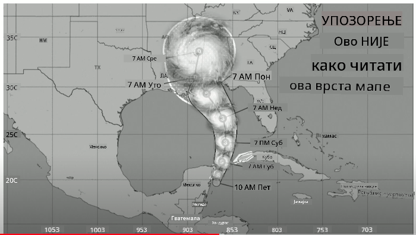
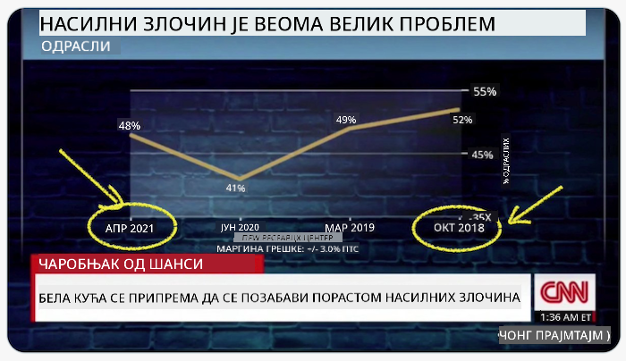
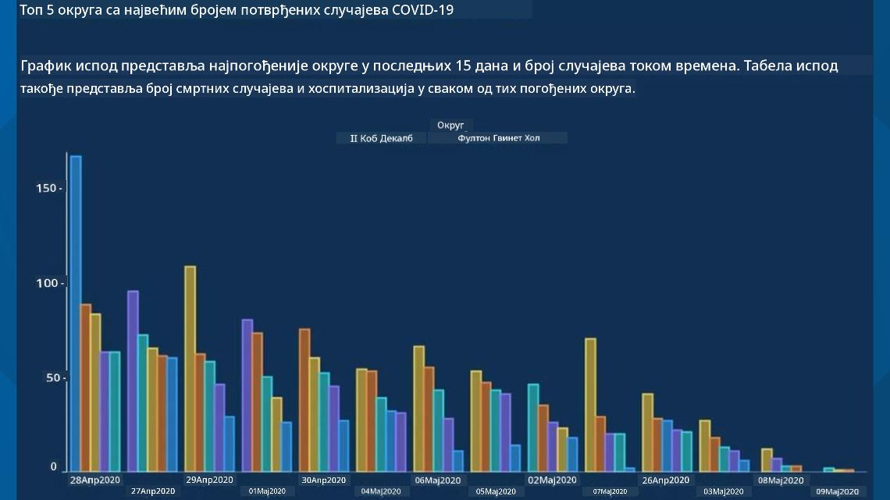
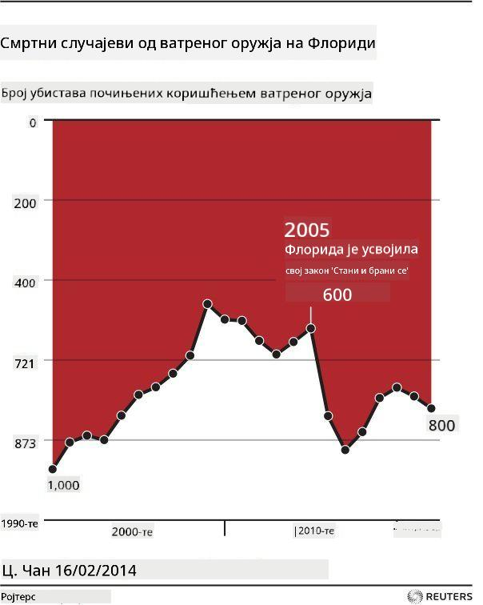
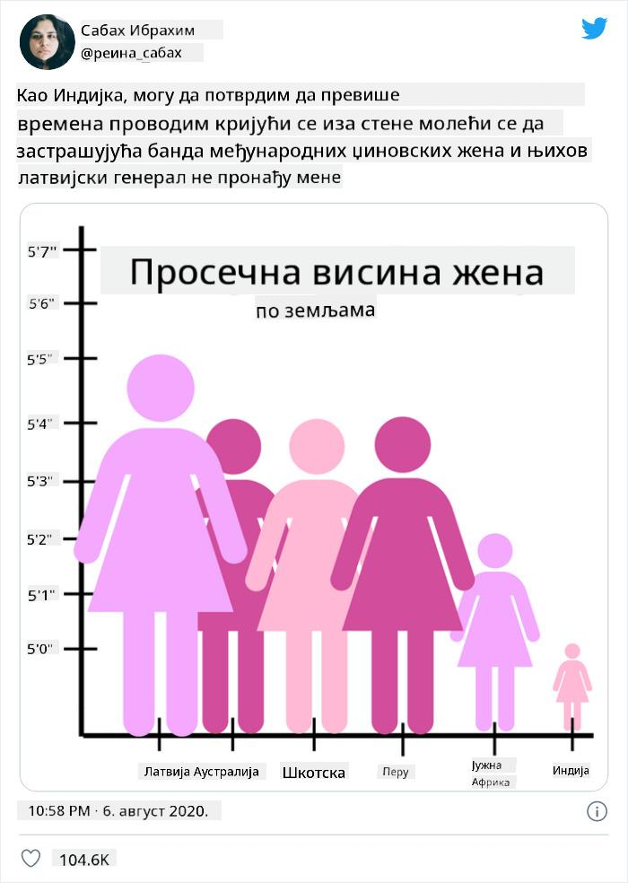
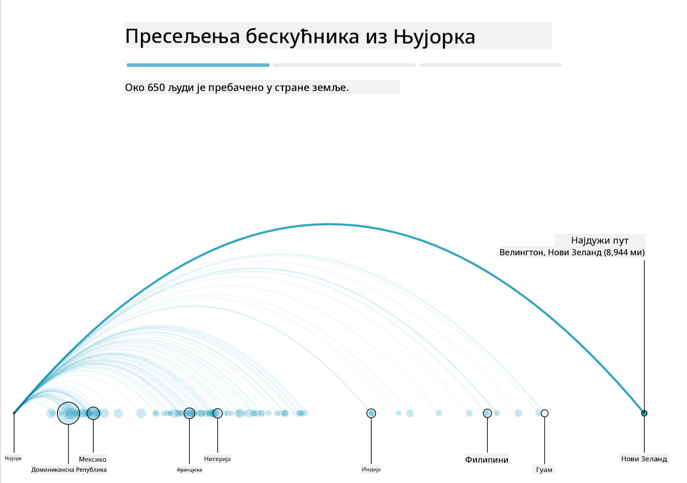
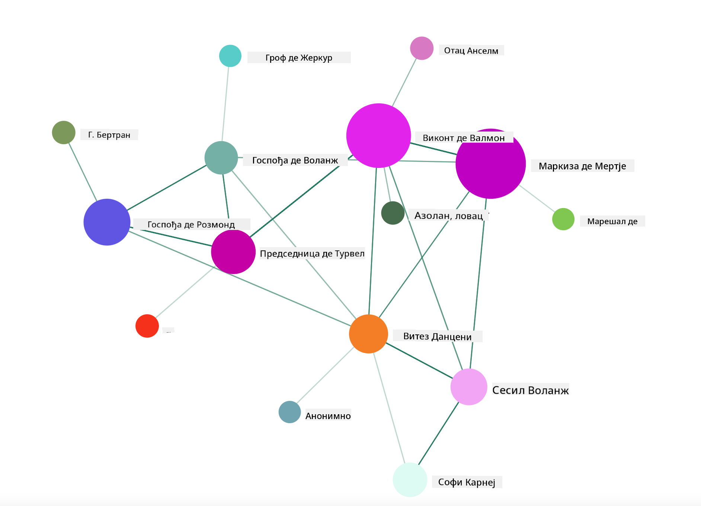

<!--
CO_OP_TRANSLATOR_METADATA:
{
  "original_hash": "b4039f1c76548d144a0aee0bf28304ec",
  "translation_date": "2025-08-30T18:54:07+00:00",
  "source_file": "3-Data-Visualization/R/13-meaningful-vizualizations/README.md",
  "language_code": "sr"
}
-->
# Прављење смислених визуализација

| ](../../../sketchnotes/13-MeaningfulViz.png)|
|:---:|
| Смислене визуализације - _Скетч од [@nitya](https://twitter.com/nitya)_ |

> "Ако довољно дуго мучите податке, признаће било шта" -- [Роналд Коуз](https://en.wikiquote.org/wiki/Ronald_Coase)

Једна од основних вештина дата научника је способност да креира смислену визуализацију података која помаже у одговарању на питања која имате. Пре него што визуализујете своје податке, потребно је да их очистите и припремите, као што сте радили у претходним лекцијама. Након тога, можете почети да одлучујете како најбоље да представите податке.

У овој лекцији, прегледаћете:

1. Како одабрати прави тип графикона
2. Како избегавати обмањујуће графиконе
3. Како радити са бојама
4. Како стилизовати графиконе ради читљивости
5. Како направити анимиране или 3Д графиконе
6. Како направити креативну визуализацију

## [Квиз пре предавања](https://purple-hill-04aebfb03.1.azurestaticapps.net/quiz/24)

## Одабир правог типа графикона

У претходним лекцијама, експериментисали сте са прављењем различитих визуализација података користећи Matplotlib и Seaborn за графиконе. Уопштено, можете одабрати [прави тип графикона](https://chartio.com/learn/charts/how-to-select-a-data-vizualization/) за питање које постављате користећи ову табелу:

| Потребно је:               | Треба користити:                 |
| -------------------------- | ------------------------------- |
| Приказати трендове током времена | Линијски графикон              |
| Упоредити категорије         | Стубни, Пита                    |
| Упоредити укупне вредности    | Пита, Сложени стубни графикон    |
| Приказати односе             | Расејани, Линијски, Фасетни, Двоструки линијски |
| Приказати дистрибуције       | Расејани, Хистограм, Бокс       |
| Приказати пропорције         | Пита, Крофна, Вафл              |

> ✅ У зависности од састава ваших података, можда ћете морати да их конвертујете из текста у бројеве како би графикон подржао приказ.

## Избегавање обмане

Чак и ако дата научник пажљиво одабере прави графикон за праве податке, постоји много начина на које подаци могу бити приказани да би се доказала одређена теза, често на штету самих података. Постоји много примера обмањујућих графикона и инфографика!

[](https://www.youtube.com/watch?v=oX74Nge8Wkw "Како графикони лажу")

> 🎥 Кликните на слику изнад за конференцијски говор о обмањујућим графиконима

Овај графикон обрће X осу да би приказао супротно од истине, на основу датума:



[Овај графикон](https://media.firstcoastnews.com/assets/WTLV/images/170ae16f-4643-438f-b689-50d66ca6a8d8/170ae16f-4643-438f-b689-50d66ca6a8d8_1140x641.jpg) је још обмањујући, јер око прати десну страну и закључује да су током времена случајеви COVID-а опали у различитим окрузима. У ствари, ако пажљиво погледате датуме, открићете да су они преуређени да би се приказао обмањујући тренд опадања.



Овај озлоглашени пример користи боју И обрнуту Y осу да би обмануо: уместо закључка да су смртни случајеви од оружја нагло порасли након усвајања закона који подржава оружје, око је преварено да мисли супротно:



Овај необичан графикон показује како се пропорција може манипулисати, на комичан начин:



Упоређивање неупоредивог је још један сумњив трик. Постоји [диван веб сајт](https://tylervigen.com/spurious-correlations) посвећен 'лажним корелацијама' који приказује 'чињенице' које корелирају ствари попут стопе развода у Мејну и потрошње маргарина. Реддит група такође сакупља [ружне употребе](https://www.reddit.com/r/dataisugly/top/?t=all) података.

Важно је разумети колико лако око може бити преварено обмањујућим графиконима. Чак и ако је намера дата научника добра, избор лошег типа графикона, као што је пита графикон са превише категорија, може бити обмањујући.

## Боја

Видели сте у графикону 'насиље оружјем на Флориди' како боја може додати додатни слој значења графиконима, посебно онима који нису дизајнирани помоћу библиотека као што су ggplot2 и RColorBrewer које долазе са различитим провереним библиотекама боја и палетама. Ако правите графикон ручно, мало проучите [теорију боја](https://colormatters.com/color-and-design/basic-color-theory).

> ✅ Будите свесни, приликом дизајнирања графикона, да је приступачност важан аспект визуализације. Неки од ваших корисника могу бити далтонисти - да ли ваш графикон добро приказује податке за кориснике са оштећењем вида?

Будите пажљиви приликом избора боја за ваш графикон, јер боја може пренети значење које можда нисте намеравали. 'Розе даме' у графикону 'висина' изнад преносе изразито 'женствено' значење које додаје бизарности самог графикона.

Иако [значење боја](https://colormatters.com/color-symbolism/the-meanings-of-colors) може бити различито у различитим деловима света и има тенденцију да се мења у зависности од нијансе, генерално значења боја укључују:

| Боја  | Значење             |
| ------ | ------------------- |
| црвена | моћ                |
| плава  | поверење, лојалност |
| жута   | срећа, опрез       |
| зелена | екологија, срећа, завист |
| љубичаста | срећа            |
| наранџаста | живост          |

Ако вам је задатак да направите графикон са прилагођеним бојама, уверите се да су ваши графикони и приступачни и да боја коју одаберете одговара значењу које покушавате да пренесете.

## Стилизовање графикона ради читљивости

Графикони нису смислени ако нису читљиви! Одвојите тренутак да размислите о стилизовању ширине и висине вашег графикона како би се добро уклопили са вашим подацима. Ако једна променљива (као што је свих 50 држава) треба да буде приказана, прикажите их вертикално на Y оси ако је могуће, како бисте избегли хоризонтално скроловање графикона.

Означите своје осе, обезбедите легенду ако је потребно, и понудите алатке за боље разумевање података.

Ако су ваши подаци текстуални и опширни на X оси, можете нагнути текст ради боље читљивости. [plot3D](https://cran.r-project.org/web/packages/plot3D/index.html) нуди 3Д графиконе, ако ваши подаци то подржавају. Софистициране визуализације података могу се произвести помоћу њега.


## Анимација и приказ 3Д графикона

Неки од најбољих визуализација података данас су анимирани. Ширли Ву има невероватне примере направљене са D3, као што је '[цветови филма](http://bl.ocks.org/sxywu/raw/d612c6c653fb8b4d7ff3d422be164a5d/)', где је сваки цвет визуализација филма. Још један пример за Guardian је 'бусед оут', интерактивно искуство које комбинује визуализације са Greensock и D3 плус формат чланка са скроловањем за приказ како Њујорк решава проблем бескућника тако што их шаље ван града.



> "Бусед Оут: Како Америка премешта своје бескућнике" из [Guardian-а](https://www.theguardian.com/us-news/ng-interactive/2017/dec/20/bussed-out-america-moves-homeless-people-country-study). Визуализације од Надие Бремер и Ширли Ву

Иако ова лекција није довољна да детаљно научи ове моћне библиотеке за визуализацију, пробајте D3 у Vue.js апликацији користећи библиотеку за приказ визуализације књиге "Опасне везе" као анимиране друштвене мреже.

> "Опасне везе" је епистоларни роман, или роман представљен као серија писама. Написан 1782. године од стране Шодерлоа де Лаклоа, прича о злобним, морално банкротираним друштвеним маневрима двају главних ликова француске аристократије крајем 18. века, Виконта де Валмона и Маркизе де Мертје. Оба лика на крају доживљавају пропаст, али не без наношења велике друштвене штете. Роман се одвија као серија писама написаних различитим људима у њиховим круговима, планирајући освету или једноставно правећи проблеме. Направите визуализацију ових писама да бисте открили главне актере нарације, визуелно.

Завршићете веб апликацију која ће приказати анимирани приказ ове друштвене мреже. Користи библиотеку која је направљена за креирање [визуализације мреже](https://github.com/emiliorizzo/vue-d3-network) користећи Vue.js и D3. Када апликација ради, можете померати чворове по екрану да бисте прераспоредили податке.



## Пројекат: Направите графикон за приказ мреже користећи D3.js

> Овај фолдер лекције укључује `solution` фолдер где можете пронаћи завршени пројекат, за вашу референцу.

1. Пратите упутства у README.md фајлу у корену стартног фолдера. Уверите се да имате NPM и Node.js инсталиране на вашем рачунару пре него што инсталирате зависности пројекта.

2. Отворите `starter/src` фолдер. Открићете `assets` фолдер где можете пронаћи .json фајл са свим писмима из романа, нумерисаним, са 'to' и 'from' ознакама.

3. Завршите код у `components/Nodes.vue` да омогућите визуализацију. Потражите метод назван `createLinks()` и додајте следећу угњеждену петљу.

Прођите кроз .json објекат да бисте ухватили 'to' и 'from' податке за писма и изградили `links` објекат тако да библиотека за визуализацију може да га користи:

```javascript
//loop through letters
      let f = 0;
      let t = 0;
      for (var i = 0; i < letters.length; i++) {
          for (var j = 0; j < characters.length; j++) {
              
            if (characters[j] == letters[i].from) {
              f = j;
            }
            if (characters[j] == letters[i].to) {
              t = j;
            }
        }
        this.links.push({ sid: f, tid: t });
      }
  ```

Покрените своју апликацију из терминала (npm run serve) и уживајте у визуализацији!

## 🚀 Изазов

Претражите интернет да бисте открили обмањујуће визуализације. Како аутор обмањује корисника, и да ли је то намерно? Покушајте да исправите визуализације да покажете како би требало да изгледају.

## [Квиз после предавања](https://purple-hill-04aebfb03.1.azurestaticapps.net/quiz/25)

## Преглед и самостално учење

Ево неких чланака за читање о обмањујућој визуализацији података:

https://gizmodo.com/how-to-lie-with-data-visualization-1563576606

http://ixd.prattsi.org/2017/12/visual-lies-usability-in-deceptive-data-visualizations/

Погледајте ове занимљиве визуализације историјских ресурса и артефаката:

https://handbook.pubpub.org/

Прочитајте овај чланак о томе како анимација може побољшати ваше визуализације:

https://medium.com/@EvanSinar/use-animation-to-supercharge-data-visualization-cd905a882ad4

## Задатак

[Направите своју прилагођену визуализацију](assignment.md)

---

**Одрицање од одговорности**:  
Овај документ је преведен коришћењем услуге за превођење помоћу вештачке интелигенције [Co-op Translator](https://github.com/Azure/co-op-translator). Иако се трудимо да превод буде тачан, молимо вас да имате у виду да аутоматизовани преводи могу садржати грешке или нетачности. Оригинални документ на његовом изворном језику треба сматрати меродавним извором. За критичне информације препоручује се професионални превод од стране људи. Не преузимамо одговорност за било каква погрешна тумачења или неспоразуме који могу настати услед коришћења овог превода.