<!--
CO_OP_TRANSLATOR_METADATA:
{
  "original_hash": "14b2a7f1c63202920bd98eeb913f5614",
  "translation_date": "2025-08-30T17:37:56+00:00",
  "source_file": "5-Data-Science-In-Cloud/18-Low-Code/README.md",
  "language_code": "sr"
}
-->
# Наука о подацима у облаку: "Low code/No code" приступ

| ](../../sketchnotes/18-DataScience-Cloud.png)|
|:---:|
| Наука о подацима у облаку: Low Code - _Скетч од [@nitya](https://twitter.com/nitya)_ |

Садржај:

- [Наука о подацима у облаку: "Low code/No code" приступ](../../../../5-Data-Science-In-Cloud/18-Low-Code)
  - [Квиз пре предавања](../../../../5-Data-Science-In-Cloud/18-Low-Code)
  - [1. Увод](../../../../5-Data-Science-In-Cloud/18-Low-Code)
    - [1.1 Шта је Azure Machine Learning?](../../../../5-Data-Science-In-Cloud/18-Low-Code)
    - [1.2 Пројекат предвиђања срчаног удара:](../../../../5-Data-Science-In-Cloud/18-Low-Code)
    - [1.3 Скуп података о срчаном удару:](../../../../5-Data-Science-In-Cloud/18-Low-Code)
  - [2. Low code/No code обука модела у Azure ML Studio](../../../../5-Data-Science-In-Cloud/18-Low-Code)
    - [2.1 Креирање Azure ML радног простора](../../../../5-Data-Science-In-Cloud/18-Low-Code)
    - [2.2 Ресурси за рачунање](../../../../5-Data-Science-In-Cloud/18-Low-Code)
      - [2.2.1 Избор правих опција за ресурсе за рачунање](../../../../5-Data-Science-In-Cloud/18-Low-Code)
      - [2.2.2 Креирање кластера за рачунање](../../../../5-Data-Science-In-Cloud/18-Low-Code)
    - [2.3 Учитавање скупа података](../../../../5-Data-Science-In-Cloud/18-Low-Code)
    - [2.4 Low code/No Code обука са AutoML](../../../../5-Data-Science-In-Cloud/18-Low-Code)
  - [3. Low code/No Code распоређивање модела и коришћење крајњих тачака](../../../../5-Data-Science-In-Cloud/18-Low-Code)
    - [3.1 Распоређивање модела](../../../../5-Data-Science-In-Cloud/18-Low-Code)
    - [3.2 Коришћење крајњих тачака](../../../../5-Data-Science-In-Cloud/18-Low-Code)
  - [🚀 Изазов](../../../../5-Data-Science-In-Cloud/18-Low-Code)
  - [Квиз после предавања](../../../../5-Data-Science-In-Cloud/18-Low-Code)
  - [Преглед и самостално учење](../../../../5-Data-Science-In-Cloud/18-Low-Code)
  - [Задатак](../../../../5-Data-Science-In-Cloud/18-Low-Code)
  
## [Квиз пре предавања](https://purple-hill-04aebfb03.1.azurestaticapps.net/quiz/34)
## 1. Увод
### 1.1 Шта је Azure Machine Learning?

Azure cloud платформа обухвата више од 200 производа и услуга у облаку, дизајнираних да вам помогну да оживите нова решења.
Научници који се баве подацима троше много времена на истраживање и предобраду података, као и на испробавање различитих алгоритама за обуку модела како би произвели прецизне моделе. Ови задаци су временски захтевни и често неефикасно користе скупу хардверску опрему за рачунање.

[Azure ML](https://docs.microsoft.com/azure/machine-learning/overview-what-is-azure-machine-learning?WT.mc_id=academic-77958-bethanycheum&ocid=AID3041109) је платформа заснована на облаку за изградњу и управљање решењима машинског учења у Azure-у. Она укључује широк спектар функција и могућности које помажу научницима да припреме податке, обуче моделе, објаве предиктивне услуге и прате њихову употребу. Најважније, помаже им да повећају ефикасност аутоматизацијом многих временски захтевних задатака повезаних са обуком модела; и омогућава им да користе ресурсе за рачунање засноване на облаку који се ефикасно скалирају, како би обрадили велике количине података уз трошкове само када се стварно користе.

Azure ML пружа све алате који су потребни програмерима и научницима за њихове радне токове машинског учења. Ови алати укључују:

- **Azure Machine Learning Studio**: веб портал у Azure Machine Learning-у за опције са мало или без кода за обуку модела, распоређивање, аутоматизацију, праћење и управљање ресурсима. Studio се интегрише са Azure Machine Learning SDK-ом за беспрекорно искуство.
- **Jupyter Notebooks**: брзо прототиписање и тестирање ML модела.
- **Azure Machine Learning Designer**: омогућава превлачење и испуштање модула за изградњу експеримената и затим распоређивање токова у окружењу са мало кода.
- **Аутоматизовани интерфејс машинског учења (AutoML)**: аутоматизује итеративне задатке развоја модела машинског учења, омогућавајући изградњу ML модела са високом скалабилношћу, ефикасношћу и продуктивношћу, уз одржавање квалитета модела.
- **Ознака података**: алат за машинско учење који помаже у аутоматском означавању података.
- **Екстензија машинског учења за Visual Studio Code**: пружа потпуно опремљено развојно окружење за изградњу и управљање ML пројектима.
- **CLI за машинско учење**: пружа команде за управљање Azure ML ресурсима из командне линије.
- **Интеграција са open-source оквирима** као што су PyTorch, TensorFlow, Scikit-learn и многи други за обуку, распоређивање и управљање процесом машинског учења од почетка до краја.
- **MLflow**: отворена библиотека за управљање животним циклусом ваших експеримената машинског учења. **MLFlow Tracking** је компонента MLflow-а која бележи и прати метрике обуке и артефакте модела, без обзира на окружење вашег експеримента.

### 1.2 Пројекат предвиђања срчаног удара:

Нема сумње да је прављење и изградња пројеката најбољи начин да тестирати своје вештине и знање. У овом предавању, истражићемо два различита начина изградње пројекта науке о подацима за предвиђање срчаних удара у Azure ML Studio, кроз Low code/No code и кроз Azure ML SDK, као што је приказано у следећој шеми:

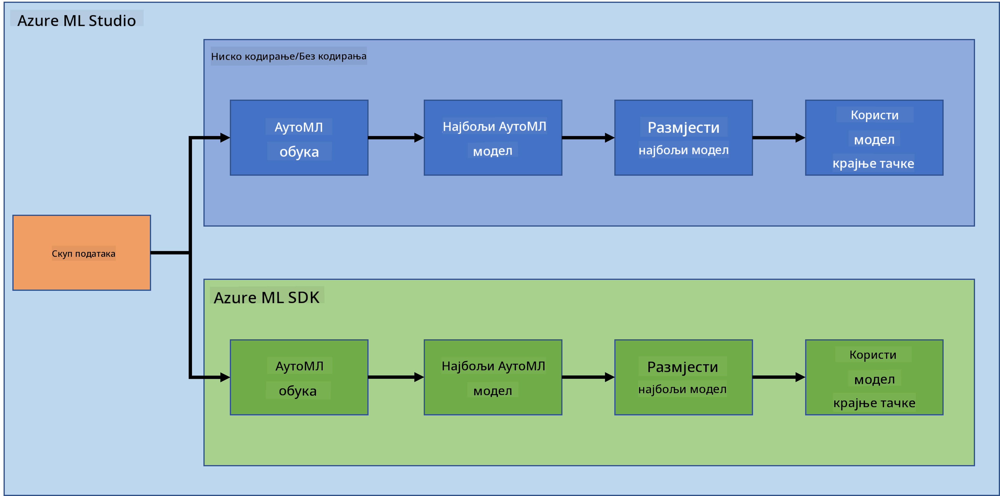

Сваки начин има своје предности и недостатке. Low code/No code приступ је лакши за почетак јер подразумева интеракцију са GUI (графичким корисничким интерфејсом), без потребе за претходним знањем о кодирању. Овај метод омогућава брзо тестирање изводљивости пројекта и креирање POC (Proof Of Concept). Међутим, како пројекат расте и ствари треба да буду спремне за производњу, није изводљиво креирати ресурсе кроз GUI. Потребно је програмски аутоматизовати све, од креирања ресурса до распоређивања модела. Овде постаје кључно знање о коришћењу Azure ML SDK-а.

|                   | Low code/No code | Azure ML SDK              |
|-------------------|------------------|---------------------------|
| Знање о кодирању  | Није потребно    | Потребно                  |
| Време развоја     | Брзо и лако      | Зависи од знања о коду     |
| Спремност за производњу | Не               | Да                        |

### 1.3 Скуп података о срчаном удару:

Кардиоваскуларне болести (CVDs) су водећи узрок смрти на глобалном нивоу, чинећи 31% свих смртних случајева широм света. Еколошки и понашајни фактори ризика као што су употреба дувана, нездрава исхрана и гојазност, физичка неактивност и штетна употреба алкохола могу се користити као карактеристике за моделе процене. Могућност процене вероватноће развоја CVD-а могла би бити од велике користи за спречавање напада код људи са високим ризиком.

Kaggle је учинио [скуп података о срчаном удару](https://www.kaggle.com/andrewmvd/heart-failure-clinical-data) јавно доступним, који ћемо користити за овај пројекат. Можете преузети скуп података сада. Ово је табеларни скуп података са 13 колона (12 карактеристика и 1 циљна променљива) и 299 редова.

|    | Назив променљиве          | Тип             | Опис                                                     | Пример            |
|----|---------------------------|-----------------|----------------------------------------------------------|-------------------|
| 1  | age                       | нумерички       | старост пацијента                                        | 25                |
| 2  | anaemia                   | булов           | Смањење црвених крвних зрнаца или хемоглобина            | 0 или 1           |
| 3  | creatinine_phosphokinase  | нумерички       | Ниво CPK ензима у крви                                   | 542               |
| 4  | diabetes                  | булов           | Да ли пацијент има дијабетес                             | 0 или 1           |
| 5  | ejection_fraction         | нумерички       | Проценат крви који напушта срце при свакој контракцији    | 45                |
| 6  | high_blood_pressure       | булов           | Да ли пацијент има хипертензију                          | 0 или 1           |
| 7  | platelets                 | нумерички       | Тромбоцити у крви                                        | 149000            |
| 8  | serum_creatinine          | нумерички       | Ниво серумског креатинина у крви                         | 0.5               |
| 9  | serum_sodium              | нумерички       | Ниво серумског натријума у крви                          | jun               |
| 10 | sex                       | булов           | жена или мушкарац                                        | 0 или 1           |
| 11 | smoking                   | булов           | Да ли пацијент пуши                                      | 0 или 1           |
| 12 | time                      | нумерички       | период праћења (дана)                                    | 4                 |
|----|---------------------------|-----------------|----------------------------------------------------------|-------------------|
| 21 | DEATH_EVENT [Циљ]         | булов           | Да ли пацијент умире током периода праћења               | 0 или 1           |

Када имате скуп података, можемо започети пројекат у Azure-у.

## 2. Low code/No code обука модела у Azure ML Studio
### 2.1 Креирање Azure ML радног простора
Да бисте обучили модел у Azure ML-у, прво морате креирати Azure ML радни простор. Радни простор је највиши ресурс за Azure Machine Learning, који пружа централизовано место за рад са свим артефактима које креирате када користите Azure Machine Learning. Радни простор чува историју свих обука, укључујући логове, метрике, излаз и снимак ваших скрипти. Користите ове информације да бисте утврдили која обука производи најбољи модел. [Сазнајте више](https://docs.microsoft.com/azure/machine-learning/concept-workspace?WT.mc_id=academic-77958-bethanycheum&ocid=AID3041109)

Препоручује се коришћење најновијег претраживача који је компатибилан са вашим оперативним системом. Подржани су следећи претраживачи:

- Microsoft Edge (нови Microsoft Edge, најновија верзија. Не Microsoft Edge legacy)
- Safari (најновија верзија, само Mac)
- Chrome (најновија верзија)
- Firefox (најновија верзија)

Да бисте користили Azure Machine Learning, креирајте радни простор у вашој Azure претплати. Затим можете користити овај радни простор за управљање подацима, ресурсима за рачунање, кодом, моделима и другим артефактима повезаним са вашим радним токовима машинског учења.

> **_НАПОМЕНА:_** Ваша Azure претплата ће бити наплаћена малим износом за складиштење података све док Azure Machine Learning радни простор постоји у вашој претплати, па вам препоручујемо да избришете Azure Machine Learning радни простор када га више не користите.

1. Пријавите се на [Azure портал](https://ms.portal.azure.com/) користећи Microsoft акредитиве повезане са вашом Azure претплатом.
2. Изаберите **＋Креирај ресурс**
   
   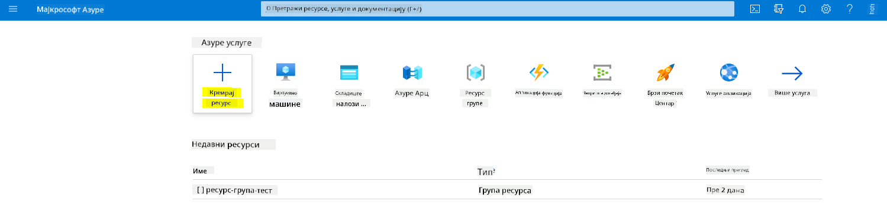

   Потражите Machine Learning и изаберите Machine Learning плочицу

   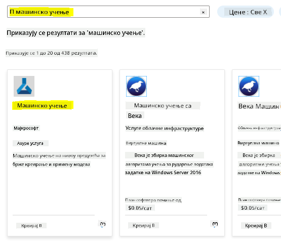

   Кликните на дугме за креирање

   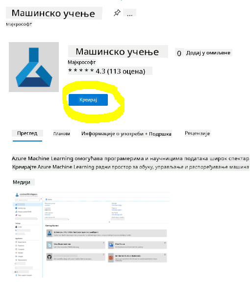

   Попуните подешавања на следећи начин:
   - Претплата: Ваша Azure претплата
   - Група ресурса: Креирајте или изаберите групу ресурса
   - Назив радног простора: Унесите јединствено име за ваш радни простор
   - Регион: Изаберите географски регион најближи вама
   - Складишни налог: Забележите подразумевани нови складишни налог који ће бити креиран за ваш радни простор
   - Key vault: Забележите подразумевани нови key vault који ће бити креиран за ваш радни простор
   - Application insights: Забележите подразумевани нови ресурс за application insights који ће бити креиран за ваш радни простор
   - Регистар контејнера: Ниједан (један ће бити аутоматски креиран први пут када распоредите модел у контејнер)

    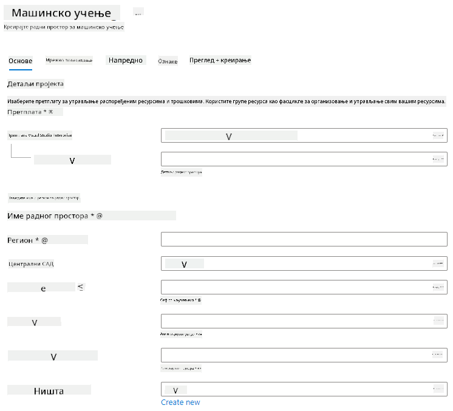

   - Кликните на креирај + прегледај, а затим на дугме за креирање
3. Сачекајте да ваш радни простор буде креиран (ово може потрајати неколико минута). Затим идите до њега у порталу. Можете га пронаћи кроз Azure Machine Learning услугу.
4. На страници Преглед за ваш радни простор, покрените Azure Machine Learning studio (или отворите нову картицу претраживача и идите на https://ml.azure.com), и пријавите се у Azure Machine Learning studio користећи ваш Microsoft налог. Ако се од вас тражи, изаберите ваш Azure директоријум и претплату, и ваш Azure Machine Learning радни простор.
   
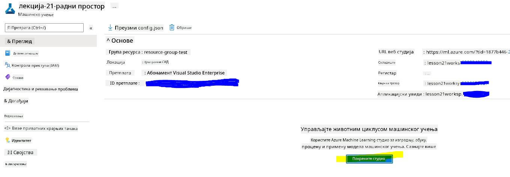

5. У Azure Machine Learning студију, пребаците ☰ икону у горњем левом углу да бисте видели различите странице у интерфејсу. Можете користити ове странице за управљање ресурсима у вашем радном простору.

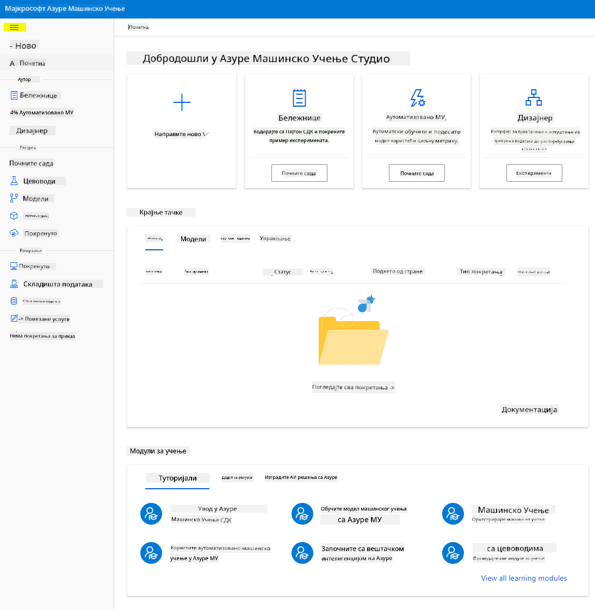

Можете управљати вашим радним простором користећи Azure портал, али за научнике који се баве подацима и инжењере машинског учења, Azure Machine Learning Studio пружа фокусираније корисничко окружење за управљање ресурсима радног простора.

### 2.2 Ресурси за рачунање

Ресурси за рачунање су ресурси засновани на облаку на којима можете покретати процесе обуке модела и истраживања података. Постоје четири врсте ресурса за рачунање које можете креирати:

- **Инстанце за рачунање**: Радне станице за развој које научници могу користити за рад са подацима и моделима. Ово подразумева креирање виртуелне машине (VM) и покретање инстанце нотебоока. Затим можете обучити модел позивањем кластера за рачунање из нотебоока.
- **Кластери
- **Придружени рачунар**: Повезује се са постојећим Azure рачунарским ресурсима, као што су виртуелне машине или Azure Databricks кластери.

#### 2.2.1 Избор правих опција за ваше рачунарске ресурсе

Постоје неки кључни фактори које треба узети у обзир приликом креирања рачунарског ресурса, а те одлуке могу бити од суштинског значаја.

**Да ли вам је потребан CPU или GPU?**

CPU (Централна процесорска јединица) је електронски склоп који извршава инструкције које чине рачунарски програм. GPU (Графичка процесорска јединица) је специјализовани електронски склоп који може извршавати код везан за графику веома великом брзином.

Главна разлика између архитектуре CPU-а и GPU-а је у томе што је CPU дизајниран да брзо обрађује широк спектар задатака (мерено брзином такта CPU-а), али је ограничен у паралелности задатака који могу бити извршени. GPU-и су дизајнирани за паралелно рачунање и стога су много бољи за задатке дубоког учења.

| CPU                                     | GPU                         |
|-----------------------------------------|-----------------------------|
| Мање скуп                              | Скупљи                     |
| Нижи ниво паралелности                 | Виши ниво паралелности     |
| Спорији у обуци модела дубоког учења    | Оптималан за дубоко учење  |

**Величина кластера**

Већи кластери су скупљи, али ће резултирати бољом одзивношћу. Стога, ако имате времена, али не и довољно новца, требало би да почнете са мањим кластером. С друге стране, ако имате новца, али не и много времена, требало би да почнете са већим кластером.

**Величина виртуелне машине (VM)**

У зависности од ваших временских и буџетских ограничења, можете варирати величину RAM-а, диска, броја језгара и брзину такта. Повећање свих ових параметара биће скупље, али ће резултирати бољим перформансама.

**Дедиковане или нископриоритетне инстанце?**

Нископриоритетна инстанца значи да је прекидива: у суштини, Microsoft Azure може узети те ресурсе и доделити их другом задатку, чиме се прекида посао. Дедикована инстанца, или непрекидива, значи да посао никада неће бити прекинут без ваше дозволе. Ово је још један аспект разматрања времена у односу на новац, јер су прекидиве инстанце јефтиније од дедикованих.

#### 2.2.2 Креирање рачунарског кластера

У [Azure ML радном простору](https://ml.azure.com/) који смо раније креирали, идите на Compute и видећете различите рачунарске ресурсе које смо управо дискутовали (тј. рачунарске инстанце, рачунарске кластере, инференцијске кластере и придружене рачунаре). За овај пројекат, биће нам потребан рачунарски кластер за обуку модела. У Studio-у, кликните на мени "Compute", затим на картицу "Compute cluster" и кликните на дугме "+ New" да бисте креирали рачунарски кластер.

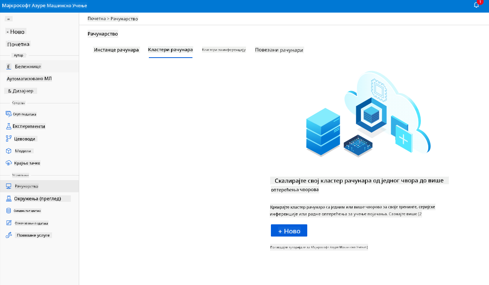

1. Изаберите опције: Дедиковане или нископриоритетне, CPU или GPU, величину виртуелне машине и број језгара (можете задржати подразумевана подешавања за овај пројекат).
2. Кликните на дугме Next.

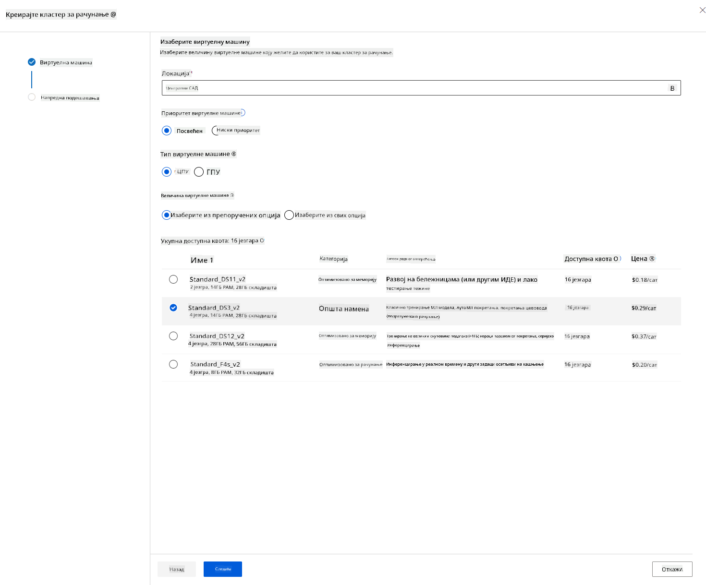

3. Дајте кластеру име.
4. Изаберите опције: Минималан/максималан број чворова, број секунди неактивности пре смањења, SSH приступ. Имајте на уму да ако је минималан број чворова 0, уштедећете новац када је кластер неактиван. Имајте на уму да што је већи број максималних чворова, то ће обука бити краћа. Препоручени максималан број чворова је 3.  
5. Кликните на дугме "Create". Овај корак може трајати неколико минута.

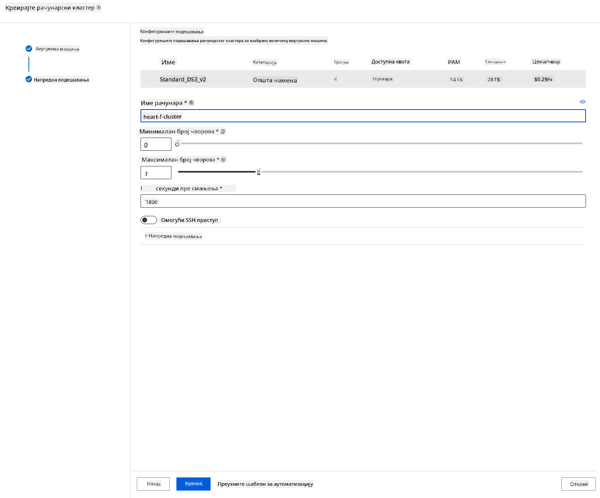

Сјајно! Сада када имамо рачунарски кластер, потребно је да учитамо податке у Azure ML Studio.

### 2.3 Учитавање скупа података

1. У [Azure ML радном простору](https://ml.azure.com/) који смо раније креирали, кликните на "Datasets" у левом менију и кликните на дугме "+ Create dataset" да бисте креирали скуп података. Изаберите опцију "From local files" и изаберите Kaggle скуп података који смо раније преузели.
   
   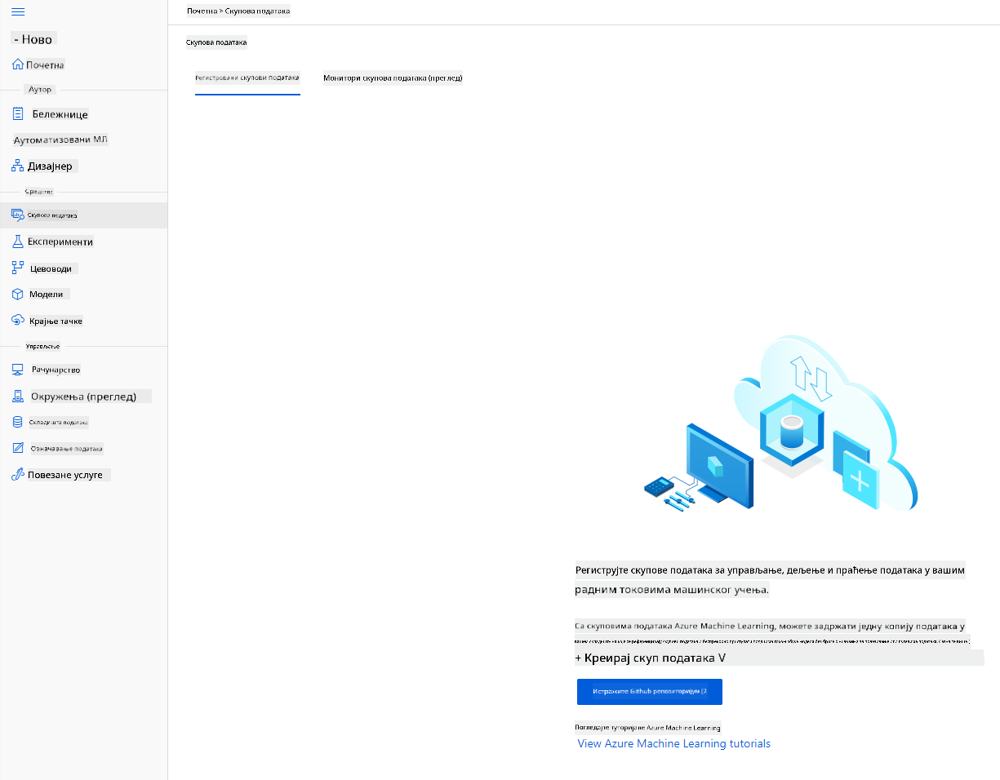

2. Дајте свом скупу података име, тип и опис. Кликните на Next. Учитајте податке из датотека. Кликните на Next.
   
   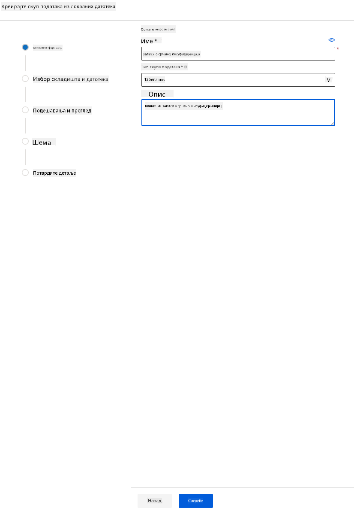

3. У шеми, промените тип података у Boolean за следеће карактеристике: анемија, дијабетес, висок крвни притисак, пол, пушење и DEATH_EVENT. Кликните на Next и затим на Create.
   
   

Одлично! Сада када је скуп података на месту и рачунарски кластер креиран, можемо започети обуку модела!

### 2.4 Обука са мало или без кода помоћу AutoML-а

Традиционални развој модела машинског учења захтева много ресурса, значајно доменско знање и време за производњу и поређење десетина модела. Аутоматизовано машинско учење (AutoML) је процес аутоматизације временски захтевних, итеративних задатака развоја модела машинског учења. Омогућава научницима података, аналитичарима и програмерима да граде ML моделе са великом скалабилношћу, ефикасношћу и продуктивношћу, уз одржавање квалитета модела. Смањује време потребно за добијање модела спремних за производњу, уз велику лакоћу и ефикасност. [Сазнајте више](https://docs.microsoft.com/azure/machine-learning/concept-automated-ml?WT.mc_id=academic-77958-bethanycheum&ocid=AID3041109)

1. У [Azure ML радном простору](https://ml.azure.com/) који смо раније креирали, кликните на "Automated ML" у левом менију и изаберите скуп података који сте управо учитали. Кликните на Next.

   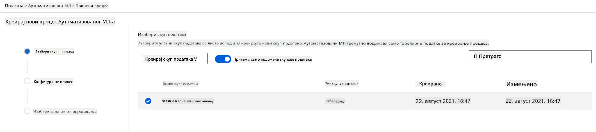

2. Унесите ново име експеримента, циљну колону (DEATH_EVENT) и рачунарски кластер који смо креирали. Кликните на Next.
   
   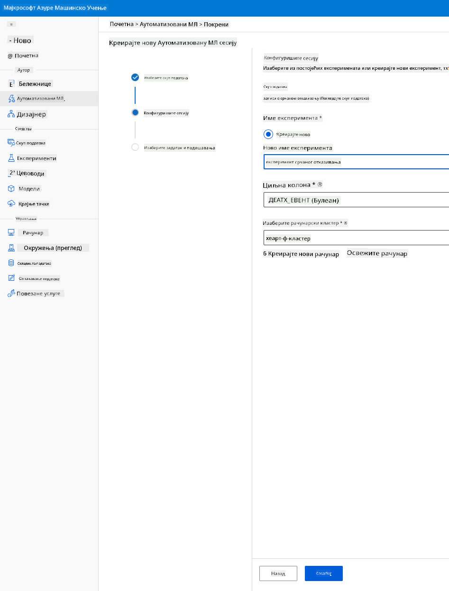

3. Изаберите "Classification" и кликните на Finish. Овај корак може трајати између 30 минута и 1 сата, у зависности од величине вашег рачунарског кластера.
    
    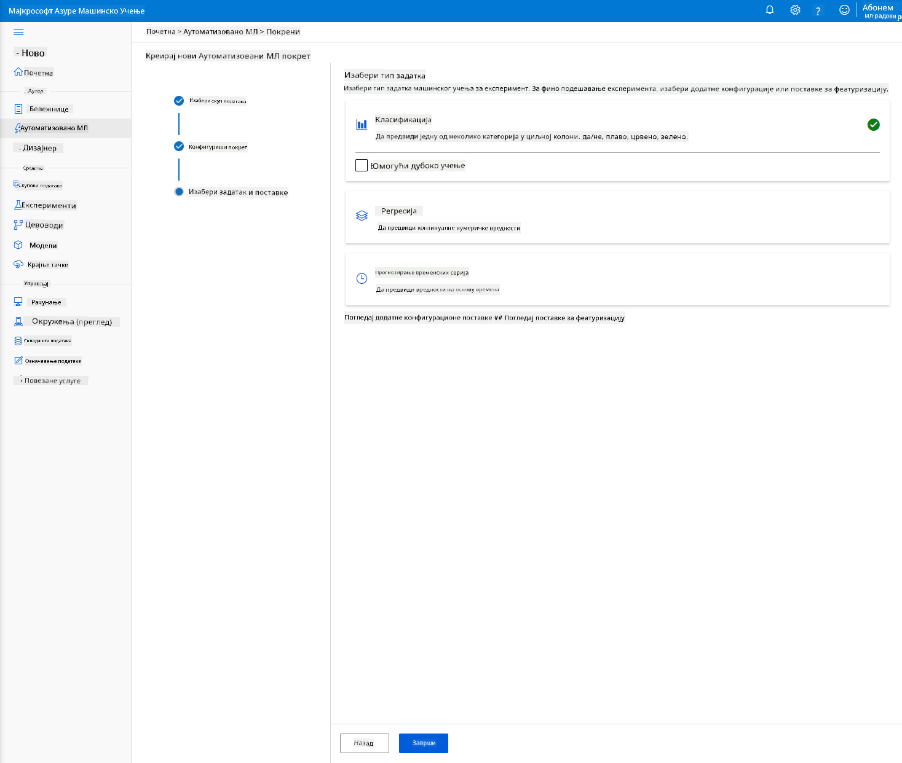

4. Када се извршавање заврши, кликните на картицу "Automated ML", кликните на своје извршавање и кликните на алгоритам у картици "Best model summary".
    
    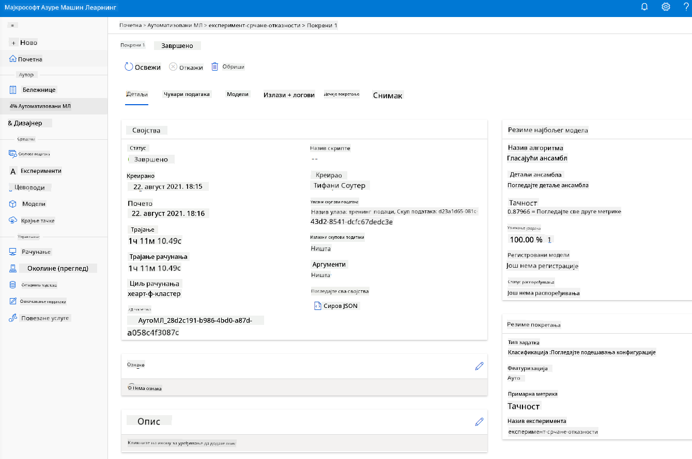

Овде можете видети детаљан опис најбољег модела који је AutoML генерисао. Такође можете истражити друге моделе генерисане у картици Models. Одвојите неколико минута да истражите моделе у картици Explanations (preview). Када изаберете модел који желите да користите (овде ћемо изабрати најбољи модел који је изабрао AutoML), видећемо како можемо да га применимо.

## 3. Примена модела са мало или без кода и коришћење ендпоинта
### 3.1 Примена модела

Интерфејс за аутоматизовано машинско учење омогућава вам да примените најбољи модел као веб услугу у неколико корака. Примена је интеграција модела тако да може доносити предвиђања на основу нових података и идентификовати потенцијалне области за унапређење. За овај пројекат, примена у веб услугу значи да ће медицинске апликације моћи да користе модел за прављење предвиђања у реалном времену о ризику пацијената од срчаног удара.

У опису најбољег модела, кликните на дугме "Deploy".
    
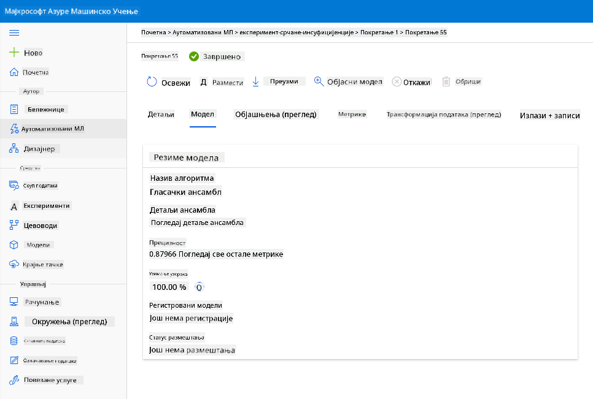

15. Дајте му име, опис, тип рачунара (Azure Container Instance), омогућите аутентификацију и кликните на Deploy. Овај корак може трајати око 20 минута. Процес примене обухвата неколико корака, укључујући регистрацију модела, генерисање ресурса и њихову конфигурацију за веб услугу. Порука о статусу се појављује под Deploy статусом. Периодично изаберите Refresh да бисте проверили статус примене. Примена је завршена и ради када је статус "Healthy".

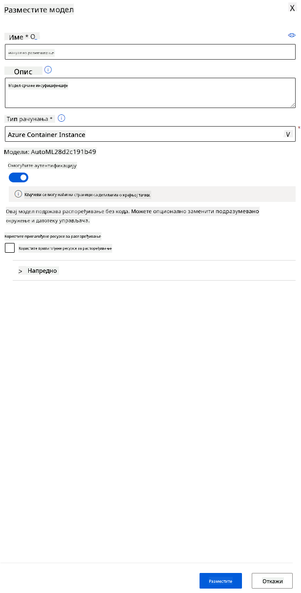

16. Када је примена завршена, кликните на картицу Endpoint и кликните на ендпоинт који сте управо применили. Овде можете пронаћи све детаље које треба да знате о ендпоинту.

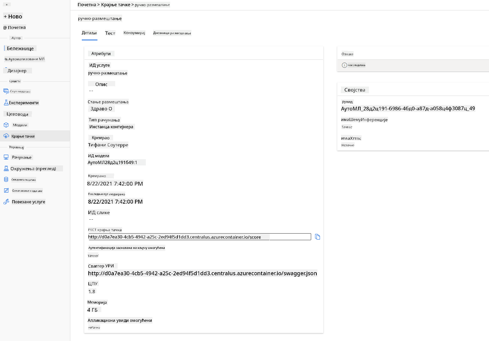

Невероватно! Сада када имамо модел примењен, можемо започети коришћење ендпоинта.

### 3.2 Коришћење ендпоинта

Кликните на картицу "Consume". Овде можете пронаћи REST ендпоинт и Python скрипту у опцији за коришћење. Одвојите време да прочитате Python код.

Ова скрипта се може директно покренути са вашег локалног рачунара и користиће ваш ендпоинт.

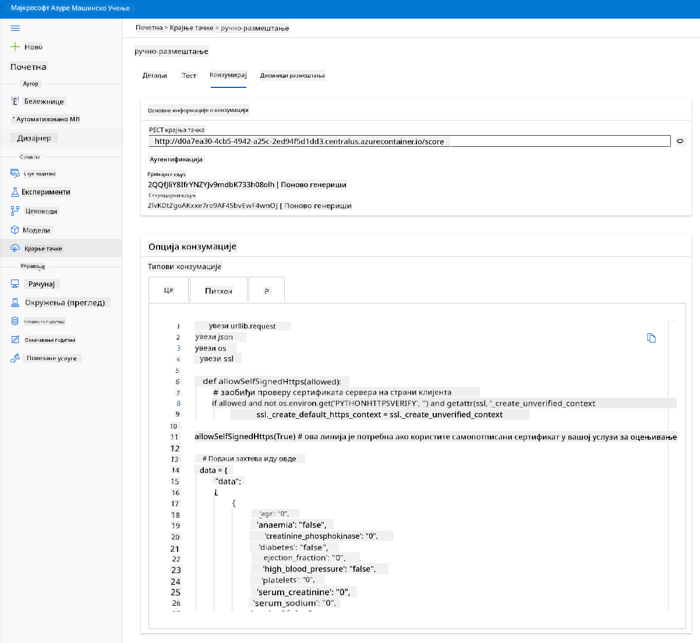

Одвојите тренутак да проверите ове две линије кода:

```python
url = 'http://98e3715f-xxxx-xxxx-xxxx-9ec22d57b796.centralus.azurecontainer.io/score'
api_key = '' # Replace this with the API key for the web service
```
Променљива `url` је REST ендпоинт који се налази у картици за коришћење, а променљива `api_key` је примарни кључ који се такође налази у картици за коришћење (само у случају да сте омогућили аутентификацију). Овако скрипта може користити ендпоинт.

18. Покретањем скрипте, требало би да видите следећи излаз:
    ```python
    b'"{\\"result\\": [true]}"'
    ```
Ово значи да је предвиђање срчане инсуфицијенције за дате податке тачно. Ово има смисла јер ако пажљивије погледате податке аутоматски генерисане у скрипти, све је подразумевано постављено на 0 и false. Можете променити податке са следећим узорком уноса:

```python
data = {
    "data":
    [
        {
            'age': "0",
            'anaemia': "false",
            'creatinine_phosphokinase': "0",
            'diabetes': "false",
            'ejection_fraction': "0",
            'high_blood_pressure': "false",
            'platelets': "0",
            'serum_creatinine': "0",
            'serum_sodium': "0",
            'sex': "false",
            'smoking': "false",
            'time': "0",
        },
        {
            'age': "60",
            'anaemia': "false",
            'creatinine_phosphokinase': "500",
            'diabetes': "false",
            'ejection_fraction': "38",
            'high_blood_pressure': "false",
            'platelets': "260000",
            'serum_creatinine': "1.40",
            'serum_sodium': "137",
            'sex': "false",
            'smoking': "false",
            'time': "130",
        },
    ],
}
```
Скрипта би требало да врати:
    ```python
    b'"{\\"result\\": [true, false]}"'
    ```

Честитамо! Управо сте користили модел који је примењен и обучен у Azure ML!

> **_НАПОМЕНА:_** Када завршите са пројектом, не заборавите да обришете све ресурсе.
## 🚀 Изазов

Пажљиво погледајте објашњења модела и детаље које је AutoML генерисао за најбоље моделе. Покушајте да разумете зашто је најбољи модел бољи од осталих. Који алгоритми су упоређивани? Које су разлике међу њима? Зашто је најбољи модел у овом случају бољи?

## [Квиз након предавања](https://purple-hill-04aebfb03.1.azurestaticapps.net/quiz/35)

## Преглед и самостално учење

У овој лекцији сте научили како да обучите, примените и користите модел за предвиђање ризика од срчане инсуфицијенције на облаку са мало или без кода. Ако то већ нисте урадили, дубље истражите објашњења модела која је AutoML генерисао за најбоље моделе и покушајте да разумете зашто је најбољи модел бољи од осталих.

Можете даље истраживати AutoML са мало или без кода читајући ову [документацију](https://docs.microsoft.com/azure/machine-learning/tutorial-first-experiment-automated-ml?WT.mc_id=academic-77958-bethanycheum&ocid=AID3041109).

## Задатак

[Пројекат из Data Science-а са мало или без кода на Azure ML](assignment.md)

---

**Одрицање од одговорности**:  
Овај документ је преведен коришћењем услуге за превођење помоћу вештачке интелигенције [Co-op Translator](https://github.com/Azure/co-op-translator). Иако се трудимо да обезбедимо тачност, молимо вас да имате у виду да аутоматски преводи могу садржати грешке или нетачности. Оригинални документ на његовом изворном језику треба сматрати меродавним извором. За критичне информације препоручује се професионални превод од стране људи. Не преузимамо одговорност за било каква погрешна тумачења или неспоразуме који могу настати услед коришћења овог превода.