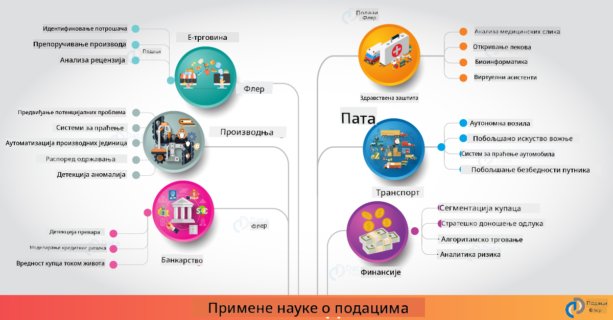

<!--
CO_OP_TRANSLATOR_METADATA:
{
  "original_hash": "67076ed50f54e7d26ba1ba378d6078f1",
  "translation_date": "2025-08-30T19:51:44+00:00",
  "source_file": "6-Data-Science-In-Wild/20-Real-World-Examples/README.md",
  "language_code": "sr"
}
-->
# Наука о подацима у стварном свету

|  ](../../sketchnotes/20-DataScience-RealWorld.png) |
| :--------------------------------------------------------------------------------------------------------------: |
|               Наука о подацима у стварном свету - _Скетч од [@nitya](https://twitter.com/nitya)_               |

Стигли смо скоро до краја овог путовања учења!

Почели смо са дефиницијама науке о подацима и етике, истраживали различите алате и технике за анализу и визуализацију података, прегледали животни циклус науке о подацима и разматрали скалирање и аутоматизацију радних токова науке о подацима уз помоћ услуга облачног рачунарства. Дакле, вероватно се питате: _"Како тачно да применим све ово знање у стварним контекстима?"_

У овој лекцији, истражићемо примену науке о подацима у стварном свету кроз различите индустрије и дубље се упустити у конкретне примере из области истраживања, дигиталних хуманистичких наука и одрживости. Погледаћемо могућности студентских пројеката и закључити са корисним ресурсима који ће вам помоћи да наставите своје путовање учења!

## Квиз пре предавања

[Квиз пре предавања](https://purple-hill-04aebfb03.1.azurestaticapps.net/quiz/38)

## Наука о подацима + Индустрија

Захваљујући демократизацији вештачке интелигенције, програмери сада лакше дизајнирају и интегришу одлуке засноване на вештачкој интелигенцији и увиде засноване на подацима у корисничка искуства и радне токове развоја. Ево неколико примера како се наука о подацима "примењује" у стварним апликацијама у индустрији:

 * [Google Flu Trends](https://www.wired.com/2015/10/can-learn-epic-failure-google-flu-trends/) је користио науку о подацима за корелацију термина претраге са трендовима грипа. Иако је приступ имао недостатке, подигао је свест о могућностима (и изазовима) предвиђања у здравству заснованог на подацима.

 * [UPS Routing Predictions](https://www.technologyreview.com/2018/11/21/139000/how-ups-uses-ai-to-outsmart-bad-weather/) - објашњава како UPS користи науку о подацима и машинско учење за предвиђање оптималних рута за испоруку, узимајући у обзир временске услове, саобраћајне обрасце, рокове испоруке и више.

 * [NYC Taxicab Route Visualization](http://chriswhong.github.io/nyctaxi/) - подаци прикупљени коришћењем [Закона о слободи информација](https://chriswhong.com/open-data/foil_nyc_taxi/) помогли су у визуализацији једног дана у животу таксија у Њујорку, помажући нам да разумемо како се крећу кроз град, колико зарађују и трајање путовања током 24-часовног периода.

 * [Uber Data Science Workbench](https://eng.uber.com/dsw/) - користи податке (о локацијама преузимања и остављања, трајању путовања, преферираним рутама итд.) прикупљене из милиона Uber путовања *дневно* за изградњу алата за анализу података који помаже у одређивању цена, безбедности, откривању превара и навигационим одлукама.

 * [Sports Analytics](https://towardsdatascience.com/scope-of-analytics-in-sports-world-37ed09c39860) - фокусира се на _предиктивну аналитику_ (анализа тимова и играча - као у [Moneyball](https://datasciencedegree.wisconsin.edu/blog/moneyball-proves-importance-big-data-big-ideas/) - и управљање навијачима) и _визуализацију података_ (дашборди тимова и навијача, игре итд.) са апликацијама као што су скаутинг талената, спортско клађење и управљање инвентаром/местом одржавања.

 * [Наука о подацима у банкарству](https://data-flair.training/blogs/data-science-in-banking/) - истиче вредност науке о подацима у финансијској индустрији са апликацијама које се крећу од моделирања ризика и откривања превара, до сегментације клијената, предвиђања у реалном времену и система препорука. Предиктивна аналитика такође покреће критичне мере као што су [кредитни рејтинзи](https://dzone.com/articles/using-big-data-and-predictive-analytics-for-credit).

 * [Наука о подацима у здравству](https://data-flair.training/blogs/data-science-in-healthcare/) - истиче апликације као што су медицинска сликања (нпр. MRI, X-Ray, CT-Scan), геномика (секвенцирање ДНК), развој лекова (процена ризика, предвиђање успеха), предиктивна аналитика (нега пацијената и логистика снабдевања), праћење и превенција болести итд.

 Извор слике: [Data Flair: 6 Amazing Data Science Applications ](https://data-flair.training/blogs/data-science-applications/)

Слика приказује друге области и примере примене техника науке о подацима. Желите да истражите друге апликације? Погледајте [Преглед и самостално учење](../../../../6-Data-Science-In-Wild/20-Real-World-Examples) секцију испод.

## Наука о подацима + Истраживање

|  ](../../sketchnotes/20-DataScience-Research.png) |
| :---------------------------------------------------------------------------------------------------------------: |
|              Наука о подацима и истраживање - _Скетч од [@nitya](https://twitter.com/nitya)_              |

Док се апликације у стварном свету често фокусирају на индустријске случајеве употребе у великом обиму, _истраживачке_ апликације и пројекти могу бити корисни из две перспективе:

* _могућности иновација_ - истраживање брзог прототиписања напредних концепата и тестирање корисничких искустава за апликације следеће генерације.
* _изазови у имплементацији_ - истраживање потенцијалних штета или нежељених последица технологија науке о подацима у стварним контекстима.

За студенте, ови истраживачки пројекти могу пружити и могућности учења и сарадње које могу побољшати ваше разумевање теме и проширити вашу свест и ангажовање са релевантним људима или тимовима који раде у областима интересовања. Како изгледају истраживачки пројекти и како могу направити утицај?

Погледајмо један пример - [MIT Gender Shades Study](http://gendershades.org/overview.html) од Joy Buolamwini (MIT Media Labs) са [истраживачким радом](http://proceedings.mlr.press/v81/buolamwini18a/buolamwini18a.pdf) који је коауторисала са Timnit Gebru (тада у Microsoft Research) који се фокусирао на:

 * **Шта:** Циљ истраживачког пројекта био је _процена пристрасности присутне у алгоритмима и скуповима података за аутоматску анализу лица_ на основу пола и типа коже.
 * **Зашто:** Анализа лица се користи у областима као што су спровођење закона, безбедност на аеродромима, системи за запошљавање и више - контексти где нетачне класификације (нпр. због пристрасности) могу изазвати потенцијалне економске и социјалне штете за погођене појединце или групе. Разумевање (и елиминисање или ублажавање) пристрасности је кључно за правичност у употреби.
 * **Како:** Истраживачи су препознали да постојећи бенчмаркови углавном користе субјекте светлије коже и креирали нови скуп података (1000+ слика) који је _више избалансиран_ по полу и типу коже. Скуп података је коришћен за процену тачности три производа за класификацију пола (од Microsoft, IBM и Face++).

Резултати су показали да, иако је укупна тачност класификације била добра, постојала је приметна разлика у стопама грешака између различитих подгрупа - са **погрешним одређивањем пола** које је било веће за жене или особе тамније коже, што указује на пристрасност.

**Кључни резултати:** Подигнута је свест да наука о подацима захтева више _репрезентативних скупова података_ (избалансиране подгрупе) и више _инклузивних тимова_ (разноврсна позадина) како би се препознале и елиминисале или ублажиле такве пристрасности раније у AI решењима. Истраживачки напори попут овог су такође инструментални у многим организацијама које дефинишу принципе и праксе за _одговорну AI_ како би побољшале правичност у својим AI производима и процесима.

**Желите да сазнате више о релевантним истраживачким напорима у Microsoft-у?**

* Погледајте [Microsoft Research Projects](https://www.microsoft.com/research/research-area/artificial-intelligence/?facet%5Btax%5D%5Bmsr-research-area%5D%5B%5D=13556&facet%5Btax%5D%5Bmsr-content-type%5D%5B%5D=msr-project) о вештачкој интелигенцији.
* Истражите студентске пројекте из [Microsoft Research Data Science Summer School](https://www.microsoft.com/en-us/research/academic-program/data-science-summer-school/).
* Погледајте [Fairlearn](https://fairlearn.org/) пројекат и иницијативе [Одговорна AI](https://www.microsoft.com/en-us/ai/responsible-ai?activetab=pivot1%3aprimaryr6).

## Наука о подацима + Хуманистичке науке

|  ](../../sketchnotes/20-DataScience-Humanities.png) |
| :---------------------------------------------------------------------------------------------------------------: |
|              Наука о подацима и дигиталне хуманистичке науке - _Скетч од [@nitya](https://twitter.com/nitya)_              |

Дигиталне хуманистичке науке [су дефинисане](https://digitalhumanities.stanford.edu/about-dh-stanford) као "збирка пракси и приступа који комбинују рачунарске методе са хуманистичким истраживањем". [Пројекти на Stanford-у](https://digitalhumanities.stanford.edu/projects) као што су _"реинтерпретација историје"_ и _"поетско размишљање"_ илуструју везу између [Дигиталних хуманистичких наука и науке о подацима](https://digitalhumanities.stanford.edu/digital-humanities-and-data-science) - наглашавајући технике као што су анализа мрежа, визуализација информација, просторна и текстуална анализа које нам могу помоћи да поново размотримо историјске и књижевне скупове података како бисмо извели нове увиде и перспективе.

*Желите да истражите и проширите пројекат у овој области?*

Погледајте ["Emily Dickinson and the Meter of Mood"](https://gist.github.com/jlooper/ce4d102efd057137bc000db796bfd671) - одличан пример од [Jen Looper](https://twitter.com/jenlooper) који поставља питање како можемо користити науку о подацима да поново размотримо познату поезију и преиспитамо њено значење и доприносе њеног аутора у новим контекстима. На пример, _можемо ли предвидети годишње доба у којем је песма написана анализом њеног тона или сентимента_ - и шта нам то говори о стању ума аутора током релевантног периода?

Да бисмо одговорили на то питање, следимо кораке животног циклуса науке о подацима:
 * [`Прикупљање података`](https://gist.github.com/jlooper/ce4d102efd057137bc000db796bfd671#acquiring-the-dataset) - за прикупљање релевантног скупа података за анализу. Опције укључују коришћење API-а (нпр. [Poetry DB API](https://poetrydb.org/index.html)) или скрапање веб страница (нпр. [Project Gutenberg](https://www.gutenberg.org/files/12242/12242-h/12242-h.htm)) коришћењем алата као што је [Scrapy](https://scrapy.org/).
 * [`Чишћење података`](https://gist.github.com/jlooper/ce4d102efd057137bc000db796bfd671#clean-the-data) - објашњава како текст може бити форматиран, очишћен и поједностављен коришћењем основних алата као што су Visual Studio Code и Microsoft Excel.
 * [`Анализа података`](https://gist.github.com/jlooper/ce4d102efd057137bc000db796bfd671#working-with-the-data-in-a-notebook) - објашњава како можемо сада увозити скуп података у "Бележнице" за анализу коришћењем Python пакета (као што су pandas, numpy и matplotlib) за организовање и визуализацију података.
 * [`Анализа сентимента`](https://gist.github.com/jlooper/ce4d102efd057137bc000db796bfd671#sentiment-analysis-using-cognitive-services) - објашњава како можемо интегрисати облачне услуге као што је Text Analytics, користећи алате са мало кода као што је [Power Automate](https://flow.microsoft.com/en-us/) за аутоматизоване радне токове обраде података.

Коришћењем овог радног тока, можемо истражити сезонске утицаје на сентимент песама и помоћи нам да формирамо сопствене перспективе о аутору. Испробајте сами - затим проширите бележницу да поставите друга питања или визуализујете податке на нове начине!

> Можете користити неке од алата из [Digital Humanities toolkit](https://github.com/Digital-Humanities-Toolkit) за истраживање ових области.

## Наука о подацима + Одрживост

|  ](../../sketchnotes/20-DataScience-Sustainability.png) |
| :---------------------------------------------------------------------------------------------------------------: |
|              Наука о подацима и одрживост - _Скетч од [@nitya](https://twitter.com/nitya)_              |

[Агенда за одрживи развој до 2030. године](https://sdgs.un.org/2030agenda) - коју су усвојиле све чланице Уједињених нација 2015. године - идентификује 17 циљева, укључујући оне који се фокусирају на **заштиту планете** од деградације и утицаја климатских промена. [Microsoft Sustainability](https://www.microsoft.com/en-us/sustainability) иницијатива подржава ове циљеве истражујући начине на које технолошка решења могу подржати и изградити одрживију будућ
**Пројекат Планетарни Рачунар је тренутно у прегледу (од септембра 2021)** - ево како можете започети допринос решењима за одрживост користећи науку о подацима.

* [Затражите приступ](https://planetarycomputer.microsoft.com/account/request) да бисте започели истраживање и повезали се са колегама.
* [Истражите документацију](https://planetarycomputer.microsoft.com/docs/overview/about) да бисте разумели подржане скупове података и API-је.
* Истражите апликације као што је [Праћење екосистема](https://analytics-lab.org/ecosystemmonitoring/) за инспирацију за идеје о апликацијама.

Размислите о томе како можете користити визуализацију података да бисте открили или нагласили релевантне увиде у областима као што су климатске промене и крчење шума. Или размислите о томе како се увиди могу користити за креирање нових корисничких искустава која мотивишу промене у понашању за одрживији начин живота.

## Наука о подацима + Студенти

Говорили смо о применама у стварном свету у индустрији и истраживању, и истраживали примере примене науке о подацима у дигиталним хуманистичким наукама и одрживости. Па како можете изградити своје вештине и поделити своју стручност као почетници у науци о подацима?

Ево неколико примера студентских пројеката из науке о подацима који могу да вас инспиришу.

* [MSR Летња школа науке о подацима](https://www.microsoft.com/en-us/research/academic-program/data-science-summer-school/#!projects) са GitHub [пројектима](https://github.com/msr-ds3) који истражују теме као што су:
   - [Расна пристрасност у употреби силе од стране полиције](https://www.microsoft.com/en-us/research/video/data-science-summer-school-2019-replicating-an-empirical-analysis-of-racial-differences-in-police-use-of-force/) | [Github](https://github.com/msr-ds3/stop-question-frisk)
   - [Поузданост система метроа у Њујорку](https://www.microsoft.com/en-us/research/video/data-science-summer-school-2018-exploring-the-reliability-of-the-nyc-subway-system/) | [Github](https://github.com/msr-ds3/nyctransit)
* [Дигитализација материјалне културе: Истраживање социо-економских дистрибуција у Сиркапу](https://claremont.maps.arcgis.com/apps/Cascade/index.html?appid=bdf2aef0f45a4674ba41cd373fa23afc) - од [Орнела Алтуњан](https://twitter.com/ornelladotcom) и тима из Клермонта, користећи [ArcGIS StoryMaps](https://storymaps.arcgis.com/).

## 🚀 Изазов

Претражите чланке који препоручују пројекте из науке о подацима који су погодни за почетнике - као што су [ових 50 области](https://www.upgrad.com/blog/data-science-project-ideas-topics-beginners/) или [ових 21 идеја за пројекте](https://www.intellspot.com/data-science-project-ideas) или [ових 16 пројеката са изворним кодом](https://data-flair.training/blogs/data-science-project-ideas/) које можете анализирати и прерадити. И не заборавите да пишете блогове о својим искуствима учења и делите своје увиде са свима нама.

## Квиз након предавања

[Квиз након предавања](https://purple-hill-04aebfb03.1.azurestaticapps.net/quiz/39)

## Преглед и самостално учење

Желите да истражите више примера употребе? Ево неколико релевантних чланака:
* [17 Примена и примера науке о подацима](https://builtin.com/data-science/data-science-applications-examples) - јул 2021
* [11 Задивљујућих примена науке о подацима у стварном свету](https://myblindbird.com/data-science-applications-real-world/) - мај 2021
* [Наука о подацима у стварном свету](https://towardsdatascience.com/data-science-in-the-real-world/home) - Збирка чланака
* Наука о подацима у: [образовању](https://data-flair.training/blogs/data-science-in-education/), [пољопривреди](https://data-flair.training/blogs/data-science-in-agriculture/), [финансијама](https://data-flair.training/blogs/data-science-in-finance/), [филмовима](https://data-flair.training/blogs/data-science-at-movies/) и још много тога.

## Задатак

[Истражите скуп података Планетарног Рачунара](assignment.md)

---

**Одрицање од одговорности**:  
Овај документ је преведен коришћењем услуге за превођење помоћу вештачке интелигенције [Co-op Translator](https://github.com/Azure/co-op-translator). Иако се трудимо да обезбедимо тачност, имајте у виду да аутоматски преводи могу садржати грешке или нетачности. Оригинални документ на изворном језику треба сматрати ауторитативним извором. За критичне информације препоручује се професионални превод од стране људи. Не сносимо одговорност за било каква погрешна тумачења или неспоразуме који могу произаћи из коришћења овог превода.