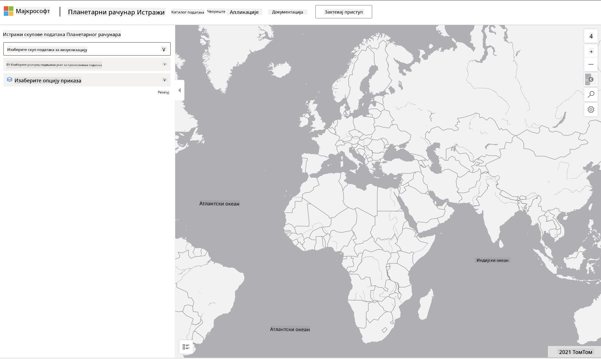

<!--
CO_OP_TRANSLATOR_METADATA:
{
  "original_hash": "d1e05715f9d97de6c4f1fb0c5a4702c0",
  "translation_date": "2025-08-30T19:56:30+00:00",
  "source_file": "6-Data-Science-In-Wild/20-Real-World-Examples/assignment.md",
  "language_code": "sr"
}
-->
# Истражите скуп података Planetary Computer

## Упутства

У овој лекцији, говорили смо о различитим доменима примене науке о подацима - са детаљним примерима који се односе на истраживање, одрживост и дигиталну хуманистику. У овом задатку, истражићете један од ових примера детаљније и применити неке од ваших знања о визуализацији и анализи података како бисте извели увиде о подацима који се односе на одрживост.

Пројекат [Planetary Computer](https://planetarycomputer.microsoft.com/) има скупове података и API-је који се могу приступити уз налог - затражите налог ако желите да испробате бонус корак задатка. Сајт такође пружа функцију [Explorer](https://planetarycomputer.microsoft.com/explore) коју можете користити без креирања налога.

`Кораци:`
Интерфејс Explorer (приказан на снимку екрана испод) омогућава вам да изаберете скуп података (из понуђених опција), унапред дефинисан упит (за филтрирање података) и опцију приказа (за креирање релевантне визуализације). У овом задатку, ваш задатак је:

 1. Прочитајте [Explorer документацију](https://planetarycomputer.microsoft.com/docs/overview/explorer/) - разумите опције.
 2. Истражите [Каталог](https://planetarycomputer.microsoft.com/catalog) скупа података - упознајте се са сврхом сваког скупа.
 3. Користите Explorer - изаберите скуп података који вас интересује, изаберите релевантан упит и опцију приказа.

`Ваш задатак:`
Сада проучите визуализацију која је приказана у прегледачу и одговорите на следеће:
 * Које _карактеристике_ има скуп података?
 * Које _увиде_ или резултате пружа визуализација?
 * Које су _импликације_ тих увида на циљеве одрживости пројекта?
 * Која су _ограничења_ визуализације (тј. који увид нисте добили)?
 * Ако бисте могли да добијете сирове податке, које _алтернативне визуализације_ бисте креирали и зашто?

`Бонус поени:`
Пријавите се за налог - и пријавите се када будете прихваћени.
 * Користите опцију _Launch Hub_ да отворите сирове податке у Notebook-у.
 * Истражите податке интерактивно и имплементирајте алтернативне визуализације које сте замислили.
 * Сада анализирајте ваше прилагођене визуализације - да ли сте успели да изведете увиде које раније нисте могли?

## Рубрика

Изузетно | Прихватљиво | Потребно побољшање
--- | --- | -- |
Одговорено је на свих пет основних питања. Студент је јасно идентификовао како тренутне и алтернативне визуализације могу пружити увиде у циљеве или исходе одрживости. | Студент је одговорио на најмање прва три питања у великом детаљу, показујући да има практично искуство са Explorer-ом. | Студент није одговорио на више питања или је пружио недовољно детаљне одговоре - што указује на то да није направљен значајан покушај за пројекат. |

---

**Одрицање од одговорности**:  
Овај документ је преведен коришћењем услуге за превођење помоћу вештачке интелигенције [Co-op Translator](https://github.com/Azure/co-op-translator). Иако се трудимо да обезбедимо тачност, молимо вас да имате у виду да аутоматски преводи могу садржати грешке или нетачности. Оригинални документ на његовом изворном језику треба сматрати ауторитативним извором. За критичне информације препоручује се професионални превод од стране људи. Не сносимо одговорност за било каква погрешна тумачења или неспоразуме који могу произаћи из коришћења овог превода.