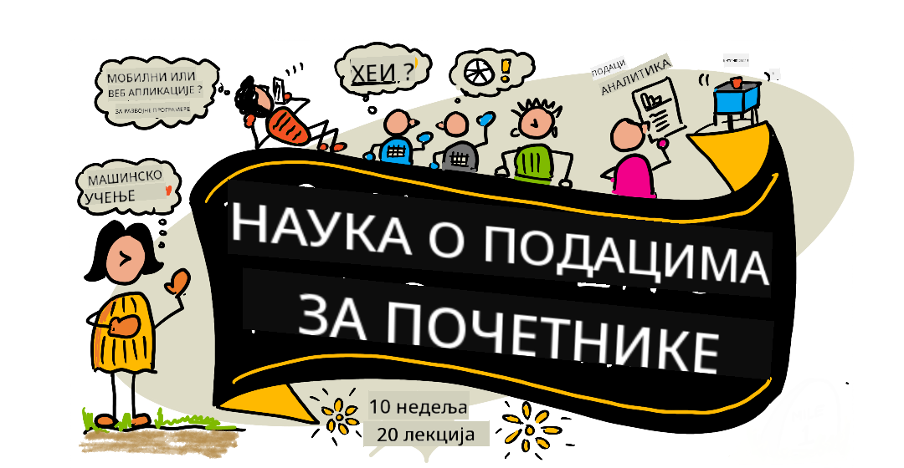

<!--
CO_OP_TRANSLATOR_METADATA:
{
  "original_hash": "dd9a1deb4da680b2cf11ba2e9f5a0a6e",
  "translation_date": "2025-09-29T22:10:38+00:00",
  "source_file": "README.md",
  "language_code": "sr"
}
-->
# Наука о подацима за почетнике - Наставни план

Azure Cloud Advocates у Microsoft-у са задовољством представљају наставни план од 10 недеља и 20 лекција о науци о подацима. Свака лекција укључује квизове пре и после лекције, писана упутства за завршетак лекције, решење и задатак. Наш приступ заснован на пројектима омогућава вам да учите кроз изградњу, што је доказан начин да нове вештине остану трајне.

**Срдачна захвалност нашим ауторима:** [Jasmine Greenaway](https://www.twitter.com/paladique), [Dmitry Soshnikov](http://soshnikov.com), [Nitya Narasimhan](https://twitter.com/nitya), [Jalen McGee](https://twitter.com/JalenMcG), [Jen Looper](https://twitter.com/jenlooper), [Maud Levy](https://twitter.com/maudstweets), [Tiffany Souterre](https://twitter.com/TiffanySouterre), [Christopher Harrison](https://www.twitter.com/geektrainer).

**🙏 Посебна захвалност 🙏 нашим [Microsoft Student Ambassador](https://studentambassadors.microsoft.com/) ауторима, рецензентима и сарадницима садржаја,** посебно Aaryan Arora, [Aditya Garg](https://github.com/AdityaGarg00), [Alondra Sanchez](https://www.linkedin.com/in/alondra-sanchez-molina/), [Ankita Singh](https://www.linkedin.com/in/ankitasingh007), [Anupam Mishra](https://www.linkedin.com/in/anupam--mishra/), [Arpita Das](https://www.linkedin.com/in/arpitadas01/), ChhailBihari Dubey, [Dibri Nsofor](https://www.linkedin.com/in/dibrinsofor), [Dishita Bhasin](https://www.linkedin.com/in/dishita-bhasin-7065281bb), [Majd Safi](https://www.linkedin.com/in/majd-s/), [Max Blum](https://www.linkedin.com/in/max-blum-6036a1186/), [Miguel Correa](https://www.linkedin.com/in/miguelmque/), [Mohamma Iftekher (Iftu) Ebne Jalal](https://twitter.com/iftu119), [Nawrin Tabassum](https://www.linkedin.com/in/nawrin-tabassum), [Raymond Wangsa Putra](https://www.linkedin.com/in/raymond-wp/), [Rohit Yadav](https://www.linkedin.com/in/rty2423), Samridhi Sharma, [Sanya Sinha](https://www.linkedin.com/mwlite/in/sanya-sinha-13aab1200),
[Sheena Narula](https://www.linkedin.com/in/sheena-narua-n/), [Tauqeer Ahmad](https://www.linkedin.com/in/tauqeerahmad5201/), Yogendrasingh Pawar , [Vidushi Gupta](https://www.linkedin.com/in/vidushi-gupta07/), [Jasleen Sondhi](https://www.linkedin.com/in/jasleen-sondhi/)

||
|:---:|
| Наука о подацима за почетнике - _Илустрација од [@nitya](https://twitter.com/nitya)_ |

### 🌐 Подршка за више језика

#### Подржано преко GitHub Action (аутоматски и увек ажурирано)

[Француски](../fr/README.md) | [Шпански](../es/README.md) | [Немачки](../de/README.md) | [Руски](../ru/README.md) | [Арапски](../ar/README.md) | [Персијски (фарси)](../fa/README.md) | [Урду](../ur/README.md) | [Кинески (поједностављени)](../zh/README.md) | [Кинески (традиционални, Макао)](../mo/README.md) | [Кинески (традиционални, Хонг Конг)](../hk/README.md) | [Кинески (традиционални, Тајван)](../tw/README.md) | [Јапански](../ja/README.md) | [Корејски](../ko/README.md) | [Хинди](../hi/README.md) | [Бенгалски](../bn/README.md) | [Марати](../mr/README.md) | [Непалски](../ne/README.md) | [Пенџабски (Гурмуки)](../pa/README.md) | [Португалски (Португалија)](../pt/README.md) | [Португалски (Бразил)](../br/README.md) | [Италијански](../it/README.md) | [Пољски](../pl/README.md) | [Турски](../tr/README.md) | [Грчки](../el/README.md) | [Тајландски](../th/README.md) | [Шведски](../sv/README.md) | [Дански](../da/README.md) | [Норвешки](../no/README.md) | [Фински](../fi/README.md) | [Холандски](../nl/README.md) | [Хебрејски](../he/README.md) | [Вијетнамски](../vi/README.md) | [Индонежански](../id/README.md) | [Малајски](../ms/README.md) | [Тагалог (Филипински)](../tl/README.md) | [Свахили](../sw/README.md) | [Мађарски](../hu/README.md) | [Чешки](../cs/README.md) | [Словачки](../sk/README.md) | [Румунски](../ro/README.md) | [Бугарски](../bg/README.md) | [Српски (Ћирилица)](./README.md) | [Хрватски](../hr/README.md) | [Словеначки](../sl/README.md) | [Украјински](../uk/README.md) | [Бурмански (Мјанмар)](../my/README.md)

**Ако желите да додате још језика, подржани језици су наведени [овде](https://github.com/Azure/co-op-translator/blob/main/getting_started/supported-languages.md)**

#### Придружите се нашој заједници 

Имамо серију учења са AI на Discord-у, сазнајте више и придружите нам се на [Learn with AI Series](https://aka.ms/learnwithai/discord) од 18. до 30. септембра 2025. Добићете савете и трикове за коришћење GitHub Copilot-а за науку о подацима.

# Да ли сте студент?

Започните са следећим ресурсима:

- [Студентска страница](https://docs.microsoft.com/en-gb/learn/student-hub?WT.mc_id=academic-77958-bethanycheum) На овој страници ћете пронаћи ресурсе за почетнике, студентске пакете и чак начине да добијете бесплатан ваучер за сертификат. Ово је страница коју желите да обележите и повремено проверавате, јер садржај мењамо најмање једном месечно.
- [Microsoft Learn Student Ambassadors](https://studentambassadors.microsoft.com?WT.mc_id=academic-77958-bethanycheum) Придружите се глобалној заједници студентских амбасадора, ово би могао бити ваш пут у Microsoft.

# Почетак

> **Наставници**: укључили смо [неке предлоге](for-teachers.md) о томе како да користите овај наставни план. Волели бисмо ваше повратне информације [у нашем форуму за дискусију](https://github.com/microsoft/Data-Science-For-Beginners/discussions)!

> **[Студенти](https://aka.ms/student-page)**: да бисте користили овај наставни план самостално, форкујте цео репозиторијум и завршите вежбе самостално, почевши од квиза пре предавања. Затим прочитајте предавање и завршите остале активности. Покушајте да креирате пројекте разумевањем лекција, а не копирањем решења; међутим, тај код је доступан у /solutions фолдерима у свакој лекцији заснованој на пројекту. Друга идеја би била да формирате групу за учење са пријатељима и заједно пролазите кроз садржај. За даље учење препоручујемо [Microsoft Learn](https://docs.microsoft.com/en-us/users/jenlooper-2911/collections/qprpajyoy3x0g7?WT.mc_id=academic-77958-bethanycheum).

## Упознајте тим

**Gif од** [Mohit Jaisal](https://www.linkedin.com/in/mohitjaisal)

> 🎥 Кликните на слику изнад за видео о пројекту и људима који су га креирали!

## Педагошки приступ

Изабрали смо два педагошка принципа приликом креирања овог наставног плана: осигурање да је заснован на пројектима и да укључује честе квизове. До краја ове серије, студенти ће научити основне принципе науке о подацима, укључујући етичке концепте, припрему података, различите начине рада са подацима, визуализацију података, анализу података, примере из стварног света и још много тога.

Поред тога, квиз са ниским ризиком пре часа поставља намеру студента ка учењу теме, док други квиз након часа осигурава даље задржавање знања. Овај наставни план је дизајниран да буде флексибилан и забаван и може се узети у целини или делимично. Пројекти почињу малим и постају све сложенији до краја циклуса од 10 недеља.

> Пронађите наш [Кодекс понашања](CODE_OF_CONDUCT.md), [Упутства за допринос](CONTRIBUTING.md), [Упутства за превод](TRANSLATIONS.md). Добродошле су ваше конструктивне повратне информације!

## Свака лекција укључује:

- Опциона илустрација
- Опциони допунски видео
- Квиз за загревање пре лекције
- Писана лекција
- За лекције засноване на пројектима, водиче корак по корак како изградити пројекат
- Провере знања
- Изазов
- Допунско читање
- Задатак
- [Квиз након лекције](https://ff-quizzes.netlify.app/en/)

> **Напомена о квизовима**: Сви квизови се налазе у фолдеру Quiz-App, укупно 40 квизова са по три питања. Линкови ка њима су укључени у лекције, али апликација за квиз може се покренути локално или поставити на Azure; пратите упутства у фолдеру `quiz-app`. Постепено се локализују.

## Лекције
||
|:---:|
| Наука о подацима за почетнике: План - _Скетч од [@nitya](https://twitter.com/nitya)_ |

| Број лекције | Тема | Група лекција | Циљеви учења | Повезана лекција | Аутор |
| :-----------: | :----------------------------------------: | :--------------------------------------------------: | :-----------------------------------------------------------------------------------------------------------------------------------------------------------------------: | :---------------------------------------------------------------------: | :----: |
| 01 | Дефинисање науке о подацима | [Увод](1-Introduction/README.md) | Научите основне концепте науке о подацима и како је она повезана са вештачком интелигенцијом, машинским учењем и великим подацима. | [лекција](1-Introduction/01-defining-data-science/README.md) [видео](https://youtu.be/beZ7Mb_oz9I) | [Дмитриј](http://soshnikov.com) |
| 02 | Етика у науци о подацима | [Увод](1-Introduction/README.md) | Концепти етике података, изазови и оквири. | [лекција](1-Introduction/02-ethics/README.md) | [Нитија](https://twitter.com/nitya) |
| 03 | Дефинисање података | [Увод](1-Introduction/README.md) | Како се подаци класификују и њихови уобичајени извори. | [лекција](1-Introduction/03-defining-data/README.md) | [Јасмин](https://www.twitter.com/paladique) |
| 04 | Увод у статистику и вероватноћу | [Увод](1-Introduction/README.md) | Математичке технике вероватноће и статистике за разумевање података. | [лекција](1-Introduction/04-stats-and-probability/README.md) [видео](https://youtu.be/Z5Zy85g4Yjw) | [Дмитриј](http://soshnikov.com) |
| 05 | Рад са релационим подацима | [Рад са подацима](2-Working-With-Data/README.md) | Увод у релационе податке и основе истраживања и анализе релационих података помоћу језика SQL (изговара се „си-квел“). | [лекција](2-Working-With-Data/05-relational-databases/README.md) | [Кристофер](https://www.twitter.com/geektrainer) | | |
| 06 | Рад са NoSQL подацима | [Рад са подацима](2-Working-With-Data/README.md) | Увод у нерелационе податке, њихове различите типове и основе истраживања и анализе докумената база података. | [лекција](2-Working-With-Data/06-non-relational/README.md) | [Јасмин](https://twitter.com/paladique)|
| 07 | Рад са Python-ом | [Рад са подацима](2-Working-With-Data/README.md) | Основе коришћења Python-а за истраживање података уз библиотеке као што је Pandas. Препоручује се основно разумевање Python програмирања. | [лекција](2-Working-With-Data/07-python/README.md) [видео](https://youtu.be/dZjWOGbsN4Y) | [Дмитриј](http://soshnikov.com) |
| 08 | Припрема података | [Рад са подацима](2-Working-With-Data/README.md) | Теме о техникама за чишћење и трансформацију података ради решавања проблема са недостајућим, нетачним или непотпуним подацима. | [лекција](2-Working-With-Data/08-data-preparation/README.md) | [Јасмин](https://www.twitter.com/paladique) |
| 09 | Визуелизација количина | [Визуелизација података](3-Data-Visualization/README.md) | Научите како да користите Matplotlib за визуелизацију података о птицама 🦆 | [лекција](3-Data-Visualization/09-visualization-quantities/README.md) | [Џен](https://twitter.com/jenlooper) |
| 10 | Визуелизација расподела података | [Визуелизација података](3-Data-Visualization/README.md) | Визуелизација опажања и трендова унутар интервала. | [лекција](3-Data-Visualization/10-visualization-distributions/README.md) | [Џен](https://twitter.com/jenlooper) |
| 11 | Визуелизација пропорција | [Визуелизација података](3-Data-Visualization/README.md) | Визуелизација дискретних и груписаних процената. | [лекција](3-Data-Visualization/11-visualization-proportions/README.md) | [Џен](https://twitter.com/jenlooper) |
| 12 | Визуелизација односа | [Визуелизација података](3-Data-Visualization/README.md) | Визуелизација веза и корелација између скупова података и њихових варијабли. | [лекција](3-Data-Visualization/12-visualization-relationships/README.md) | [Џен](https://twitter.com/jenlooper) |
| 13 | Смислене визуелизације | [Визуелизација података](3-Data-Visualization/README.md) | Технике и смернице за прављење визуелизација које су вредне за ефикасно решавање проблема и добијање увида. | [лекција](3-Data-Visualization/13-meaningful-visualizations/README.md) | [Џен](https://twitter.com/jenlooper) |
| 14 | Увод у животни циклус науке о подацима | [Животни циклус](4-Data-Science-Lifecycle/README.md) | Увод у животни циклус науке о подацима и његов први корак - прикупљање и екстракција података. | [лекција](4-Data-Science-Lifecycle/14-Introduction/README.md) | [Јасмин](https://twitter.com/paladique) |
| 15 | Анализа | [Животни циклус](4-Data-Science-Lifecycle/README.md) | Ова фаза животног циклуса науке о подацима фокусира се на технике анализе података. | [лекција](4-Data-Science-Lifecycle/15-analyzing/README.md) | [Јасмин](https://twitter.com/paladique) | | |
| 16 | Комуникација | [Животни циклус](4-Data-Science-Lifecycle/README.md) | Ова фаза животног циклуса науке о подацима фокусира се на представљање увида из података на начин који олакшава разумевање доносиоцима одлука. | [лекција](4-Data-Science-Lifecycle/16-communication/README.md) | [Џејлен](https://twitter.com/JalenMcG) | | |
| 17 | Наука о подацима у облаку | [Облачни подаци](5-Data-Science-In-Cloud/README.md) | Ова серија лекција представља науку о подацима у облаку и њене предности. | [лекција](5-Data-Science-In-Cloud/17-Introduction/README.md) | [Тифани](https://twitter.com/TiffanySouterre) и [Мод](https://twitter.com/maudstweets) |
| 18 | Наука о подацима у облаку | [Облачни подаци](5-Data-Science-In-Cloud/README.md) | Тренирање модела помоћу алата са мало кода. |[лекција](5-Data-Science-In-Cloud/18-Low-Code/README.md) | [Тифани](https://twitter.com/TiffanySouterre) и [Мод](https://twitter.com/maudstweets) |
| 19 | Наука о подацима у облаку | [Облачни подаци](5-Data-Science-In-Cloud/README.md) | Деплојовање модела помоћу Azure Machine Learning Studio. | [лекција](5-Data-Science-In-Cloud/19-Azure/README.md)| [Тифани](https://twitter.com/TiffanySouterre) и [Мод](https://twitter.com/maudstweets) |
| 20 | Наука о подацима у стварном свету | [У стварном свету](6-Data-Science-In-Wild/README.md) | Пројекти вођени науком о подацима у стварном свету. | [лекција](6-Data-Science-In-Wild/20-Real-World-Examples/README.md) | [Нитија](https://twitter.com/nitya) |

## GitHub Codespaces

Пратите ове кораке да бисте отворили овај пример у Codespace-у:
1. Кликните на падајући мени Code и изаберите опцију Open with Codespaces.
2. Изаберите + New codespace на дну панела.
За више информација, погледајте [GitHub документацију](https://docs.github.com/en/codespaces/developing-in-codespaces/creating-a-codespace-for-a-repository#creating-a-codespace).

## VSCode Remote - Containers
Пратите ове кораке да бисте отворили овај репозиторијум у контејнеру користећи ваш локални рачунар и VSCode уз екстензију VS Code Remote - Containers:

1. Ако први пут користите развојни контејнер, уверите се да ваш систем испуњава предуслове (нпр. да имате инсталиран Docker) у [документацији за почетак](https://code.visualstudio.com/docs/devcontainers/containers#_getting-started).

Да бисте користили овај репозиторијум, можете га отворити у изолованом Docker волумену:

**Напомена**: У позадини, ово ће користити Remote-Containers: **Clone Repository in Container Volume...** команду за клонирање изворног кода у Docker волумен уместо локалног фајл система. [Волумени](https://docs.docker.com/storage/volumes/) су препоручени механизам за чување података контејнера.

Или отворите локално клонирану или преузету верзију репозиторијума:

- Клонирајте овај репозиторијум на ваш локални фајл систем.
- Притисните F1 и изаберите команду **Remote-Containers: Open Folder in Container...**.
- Изаберите клонирану копију овог фолдера, сачекајте да се контејнер покрене и испробајте.

## Офлајн приступ

Можете покренути ову документацију офлајн користећи [Docsify](https://docsify.js.org/#/). Форкујте овај репозиторијум, [инсталирајте Docsify](https://docsify.js.org/#/quickstart) на ваш локални рачунар, а затим у коренском фолдеру овог репозиторијума укуцајте `docsify serve`. Веб-сајт ће бити покренут на порту 3000 на вашем localhost-у: `localhost:3000`.

> Напомена, бележнице неће бити приказане преко Docsify-а, па када треба да покренете бележницу, урадите то одвојено у VS Code-у користећи Python kernel.

## Остали курикулуми

Наш тим производи и друге курикулуме! Погледајте:

- [Edge AI за почетнике](https://aka.ms/edgeai-for-beginners)
- [AI агенти за почетнике](https://aka.ms/ai-agents-beginners)
- [Генеративна AI за почетнике](https://aka.ms/genai-beginners)
- [Генеративна AI за почетнике .NET](https://github.com/microsoft/Generative-AI-for-beginners-dotnet)
- [Генеративна AI са JavaScript-ом](https://github.com/microsoft/generative-ai-with-javascript)
- [Генеративна AI са Java-ом](https://aka.ms/genaijava)
- [AI за почетнике](https://aka.ms/ai-beginners)
- [Наука о подацима за почетнике](https://aka.ms/datascience-beginners)
- [Bash за почетнике](https://github.com/microsoft/bash-for-beginners)
- [Машинско учење за почетнике](https://aka.ms/ml-beginners)
- [Сајбер безбедност за почетнике](https://github.com/microsoft/Security-101) 
- [Веб развој за почетнике](https://aka.ms/webdev-beginners)
- [IoT за почетнике](https://aka.ms/iot-beginners)
- [Машинско учење за почетнике](https://aka.ms/ml-beginners)
- [XR развој за почетнике](https://aka.ms/xr-dev-for-beginners)
- [Savladavanje GitHub Copilot-а за AI пар програмирање](https://aka.ms/GitHubCopilotAI)
- [XR развој за почетнике](https://github.com/microsoft/xr-development-for-beginners)
- [Savladavanje GitHub Copilot-а за C#/.NET програмере](https://github.com/microsoft/mastering-github-copilot-for-dotnet-csharp-developers)
- [Изаберите своју Copilot авантуру](https://github.com/microsoft/CopilotAdventures)

---

**Одрицање од одговорности**:  
Овај документ је преведен помоћу услуге за превођење уз помоћ вештачке интелигенције [Co-op Translator](https://github.com/Azure/co-op-translator). Иако се трудимо да обезбедимо тачност, молимо вас да имате у виду да аутоматски преводи могу садржати грешке или нетачности. Оригинални документ на његовом изворном језику треба сматрати меродавним извором. За критичне информације препоручује се професионални превод од стране људског преводиоца. Не преузимамо одговорност за било каква погрешна тумачења или неспоразуме који могу произаћи из коришћења овог превода.