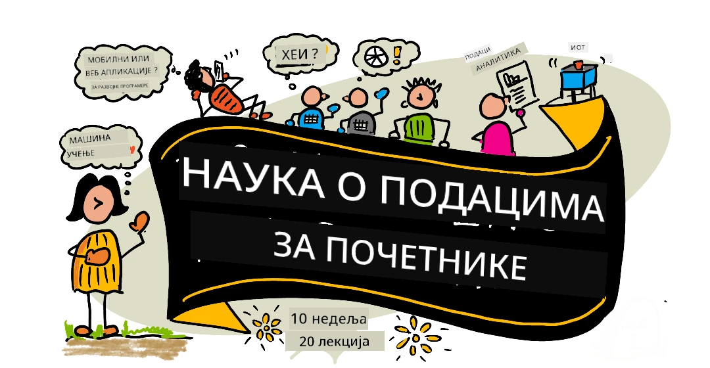
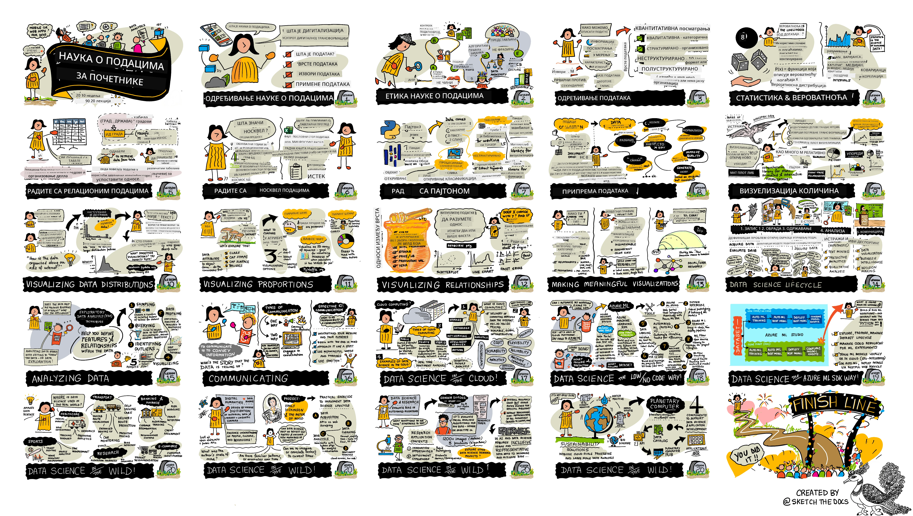

# Data Science за почетнике - Наставни план

[](https://github.com/codespaces/new?hide_repo_select=true&ref=main&repo=344191198)

[](https://github.com/microsoft/Data-Science-For-Beginners/blob/master/LICENSE)
[](https://GitHub.com/microsoft/Data-Science-For-Beginners/graphs/contributors/)
[](https://GitHub.com/microsoft/Data-Science-For-Beginners/issues/)
[](https://GitHub.com/microsoft/Data-Science-For-Beginners/pulls/)
[](http://makeapullrequest.com)

[](https://GitHub.com/microsoft/Data-Science-For-Beginners/watchers/)
[](https://GitHub.com/microsoft/Data-Science-For-Beginners/network/)
[](https://GitHub.com/microsoft/Data-Science-For-Beginners/stargazers/)


[](https://discord.gg/nTYy5BXMWG)

[](https://aka.ms/foundry/forum)

Azure Cloud Advocates у Microsoft-у са задовољством нуде наставни програм од 10 недеља, 20 лекција, све о Data Science. Сваку лекцију прати пред-лекцијски и пост-лекцијски квиз, писане инструкције за завршетак лекције, решење и задатак. Наша педагогија заснована на пројектима омогућава вам да учите док градите, што је проверен начин да нове вештине остану у сећању.

**Велики поздрав ауторима:** [Jasmine Greenaway](https://www.twitter.com/paladique), [Dmitry Soshnikov](http://soshnikov.com), [Nitya Narasimhan](https://twitter.com/nitya), [Jalen McGee](https://twitter.com/JalenMcG), [Jen Looper](https://twitter.com/jenlooper), [Maud Levy](https://twitter.com/maudstweets), [Tiffany Souterre](https://twitter.com/TiffanySouterre), [Christopher Harrison](https://www.twitter.com/geektrainer).

**🙏 Посебна захвалност 🙏 нашим ауторима, рецензентима и креаторима садржаја из [Microsoft Student Ambassador](https://studentambassadors.microsoft.com/),** међу којима су Aaryan Arora, [Aditya Garg](https://github.com/AdityaGarg00), [Alondra Sanchez](https://www.linkedin.com/in/alondra-sanchez-molina/), [Ankita Singh](https://www.linkedin.com/in/ankitasingh007), [Anupam Mishra](https://www.linkedin.com/in/anupam--mishra/), [Arpita Das](https://www.linkedin.com/in/arpitadas01/), ChhailBihari Dubey, [Dibri Nsofor](https://www.linkedin.com/in/dibrinsofor), [Dishita Bhasin](https://www.linkedin.com/in/dishita-bhasin-7065281bb), [Majd Safi](https://www.linkedin.com/in/majd-s/), [Max Blum](https://www.linkedin.com/in/max-blum-6036a1186/), [Miguel Correa](https://www.linkedin.com/in/miguelmque/), [Mohamma Iftekher (Iftu) Ebne Jalal](https://twitter.com/iftu119), [Nawrin Tabassum](https://www.linkedin.com/in/nawrin-tabassum), [Raymond Wangsa Putra](https://www.linkedin.com/in/raymond-wp/), [Rohit Yadav](https://www.linkedin.com/in/rty2423), Samridhi Sharma, [Sanya Sinha](https://www.linkedin.com/mwlite/in/sanya-sinha-13aab1200),
[Sheena Narula](https://www.linkedin.com/in/sheena-narua-n/), [Tauqeer Ahmad](https://www.linkedin.com/in/tauqeerahmad5201/), Yogendrasingh Pawar , [Vidushi Gupta](https://www.linkedin.com/in/vidushi-gupta07/), [Jasleen Sondhi](https://www.linkedin.com/in/jasleen-sondhi/)

||
|:---:|
| Data Science за почетнике - _Скетчнот [@nitya](https://twitter.com/nitya)_ |

### 🌐 Подршка за више језика

#### Подржано преко GitHub Action (аутоматски и увек ажурирано)

<!-- CO-OP TRANSLATOR LANGUAGES TABLE START -->
[Arabic](../ar/README.md) | [Bengali](../bn/README.md) | [Bulgarian](../bg/README.md) | [Burmese (Myanmar)](../my/README.md) | [Chinese (Simplified)](../zh-CN/README.md) | [Chinese (Traditional, Hong Kong)](../zh-HK/README.md) | [Chinese (Traditional, Macau)](../zh-MO/README.md) | [Chinese (Traditional, Taiwan)](../zh-TW/README.md) | [Croatian](../hr/README.md) | [Czech](../cs/README.md) | [Danish](../da/README.md) | [Dutch](../nl/README.md) | [Estonian](../et/README.md) | [Finnish](../fi/README.md) | [French](../fr/README.md) | [German](../de/README.md) | [Greek](../el/README.md) | [Hebrew](../he/README.md) | [Hindi](../hi/README.md) | [Hungarian](../hu/README.md) | [Indonesian](../id/README.md) | [Italian](../it/README.md) | [Japanese](../ja/README.md) | [Kannada](../kn/README.md) | [Khmer](../km/README.md) | [Korean](../ko/README.md) | [Lithuanian](../lt/README.md) | [Malay](../ms/README.md) | [Malayalam](../ml/README.md) | [Marathi](../mr/README.md) | [Nepali](../ne/README.md) | [Nigerian Pidgin](../pcm/README.md) | [Norwegian](../no/README.md) | [Persian (Farsi)](../fa/README.md) | [Polish](../pl/README.md) | [Portuguese (Brazil)](../pt-BR/README.md) | [Portuguese (Portugal)](../pt-PT/README.md) | [Punjabi (Gurmukhi)](../pa/README.md) | [Romanian](../ro/README.md) | [Russian](../ru/README.md) | [Serbian (Cyrillic)](./README.md) | [Slovak](../sk/README.md) | [Slovenian](../sl/README.md) | [Spanish](../es/README.md) | [Swahili](../sw/README.md) | [Swedish](../sv/README.md) | [Tagalog (Filipino)](../tl/README.md) | [Tamil](../ta/README.md) | [Telugu](../te/README.md) | [Thai](../th/README.md) | [Turkish](../tr/README.md) | [Ukrainian](../uk/README.md) | [Urdu](../ur/README.md) | [Vietnamese](../vi/README.md)

> **Волите да клонирате локално?**
>
> Ово репозиторијум укључује преводе на преко 50 језика што значајно повећава величину преузимања. Да бисте клонирали без превода, користите sparse checkout:
>
> **Bash / macOS / Linux:**
> ```bash
> git clone --filter=blob:none --sparse https://github.com/microsoft/Data-Science-For-Beginners.git
> cd Data-Science-For-Beginners
> git sparse-checkout set --no-cone '/*' '!translations' '!translated_images'
> ```
>
> **CMD (Windows):**
> ```cmd
> git clone --filter=blob:none --sparse https://github.com/microsoft/Data-Science-For-Beginners.git
> cd Data-Science-For-Beginners
> git sparse-checkout set --no-cone "/*" "!translations" "!translated_images"
> ```
>
> Ово вам даје све што вам је потребно да завршите курс бржим преузимањем.
<!-- CO-OP TRANSLATOR LANGUAGES TABLE END -->

**Ако желите да додате подршку за још језика, листа подржаних се налази [овде](https://github.com/Azure/co-op-translator/blob/main/getting_started/supported-languages.md)**

#### Придружите се нашој заједници 
[](https://discord.gg/nTYy5BXMWG)

Имамо активно серију Learn with AI на Discord-у, сазнајте више и придружите нам се на [Learn with AI Series](https://aka.ms/learnwithai/discord) од 18. до 30. септембра 2025. године. Добићете савете и трикове за коришћење GitHub Copilot-a за Data Science.


# Да ли сте студент?

Почните са следећим ресурсима:

- [Страница Student Hub](https://docs.microsoft.com/en-gb/learn/student-hub?WT.mc_id=academic-77958-bethanycheum) На овој страници пронаћи ћете ресурсе за почетнике, студентске пакете и чак начине да добијете бесплатан сертификат ваучер. Ово је страница коју треба да означите као фаворита и повремено проверавате јер редовно мењамо садржај најмање једном месечно.
- [Microsoft Learn Student Ambassadors](https://studentambassadors.microsoft.com?WT.mc_id=academic-77958-bethanycheum) Придружите се глобалној заједници студентских амбасадора, ово може бити ваш улаз у Microsoft.

# Почетак рада

## 📚 Документација

- **[Упутство за инсталацију](INSTALLATION.md)** - Корак по корак упутства за почетнике
- **[Упутство за коришћење](USAGE.md)** - Примери и уобичајени радни токови
- **[Решавање проблема](TROUBLESHOOTING.md)** - Решења за уобичајене проблеме
- **[Упутство за допринос](CONTRIBUTING.md)** - Како допринети овом пројекту
- **[За наставнике](for-teachers.md)** - Упутства за наставу и ресурси за учионицу

## 👨‍🎓 За студенте
> **Потпуни почетници**: Нови сте у Data Science? Почните са нашим [примерама прилагођеним почетницима](examples/README.md)! Ови једноставни, добро коментарисани примери ће вам помоћи да разумете основе пре него што уђете у цео наставни план.
> **[Студенти](https://aka.ms/student-page)**: да бисте користили овај наставни план сами, направите fork целог репозиторијума и сами радите на вежбама, почевши са квизом пре предавања. Онда прочитајте предавање и завршите остале активности. Трудите се да пројекте креирате разумевањем лекција уместо копирања кода решења; међутим, тај код је доступан у /solutions фолдерима у свакој лекцији усмереној на пројекте. Још једна идеја је да формирате ученичку групу са пријатељима и заједно прођете кроз садржај. За даље учење препоручујемо [Microsoft Learn](https://docs.microsoft.com/en-us/users/jenlooper-2911/collections/qprpajyoy3x0g7?WT.mc_id=academic-77958-bethanycheum).

**Брзи почетак:**
1. Погледајте [Упутство за инсталацију](INSTALLATION.md) да подесите своје окружење
2. Прегледајте [Упутство за коришћење](USAGE.md) да научите како да радите са наставним планом
3. Почните са Лекцијом 1 и радите редом
4. Придружите се нашој [Discord заједници](https://aka.ms/ds4beginners/discord) за подршку

## 👩‍🏫 За наставнике
> **Наставници**: укључили смо [неколико предлога](for-teachers.md) о томе како користити овај наставни план. Волео би да добијемо ваше повратне информације [на нашем форуму за дискусију](https://github.com/microsoft/Data-Science-For-Beginners/discussions)!

## Упознајте тим

[](https://youtu.be/8mzavjQSMM4 "Промо видео")

**Гиф од** [Mohit Jaisal](https://www.linkedin.com/in/mohitjaisal)

> 🎥 Кликните на слику изнад за видео о пројекту и људима који су га креирали!

## Педагошки приступ

Изабрали смо два педагошка уџбеника приликом креирања овог наставног плана: обезбеђивање да буде заснован на пројектима и да укључује честе квизове. На крају ове серије, студенти ће научити основне принципе науке о подацима, укључујући етичке појмове, припрему података, различите начине рада са подацима, визуализацију података, анализу података, примере из стварног света и још много тога.

Поред тога, квиз са малим ризиком пре часа поставља сврху ученика ка учењу теме, док други квиз након часа осигурава боље усвајање знања. Овај наставни план је дизајниран да буде флексибилан и забаван и може се проћи у целости или делимично. Пројекти почињу мали и постају све сложенији до краја циклуса од 10 недеља.

> Пронађите наш [Кодекс понашања](CODE_OF_CONDUCT.md), смернице за [допринење](CONTRIBUTING.md) и [превод](TRANSLATIONS.md). Добродошле су ваше конструктивне повратне информације!

## Свака лекција укључује:

- Опциони цртеж (скетчнот)
- Опциони допунски видео
- Квиз за припрему пре лекције
- Писану лекцију
- За лекције засноване на пројектима, корак по корак водиче за креирање пројекта
- Провере знања
- Изазов
- Допунско читање
- Задатак
- [Квиз након лекције](https://ff-quizzes.netlify.app/en/)

> **Напомена о квизовима**: Сви квизови се налазе у фасцикли Quiz-App, укупно 40 квизова са по три питања сваки. Они су повезани из самих лекција, али квиз апликација може да се покреће локално или да се постави на Azure; пратите упутства у фасцикли `quiz-app`. Квизови се постепено преводе.

## 🎓 Примери прилагођени почетницима

**Нови сте у науци о подацима?** Креирали смо посебан [директоријум примера](examples/README.md) са једноставним, добро коментарисаним кодом који ће вам помоћи да почнете:

- 🌟 **Hello World** - Ваш први програм за науку о подацима
- 📂 **Учитавање података** - Научите како читати и истраживати скупове података
- 📊 **Једноставна анализа** - Израчунавање статистика и проналажење образаца
- 📈 **Основна визуализација** - Креирање графикона и дијаграма
- 🔬 **Пројекат из стварног света** - Комплетан радни процес од почетка до краја

Сваки пример укључује детаљне коментаре који објашњавају сваки корак, што је савршено за апсолутне почетнике!

👉 **[Почните са примерима](examples/README.md)** 👈

## Лекције


||
|:---:|
| Наука о подацима за почетнике: Путоказ - _Скетчнот од [@nitya](https://twitter.com/nitya)_ |


| Број лекције | Тема | Група лекција | Циљеви учења | Повезана лекција | Аутор |
| :-----------: | :----------------------------------------: | :--------------------------------------------------: | :-----------------------------------------------------------------------------------------------------------------------------------------------------------------------: | :---------------------------------------------------------------------: | :----: |
| 01 | Дефинисање науке о подацима | [Увод](1-Introduction/README.md) | Научите основне концепте иза науке о подацима и како је она повезана са вештачком интелигенцијом, машинским учењем и великим подацима. | [лекција](1-Introduction/01-defining-data-science/README.md) [видео](https://youtu.be/beZ7Mb_oz9I) | [Дмитриј](http://soshnikov.com) |
| 02 | Етика науке о подацима | [Увод](1-Introduction/README.md) | Концепти, изазови и оквири етике података. | [лекција](1-Introduction/02-ethics/README.md) | [Нитија](https://twitter.com/nitya) |
| 03 | Дефинисање података | [Увод](1-Introduction/README.md) | Како се подаци класификују и њихови уобичајени извори. | [лекција](1-Introduction/03-defining-data/README.md) | [Џасмин](https://www.twitter.com/paladique) |
| 04 | Увод у статистику и вероватноћу | [Увод](1-Introduction/README.md) | Математичке технике вероватноће и статистике за разумевање података. | [лекција](1-Introduction/04-stats-and-probability/README.md) [видео](https://youtu.be/Z5Zy85g4Yjw) | [Дмитриј](http://soshnikov.com) |
| 05 | Рад са релаторним подацима | [Рад са подацима](2-Working-With-Data/README.md) | Увод у релаторне податке и основе истраживања и анализе релаторних података помоћу Структурног језика за упите, познатог као SQL (изговара се „си-квел“). | [лекција](2-Working-With-Data/05-relational-databases/README.md) | [Кристофер](https://www.twitter.com/geektrainer) | | |
| 06 | Рад са NoSQL подацима | [Рад са подацима](2-Working-With-Data/README.md) | Увод у нерелаторне податке, њихове различите типове и основе истраживања и анализе докумената у базама података. | [лекција](2-Working-With-Data/06-non-relational/README.md) | [Џасмин](https://twitter.com/paladique)|
| 07 | Рад са Python-ом | [Рад са подацима](2-Working-With-Data/README.md) | Основе коришћења Python-а за истраживање података уз библиотеке као што је Pandas. Препоручује се основно разумевање програмирања у Python-у. | [лекција](2-Working-With-Data/07-python/README.md) [видео](https://youtu.be/dZjWOGbsN4Y) | [Дмитриј](http://soshnikov.com) |
| 08 | Припрема података | [Рад са подацима](2-Working-With-Data/README.md) | Теме о техникама за чишћење и трансформацију података како би се решили изазови непотпуних, нетачних или недостајућих података. | [лекција](2-Working-With-Data/08-data-preparation/README.md) | [Џасмин](https://www.twitter.com/paladique) |
| 09 | Визуализација количина | [Визуализација података](3-Data-Visualization/README.md) | Научите како користити Matplotlib за визуализацију података о птицама 🦆 | [лекција](3-Data-Visualization/09-visualization-quantities/README.md) | [Џен](https://twitter.com/jenlooper) |
| 10 | Визуализација расподела података | [Визуализација података](3-Data-Visualization/README.md) | Визуализација опсервација и трендова унутар интервала. | [лекција](3-Data-Visualization/10-visualization-distributions/README.md) | [Џен](https://twitter.com/jenlooper) |
| 11 | Визуализација удела | [Визуализација података](3-Data-Visualization/README.md) | Визуализација дискретних и груписаних процената. | [лекција](3-Data-Visualization/11-visualization-proportions/README.md) | [Џен](https://twitter.com/jenlooper) |
| 12 | Визуализација веза | [Визуализација података](3-Data-Visualization/README.md) | Визуализација веза и корелација између скупова података и њихових променљивих. | [лекција](3-Data-Visualization/12-visualization-relationships/README.md) | [Џен](https://twitter.com/jenlooper) |
| 13 | Смислене визуализације | [Визуализација података](3-Data-Visualization/README.md) | Технике и смернице за прављење вредних визуализација за ефикасно решавање проблема и добијање увида. | [лекција](3-Data-Visualization/13-meaningful-visualizations/README.md) | [Џен](https://twitter.com/jenlooper) |
| 14 | Увод у животни циклус науке о подацима | [Животни циклус](4-Data-Science-Lifecycle/README.md) | Увод у животни циклус науке о подацима и његов први корак, прибављање и издвајање података. | [лекција](4-Data-Science-Lifecycle/14-Introduction/README.md) | [Џасмин](https://twitter.com/paladique) |
| 15 | Анализа | [Животни циклус](4-Data-Science-Lifecycle/README.md) | Овa фаза животног циклуса науке о подацима фокусира се на технике анализе података. | [лекција](4-Data-Science-Lifecycle/15-analyzing/README.md) | [Џасмин](https://twitter.com/paladique) | | |
| 16 | Комуникација | [Животни циклус](4-Data-Science-Lifecycle/README.md) | Овај део животног циклуса науке о подацима фокусира се на представљање увида из података на начин који олакшава разумевање од стране донесилаца одлука. | [лекција](4-Data-Science-Lifecycle/16-communication/README.md) | [Џален](https://twitter.com/JalenMcG) | | |
| 17 | Наука о подацима у облаку | [Облак података](5-Data-Science-In-Cloud/README.md) | Ова серија лекција уводи науку о подацима у облаку и њене предности. | [лекција](5-Data-Science-In-Cloud/17-Introduction/README.md) | [Тифани](https://twitter.com/TiffanySouterre) и [Мод](https://twitter.com/maudstweets) |
| 18 | Наука о подацима у облаку | [Облак података](5-Data-Science-In-Cloud/README.md) | Тренирање модела коришћењем Low Code алата. |[лекција](5-Data-Science-In-Cloud/18-Low-Code/README.md) | [Тифани](https://twitter.com/TiffanySouterre) и [Мод](https://twitter.com/maudstweets) |
| 19 | Наука о подацима у облаку | [Облак података](5-Data-Science-In-Cloud/README.md) | Постављање модела у Azure Machine Learning Studio. | [лекција](5-Data-Science-In-Cloud/19-Azure/README.md)| [Тифани](https://twitter.com/TiffanySouterre) и [Мод](https://twitter.com/maudstweets) |
| 20 | Наука о подацима у пракси | [У пракси](6-Data-Science-In-Wild/README.md) | Пројекти вођени науком о подацима у стварном свету. | [лекција](6-Data-Science-In-Wild/20-Real-World-Examples/README.md) | [Нитија](https://twitter.com/nitya) |

## GitHub Codespaces

Пратите ове кораке да бисте отворили овај пример у Codespace-у:
1. Кликните на мени Code и изаберите опцију Open with Codespaces.
2. Изаберите + New codespace на дну панела.
За више информација, погледајте [GitHub документацију](https://docs.github.com/en/codespaces/developing-in-codespaces/creating-a-codespace-for-a-repository#creating-a-codespace).

## VSCode Remote - Containers
Пратите ове кораке да бисте отворили овај репо у контејнеру користећи вашу локалну машину и VSCode уз помоћ екстензије Remote - Containers:

1. Ако ово први пут користите контејнер за развој, уверите се да ваш систем испуњава предуслове (нпр. да имате инсталиран Docker) у [документацији за почетак рада](https://code.visualstudio.com/docs/devcontainers/containers#_getting-started).

За коришћење овог репозиторијума можете или отворити репо у изолованом Docker волумену:

**Напомена**: Испод хаубе, ово користи команду Remote-Containers: **Clone Repository in Container Volume...** која клонира изворни код у Docker волумен уместо на локални фајл систем. [Волумени](https://docs.docker.com/storage/volumes/) су препоручени механизам за чување података из контејнера.

Или отворите локално клониран или преузет пример овог репозиторијума:

- Клонирајте овај репозиторијум на ваш локални фајл систем.
- Притисните F1 и изаберите команду **Remote-Containers: Open Folder in Container...**.
- Изаберите клонирану копију овог фолдера, сачекајте да се контејнер покрене и испробајте ствари.

## Оффлине приступ

Ову документацију можете покренути оффлине користећи [Docsify](https://docsify.js.org/#/). Форкујте овај репо, [инсталирајте Docsify](https://docsify.js.org/#/quickstart) на вашој локалној машини, затим у основном фолдеру овог репозиторијума укуцајте `docsify serve`. Вебсајт ће бити доступан на порту 3000 на вашем localhostu: `localhost:3000`.

> Напомена, бележнице се неће приказивати преко Docsify-а, па када треба да користите бележницу, покрените је посебно у VS Code-у који користи Python kernel.

## Остали наставни планови

Наш тим производи и друге наставне планове! Погледајте:

<!-- CO-OP TRANSLATOR OTHER COURSES START -->
### LangChain
[](https://aka.ms/langchain4j-for-beginners)
[](https://aka.ms/langchainjs-for-beginners?WT.mc_id=m365-94501-dwahlin)
[](https://github.com/microsoft/langchain-for-beginners?WT.mc_id=m365-94501-dwahlin)
---

### Azure / Edge / MCP / Агенти
[](https://github.com/microsoft/AZD-for-beginners?WT.mc_id=academic-105485-koreyst)
[](https://github.com/microsoft/edgeai-for-beginners?WT.mc_id=academic-105485-koreyst)
[](https://github.com/microsoft/mcp-for-beginners?WT.mc_id=academic-105485-koreyst)
[](https://github.com/microsoft/ai-agents-for-beginners?WT.mc_id=academic-105485-koreyst)

---
 
### Сертификација генеративне вештачке интелигенције
[](https://github.com/microsoft/generative-ai-for-beginners?WT.mc_id=academic-105485-koreyst)
[-9333EA?style=for-the-badge&labelColor=E5E7EB&color=9333EA)](https://github.com/microsoft/Generative-AI-for-beginners-dotnet?WT.mc_id=academic-105485-koreyst)
[-C084FC?style=for-the-badge&labelColor=E5E7EB&color=C084FC)](https://github.com/microsoft/generative-ai-for-beginners-java?WT.mc_id=academic-105485-koreyst)
[-E879F9?style=for-the-badge&labelColor=E5E7EB&color=E879F9)](https://github.com/microsoft/generative-ai-with-javascript?WT.mc_id=academic-105485-koreyst)

---
 
### Основно учење
[](https://aka.ms/ml-beginners?WT.mc_id=academic-105485-koreyst)
[](https://aka.ms/datascience-beginners?WT.mc_id=academic-105485-koreyst)
[](https://aka.ms/ai-beginners?WT.mc_id=academic-105485-koreyst)
[](https://github.com/microsoft/Security-101?WT.mc_id=academic-96948-sayoung)
[](https://aka.ms/webdev-beginners?WT.mc_id=academic-105485-koreyst)
[](https://aka.ms/iot-beginners?WT.mc_id=academic-105485-koreyst)
[](https://github.com/microsoft/xr-development-for-beginners?WT.mc_id=academic-105485-koreyst)

---
 
### Копилот серија
[](https://aka.ms/GitHubCopilotAI?WT.mc_id=academic-105485-koreyst)
[](https://github.com/microsoft/mastering-github-copilot-for-dotnet-csharp-developers?WT.mc_id=academic-105485-koreyst)
[](https://github.com/microsoft/CopilotAdventures?WT.mc_id=academic-105485-koreyst)
<!-- CO-OP TRANSLATOR OTHER COURSES END -->

## Тражите помоћ

**Имате проблеме?** Погледајте наш [Водич за решавање проблема](TROUBLESHOOTING.md) за решења за уобичајене проблеме.

Ако сте заглавили или имате питања о изградњи AI апликација, придружите се другим учесницима и искусним програмерима у дискусијама о MCP-у. То је подржавајућа заједница у којој су питања добродошла, а знање се слободно дели.

[](https://discord.gg/nTYy5BXMWG)

Ако имате повратне информације о производу или грешке током изградње, посетите:

[](https://aka.ms/foundry/forum)

---

<!-- CO-OP TRANSLATOR DISCLAIMER START -->
**Одрицање од одговорности**:  
Овај документ је преведен коришћењем АИ преводилачке услуге [Co-op Translator](https://github.com/Azure/co-op-translator). Иако тежимо тачности, имајте у виду да аутоматски преводи могу садржати грешке или нетачности. Изворни документ на његовом оригиналном језику треба сматрати ауторитетом. За критичне информације препоручује се професионални људски превод. Нисмо одговорни за било каква неспоразума или погрешна тумачења која произлазе из употребе овог превода.
<!-- CO-OP TRANSLATOR DISCLAIMER END -->