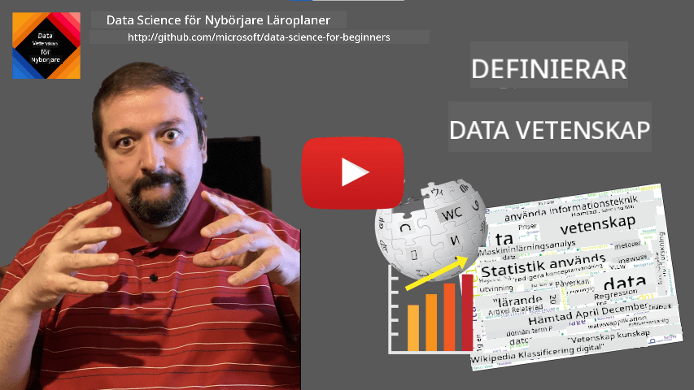
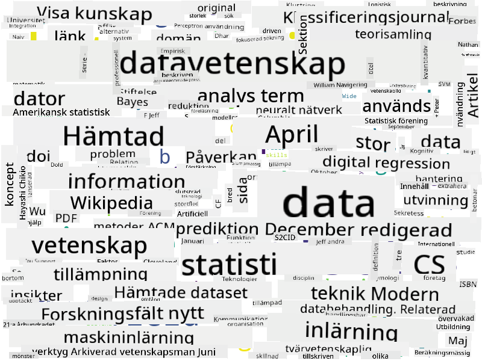

<!--
CO_OP_TRANSLATOR_METADATA:
{
  "original_hash": "43212cc1ac137b7bb1dcfb37ca06b0f4",
  "translation_date": "2025-10-25T18:54:45+00:00",
  "source_file": "1-Introduction/01-defining-data-science/README.md",
  "language_code": "sv"
}
-->
# Definition av Data Science

|  ](../../sketchnotes/01-Definitions.png) |
| :----------------------------------------------------------------------------------------------------: |
|              Definition av Data Science - _Sketchnote av [@nitya](https://twitter.com/nitya)_          |

---

## [Quiz före föreläsningen](https://ff-quizzes.netlify.app/en/ds/quiz/0)

## Vad är data?
I vår vardag är vi ständigt omgivna av data. Texten du läser just nu är data. Listan med telefonnummer till dina vänner i din smartphone är data, liksom den aktuella tiden som visas på din klocka. Som människor hanterar vi naturligt data genom att räkna pengar vi har eller skriva brev till våra vänner.

Men data blev mycket mer kritiskt med datorernas tillkomst. Datorernas primära roll är att utföra beräkningar, men de behöver data att arbeta med. Därför måste vi förstå hur datorer lagrar och bearbetar data.

Med Internets framväxt ökade datorernas roll som datahanteringsenheter. Om du tänker efter använder vi nu datorer mer och mer för databehandling och kommunikation, snarare än för faktiska beräkningar. När vi skriver ett e-postmeddelande till en vän eller söker efter information på Internet - skapar, lagrar, överför och bearbetar vi i princip data.
> Kan du komma ihåg senaste gången du använde datorer för att faktiskt beräkna något?

## Vad är Data Science?

Enligt [Wikipedia](https://en.wikipedia.org/wiki/Data_science) definieras **Data Science** som *ett vetenskapligt område som använder vetenskapliga metoder för att extrahera kunskap och insikter från strukturerad och ostrukturerad data, och tillämpa kunskap och handlingsbara insikter från data inom ett brett spektrum av tillämpningsområden*.

Denna definition lyfter fram följande viktiga aspekter av data science:

* Huvudmålet med data science är att **extrahera kunskap** från data, med andra ord - att **förstå** data, hitta dolda samband och bygga en **modell**.
* Data science använder **vetenskapliga metoder**, såsom sannolikhet och statistik. Faktum är att när termen *data science* först introducerades, hävdade vissa att data science bara var ett nytt och modernt namn för statistik. Idag är det uppenbart att området är mycket bredare.
* Den erhållna kunskapen bör tillämpas för att producera **handlingsbara insikter**, det vill säga praktiska insikter som kan tillämpas i verkliga affärssituationer.
* Vi bör kunna arbeta med både **strukturerad** och **ostrukturerad** data. Vi kommer att återkomma till att diskutera olika typer av data senare i kursen.
* **Tillämpningsområde** är ett viktigt begrepp, och data scientists behöver ofta åtminstone en viss grad av expertis inom problemområdet, till exempel: finans, medicin, marknadsföring, etc.

> En annan viktig aspekt av Data Science är att det studerar hur data kan samlas in, lagras och bearbetas med hjälp av datorer. Medan statistik ger oss matematiska grunder, tillämpar data science matematiska koncept för att faktiskt dra insikter från data.

Ett sätt (tillskrivet [Jim Gray](https://en.wikipedia.org/wiki/Jim_Gray_(computer_scientist))) att se på data science är att betrakta det som ett separat vetenskapligt paradigm:
* **Empiriskt**, där vi främst förlitar oss på observationer och experimentresultat
* **Teoretiskt**, där nya koncept uppstår från befintlig vetenskaplig kunskap
* **Beräkningsmässigt**, där vi upptäcker nya principer baserade på beräkningsmässiga experiment
* **Datadrivet**, baserat på att upptäcka samband och mönster i data  

## Andra relaterade områden

Eftersom data är allestädes närvarande är data science i sig också ett brett område som berör många andra discipliner.

<dl>
<dt>Databaser</dt>
<dd>
En viktig aspekt är <b>hur man lagrar</b> data, det vill säga hur man strukturerar den på ett sätt som möjliggör snabbare bearbetning. Det finns olika typer av databaser som lagrar strukturerad och ostrukturerad data, vilket <a href="../../2-Working-With-Data/README.md">vi kommer att behandla i vår kurs</a>.
</dd>
<dt>Big Data</dt>
<dd>
Ofta behöver vi lagra och bearbeta mycket stora mängder data med en relativt enkel struktur. Det finns speciella metoder och verktyg för att lagra den datan på ett distribuerat sätt på en datorgrupp och bearbeta den effektivt.
</dd>
<dt>Maskininlärning</dt>
<dd>
Ett sätt att förstå data är att <b>bygga en modell</b> som kan förutsäga ett önskat resultat. Att utveckla modeller från data kallas <b>maskininlärning</b>. Du kanske vill titta på vår <a href="https://aka.ms/ml-beginners">Maskininlärning för nybörjare</a> kursplan för att lära dig mer om det.
</dd>
<dt>Artificiell intelligens</dt>
<dd>
Ett område inom maskininlärning som kallas artificiell intelligens (AI) förlitar sig också på data och involverar att bygga högkomplexa modeller som efterliknar mänskliga tankeprocesser. AI-metoder gör det ofta möjligt för oss att omvandla ostrukturerad data (t.ex. naturligt språk) till strukturerade insikter. 
</dd>
<dt>Visualisering</dt>
<dd>
Stora mängder data är svåra att förstå för en människa, men när vi skapar användbara visualiseringar med den datan kan vi få bättre insikter och dra slutsatser. Därför är det viktigt att känna till många sätt att visualisera information - något som vi kommer att behandla i <a href="../../3-Data-Visualization/README.md">Avsnitt 3</a> av vår kurs. Relaterade områden inkluderar också <b>Infografik</b> och <b>Människa-datorinteraktion</b> i allmänhet. 
</dd>
</dl>

## Typer av data

Som vi redan har nämnt finns data överallt. Vi behöver bara fånga den på rätt sätt! Det är användbart att skilja mellan **strukturerad** och **ostrukturerad** data. Den förstnämnda representeras vanligtvis i någon välstrukturerad form, ofta som en tabell eller flera tabeller, medan den senare bara är en samling filer. Ibland kan vi också prata om **semistrukturerad** data, som har någon form av struktur som kan variera mycket.

| Strukturerad                                                                | Semistrukturerad                                                                              | Ostrukturerad                          |
| ---------------------------------------------------------------------------- | --------------------------------------------------------------------------------------------- | --------------------------------------- |
| Lista över personer med deras telefonnummer                                 | Wikipediasidor med länkar                                                                    | Text från Encyclopedia Britannica      |
| Temperatur i alla rum i en byggnad varje minut under de senaste 20 åren     | Samling av vetenskapliga artiklar i JSON-format med författare, publiceringsdatum och abstrakt | Filarkiv med företagsdokument          |
| Data om ålder och kön för alla personer som går in i byggnaden              | Internetsidor                                                                                | Rå videoström från övervakningskamera  |

## Var man kan få tag på data

Det finns många möjliga källor till data, och det är omöjligt att lista alla! Men låt oss nämna några typiska platser där du kan få tag på data:

* **Strukturerad**
  - **Internet of Things** (IoT), inklusive data från olika sensorer, såsom temperatur- eller trycksensorer, ger mycket användbar data. Till exempel, om en kontorsbyggnad är utrustad med IoT-sensorer kan vi automatiskt kontrollera uppvärmning och belysning för att minimera kostnader.
  - **Enkäter** som vi ber användare att fylla i efter ett köp eller efter att ha besökt en webbplats.
  - **Beteendeanalys** kan till exempel hjälpa oss att förstå hur djupt en användare går in på en webbplats och vad som är den typiska anledningen till att lämna webbplatsen.
* **Ostrukturerad**
  - **Texter** kan vara en rik källa till insikter, såsom ett övergripande **sentimentbetyg** eller extrahering av nyckelord och semantisk betydelse.
  - **Bilder** eller **Video**. En video från en övervakningskamera kan användas för att uppskatta trafik på vägen och informera människor om potentiella trafikstockningar.
  - Webserverns **loggar** kan användas för att förstå vilka sidor på vår webbplats som oftast besöks och hur länge.
* Semistrukturerad
  - **Sociala nätverks** grafer kan vara utmärkta källor till data om användares personligheter och potentiell effektivitet i att sprida information.
  - När vi har en mängd fotografier från en fest kan vi försöka extrahera **gruppdynamik** data genom att bygga en graf över personer som tar bilder med varandra.

Genom att känna till olika möjliga datakällor kan du försöka tänka på olika scenarier där data science-tekniker kan tillämpas för att förstå situationen bättre och förbättra affärsprocesser. 

## Vad du kan göra med data

Inom Data Science fokuserar vi på följande steg i datans resa:

<dl>
<dt>1) Datainsamling</dt>
<dd>
Det första steget är att samla in data. Även om det i många fall kan vara en enkel process, som att data kommer till en databas från en webbapplikation, behöver vi ibland använda speciella tekniker. Till exempel kan data från IoT-sensorer vara överväldigande, och det är en bra praxis att använda buffringspunkter som IoT Hub för att samla in all data innan vidare bearbetning.
</dd>
<dt>2) Datalagring</dt>
<dd>
Att lagra data kan vara utmanande, särskilt om vi pratar om stora mängder data. När man bestämmer hur man ska lagra data är det klokt att förutse hur man vill söka i datan i framtiden. Det finns flera sätt att lagra data:
<ul>
<li>En relationsdatabas lagrar en samling tabeller och använder ett speciellt språk som kallas SQL för att söka i dem. Vanligtvis organiseras tabeller i olika grupper som kallas scheman. I många fall måste vi konvertera datan från dess ursprungliga form för att passa in i schemat.</li>
<li><a href="https://en.wikipedia.org/wiki/NoSQL">En NoSQL</a>-databas, såsom <a href="https://azure.microsoft.com/services/cosmos-db/?WT.mc_id=academic-77958-bethanycheum">CosmosDB</a>, tvingar inte datan att följa specifika scheman och tillåter lagring av mer komplex data, till exempel hierarkiska JSON-dokument eller grafer. Dock har NoSQL-databaser inte lika avancerade sökmöjligheter som SQL och kan inte upprätthålla referensintegritet, det vill säga regler för hur data struktureras i tabeller och styr relationer mellan tabeller.</li>
<li><a href="https://en.wikipedia.org/wiki/Data_lake">Data Lake</a>-lagring används för stora samlingar av data i rå, ostrukturerad form. Data lakes används ofta med big data, där all data inte kan få plats på en maskin och måste lagras och bearbetas av en servergrupp. <a href="https://en.wikipedia.org/wiki/Apache_Parquet">Parquet</a> är det dataformat som ofta används i samband med big data.</li> 
</ul>
</dd>
<dt>3) Databearbetning</dt>
<dd>
Detta är den mest spännande delen av datans resa, som innebär att konvertera datan från dess ursprungliga form till en form som kan användas för visualisering/modellträning. När vi arbetar med ostrukturerad data som text eller bilder kan vi behöva använda vissa AI-tekniker för att extrahera <b>egenskaper</b> från datan och därmed konvertera den till en strukturerad form.
</dd>
<dt>4) Visualisering / Mänskliga insikter</dt>
<dd>
Ofta, för att förstå datan, behöver vi visualisera den. Genom att ha många olika visualiseringstekniker i vår verktygslåda kan vi hitta rätt sätt att få insikter. Ofta behöver en data scientist "leka med data", visualisera den många gånger och leta efter samband. Vi kan också använda statistiska tekniker för att testa hypoteser eller bevisa korrelationer mellan olika datadelar.   
</dd>
<dt>5) Träning av en prediktiv modell</dt>
<dd>
Eftersom det ultimata målet med data science är att kunna fatta beslut baserat på data, kan vi vilja använda tekniker från <a href="http://github.com/microsoft/ml-for-beginners">Maskininlärning</a> för att bygga en prediktiv modell. Vi kan sedan använda denna för att göra förutsägelser med nya dataset med liknande strukturer.
</dd>
</dl>

Naturligtvis, beroende på den faktiska datan, kan vissa steg saknas (t.ex. när vi redan har datan i databasen eller när vi inte behöver modellträning), eller vissa steg kan upprepas flera gånger (som databearbetning).

## Digitalisering och digital transformation

Under det senaste decenniet har många företag börjat förstå vikten av data vid beslutsfattande. För att tillämpa data science-principer på att driva ett företag måste man först samla in viss data, det vill säga översätta affärsprocesser till digital form. Detta kallas **digitalisering**. Att tillämpa data science-tekniker på denna data för att vägleda beslut kan leda till betydande produktivitetsökningar (eller till och med en affärsomvandling), kallad **digital transformation**.

Låt oss överväga ett exempel. Anta att vi har en data science-kurs (som denna) som vi levererar online till studenter, och vi vill använda data science för att förbättra den. Hur kan vi göra det?

Vi kan börja med att fråga "Vad kan digitaliseras?" Det enklaste sättet skulle vara att mäta den tid det tar för varje student att slutföra varje modul och att mäta den erhållna kunskapen genom att ge ett flervalsprov i slutet av varje modul. Genom att beräkna genomsnittlig tid för att slutföra modulerna för alla studenter kan vi ta reda på vilka moduler som orsakar mest svårigheter för studenterna och arbeta på att förenkla dem.
> Du kanske argumenterar för att denna metod inte är idealisk, eftersom moduler kan ha olika längd. Det är förmodligen mer rättvist att dela tiden med modulens längd (i antal tecken) och jämföra dessa värden istället.

När vi börjar analysera resultaten från flervalsfrågor kan vi försöka avgöra vilka koncept som elever har svårt att förstå och använda den informationen för att förbättra innehållet. För att göra det behöver vi designa tester på ett sätt där varje fråga kopplas till ett visst koncept eller kunskapsområde.

Om vi vill göra det ännu mer komplicerat kan vi plotta den tid som krävs för varje modul mot elevernas ålderskategori. Vi kanske upptäcker att det för vissa ålderskategorier tar oproportionerligt lång tid att slutföra modulen, eller att elever hoppar av innan de slutför den. Detta kan hjälpa oss att ge åldersrekommendationer för modulen och minimera människors missnöje på grund av felaktiga förväntningar.

## 🚀 Utmaning

I denna utmaning ska vi försöka hitta koncept som är relevanta för området Data Science genom att analysera texter. Vi kommer att ta en Wikipedia-artikel om Data Science, ladda ner och bearbeta texten, och sedan skapa ett ordmoln som detta:

Besök [`notebook.ipynb`](../../../../1-Introduction/01-defining-data-science/notebook.ipynb ':ignore') för att läsa igenom koden. Du kan också köra koden och se hur den utför alla datatransformationer i realtid.

> Om du inte vet hur man kör kod i en Jupyter Notebook, ta en titt på [denna artikel](https://soshnikov.com/education/how-to-execute-notebooks-from-github/).

## [Quiz efter föreläsningen](https://ff-quizzes.netlify.app/en/ds/quiz/1)

## Uppgifter

* **Uppgift 1**: Modifiera koden ovan för att hitta relaterade koncept för områdena **Big Data** och **Machine Learning**
* **Uppgift 2**: [Fundera på scenarier inom Data Science](assignment.md)

## Krediter

Denna lektion har skapats med ♥️ av [Dmitry Soshnikov](http://soshnikov.com)

---

**Ansvarsfriskrivning**:  
Detta dokument har översatts med hjälp av AI-översättningstjänsten [Co-op Translator](https://github.com/Azure/co-op-translator). Även om vi strävar efter noggrannhet, bör det noteras att automatiserade översättningar kan innehålla fel eller felaktigheter. Det ursprungliga dokumentet på dess ursprungliga språk bör betraktas som den auktoritativa källan. För kritisk information rekommenderas professionell mänsklig översättning. Vi ansvarar inte för eventuella missförstånd eller feltolkningar som uppstår vid användning av denna översättning.