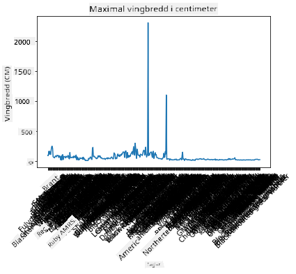
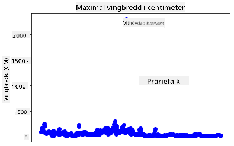
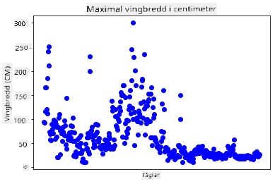
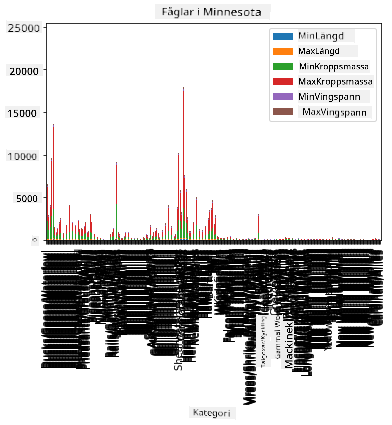
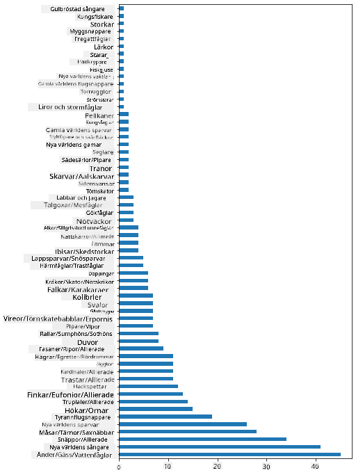
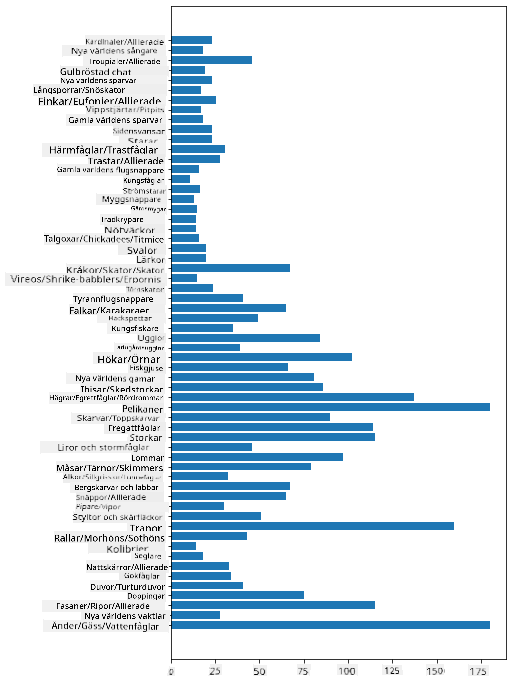
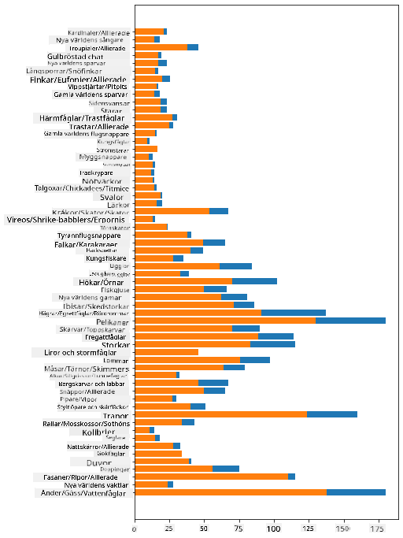

<!--
CO_OP_TRANSLATOR_METADATA:
{
  "original_hash": "69b32b6789a91f796ebc7a02f5575e03",
  "translation_date": "2025-09-04T19:04:03+00:00",
  "source_file": "3-Data-Visualization/09-visualization-quantities/README.md",
  "language_code": "sv"
}
-->
# Visualisera kvantiteter

| ](../../sketchnotes/09-Visualizing-Quantities.png)|
|:---:|
| Visualisera kvantiteter - _Sketchnote av [@nitya](https://twitter.com/nitya)_ |

I den här lektionen kommer du att utforska hur man använder ett av de många tillgängliga Python-biblioteken för att lära dig att skapa intressanta visualiseringar kring konceptet kvantitet. Genom att använda en rensad dataset om fåglar i Minnesota kan du lära dig många intressanta fakta om det lokala djurlivet.  
## [Quiz före föreläsningen](https://purple-hill-04aebfb03.1.azurestaticapps.net/quiz/16)

## Observera vingbredd med Matplotlib

Ett utmärkt bibliotek för att skapa både enkla och avancerade diagram och grafer av olika slag är [Matplotlib](https://matplotlib.org/stable/index.html). Generellt sett inkluderar processen för att plotta data med dessa bibliotek att identifiera de delar av din dataframe som du vill fokusera på, utföra nödvändiga transformationer på datan, tilldela dess x- och y-axelvärden, bestämma vilken typ av diagram som ska visas och sedan visa diagrammet. Matplotlib erbjuder ett stort utbud av visualiseringar, men för den här lektionen ska vi fokusera på de som är mest lämpliga för att visualisera kvantitet: linjediagram, spridningsdiagram och stapeldiagram.

> ✅ Använd det bästa diagrammet för att passa din datas struktur och berättelsen du vill förmedla.  
> - För att analysera trender över tid: linje  
> - För att jämföra värden: stapel, kolumn, cirkel, spridningsdiagram  
> - För att visa hur delar relaterar till en helhet: cirkel  
> - För att visa fördelning av data: spridningsdiagram, stapel  
> - För att visa trender: linje, kolumn  
> - För att visa relationer mellan värden: linje, spridningsdiagram, bubbeldiagram  

Om du har en dataset och behöver ta reda på hur mycket av en viss artikel som ingår, kommer en av de första uppgifterna att vara att inspektera dess värden.  

✅ Det finns mycket bra "fusklappar" tillgängliga för Matplotlib [här](https://matplotlib.org/cheatsheets/cheatsheets.pdf).

## Skapa ett linjediagram om fåglars vingbreddsvärden

Öppna filen `notebook.ipynb` i roten av den här lektionsmappen och lägg till en cell.

> Obs: datan finns lagrad i roten av detta repo i mappen `/data`.

```python
import pandas as pd
import matplotlib.pyplot as plt
birds = pd.read_csv('../../data/birds.csv')
birds.head()
```  
Denna data är en blandning av text och siffror:

|      | Namn                         | VetenskapligtNamn      | Kategori              | Ordning      | Familj   | Släkte      | Bevarandestatus    | MinLängd | MaxLängd | MinKroppsmassa | MaxKroppsmassa | MinVingbredd | MaxVingbredd |
| ---: | :--------------------------- | :--------------------- | :-------------------- | :----------- | :------- | :---------- | :----------------- | --------: | --------: | ----------: | ----------: | ----------: | ----------: |
|    0 | Svartbukig visslande anka    | Dendrocygna autumnalis | Ankor/Gäss/Vattenfåglar | Anseriformes | Anatidae | Dendrocygna | LC                 |        47 |        56 |         652 |        1020 |          76 |          94 |
|    1 | Färgad visslande anka        | Dendrocygna bicolor    | Ankor/Gäss/Vattenfåglar | Anseriformes | Anatidae | Dendrocygna | LC                 |        45 |        53 |         712 |        1050 |          85 |          93 |
|    2 | Snögås                      | Anser caerulescens     | Ankor/Gäss/Vattenfåglar | Anseriformes | Anatidae | Anser       | LC                 |        64 |        79 |        2050 |        4050 |         135 |         165 |
|    3 | Ross' gås                   | Anser rossii           | Ankor/Gäss/Vattenfåglar | Anseriformes | Anatidae | Anser       | LC                 |      57.3 |        64 |        1066 |        1567 |         113 |         116 |
|    4 | Större vitkindad gås         | Anser albifrons        | Ankor/Gäss/Vattenfåglar | Anseriformes | Anatidae | Anser       | LC                 |        64 |        81 |        1930 |        3310 |         130 |         165 |

Låt oss börja med att plotta några av de numeriska värdena med ett grundläggande linjediagram. Anta att du vill ha en översikt över den maximala vingbredden för dessa intressanta fåglar.

```python
wingspan = birds['MaxWingspan'] 
wingspan.plot()
```  


Vad märker du direkt? Det verkar finnas åtminstone en avvikelse - det är en ganska stor vingbredd! En vingbredd på 2300 centimeter motsvarar 23 meter - finns det Pterodactyls som strövar omkring i Minnesota? Låt oss undersöka.

Även om du snabbt kan sortera i Excel för att hitta dessa avvikelser, som förmodligen är skrivfel, fortsätt visualiseringsprocessen genom att arbeta från diagrammet.

Lägg till etiketter på x-axeln för att visa vilken typ av fåglar det handlar om:

```
plt.title('Max Wingspan in Centimeters')
plt.ylabel('Wingspan (CM)')
plt.xlabel('Birds')
plt.xticks(rotation=45)
x = birds['Name'] 
y = birds['MaxWingspan']

plt.plot(x, y)

plt.show()
```  


Även med etikettrotationen inställd på 45 grader är det för många för att läsa. Låt oss prova en annan strategi: märk endast avvikelserna och sätt etiketterna inom diagrammet. Du kan använda ett spridningsdiagram för att skapa mer utrymme för märkningen:

```python
plt.title('Max Wingspan in Centimeters')
plt.ylabel('Wingspan (CM)')
plt.tick_params(axis='both',which='both',labelbottom=False,bottom=False)

for i in range(len(birds)):
    x = birds['Name'][i]
    y = birds['MaxWingspan'][i]
    plt.plot(x, y, 'bo')
    if birds['MaxWingspan'][i] > 500:
        plt.text(x, y * (1 - 0.05), birds['Name'][i], fontsize=12)
    
plt.show()
```  
Vad händer här? Du använde `tick_params` för att dölja de nedre etiketterna och skapade sedan en loop över din dataset med fåglar. Genom att plotta diagrammet med små runda blå prickar med `bo` kontrollerade du om någon fågel hade en maximal vingbredd över 500 och visade deras etikett bredvid pricken om så var fallet. Du försköt etiketterna lite på y-axeln (`y * (1 - 0.05)`) och använde fågelns namn som etikett.

Vad upptäckte du?

  
## Filtrera din data

Både den vithövdade örnen och präriefalken, som förmodligen är mycket stora fåglar, verkar vara felmärkta, med ett extra `0` tillagt till deras maximala vingbredd. Det är osannolikt att du möter en vithövdad örn med en vingbredd på 25 meter, men om så är fallet, låt oss veta! Låt oss skapa en ny dataframe utan dessa två avvikelser:

```python
plt.title('Max Wingspan in Centimeters')
plt.ylabel('Wingspan (CM)')
plt.xlabel('Birds')
plt.tick_params(axis='both',which='both',labelbottom=False,bottom=False)
for i in range(len(birds)):
    x = birds['Name'][i]
    y = birds['MaxWingspan'][i]
    if birds['Name'][i] not in ['Bald eagle', 'Prairie falcon']:
        plt.plot(x, y, 'bo')
plt.show()
```  

Genom att filtrera bort avvikelser är din data nu mer sammanhängande och begriplig.

  

Nu när vi har en renare dataset åtminstone när det gäller vingbredd, låt oss upptäcka mer om dessa fåglar.

Medan linje- och spridningsdiagram kan visa information om datavärden och deras fördelningar, vill vi tänka på värdena som är inneboende i denna dataset. Du kan skapa visualiseringar för att besvara följande frågor om kvantitet:

> Hur många kategorier av fåglar finns det, och vad är deras antal?  
> Hur många fåglar är utdöda, hotade, sällsynta eller vanliga?  
> Hur många finns det av de olika släkten och ordningar enligt Linnés terminologi?  
## Utforska stapeldiagram

Stapeldiagram är praktiska när du behöver visa grupperingar av data. Låt oss utforska kategorierna av fåglar som finns i denna dataset för att se vilken som är den vanligaste till antalet.

I notebook-filen, skapa ett grundläggande stapeldiagram.

✅ Obs, du kan antingen filtrera bort de två avvikande fåglarna vi identifierade i föregående avsnitt, redigera skrivfelet i deras vingbredd eller lämna dem kvar för dessa övningar som inte beror på vingbreddsvärden.

Om du vill skapa ett stapeldiagram kan du välja den data du vill fokusera på. Stapeldiagram kan skapas från rådata:

```python
birds.plot(x='Category',
        kind='bar',
        stacked=True,
        title='Birds of Minnesota')

```  
  

Detta stapeldiagram är dock oläsligt eftersom det finns för mycket icke-grupperad data. Du behöver välja endast den data du vill plotta, så låt oss titta på fåglarnas längd baserat på deras kategori.  

Filtrera din data för att endast inkludera fågelns kategori.  

✅ Observera att du använder Pandas för att hantera datan och sedan låter Matplotlib göra diagrammet.

Eftersom det finns många kategorier kan du visa detta diagram vertikalt och justera dess höjd för att rymma all data:

```python
category_count = birds.value_counts(birds['Category'].values, sort=True)
plt.rcParams['figure.figsize'] = [6, 12]
category_count.plot.barh()
```  
  

Detta stapeldiagram visar en bra översikt över antalet fåglar i varje kategori. På ett ögonblick ser du att det största antalet fåglar i denna region tillhör kategorin Ankor/Gäss/Vattenfåglar. Minnesota är "landet med 10 000 sjöar" så det är inte förvånande!

✅ Prova några andra räkningar på denna dataset. Överraskar något dig?

## Jämföra data

Du kan prova olika jämförelser av grupperad data genom att skapa nya axlar. Prova en jämförelse av MaxLängd för en fågel, baserat på dess kategori:

```python
maxlength = birds['MaxLength']
plt.barh(y=birds['Category'], width=maxlength)
plt.rcParams['figure.figsize'] = [6, 12]
plt.show()
```  
  

Inget är förvånande här: kolibrier har den minsta MaxLängden jämfört med pelikaner eller gäss. Det är bra när data är logisk!

Du kan skapa mer intressanta visualiseringar av stapeldiagram genom att lägga data ovanpå varandra. Låt oss lägga Minimum och Maximum Length ovanpå en given fågelkategori:

```python
minLength = birds['MinLength']
maxLength = birds['MaxLength']
category = birds['Category']

plt.barh(category, maxLength)
plt.barh(category, minLength)

plt.show()
```  
I detta diagram kan du se intervallet per fågelkategori för Minimum Length och Maximum Length. Du kan med säkerhet säga att, baserat på denna data, ju större fågeln är, desto större är dess längdintervall. Fascinerande!

  

## 🚀 Utmaning

Denna dataset om fåglar erbjuder en mängd information om olika typer av fåglar inom ett specifikt ekosystem. Sök runt på internet och se om du kan hitta andra dataset om fåglar. Öva på att bygga diagram och grafer kring dessa fåglar för att upptäcka fakta du inte kände till.

## [Quiz efter föreläsningen](https://ff-quizzes.netlify.app/en/ds/)

## Granskning & Självstudier

Denna första lektion har gett dig viss information om hur man använder Matplotlib för att visualisera kvantiteter. Gör lite forskning kring andra sätt att arbeta med dataset för visualisering. [Plotly](https://github.com/plotly/plotly.py) är ett som vi inte kommer att täcka i dessa lektioner, så ta en titt på vad det kan erbjuda.  
## Uppgift

[Linjer, Spridningar och Staplar](assignment.md)  

---

**Ansvarsfriskrivning**:  
Detta dokument har översatts med hjälp av AI-översättningstjänsten [Co-op Translator](https://github.com/Azure/co-op-translator). Även om vi strävar efter noggrannhet, bör du vara medveten om att automatiserade översättningar kan innehålla fel eller felaktigheter. Det ursprungliga dokumentet på dess ursprungliga språk bör betraktas som den auktoritativa källan. För kritisk information rekommenderas professionell mänsklig översättning. Vi ansvarar inte för eventuella missförstånd eller feltolkningar som uppstår vid användning av denna översättning.